# 第3章 浅层神经网络 - Shallow neural networks

第[2章](#_bookmark39)介绍了使用一维线性回归的监督学习。然而，这个模型只能将输入/输出关系描述为一条直线。本章介绍浅层神经网络。这些网络可以描述分段线性函数，并且足够表达多维输入和输出之间任意复杂的关系。

## 3.1 神经网络示例 - Neural network example

浅层神经网络是具有参数 $ \mathbf{ϕ} $ 的函数 $ \mathbf{y}=f[\mathbf{x},\mathbf{ϕ}] $ ，将多变量输入 $ \mathbf{x} $ 映射到多变量输出 $ \mathbf{y} $ 。我们将在第[3.4节](#_bookmark82)中给出完整的定义，并使用一个示例网络 $ f[\mathbf{x},\mathbf{ϕ}] $ 来介绍主要思想，该网络将标量输入 $ \mathbf{x} $ 映射到标量输出 $ \mathbf{y} $ ，并具有十个参数 $ \mathbf{ϕ}=\{\mathbf{ϕ}_{0},\mathbf{ϕ}_{1},\mathbf{ϕ}_{2},\mathbf{ϕ}_{3},\mathbf{θ}_{10},\mathbf{θ}_{11},\mathbf{θ}_{20},\mathbf{θ}_{21},\mathbf{θ}_{30},\mathbf{θ}_{31}\} $ ：

$$
\begin{array}{rcl}y&=&\mathrm{f}[x,\phi]\\&=&\phi_0+\phi_1\mathrm{a}[\theta_{10}+\theta_{11}x]+\phi_2\mathrm{a}[\theta_{20}+\theta_{21}x]+\phi_3\mathrm{a}[\theta_{30}+\theta_{31}x]\end{array} \tag{3.1}
$$

我们可以将这个计算分解为三个部分：
* 首先，我们计算输入数据的三个线性函数 $ ( θ_{10} + θ_{11}x , θ_{20} + θ_{21}x, 和 θ_{30} + θ_{31}x ) $ 。
* 其次，我们将这三个函数的结果传递入一个激活函数 $ a[•] $ 。
* 最后，我们用 $ ϕ_1 $ 、 $ ϕ_2 $ 和 $ ϕ_3 $ 加权这三个得到的激活值，将它们相加，并加上一个偏移量 $ ϕ_0 $ 。

为了完整地描述，我们需要定义激活函数 $ a[•] $ 。激活函数有很多选择，但最常见的选择是_ReLU_（修正线性单元）：

$$
\operatorname{a}[z]=\operatorname{ReLU}[z]=\begin{cases}0&\quad z<0\\z&\quad z\geq0\end{cases}.\tag{3.2}
$$

当输入为正时，它返回输入值，否则返回零（图[3.1](#_bookmark66)）。

在函数3.1中，输入/输出的关系很可能表示得不是很明显。

很显然，方程[3.1](#_bookmark64)所表示的输入/输出关系集合并不明显。然而，前一章的思想仍然适用。方程[3.1](#_bookmark64)代表了一个函数集合，其中具体的成员取决于参数向量$\mathbf{ϕ}$中的十个参数。如果我们知道这些参数，我们可以通过对给定输入 $ \mathbf{x} $ 求解方程来进行推理（预测 $ \mathbf{y} $ ）。给定训练数据集$\{x_i,y_i\}_{i=1}^I$，我们可以定义一个最小二乘损失函数$L[\mathbf{ϕ}]$，并使用它来衡量模型在给定参数值$\mathbf{ϕ}$下对数据集的描述效果。在训练模型时，我们在寻找最小化该损失的参数值$\hat{\theta}$。

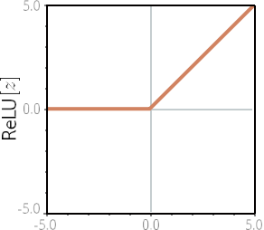
> 图3.1 修正线性单元（ReLU）。这个激活函数在输入小于零时返回零，在输入大于等于零时返回输入值。换句话说，它将负值截断为零。注意，还有许多其他可能的激活函数选择（见图[3.13](#_bookmark94)），但ReLU是最常用和最容易理解的。

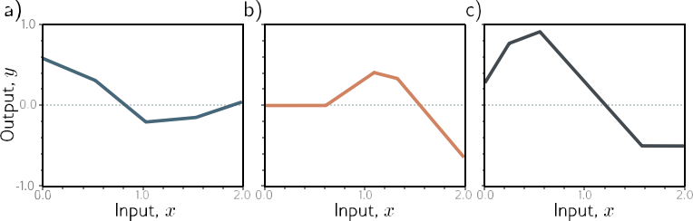
> 图3.2 方程[3.1.](#_bookmark64)定义的函数集合。a–c）三种不同参数 $ \mathbf{ϕ} $ 的十个选择的函数。在每种情况下，输入/输出关系是分段线性的。然而，连接点的位置、线性区域之间的斜率和整体高度是不同的。

### 3.1.1 神经网络直观理解 - Neural network intuition

实际上，方程[3.1](#_bookmark64)表示了一个具有最多四个线性区域的连续分段线性函数的集合（图[3.2](#_bookmark67)）。我们现在将方程[3.1](#_bookmark64)分解，并展示它描述这个函数集合的原因。为了更容易理解，我们将函数分为两部分。首先，我们引入中间量：

$$
\begin{array}{rcl}h_1&=&\mathrm{a}[\theta_{10}+\theta_{11}x]\\h_2&=&\mathrm{a}[\theta_{20}+\theta_{21}x]\\h_3&=&\mathrm{a}[\theta_{30}+\theta_{31}x]\end{array}\tag{3.3}
$$

其中，我们将 $ h_1 $ 、 $ h_2 $ 和 $ h_3 $ 称为隐藏单元。其次，我们通过将这些隐藏单元与线性函数相结合来计算输出：[1](#_bookmark71)

$$
y=\phi_0+\phi_1h_1+\phi_2h_2+\phi_3h_3\tag{3.4}
$$

图[3.3](#_bookmark72)显示了创建图[3.2a](#_bookmark67)中的函数的计算流程。每个隐藏单元包含一个输入的线性函数 $ θ_{•0} + θ_{•1}x $ ，并且该线条在ReLU函数 $  a[•] $ 下方被截断。这三条线在零点相交的位置成为最终输出中的三个“连接点”。然后，这三条被截断的线分别由 $ ϕ_1 $ 、 $ ϕ_2 $ 和 $ ϕ_3 $ 加权。最后，添加偏移量 $ ϕ_0 $ ，控制最终函数的整体高度。

图[3.3j](#_bookmark72)中的每个线性区域对应于隐藏单元中的不同激活模式。当一个单元被截断时，我们称之为“非活跃”，当一个单元没有被截断时，我们称之为“活跃”。例如，阴影区域接收到 $ h_1 $ 和 $ h_3 $ 的贡献（它们是活跃的），但没有 $ h_2 $ 的贡献（它是非活跃的）。每个线性区域的斜率由（i）该区域的活跃输入的原始斜率 $ θ_{•1} $ 和（ii）随后应用的权重 $ ϕ_• $ 决定。例如，阴影区域中的斜率（见问题[3.3](#_bookmark98)）是 $ θ_{11}ϕ_1 + θ_{31}ϕ_3 $ ，其中第一项是面板（ $ g $ ）中的斜率，第二项是面板（ $ i $ ）中的斜率。

每个隐藏单元对函数贡献一个“连接点”，因此在三个隐藏单元的情况下，可以有四个线性区域。然而，这些区域的斜率中只有三个是独立的；第四个斜率要么为零（如果所有隐藏单元在该区域中都是非活跃的），要么是来自其他区域的斜率之和。

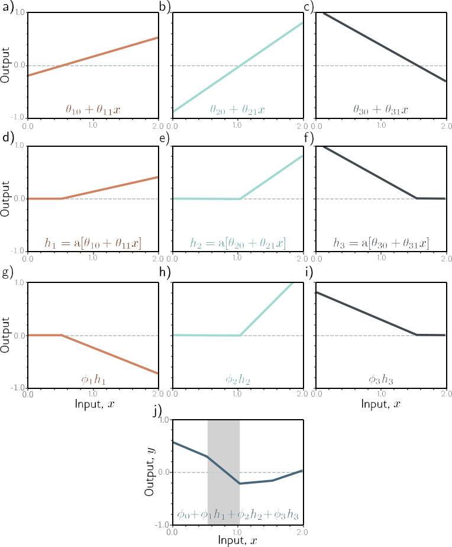
> 图3.3 图[3.2a](#_bookmark67)中函数的计算过程。
> * a–c ) 输入 $ \mathbf{x} $ 经过三个具有不同y截距 $ θ_{•0} $ 和斜率 $ θ_{•1} $ 的线性函数。
> * d–f ) 每条线通过ReLU激活函数，将负值截断为零。
> * g–i ) 三条被截断的线分别由 $ ϕ_1 $ 、 $ ϕ_2 $ 和 $ ϕ_3 $ 加权（缩放）。
> * j ) 最后，被截断和加权的函数求和，并添加一个控制高度的偏移量 $ ϕ_0 $ 。
> 四个线性区域中的每一个对应于隐藏单元中的不同激活模式。在阴影区域中， $ h_2 $ 是非活跃的（被截断），但 $ h_1 $ 和 $ h_3 $ 都是活跃的。

> 在本书中，线性函数的形式为 $ z^{\prime}=\phi_0+\sum_i\phi_{iZ_i} $ 。任何其他类型的函数都是非线性的。例如，ReLU函数（方程[3.2](#_bookmark65)）和包含它的示例神经网络（方程[3.1](#_bookmark64)）都是非线性的。有关进一步澄清，请参见本章末尾的注释。

### 3.1.2 描绘神经网络 - Depicting neural networks

我们一直在讨论一个具有一个输入、一个输出和三个隐藏单元的神经网络。我们在图[3.4a](#_bookmark74)中可视化了这个网络。输入在左侧，隐藏单元在中间，输出在右侧。每个连接代表十个参数之一。为了简化这个表示，我们通常不绘制截距参数，因此这个网络通常被描绘为图[3.4b](#_bookmark74)中的样子。

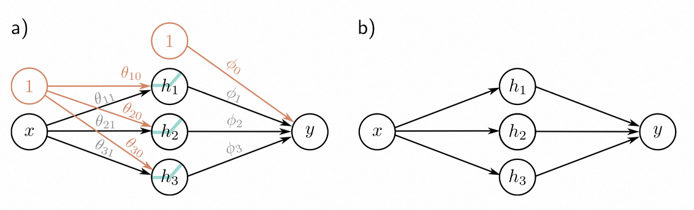
> 图3.4 描绘神经网络。
> * a) 输入 $ \mathbf{x} $ 在左侧，隐藏单元 $ h_1 $ 、 $ h_2 $ 和 $ h_3 $ 在中间，输出 $ \mathbf{y} $ 在右侧。计算从左到右进行。输入用于计算隐藏单元，然后将它们组合以创建输出。每个箭头代表一个参数（橙色为截距，黑色为斜率）。每个参数将乘以对应的源函数，并将把结果添加到目标值中。例如，我们将参数 $ ϕ_1 $ 乘以源函数 $ h_1 $ 并将其加到 $ \mathbf{y} $ 上。我们引入的节点（橙色圆圈）将偏移量纳入此方案里，因此我们将参数 $ ϕ_0 $ 乘以1（没有影响）并将其加到 $ \mathbf{y} $上 。ReLU函数应用于隐藏单元。
> * b) 更常见的做法是省略截距、ReLU函数和参数名称；这种更简单的表示方法代表了相同的网络。
## 3.2 通用逼近定理 - Universal approximation theorem

在前一节中，我们介绍了一个具有一个输入、一个输出、ReLU激活函数和三个隐藏单元的示例神经网络。现在让我们稍微推广一下，考虑具有 $ \mathbf{D} $ 个隐藏单元的情况，其中第 $ d $ 个隐藏单元为：

$$
h_d=\text{a}[\theta_{d0}+\theta_{d1}x]\tag{3.5}
$$

并且这些隐藏单元线性组合以创建输出：
$$
y=\phi_0+\sum_{d=1}^D\phi_dh_d.\tag{3.6}
$$

浅层网络中隐藏单元的数量是网络容量的度量。使用ReLU激活函数，具有 $ \mathbf{D} $ 个隐藏单元的网络的输出最多具有 $ \mathbf{D} $ 个连接点，因此是一个具有最多 $ D+1 $ 个线性区域的分段线性函数。随着我们添加更多的隐藏单元，模型可以逼近更复杂的函数。

事实上，具有足够容量（隐藏单元）的浅层网络可以以任意精度描述定义在实数线的紧致子集上的任何连续 $1D$ 函数。为了看到这一点，考虑到每次我们添加一个隐藏单元，我们就为函数添加了一个线性区域。随着这些区域变得更多，它们代表函数的更小的部分，这些部分越来越接近于一条线（图[3.5](#_bookmark76)）。通用逼近定理证明了对于任何连续函数，存在一个浅层网络可以以任意指定的精度逼近该函数。

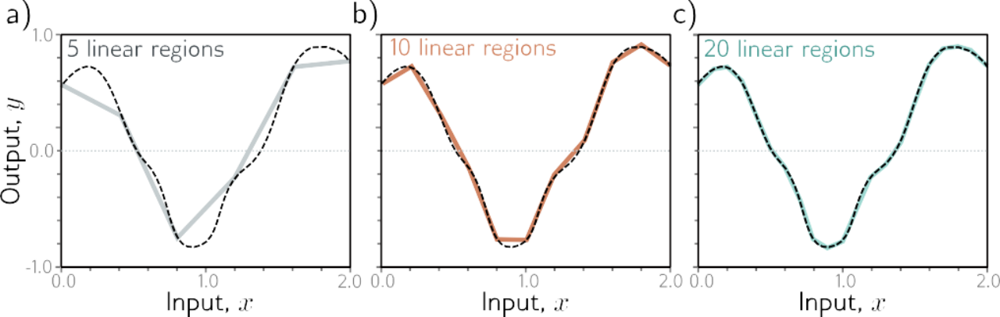
> 图3.5 通过分段线性模型逼近1D函数（虚线）。
> * a-c) 随着区域数量的增加，模型越来越接近连续函数。具有标量输入的神经网络为每个隐藏单元创建一个额外的线性区域。通用逼近定理证明，具有足够隐藏单元的浅层神经网络可以以任意指定精度描述定义在 $ \mathbb{R}^{D_i} $ 的紧致子集上的任何给定连续函数。

## 3.3 多变量输入和输出 - Multivariate inputs and outputs

在上面的例子中，网络具有单个标量输入 $ \mathbf{x} $ 和单个标量输出 $ \mathbf{y} $ 。然而，通用逼近定理也适用于更一般的情况，即网络将多变量输入 $ \mathbf{x}=[x_1,x_2,\ldots,x_{D_i}]^T $ 映射到多变量输出预测 $ \mathbf{y}=[y_1,y_2,\ldots,y_{D_o}]^T $ 。我们首先探讨如何扩展模型以预测多变量输出。然后我们考虑多变量输入。最后，在第[3.4节](#_bookmark82)中，我们提出了浅层神经网络的一般定义。

### 3.3.1 可视化多变量输出 - Visualizing multivariate outputs

要将网络扩展到多变量输出 $ \mathbf{y} $ ，我们只需为每个输出使用不同的隐藏单元的线性函数。因此，具有标量输入 $ \mathbf{x} $ 、四个隐藏单元 $ h_1 $ 、 $ h_2 $ 、 $ h_3 $ 和 $ h_4 $ 以及 $2D$ 多变量输出 $ \mathbf{y}=[y_1,y_2]^T $ 的网络可以定义为：
$$
\begin{aligned}h_1&=&\text{a}[\theta_{10}+\theta_{11}x]\\h_2&=&\text{a}[\theta_{20}+\theta_{21}x]\\h_3&=&\text{a}[\theta_{30}+\theta_{31}x]\\h_4&=&\text{a}[\theta_{40}+\theta_{41}x]\end{aligned}\tag{3.7}
$$

和
$$
\begin{aligned}y_1&=&\phi_{10}+\phi_{11}h_1+\phi_{12}h_2+\phi_{13}h_3+\phi_{14}h_4\\y_2&=&\phi_{20}+\phi_{21}h_1+\phi_{22}h_2+\phi_{23}h_3+\phi_{24}h_4\end{aligned}\tag{3.8}
$$

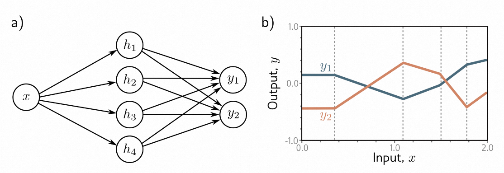
> 图3.6 具有一个输入、四个隐藏单元和两个输出的网络。
> * a) 网络结构的可视化。
> * b) 该网络产生两个分段线性函数 $ y_1^{[x]} $ 和 $ y_2^{[x]} $ 。这些函数的四个“连接点”（在垂直虚线处）被限制在相同的位置，因为它们共享相同的隐藏单元，但斜率和整体高度可能不同。

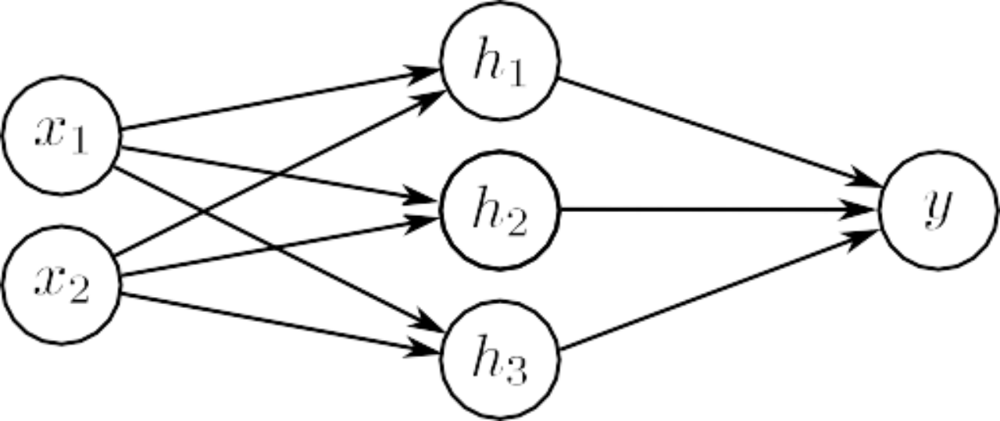
> 图3.7 具有 $2D$ 多变量输入 $ \mathbf{x}=[x_1,x_2]^T $ 和标量输出 $ \mathbf{y} $ 的神经网络的可视化。

这两个输出是隐藏单元的两个不同的线性函数。

正如我们在图[3.3](#_bookmark72)中看到的，分段函数中的“连接点”取决于初始线性函数 $ θ_{•0} + θ_{•1}x $ 在隐藏单元处被ReLU函数 $ a[•] $ 剪切的位置。由于输出 $ y_1 $ 和 $ y_2 $ 都是相同的四个隐藏单元的不同线性函数，每个输出中的四个“连接点”必须在相同的位置。然而，线性区域的斜率和整体垂直偏移可以不同（图[3.6](#_bookmark78)）。
### 3.3.2 可视化多变量输入 - Visualizing multivariate inputs

为了处理多变量输入 $ \mathbf{x} $ ，我们扩展了输入和隐藏单元之间的线性关系。因此，一个具有两个输入 $ x = [ x_1,  x_2 ]^T $ 和一个标量输出 $ \mathbf{y} $ 的网络（图[3.7](#_bookmark79)）可以由以下三个隐藏单元定义：

$$
\begin{aligned}h_1&=&\text{a}[\theta_{10}+\theta_{11}x_1+\theta_{12}x_2]\\h_2&=&\text{a}[\theta_{20}+\theta_{21}x_1+\theta_{22}x_2]\\h_3&=&\text{a}[\theta_{30}+\theta_{31}x_1+\theta_{32}x_2]\end{aligned}\tag{3.9}
$$

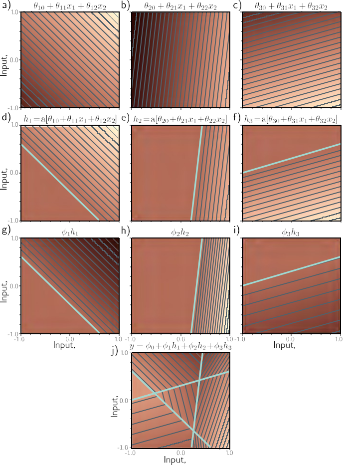
> 图3.8 具有两个输入 $ x = [ x_1,  x_2 ]^T $ ，三个隐藏单元 $ h_1 $ ， $ h_2 $ ， $ h_3 $ 和一个输出 $ \mathbf{y} $ 的网络的处理过程。
> * a–c ) 每个隐藏单元的输入是两个输入的线性函数，对应于一个定向平面。亮度表示函数输出。例如，在面板(a)中，亮度表示 $θ_{10} + θ_{11}x_1 + θ_{12}x_2 $。细线是等高线。
> * d–f ) 每个平面都被ReLU激活函数剪切（青色线相当于图[3.3d–f](#_bookmark80)中的“接头”）。
> * g-i ) 剪切的平面然后加权，
> * j ) 与一个偏移量相加，该偏移量确定了表面的整体高度。结果是由凸多边形区域组成的连续表面。

其中，现在每个输入都有一个斜率参数。隐藏单元按照通常的方式组合形成输出：

$$
y=\phi_0+\phi_1h_1+\phi_2h_2+\phi_3h_3\tag{3.10}
$$

图[3.8](#_bookmark80)说明了该网络的处理过程。每个隐藏单元接收两个输入的线性组合，形成了三维输入/输出空间中的一个定向平面。激活函数将这些平面的负值剪切为零。剪切的平面然后在第二个线性函数（方程[3.10](#_bookmark81)）中重新组合，创建了一个由凸多边形区域组成的连续分段线性表面（图[3.8j](#_bookmark80)）。每个区域对应于不同的激活模式。例如，在中央三角形区域中，第一个和第三个隐藏单元是活跃的，而第二个隐藏单元是非活跃的。

当模型的输入超过两个时，可视化变得困难。然而，解释方式是类似的。输出将是输入的连续分段线性函数，其中线性区域现在是多维输入空间中的凸多面体。

请注意，随着输入维度的增加，线性区域的数量迅速增加（图[3.9](#_bookmark84)）。为了对增长速度有所了解，考虑每个隐藏单元定义一个超平面，将该单元在其中活跃和不活跃的空间部分分开（图[3.10](#_bookmark85)中的青色线）。如果我们有与输入维度 $ D_i $ 相同数量的隐藏单元，我们可以将每个超平面与一个坐标轴对齐（图[3.10](#_bookmark85)）。对于两个输入维度，这将把空间分为四个象限。对于三个维度，这将创建八个八分体，对于 $ D_i $ 维度，这将创建 $ 2^{D_{i}} $ 个正交体。浅层神经网络通常具有比输入维度更多的隐藏单元，因此它们通常会创建超过 $ 2^{D_{i}} $ 个线性区域。
## 3.4 浅层神经网络：一般情况 - Shallow neural networks: general case

我们已经描述了几个示例浅层网络，以帮助我们对它们的工作原理有直观的理解。现在我们定义一个一般的浅层神经网络方程  $ \mathbf{y}=f[\mathbf{x},\mathbf{ϕ}] $ ，它将多维输入  $ x\in\mathbb{R}^{D_{i}} $  映射到多维输出  $ y\in\mathbb{R}^{D_{o}} $ ，使用  $ h\in\mathbb{R}^{D} $  个隐藏单元。每个隐藏单元的计算方式如下：

$$
h_d=\text{a}\left[\theta_{d0}+\sum_{i=1}^{D_i}\theta_{di}x_i\right],\tag{3.11}
$$

然后将它们线性组合以创建输出：

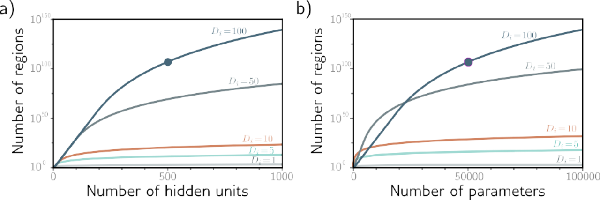
> 图3.9 线性区域与隐藏单元。
> * a ) 不同输入维度 $ D_i $  = {1, 5, 10, 50, 100}时，隐藏单元数量与最大可能区域的关系。在高维度下，区域数量迅速增加；当隐藏单元数量为500个，输入大小为100时，可能存在超过 $ 10^{107} $ 个区域（实心圆）。
> * b ) 同样的数据以参数数量为横坐标进行绘制。实心圆表示与图(a)中相同的模型，具有500个隐藏单元。该网络有51,001个参数，在当下的标准下，算是非常小的模型。

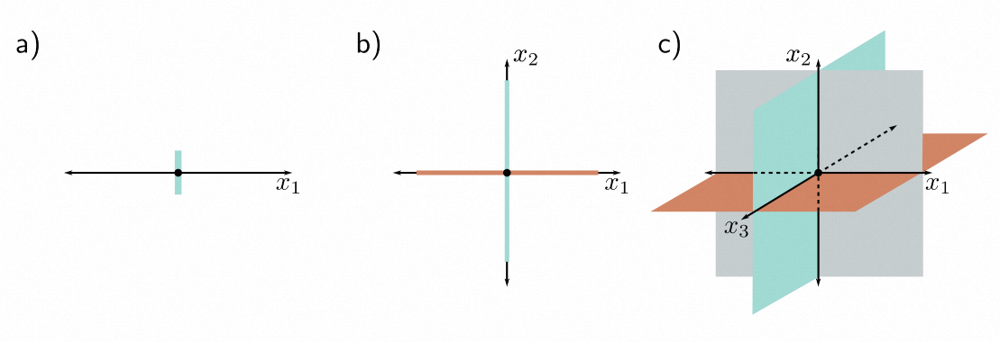
> 图3.10 线性区域数量与输入维度的关系。
> * a ) 在单个输入维度下，具有一个隐藏单元的模型可以创建一个联合，将轴分为两个线性区域。
> * b ) 在两个输入维度下，具有两个隐藏单元的模型可以使用两条线（与轴对齐）将输入空间划分为四个区域。
> * c ) 在三个输入维度下，具有三个隐藏单元的模型可以使用三个平面（同样与轴对齐）将输入空间划分为八个区域。
> 根据这个推理，可以得出一个具有 $ D_i $ 输入维度和 $ D_i $ 隐藏单元的模型可以使用 $ D_i $ 个超平面将输入空间划分为 $ 2^{D_{i}} $ 个线性区域。

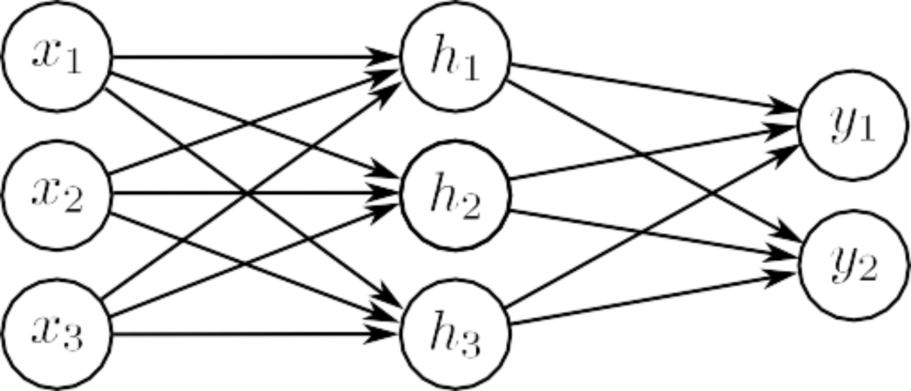
> 图3.11 三个输入和两个输出的神经网络可视化。该网络有20个参数。有15个斜率（由箭头表示）和5个偏移（未显示）。

$$
\begin{aligned}y_j&=\phi_{j0}+\sum_{d=1}^D\phi_{jd}h_d,\end{aligned}\tag{3.12}
$$

其中  $ a[•] $  是非线性激活函数。该模型具有参数  $ ϕ = \{θ_{••}, ϕ_{••}\} $ 。图[3.11](#_bookmark87)展示了一个具有三个输入、三个隐藏单元和两个输出的示例。

激活函数允许模型描述输入和输出之间的非线性关系，因此它本身必须是非线性的；如果没有激活函数或者使用线性激活函数，整体从输入到输出的映射将被限制为线性。已经尝试了许多不同的激活函数（参见图[3.13](#_bookmark94)），但最常见的选择是ReLU（图[3.1](#_bookmark66)），它具有易于解释的优点。使用ReLU激活函数，网络将输入空间划分为由ReLU函数中的“连接”计算的超平面的交点定义的凸多面体。每个凸多面体包含一个不同的线性函数。对于每个输出来说，这些多面体是相同的，但它们包含的线性函数可能不同。
## 3.5 术语 - Terminology

我们通过引入一些术语来总结本章。遗憾的是，神经网络有很多相关的术语。它们通常以“层(layer)”来描述。图[3.12](#_bookmark91)的左边是“输入层（input layer）”，中间是“隐藏层（hidden layer）”，右边是“输出层（output layer）”。我们可以说图[3.12](#_bookmark91)中的网络有一个包含四个隐藏单元的隐藏层。隐藏单元本身有时被称为“神经元（neurons）”。当我们通过网络传递数据时，隐藏层输入的值（即在应用ReLU函数之前）被称为“预激活（pre-activations）”。隐藏层的值（即在应用ReLU函数之后）被称为“激活(activations)”。

由于历史原因，至少有一个隐藏层的神经网络也被称为“多层感知机(multi-layer perceptron)”，简称为“MLP”。具有一个隐藏层的网络（如本章所述）有时被称为“浅层神经网络(shallow neural networks)”。具有多个隐藏层的网络（如下一章所述）被称为“深层神经网络（deep neural networks）”。连接形成非循环图的神经网络（即本章中的所有示例）被称为“前馈网络(feed-forward networks)”。如果一层中的每个元素都连接到下一层中的每个元素（如本章中的所有示例），则网络是“全连接(fully connected)”的。这些连接表示基础方程中的斜率参数，并被称为“网络权重（network weights）”。偏移参数（图[3.12](#_bookmark91)中未显示）称为“偏置(biases)”。

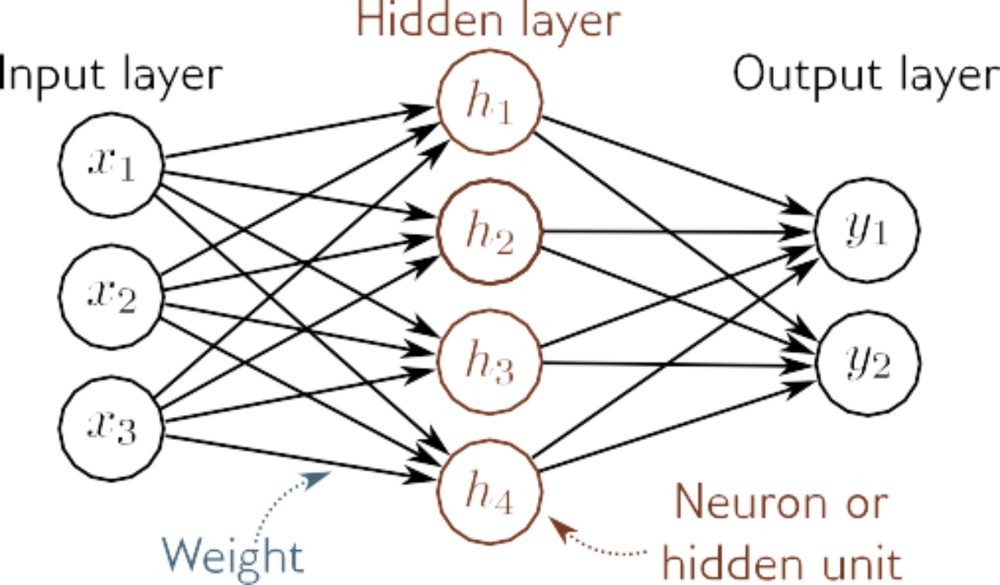
> 图3.12 术语。浅层网络(shallow neural networks)由输入层(input layer)、隐藏层(hidden layer)和输出层(output layer)组成。每一层通过前向连接（箭头）与下一层相连。因此，这些模型被称为前馈网络(feed-forward networds)。当一层中的每个变量都连接到下一层中的每个变量时，我们称之为全连接网络(fully connected)。每个连接表示基础方程中的斜率参数，这些参数被称为权重(weights)。隐藏层中的变量称为神经元(neural)或隐藏单元(hidden unit)。输入到隐藏单元的值称为预激活(pre-activations)，隐藏单元的值（即应用ReLU函数之后）称为激活(activations)。

## 3.6 总结 - Summary

浅层神经网络有一个隐藏层。它们（i）计算输入的多个线性函数，（ii）将每个结果通过激活函数传递，然后（iii）将这些激活的线性组合形成输出。浅层神经网络根据输入 $ \mathbf{x} $ 对输入空间进行连续的分段线性区域划分来进行预测 $ \mathbf{y} $ 。通过足够多的隐藏单元（神经元），浅层神经网络可以以任意精度逼近任何连续函数。

第[4](#_bookmark112)章讨论了深层神经网络，它通过添加更多的隐藏层扩展了本章的模型。第[5-7](#_bookmark258)章介绍了如何训练这些模型。
## 注意事项

**“神经”网络（Neural Networks）：** 如果本章中的模型只是函数，为什么它们被称为“神经网络”呢？不幸的是，这种联系很脆弱。像图[3.12](#_bookmark91)这样的可视化图表由节点（输入、隐藏单元和输出）组成，它们之间密集地相互连接。这与哺乳动物大脑中的神经元也有一定的相似之处，后者也具有密集的连接。然而，几乎没有证据表明大脑计算的工作方式与神经网络相同，因此在未来的研究中，将生物学与神经网络联系在一起是没有帮助的。

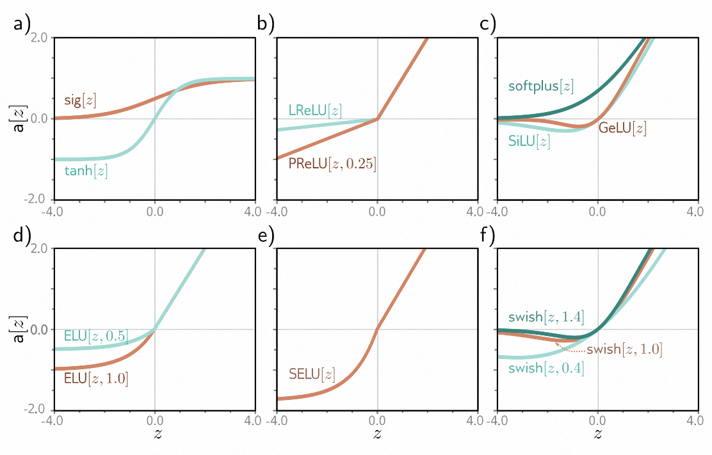
> 图3.13 激活函数。
> * a) 逻辑sigmoid和双曲正切函数。
> * b) Leaky ReLU和带参数0.25的参数化ReLU。
> * c) SoftPlus、高斯误差线性单元和sigmoid线性单元。
> * d) 带参数0.5和1的指数线性单元。
> * e) 缩放指数线性单元。
> * f) 带参数0.4、1.0和1.4的Swish。

**神经网络的历史（History of neural networks）：** [McCulloch＆Pitts](#_bookmark1900)（1943）首次提出了人工神经元的概念，它将输入组合起来产生输出，但该模型没有实用的学习算法。[Rosenblatt](#_bookmark2079)（1958）开发了感知机，它线性地组合输入，然后对它们进行阈值处理以做出是/否决策。他还提供了一个从数据中学习权重的算法。[Minsky＆Papert](#_bookmark1927)（1969）认为线性函数对于一般的分类问题是不足够的，但是添加具有非线性激活函数的隐藏层（因此称为多层感知机）可以允许学习更一般的输入/输出关系。然而，他们得出结论，Rosenblatt的算法无法学习这种模型的参数。直到20世纪80年代才开发出了一个实用的算法（反向传播，参见第[7章](#_bookmark258)），并且对神经网络的重要工作重新开始。神经网络的历史由[Kurenkov](#_bookmark1774)（2020）、[Sejnowski](#_bookmark2116)（2018）和[Schmidhuber](#_bookmark2121)（2022）书写。

**激活函数（Activation functions）：** ReLU函数早在[Fukushima](#_bookmark1536)（1969）时就被使用过。然而，在神经网络的早期，更常见的是使用逻辑sigmoid或双曲正切激活函数（图[3.13a](#_bookmark94)）。ReLU函数在[Jarrett等人](#_bookmark1709)（2009）、[Nair＆Hinton](#_bookmark1959)（2010）和[Glorot等人](#_bookmark1557)（2011）的推动下重新流行起来，并成为现代神经网络成功的重要组成部分。它具有一个很好的性质，即对于大于零的输入，输出相对于输入的导数始终为1。这有助于训练的稳定性和效率（参见第[7章](#_bookmark258)），与sigmoid激活函数的导数相比，后者在大正和大负输入时饱和（接近于零）。

然而，ReLU函数的缺点是它的导数在负输入时为零。如果所有的训练样本都产生负输入给定的ReLU函数，那么我们在训练过程中无法改进输入到该ReLU的参数。相对于传入权重的梯度在局部是平坦的，因此我们无法“下山”。这被称为“死亡ReLU问题”。已经提出了许多解决这个问题的ReLU变体（图[3.13b](#_bookmark94)），包括
* （i）Leaky ReLU（[Maas等人](#_bookmark1876)，[2013年](#_bookmark1876)），它对于负值也具有线性输出，但斜率较小为0.1
* （ii）The parameterized ReLU（[He等人](#_bookmark1616)，[2015年](#_bookmark1616)），它将负部分的斜率视为未知参数
* （iii）The concatenated ReLU（[Shang等人](#_bookmark2127)，[2016年](#_bookmark2127)），它产生两个输出，一个在零以下截断（即像典型的ReLU一样），一个在零以上截断。

还研究了各种平滑函数（图[3.13c-d)](#_bookmark94)，包括softplus函数（Glorot et al.，2011年），高斯误差线性单元（Hendrycks＆Gimpel，2016年），sigmoid线性单元（Hendrycks＆Gimpel，2016年）和指数线性单元（Clevert et al.，2015年）。其中大部分是为了避免ReLU激活函数的“死亡”问题，同时限制负值的梯度。Klambauer等人（2017年）引入了缩放指数线性单元（图[3.13e)](#_bookmark94)，这个函数在输入方差有限范围时有助于稳定激活的方差（见第7.5节）。Ramachandran等人（2017年）采用了经验方法来选择激活函数。他们在可能的函数空间中搜索，找到在各种监督学习任务中表现最佳的函数。最优函数被发现是 $ a[x] = x/(1 + exp[ -βx ]) $ ，其中 $ β $ 是一个学习参数（图[3.13f](#_bookmark94)）。他们将这个函数称为Swish。有趣的是，这是Hendrycks＆Gimpel（2016年）和Elfwing等人（2018年）之前提出的激活函数的重新发现。Howard等人（2019年）通过HardSwish函数近似Swish，它的形状非常相似，但计算速度更快。

$$
\text{HardSwish}[z]=\begin{cases}0&\quad z<-3\\z(z+3)/6&\quad-3\leq z\leq3\\z&\quad z>3\end{cases}.\tag{3.13}
$$

对于这些激活函数中哪个更优，目前还没有明确的答案。然而，leaky ReLU、parameterized ReLU和许多连续函数在特定情况下可以提供比ReLU更好的性能。在本书的剩余部分，我们将重点关注具有基本ReLU函数的神经网络，因为它们易于根据线性区域的数量来描述所创建的函数。

**通用逼近定理（Universal approximation theorem:）：** 该定理的“宽度版本”表明，存在一个具有有限个隐藏单元的隐藏层的网络，可以以任意精度逼近 $ \mathbb{R}^n $ 上紧致子集上的任何指定连续函数。这是由Cybenko（1989年）证明的，对于一类sigmoid激活函数是成立的，后来又证明对于更大的非线性激活函数类也是成立的（Hornik，1991年）。

**线性区域的数量（Number of linear regions）：** 考虑一个具有 $ D_i $  ≥ 2维输入和 $ \mathbf{D} $ 个隐藏单元的浅层网络。线性区域的数量由ReLU函数中“连接点”所创建的 $ \mathbf{D} $ 个超平面的交点决定（例如，图[3.8d-f](#_bookmark80)）。每个区域由ReLU函数对输入进行剪切与否的不同组合创建。Zaslavsky（1975年）证明了在 $ D_i ≤ D-$维 输入空间中，由 $ \mathbf{D} $ 个超平面创建的区域数量最多为 $ \sum_{j=0}^{D_i}\binom Dj $ （即二项式系数之和）。作为经验法则，浅层神经网络几乎总是具有比输入维度 $ D_i $ 更多的隐藏单元 $ \mathbf{D} $ ，并且创建 $ 2^{D_{i}} $ 到 $ 2^{D} $ 个线性区域之间。

**线性、仿射和非线性函数（Linear, affine, and nonlinear functions）：** 从技术上讲，线性变换 $ f[•] $ 是满足叠加原理的任何函数，即 $ f[a + b] = f[a] + f[b] $ 。这个定义意味着 $ f[2a] = 2f[a] $ 。加权和 $ f[h_1, h_2, h_3 ] = ϕ_1h_1 + ϕ_2h_2 + ϕ_3h_3 $ 是线性的，但一旦添加了偏移（偏置），即 $ f[h_1, h_2, h_3 ] = ϕ_0 + ϕ_1h_1 + ϕ_2h_2 + ϕ_3h_3 $ ，这就不再成立了。要理解这一点，考虑到当我们将前一个函数的参数加倍时，输出也会加倍。而对于后一个函数，情况并非如此，它更恰当地称为仿射函数。然而，在机器学习中，将这些术语混为一谈是很常见的。在本书中，我们遵循这个惯例，将两者都称为线性函数。我们将遇到的所有其他函数都是非线性的。

## 问题

**问题 3.1** 如果方程[3.1](#_bookmark64)中的激活函数是线性的，即  $ a[z] = ψ_0 + ψ_1z $ ，那么从输入到输出的映射是什么样的？如果移除激活函数，即  $ a[z] = z $ ，那么会创建什么样的映射？

**问题 3.2** 对于图[3.3j](#_bookmark72)中的四个线性区域，指出哪些隐藏单元是非活跃的，哪些是活跃的（即哪些剪切输入，哪些不剪切输入）。

**问题 3.3** 推导出图[3.3j](#_bookmark72)中函数的“关节”位置的表达式，其中使用了十个参数  $ \mathbf{ϕ} $  和输入  $ \mathbf{x} $ 。推导出四个线性区域的斜率的表达式。

**问题 3.4** 绘制图[3.3](#_bookmark72)的一个版本，其中第三个隐藏单元的y截距和斜率已经发生了变化，如图[3.14c](#_bookmark100)所示。假设其余参数保持不变。

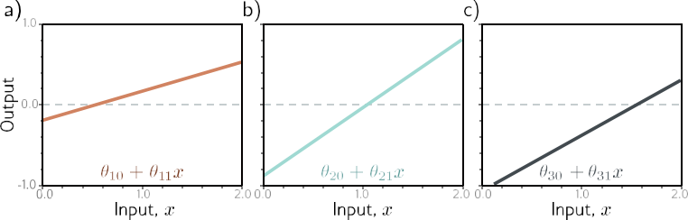
> 图3.14 一个输入，三个隐藏单元和一个输出的网络处理，用于问题[3.4](#_bookmark99) 
> * a–c) 每个隐藏单元的输入是输入的线性函数。前两个与图[3.3](#_bookmark72)中的相同，但最后一个不同。

**问题 3.5** 证明对于  $ α\in \mathbb{R}^{+} $ ，以下性质成立。
$$
ReLU[α•z] = α•ReLU[z]\tag{3.14}
$$
这被称为ReLU函数的非负齐次性质。

**问题 3.6** 在问题[3.5](#_bookmark101)的基础上，当我们将方程[3.3](#_bookmark69)和[3.4](#_bookmark70)中的参数 $θ_10$ 和 $θ_11$ 乘以一个正常数 $α$ ，并将斜率 $ϕ_1$ 除以相同的参数 $α$ 时，浅层网络会发生什么变化？如果 $α$ 是负数会发生什么？

**问题 3.7** 考虑使用最小二乘损失函数拟合方程[3.1](#_bookmark64)中的模型。这个损失函数是否有唯一的最小值？即是否存在一个“最佳”的参数集。

**问题 3.8** 考虑用（i）阶跃函数  $ heaviside[z] $ ，（ii）双曲正切函数  $ tanh[z] $ ，和（iii）矩形函数  $ rect[z] $  替换ReLU激活函数，其中。

$$
\text{heaviside}[z]=\begin{cases}0&\quad z<0\\1&\quad z\ge0\end{cases}\quad\text{rect}[z]=\begin{cases}0&\quad z<0\\1&\quad0\le z\le1\\0&\quad z>1\end{cases}.\tag{3.15}
$$

为每个函数重新绘制图3.3。原始参数为。
 $ \{\phi_0,\phi_1,\phi_2,\phi_3,\theta_{10},\theta_{11},\theta_{20},\theta_{21},\theta_{30},\theta_{31}\}=\{-0.23,-1.3,1.3,0.66,-0.2,0.4,-0.9,0.9,1.1,-0.7\}.$

对于具有一个输入、三个隐藏单元和一个输出的神经网络，提供一个非正式描述可以创建的函数集合。

**问题 3.9** 证明图[3.3](#_bookmark72)中的第三个线性区域的斜率是第一个和第四个线性区域的斜率之和。

**问题 3.10** 考虑一个具有一个输入、一个输出和三个隐藏单元的神经网络。图[3.3](#_bookmark72)中的构造显示了这样可以创建四个线性区域。在什么情况下，这个网络可以产生少于四个线性区域的函数。

**问题 3.11** 图[3.6](#_bookmark78)中的模型有多少个参数。

**问题 3.12** 图[3.7](#_bookmark79)中的模型有多少个参数。

**问题 3.13** 图[3.8](#_bookmark80)中的每个区域的激活模式是什么？换句话说，每个区域哪些隐藏单元是活跃的（传递输入），哪些是非活跃的（剪切输入）。

**问题 3.14** 写出图[3.11](#_bookmark87)中定义网络的方程。从输入计算三个隐藏单元的方程应该有三个，从隐藏单元计算输出的方程应该有两个。

**问题 3.15** 图[3.11](#_bookmark87)中的网络可以创建的三维线性区域的最大可能数量是多少？

**问题 3.16** 写出一个具有两个输入、四个隐藏单元和三个输出的网络的方程。以图[3.11](#_bookmark87)的风格绘制这个模型。

**问题 3.17** 方程[3.11](#_bookmark83)和[3.12](#_bookmark88)定义了一个具有  $ D_i $  个输入、包含  $ D $  个隐藏单元和  $ D_o $  个输出的一般神经网络。找出模型中参数的数量的表达式，其中  $ D_i $ 、 $ D $  和  $ D_o $  是变量。

**问题 3.18** 证明浅层网络的最大区域数目为七，其中 $ D_i $  = 2维输入， $ D_o $  = 1维输出， $ D = 3 $ 个隐藏单元，如图[3.8j](#_bookmark80)所示。使用[Zaslavsky](#_bookmark2372)（1975）的结果，即通过用 $ \mathbf{D} $ 个超平面对 $ D_i $ 维空间进行划分所创建的最大区域数目为 $ \sum_{j=0}^{D_i}\binom Dj. $ 。如果我们在这个模型中再添加两个隐藏单元，即 $ D = 5 $ ，那么最大区域数是多少？
