<!-- vscode-markdown-toc -->
# 本章目录

- [本章目录](#本章目录)
- [第5章 损失函数 - Loss functions](#第5章-损失函数---loss-functions)
  - [5.1. 最大似然估计 - Maximum likelihood](#51-最大似然估计---maximum-likelihood)
    - [5.1.1. 计算输出的概率分布 - Computing a distribution over outputs](#511-计算输出的概率分布---computing-a-distribution-over-outputs)
    - [5.1.2. 最大似然准则 - Maximum likelihood criterion](#512-最大似然准则---maximum-likelihood-criterion)
    - [5.1.3. 最大化对数似然度 - Maximizing log-likelihood](#513-最大化对数似然度---maximizing-log-likelihood)
    - [5.1.4. 最小化负对数似然度 - Minimizing negative log-likelihood](#514-最小化负对数似然度---minimizing-negative-log-likelihood)
    - [5.1.5. 推断 - Inference](#515-推断---inference)
  - [5.2. 构建损失函数的方法 - Recipe for constructing loss functions](#52-构建损失函数的方法---recipe-for-constructing-loss-functions)
  - [5.3. 示例1：单变量回归 - Example 1: univariate regression](#53-示例1单变量回归---example-1-univariate-regression)
    - [5.3.1. 最小二乘损失函数 - Least squares loss function](#531-最小二乘损失函数---least-squares-loss-function)
    - [5.3.2. 推断 - Inference](#532-推断---inference)
    - [5.3.3. 估计方差 - Estimating variance](#533-估计方差---estimating-variance)
    - [5.3.4. 异方差回归 - Heteroscedastic regression](#534-异方差回归---heteroscedastic-regression)
  - [5.4. 示例2：二分类 - Example 2: binary classification](#54-示例2二分类---example-2-binary-classification)
  - [5.5. 示例3：多类分类 - Example 3: multiclass classification](#55-示例3多类分类---example-3-multiclass-classification)
    - [5.5.1. 预测其他数据类型 - Predicting other data types](#551-预测其他数据类型---predicting-other-data-types)
  - [5.6. 多个输出 - Multiple outputs](#56-多个输出---multiple-outputs)
  - [5.7. 交叉熵损失 - Cross-entropy loss](#57-交叉熵损失---cross-entropy-loss)
  - [5.8. 总结 - Summary](#58-总结---summary)
  - [5.9. 注释 - Notes](#59-注释---notes)
  - [5.10. 问题 - Problems](#510-问题---problems)

<!-- vscode-markdown-toc-config
	numbering=true
	autoSave=true
	/vscode-markdown-toc-config -->
<!-- /vscode-markdown-toc -->
# 第5章 损失函数 - Loss functions

前面的三章介绍了线性回归、浅层神经网络和深层神经网络。每个模型都代表了一族将输入映射到输出的函数，其中具体的成员由模型参数$ \phi $确定。当我们训练这些模型时，我们寻求能够产生最佳输入到输出映射的参数。本章定义了“最佳映射”的含义。

这个定义需要一个训练数据集$\{x_{i}, y_{i} \}$，其中包含输入/输出对。一个*损失函数（loss function）*或*代价函数（cost function）* $ L [ϕ] $返回一个描述模型预测$ f [x_{i}, ϕ] $与其对应的真实输出$ y_{i} $不匹配程度的数值。在训练过程中，我们寻找能够最小化损失的参数值$ ϕ $，从而尽可能地将训练输入映射到输出。我们在第2章中看到了一个损失函数的例子，最小二乘损失函数适用于目标为实数$y∈\mathbb{R}$的单变量回归问题。它计算模型预测$ f [x_{i}, ϕ] $与真实值$ y_{i} $之间偏差的平方和。

本章提供了一个框架，既可以为实值输出选择最小二乘准则，又可以构建其他预测类型的损失函数。我们考虑*二元分类，其中预测$ y ∈ \{0, 1\}$是两个类别之一，多类分类，其中预测$ y ∈ \{1, 2,\ldots, K\}$是$ K $个类别之一，以及更复杂的情况。在接下来的两章中，我们将讨论模型训练，目标是找到能够最小化这些损失函数的参数值。

## 5.1. 最大似然估计 - Maximum likelihood

在本节中，我们将介绍一种构建损失函数的方法。考虑一个带有参数 $ϕ$ 的模型 $f[x, ϕ]$，它根据输入 $x$ 计算输出。到目前为止，我们隐含的认为使用模型直接计算预测值 $y$。现在，我们换个角度，将模型视为计算给定输入 $x$ 的可能输出 $y$ 的条件概率分布 $Pr(y|x)$。损失函数鼓励每个训练输出 $y_i$ 在从相应输入 $x_i$ 计算得到的分布 $Pr(y_i|x_i)$ 下具有较高的概率（见图[5.1](#_bookmark155)）。

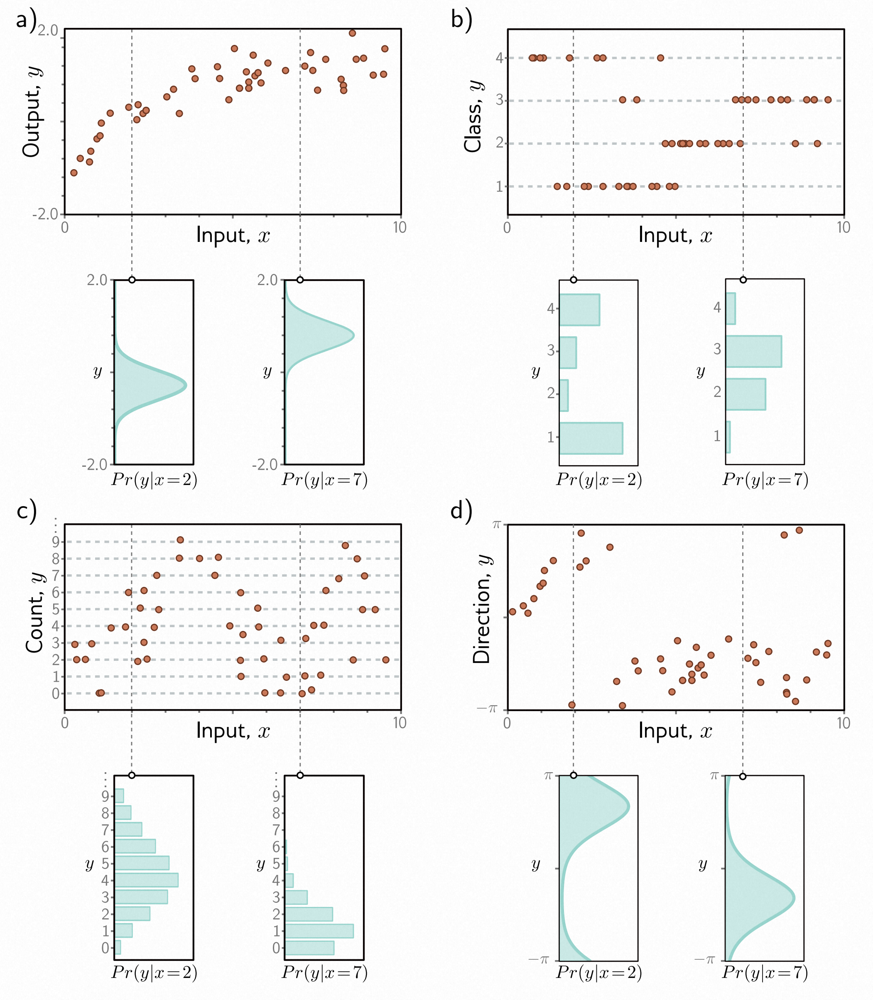
> 图 5.1 预测输出的概率分布。
>
> - a) 回归任务，目标是根据训练数据 $\{x_i, y_i\}$（橙色点）从输入 $x$ 预测实值输出 $y$。对于每个输入值 $x$，机器学习模型预测输出 $y∈\mathbb{R}$ 的分布 $Pr(y|x)$（青色曲线显示 $x = 2.0$ 和 $x = 7.0$ 时的分布）。损失函数的目标是最大化从相应输入 $x_i$ 预测得到的分布下观察到的训练输出 $y_i$ 的概率。
> - b) 分类任务，预测离散类别 $y∈\{ 1, 2, 3, 4\}$，我们使用离散概率分布，因此模型为每个 $x_i$ 预测了一个不同的 $y_i$ 可能取值的直方图。
> - c) 预测计数 $y∈\{0,1,2,\ldots\}$
> - d) 和方向 $y(-π, π]$，我们分别使用在正整数和圆形域上定义的分布。

### 5.1.1. 计算输出的概率分布 - Computing a distribution over outputs

这引出了一个问题，即模型$ f [x, ϕ] $如何适应计算概率分布。解决方案很简单。首先，我们选择一个参数化的分布$ Pr(y|θ) $，该分布定义在输出域$ y $上。然后，我们使用网络来计算该分布的一个或多个参数$ θ $。

例如，假设预测域是实数集合，即 $y ∈ \mathbb{R}$。在这种情况下，我们可以选择定义在 $\mathbb{R}$ 上的一元正态分布。该分布由均值 $µ$ 和方差 $σ^{2}$ 定义，因此 $θ = \{µ, σ^{2}\}$。机器学习模型可以预测均值 $µ$，而方差 $σ^{2}$ 可以被视为一个未知的常数。

### 5.1.2. 最大似然准则 - Maximum likelihood criterion

模型现在为每个训练输入$ x_i $计算不同的分布参数$ θ_i = f [x_i, ϕ] $。每个观察到的训练输出$ y_i $应该在其对应的分布$ Pr(y_i|θ_i) $下具有较高的概率。因此，我们选择模型参数$ ϕ $使其最大化所有$ I $个训练样本的联合概率：
$$
\begin{aligned}
\begin{aligned}\hat{ϕ}\quad\end{aligned}
&=\quad\underset{\boldsymbol{\phi}}{\operatorname*{argmax}}\left [\prod_{i=1}^IPr(\mathbf{y}_i|\mathbf{x}_i) \right] \\
&=\quad\underset{\boldsymbol{\phi}}{\operatorname*{argmax}}\left [\prod_{i=1}^IPr(\mathbf{y}_i|\boldsymbol{\theta}_i) \right] \\
&=\quad\underset{\boldsymbol{\phi}}{\operatorname*{argmax}}\left [\prod_{i=1}^IPr(\mathbf{y}_i|\mathbf{f} [\mathbf{x}_i,\boldsymbol{\phi}]) \right].
\end{aligned}\tag{5.1}
$$

联合概率项是参数的*似然度*，因此方程[5.1](#_bookmark157)被称为*最大似然准则*。在这里，我们隐含地做出了两个假设。首先，我们假设数据是独立同分布的（输出$ y_i $的概率分布形式对于每个数据点都是相同的）。其次，我们假设给定输入的条件分布$ Pr(y_i|x_i) $是独立的，因此训练数据的总似然度可以分解为：

$$
Pr(y_1, y_2, \ldots, y_I | x_1, x_2, \ldots, x_I) = \prod_{i=1}^IPr(\mathbf{y}_i|\mathbf{x}_i) \tag{5.2}
$$

换句话说，我们假设数据是 *独立同分布(i.i.d.)* 的。

> 条件概率$ Pr(z|ψ) $可以从两个角度考虑。作为$ z $的函数，它是一个总和为1的概率分布。作为$ ψ $的函数，它被称为*似然度*，并且通常不总和为1。

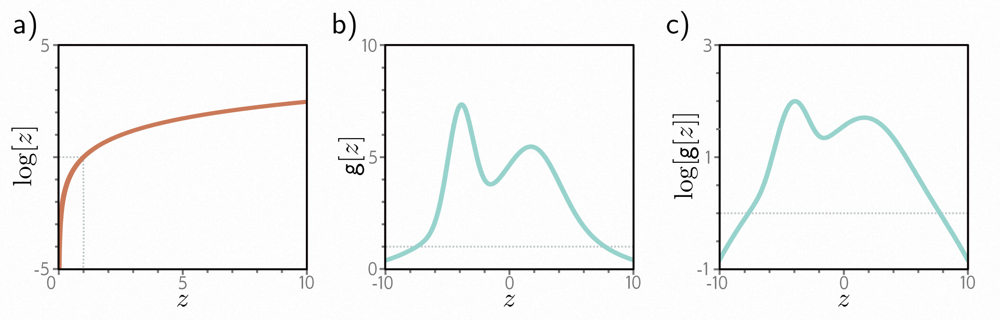
> 图5.2 对数变换。
>
> - a) 对数函数是单调递增的。如果$ z > z^′ $，那么$ log[z] > log[z^′] $。因此，任何函数$ g[z] $的最大值将与$ log[g[z]] $的最大值在相同的位置。
> - b) 函数$ g[z] $。
> - c) 此函数的对数$ log[g[z]] $。
> 所有具有正斜率的$ g[z] $位置在对数变换后仍保持正斜率，而具有负斜率的位置在对数变换后仍保持负斜率。最大值的位置保持不变。

### 5.1.3. 最大化对数似然度 - Maximizing log-likelihood

最大似然准则（方程[5.1](#_bookmark157)）并不是很实用。每个项$ Pr(y_i|f[x_i, ϕ]) $可能很小，因此许多这些项的乘积可能非常小。用有限精度算术表示这个数量可能很困难。幸运的是，我们可以等价地最大化对数似然度：

$$
\begin{aligned}
\begin{aligned}\hat{ϕ}\quad\end{aligned}
&=\quad\underset{\boldsymbol{\phi}}{\operatorname*{argmax}}\left [\prod_{i=1}^IPr(\mathbf{y}_i|\mathbf{f}[\mathbf{x}_i,\mathbf{ϕ}]) \right] \\
&=\quad\underset{\boldsymbol{\phi}}{\operatorname*{argmax}}\left [\operatorname{log}\left [\prod_{i=1}^IPr(\mathbf{y}_i|\mathbf{f}[\mathbf{x}_i,\mathbf{ϕ}]) \right]\right] \\
&=\quad\underset{\boldsymbol{\phi}}{\operatorname*{argmax}}\left [\sum_{i=1}^I\operatorname{log}\left [Pr(\mathbf{y}_i|\mathbf{f} [\mathbf{x}_i,\boldsymbol{\phi}]) \right]\right]
\end{aligned}\tag{5.3}
$$

这个*对数似然度*准则是等价的，因为对数是一个单调递增函数：如果$ z > z^′ $，那么$ log[z] > log[z^′] $，反之亦然（图[5.2](#_bookmark160)）。这意味着当我们改变模型参数$ ϕ $以改善对数似然度准则时，我们也同时改善了原始的最大似然准则。它还意味着两个准则的整体最大值必须在相同的位置，因此最佳模型参数$ \hat{ϕ} $在两种情况下是相同的。然而，对数似然度准则的实际优势在于使用了一系列项的和，而不是乘积，因此用有限精度表示它并不成问题。

### 5.1.4. 最小化负对数似然度 - Minimizing negative log-likelihood

最后，我们注意到，按照惯例，模型拟合问题是以最小化损失的形式提出的。为了将最大对数似然准则转化为最小化问题，我们乘以负一，得到*负对数似然度准则*：
$$
\begin{aligned}
\begin{aligned}\hat{ϕ}\quad\end{aligned}
&=\quad\underset{\boldsymbol{\phi}}{\operatorname*{argmax}}\left [-\sum_{i=1}^I\operatorname{log}\left [Pr(\mathbf{y}_i|\mathbf{f} [\mathbf{x}_i,\boldsymbol{\phi}]) \right]\right]\\
&=\quad\underset{\boldsymbol{\phi}}{\operatorname*{argmax}}\left [\operatorname{L}[\mathbf{ϕ}] \right] \\
\end{aligned}\tag{5.4}
$$

这就形成了最终的损失函数$ L[\phi] $。

### 5.1.5. 推断 - Inference

网络不再直接预测输出$y$，而是确定$y$的概率分布。当我们进行推断时，通常希望得到一个点估计而不是一个分布，因此我们返回分布的最大值：

$$
\begin{aligned}
\begin{aligned}\hat{y}\quad\end{aligned}
&=\quad\underset{\boldsymbol{y}}{\operatorname*{argmax}}\left [Pr(\mathbf{y}|\mathbf{f}[\mathbf{x},\hat{\mathbf{ϕ}}]) \right]
\end{aligned}\tag{5.3}
$$

通常可以找到一个关于模型预测的分布参数$θ$的表达式。例如，在单变量正态分布中，最大值出现在均值$µ$处。

## 5.2. 构建损失函数的方法 - Recipe for constructing loss functions

使用最大似然方法为训练数据$\{ x_{i}, y_{i} \}$构建损失函数的方法如下：

1. 选择一个适合的概率分布 $Pr(y|θ)$ ，该分布定义在预测 $y$ 的定义域上，具有分布参数 $θ$。

2. 设置机器学习模型$f [x, ϕ]$来预测其中一个或多个参数，即$θ = f [x, ϕ]$和$Pr(y|θ) = Pr(y|f [x, ϕ])$。

3. 为了训练模型，找到使训练数据集对$\{x_{i}, y_{i}\}$的负对数似然损失函数最小化的网络参数$\hat{ϕ}$：

$$
\hat{ϕ} = \underset{\mathbf{ϕ}}{\operatorname{argmin}}\left[ L[\mathbf{ϕ}] \right] = \underset{\mathbf{ϕ}}{\operatorname{argmin}}\left[ -\sum_{i=1}^I\operatorname{log}\left[ Pr(\mathbf{y_{i}}|f[\mathbf{x_i},\mathbf{ϕ}])\right] \right] \tag{5.6}
$$

4. 对于新的测试样本$x$，进行推断时，返回完整的分布$Pr(y|f [x, \hat{ϕ}])$或该分布的最大值。

我们在本章的大部分内容中都将使用这个方法来构建常见预测类型的损失函数。

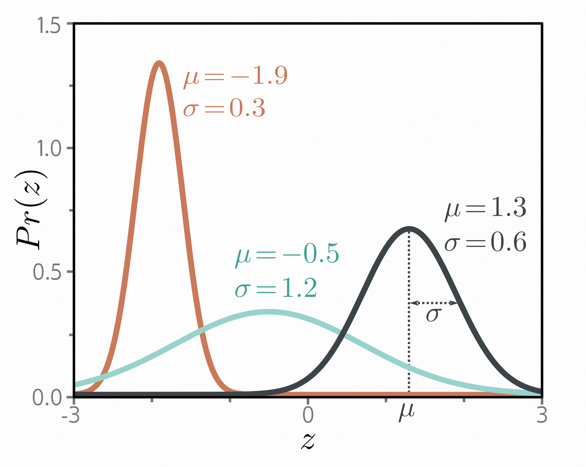
> 图5.3 单变量正态分布（也称为高斯分布）定义在实数线$z ∈ \mathbb{R}$上，具有参数$µ$和$σ^{2}$。均值$µ$决定了峰值的位置。方差$σ^{2}$的正根（标准差）决定了分布的宽度。由于总概率密度之和为1，方差减小时峰值变高，分布变窄。

## 5.3. 示例1：单变量回归 - Example 1: univariate regression

我们首先考虑单变量回归模型。在这里，目标是使用具有参数$ϕ$的模型$f [x, ϕ]$从输入$x$预测单个标量输出$y ∈ \mathbb{R}$。按照上述方法，我们选择一个输出域$y$上的概率分布。我们选择单变量正态分布（图5.3），该分布定义在$y ∈ \mathbb{R}$上。该分布有两个参数（均值$µ$和方差$σ^{2}$），并且具有概率密度函数：

$$
Pr(y|\mu,\sigma^2)=\frac1{\sqrt{2\pi\sigma^2}}\exp\left[-\frac{(y-\mu)^2}{2\sigma^2}\right]\tag{5/7}
$$

其次，我们设置机器学习模型$f [x, ϕ]$来计算该分布的一个或多个参数。在这里，我们只计算均值，即$µ = f [x, ϕ]$：
$$
Pr(y|\mathrm{f}[\mathbf{x},\phi],\sigma^2)=\frac1{\sqrt{2\pi\sigma^2}}\exp\left[-\frac{(y-\mathrm{f}[\mathbf{x},\boldsymbol{\phi}])^2}{2\sigma^2}\right].\tag{5.8}
$$

我们的目标是找到使训练数据$\{ x_{i}, y_{i} \}$在该分布下最有可能的参数$ϕ$（图5.4）。为了实现这一目标，我们选择基于负对数似然的损失函数$L [ϕ]$：
$$
\begin{aligned}
L[\phi]\quad \begin{aligned}\end{aligned}
& =\quad-\sum_{i=1}^I\log\left[Pr(y_i|\mathrm{f}[\mathbf{x}_i,\boldsymbol{\phi}],\sigma^2)\right]  \\
& =\quad -\sum_{i=1}^I\log\left[\frac1{\sqrt{2\pi\sigma^2}}\exp\left[-\frac{(y_i-\mathrm{f}[\mathbf{x}_i,\boldsymbol{\phi}])^2}{2\sigma^2}\right]\right].
\end{aligned}\tag{5.9}
$$

当我们训练模型时，我们寻找使该损失最小化的参数$\hat{ϕ}$。

### 5.3.1. 最小二乘损失函数 - Least squares loss function

现在让我们对损失函数进行一些代数操作。我们要求：

$$
\begin{aligned}
\hat{\phi}\quad \begin{aligned}\end{aligned}
&=\quad\underset{\boldsymbol{\phi}}{\operatorname*{argmin}}\left[-\sum_{i=1}^I\log\left[\frac1{\sqrt{2\pi\sigma^2}}\exp\left[-\frac{(y_i-\mathrm{f}[\mathbf{x}_i,\boldsymbol{\phi}])^2}{2\sigma^2}\right]\right]\right] \\
&\begin{array}{rcl}=&\underset{\phi}{\operatorname*{argmin}}\left[-\sum_{i=1}^I\log\left[\frac1{\sqrt{2\pi\sigma^2}}\right]-\frac{(y_i-\mathrm{f}[\mathbf{x}_i,\boldsymbol{\phi}])^2}{2\sigma^2}\right]\end{array} \\
&=\quad\underset{\boldsymbol{\phi}}{\operatorname*{argmin}}\left[-\sum_{i=1}^I-\frac{(y_i-\mathrm{f}[\mathbf{x}_i,\boldsymbol{\phi}])^2}{2\sigma^2}\right] \\
&=\quad\underset{\boldsymbol{\phi}}{\operatorname*{argmin}}\left[\sum_{i=1}^I(y_i-\mathrm{f}[\mathbf{x}_i,\boldsymbol{\phi}])^2\right]
\end{aligned}
$$

在第二行和第三行之间，我们去掉了第一个项，因为它不依赖于$ \phi $。在第三行和第四行之间，我们去掉了分母，因为这只是一个常数缩放因子，不影响最小值的位置。

这些操作的结果是最小二乘损失函数，我们在第2章中讨论线性回归时首次引入了它。

$$
L[ϕ] = \sum_{i=1}^I(y_{i} - f [x_{i}, ϕ])^{2}.\tag{5.11}
$$

我们可以看到，最小二乘损失函数自然地遵循了以下假设：预测误差是(i)独立的，(ii)服从均值为$ µ = f [x_{i}, ϕ] $的正态分布（图5.4）。

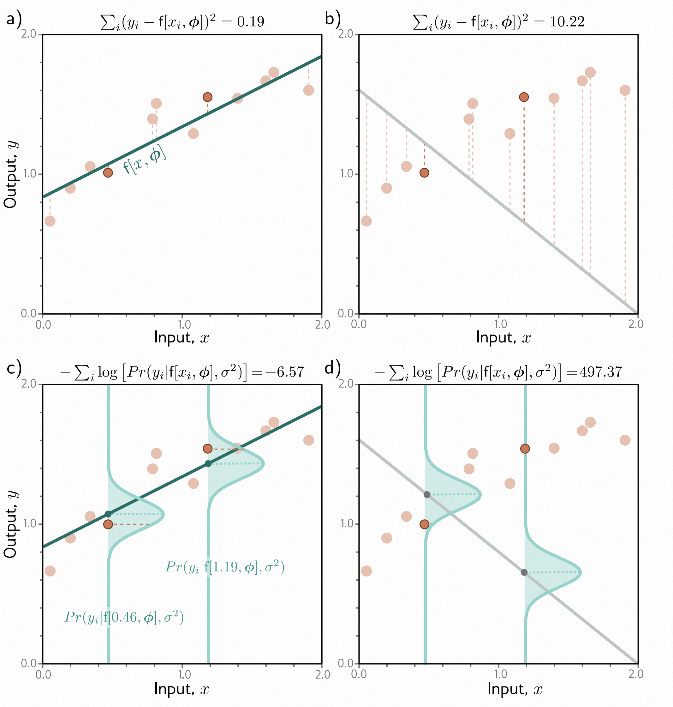
> 图5.4 最小二乘法和最大似然损失在正态分布中的等价性。
>
> - a) 考虑图[2.2](#_bookmark49)中的线性模型。最小二乘准则最小化模型预测 $ f [x_i, ϕ] $（绿线）与真实输出值 $y_i$（橙色点）之间的偏差的平方和（虚线）。在这种情况下，拟合效果很好，因此这些偏差很小（例如，对于两个突出的点）。
> - b) 对于这些参数，拟合效果很差，偏差的平方和很大。
> - c) 最小二乘准则源于以下假设：模型预测输出的概率遵循正态分布的均值，并且我们最大化概率。对于第一种情况，模型拟合效果良好，因此数据的概率 $ Pr(y_i|x_i) $ 很大（负对数概率很小）。
> - d) 对于第二种情况，模型拟合效果差，概率很小，负对数概率很大。

### 5.3.2. 推断 - Inference

网络不再直接预测$ y $，而是预测$ y $的均值$ µ = f [x, ϕ] $。当我们进行推断时，通常希望得到一个单一的“最佳”点估计$ \hat{y} $，因此我们取预测分布的最大值：

$$
\hat{\mathbf{y}} = \underset{y}{\operatorname{argmax}}\left[ Pr(y|f[x,\hat{ϕ}])
\right]\tag{5.12}
$$

对于单变量正态分布，最大位置由均值参数$ µ $确定（图5.3）。这正是模型计算的，所以$ \hat{y} =f[x,\hat{ϕ}] $。

### 5.3.3. 估计方差 - Estimating variance

为了构建最小二乘损失函数，我们假设网络预测了正态分布的均值。方程式[5.11](#_bookmark169)的最终表达式（也许令人惊讶地）不依赖于方差$ σ^{2} $。然而，我们可以将$ σ^{2} $视为模型的参数，并对模型参数$ ϕ $和分布方差$ σ^{2} $同时进行最小化：

$$
\hat{\boldsymbol{\phi}},\hat{\boldsymbol{\sigma}}^2=\underset{\phi,\sigma^2}{\operatorname*{argmin}}\left[-\sum_{i=1}^I\log\left[\frac1{\sqrt{2\pi\sigma^2}}\exp\left[-\frac{(y_i-\mathrm{f}[\mathbf{x}_i,\boldsymbol{\phi}])^2}{2\sigma^2}\right]\right]\right].\tag{5.13}
$$

在推断中，模型从输入中预测均值$ µ = f [x,\hat{ϕ}] $，并且我们在训练过程中学习到方差$ \hat{σ}^{2} $。前者是最佳预测，后者告诉我们关于预测的不确定性。

### 5.3.4. 异方差回归 - Heteroscedastic regression

上述模型假设数据的方差在任何地方都是恒定的。然而，这可能是不现实的。当模型的不确定性随着输入数据的变化而变化时，我们将其称为*异方差*（与*等方差*相对，等方差的不确定性是恒定的）。

一种简单的建模方法是训练一个神经网络 $ f [x, ϕ] $，它同时计算均值和方差。例如，考虑一个具有两个输出的浅层网络。我们将第一个输出表示为 $ f_{1} [x, ϕ] $，用于预测均值，将第二个输出表示为 $ f_{2} [x, ϕ] $，用于预测方差。

这里有一个复杂的点，方差必须是正的，但我们不能保证网络总是产生正的输出。为了确保计算得到的方差是正的，我们将第二个网络输出通过一个将任意值映射为正值的函数。一个合适的选择是平方函数，得到：

$$
µ = f_{1} [x, ϕ]\\
σ^{2} = f_{2} [x, ϕ]^2 \tag{5.14}
$$

这导致了损失函数：
$$
\hat{\phi}=\underset{\phi}{\operatorname*{argmin}}\left[-\sum_{i=1}^I\log\left[\frac1{\sqrt{2\pi\mathrm{f}_2[\mathbf{x}_i,\boldsymbol{\phi}]^2}}\right]-\frac{(y_i-\mathrm{f}_1[\mathbf{x}_i,\boldsymbol{\phi}])^2}{2\mathrm{f}_2[\mathbf{x}_i,\boldsymbol{\phi}]^2}\right].\tag{5.15}
$$

图5.5比较了等方差模型和异方差模型。
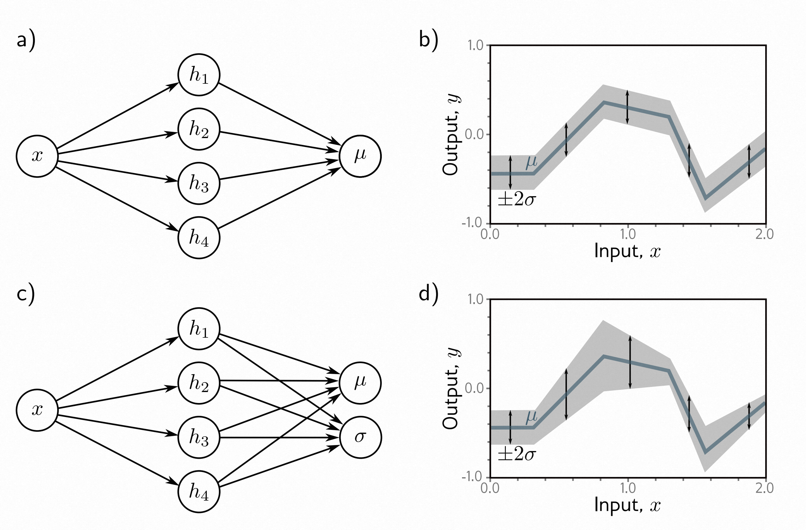
> 图5.5 同方差与异方差回归。
>
> - a) 用于同方差回归的浅层神经网络仅从输入$x$预测输出分布的均值$µ$。
> - b) 结果是，虽然均值（蓝线）是输入$x$的分段线性函数，但方差在任何地方都是恒定的（箭头和灰色区域显示±2个标准差）。
> - c) 用于异方差回归的浅层神经网络还预测方差$σ^2$（或者更准确地说，计算其平方根，然后再平方）。
> - d) 标准差现在也成为输入$x$的分段线性函数。

## 5.4. 示例2：二分类 - Example 2: binary classification

在*二分类*中，目标是将数据$x$分配给两个离散的类别之一，$y∈\{0, 1\}$。在这个背景下，我们将$y$称为*标签*。二分类的例子包括（i）根据文本数据$x$预测餐厅评论是积极的（$y=1$）还是消极的（$y=0$），以及（ii）根据MRI扫描$x$预测肿瘤是否存在（$y=1$）或不存在（$y=0$）。

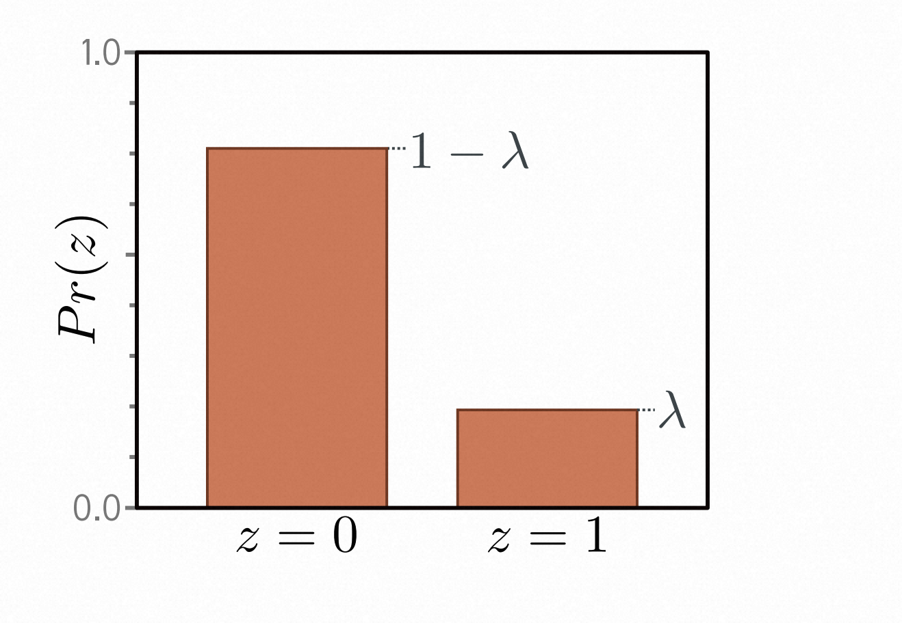
> 图5.6 伯努利分布。伯努利分布定义在域$z∈\{0, 1\}$上，有一个参数λ表示观察到$z=1$的概率。由此可得，观察到$z=0$的概率为$1-λ$。

再次，我们按照[5.2节](#recipe-for-constructing-loss-functions)中的步骤构建损失函数。首先，我们选择一个概率分布，使其适用于输出空间$y∈\{0, 1\}$。一个合适的选择是伯努利分布，它定义在域$
\{0, 1\}$上。它有一个参数$λ∈[0, 1]$，表示$y$取值为1的概率（图[5.6](#_bookmark175)）。

$$
Pr(y|\lambda)=\begin{cases}1-\lambda&\quad y=0\\\lambda&\quad y=1\end{cases}\tag{5.16}
$$

也可以等价地写成：

$$
Pr(y|\lambda)  = (1-λ)^{1-y}·λ^{y}\tag{5.17}
$$

其次，我们将机器学习模型 $f[x, ϕ]$ 设置为预测单个分布参数 $λ$。然而，$λ$ 只能取值范围在$[0, 1]$，我们无法保证网络输出将位于此范围内。因此，我们将网络输出通过一个将实数$\mathbb{R}$映射到$[0, 1]$的函数。一个合适的函数是*逻辑Sigmoid*（图[5.7](#_bookmark177)）。

$$
\operatorname{sig[z]} = \frac{1}{1 + \operatorname{exp[-z]}}\tag{5.18}
$$

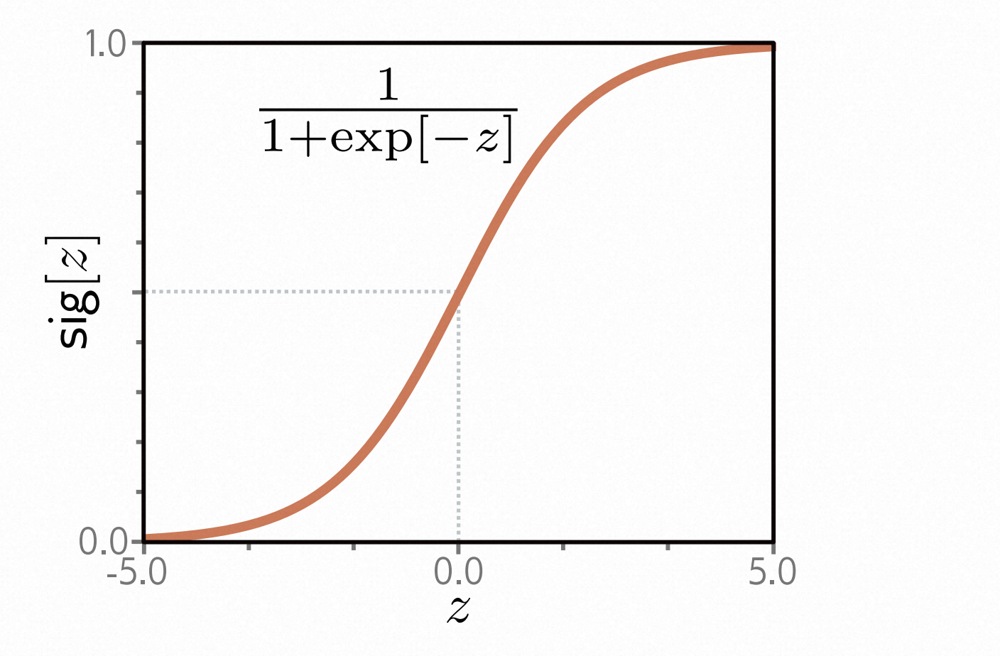
> 图5.7 逻辑Sigmoid函数。该函数将实数线$z∈\mathbb{R}$映射到0到1之间的数值，因此$sig[z]∈[0, 1]$。输入为0时映射为0.5。负输入映射为小于0.5的数，正输入映射为大于0.5的数。

因此，我们将分布参数预测为$λ=\operatorname{sig}[f[x, ϕ]]$。现在，似然函数为：

$$
Pr(y|x)  = (1 - \operatorname{sig}[f [x, ϕ]])^{1-y} \cdot \operatorname{sig}[f [x, ϕ]]^{y}\tag{5.19}
$$

对于浅层神经网络模型，这在图[5.8](#_bookmark180)中进行了描述。损失函数是训练集的负对数似然。

$$
L[\phi]=\sum_{i=1}^I-(1-y_i)\log\Bigl[1-\mathrm{sig}[\mathrm{f}[\mathbf{x}_i,\phi]]\Bigr]-y_i\log\Bigl[\mathrm{sig}[\mathrm{f}[\mathbf{x}_i,\phi]]\Bigr]\tag{5.20}
$$

出于将在[5.7节](#cross-entropy-loss)中解释的原因，这被称为*二元交叉熵损失*。变换后的模型输出 $\operatorname{sig}[f[x, ϕ]]$ 预测了伯努利分布的参数 $λ$。这代表了 $y=1$ 的概率，因此$1-λ$代表了 $y=0$ 的概率。当进行推断时，我们可能希望得到 $y$的一个点估计，因此如果 $λ>0.5$，则设置 $y=1$，否则设置 $y=0$。

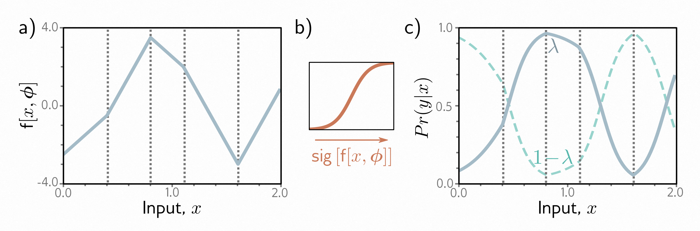
> 图5.8 二分类模型。
>
> - a) 网络输出是一个可以取任意实数值的分段线性函数。
> - b) 这通过逻辑Sigmoid函数进行转换，将这些值压缩到范围$[0, 1]$。
> - c) 转换后的输出预测了$y=1$的概率λ（实线）。
> 因此，$y=0$的概率为$1-λ$（虚线）。对于任何固定的$x$（垂直切片），我们得到与图[5.6](#_bookmark175)中类似的伯努利分布的两个值。损失函数偏好于在与正例$y_i=1$相关的位置$x_i$产生大的$λ$值，并在与负例$y_i=0$相关的位置产生小的$λ$值。

## 5.5. 示例3：多类分类 - Example 3: multiclass classification

*多类分类*的目标是将输入数据示例$ x $分配给$ K>2 $个类别中的一个，即$ y ∈ \{ 1, 2, \ldots,K\}$。现实世界的例子包括（i）预测手写数字图像$ x $中存在的$ K = 10 $个数字$ y $，以及（ii）预测不完整句子$ x $后面的$ K $个可能的单词$ y $。

我们再次按照[5.2节](#recipe-for-constructing-loss-functions)中的步骤进行。我们首先选择一个在预测空间$ y $上的分布。在这种情况下，我们有$ y ∈ \{1, 2, \ldots, K\}$，所以我们选择了在这个域上定义的*分类分布*（图[5.9](#_bookmark181)）。这个分布有$ K $个参数$ λ_{1}, λ_{2}, \ldots, λ_{K} $，它们确定了每个类别的概率：

$$
Pr(y = k)  = λ_{k}.\tag{5.21}
$$

这些参数被限制在0到1之间的值，并且它们必须共同总和为一，以确保一个有效的概率分布。

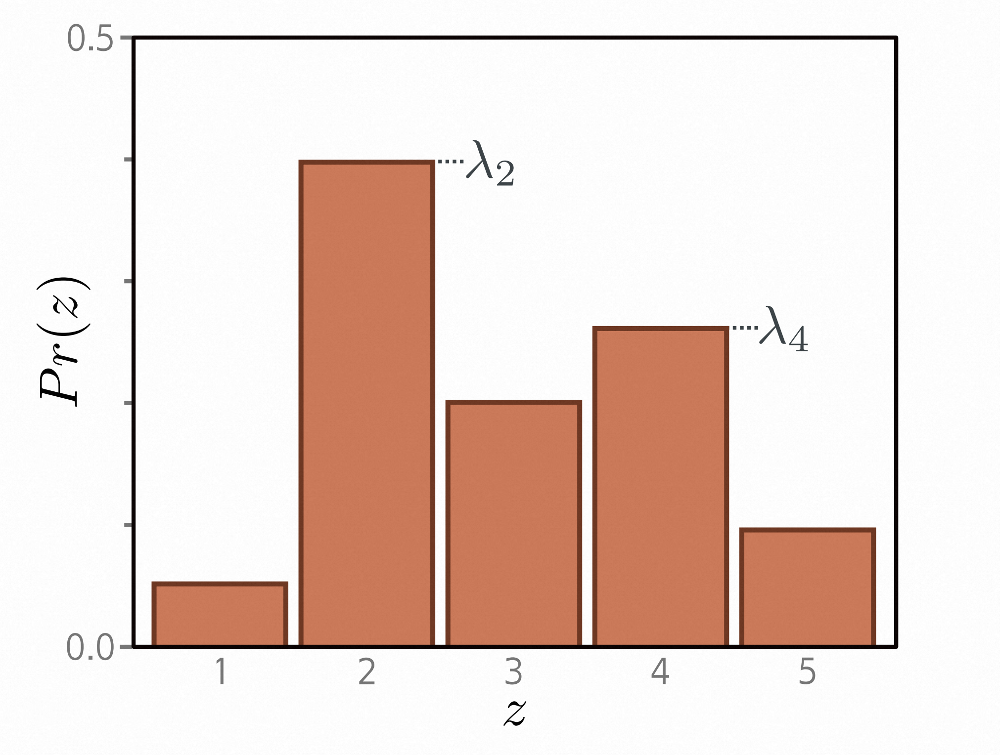
> 图5.9 分类分布。分类分布将概率分配给$ K>2 $个类别，其中$ λ_{1}, λ_{2},\ldots,λ_K$是相关的概率。在这个例子中，有五个类别，所以$ K = 5 $。为了确保这是一个有效的概率分布，每个参数$ λ_{k} $必须在范围$[0, 1]$内，并且所有$ K $个参数的总和必须为一。

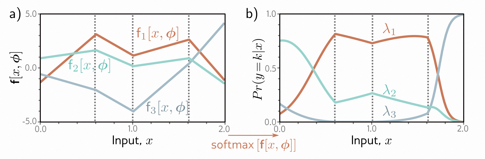
> 图5.10 $ K = 3 $类的多类分类。
>
> - a) 网络有三个分段线性输出，可以取任意值。
> - b) 在经过softmax函数后，这些输出被限制为非负且总和为一。
> 因此，对于给定的输入$ x $，我们计算分类分布的有效参数：这个图的任何垂直切片都会产生三个值，它们总和为一，并且会形成类似于图[5.9](#_bookmark181)中的分类分布的条形图的高度。

然后，我们使用一个具有$ K $个输出的网络$ f [x, ϕ] $来从输入$ x $计算这些$ K $个参数。不幸的是，网络的输出不一定遵守上述约束。因此，我们将网络的$ K $个输出通过一个函数，以满足这些约束。一个合适的选择是*softmax*函数（图[5.10](#_bookmark184)）。它接受一个长度为$ K $的任意向量，并返回一个长度相同的向量，其中元素现在在范围$[0, 1]$内，并且总和为一。softmax函数的第$ k $个输出是：

$$
\operatorname{softmax}[z] = \frac{\operatorname{exp} [z_k]}{\sum_{k'=1}^K\operatorname{exp}[z_{k'}]}  \tag{5.22}
$$

其中指数函数确保了正性，分母中的求和确保了这$ K $个数字的总和为一。

输入$ x $具有标签$y$的概率（图[5.10](#_bookmark184)）因此为：

$$
Pr(y = k|x)  = \operatorname{softmax_{k}}\left[f[x, ϕ]\right]\tag{5.23}
$$

损失函数是训练数据的负对数似然：

$$
\begin{aligned}L[\phi]\begin{aligned}\end{aligned}
&=-\sum_{i=1}^I[\log\left[\operatorname{softmax}_{y_i}\left[\mathbf{f}[\mathbf{x}_i,\boldsymbol{\phi}]\right]\right]  \\
&=-\sum_{i=1}^I\left(\mathrm{f}_{y_i}\left[\mathbf{x}_i,\boldsymbol{\phi}\right]-\log\left[\sum_{k^{\prime}=1}^K\exp\left[\mathrm{~f}_{k^{\prime}}\left[\mathbf{x}_i,\boldsymbol{\phi}\right]\right]\right]\right)\end{aligned}\tag{5.24}
$$

其中$ f_{k}[x, ϕ] $表示神经网络的第$ k $个输出。出于将在[5.7节](#cross-entropy-loss)中解释的原因，这被称为*多类交叉熵损失*。

转换后的模型输出表示可能类别$ y ∈ \{1, 2, \ldots, K\} $的分类分布。对于一个点估计，我们取最可能的类别$ \hat{y} = \operatorname{argmax}_{k}\left[Pr(y=k|f[x,\hat{ϕ}]) \right] $。这对应于图[5.10](#_bookmark184)中该值的曲线最高的位置。

### 5.5.1. 预测其他数据类型 - Predicting other data types

在本章中，我们专注于回归和分类，因为这类问题是广泛存在的。然而，为了进行不同类型的预测，我们只需选择一个适当的分布，并应用[5.2节](#recipe-for-constructing-loss-functions)中的步骤。图[5.11](#_bookmark188)列举了一系列概率分布及其预测域。本章末尾的问题中探讨了其中的一些。

 |数据类型|域|分布|用途|
|----|----|----|----|
|单变量，连续，无界| $y∈\mathbb{R}$      |单变量正态分布          |回归|
|单变量，连续，无界| $y∈\mathbb{R}$      |拉普拉斯或t分布  |鲁棒回归|
|单变量，连续，无界| $y∈\mathbb{R}$      |高斯混合分布       |多模态回归|
|单变量，连续，有下界 | $y∈\mathbb{R}^+$    |指数或伽马分布       |预测大小|
|单变量，连续，有界 | $y∈[0,1]$    |贝塔分布      |预测比例|
|单变量，连续，无界 | $y∈\mathbb{R}^K$    |多元正态分布      |多元回归|
|单变量，连续，循环 | $y∈(−π, π] $    |冯·米塞斯分布      |预测方向|
|单变量，离散，二元| $y ∈ \{0, 1\}$ |伯努利分布 |二元分类|
|单变量，离散，有界 | $y ∈ \{1, 2,\cdots, K\}$ |分类分布 |多类别分类
|单变量，离散，有下界| $y ∈ [0, 1, 2, 3, \cdots ] $ |泊松分布 | 预测事件计数
|多元，离散，排列 | $y ∈ Perm[1, 2, \cdots, K]$ | Plackett-Luce | 排名
> 图5.11 不同预测类型的损失函数的分布。

## 5.6. 多个输出 - Multiple outputs

通常，我们希望使用同一个模型进行多个预测，因此目标输出 $ y $ 是一个向量。例如，我们可能想要预测分子的熔点和沸点（一个多元回归问题，图 [1.2b](#_bookmark8)），或者在图像的每个点上预测对象的类别（一个多元分类问题，图 [1.4a](#_bookmark13)）。虽然可以定义多元概率分布，并使用神经网络将其参数建模为输入的函数，但更常见的做法是将每个预测视为*独立*的。

独立性意味着我们将概率 $ Pr(y|f[x, ϕ]) $ 视为每个元素 $ y_{d}∈ y$ 的单变量项的乘积：
$$
 Pr(y|f[x, ϕ])  = \prod_{d}Pr(y_{d}|f_{d}[x,ϕ]\tag{5.25}
$$

其中 $f_d[x, ϕ]$ 是描述 $ y_{d}∈\mathbb{R} $ 上的分布的参数的网络输出的第 $ d $ 组，例如，为了预测多个连续变量 $ y_{d} $ ，我们为每个 $ y_{d} $ 使用一个正态分布，网络输出 $ f_{d}[x,ϕ] $ 预测这些分布的均值。为了预测多个离散变量 $ y_{d} ∈ \{1, 2,\ldots, K\}$，我们为每个 $ y_{d} $ 使用一个分类分布。在这种情况下，每组网络输出 $f_d[x, ϕ]$ 预测对 $ y_{d} $ 的分类分布贡献的 $ K $ 个值。

当我们最小化负对数概率时，这个乘积变成了一系列项的和：
$$
L[\phi]=-\sum_{i=1}^I\log\Bigl[Pr(\mathbf{y}_i|\mathbf{f}[\mathbf{x}_i,\phi])\Bigr]=-\sum_{i=1}^I\sum_d\log\Bigl[Pr(y_{id}|\mathbf{f}_d[\mathbf{x}_i,\phi])\Bigr]. \tag{5.26}
$$

其中 $ y_{id} $ 是第 $ i^{th} $ 个训练样本的第 $ d^{th} $ 个输出。

为了同时进行两个或更多个预测类型，我们同样假设每个预测的误差是独立的。例如，为了预测风向和风力，我们可以选择冯·米塞斯分布（定义在圆域上）作为风向的分布，指数分布（定义在正实数上）作为风力的分布。独立性假设意味着两个预测的联合似然是各自似然的乘积。当我们计算负对数似然时，这些项将变为可加的。

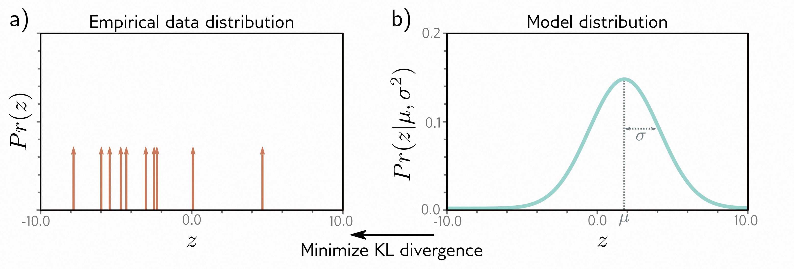
> 图5.12 交叉熵方法。
>
> - a) 训练样本的经验分布（箭头表示狄拉克δ函数）。
> - b) 模型分布（具有参数 $ θ = µ, σ^{2} $ 的正态分布）。
> 在交叉熵方法中，我们最小化这两个分布之间的距离（KL散度），作为模型参数 $θ$ 的函数。
>
## 5.7. 交叉熵损失 - Cross-entropy loss

在本章中，我们开发了最小化负对数似然的损失函数。然而，术语*交叉熵*损失也很常见。在本节中，我们描述交叉熵损失，并证明它等价于使用负对数似然。

交叉熵损失基于找到参数$ θ $，使得观测数据$ y $的经验分布$ q(y) $与模型分布$ Pr(y|θ) $之间的距离最小（图[5.12](#_bookmark190)）。两个概率分布$ q(z) $和$ p(z) $之间的距离可以用Kullback-Leibler（KL）散度来评估：

$$
D_{KL}\big[q||p\big]=\int_{-\infty}^{\infty}q(z)\log\big[q(z)\big]dz-\int_{-\infty}^{\infty}q(z)\log\big[p(z)\big]dz.\tag{5.27}
$$

现在考虑我们在点$ \{y_{i}\}_{i=1}^I $处观察到一个经验数据分布。我们可以将其描述为点质量的加权和：

$$
q(y)= \frac{1}{I}\sum_{i=1}^{I}δ[y-y_i] \tag{5.28}
$$

其中$ δ [•] $是Dirac delta函数。我们希望最小化模型分布$ Pr(y|θ) $与这个经验分布之间的KL散度：

$$
\begin{array}{rcl}\hat{\boldsymbol{\theta}}&=&\underset{\boldsymbol{\theta}}{\operatorname*{argmin}}\left[\int_{-\infty}^{\infty}q(y)\log\bigl[q(y)\bigr]dy-\int_{-\infty}^{\infty}q(y)\log\bigl[Pr(y|\boldsymbol{\theta})\bigr]dy\right]\\&=&\underset{\boldsymbol{\theta}}{\operatorname*{argmin}}\left[-\int_{-\infty}^{\infty}q(y)\log\bigl[Pr(y|\boldsymbol{\theta})\bigr]dy\right]\end{array}\tag{5.29}
$$

其中第一项消失了，因为它不依赖于$ θ $。剩下的第二项被称为*交叉熵*。它可以解释为在考虑了我们已经从另一个分布中知道的信息后，一个分布中剩余的不确定性的量。现在，我们将方程[5.28](#_bookmark192)中的$ q(y) $的定义代入：

$$
\begin{aligned}
\hat{θ}\quad\begin{aligned}\end{aligned}
&=\quad\underset{\boldsymbol{\theta}}{\operatorname*{argmin}}\left[-\int_{-\infty}^{\infty}\left(\frac{1}{I}\sum_{i=1}^{I}\delta[y-y_{i}]\right)\log\bigl[Pr(y|\boldsymbol{\theta})\bigr]dy\right] \\
&=\quad\underset{\boldsymbol{\theta}}{\operatorname*{argmin}}\left[-\frac1I\sum_{i=1}^I\log\bigl[Pr(y_i|\boldsymbol{\theta})\bigr]\right] \\
&=\quad\underset{\boldsymbol{\theta}}{\operatorname*{argmin}}\left[-\sum_{i=1}^I\log\bigl[Pr(y_i|\boldsymbol{\theta})\bigr]\right]
\end{aligned}\tag{5.30}
$$

第一行中两个项的乘积对应于图[5.12a](#_bookmark190)中的点质量与图[5.12b](#_bookmark190)中的分布的对数的逐点乘积。我们得到了一组有限的加权概率质量，这些质量以数据点为中心。在最后一行，我们消除了常数缩放因子$1/I$，因为这不会影响最小值的位置。

在机器学习中，分布参数$ θ $由模型$ f [x_{i}, ϕ] $计算，因此我们有：

$$
\hat{\phi}=\underset{\phi}{\operatorname*{argmin}}\left[-\sum_{i=1}^I\log\left[Pr(y_i|\mathbf{f}[\mathbf{x}_i,\boldsymbol{\phi}])\right]\right] \tag{5.31}
$$

这正是第[5.2](#recipe-for-constructing-loss-functions)节中的负对数似然准则。

由此可见，最大化数据似然的负对数似然准则和最小化模型与经验数据分布之间的距离的交叉熵准则是等价的。

## 5.8. 总结 - Summary

在之前，我们将神经网络视为直接从数据$ x $预测输出$ y $。在本章中，我们改变了视角，将神经网络视为计算参数$ θ $的概率分布$ Pr(y|θ) $在输出空间上。这导致了一种建立损失函数的原则方法。我们选择使观测数据在这些分布下的似然性最大化的模型参数$ ϕ $。我们看到，这等价于最小化负对数似然。

最小二乘回归准则是这种方法的自然结果；它源于$ y $被假设为正态分布，并且我们正在预测均值。我们还看到了如何将回归模型扩展为估计预测的不确定性，并将该不确定性与输入相关联（异方差模型）。我们将相同的方法应用于二元和多类分类，并为每种情况推导出损失函数。我们讨论了如何处理更复杂的数据类型以及如何处理多个输出。最后，我们认为交叉熵是一种等价的模型拟合方法。

在之前的章节中，我们开发了神经网络模型。在本章中，我们为决定模型对给定参数描述训练数据的程度开发了损失函数。下一章将考虑模型训练，我们的目标是找到最小化这个损失的模型参数。

## 5.9. 注释 - Notes

 **基于正态分布的损失函数:** [Nix & Weigend](#_bookmark1974)  [(1994)](#_bookmark1974) 和 [Williams](#_bookmark2302)  [(1996)](#_bookmark2302) 研究了异方差非线性回归，其中输出的均值和方差都是输入的函数。在无监督学习的背景下，[Burda et al](#_bookmark1367) . [(2016)](#_bookmark1367) 使用基于对角协方差的多元正态分布作为损失函数，而[Dorta et al](#_bookmark1475) . [(2018)](#_bookmark1475) 使用基于完全协方差的正态分布作为损失函数。

 **鲁棒回归:** [Qi et al](#_bookmark2016) . [(2020)](#_bookmark2016) 研究了最小化绝对误差而不是均方误差的回归模型的性质。这个损失函数假设输出服从拉普拉斯分布，并估计给定输入的中位数输出，而不是均值。[Barron](#_bookmark1291)  [(2019)](#_bookmark1291) 提出了一个参数化鲁棒性程度的损失函数。在概率上解释时，它产生了一族包括正态分布和柯西分布在内的一元概率分布。

 **估计分位数:** 有时候，我们可能不想在回归任务中估计均值或中位数，而是想预测一个分位数。例如，在风险模型中，我们想知道真实值在预测值的90%以下的时间内。这被称为*分位数回归*(K [oenker & Hallock](#_bookmark1751) ,  [2001](#_bookmark1751) 。可以通过拟合一个异方差回归模型，然后根据预测的正态分布估计分位数来实现。或者，可以直接使用*分位数损失*(也称为*pinball损失*) 来估计分位数。在实践中，这最小化了数据与模型之间的绝对偏差，但是对一个方向的偏差给予了比另一个方向更大的权重。最近的研究同时预测多个分位数，以了解整体分布形状 [(Rodrigues & Pereira](#_bookmark2059) ,  [2020](#_bookmark2059) .

 **类别不平衡和焦点损失:** [Lin et al](#_bookmark1829) . [(2017c](#_bookmark1829) 解决了分类问题中的数据不平衡。如果某些类别的示例数量远大于其他类别，则标准的最大似然损失效果不好；模型可能会集中于对来自主导类别的分类正确的示例更加自信，并且对分类较少的类别分类不好。[Lin et al](#_bookmark1829) . [(2017c](#_bookmark1829) 引入了*焦点损失*，它添加了一个额外的参数，降低了分类正确的示例的影响，以提高性能。

 **学习排序:** [Cao et al](#_bookmark1353) . [(2007)](#_bookmark1353) 、 [Xia et al](#_bookmark2328) . [(2008)](#_bookmark2328) 和 [Chen et al](#_bookmark1385) . [(2009)](#_bookmark1385) 都在学习排序数据的损失函数中使用了Plackett-Luce模型。这是学习排序的*列表*方法，因为模型一次摄入整个待排序的对象列表。其他方法包括*点*方法，其中模型摄入单个对象，以及*对*方法，其中模型摄入对象对。[Chen et al](#_bookmark1385) . [(2009)](#_bookmark1385) 总结了学习排序的不同方法。

 **其他数据类型:** [Fan et al](#_bookmark1506) . [(2020)](#_bookmark1506) 使用基于贝塔分布的损失函数来预测介于零和一之间的值。[Jacobs et al](#_bookmark1700) . [(1991)](#_bookmark1700) 和[Bishop](#_bookmark1327)  [(1994)](#_bookmark1327) 研究了用于多模态数据的*混合密度网络*。这些模型将输出建模为条件于输入的高斯混合分布(见图[5.14](#_bookmark203) 。[Prokudin et al](#_bookmark2010) . [(2018)](#_bookmark2010) 使用von Mises分布来预测方向(见图[5.13](#_bookmark197) 。[Fallah et al](#_bookmark1500) . [(2009)](#_bookmark1500) 使用泊松分布构建了用于预测计数的损失函数(见图[5.15](#_bookmark205)) 。[Ng et al](#_bookmark1961) . [(2017)](#_bookmark1961) 使用基于伽玛分布的损失函数来预测持续时间。

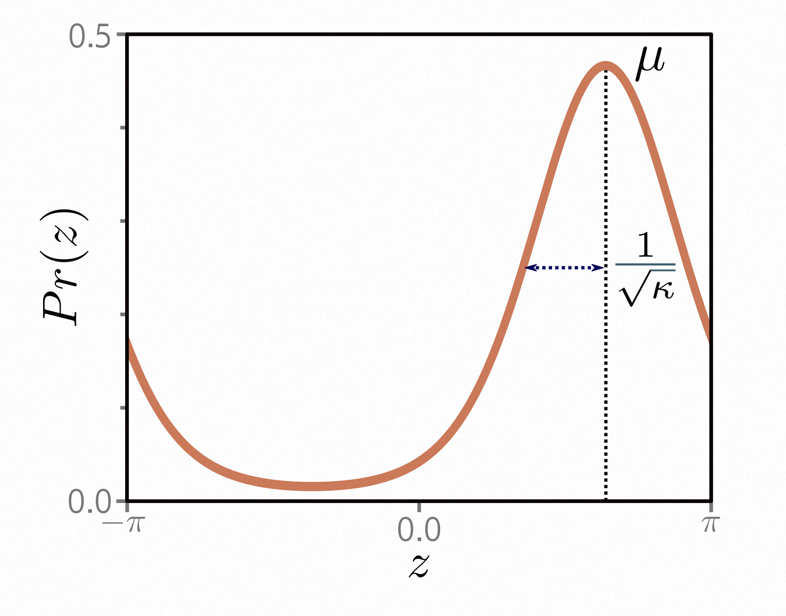
> 图5.13 von Mises分布定义在圆域$(π, π]$上。它有两个参数。均值$µ$确定了峰值的位置。浓度$κ > 0$的作用类似于方差的倒数。因此，$1/\sqrt{κ}$大致相当于正态分布中的标准差。

**非概率方法：** 在本章中讨论的概率方法并非必须采用，但近年来已成为默认选择；任何旨在减少模型输出与训练输出之间距离的损失函数都可以使用，而距离可以以任何合理的方式定义。有几种众所周知的非概率机器学习模型用于分类，包括支持向量机(Vapnik, 1995; Cristianini & Shawe-Taylor, 2000)，它们使用 *hinge loss*，以及AdaBoost(Freund & Schapire, 1997)，它使用 *exponential loss*.

## 5.10. 问题 - Problems

**问题5.1** 证明逻辑sigmoid函数$\operatorname{sig}[z]$将$ z = -∞ $映射为0，$ z = 0 $映射为0.5，$ z = ∞ $映射为1，其中。
$$
\operatorname{sig}[z]=\frac{1}{1+exp[-z]}\tag{5.32}
$$

**问题5.2** 二分类问题的损失函数$L$对于单个训练对$\{x, y\}$为。
$$
L = -(1-y)\operatorname{log}\left[1-\operatorname{sig}\left[f[x,ϕ]\right]\right] - y \operatorname{log}\left[\operatorname{sig}[f[x,ϕ]]\right] \tag{5.33}
$$

其中$\operatorname{sig}[•]$在方程[5.32](#_bookmark199)中定义。绘制该损失函数作为变换后的网络输出$\operatorname{sig}[f[x, ϕ]]∈ [0, 1] $的函数(i)当训练标签$ y = 0 $时，(ii)当$ y = 1 $时。

**问题5.3**∗ 假设我们想要构建一个模型，根据局部气压$ x $的测量值来预测主导风的方向$ y $（以弧度为单位）。适用于圆形域的合适分布是von Mises分布\(图[5.13) :](#_bookmark197)。

$$
Pr(y|µ, κ) =\frac{\operatorname{exp}[κ\operatorname{cos}[y-µ]}{2π\cdot\operatorname{Bessel_0[κ]}} \tag{5.34}
$$

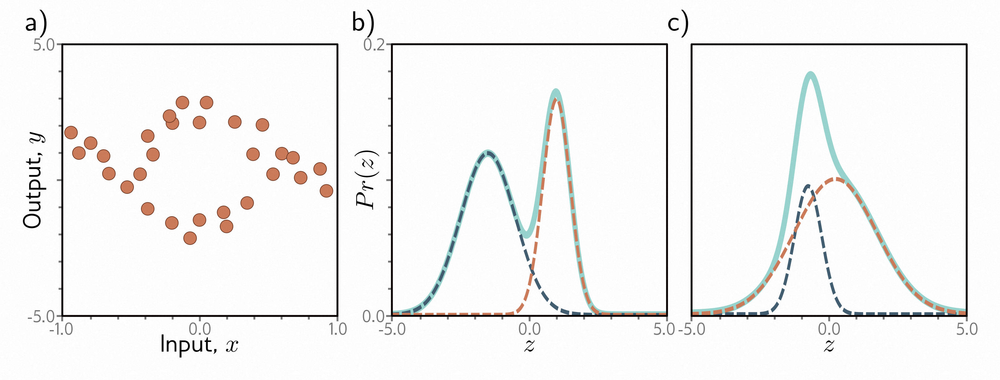
> 图5.14 多峰数据和高斯混合密度。
>
> - a) 示例训练数据，对于输入$ x $的中间值，相应的输出$ y $遵循两条路径之一。例如，在$ x = 0 $时，输出$ y $可能大致为-2或+3，但不太可能在这些值之间。
> - b) 高斯混合是适用于这种数据的概率模型。正如名称所示，该模型是两个或更多个具有不同均值和方差（这里是两个加权分布，虚线蓝色和橙色曲线）的正态分布的加权和（实线青色曲线）。当均值相距较远时，形成多峰分布。
> - c) 当均值接近时，混合可以模拟单峰但非正态密度。

其中$ µ $是平均方向的度量，$ κ $是浓度的度量（即方差的倒数）。术语$\operatorname{Bessel}_0[κ]$是零阶修正贝塞尔函数。

使用第[5.2](#recipe-for-constructing-loss-functions)节中的方法，开发一个用于学习模型$ f [x, ϕ] $的参数$ µ $的损失函数，以预测最可能的风向。您的解决方案应将浓度$ κ $视为常数。您将如何进行推理。

**问题5.4**∗ 有时，输入$ x $的输出$ y $是多模态的（图[5.14a) ;](#_bookmark203)对于给定的输入，存在多个有效的预测。在这种情况下，我们可以使用正态分量的加权和作为输出的分布。这被称为*高斯混合*模型。例如，两个高斯分量的混合具有参数$ θ = \{λ, µ_{1}, σ_{1}^{2}, µ_{2}, σ_{2}^{2}\} $。

其中$λ ∈[0, 1] $控制两个分量的相对权重，分别具有均值$ µ_{1}, µ_{2} $和方差$ σ_{1}^{2}, σ_{2}^{2} $。该模型可以表示具有两个峰值的分布（图[5.14b](#_bookmark203)）或具有一个峰值但形状更复杂的分布（图[5.14c](#_bookmark203)）。

使用第[5.2](#recipe-for-constructing-loss-functions)节中的方法，构建一个用于训练模型$ f [x, ϕ] $的损失函数，该模型接受输入$ x $，具有参数$ ϕ $，并预测两个高斯分量的混合。损失应基于$ I $个训练数据对$\{x_i, y_i\}$。在进行推理时，您预见到了哪些问题？

**问题5.5** 考虑将问题[5.3](#_bookmark201)中的模型扩展为使用两个von Mises分布来预测风向。为该模型编写似然函数$ Pr(y|θ)  $的表达式。网络需要产生多少个输出？

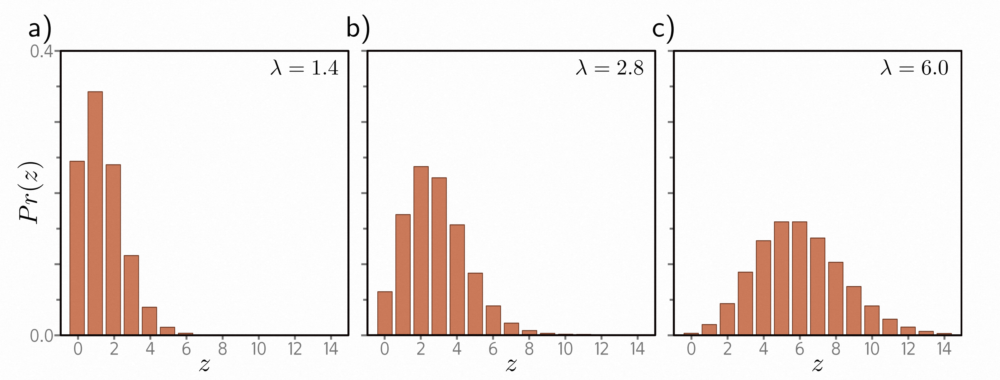
> 图5.15 泊松分布。这个离散分布定义在非负整数$ z ∈ \{0, 1, 2, \ldots\}$上。它有一个称为速率的单参数$λ ∈ \mathbb{R}^{+}$，它是分布的均值。a-c)速率分别为1.4、2.8和6.0的泊松分布。

**问题5.6** 考虑构建一个模型，根据包含有关白天时间、经度和纬度以及街区类型的数据$ x $，预测在下一分钟内通过城市中给定点的行人数量$ y∈ \{0, 1, 2, \ldots\}$。用于建模计数的合适分布是泊松分布（图[5.15](#_bookmark205)）。它具有一个称为*速率*的单参数$λ>0$，表示分布的均值。该分布具有概率密度函数。
$$
Pr(y=k)=\frac{λ^ke^{−λ}}{k!}\tag{5.36}
$$

为这个模型设计一个损失函数，假设我们可以访问$ I $个训练对$\{x_i, y_i\}$。

**问题5.7** 考虑一个多元回归问题，我们预测十个输出，即$ y ∈\mathbb{R_{10}} $，并且用独立的正态分布模型来建模，其中均值$ µ_{d} $由网络预测，方差$ σ^{2} $是常数。写出似然函数$ Pr(y|f[x, ϕ])$ 的表达式。证明如果我们不估计方差$ σ^{2} $，那么最小化该模型的负对数似然仍等价于最小化平方和的形式。

**问题5.8** 构建一个损失函数，用于基于每个维度具有不同方差$ σ_d^{2} $的独立正态分布进行多元预测$ y $。假设是异方差模型，即均值$ µ_{d} $和方差$ σ_d^{2} $都是数据的函数。

**问题5.9** 考虑一个多元回归问题，我们从数据$ x $中预测一个人的身高（以米为单位）和体重（以千克为单位）。在这里，单位的范围相差很大。你认为这会引起哪些问题？提出两个解决这些问题的方法。

**问题5.10** 将问题[5.3](#_bookmark201)中的模型扩展到同时预测风向和风速，并定义相应的损失函数。
