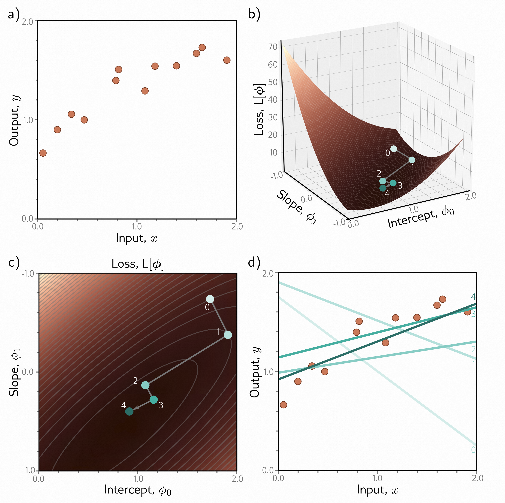
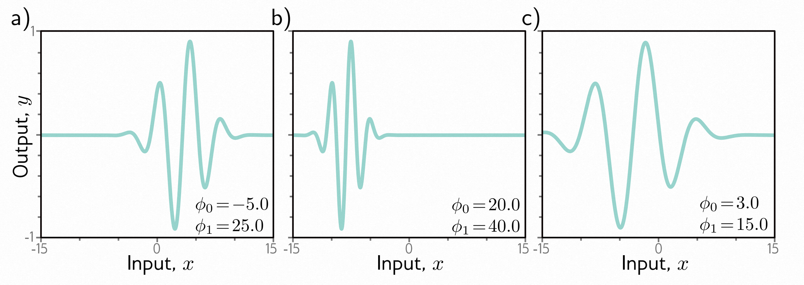
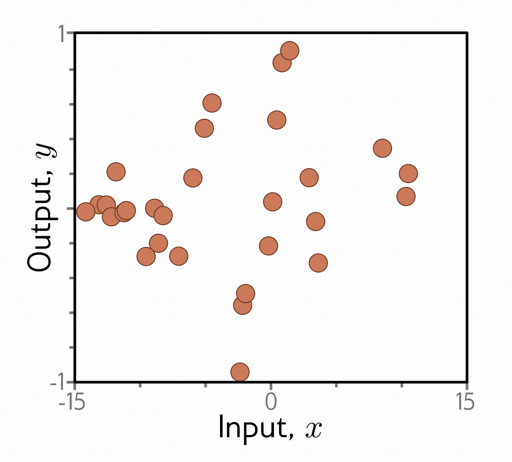
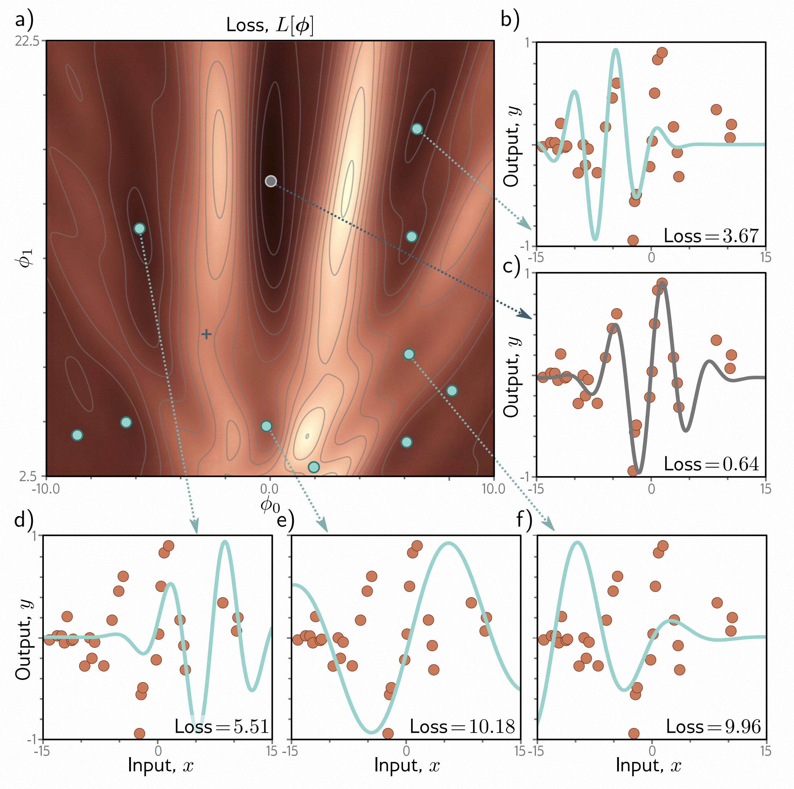
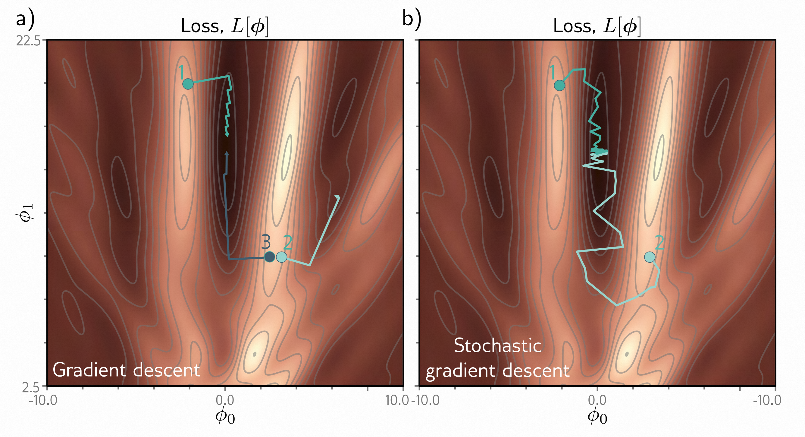
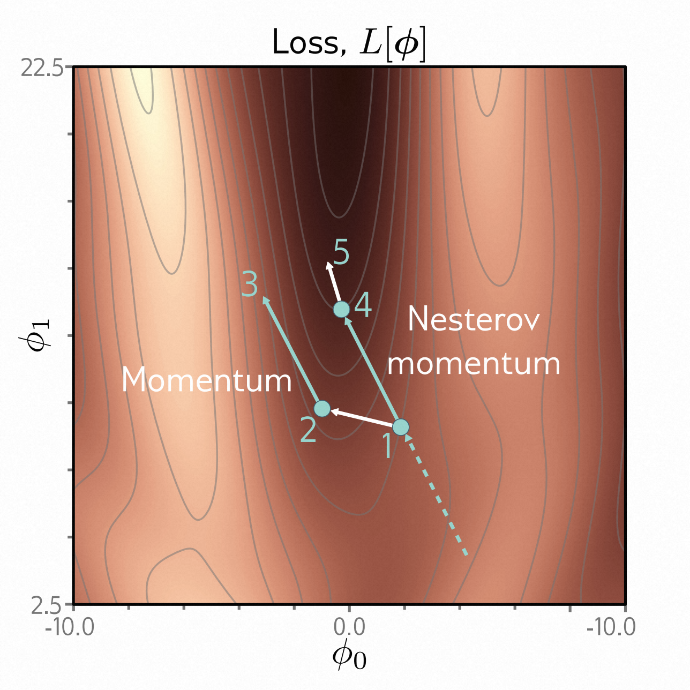
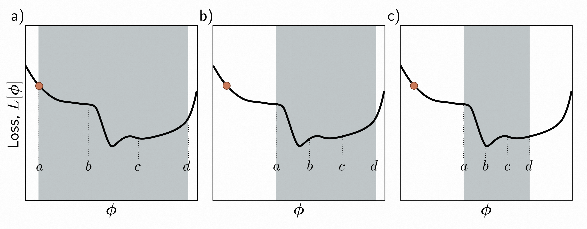
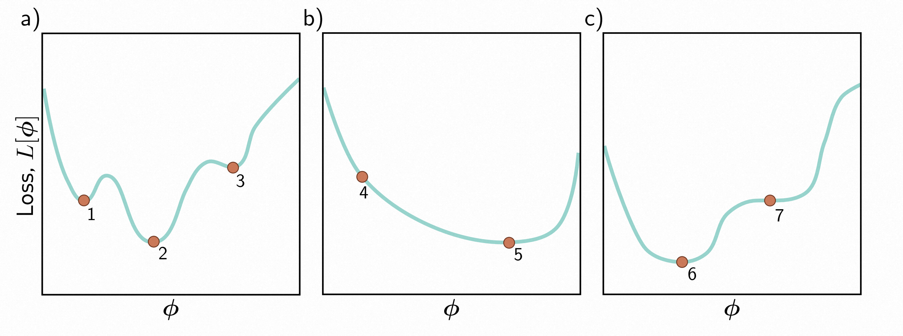

# 本章目录

- [本章目录](#本章目录)
- [第6章 模型拟合 - Fitting models](#第6章-模型拟合---fitting-models)
  - [6.1 梯度下降 - Gradient descent](#61-梯度下降---gradient-descent)
    - [6.1.1 线性回归示例 - Linear regression example](#611-线性回归示例---linear-regression-example)
    - [6.1.2 Gabor模型示例 - Gabor model example](#612-gabor模型示例---gabor-model-example)
    - [6.1.3 局部最小值和鞍点 - Local minima and saddle points](#613-局部最小值和鞍点---local-minima-and-saddle-points)
  - [6.2 随机梯度下降 - Stochastic gradient descent](#62-随机梯度下降---stochastic-gradient-descent)
    - [6.2.1 批次和迭代次数 - Batches and epochs](#621-批次和迭代次数---batches-and-epochs)
    - [6.2.2 随机梯度下降的特性 - Properties of stochastic gradient descent](#622-随机梯度下降的特性---properties-of-stochastic-gradient-descent)
  - [6.3 动量 - Momentum](#63-动量---momentum)
    - [6.3.1 Nesterov加速动量 - Nesterov accelerated momentum](#631-nesterov加速动量---nesterov-accelerated-momentum)
  - [6.4 Ada - Adam](#64-ada---adam)
  - [6.5 训练算法的超参数 - Training algorithm hyperparameters](#65-训练算法的超参数---training-algorithm-hyperparameters)
  - [6.6 总结 - Summary](#66-总结---summary)
  - [6.7 注释 - Notes](#67-注释---notes)
  - [6.8 问题 - Problems](#68-问题---problems)

<!-- vscode-markdown-toc-config
	numbering=true
	autoSave=true
	/vscode-markdown-toc-config -->
<!-- /vscode-markdown-toc -->
# 第6章 模型拟合 - Fitting models

第3章和第4章介绍了浅层和深层神经网络。它们代表了一系列分段线性函数，其中参数确定了特定的函数。第5章介绍了损失函数 - 一个表示网络预测与训练集的真实值之间不匹配程度的数值。

损失函数取决于网络的参数，本章将讨论如何找到使损失最小化的参数值。这被称为学习网络参数，或者简单地称为训练或拟合模型。该过程是选择初始参数值，然后迭代以下两个步骤：(i) 计算损失相对于参数的导数(梯度)，(ii) 根据梯度调整参数以减小损失。经过多次迭代，我们希望达到损失函数的全局最小值。

本章解决了这两个步骤中的第二个步骤；我们考虑调整参数以减小损失的算法。第7章讨论了如何初始化参数和计算神经网络的梯度。

## 6.1 梯度下降 - Gradient descent

为了拟合模型，我们需要一个输入/输出对的训练集$ \{x_{i}, y_{i}\} $。我们寻找模型$ f [x_{i}, ϕ] $的参数$ ϕ $，将输入$ x_{i} $映射到输出$ y_{i} $。为此，我们定义一个损失函数$ L [ϕ] $，返回一个量化这种映射不匹配的数值。*优化算法*的目标是找到使损失最小化的参数$ \hat{ϕ} $：

$$
\hat{ϕ} = \underset{ϕ}{\operatorname{argmin}}\left[L[ϕ]\right]\tag{6.1}
$$

有许多优化算法，但用于训练神经网络的标准方法是迭代的。这些算法启发式地初始化参数，然后以使损失减小的方式重复调整参数。

这个类别中最简单的方法是*梯度下降*。它从初始参数$ ϕ =  [ϕ_{0}, ϕ_{1}, \ldots, ϕ_{N}]^{T} $开始，然后不断迭代两个步骤：

**步骤1.** 计算损失相对于参数的导数：

$$
\frac{\partial L}{\partial\phi}=\begin{bmatrix}\frac{\partial L}{\partial\phi_0}\\\frac{\partial L}{\partial\phi_1}\\\vdots\\\frac{\partial L}{\partial\phi_N}\end{bmatrix}\tag{6.2}
$$

**步骤2.** 根据以下规则更新参数：

$$
\phi\longleftarrow\phi-\alpha\cdot\frac{\partial L}{\partial\phi} \tag{6.3}
$$

其中正标量$ α $确定变化的大小。

第一步计算当前位置的损失函数的梯度。这确定了损失函数的上坡方向。第二步向下坡移动一个小距离 $α$(因此有负号)。参数$ α $可以固定(在这种情况下，我们称之为 *学习率* )，或者我们可以进行 *线搜索*，尝试几个$ α $的值，找到最能减小损失的值。

在损失函数的最小值处，曲面必须是平坦的(否则我们可以通过下坡进一步改进)。因此，梯度将为零，参数将停止变化。在实践中，我们监视梯度的大小，并在其变得太小时终止算法。

### 6.1.1 线性回归示例 - Linear regression example

考虑将梯度下降应用于第[2章](#_bookmark39)中的一维线性回归模型。模型$ f [x, ϕ] $将标量输入$ x $映射到标量输出$ y $，并具有参数$ ϕ =  [ϕ_{0}, ϕ_{1}]^{T} $，表示y轴截距和斜率：

$$
\begin{array}{rcl}y&=&\mathrm{f}[x,\phi]\\&=&\phi_0+\phi_1x.\end{array}\tag{6.4}
$$

给定包含$ I $个输入/输出对$ \{x_{i}, y_{i}\} $的数据集，我们选择最小二乘损失函数：

$$
\begin{aligned}
\mathrm{L}[\phi]=\sum_{i=1}^I\ell_i
&=\space\space\sum_{i=1}^I\left(\mathrm{f}[x_i,\phi]-y_i\right)^2\\
&=\space\space\sum_{i=1}^I\left(\phi_0+\phi_1x_i-y_i\right)^2
\end{aligned}\tag{6.5}
$$

其中术语$ ℓ_{i} = (ϕ_{0} + ϕ_{1}x_{i} - y_{i})^{2} $是第$ i^{th} $个训练样本对损失的个体贡献。

> 图6.1 线性回归模型的梯度下降。
>
> - a) 包含$ I = 12 $个输入/输出对$ x_{i}, y_{i} $的训练集。
> - b) 损失函数显示梯度下降的迭代过程。我们从点0开始，沿着最陡的下坡方向移动，直到无法进一步改进，到达点1。然后我们重复这个过程。我们测量点1处的梯度并向下移动到点2，依此类推。
> - c) 这可以更好地可视化为热图，其中亮度表示损失。仅经过四次迭代，我们就已经接近最小值。
> - d) 参数为点0（最浅的线）的模型非常糟糕地描述了数据，但是每次迭代都会改善拟合。参数为点4（最暗的线）的模型已经是对训练数据的合理描述。

损失函数关于参数的导数可以分解为各个贡献的导数之和：

$$
\frac{\partial L}{\partial\boldsymbol{\phi}}=\frac\partial{\partial\boldsymbol{\phi}}\sum_{i=1}^I\ell_i=\sum_{i=1}^I\frac{\partial\ell_i}{\partial\boldsymbol{\phi}}\tag{6.6}
$$

其中这些导数由以下公式给出：

$$
\frac{\partial\ell_i}{\partial\phi}=\begin{bmatrix}\frac{\partial\ell_i}{\partial\phi_0}\\\frac{\partial\ell_i}{\partial\phi_1}\end{bmatrix}=\begin{bmatrix}2(\phi_0+\phi_1x_i-y_i)\\2x_i(\phi_0+\phi_1x_i-y_i)\end{bmatrix}.\tag{6.7}
$$

图[6.1](#_bookmark215)显示了该算法的进展，我们按照方程[6.6](#_bookmark217)和[6.7](#_bookmark218)迭代计算导数，然后使用方程[6.3](#_bookmark213)中的规则更新参数。在这种情况下，我们使用线搜索过程来找到每次迭代中使损失最大程度减小的$ α $的值。

### 6.1.2 Gabor模型示例 - Gabor model example

线性回归问题的损失函数（图[6.1c](#_bookmark215)）总是具有明确定义的全局最小值。更正式地说，它们是 *凸函数*，这意味着没有弦（曲面上两点之间的线段）与函数相交。凸性意味着无论我们在哪里初始化参数，只要我们沿着下坡走，就一定会达到最小值；训练过程不会失败。

不幸的是，大多数非线性模型的损失函数，包括浅层和深层网络，都是 *非凸的*。由于参数的数量，可视化神经网络的损失函数是具有挑战性的。因此，我们首先探索一个具有两个参数的简单非线性模型，以了解非凸损失函数的特性：

$$
\mathrm{f}[x,\phi]=\sin[\phi_0+0.06\cdot\phi_1x]\cdot\exp\left(-\frac{(\phi_0+0.06\cdot\phi_1x)^2}{32.0}\right).\tag{6.8}
$$

这个*Gabor模型*将标量输入$ x $映射到标量输出$ y $，由一个正弦分量（创建一个振荡函数）乘以一个负指数分量（导致振幅随着从中心移动而减小）组成。它有两个参数$ \phi =  [\phi_{0}, \phi_{1}]^{T} $，其中$ \phi_{0}∈\mathbb{R} $确定函数的平均位置，$ \phi_{1}∈\mathbb{R^+} $沿着*x轴*（图[6.2](#_bookmark222)）进行拉伸或挤压。

考虑一个包含$ I $个示例$ \{x_{i}, y_{i}\} $的训练集（图[6.3](#_bookmark223)）。对于$ I $个训练示例，最小二乘损失函数定义为：

$$
\mathrm{L}[\boldsymbol{\phi}]=\sum_{i=1}^I\left(\mathrm{f}[x_i,\boldsymbol{\phi}]-y_i\right)^2 \tag{6.8}
$$

再次强调，目标是找到最小化该损失的参数$ \hat{\phi} $。

> 图6.2 Gabor模型。这个非线性模型将标量输入$ x $映射到标量输出$ y $，并具有参数$ \phi =  [\phi_{0}, \phi_{1}]^{T} $。它描述了一个随着距离中心的增加而振幅减小的正弦函数。参数$ \phi_{0}∈\mathbb{R} $确定中心的位置。随着$ \phi_{0} $的增加，函数向左移动。参数$ \phi_{1}∈\mathbb{R^+} $相对于中心沿*x轴*挤压函数。随着$ \phi_{1} $的增加，函数变窄。a-c) 具有不同参数的模型。

> 图6.3 用于拟合Gabor模型的训练数据。训练数据集包含28个输入/输出示例$ \{x_{i}, y_{i}\} $。这些数据是通过均匀采样$ x_{i} ∈   [-15, 15] $，将样本通过参数为$ \phi =  [0.0, 16.6]^{T} $的Gabor模型，并添加正态分布噪声而创建的。
>
### 6.1.3 局部最小值和鞍点 - Local minima and saddle points

图[6.4](#_bookmark224)展示了与该数据集相关的Gabor模型的损失函数。这里有许多*局部最小值（青色圆圈）*。在这些点上，梯度为零，如果我们朝任何方向移动，损失都会增加，但我们并*不*处于函数的整体最小值。具有最低损失的点被称为*全局最小值*，用灰色圆圈表示。

如果我们从一个随机位置开始，使用梯度下降向下移动，不能保证我们最终会到达全局最小值并找到最佳参数（图[6.5a](#_bookmark226)）。同样或甚至更有可能的是，算法会停止在其中一个局部最小值上。此外，我们无法知道是否在其他地方有更好的解决方案。

> 图6.4 Gabor模型的损失函数。
>
> - a) 损失函数是非凸的，除了全局最小值（灰色圆圈）外，还有多个局部最小值（青色圆圈）。它还包含鞍点，鞍点处梯度局部为零，但函数在一个方向上增加，在另一个方向上减少。蓝色十字是鞍点的一个例子；当我们水平向任一方向移动时，函数会减小，但当我们垂直移动时，函数会增加。
> - b-f) 与不同最小值相关的模型。在每种情况下，没有小的变化可以减少损失。面板(c)显示了全局最小值，其损失为0.64。

> 图6.5 梯度下降与随机梯度下降。
>
> - a) 带有线搜索的梯度下降。只要梯度下降算法在损失函数的正确“山谷”中初始化（例如点1和点3），参数估计就会稳步向全局最小值移动。然而，如果它在这个山谷之外初始化（例如点2），它将下降到其中一个局部最小值。
> - b) 随机梯度下降在优化过程中添加了噪音，因此有可能从错误的山谷（例如点2）中逃脱并达到全局最小值。

此外，损失函数中包含*鞍点（例如图[6.4](#_bookmark224)中的蓝色十字）*。在这里，梯度为零，但函数在某些方向上增加，在其他方向上减少。如果当前参数不恰好在鞍点上，那么梯度下降可以通过向下移动来逃脱。然而，鞍点附近的表面是平坦的，所以很难确定训练是否已经收敛；如果我们在梯度很小的时候终止算法，可能会错误地停在鞍点附近。

## 6.2 随机梯度下降 - Stochastic gradient descent

Gabor模型有两个参数，所以我们可以通过以下两种方法找到全局最小值：（i）穷举搜索参数空间或（ii）从不同位置重复开始梯度下降，并选择具有最低损失的结果。然而，神经网络模型可能有数百万个参数，因此这两种方法都不实际。简而言之，使用梯度下降找到高维损失函数的全局最优解是具有挑战性的。我们可以找到*一个*最小值，但无法确定这是否是全局最小值，甚至是一个好的最小值。

其中一个主要问题是梯度下降算法的最终目的完全由起始点决定。*随机梯度下降（SGD）* 试图通过在每一步中向梯度添加一些噪音来解决这个问题。解决方案仍然平均向下移动，但在任何给定的迭代中，选择的方向不一定是最陡的向下方向。实际上，它可能根本不是向下的。SGD算法有可能暂时向上移动，从而从一个损失函数的“山谷”跳到另一个（图[6.5b](#_bookmark226)）。

> 图6.6 批量大小为三的Gabor模型的SGD的另一种视角。
>
> - a) 整个训练数据集的损失函数。在每次迭代中，可能的参数变化具有概率分布（插图显示了样本）。这些对应于三个批次元素的不同选择。
> - b) 一个可能的批次的损失函数。SGD算法在这个函数上向下移动，移动距离由学习率和局部梯度大小决定。当前模型（插图中的虚线函数）改变以更好地适应批次数据（实线函数）。
> - c) 不同的批次创建不同的损失函数，并导致不同的更新。
> - d) 对于这个批次，算法在批次损失函数上向*下*移动，但在全局损失函数（面板a）上向*上*移动。这就是SGD如何逃脱局部最小值。

### 6.2.1 批次和迭代次数 - Batches and epochs

引入随机性的机制很简单。在每次迭代中，算法会选择训练数据的一个随机子集，并仅从这些样本中计算梯度。这个子集被称为*小批量*或*批次*。因此，迭代$t$时模型参数$ϕ_{t}$的更新规则如下：

$$
\phi_{t+1}\longleftarrow\phi_t-\alpha\cdot\sum_{i\in\mathcal{B}_t}\frac{\partial\ell_i[\phi_t]}{\partial\phi}\tag{6.10}
$$

其中$B_{t}$是包含当前批次中输入/输出对索引的集合，$ℓ_{i}$是第$i$个对的损失。$α$是学习率，与梯度大小一起决定每次迭代的移动距离。学习率在过程开始时选择，并且不依赖于函数的局部特性。

批次通常是从数据集中无重复地随机抽取的。算法会遍历训练样本，直到使用完所有数据，然后再次从完整的训练数据集中进行抽样。对整个训练数据集的一次遍历称为*迭代次数*。一个批次可以只包含一个样本，也可以包含整个数据集。后一种情况称为*全批次梯度下降*，与常规（非随机）梯度下降相同。

随机梯度下降的另一种解释是，它在每次迭代中计算不同损失函数的梯度；损失函数取决于模型和训练数据，因此对于每个随机选择的批次，损失函数都会有所不同。从这个角度来看，随机梯度下降在不断变化的损失函数上执行确定性梯度下降（图[6.6](#_bookmark228)）。然而，尽管存在这种变数，任意点处的期望损失和期望梯度与梯度下降保持相同。

### 6.2.2 随机梯度下降的特性 - Properties of stochastic gradient descent

随机梯度下降具有几个吸引人的特点。

- 首先，尽管它在轨迹中添加了噪声，但它仍然在每次迭代中改善对数据子集的拟合。因此，即使更新不是最优的，它们也往往是合理的。
- 其次，由于它无重复地抽取训练样本并遍历数据集，所有训练样本仍然平等地贡献。
- 第三，仅从训练数据的子集计算梯度的计算成本较低。
- 第四，它（原则上）可以避免局部最小值。
- 第五，它减少了陷入鞍点的机会；在损失函数的任何点上，至少有一些可能的批次会有一个显著的梯度。
- 最后，有一些证据表明，在实践中，随机梯度下降找到的神经网络参数能够使其对新数据具有良好的泛化能力（见第[9.2](#implicit-regularization)节）。

随机梯度下降不一定以传统意义上的“收敛”。然而，好处是，当我们接近全局最小值时，所有数据点都能被模型很好地描述。因此，无论选择哪个批次，梯度都会很小，参数的变化也不会太大。在实践中，随机梯度下降通常使用*学习率调度*。学习率$α$从一个较高的值开始，并在每$N$个迭代周期后以一个常数因子递减。其逻辑是，在训练的早期阶段，我们希望算法能够在参数空间中探索，从一个山谷跳到另一个山谷，找到一个合理的区域。在后期阶段，我们大致处于正确的位置，并更关注参数的微调，因此我们减小$α$以进行较小的变化。

## 6.3 动量 - Momentum

对随机梯度下降的常见修改是添加一个*动量*项。我们使用当前批次计算的梯度和上一步移动的方向的加权组合来更新参数：

$$
\begin{aligned}\mathbf{m}_{t+1}&\leftarrow\beta\cdot\mathbf{m}_t+(1-\beta)\sum_{i\in\mathcal{B}_t}\frac{\partial\ell_i[\phi_t]}{\partial\phi}\\\phi_{t+1}&\leftarrow\phi_t-\alpha\cdot\mathbf{m}_{t+1}\end{aligned}\tag{6.11}
$$

其中$m_{t}$是动量（驱动第$t$次迭代的更新），$β∈ [0, 1)$控制梯度随时间的平滑程度，$α$是学习率。

动量计算的递归公式意味着梯度步长是所有先前梯度的无限加权和，随着时间的推移，权重变小。如果所有这些梯度在多次迭代中都对齐，那么有效学习率会增加，但如果梯度方向反复改变，使得求和项中的项相互抵消，那么有效学习率会减小。总体效果是轨迹更加平滑，在山谷中减少振荡行为（图[6.7](#_bookmark233)）。

> 图6.7 带动量的随机梯度下降。
>
> - a) 常规的随机下降方法在寻找最小值时走了一条非常间接的路径。
> - b) 使用动量项，当前步骤的变化是前一次变化和从批量计算的梯度的加权组合。这样可以平滑轨迹并加快收敛速度。

### 6.3.1 Nesterov加速动量 - Nesterov accelerated momentum

动量项可以被看作是SGD算法下一步移动的粗略预测。Nesterov加速动量（图[6.8](#_bookmark234)）在这个预测点计算梯度，而不是在当前点计算梯度：
$$
\begin{array}{rcl}\mathbf{m}_{t+1}&\leftarrow&\beta\cdot\mathbf{m}_t+(1-\beta)\sum_{i\in\mathcal{B}_t}\frac{\partial\ell_i[\phi_t-\alpha\cdot\mathbf{m}_t]}{\partial\phi}\\\\\phi_{t+1}&\leftarrow&\phi_t-\alpha\cdot\mathbf{m}_{t+1}\end{array}
\tag{6.12}
$$

现在梯度在$ϕ_{t} - α\cdotp{m}_{t}$处进行评估。可以这样理解，梯度项纠正了仅由动量提供的路径。

> 图6.8 Nesterov加速动量。解决方案沿着虚线行进到达点1。传统的动量更新在点1处测量梯度，沿着该方向移动一定距离到达点2，然后添加上一次迭代的动量项（即沿着虚线方向），到达点3。Nesterov动量更新首先应用动量项（从点1移动到点4），然后测量梯度并应用更新到达点5。

## 6.4 Ada - Adam

固定步长的梯度下降具有以下不良特性：它对与大梯度相关的参数进行大幅调整（也许我们应该更加谨慎），对与小梯度相关的参数进行小幅调整（也许我们应该进一步探索）。当损失曲面的梯度在一个方向上比另一个方向陡峭得多时，很难选择一个学习率既能在两个方向上取得良好进展，又能保持稳定（图6.9a-b）。

一种直接的方法是对梯度进行归一化，以便我们在每个方向上移动一个固定的距离（由学习率控制）。为此，我们首先测量梯度 $m_{t + 1}$ 和逐点平方梯度 $v_{t + 1}$。

$$
\begin{aligned}
\mathbf{m}_{t+1} &\leftarrow \frac{\partial L[\phi_t]}{\partial\phi} \\
\mathbf{v}_{t+1} &\leftarrow \left(\frac{\partial L[\phi_t]}{\partial\phi}\right)^2 \\
\end{aligned}
\tag{6.13}
$$

然后，我们应用更新规则。

$$
\begin{array}{rcl}
\phi_{t+1} &\leftarrow &\phi_t - \alpha \cdot \frac{\mathbf{m}_{t+1}}{\sqrt{\mathbf{v}_{t+1}+\epsilon}}
\end{array}
\tag{6.14}
$$

其中，平方根和除法都是逐点进行的，$α$ 是学习率，$ϵ$ 是一个小常数，用于防止当梯度大小为零时除以零。术语 $v_{t + 1}$ 是平方梯度，其正根用于归一化梯度本身，因此每个坐标方向上只保留了符号。结果是算法沿着每个坐标移动一个固定的距离 $α$，其中方向由向下的方向决定（图6.9c）。这个简单的算法在两个方向上都取得了良好的进展，但如果恰好落在最小值上，它将不会收敛。相反，它将在最小值周围来回反弹。

*自适应矩估计*，或称为*Adam*，采用了这个思想，并在梯度估计和平方梯度上添加了动量。

$$
\begin{aligned}
\mathbf{m}_{t+1} &\leftarrow \beta \cdot \mathbf{m}_t + (1-\beta) \frac{\partial L[\phi_t]}{\partial\phi} \\
\mathbf{v}_{t+1} &\leftarrow \gamma \cdot \mathbf{v}_t + (1-\gamma) \left(\frac{\partial L[\phi_t]}{\partial\phi}\right)^2 \\
\end{aligned}
\tag{6.15}
$$

其中，$β$ 和 $γ$ 是两个统计量的动量系数。

> 图6.9 自适应矩估计（Adam）。
>
> - a）这个损失函数在垂直方向上变化很快，但在水平方向上变化很慢。如果我们使用一个在垂直方向上取得良好进展的学习率运行全批量梯度下降，那么算法需要很长时间才能到达最终的水平位置。
> - b）如果选择的学习率使算法在水平方向上取得良好进展，那么它在垂直方向上会超调并变得不稳定。
> - c）一种直接的方法是在每个步骤中沿着每个轴移动一个固定的距离，以便我们在两个方向上都向下移动。这是通过归一化梯度幅值并仅保留符号来实现的。然而，这通常不会收敛到精确的最小值，而是在最小值周围来回振荡（在这里是在最后两个点之间）。
> - d）Adam算法在估计梯度和归一化项中都使用了动量，从而创建了一个更平滑的路径。

使用动量等价于对这些统计量的历史进行加权平均。在过程开始时，所有先前的测量实际上都是零，导致了不现实地小的估计值。因此，我们使用以下规则修改这些统计量。

$$
\begin{array}{rcl}
\tilde{\mathbf{m}}_{t+1} &\leftarrow &\frac{\mathbf{m}_{t+1}}{1-\beta^{t+1}} \\
\tilde{\mathbf{v}}_{t+1} &\leftarrow &\frac{\mathbf{v}_{t+1}}{1-\gamma^{t+1}} \\
\end{array}
\tag{6.16}
$$

由于 $β$ 和 $γ$ 在范围 $[0, 1)$ 内，带有指数 $t + 1$ 的项在每个时间步骤中变得越来越小，分母趋于一，这种修改具有递减的效果。

最后，我们像以前一样更新参数，但使用修改后的项。

$$
\phi_{t+1} \leftarrow \phi_{t} - \alpha \cdot \frac{\tilde{\mathbf{m}}_{t+1}}{\sqrt{\tilde{\mathbf{v}}_{t+1}+\epsilon}}
\tag{6.17}
$$

结果是一个能够收敛到整体最小值并在参数空间的每个方向上取得良好进展的算法。请注意，Adam通常在随机设置中使用，其中梯度及其平方是从小批量中计算得到的。

$$
\begin{aligned}
\mathbf{m}_{t+1} &\leftarrow \beta \cdot \mathbf{m}_t + (1-\beta) \sum_{i\in\mathcal{B}_t} \frac{\partial\ell_i[\phi_t]}{\partial\phi} \\
\mathbf{v}_{t+1} &\leftarrow \gamma \cdot \mathbf{v}_t + (1-\gamma) \sum_{i\in\mathcal{B}_t} \left(\frac{\partial\ell_i[\phi_t]}{\partial\phi}\right)^2,
\end{aligned}
\tag{6.18}
$$
而在实际操作中，轨迹是充满噪音的。

正如我们将在第[7](#_bookmark258)章中看到的那样，神经网络参数的梯度大小可能取决于它们在网络中的深度。Adam算法有助于补偿这种倾向，并平衡不同层之间的变化。在实践中，Adam算法还具有初始学习率不敏感的优势，因为它避免了类似于图[6.9a--b](#_bookmark237)中的情况，所以它不需要复杂的学习率调度。

## 6.5 训练算法的超参数 - Training algorithm hyperparameters

学习算法、批量大小、学习率调度和动量系数的选择都被视为训练算法的*超参数*；这些超参数直接影响最终模型的性能，但与模型参数不同。选择这些超参数可能更多地是一门艺术而不是科学，通常会使用不同的超参数训练多个模型，并选择最佳模型。这被称为*超参数搜索*。我们将在第[8](#_bookmark314)章中再次讨论这个问题。

## 6.6 总结 - Summary

本章讨论了模型训练。这个问题被定义为寻找与损失函数$ L [ϕ] $的最小值相对应的参数$ ϕ $。梯度下降方法测量当前参数下损失函数的梯度（即当我们对参数进行微小改变时损失如何变化）。然后它将参数朝着最快降低损失的方向移动。这个过程重复进行直到收敛。

对于非线性函数，损失函数可能同时具有局部最小值（梯度下降被困住的地方）和鞍点（梯度下降可能看起来已经收敛，但实际上没有）。随机梯度下降有助于缓解这些问题。在每次迭代中，我们使用不同的随机数据子集（一个批次）来计算梯度。这样可以为过程添加噪音，并帮助防止算法陷入参数空间的次优区域。每次迭代也更加节省计算资源，因为它只使用数据的一个子集。我们还看到添加动量项可以使收敛更加高效。最后，我们介绍了Adam算法。

本章的思想适用于优化*任何*模型。下一章将讨论与神经网络训练相关的两个方面。首先，我们将解决如何计算神经网络参数相对于损失的梯度的问题。这是通过著名的反向传播算法实现的。其次，我们将讨论如何在优化开始之前初始化网络参数。如果初始化不慎，优化使用的梯度可能会变得非常大或非常小，从而阻碍训练过程。

## 6.7 注释 - Notes

**优化算法：** 优化算法在工程领域被广泛使用，通常更常用术语“目标函数”而不是损失函数或成本函数。梯度下降法是由[柯西](#_bookmark1361)（1847年）发明的，而随机梯度下降法至少可以追溯到[罗宾斯和蒙罗](#_bookmark2057)（1951年）。两者之间的现代折中方法是随机方差减少下降法（[Johnson和Zhang](#_bookmark1707)，[2013](#_bookmark1707)），其中完整的梯度周期性计算，随机更新插入其中。关于神经网络优化算法的综述可以在[Ruder](#_bookmark2088)（2016年）、[Bottou等人](#_bookmark1322)（2018年）和[Sun](#_bookmark2190)（2020年）中找到。[Bottou](#_bookmark1346)（2012年）讨论了SGD的最佳实践，包括无重复洗牌。

> 第[20](#_bookmark1059)章讨论了在深度学习中鞍点和局部最小值到底有多大问题。实际上，深度网络训练起来出奇地容易。

**凸性、极小值和鞍点：** 如果没有弦（曲面上两点之间的线段）与函数相交，则函数是凸的。这可以通过代数方法进行测试，考虑到*Hessian矩阵（二阶导数的矩阵）*。

$$
\mathbf{H}[\phi]=\begin{bmatrix}\frac{\partial^2L}{\partial\phi_0^2}&\frac{\partial^2L}{\partial\phi_0\partial\phi_1}&\ldots&\frac{\partial^2L}{\partial\phi_0\partial\phi_N}\\\frac{\partial^2L}{\partial\phi_1\partial\phi_0}&\frac{\partial^2L}{\partial\phi_1^2}&\ldots&\frac{\partial^2L}{\partial\phi_1\partial\phi_N}\\\vdots&\vdots&\ddots&\vdots\\\frac{\partial^2L}{\partial\phi_N\partial\phi_0}&\frac{\partial^2L}{\partial\phi_N\partial\phi_1}&\ldots&\frac{\partial^2L}{\partial\phi_N^2}\end{bmatrix}.
$$

如果Hessian矩阵在所有可能的参数值上都是正定的（具有正的特征值），则函数是凸的；损失函数将呈现出平滑的碗状（如图[6.1c](#_bookmark215)），因此训练相对容易。只会有一个全局最小值，没有局部最小值或鞍点。

对于任何损失函数，梯度为零的位置处的Hessian矩阵的特征值允许我们将此位置分类为（i）极小值（特征值都是正的），（ii）极大值（特征值都是负的）或（iii）鞍点（正的特征值与我们处于极小值的方向相关，负的特征值与我们处于极大值的方向相关）。

**线搜索：** 固定步长的梯度下降法效率低下，因为移动的距离完全取决于梯度的大小。当函数变化快时（也许应该更加谨慎），它会移动很远，但当函数变化缓慢时（也许应该进一步探索），它只会移动很短的距离。因此，梯度下降法通常与线搜索过程结合使用，我们沿着期望的方向对函数进行采样，以找到最佳的步长。其中一种方法是括号法（图[6.10](#_bookmark245)）。梯度下降法的另一个问题是，当下降到山谷时会导致低效的振荡行为（例如，图[6.5a](#_bookmark226)中的路径1）。

**超越梯度下降法：** 已经开发了许多解决梯度下降法问题的算法。最著名的是牛顿法，它利用Hessian矩阵的逆来考虑曲面的曲率；如果函数的梯度变化快，那么它会应用更谨慎的更新。这种方法消除了线搜索的需要，并且不会出现振荡行为。然而，它也有自己的问题；在其最简单的形式中，它朝着最近的极值点移动，但如果我们离山顶比离山谷更近，那么这可能是一个极大值。此外，当参数数量很大时，如神经网络中，计算逆Hessian矩阵是不可行的。

**SGD的特性：** 当学习率趋近于零时，SGD的极限是一个随机微分方程[Jastrzębski et al](#_bookmark1689) . [(2018](#_bookmark1689) )。他们证明了这个方程依赖于学习率与批量大小的比率，并且学习率与批量大小的比率与找到的最小值的宽度之间存在关系。较宽的最小值被认为更理想；如果测试数据的损失函数相似，那么参数估计的小误差对测试性能的影响很小。[He et al](#_bookmark1611) . [(2019](#_bookmark1611) )证明了SGD的泛化界限与批量大小与学习率的比率呈正相关。他们在不同的架构和数据集上训练了大量的模型，并发现当批量大小与学习率的比率较低时，测试准确率会提高。[Smith et al](#_bookmark2153) . [(2018](#_bookmark2153) )和[Goyal et al](#_bookmark1589) . [(2018](#_bookmark1589) )也确定了批量大小与学习率的比率对泛化很重要（见图[20.10](#_bookmark1085)）。

**动量：** 使用动量加速优化的想法可以追溯到[Polyak](#_bookmark2020) [(1964](#_bookmark2020))。[Goh](#_bookmark1558) [(2017](#_bookmark1558))对动量的特性进行了深入讨论。Nesterov加速梯度法是由[Nesterov](#_bookmark1954) [(1983](#_bookmark1954))引入的。Nesterov动量首次应用于随机梯度下降的上下文中，由[Sutskever et al](#_bookmark2194) . [(2013](#_bookmark2194))提出。

> 图6.10 使用括号法进行线搜索。
>
> - a) 当前解位于位置$ a $（橙色点），我们希望搜索区域$[a, d]$（灰色阴影区域）。我们在搜索区域内定义两个点$ b, c $并评估这些点上的损失函数。这里$ L[b] > L[c] $，因此我们消除了范围$[a, b]$。
> - b) 现在我们在精细化的搜索区域中重复此过程，并发现$ L[b] < L[c] $，因此我们消除了范围$[c, d]$。
> - c) 我们重复此过程，直到最小值被紧密地夹住。

**自适应训练算法：** AdaGrad（[Duchi et al.](#_bookmark1491)，[2011](#_bookmark1491)）是一种优化算法，通过为每个参数分配不同的学习率来解决某些参数可能需要移动更远的可能性。AdaGrad使用每个参数的累积平方梯度来衰减其学习率。这种方法的缺点是学习率随时间的推移而减小，学习可能在找到最小值之前停止。RMSProp（[Hinton et al.](#_bookmark1631)，[2012a](#_bookmark1631)）和AdaDelta（[Zeiler](#_bookmark2375)，[2012](#_bookmark2375)）修改了这个算法，以帮助防止这些问题，通过递归更新平方梯度项。

到目前为止，最广泛使用的自适应训练算法是自适应矩估计优化或Adam（[Kingma & Ba](#_bookmark1742)，[2015](#_bookmark1742)）。它结合了动量（其中梯度向量随时间平均）和AdaGrad、AdaDelta和RMSProp（其中使用平滑的平方梯度项来修改每个参数的学习率）的思想。Adam算法的原始论文对于凸损失函数提供了收敛证明，但是[Reddi et al](#_bookmark2041) . [(2018](#_bookmark2041) )发现了一个反例，他们开发了一种名为AMSGrad的修改版Adam算法，该算法确实收敛。当然，在深度学习中，损失函数是非凸的，[Zaheer et al](#_bookmark2370) . [(2018](#_bookmark2370) )随后开发了一种自适应算法称为YOGI，并证明它在这种情况下收敛。尽管存在这些理论上的异议，原始的Adam算法在实践中表现良好，并且被广泛使用，尤其是因为它在广泛的超参数范围内表现良好并且能够快速取得初步进展。

自适应训练算法的一个潜在问题是学习率基于观察到的梯度的累积统计信息。在训练开始时，样本较少，这些统计信息可能非常嘈杂。这可以通过*学习率预热*（[Goyal et al](#_bookmark1589) ，[2018](#_bookmark1589)）来解决，其中学习率在前几千次迭代中逐渐增加。另一种解决方案是修正Adam（[Liu et al](#_bookmark1843) .，[2021a](#_bookmark1843)），它以一种逐渐改变动量项的方式随时间变化，以避免高方差。[Dozat](#_bookmark1481) [(2016](#_bookmark1481))将Nesterov动量合并到Adam算法中。

**SGD vs. Adam:** 关于SGD和Adam的相对优劣一直存在着激烈的讨论。[Wilson et al](#_bookmark2305) . [(2017](#_bookmark2305) )提供了证据表明，带有动量的SGD可以找到比Adam更低的极小值，而且在各种深度学习任务中具有更好的泛化能力。然而，这很奇怪，因为当$ β = γ = 0 $时，SGD是Adam的特例（当修改项（方程[6.16](#_bookmark238)）变为1时，这很快发生）。因此，更有可能是当我们使用Adam的默认超参数时，SGD的性能优于Adam。[Loshchilov & Hutter](#_bookmark1854)  [(2019](#_bookmark1854) )提出了AdamW，它在$L2$正则化存在的情况下（参见第[9.1](#explicit-regularization)节）显著提高了Adam的性能。[Choi et al](#_bookmark1403) . [(2019](#_bookmark1403) )提供了证据，如果我们搜索最佳的Adam超参数，它的性能与SGD相当，并且收敛更快。[Keskar &](#_bookmark1725)  [Socher](#_bookmark1725)  [(2017](#_bookmark1725) )提出了一种名为SWATS的方法，它开始使用Adam（以便快速取得初步进展），然后切换到SGD（以获得更好的最终泛化性能）。

**穷举搜索：** 本章讨论的所有算法都是迭代的。一个完全不同的方法是对网络参数进行量化，并使用SAT求解器对得到的离散化参数空间进行穷举搜索[(Mézard & Mora](#_bookmark1917) ,  [2009](#_bookmark1917) )。这种方法有潜力找到全局最小值，并提供保证在其他地方没有更低的损失，但只适用于非常小的模型。

## 6.8 问题 - Problems

**问题6.1** 证明方程[6.5](#_bookmark214)中的最小二乘损失函数的导数可以用方程[6.7](#_bookmark218)中的表达式表示。

**问题6.2** 如果Hessian矩阵$ H [ϕ] $的特征值在任何地方都是正的，则表面是凸的。在这种情况下，表面具有唯一的最小值，优化很容易。为线性回归模型（方程[6.5](#_bookmark214)）找到Hessian矩阵的代数表达式，

$$
\mathbf{H}[\phi]=\begin{bmatrix}\frac{\partial^2L}{\partial\phi_0^2}&\frac{\partial^2L}{\partial\phi_0\partial\phi_1}\\\frac{\partial^2L}{\partial\phi_1\partial\phi_0}&\frac{\partial^2L}{\partial\phi_1^2}\end{bmatrix},
\tag{6.20}
$$

并通过证明特征值始终为正来证明该函数是凸的。可以通过证明矩阵的迹和行列式都是正的来完成。

**问题6.3** 计算Gabor模型（方程[6.8](#_bookmark220)）中最小二乘损失$ L[ϕ] $对参数$ ϕ_{0} $和$ ϕ_{1} $的导数。

**问题6.4**∗ 逻辑回归模型使用线性函数将输入$ x $分配给两个类别之一$ y ∈ \{ 0, 1\}$。对于1D输入和1D输出，它有两个参数$ ϕ_{0} $和$ ϕ_{1} $，定义如下：

$$
Pr(y=1|x)=\operatorname{sig}[\phi_0+\phi_1x]
\tag{6.21}
$$

其中$\operatorname{sig}[•]$是逻辑sigmoid函数：

$$
\operatorname{sig}[z]=\frac1{1+\exp[-z]} \tag{6.22}
$$

- (i) 对于不同的$ ϕ_{0} $和$ ϕ_{1} $的值，绘制该模型中的$ y $与$ x $的图，并解释每个参数的定性含义。
- (ii) 这个模型适合使用什么样的损失函数？
- (iii) 计算该损失函数对参数的导数。
- (iv) 从均值为-1，标准差为1的正态分布中生成十个数据点，并将其标记为$ y = 0 $。从均值为1，标准差为1的正态分布中生成另外十个数据点，并将其标记为$ y = 1 $。绘制损失函数关于两个参数$ ϕ_{0} $和$ ϕ_{1} $的热力图。
- (v) 这个损失函数是凸的吗？你如何证明？

**问题6.5**∗ 计算简单神经网络模型（方程[3.1](#_bookmark64)）中的十个参数对最小二乘损失的导数：
$$
\mathrm{f}[x,\phi]=\phi_0+\phi_1\mathrm{a}[\theta_{10}+\theta_{11}x]+\phi_2\mathrm{a}[\theta_{20}+\theta_{21}x]+\phi_3\mathrm{a}[\theta_{30}+\theta_{31}x]
\tag{6.23}
$$

仔细考虑ReLU函数$ a [•] $的导数将是什么。

**问题6.6** 图[6.11](#_bookmark250)中的哪个函数是凸的？请解释你的答案。将点1-7分别描述为（i）局部最小值，（ii）全局最小值，或（iii）既不是。

> 图6.11 问题[6.6](#_bookmark252)的三个1D损失函数。

**问题6.7**∗ 图[6.5a](#_bookmark226)中路径1的梯度下降轨迹在向最小值的山谷下降时来回震荡，效率低下。值得注意的是，它在每一步都与之前的方向呈直角转弯。对于这些现象提供一个定性解释。提出一个可能有助于防止这种行为的解决方案。

**问题6.8**∗ （非随机）梯度下降在固定学习率下能够逃离局部最小值吗？

**问题6.9** 我们在大小为100的数据集上使用批量大小为20的随机梯度下降算法进行了1000次迭代。我们训练了多少个时期的模型？

**问题6.10** 证明动量项**mt（方程[6.11](#_bookmark232)）是前几次迭代的梯度的无限加权和，并推导出该和的系数（权重）的表达式。

**问题6.11** 如果模型有一百万个参数，Hessian矩阵的维度是多少？
