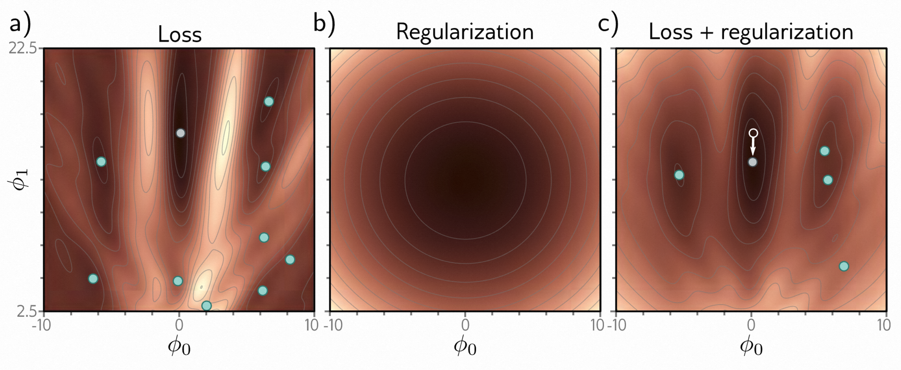
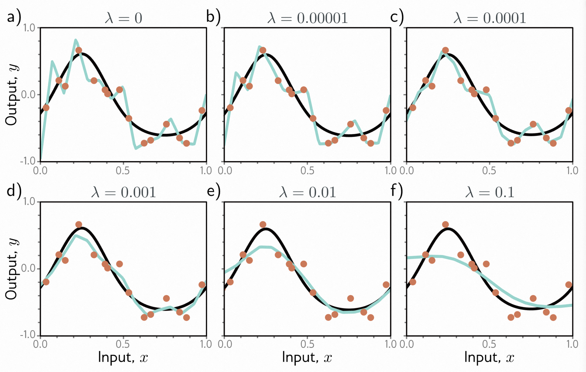
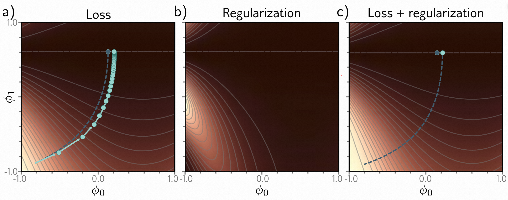
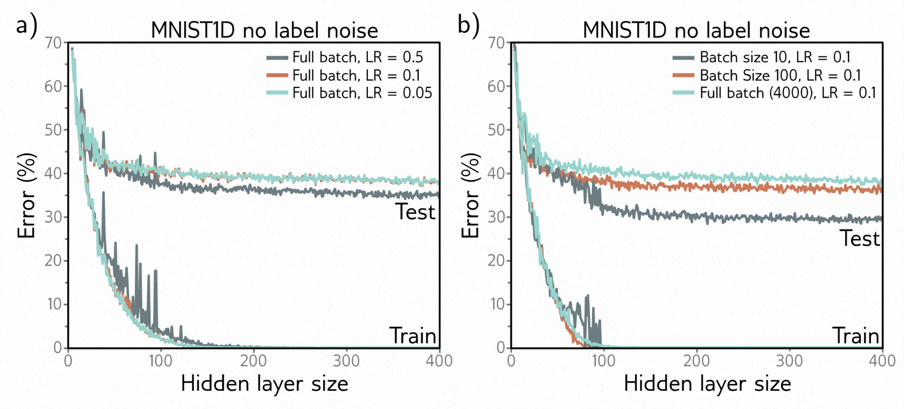
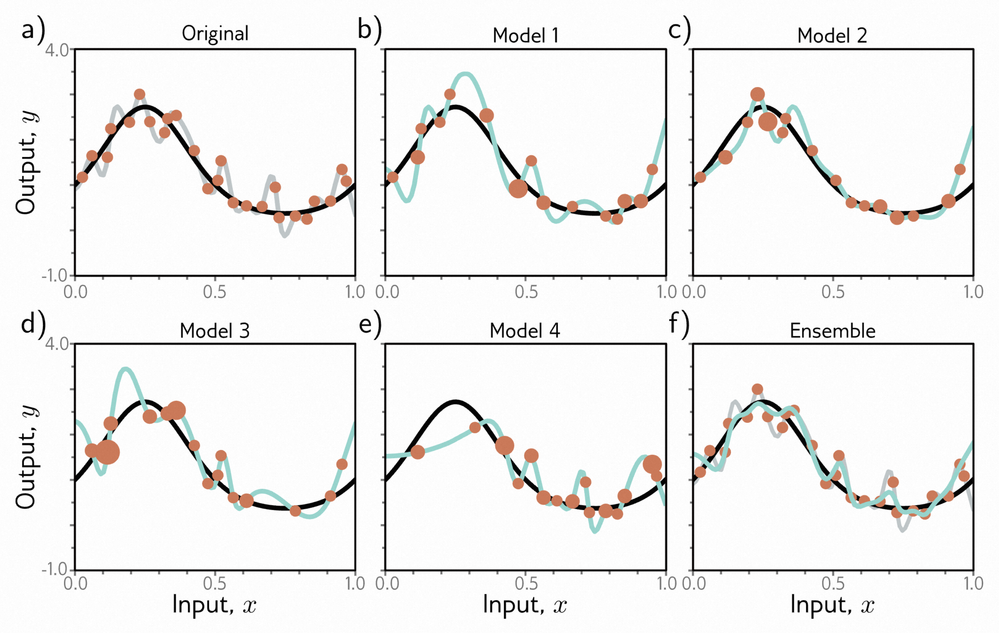
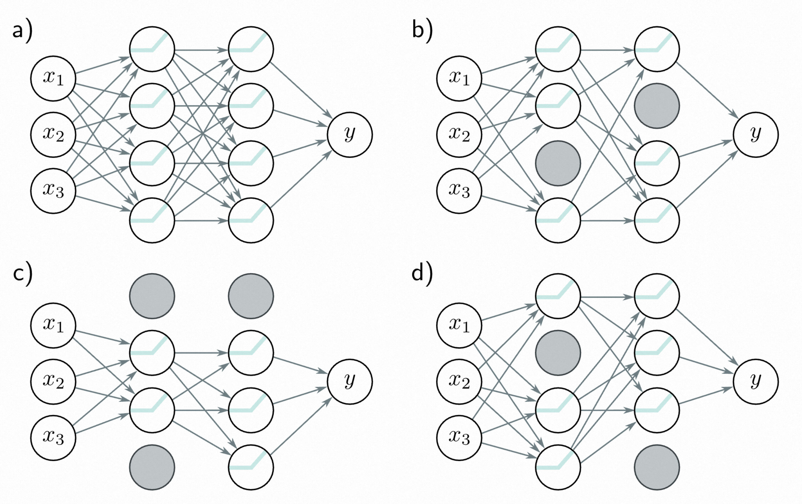
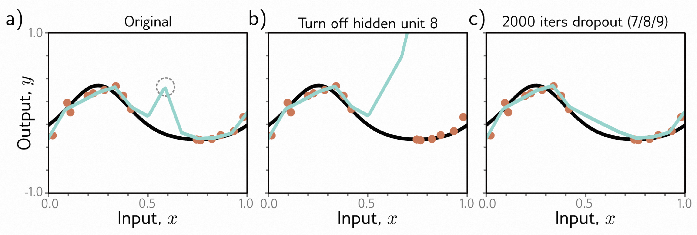
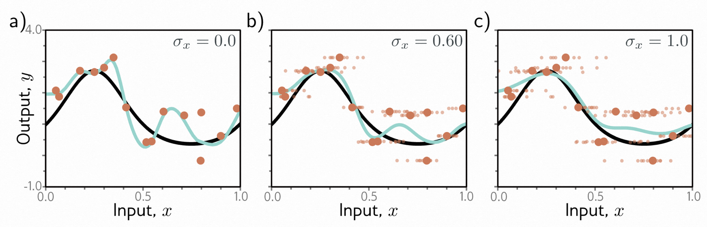
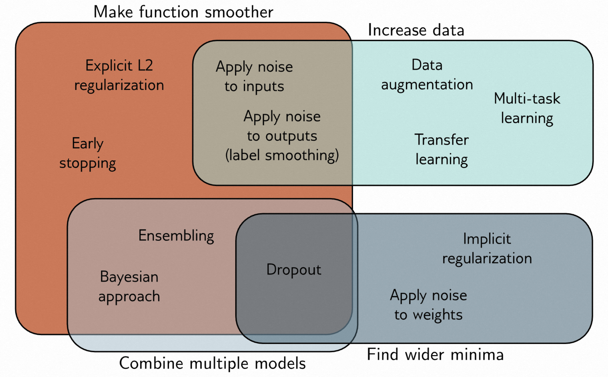

- [第九章 正则化 - Regularization](#第九章-正则化---regularization)
  - [9.1 显式正则化 - Explicit regularization](#91-显式正则化---explicit-regularization)
    - [9.1.1 概率解释 - Probabilistic interpretation](#911-概率解释---probabilistic-interpretation)
    - [9.1.2 L2 正则化 - L2 regularization](#912-l2-正则化---l2-regularization)
  - [9.2 隐式正则化 - Implicit regularization](#92-隐式正则化---implicit-regularization)
    - [9.2.1 梯度下降中的隐式正则化 - Implicit regularization in gradient descent](#921-梯度下降中的隐式正则化---implicit-regularization-in-gradient-descent)
    - [9.2.2 隐式正则化在随机梯度下降中的作用 - Implicit regularization in stochastic gradient descent](#922-隐式正则化在随机梯度下降中的作用---implicit-regularization-in-stochastic-gradient-descent)
  - [9.3 提高性能的启发式方法 - Heuristics to improve performance](#93-提高性能的启发式方法---heuristics-to-improve-performance)
    - [9.3.1 提前停止 - Early stopping](#931-提前停止---early-stopping)
    - [9.3.2 集成方法 - Ensembling](#932-集成方法---ensembling)
    - [9.3.3 Dropout - Dropout](#933-dropout---dropout)
    - [9.3.4 应用噪声 - Applying noise](#934-应用噪声---applying-noise)
    - [9.3.5 贝叶斯推断 - Bayesian inference](#935-贝叶斯推断---bayesian-inference)
    - [9.3.6 迁移学习和多任务学习 - Transfer learning and multi-task learning](#936-迁移学习和多任务学习---transfer-learning-and-multi-task-learning)
    - [9.3.7 自监督学习 - Self-supervised learning](#937-自监督学习---self-supervised-learning)
    - [9.3.8 数据增强 - Augmentation](#938-数据增强---augmentation)
  - [9.4 总结 - Summary](#94-总结---summary)
  - [9.5 注意事项 - Notes](#95-注意事项---notes)
    - [9.6 问题 - Problems](#96-问题---problems)

# 第九章 正则化 - Regularization

第八章描述了如何衡量模型性能，并指出训练数据和测试数据之间可能存在显著的性能差距。造成这种差异的可能原因包括：

- （i）模型描述了训练数据的统计特点，但这些特点并不代表从输入到输出的真实映射关系（过拟合）；
- （ii）模型在没有训练样本的区域没有约束，导致预测结果不够优化。

本章将讨论*正则化*技术。这是一组方法，用于减小训练和测试性能之间的泛化差距。严格来说，正则化是指向损失函数中添加明确项，有利于某些参数选择。然而，在机器学习中，这个术语通常用于指任何改进泛化性能的策略。

首先，我们讨论了严格意义上的正则化。然后我们展示了随机梯度下降算法本身如何倾向于某些解决方案，这被称为隐式正则化。接下来，我们介绍了一组启发式方法，用于改善测试性能。这包括提前停止、集成、随机失活、标签平滑和迁移学习。

## 9.1 显式正则化 - Explicit regularization

考虑在使用训练集 $ \{\mathbf x_{i}, \mathbf y_{i}\} $ 作为输入/输出对，用参数 $ \phi $ 去拟合模型 $ \mathbf f [\mathbf x, \phi] $，从而找到损失函数 $ L [\phi] $ 的最小值：

$$
\begin{array}{rcl}
\hat{\phi}
    &=&\underset{\phi}{\operatorname*{argmin}}\big[\operatorname{L}[\phi]\big]\\
    &=&\underset{\phi}{\operatorname*{argmin}}\left[\sum_{i=1}^{I}\ell_i[\mathbf{x}_i,\mathbf{y}_i]\right]
\end{array}
\tag{9.1}
$$

这里，每一个独立的项 $\ell_i[\mathbf x_{i}, \mathbf y_{i}]$ 衡量的是网络预测值 $ \mathbf f [\mathbf x_{i}, ϕ] $ 和每一组训练对的目标输出 $ \mathbf y_{i} $ 之间的差距。为了让这个最小化过程更偏向于某些特定的解决方案，我们加入了一个附加的项：

$$
\hat{\phi} = \underset{\phi}{\operatorname{argmin}} \left[ \sum_{i=1}^I \ell_i[x_i,y_i] + λ·\mathrm{g}[\phi] \right]
\tag{9.2}
$$

这里的 $ \mathrm{g}[ϕ] $ 是一个函数，它能返回一个标量值，当参数不太理想时，这个标量值会相对较大。$λ$ 是一个正数，用来调整原始损失函数和正则化项之间的权重。正则化损失函数的最小值往往与原始函数的最小值有所不同，所以训练过程最终会得到不同的参数值（如图 [9.1]() 所示）。

> 图 9.1 显式正则化。
>
> - a) Gabor模型的损失函数（详见第 [6.1.2](#gabor-model-example) 节）。青色的圆圈代表着局部最小值，灰色的圆圈则代表全局最小值。
> - b) 正则化项偏向于选择接近图的中心的参数，当我们离这个点越远，施加的惩罚就越大。
> - c) 最终的损失函数是原始损失函数和正则化项的总和。这个结果的特点是局部最小值较少，而全局最小值则已经移动到了另一个位置（箭头表示移动的方向）。

### 9.1.1 概率解释 - Probabilistic interpretation

正则化可以从概率的角度来理解。[5.1节](#maximum-likelihood)展示了如何从最大似然准则构建损失函数：

$$
\hat{\phi}=\underset{\phi}{\operatorname*{argmax}}\left[\prod_{i=1}^IPr(\mathbf{y}_i|\mathbf{x}_i,\boldsymbol{\phi})\right]
\tag{9.3}
$$

正则化项可以被看作是一个*先验* $ Pr (ϕ) $，它代表了我们在观察数据之前对参数的预设知识，现在我们采用的是*最大后验概率*或称为*MAP*的评判标准：

$$
\hat{\phi}=\underset{\phi}{\operatorname*{argmax}}\left[\prod_{i=1}^IPr(\mathbf{y}_i|\mathbf{x}_i,\boldsymbol{\phi})Pr(\boldsymbol{\phi})\right].
\tag{9.4}
$$

通过取对数并乘以负1，将其转换回负对数似然损失函数，我们可以看到$λ·g [ϕ] = -log[Pr(ϕ)]$。

### 9.1.2 L2 正则化 - L2 regularization

这里讨论的问题是正则化项应该对哪些解进行惩罚（或者等效地说是先验应该偏向哪些解）。由于神经网络应用的广泛性，只能提出一些非常一般性的偏好。最常用的正则化项是 *L2 范数*，它对参数值的平方和进行惩罚：

$$
\hat{\phi}=\underset{\boldsymbol{\phi}}{\operatorname*{argmin}}\left[\sum_{i=1}^{I}\ell_i[\mathbf{x}_i,\mathbf{y}_i]+\lambda\sum_{j}\phi_j^2\right],
\tag{9.5}
$$

其中 $ j $ 是参数的索引。这也被称为 *Tikhonov 正则化* 或 *岭回归*，或（当应用于矩阵时）*Frobenius 范数正则化*。

对于神经网络，L2 正则化通常应用于权重而不是偏差，因此通常被称为 *权重衰减* 项。其效果是鼓励较小的权重，使得输出函数更平滑。为了理解这一点，我们可以考虑输出预测是最后一个隐藏层激活的加权和。如果 L2 正则化权重的幅度较小，输出将变化较小。同样的逻辑也适用于在最后一个隐藏层计算预激活的情况，以此类推，一直到网络的反向过程。在极端情况下，如果我们强制所有权重为零，网络将产生由最后一个偏差参数决定的常数输出。

图 [9.2]() 显示了在权重衰减和不同的正则化系数 $λ$ 的条件下，拟合来自图 [8.4]() 的简化网络的效果。当 $λ$ 很小时，它的影响很小。然而，随着 $λ$ 的增大，对数据的拟合变得不那么准确，函数变得更加平滑。这可能会出于以下两个原因提高测试性能：

- 如果网络过拟合，那么添加正则化项意味着网络必须在严格遵循数据和期望平滑之间做出权衡。一种理解这个问题的方式是，由于方差引起的误差减少（模型不再需要通过每一个数据点）的代价是偏差增加（模型只能描述平滑的函数）。
- 当网络过度参数化时，额外的模型容量描述的是没有训练数据的区域。在这种情况下，正则化项将偏好于在附近点之间平滑插值的函数。在没有关于真实函数的知识的情况下，这是合理的行为。

> 图 9.2 简化网络中的 L2 正则化（见图 [8.4]() ）。
>
> - a-f) 随着我们增加正则化系数 $λ$ ，拟合函数。黑色曲线是真实函数，橙色圆点是有噪声的训练数据，青色曲线是拟合模型。对于小的 $λ$ （面板 a-b），拟合函数完全通过数据点。对于中等的 $λ$ （面板 c-d），函数更平滑，更接近真实值。对于大的 $λ$ （面板 e-f），拟合函数比真实值更平滑，所以拟合效果变差。

## 9.2 隐式正则化 - Implicit regularization

最近一个有趣的发现是，梯度下降和随机梯度下降在朝着损失函数的最小值的方向上并不是中立的；它们各自对某些解具有偏好。这被称为 *隐式正则化*。

### 9.2.1 梯度下降中的隐式正则化 - Implicit regularization in gradient descent

考虑梯度下降的一个连续版本，它的步长无限小，那么参数 $ ϕ $ 的变化将由微分方程决定：

$$
\frac{∂ϕ}{∂t} = - \frac{∂L}{∂ϕ}
\tag{9.6}
$$

梯度下降使用离散的步长 $ α $ 来模拟这个过程：

$$
\phi_{t+1}=\phi_t-\alpha\frac{\partial L[\phi_t]}{\partial\phi},
\tag{9.7}
$$

离散化导致了与连续路径的偏差（图 [9.3]() ）。

> 图 9.3 梯度下降中的隐式正则化。
>
> - a）具有一族全局最小值的损失函数，水平线上的 $ ϕ_{1} = 0.61 $。虚线表示起点在左下方的连续梯度下降路径。青色轨迹表示离散梯度下降，步长为 0.1（显示了前几步） 。有限的步长导致路径分离，并达到不同的最终位置。
> - b）可以通过在连续梯度下降损失函数中添加一个惩罚平方梯度大小的正则化项来近似这种差异。
> - c）在添加了这个项之后，连续梯度下降路径收敛到离散路径在原始函数上的相同位置。

可以通过推导出一个修改后的连续损失项 $ \tilde{L} $ 来理解这种差异，使其在原始损失 $ L $ 上与离散化版本达到相同的位置。可以证明（见本章末尾）修改后的损失函数为：

$$
\tilde{\mathrm{L}}_{GD}[\phi]=\operatorname{L}[\phi]+\frac{\alpha}{4}\left\|\frac{\partial L}{\partial\phi}\right\|^{2}
\tag{9.8}
$$

简单来说，离散轨迹会避开梯度较大（也就是表面更为陡峭）的区域。这并不会改变梯度为零的最低点的位置。但是，这会改变其他地方的实际损失函数，并且调整优化的路径，这可能会使结果收敛到另一个最低点。全批量梯度下降在更大步长下表现出更好的泛化性，这可能是因为梯度下降引入的隐式正则化的影响（见图 [9.5a]()）。

### 9.2.2 隐式正则化在随机梯度下降中的作用 - Implicit regularization in stochastic gradient descent

对于随机梯度下降（SGD），我们同样可以进行类似的分析。现在我们寻求一种修改后的损失函数，使得连续版本的损失函数达到与可能的随机SGD更新的平均值相同的位置。可以证明如下：

$$
\begin{aligned}
\tilde{\mathrm{L}}_{SGD}[\phi]& =\quad\tilde{\mathrm{L}}_{GD}[\phi]+\frac{\alpha}{4B}\sum_{b=1}^B\left\|\frac{\partial L_b}{\partial\phi}-\frac{\partial L}{\partial\phi}\right\|^2  \\
&=\quad\mathrm{L}[\phi]+\frac\alpha4\left\|\frac{\partial L}{\partial\phi}\right\|^2+\frac\alpha{4B}\sum_{b=1}^B\left\|\frac{\partial L_b}{\partial\phi}-\frac{\partial L}{\partial\phi}\right\|^2.
\end{aligned}
\tag{9.9}
$$

在公式中，$L_{b}$是一个epoch中第$b$个批次（batch）的损失，而$L$和$L_{b}$分别表示整个数据集中的$I$个单独损失的平均值以及批次中的$|\mathcal{B}|$个单独损失的平均值：

$$
L=\frac{1}{I}\sum_{i=1}^{I}\ell_{i}[\mathbf{x}_{i},y_{i}]\quad\mathrm{~和~}\quad L_{b}=\frac{1}{|\mathcal{B}|}\sum_{i\in\mathcal{B}_{o}}\ell_{i}[\mathbf{x}_{i},y_{i}].
\tag{9.10}
$$

公式[9.9]()揭示了一个额外的正则化项，该项对应于批次损失$L_{b}$的梯度的方差。换句话说，SGD会隐式地偏向于梯度稳定的位置（即所有批次的梯度保持一致的位置）。这会修改优化过程的轨迹（参见图[9.4]()），但不一定会改变全局最小值的位置。如果模型的参数过多，它可能会完全拟合所有训练数据，因此全局最小值处的所有这些梯度项都会变为零。

> 图 9.4 随机梯度下降的隐式正则化。
>
> - a）Gabor 模型（第 [6.1.2](#gabor-model-example) 节）的原始损失函数。
> - b）梯度下降中的隐式正则化项惩罚了平方梯度大小。
> - c）随机梯度下降中的额外隐式正则化惩罚了批量梯度的方差。
> - d）修改后的损失函数（原始损失加上两个隐式正则化成分之和）。
>

SGD比梯度下降更好地泛化，并且较小的批次大小通常比较大的批次大小表现更好（图[9.5b]()）。其中一个可能的解释是内在的随机性使得算法能够达到损失函数的不同部分。然而，也有可能部分或全部的性能提升是由于隐式正则化的缘故，它鼓励所有数据都很好地拟合（批次方差较小）而不是某些数据非常好地拟合而其他数据拟合较差（尽管整体损失相同，但批次方差较大）。前者的解决方案往往更容易泛化。

> 图9.5 学习率和批次大小对于MNIST-1D数据集（参见图[8.1]()）上的4000个训练示例和4000个测试示例的影响，此处考虑了一个具有两个隐藏层的神经网络。
>
> - a）大学习率的性能优于中等或小学习率。在每种情况下，迭代次数为6000次学习率，因此每个解决方案有机会以相同的距离移动。
> - b）较小的批次大小有更好的性能。在每种情况下，迭代次数都被选择为使得训练数据在大约相同的模型容量下被记忆。
>

## 9.3 提高性能的启发式方法 - Heuristics to improve performance

我们已经看到，通过添加显式的正则化项，可以通过向损失函数添加额外的项来鼓励训练算法寻找良好的解决方案。这也会作为随机梯度下降的一个非预期但似乎有帮助的副产品隐式地发生。本节描述了其他启发式方法，用于改善泛化。

### 9.3.1 提前停止 - Early stopping

*提前停止*是指在训练过程完全收敛之前停止。如果模型已经捕捉到了底层函数的大致形状，但还没有时间过拟合噪声，提前停止可以减少过拟合问题（图[9.6]()）。一个思考这个问题的方法是，由于权重被初始化为较小的值（见第[7.5节](#parameter-initialization)），它们根本没有时间变大，因此提前停止的效果类似于明确的L2正则化。另一个观点是，提前停止降低了模型的有效复杂性。因此，我们从关键区域回到偏差/方差权衡曲线上，性能得到了提升（图[8.9]()和[8.10]()）。

> 图 9.6 提前停止。
>
> - a) 简化的浅层网络模型有 14 个线性区域（图 [8.4]() ），随机初始化（青色曲线），并使用批量大小为 5 和学习率为 0.05 的 SGD 进行训练。
> - b-d) 随着训练的进行，函数首先捕捉到真实函数的粗略结构（黑色曲线），然后
> - e-f) 过度拟合于噪声训练数据（橙色点）。尽管训练损失在整个过程中持续下降，但是在图 (c) 和 (d) 中学习的模型更接近真实的基础函数。它们在平均情况下对测试数据的泛化能力要优于图 (e) 或 (f) 中的模型。

提前停止有一个超参数，即学习终止之后的步骤数。通常情况下，通过使用验证集（第[8.5节](#choosing-hyperparameters)）来从实证角度选择该参数。然而，对于提前停止，可以在无需训练多个模型的情况下选择超参数。模型只需训练一次，每隔$ T $次迭代检查验证集的性能，并保存相应的模型。选择性能最佳的验证集模型作为最终模型。

### 9.3.2 集成方法 - Ensembling

减小训练数据和测试数据之间的泛化差距的另一种方法是构建多个模型并对它们的预测结果取平均。这一组模型被称为*集成*。这种技术能够可靠地提高测试性能，但代价是需要训练和存储多个模型，并进行多次推理。

这些模型可以通过取输出的平均值（用于回归问题）或预-softmax 激活的平均值（用于分类问题）来进行组合。假设模型错误是独立的，并且会相互抵消。或者，我们可以取输出的中位数（用于回归问题）或最频繁的预测类别（用于分类问题）来使预测更加稳健。

训练不同模型的一种方法是使用不同的随机初始化。这对于远离训练数据的输入空间的区域可能有所帮助。这里，拟合的函数集成没有太多的限制，不同的模型可能会产生不同的预测结果，因此多个模型的平均值可能比任何单个模型更好地泛化。

另一种方法是通过使用替换的方式重新抽样训练数据，并从中训练出多个不同的模型，生成几个不同的数据集。这个方法被称为*bootstrap aggregating*或简称为*bagging*（图[9.7]()）。它的效果是平滑数据；如果一个数据点在某个训练集中不存在，模型会从附近的点进行插值；因此，如果该点是一个异常值，拟合的函数在这个区域将更加平缓。还有其他的方法，比如使用不同的超参数来训练模型，或者使用完全不同的模型家族。

> 图9.7 集成方法。
>
> - a) 将单个模型（灰色曲线）拟合到整个数据集（橙色点）。
> - b-e) 通过使用替换的方式对数据进行四次重新抽样（bagging），生成四个模型（橙色点的大小表示数据点被重新抽样的次数）。
> - f) 当我们对这个集成模型的预测结果进行平均时，结果（青色曲线）比面板（a）中对整个数据集的结果（灰色曲线）更平滑，可能具有更好的泛化性能。

### 9.3.3 Dropout - Dropout

*Dropout* 是一种在随机梯度下降 (SGD) 的每次迭代中，随机将一部分隐藏单元（通常是50%）置零的方法（图[9.8]()）。这使得网络不再过度依赖于任何给定的隐藏单元，并鼓励权重具有较小的值，从而减小了隐藏单元的存在与否对函数变化的影响。

> 图 9.8 Dropout。
>
> - a) 原始网络。
> - b-d) 在每次训练迭代中，随机选择一部分隐藏单元置零（灰色节点）。结果是这些单元的输入和输出权重没有影响，因此我们每次都在训练一个稍微不同的网络。

这种技术的一个优势是它可以消除远离训练数据并且不影响损失的不良“曲折”。例如，考虑沿着曲线移动时逐个激活的三个隐藏单元（图[9.9a]()）。第一个隐藏单元导致了斜率的大幅增加。第二个隐藏单元降低了斜率，使函数向下走。最后，第三个单元抵消了这种下降并恢复了曲线的原始轨迹。这三个单元共同作用产生了一个不良的局部函数变化。这个曲线不会影响训练损失，但是不太可能有很好的泛化性能。

当多个单元以这种方式共同作用时，消除一个单元（如在dropout中发生的）会对输出函数产生相当大的变化，这种变化会传播到该单元处处于活跃状态的半空间（图[9.9b]()）。随后的梯度下降步骤将试图补偿这种变化，并且这样的依赖关系会随着时间的推移而消除。总体效果是，即使这些变化对损失没有影响（图[9.9]()），在训练数据点之间进行大幅度的不必要变化也会逐渐消除。

在测试时，我们可以像平常一样使用所有的隐藏单元来运行网络；然而，网络现在比训练时使用的隐藏单元更多，所以我们需要将权重乘以一减去dropout概率的值进行补偿。这被称为*权重缩放推断规则*。进行推断的另一种方法是使用蒙特卡洛dropout，即我们使用不同的随机子集将网络多次运行（与训练时相同的方式），并将结果合并。这与集成方法类似，因为网络的每个随机版本都是一个不同的模型；然而，我们在这里不必训练或存储多个网络。

> 图9.9 Dropout机制。
>
> - a) 曲线中的一个不良曲折是由斜率的顺序增加、顺序减少（在圈起来的节点处）和再次增加导致的。在这里我们使用了全批量梯度下降，并且模型已经尽可能好地拟合了数据，所以进一步的训练不会消除这个曲折。
> - b) 想象一下，如果我们移除在面板（a）中产生圈起来的节点的隐藏单元，就像使用dropout时可能发生的那样。没有斜率下降，函数的右侧会采取上升轨迹，随后的梯度下降步骤将旨在补偿这种变化。
> - c) 通过 i. 随机删除造成曲折的三个隐藏单元中的一个，并 ii. 进行梯度下降步骤的2000次迭代，得到的曲线。这个曲折不会对损失产生影响，但是通过这种近似的dropout机制，曲折被消除了。
>

### 9.3.4 应用噪声 - Applying noise

Dropout可以解释为在网络激活上应用乘法伯努利噪声。这引出了在训练期间对网络的其他部分应用噪声的想法，以使最终模型更具鲁棒性。

一种选择是对输入数据添加噪声；这会使学习到的函数变得更加平滑（图[9.10]()）。对于回归问题来说，可以证明这等价于添加一个正则化项，惩罚网络输出对输入的导数。一个极端的变体是*对抗训练*，在该方法中，优化算法主动寻找将输入中的小扰动导致输出发生大变化的情况。可以将这些扰动视为最坏情况的加性噪声向量。

第二种可能性是对权重添加噪声。这鼓励网络对权重的小扰动做出合理的预测。结果是训练收敛到宽阔且平坦区域中的局部最小值，在这些区域中，改变单个权重的影响不大。

最后，我们可以扰动标签。多类别分类的最大似然准则旨在以绝对确定性预测正确的类别（方程[5.24]()）。为此，将最终的网络激活（即在softmax函数之前）推至非常大的值以表示正确的类别，而将错误的类别推至非常小的值。

我们可以通过假设训练标签中比例为$ ρ $的标签是错误的，并且以相等的概率属于其他类别，来消除这种过度自信的行为。这可以通过在每个训练迭代中随机更改标签来实现。然而，通过将损失函数更改为最小化预测分布与一个分布之间的交叉熵，其中真实标签的概率为$ 1-ρ $，而其他类别的概率相等，也可以实现相同的目的。这被称为*标签平滑*，在各种场景中都可以提高泛化能力。

> 图 9.10 给输入添加噪声。在SGD的每一步中，将方差为$ σ^{2}_{x} $的随机噪声添加到批数据中。
>
> - a-c) 不同噪声水平下的拟合模型（小点表示十个样本）。添加更多噪声使拟合函数（青色线条）变得平滑。
>
### 9.3.5 贝叶斯推断 - Bayesian inference

最大似然方法通常过于自信；在训练阶段，它会选择最可能的参数，并基于这些参数定义的模型进行预测。然而，许多参数值可能与数据存在较大的兼容性，只是稍微不太可能而已。贝叶斯方法将参数视为未知变量，并使用贝叶斯规则计算出在训练数据 $\{\mathbf x_{i},\mathbf y_{i}\} $ 上给定参数 $ϕ$ 的分布 $ Pr(ϕ|{\mathbf x_{i}, \mathbf y_{i}}) $：

$$
Pr(\boldsymbol{\phi}|\{\mathbf{x}_i,\mathbf{y}_i\})=\frac{\prod_{i=1}^IPr(\mathbf{y}_i|\mathbf{x}_i,\boldsymbol{\phi})Pr(\boldsymbol{\phi})}{\int\prod_{i=1}^IPr(\mathbf{y}_i|\mathbf{x}_i,\boldsymbol{\phi})Pr(\boldsymbol{\phi})d\boldsymbol{\phi}},
 \tag{9.11}
$$

其中 $ Pr (ϕ) $ 是参数的先验概率，而分母是一个归一化项。因此，每个参数选择都被分配一个概率（图 [9.11]()）。

对于新的输入 $ x $，其预测值 $ y $ 是每个参数集的预测的无限加权和（即积分），其中权重是相关概率的函数：

$$
Pr(\mathbf{y}|\mathbf{x},\{\mathbf{x}_{i},\mathbf{y}_{i}\})=\int Pr(\mathbf{y}|\mathbf{x},\phi)Pr(\phi|\{\mathbf{x}_{i},\mathbf{y}_{i}\})d\phi.
\tag{9.12}
$$

这实际上是一个无限加权集合，其中权重取决于（i）参数的先验概率和（ii）其与数据的一致性。

> 图 9.11 简化网络模型（参见图 [8.4]()）的贝叶斯方法。参数被视为不确定的。一组参数的后验概率 $ Pr(ϕ|\{x_{i}, y_{i}\}) $ 是由它们与数据 $\{ \mathbf x_{i},\mathbf  y_{i}\} $ 的兼容性和先验分布 $ Pr(ϕ) $ 决定的。
>
> - a-c) 采样自具有均值为零和三个方差的正态分布先验的两组参数（青色和灰色曲线）。当先验方差较小时，参数也倾向于较小，并且函数较平滑。
> - d-f) 推断过程是通过对所有可能的参数值进行加权求和，其中权重是后验概率。这既产生了均值的预测（青色曲线），也产生了相关的不确定性（灰色区域为两个标准差）。

贝叶斯方法优雅且能够提供比最大似然得出的更可靠的预测。不幸的是，对于像神经网络这样的复杂模型，在推断阶段无法以实际方式表示参数的完整概率分布，也无法对其进行积分。因此，目前所有这类方法都对某种程度进行近似，通常会给学习和推断带来相当大的复杂性。

### 9.3.6 迁移学习和多任务学习 - Transfer learning and multi-task learning

当训练数据有限时，可以利用其他数据集来提高性能。在*迁移学习（图 [9.12a]()）*中，网络被*预训练*，以执行数据更丰富的相关次要任务。然后将得到的模型调整到原始任务上。通常的做法是去除最后一层，并添加一个或多个生成合适输出的层。主要模型可以固定，新的层训练用于原始任务，或者我们可以*微调*整个模型。

其原理在于，网络将从次要任务中构建出对数据的良好内部表示，这随后可以用于原始任务。等价地，可以将迁移学习视为在可能产生良好解决方案的合理空间的大部分参数中初始化最终网络。

*多任务学习*（图 [9.12b]()）是一种相关技术，其中网络被训练以同时解决多个问题。例如，网络可以获取一张图像，并同时学习对场景进行分割，估计像素级深度，并预测描述图像的标题。所有这些任务都需要对图像有一定的理解，在同时学习时，每个任务的模型性能可能会提高。

### 9.3.7 自监督学习 - Self-supervised learning

上述讨论假设我们有大量用于辅助任务的数据，或者有多个任务需要同时学习的数据。如果没有这些数据，我们可以使用*自监督学习*创建大量的“免费”标记数据，并将其用于迁移学习。自监督学习有两种方法：*生成式*和*对比式*。

在*生成式自监督学习*中，每个数据示例的一部分被掩盖，次要任务是预测缺失的部分（图 [9.12c]()）。例如，我们可以使用一组未标记的图像和一个次要任务，该任务旨在填充图像中缺失的部分（图 [9.12c]()）。同样地，我们还可以使用大量的文本语料库并掩盖一些单词。我们训练网络来预测缺失的单词，然后对我们感兴趣的实际语言任务进行微调（参见第 [12]() 章）。

> 图9.12 迁移学习、多任务学习和自监督学习。
>
> - a) 当我们对主要任务（这里是深度估计）有限的标记数据，但对次要任务（这里是分割）有丰富的数据时，我们使用迁移学习。我们训练一个次要任务的模型，移除最后的层，并用适合主要任务的新层替换它们。然后，我们只训练新层或者对整个网络进行微调以用于主要任务。网络从次要任务中学习到了一个良好的内部表示，然后将其用于主要任务。
> - b) 在多任务学习中，我们训练一个模型同时执行多个任务，希望每个任务的性能都能提高。
> - c) 在生成式自监督学习中，我们删除部分数据，并训练网络来填补缺失的信息。这里的任务是填充（修复）图像的一部分。这样可以在没有标签的情况下进行迁移学习。图片来自 [Cordts等人]（2016）。

在*对比式自监督学习*中，将具有共同特征的一对样本与不相关的一对样本进行比较。对于图像，次要任务可能是确定一对图像是否是彼此的变形版本还是无关的。对于文本，次要任务可能是确定两个句子是否在原始文档中相邻。有时，必须识别连接的一对之间的精确关系（例如，找到来自同一图像的两个区域的相对位置）。

### 9.3.8 数据增强 - Augmentation

迁移学习通过利用不同的数据集来提高性能。多任务学习通过使用额外的标签来提高性能。第三种选择是扩展数据集。我们通常可以将每个输入数据示例转换成一种方式，使得标签保持不变。例如，我们可能希望确定图像中是否有一只鸟（图9.13）. 在这种情况下，我们可以旋转、翻转、模糊或者调整图像的色彩平衡，而标签“鸟”仍然有效。同样，对于输入为文本的任务，我们可以使用同义词替换或者翻译成另一种语言再翻译回来。对于输入为音频的任务，我们可以放大或者衰减不同的频段。

> 图9.13 数据增强。对于某些问题，可以通过转换每个数据示例来增强数据集。
>
> - a) 原始图像。
> - b-h) 这个图像的各种几何和光度变换。对于图像分类，所有这些图像仍然具有相同的标签“鸟”。改编自[Wu等人]（2015a）。

通过这种方式生成额外的训练数据被称为*数据增强*。其目的是教会模型对这些无关的数据转换不予理会。

## 9.4 总结 - Summary

显式正则化是指在损失函数中添加一个额外的项，以改变最小值的位置。这个项可以被解释为参数的先验概率。带有有限步长的随机梯度下降并不能完全降到损失函数的最小值。这种偏差可以被解释为在损失函数中添加额外的项，这被称为隐式正则化。

还有许多用于改善泛化性能的启发式方法，包括早停法、随机失活、集成学习、贝叶斯方法、添加噪声、迁移学习、多任务学习和数据增强。这些方法背后有四个主要原则（图 [9.14]()）。

- （i）鼓励函数变得更平滑（例如 L2 正则化）
- （ii）增加数据量（例如数据增强）
- （iii）组合模型（例如集成学习）
- （iv）寻找更宽的极小值点（例如对网络权重应用噪声）

> 图 9.14 正则化方法。本章讨论的正则化方法旨在通过四种机制之一来改善泛化性能。
>
> - 1）使模型的函数更平滑。
> - 2）增加了有效的数据量。
> - 3）结合多个模型，从而减少了拟合过程中的不确定性。
> - 4） 鼓励训练过程收敛到一个较宽的极小值点，这样估计参数时的小错误就不那么重要（也参见图 [20.11]()）。

改善泛化性能的另一种方法是选择适合任务的模型架构。例如，在图像分割中，我们可以在模型内部共享参数，这样我们就不需要在每个图像位置独立学习树的外观。第[10-13]()章考虑了为不同任务设计的架构变体。

## 9.5 注意事项 - Notes

有关深度学习中正则化技术的概述和分类可参见 [Kukačka 等人，2017]() 。不容忽视的是，本章中没有讨论 BatchNorm ([Szegedy 等人，2016]()) 及其变种，这些在第11章中有所描述。

**正则化：** L2 正则化对网络权重的平方和进行惩罚。这鼓励输出函数变化缓慢（即变得更加平滑），是最常用的正则化项。有时也被称为 Frobenius 范数正则化，因为它对权重矩阵的 Frobenius 范数进行惩罚。它经常被错误地称为“权重衰减”，而这是[Hanson & Pratt，1988]() 提出的一种单独的技术，其中参数 $ϕ$ 更新为

$$
\phi\longleftarrow(1-\lambda^{\prime})\phi-\alpha\frac{\partial L}{\partial\phi}.
\tag{9.13}
$$

其中，$α$ 是学习率，$L$ 是损失函数。这与梯度下降相同，只是在梯度更新之前将权重减小了 $1-λ^′$ 的倍数。对于标准的 SGD，权重衰减等价于带有系数 $λ = λ^′/2α$ 的 L2 正则化（方程 [9.5]()）。然而，对于 Adam，每个参数的学习率 $α$ 是不同的，因此 L2 正则化和权重衰减是不同的。[Loshchilov & Hutter , 2019]() 提出了 AdamW，对 Adam 进行了修改以正确实现权重衰减，并表明这样可以提高性能。

其他向量范数的选择会鼓励权重的稀疏性。L0 正则化项对每个非零权重都施加了固定的惩罚。其效果是对网络进行“剪枝”。L0 正则化也可以用于鼓励组稀疏性；如果对于给定的隐藏单元，贡献权重中的任何一个都是非零的，则会施加固定的惩罚。如果它们全部为零，我们可以删除该单元，减小模型大小，使推理更快。

不幸的是，L0 正则化的实现具有挑战性，因为正则化项的导数不平滑，需要更复杂的拟合方法（参见[Louizos等人，2018]()）。介于 L2 正则化和 L0 正则化之间的是 L1 正则化或 *LASSO*（最小绝对收缩和选择算子），它对权重的绝对值施加惩罚。L2 正则化在一定程度上抑制稀疏性，因为平方惩罚的导数随着权重变小而减小，降低了使其变得更小的压力。L1 正则化没有这个缺点，因为惩罚的导数是恒定的。这可以产生比 L2 正则化更稀疏的解，但比 L0 正则化更容易优化。有时会同时使用 L1 和 L2 正则化项，这被称为*弹性网络*惩罚（[Zou & Hastie，2005]()）。

正则化的另一种方法是修改学习算法的梯度，而无需明确构建新的损失函数（例如方程[9.13]()）。这种方法已被用于在反向传播过程中促进稀疏性（ [Schwarz et al.，2021]()）。
有效性正则化的证据存在争议。[Zhang et al. , (2017a)]() 证明了L2正则化对泛化能力的贡献很小。已经证明了网络的Lipschitz常数（当我们修改输入时，函数如何快速变化）限制了泛化误差（[Bartlett et al., 2017](); [Neyshabur et al., 2018]()）。然而，Lipschitz常数取决于权重矩阵$ Ω_{k} $的谱范数的乘积，这些权重的大小只间接影响。[Bartlett et al.]() [(2017)]()，谱范数[Neyshabur et al.]() [(2018)]()和[Yoshida & Miyato]() [(2017)]()都添加了一些间接鼓励谱范数较小的项。[Gouk et al.]() [(2021)]()采用了不同的方法，并开发了一种算法，将网络的Lipschitz常数约束在特定值以下。

**梯度下降中的隐式正则化：** 梯度下降的步骤是

$$
\phi_{1}=\phi_{0}+\alpha\cdot\mathbf{g}[\phi_{0}].
\tag{9.14}
$$

其中$ \mathbf g [\phi_0] $ 是损失函数梯度的负数，$ α $是步长。当$ α \rightarrow 0 $时，梯度下降过程可以用微分方程描述。

$$
\frac{\partial\phi}{\partial t}=\mathbf{g}[\phi].
\tag{9.15}
$$

对于典型的步长$ α $，离散和连续版本会收敛到不同的解。我们可以使用*后向误差分析*来找到连续版本的修正$\mathbf g_1[\phi]$。

$$
\frac{\partial\phi}{\partial t}\approx\mathbf{g}[\phi]+\alpha\mathbf{g}_1[\phi]+\ldots.
\tag{9.16}
$$

使得它与离散版本产生相同的结果。

考虑在初始位置$ \phi_{0} $周围对修改后的连续解$ \phi $进行Taylor展开的前两项。

$$
\begin{aligned}
\phi[\alpha]& \approx\quad\phi+\alpha\frac{\partial\phi}{\partial t}+\left.\frac{\alpha^{2}}{2}\frac{\partial^{2}\phi}{\partial t^{2}}\right|_{\phi=\phi_{0}} \\
&\approx\quad\phi+\alpha\left(\mathbf{g}[\phi]+\alpha\mathbf{g}_{1}[\phi]\right)+\frac{\alpha^{2}}{2}\left.\left(\frac{\partial\mathbf{g}[\phi]}{\partial\phi}\frac{\partial\phi}{\partial t}+\alpha\frac{\partial\mathbf{g}_{1}[\phi]}{\partial\phi}\frac{\partial\phi}{\partial t}\right)\right|_{\phi=\phi_{0}} \\
&=\left.\phi+\alpha\left(\mathbf{g}[\phi]+\alpha\mathbf{g}_1[\phi]\right)+\frac{\alpha^2}{2}\left(\frac{\partial\mathbf{g}[\phi]}{\partial\phi}\mathbf{g}[\phi]+\alpha\frac{\partial\mathbf{g}_1[\phi]}{\partial\phi}\mathbf{g}[\phi]\right)\right|_{\phi=\phi_0} \\
&\approx\left.\phi+\alpha\mathbf{g}[\phi]+\alpha^{2}\left(\mathbf{g}_{1}[\phi]+\frac{1}{2}\frac{\partial\mathbf{g}[\phi]}{\partial\boldsymbol{\phi}}\mathbf{g}[\phi]\right)\right|_{\boldsymbol{\phi}=\boldsymbol{\phi}_{0}}.
\end{aligned}
\tag{9.17}
$$

在第二行中，我们引入了修正项（方程[9.16]()），在最后一行中，我们删除了大于$ α^{2} $阶的项。

注意右侧的前两项$ ϕ_{0} + α\mathbf{g}[ϕ_{0}]$与离散更新（方程[9.14]()）相同。因此，为了使连续和离散版本达到相同的位置，右侧的第三项必须等于零，从而允许我们求解$ \mathbf{g}_1[ϕ]$。

$$
\mathbf{g}_1[\phi]=-\frac12\frac{\partial\mathbf{g}[\phi]}{\partial\phi}\mathbf{g}[\phi].
\tag{9.18}
$$

在训练过程中，演化函数$\mathbf  g [ϕ] $是损失梯度的负数。

$$
\begin{aligned}
\frac{\partial\phi}{\partial t}& \approx\quad\mathbf{g}[\phi]+\alpha\mathbf{g}_1[\phi] \\
&=\quad-\frac{\partial L}{\partial\phi}-\frac\alpha2\left(\frac{\partial^2L}{\partial\phi^2}\right)\frac{\partial L}{\partial\phi}.
\end{aligned}
\tag{9.19}
$$

这等价于对损失函数执行连续梯度下降。
$$\mathrm{L}_{GD}[\phi]=\mathrm{L}[\phi]+\frac{\alpha}{4}\left\|\frac{\partial L}{\partial\phi}\right\|^{2}.
\tag{9.20}.
$$

因为方程[9.19]()的右边是方程[9.20]()的导数。

这种隐式正则化的形式由[Barrett＆Dherin]() （2021）发展而来，并由[Smith等人]() （2021）扩展到随机梯度下降。[Smith等人]() （2020）和其他人已经表明，使用小或中等批量大小的随机梯度下降在测试集上的表现优于全批量梯度下降，这可能部分原因是隐式正则化。

相关地，[Jastrzębski等人]() （2021）和[Cohen等人]() （2021）都表明，使用较大的学习率减少了典型优化轨迹移动到损失函数的“更尖锐”部分的趋势（即至少一个方向具有较高曲率的部分）。使用较大学习率的这种隐式正则化效应可以通过惩罚Fisher信息矩阵的迹来近似，该迹与方程[9.20]()中的梯度范数惩罚密切相关（[Jastrzębski等人，2021]()）。

**提前停止训练：**[Bishop]() （1995）和[Sjöberg＆Ljung]() （1995）认为，提前停止限制了训练过程可以探索的有效解空间；鉴于权重的初始值很小，这导致了提前停止有助于防止权重变得过大的想法。 [Goodfellow等人]() （2016）表明，在将参数初始化为零的损失函数的二次近似下，提前停止等效于L2正则化的梯度下降。有效的正则化权重$ λ $约为$ 1 /（τα）$，其中$ α $为学习率，$ τ $为提前停止时间。

**集成方法：** 可以使用不同的随机种子（[Lakshminarayanan等人，2017]()），超参数（[Wenzel等人，2020b]()）或完全不同的模型族来训练集成。可以通过平均它们的预测结果，加权预测结果，或使用另一个机器学习模型进行*堆叠*（[Wolpert，1992]()）来组合这些模型。[Lakshminarayanan等人]() （2017）表明，独立训练网络的输出平均可以提高准确性、校准性和鲁棒性。相反，[Frankle等人]() （2020）表明，如果将权重平均在一起形成一个模型，网络将失败。[Fort等人]() （2019）将由不同初始化产生的集成解决方案与由相同原始模型生成的集成解决方案进行了比较。例如，在后一种情况下，他们考虑在一个有限子空间中探索周围解的可能性，以找到其他附近的优秀点。他们发现这两种技术都提供了互补的好处，但不同随机起始点产生了更大的改进。

一种高效的集成方法是组合训练中间阶段的模型。为此，[Izmailov等人]() （2018）引入了*随机权重平均*，其中模型权重在不同的时间步骤进行采样并平均在一起。正如名称所示，快照集成（[Huang等人，2017a]()）也会存储不同时间步骤的模型并平均它们的预测。通过循环增大和减小学习率可以提高这些模型的多样性。[Garipov等人]() （2018）观察到损失函数的不同极小值通常由低能量路径（即整个路径处处损失较低）连接。基于这一观察，他们开发了一种方法，探索初始解周围的低能量区域，以提供不需要重新训练的多样模型。这被称为*快速几何集成*。关于集成方法的综述可以在[Ganaie等人]() （2022）中找到。

**Dropout（随机失活）：** Dropout 是由 Hinton 等人（2012b）和 Srivastava 等人（2014）首次引入的。Dropout 是应用在隐藏单元层级上的。关闭一个隐藏单元的效果就像是将所有传入、传出的权重和偏置暂时设置为零。Wan 等人（2013）通过随机将个别权重置零来泛化了 Dropout。Gal & Ghahramani（2016）和 Kendall & Gal（2017）提出了蒙特卡洛 Dropout，推断过程在多个 Dropout 模式下进行，并对结果进行平均。Gal & Ghahramani（2016）认为这可以被解释为对贝叶斯推断的近似。

Dropout 相当于对隐藏单元应用乘法伯努利噪声。使用其他分布也可以获得类似的好处，包括正态分布（Srivastava 等人，2014；Shen 等人，2017）、均匀分布（Shen 等人，2017）和贝塔分布（Liu 等人，2019b）。

**加入噪声：** Bishop（1995）和 An（1996）在网络输入中加入高斯噪声以提高性能。Bishop（1995）表明这等效于权重衰减。An（1996）还研究了对权重加入噪声的方法。DeVries & Taylor（2017a）对隐藏单元加入了高斯噪声。随机修正线性单元（Xu 等人，2015）通过以不同的方式引入噪声，使激活函数具有随机性。

**标签平滑：** 标签平滑最初由 Szegedy 等人（2016）用于图像分类，但在语音识别（Chorowski & Jaitly，2017）、机器翻译（Vaswani 等人，2017）和语言建模（Pereyra 等人，2017）中也被证明是有帮助的。标签平滑改善测试性能的具体机制尚不为人们所理解，尽管 Müller 等人（2019a）表明它改善了预测输出概率的校准性。一种密切相关的技术是 DisturbLabel（Xie 等人，2016），在每个训练迭代中，将每批数据中一定百分比的标签随机切换。

**寻找更宽的极小值：** 人们认为更宽的极小值具有更好的泛化性能（见图 20.11）。在这种情况下，权重的确切值不那么重要，因此性能应该对其估计的误差具有鲁棒性。在训练过程中将噪声应用于网络的部分是有效的原因之一，因为它鼓励网络对其确切值不那么敏感。

Chaudhari 等人（2019）开发了一种偏向于扁平极小值的 SGD 变体，称为熵 SGD。其思想是在损失函数中加入局部熵项。实际上，这相当于在另一个 SGD-like 更新中进行了一次更新。Keskar 等人（2017）表明，随着批大小的减小，SGD 找到的极小值更宽。这可能是由于 SGD 隐式正则化导致的批方差项。

Ishida 等人（2020）使用了一种名为 flooding 的技术，他们有意阻止训练损失变为零。这鼓励解决方案在损失空间中进行随机游走，并漂移到具有更好泛化性能的更平坦区域。

**贝叶斯方法：** 对于某些模型，包括图[9.11]() 中的简化神经网络模型，可以通过闭合形式计算贝叶斯预测分布（参见[Bishop, 2006]()；[Prince, 2012]()）.对于神经网络，参数的后验分布无法以闭合形式表示，必须进行近似处理。主要有两种方法：变分贝叶斯（[Hinton & van Camp, 1993]()；[MacKay, 1995]()；[Barber & Bishop, 1997]()；[Blundell]()等，2015年）以及马尔科夫链蒙特卡罗（MCMC）方法，后者通过抽取一组样本来近似分布（[Neal, 1995]()；[Welling & Teh, 2011]()；[Chen et al., 2014]()；[Ma et al., 2015]()；[Li et al., 2016a]()）.样本的生成可以与随机梯度下降（SGD）结合，这被称为随机梯度MCMC（参见[Ma et al., 2015]()）.最近发现，"冷却"参数的后验分布（使其变得更尖锐）可以改善这些模型的预测效果（[Wenzel et al., 2020a]()），但目前尚未完全理解（参见[Noci et al., 2021]()）.

**迁移学习：** 对于视觉任务，迁移学习效果非常好（[Sharif Razavian]()等，2014年），并且已经在计算机视觉领域取得了快速进展，包括原始的AlexNet结果（[Krizhevsky et al., 2012]()）.迁移学习也对自然语言处理（NLP）产生了影响，其中许多模型基于BERT模型的预训练特征（[Devlin]()等，2019年）.更多信息可以在[Zhuang et al.]()（2020年）和[Yang et al.]()（2020b年）中找到.

**自监督学习：** 图像的自监督学习技术包括修复遮挡的图像区域（[Pathak et al., 2016]()），预测图像中补丁的相对位置（[Doersch et al., 2015]()），将重新排列的图像块恢复到其原始配置（[Noroozi & Favaro, 2016]()），给灰度图像上色（[Zhang et al., 2016b]()）以及将旋转的图像恢复到其原始方向（[Gidaris et al., 2018]()）.在SimCLR中（[Chen et al., 2020c]()），学习了一种将经过光度和几何变换的同一图像版本映射到相同表示的网络，同时将不同图像版本推开，目标是对不相关的图像变换不加区分. [Jing & Tian]()（2020年）对图像中的自监督学习进行了综述.

NLP中的自监督学习可以基于预测被屏蔽的单词（[Devlin et al., 2019]()），预测句子中的下一个词（[Radford et al., 2019]()；[Brown et al., 2020]()）或预测两个句子是否相邻（[Devlin et al., 2019]()）.在自动语音识别中，Wav2Vec模型（Sc [hneider et al., 2019]()）旨在区分原始音频样本和其中10毫秒的音频替换自剪辑的其他位置.自监督学习还应用于图神经网络（第13章）.任务包括恢复被屏蔽的特征（[You et al., 2020]()）和恢复图的邻接结构（[Kipf & Welling, 2016]()）. [Liu et al.]()（2023a年）综述了图模型的自监督学习.

**数据增强：** 图像数据增强可以追溯到至少[LeCun et al. (1998)](参考文献)和AlexNet的成功( [Krizhevsky et al. , 2012]() )，其中数据集扩大了2048倍。图像增强方法包括几何变换、改变或操作颜色空间、注入噪声和应用空间滤波器。更复杂的技术包括随机混合图像( [Inoue , 2018]();  [Summers & Dinneen , 2019]() )、随机擦除图像的一部分( [Zhong et al. , 2020]() )、风格转移( [Jackson et al. , 2019]() )和随机交换图像补丁( [Kang et al. , 2017]() )。此外，许多研究使用生成对抗网络或GAN(参见第15章)产生新颖但可信的数据示例(例如，[Calimeri et al. , 2017]() )。在其他情况下，数据通过对抗性示例进行增强( [Goodfellow et al. , 2015a]() )，这些对抗性示例是对训练数据的微小扰动，会导致示例被错误分类。关于图像数据增强的综述可在[Shorten & Khoshgoftaar (2019)](参考文献)中找到。

声学数据的增强方法包括音高变换、时间拉伸、动态范围压缩和添加随机噪声(例如，[Abeßer et al. , 2017]();  [Salamon & Bello , 2017]();  [Xu et al. , 2015]();  [Lasseck , 2018]() )，以及混合数据对( [Zhang et al. , 2017c]();  [Yun et al. , 2019]() )，遮蔽特征( [Park et al. , 2019]() )和使用GAN生成新数据( [Mun et al. , 2017]() )。针对语音数据的增强包括声道长度扰动( [Jaitly & Hinton , 2013]();  [Kanda et al. , 2013]() )、风格转移( [Gales , 1998]();  [Ye & Young , 2004]() )、添加噪声( [Hannun et al. , 2014]() )和合成语音( [Gales et al. , 2009]() )。

文本数据的增强方法包括在字符级别上添加噪声，通过切换、删除和插入字母(例如，[Belinkov & Bisk , 2018]();  [Feng et al. , 2020]() )，或通过生成对抗性示例( [Ebrahimi et al. , 2018]() )，使用常见的拼写错误( [Coulomb et al. , 2018]() )，随机交换或删除单词( [Wei & Zou , 2019]() )，使用同义词( [Kolomiyets et al. , 2011]() )，改变形容词( [Li et al. , 2017c]() )，被动化( [Min et al. , 2020]() )，使用生成模型创建新数据( [Qiu et al. , 2020]() )，以及从其他语言翻译回来([Aiken & Park , 2010]() )。文本数据的增强方法由[Bayer et al. (2022)](参考文献)进行了综述。

### 9.6 问题 - Problems

**问题 9.1** 考虑一个模型，其中参数的先验分布是具有均值为零和方差为 $ σ^{2}_ϕ $ 的正态分布，因此

$$
Pr(\phi)=\prod_{j=1}^{J}\mathrm{Norm}_{\phi_{j}}[0,\sigma_{\phi}^{2}],
\tag{9.21}
$$

其中 $ j $ 索引模型参数。我们现在最大化  $Pr(\phi)=\prod_{j=1}^{I}\mathrm{Pr}(y_i|x_i,ϕ)\mathrm{Pr}(ϕ)$ 。证明这个模型对应的损失函数等价于 L2 正则化。

**问题 9.2** 当添加 L2 正则化（方程 [9.5]() ）时，损失函数的梯度如何改变？

**问题 9.3** 考虑一个线性回归模型 $ y = ϕ_{0} + ϕ_{1}x$ ，其中输入为 $ x $ ，输出为 $ y $ ，参数为 $ ϕ_{0} $ 和 $ ϕ_{1} $ 。假设我们有 $ I $ 个训练样本 $ \{x_{i}, y_{i} \}$ 并使用最小二乘损失。考虑在每次训练迭代中向输入 $ x_{i} $ 添加均值为零、方差为 $ σ^{2} $ 的高斯噪声。期望的梯度更新是什么？

**问题 9.4** ∗ 推导多类别分类的损失函数，当我们使用标签平滑(label smoothing)时，使得目标概率分布在正确类别上为 0.9 ，剩余概率质量 0.1 均匀分布在剩余的 $D_o - 1$ 个类别上。

**问题 9.5** 证明带有衰减率 $ λ $ 的权重衰减参数更新：

$$
\phi\longleftrightarrow(1-\lambda)\phi-\alpha\frac{\partial L}{\partial\phi},
\tag{9.22}
$$

对于原始的损失函数 $ L [ϕ] $ 等价于使用 L2 正则化的标准梯度更新，使得修改后的损失函数 $\tilde{L}[ϕ]$为：

$$
\tilde{\mathrm{L}}[\phi]=\mathrm{L}[\phi]+\frac{\lambda}{2\alpha}\sum_{k}\phi_{k}^{2},
\tag{9.23}
$$

其中 $ ϕ $ 是参数，$ α $ 是学习率。

**问题 9.6** 考虑一个具有参数 $ ϕ =  [ϕ_0, ϕ_1]^{T} $ 的模型。以类似于图 [9.1b]() 的形式绘制 $L0$、$L\frac{1}{2}$ 和 L1 正则化项。$LP$ 正则化项为 $ \sum_{d=1}^D|ϕ_d|^P $。
