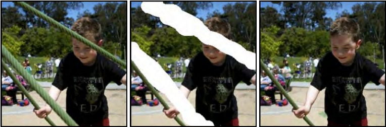

# 第1章 引言 -  Introduction

*人工智能*（Artificial Intelligence，简称AI）涉及构建模拟智能行为的系统。它包括广泛的方法，包括基于逻辑、搜索和概率推理的方法。*机器学习*是AI的一个子领域，它通过将数学模型拟合到观测数据中来学习做出决策。这个领域经历了爆炸性的增长，现在（不正确地）几乎与AI这个术语同义。

*深度神经网络*是一种机器学习模型，当它被拟合到数据中时，被称为*深度学习*。在撰写本书时，深度网络是最强大和实用的机器学习模型，我们在日常生活中经常遇到它们。使用*自然语言处理*算法翻译其他语言的文本，使用*计算机视觉*系统搜索特定对象的图片，或者通过*语音识别*界面与数字助理交流，这些应用都是由深度学习驱动的。

正如标题所示，本书旨在帮助刚接触这个领域的读者理解深度学习的原理。本书既不是过分理论化的（没有证明），也不是极其实践性的（几乎没有代码）。目标是解释其中的基本*思想*；读者在阅读本书后将能够将深度学习应用于新颖的情境中，而这些情境中没有现成的成功方法。

机器学习方法可以粗略地分为三个领域：监督学习、无监督学习和强化学习。在撰写本书时，这三个领域的前沿方法都依赖于深度学习（图[1.1](#_bookmark7)）。本章简要描述了这三个领域，并且此分类方法也在本书的组织结构上得到了松散的体现。无论我们喜欢与否，深度学习都将改变我们的世界，而这种改变并非都是积极的。因此，本章还包含了关于AI伦理的简要介绍。最后，我们给出了如何充分利用本书的建议。

## 1.1 监督学习 -  Supervised learning

监督学习模型定义了从输入数据到输出预测的映射关系。在接下来的章节中，我们将讨论输入、输出、模型本身以及“学习”模型的含义。

> 图1.1 机器学习是人工智能的一个领域，它将数学模型拟合到观测数据中。它可以粗略地分为监督学习、无监督学习和强化学习。深度神经网络对这些领域都有贡献。

### 1.1.1 回归和分类问题 - Regression and classification problems

图[1.2](#_bookmark8)描述了几个回归和分类问题。在每种情况下，都有一个有意义的现实世界输入（句子、声音文件、图像等），并将其编码为一个数字向量。这个向量形成了模型的输入。模型将输入映射到一个输出向量，然后将其“翻译”回一个有意义的现实世界预测。目前，我们关注输入和输出，并将模型视为一个黑盒子，它接收一个数字向量并返回另一个数字向量。

图[1.2a](#_bookmark8)中的模型根据输入特征（如面积和卧室数量）预测房屋的价格。这是一个*回归*问题，因为模型返回一个连续的数值（而不是分类结果）。相比之下，图[1.2b](#_bookmark8)中的模型以分子的化学结构作为输入，并预测其熔点和沸点。这是一个*多变量回归*问题，因为它预测多个数值。

图[1.2c](#_bookmark8)中的模型接收一个包含餐厅评论的文本字符串作为输入，并预测评论是积极的还是消极的。这是一个*二分类*问题，因为模型试图将输入分配给两个类别之一。输出向量包含输入属于每个类别的概率。图[1.2d](#_bookmark8)和[1.2e](#_bookmark8)描述了*多类分类*问题。在这种情况下，模型将输入分配给*N >* 2个类别之一。在第一种情况下，输入是一个音频文件，模型预测它包含的音乐流派。在第二种情况下，输入是一张图像，模型预测它包含的物体是什么。在每种情况下，模型返回一个大小为*N*的向量，其中包含*N*个类别的概率。

### 1.1.2 输入 - Inputs

图[1.2](#_bookmark8)中的输入数据变化很大。在房屋定价示例中，输入是一个包含描述房产特征的固定长度向量。这是一个*表格数据*的例子，因为它没有内部结构；如果我们改变输入的顺序并构建一个新模型，我们期望模型的预测结果保持不变。

相反，在餐厅评论的例子中，输入是一段文本。这取决于评论中的单词数量，可能是可变长度的，并且输入的顺序很重要；“我妻子吃了鸡肉”和“鸡肉吃了我妻子”是不同的。在将文本传递给模型之前，必须将其编码为数字形式。在这里，我们使用一个大小为10,000的固定词汇表，并简单地连接单词索引。

> 图1.2 回归和分类问题。
> * a) 这个*回归*模型接收描述房产特征的数字向量，并预测其价格。
> * b) 这个*多变量回归*模型接收化学分子的结构，并预测其熔点和沸点。
> * c) 这个*二分类*模型接收餐厅评论，并将其分类为积极或消极。
> * d) 这个*多类分类*问题将音频片段分配给*N*个流派之一。
> * e) 第二个多类分类问题，模型根据可能包含的*N*个对象之一对图像进行分类。

> 图1.3 机器学习模型。该模型表示了将输入（儿童年龄）与输出（儿童身高）相关联的一系列关系。特定的关系是使用训练数据选择的，训练数据由输入/输出对（橙色点）组成。当我们训练模型时，我们在可能的关系中搜索一个能够很好地描述数据的关系。在这里，训练好的模型是青色曲线，可以用于计算任何年龄对应的身高。

对于音乐分类的例子，输入向量可能是固定大小的（例如10秒的片段），但是非常高维。数字音频通常以44.1 kHz采样，并由16位整数表示，因此十秒的片段由441,000个整数组成。显然，监督学习模型必须能够处理可观的输入。图像分类示例中的输入（由每个像素处的RGB值连接而成）也是巨大的。此外，它的结构自然是二维的；即使两个像素在输入向量中不相邻，它们仍然密切相关，因为它们在垂直方向上彼此相邻。

最后，考虑预测分子的熔点和沸点的模型的输入。分子可能包含不同数量的原子，这些原子可以以不同的方式连接。在这种情况下，模型必须将分子的几何结构和组成原子输入到模型中。

### 1.1.3 机器学习模型 -  Machine learning models

到目前为止，我们将机器学习模型视为一个黑盒子，它接收一个输入向量并返回一个输出向量。但是这个黑盒子里到底有什么呢？考虑一个从儿童年龄预测身高的模型（图[1.3](#_bookmark10)）。机器学习模型是一个数学方程，描述了平均身高如何随年龄变化（图[1.3](#_bookmark10)中的青色曲线）。当我们将年龄输入到这个方程中时，它会返回身高。例如，如果年龄是10岁，那么我们预测身高将是139厘米。

更准确地说，这个模型表示了一族将输入映射到输出的方程（即一族不同的青色曲线）。通过使用*训练数据*（输入/输出对的示例），选择特定的方程（曲线）。在图[1.3](#_bookmark10)中，这些对由橙色点表示，我们可以看到模型（青色曲线）合理地描述了这些数据。当我们谈论*训练*或*拟合*模型时，我们的意思是在可能的方程（可能的青色曲线）中搜索，以找到最准确描述训练数据的方程。

由此可见，图[1.2](#_bookmark8)中的模型需要带标签的输入/输出对进行训练。例如，音乐分类模型需要大量的音频剪辑，其中人类专家已经确定了每个剪辑的流派。这些输入/输出对在训练过程中扮演了教师或监督者的角色，这就产生了“监督学习”的术语。

### 1.1.4 深度神经网络 - Deep neural networks

本书涉及的是深度神经网络，它是一种特别有用的机器学习模型。它是一种方程，可以表示输入和输出之间极其广泛的关系族，而且在这个关系族中搜索描述训练数据的关系特别容易。

深度神经网络可以处理非常大且长度可变的输入，以及包含各种内部结构的输入。它们可以输出单个实数（回归），多个实数（多元回归）或两个或更多类别的概率（二分类和多类分类）。正如我们将在下一节中看到的，它们的输出也可以是非常大且长度可变的，且包含内部结构。可能很难想象具有这些属性的方程，读者应该暂时搁置怀疑。

### 1.1.5 结构化输出 - Structured outputs

图[1.4a](#_bookmark13)描述了一个用于语义分割的多变量二分类模型。在这里，输入图像的每个像素被分配一个二进制标签，指示它是否属于牛或背景。图[1.4b](#_bookmark13)显示了一个多变量回归模型，其中输入是一个街景图像，输出是每个像素的深度。在这两种情况下，输出是高维且具有结构。然而，这种结构与输入密切相关，这可以被利用；如果一个像素被标记为“牛”，那么具有类似RGB值的相邻像素很可能具有相同的标签。

图[1.4c-e](#_bookmark13)描述了三个模型，输出具有复杂的结构，但与输入不太相关。图[1.4c](#_bookmark13)展示了一个音频转录模型，它将音频样本映射到音频中的口述文字。图[1.4d](#_bookmark13)是一个翻译模型，其中输入是英文文本，输出包含其法语翻译。图[1.4e](#_bookmark13)描述了一个非常具有挑战性的任务，其中输入是描述性文本，模型必须生成与该描述相匹配的图像。

> 图1.4 具有结构化输出的监督学习任务。
> * a) 这个语义分割模型将RGB图像映射到二进制图像，指示每个像素属于背景还是牛（改编自[Noh等人，2015年](#_bookmark1982)）。
> * b) 这个单目深度估计模型将RGB图像映射到每个像素表示深度的输出图像（改编自[Cordts等人，2016年](#_bookmark1432)）。
> * c) 这个音频转录模型将音频样本映射到音频中的口述文字。
> * d) 这个翻译模型将英文文本字符串映射到其法语翻译。
> * e) 这个图像合成模型将一个标题映射到一张图像（示例来自https://openai.com/dall-e-2/）。
在每种情况下，输出具有复杂的内部结构或语法。在某些情况下，许多输出与输入兼容。

原则上，后三个任务可以在标准的监督学习框架下解决，但由于两个原因，它们更加困难。首先，输出可能真的是有歧义的；从英文句子到法文句子有多种有效的翻译，任何标题都与任何图像兼容。其次，输出包含相当多的结构；并非所有的单词字符串都是有效的英文和法文句子，也不是所有的RGB值集合都是合理的图像。除了学习映射之外，我们还必须尊重输出的“语法”。

幸运的是，可以在不需要输出标签的情况下学习这种“语法”。例如，我们可以通过学习大量文本数据的统计信息来学习如何构成有效的英文句子。这与本书的下一节关联，下一节将考虑*无监督学习模型*。

## 1.2 无监督学习 - Unsupervised learning

在没有相应输出标签的情况下，从输入数据构建模型被称为*无监督学习*；缺少输出标签意味着没有“监督”。与学习从输入到输出的映射不同，目标是描述或理解数据的结构。与监督学习一样，数据可能具有非常不同的特征；它可能是离散的或连续的，低维的或高维的，长度恒定的或可变的。

### 1.2.1 生成模型 -  Generative models

本书关注*生成式无监督模型*，它们学习合成与训练数据在统计上无法区分的新数据示例。一些生成模型明确描述了输入数据上的概率分布，在这种情况下，新示例是通过从该分布中进行采样生成的。其他模型仅学习生成新示例的机制，而不明确描述其分布。

最先进的生成模型可以合成非常逼真但与训练示例不同的示例。它们在生成图像（图[1.5](#_bookmark17)）和文本（图[1.6](#_bookmark18)）方面取得了特别成功。它们还可以在某些输出预先确定的约束下合成数据（称为*条件生成*）。例如，图像修复（图[1.7](#_bookmark19)）和文本补全（图[1.8](#_bookmark21)）。事实上，现代文本生成模型非常强大，以至于它们可以显得智能。在给定一段文本和一个问题之后，模型通常可以通过生成最可能的文档补全来“填补”缺失的答案。然而，实际上，模型只了解语言的统计信息，并不理解其答案的意义。

> 图1.5 图像的生成模型。左侧：两个图像是从一个训练于猫图片的模型生成的。这些不是真实的猫，而是从概率模型中采样得到的样本。右侧：两个图像是从一个训练于建筑图像的模型生成的。改编自[Karras等人，2020年](#_bookmark1711)。

> 图1.6 从文本数据的生成模型合成的短篇小说。该模型描述了一个概率分布，为每个输出字符串分配概率。从模型中采样会生成遵循训练数据（这里是短篇小说）统计的字符串，但以前从未见过。

> 图1.7 图像修复。在原始图像中（左侧），男孩被金属电缆遮挡。这些不受欢迎的区域（中间）被去除，然后生成模型在剩余像素保持不变的约束下合成新图像（右侧）。改编自[Saharia等人，2022年](#_bookmark2080)。

> 图1.8 条件文本合成。给定一段初始文本（黑色部分），文本的生成模型可以通过合成“缺失”的剩余部分来合理地延续字符串。由GPT3生成[(Brown等人，2020年)](#_bookmark1348)。

> 图1.9 人脸的变化。人脸大约有42块肌肉，因此可以用仅有的42个数字来描述同一人在相同光照下的图像变化。通常情况下，图像、音乐和文本数据集可以用相对较少的潜在变量来描述，尽管将这些变量与特定的物理机制联系起来通常更加困难。来自Dynamic FACES数据库的图像[(Holland等人，2019年)](#_bookmark1640)。

### 1.2.2 潜在变量 -  Latent variables

一些（但不是全部）生成模型利用了数据可能比观察到的变量的原始数量更低维的观察。例如，有效和有意义的英语句子的数量远远小于通过随机抽取单词创建的字符串的数量。同样，真实世界的图像只是可以通过为每个像素随机抽取RGB值来创建的图像的一个小子集。这是因为图像是通过物理过程生成的（见图[1.9](#_bookmark22)）。

这导致了一个想法，即我们可以使用较少的*潜在变量*来描述每个数据示例。在这里，深度学习的作用是描述这些潜在变量与数据之间的映射关系。潜在变量通常通过设计具有简单的概率分布。通过从该分布中进行采样并将结果传递给深度学习模型，我们可以创建新的样本（图[1.10](#_bookmark24)）。

> 图1.10 潜在变量。许多生成模型使用深度学习模型描述低维“潜在”变量与观察到的高维数据之间的关系。潜在变量通过设计具有简单的概率分布。因此，可以通过从潜在变量的简单分布中进行采样，然后使用深度学习模型将样本映射到观察到的数据空间来生成新的示例。

> 图1.11 图像插值。每一行中，左侧和右侧的图像是真实的，中间的三个图像表示由生成模型创建的插值序列。支持这些插值的生成模型已经学会了所有图像都可以由一组潜在变量生成。通过找到这些变量的两个真实图像的值，插值它们的值，然后使用这些中间变量创建新的图像，我们可以生成既视觉上合理又混合了两个原始图像特征的中间结果。改编自[Sauer等人，2022年](#_bookmark2108)和[Ramesh等人，2022年](#_bookmark2047)。

> 图1.12 从标题“时代广场上的一个滑板上的泰迪熊”生成的多个图像。由DALL·E-2生成（[Ramesh等人，2022年](#_bookmark2047)）。

这些模型为操作真实数据的新方法提供了可能。例如，考虑找到支持两个真实示例的潜在变量。我们可以通过在潜在表示之间进行插值，并将中间位置映射回数据空间来在这些示例之间进行插值（图[1.11](#_bookmark25)）。

### 1.2.3 连接监督学习和无监督学习 -  Connecting supervised and unsupervised learning

具有潜在变量的生成模型也可以为具有结构化输出的监督学习模型提供帮助（图[1.4](#_bookmark13)）。例如，考虑学习预测与标题相对应的图像。我们可以学习解释文本的潜在变量和解释图像的潜在变量之间的关系，而不是直接将文本输入映射到图像。

这有三个优点。首先，由于输入和输出的维度较低，我们可能需要更少的文本/图像对来学习这种映射。其次，我们更有可能生成看起来合理的图像；任何合理的潜在变量值都应该产生看起来像一个合理示例的东西。第三，如果我们在两组潜在变量之间或从潜在变量到图像的映射中引入随机性，那么我们可以生成多个图像，所有这些图像都可以很好地由标题描述（图[1.12](#_bookmark27)）。

## 1.3 强化学习 - Reinforcement learning

机器学习的最后一个领域是强化学习。这种范式引入了一个在世界中生活并可以在每个时间步骤执行特定动作的代理（agent）的概念。这些动作会改变系统的状态，但不一定是确定性的。采取一个动作也可能产生奖励，强化学习的目标是让代理学会选择平均上能够获得高奖励的动作。

一个复杂之处在于，奖励可能在采取动作之后的一段时间内发生，因此将奖励与动作关联起来并不简单。这被称为*时间性奖励分配问题*。随着代理的学习，它必须在已知的知识之间权衡*探索*和*利用*；也许代理已经学会了如何获得适度的奖励；它应该遵循这个策略（利用已知的知识），还是应该尝试不同的动作以查看是否可以改进（探索其他机会）？

### 1.3.1 两个例子 - Two examples

考虑教授一个人形机器人行走。机器人在给定时间内可以执行有限数量的动作（移动各个关节），这些动作会改变世界的状态（机器人的姿势）。我们可能会奖励机器人在障碍赛道中达到检查点。为了到达每个检查点，它必须执行许多动作，而当奖励到来时，哪些动作对奖励的贡献不明确，哪些是无关紧要的。这是一个时间性奖励分配问题的例子。

第二个例子是学习下棋。同样，代理在任何给定时间都有一组有效的动作（棋步）。然而，这些动作以非确定性的方式改变系统的状态；对于任何动作的选择，对手可能会以许多不同的着法作出回应。在这里，我们可以基于吃子来建立奖励结构，或者只在游戏结束时给出一个奖励来表示胜利。在后一种情况下，时间性奖励分配问题非常严重；系统必须学会哪些着法对于成功或失败是关键的。

在这两个例子中，探索和利用的权衡也是显而易见的。机器人可能已经发现通过侧躺并用一条腿推动可以取得进展。这种策略可以移动机器人并获得奖励，但速度比最佳解决方案（保持平衡并行走）慢得多。因此，它面临着利用已知知识（如如何笨拙地沿地板滑动）和探索动作空间（可能导致更快的行走）之间的选择。类似地，在下棋的例子中，代理可能会学习一系列合理的开局着法。它应该利用这个知识还是尝试不同的开局着法？

深度学习如何适用于强化学习框架可能并不明显。有几种可能的方法，但其中一种技术是使用深度网络构建从观察到的世界状态到动作的映射。这被称为*策略网络*。在机器人的例子中，策略网络将学习从传感器测量到关节运动的映射。在下棋的例子中，网络将学习从当前棋盘状态到着法选择的映射（图[1.13](#_bookmark32)）。

> 图1.13 强化学习的策略网络。将深度神经网络应用于强化学习的一种方法是使用它们来定义从状态（如棋盘上的位置）到动作（可能的移动）的映射。这种映射被称为 *策略*。改编自[Pablok](#_bookmark1983) [(2017)](#_bookmark1983)。

## 1.4 伦理道德 - Ethics

在不讨论人工智能的伦理影响将是不负责任的情况下，撰写本书。这项强大的技术将至少与电力、内燃机、晶体管或互联网一样，改变世界的程度。在医疗保健、设计、娱乐、交通、教育和几乎所有商业领域中，其潜在的益处是巨大的。然而，科学家和工程师往往对他们工作的结果过于乐观，潜在的危害同样巨大。以下几段重点讨论了五个关切点。

**偏见和公正性：** 如果我们根据历史数据训练一个系统来预测个人的薪水水平，那么这个系统将重现历史上的偏见；例如，它可能会预测女性应该比男性获得较低的薪水。类似的情况已经成为国际新闻：一个用于超分辨率处理面部图像的AI系统使非白人看起来更白；一个生成图像的系统在被要求合成律师的图片时只生成男性的照片。对使用人工智能进行算法决策的粗心应用可能会巩固或加剧现有的偏见。详细讨论请参见[Binns](#_bookmark1316) [(2018)](#_bookmark1316)。

**可解释性：** 深度学习系统做出决策，但我们通常不知道具体是如何以及基于什么信息做出的决策。它们可能包含数十亿个参数，我们无法通过检查来理解它们的工作方式。这导致了可解释性人工智能的子领域。一个相对成功的领域是产生局部解释；我们无法解释整个系统，但我们可以提供一个可解释的描述，说明为什么做出了特定的决策。然而，目前还不清楚是否可能构建复杂的决策系统，使其对用户甚至创建者完全透明。详细信息请参见[Grennan等人](#_bookmark1579) [(2022)](#_bookmark1579)。

**将AI用于武器化：** 所有重要的技术都直接或间接地应用于战争。可悲的是，暴力冲突似乎是人类行为中不可避免的特征。人工智能可以说是有史以来最强大的技术，无疑将在军事背景下广泛部署。事实上，这已经在发生中（参见[Heikkilä，](#_bookmark1630) [2022)](#_bookmark1630)）。

**权力集中：** 世界上最强大的公司之所以大量投资于人工智能，并不是出于改善人类命运的善意。他们知道这些技术将使他们获得巨额利润。与任何先进技术一样，深度学习很可能将权力集中在少数控制它的组织手中。自动化目前由人类执行的工作将改变经济环境，并对收入较低、技能较少的工人的生计产生不成比例的影响。乐观主义者认为，类似的中断在工业革命期间发生过，并导致工作时间缩短。事实是，我们根本不知道大规模采用人工智能对社会产生什么样的影响（参见[David，](#_bookmark1449) [2015)](#_bookmark1449)。

**存在风险：** 人类面临的主要存在风险都源自技术。气候变化是工业化的结果。核武器源于对物理学的研究。由于交通、农业和建筑方面的创新，流行病更有可能发生并传播得更快，因为这些创新使得人口更大、更密集、更互联。人工智能带来了新的存在风险。我们在构建比人类更强大和可扩展的系统时应该非常谨慎。在最乐观的情况下，它将使所有权力掌握在所有者手中。在最悲观的情况下，我们将无法控制它，甚至无法理解它的动机（参见[Tegmark，](#_bookmark2203) [2018)](#_bookmark2203)。

这个列表远非详尽无遗。人工智能还可能促使监视、虚假信息、侵犯隐私、欺诈和操纵金融市场，并且训练人工智能系统所需的能源会导致气候变化。此外，这些关切不是臆测的；已经有许多伦理可疑的人工智能应用的例子（参考[Dao，](#_bookmark1440) [2021)](#_bookmark1440)）。此外，互联网的最近历史表明，新技术可能以意想不到的方式造成伤害。八十年代和九十年代的在线社区几乎无法预测到虚假新闻、垃圾邮件、在线骚扰、欺诈、网络霸凌、绝望文化、政治操纵、揭露个人隐私、在线激进化和报复色情的泛滥。

每个研究人员（或撰写关于）人工智能的人都应该考虑科学家在使用其技术方面的责任程度。我们应该考虑到资本主义主要推动了人工智能的发展，法律进步和社会利益的部署可能会滞后很大。我们应该思考作为科学家和工程师，是否能够控制该领域的进展并减少潜在的危害。我们应该考虑我们愿意为哪种类型的组织工作。他们在减少人工智能潜在危害方面有多认真？他们只是在进行“伦理洗白”以减少声誉风险，还是真正采取措施阻止伦理可疑的项目？

鼓励所有读者进一步研究这些问题。[https://ethics-of-ai.mooc.fi/](https://ethics-of-ai.mooc.fi/) 是一个有用的入门资源。如果您是使用本书授课的教授，请与您的学生讨论这些问题。如果您是参加课程但未进行这样的讨论的学生，请游说您的教授进行讨论。如果您在企业环境中部署或研究人工智能，则鼓励您审查雇主的价值观，并在有需要的情况下帮助改变它们（或离开）。

## 1.5 书籍结构 - Structure of book
本书的结构遵循本介绍的结构。第2至9章介绍了监督学习的流程。我们描述了浅层和深度神经网络，并讨论了如何训练它们、衡量和改善它们的性能。第10至13章介绍了深度神经网络的常见架构变体，包括卷积网络、残差连接和Transformer。这些架构在监督、无监督和强化学习中都得到了应用。

第14至18章介绍了使用深度神经网络进行无监督学习。我们分别专门讨论了四种现代深度生成模型：生成对抗网络、变分自编码器、归一化流和扩散模型。第19章是关于深度强化学习的简要介绍。这是一个容易成为一本单独书籍的主题，因此对它的处理必然是肤浅的。然而，这个处理旨在为对这个领域不熟悉的读者提供一个良好的起点。

尽管本书的标题是“深度学习”，但对于深度学习的某些方面，我们仍然了解甚少。第20章提出了一些基本问题。为什么深度网络如此容易训练？为什么它们具有良好的泛化能力？为什么它们需要这么多参数？它们需要是深度的吗？在探索过程中，我们会探讨一些意想不到的现象，如损失函数的结构、双重下降、理解和中彩票效应。本书以第21章讨论伦理和深度学习结束。

## 1.6 其他书籍 - Other books

本书是一本独立的书籍，但仅涵盖了深度学习的内容。它旨在成为《深度学习》（Goodfellow等人，2016年）的精神继承者，后者是一本非常出色的资源，但不包括最新的进展。对于更广泛的机器学习内容，最新和全面的资源是《概率机器学习》（Murphy，2022年，2023年）。然而，《模式识别与机器学习》（Bishop，2006年）仍然是一本优秀而相关的书籍。

如果您喜欢本书，那么我的前一本著作《计算机视觉：模型、学习和推理》（Prince，2012年）仍然值得一读。其中的一些部分已经过时，但它包含了对概率的全面介绍，包括贝叶斯方法，以及对潜在变量模型、计算机视觉的几何、高斯过程和图形模型的入门性覆盖。它使用与本书相同的符号约定，并且可以在网上找到。关于图形模型的详细讨论可以在《概率图模型：原理和技术》（Koller和Friedman，2009年）中找到，而《高斯过程用于机器学习》（Williams和Rasmussen，2006年）则涵盖了高斯过程。

有关背景数学知识，请参考《机器学习的数学基础》（Deisenroth等，2020年）。如果您更倾向于以编码为导向的方法，请参考《深度学习动手学》（Zhang等，2023年）。计算机视觉的最佳概述是Szeliski（2022年），还有即将出版的书籍《计算机视觉基础》（Torralba等，2024年）。了解图神经网络的良好起点是《图表示学习》（Hamilton，2020年）。关于强化学习的权威著作是《强化学习导论》（Sutton和Barto，2018年）。初学者的良好资源是《深度强化学习基础》（Graesser和Keng，2019年）。

## 1.7 如何阅读本书 - How to read this book

本书中的大多数章节包含正文、注释部分和一系列问题。正文部分旨在自成体系，可以独立阅读，无需参考章节的其他部分。尽可能地，背景数学知识已融入到正文中。然而，对于那些可能分散主线论证的更大主题，背景材料被放在附录中，并在页边提供了参考。本书中的大部分符号遵循标准符号约定。然而，有些约定的使用较少，建议读者在继续阅读之前参考附录[A](#_bookmark1152)。

正文部分包括许多深度学习模型和结果的新颖插图和可视化。我努力提供对现有思想的新解释，而不仅仅是整理他人的工作。深度学习是一个新兴领域，有时现象的理解还不够透彻。我会明确指出这种情况，并在需要谨慎对待我的解释时进行说明。

参考文献仅在正文中描绘结果时才会包含。相反，它们可以在章节末尾的注释部分找到。在正文中，我通常不会遵循历史先例；如果当前技术的祖先不再有用，我就不会提及它。然而，注释部分描述了该领域的历史发展，并希望公平地给予相关的认可。注释按段落组织，提供了进一步阅读的指引。它们应该帮助读者在子领域内定位自己，并理解它与机器学习其他部分的关系。注释的自包含性不如主文本。根据您的背景知识和兴趣水平，您可能会发现这些部分更或者不那么有用。

每章都有一些相关问题。在正文的相应位置，会在页边标注应尝试解决这些问题的时间点。正如George Pólya所说：“数学，你看，不是一项旁观者运动。”他是正确的，我强烈建议您在阅读过程中尝试解决这些问题。在某些情况下，这些问题提供的见解将帮助您理解主要内容。在相关网站上提供答案的问题将用星号标注。此外，还可以通过网站获取帮助您理解本书中的思想的Python笔记本，并且这些也会在正文的页边引用。事实上，如果您感到生疏，现在就通过背景数学的笔记本开始工作可能会很有价值。

不幸的是，人工智能领域的研究速度使得本书不可避免地成为一个持续不断的工作。如果您发现有些部分难以理解，有明显遗漏或似乎是多余的部分，请通过相关网站与我联系。我们可以共同使下一版变得更好。