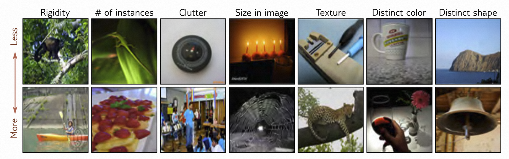

# 本章目录

- [本章目录](#本章目录)
- [第10章 卷积神经网络 - Convolutional networks](#第10章-卷积神经网络---convolutional-networks)
  - [10.1 不变性和等变性 - Invariance and equivariance](#101-不变性和等变性---invariance-and-equivariance)
  - [10.2 用于一维输入的卷积网络 - Convolutional networks for 1D inputs](#102-用于一维输入的卷积网络---convolutional-networks-for-1d-inputs)
  - [10.2.1 一维卷积操作 - 1D convolution operation](#1021-一维卷积操作---1d-convolution-operation)
    - [10.2.2 填充 - Padding](#1022-填充---padding)
    - [10.2.3 步幅、卷积核大小和膨胀 - Stride, kernel size, and dilation](#1023-步幅卷积核大小和膨胀---stride-kernel-size-and-dilation)
    - [10.2.4 卷积层 - Convolutional layers](#1024-卷积层---convolutional-layers)
    - [10.2.5 通道 - Channels](#1025-通道---channels)
    - [10.2.6 卷积网络与感受域 - Convolutional networks and receptive fields](#1026-卷积网络与感受域---convolutional-networks-and-receptive-fields)
    - [10.2.7 示例：MNIST-1D数据集 - Example: MNIST-1D](#1027-示例mnist-1d数据集---example-mnist-1d)
  - [10.3 用于二维输入的卷积网络 - Convolutional networks for 2D inputs](#103-用于二维输入的卷积网络---convolutional-networks-for-2d-inputs)
  - [10.4 降采样和上采样 - Downsampling and upsampling](#104-降采样和上采样---downsampling-and-upsampling)
    - [10.4.1 降采样 - Downsampling](#1041-降采样---downsampling)
    - [10.4.2 上采样 - Upsampling](#1042-上采样---upsampling)
    - [10.4.3 改变通道数 - Changing the number of channels](#1043-改变通道数---changing-the-number-of-channels)
  - [10.5 应用领域 - Applications](#105-应用领域---applications)
    - [10.5.1 图像分类 - Image classification](#1051-图像分类---image-classification)
    - [10.5.2 目标检测 - Object detection](#1052-目标检测---object-detection)
    - [10.5.3 语义分割 - Semantic segmentation](#1053-语义分割---semantic-segmentation)
  - [10.6 总结 - Summary](#106-总结---summary)
  - [10.7 注意 - Notes](#107-注意---notes)
  - [10.8 问题 - Problems](#108-问题---problems)

# 第10章 卷积神经网络 - Convolutional networks

前面的[第2-9章]()介绍了深度神经网络的监督学习流程。然而，这些章节只讨论了具有单一路径的全连接网络。接下来的[第10-13章]()将介绍更专门的网络组件，它们具有更稀疏的连接、共享的权重和并行处理路径。本章将介绍主要用于处理图像数据的*卷积层*。

图像有三个特点，因此需要专门的模型架构来处理

- 首先，图像是高维的。一个典型的用于分类任务的图像包含224×224个RGB值（即150,528个输入维度）。全连接网络中的隐藏层通常比输入尺寸要大，因此即使对于一个浅层网络，权重的数量也会超过150,528^2^，即220亿个。显然，这会对所需的训练数据量、内存大小和算力大小等方面带来极大的挑战。
- 其次，图像中的像素之间是统计相关的。然而，全连接网络没有考虑像素之间的“邻近性”，它对每个输入之间的关系都一视同仁。如果训练和测试图像的像素以相同的方式随机排列，网络仍然可以在没有实际差异的情况下进行训练。
- 第三，图像的解释在几何变换下是稳定的。如果我们将一棵树的图像向左移动几个像素，它仍然是一棵树的图像。然而，这个移动会影响网络的每个输入。因此，全连接模型必须在每个位置上单独学习表示树的像素模式，这显然是低效的。

卷积层独立地处理每个局部图像区域，使用在整个图像上共享的参数。它们使用的参数比全连接层少，利用了附近像素之间的空间关系，并且不需要在每个位置重新学习像素的解释。主要由卷积层组成的网络被称为*卷积神经网络*或*CNN*。

## 10.1 不变性和等变性 - Invariance and equivariance

在前面的讨论中，我们已经提到了图像的某些属性在变换下是稳定的，比如树纹理。现在，我们将这个想法更加数学化。对于一个图像$\mathbf x$，如果函数$\mathbf f[\mathbf x]$对于一个变换$\mathbf t[\mathbf x]$是*不变的*，那么我们有：

$$
\mathbf f[\mathbf t[\mathbf x]]=\mathbf f[\mathbf x]
\tag{10.1}
$$

换句话说，对于变换$\mathbf t[\mathbf x]$，函数$\mathbf f[\mathbf x]$的输出保持稳定。在图像分类任务中，我们希望神经网络能够识别出图像中的相同物体，即使它们经过平移、旋转、翻转或者扭曲。

对于一个图像$\mathbf x$，如果函数$\mathbf f[\mathbf x]$对于一个变换$\mathbf t[\mathbf x]$是*等变的*或者*协变的*，那么我们有：

$$
f[t[x]]=t[f[x]]
\tag{10.2}
$$

换句话说，当输入发生变换时，函数$\mathbf f[\mathbf x]$的输出也按照相同的方式发生变换。在像素级别的图像分割任务中，我们希望神经网络对于变换是等变的（参见图[10.1c-f]()）。这意味着如果图像经过平移、旋转或者翻转，函数$\mathbf f[\mathbf x]$应该返回与之相应的分割结果。

> 图10.1 平移的不变性和等变性。
>
> - a-b) 在图像分类中，我们的目标是将这两个图像都归类为"山"，而不考虑水平平移。换句话说，我们希望神经网络的预测结果在平移变换下保持不变。
> - c,e) 在语义分割中，我们的目标是为每个像素赋予一个标签。
> - d,f) 当输入图像被平移时，我们希望输出（彩色覆盖）也以相同的方式平移。换句话说，我们希望输出在平移变换下是等变的。图c-f）改编自[Bousselham et al. , 2021]()。

## 10.2 用于一维输入的卷积网络 - Convolutional networks for 1D inputs

卷积网络由一系列卷积层组成，每一层对于平移具有等变性。它们通常还包括池化机制，以实现对于平移的部分不变形。为了更清楚地说明这个概念，我们首先考虑对于一维数据的卷积网络，这样更容易进行可视化。在第[10.3节](#convolutional-networks-for-2d-inputs)中，我们将进一步讨论如何将这些概念应用于图像数据。

## 10.2.1 一维卷积操作 - 1D convolution operation

*卷积层*是基于*卷积*操作的网络层。在一维空间中，卷积将输入向量$ \mathbf x $转换为输出向量$\mathbf  z $，使得每个输出$ z_{i} $都是附近输入的加权和。相同的权重在每个位置上都被使用，并且统称为*卷积核*或*滤波器*。输入被加权和求和的区域被称为*卷积核大小*。对于卷积核大小为三的情况，我们有：

$$
z_{i} = ω_{1}x_{i-1} + ω_{2}x_{i} + ω_{3} x_{i+1}
\tag{10.3}
$$

其中$ ω =  [ω_{1}, ω_{2}, ω_{3}]^{T} $是卷积核（图[10.2]()）^[1]^请注意，卷积操作在平移方面具有等变性。如果我们平移输入$ x $，那么相应的输出$ z $也会以相同的方式平移。

> 图10.2 1维卷积，核大小为3。每个输出$z_i$是最近的三个输入$x_{i-1}, x_{i}$和$x_{i + 1}$的加权和，其中权重为$ω =  [ω_{1}, ω_{2}, ω_{3}]$。
>
> - a) 输出$z_{2}$的计算公式为$z_{2} = ω_{1}x_{1} + ω_{2}x_{2} + ω_{3} x_{3}$。
> - b) 输出$z_{3}$的计算公式为$z_{3} = ω_{1}x_{2} + ω_{2}x_{3} + ω_{3}x_{4}$。
> - c) 位置$z_{1}$处的卷积核超出了第一个输入$x_{1}$的范围。我们可以通过零填充来处理这个问题，即假设超出范围的值为零。输出也以类似的方式处理。
> - d) 或者，我们只计算卷积核在输入范围内的输出（"valid"卷积）；这种情况下，输出的尺寸将比输入小。

> ^1^ 严格来说，这是一个互相关而不是卷积操作，因为权重相对于输入会翻转（即我们会将$ x_{i-1} $与$ x_{i+1} $交换）。但无论如何，这个（错误的）定义是机器学习中的通常约定。

### 10.2.2 填充 - Padding

方程[10.3]()显示，每个输出都是通过对输入的前一个、当前和后一个位置进行加权求和得到的。这就引发了一个问题，即如何处理第一个输出（其中没有前一个输入）和最后一个输出（其中没有后一个输入）。

有两种常见的方法。

- 第一种方法是在输入的边缘填充新的值，然后按照通常的方式进行处理。例如*零填充*，是假设在其有效范围之外，输入为零（图[10.2c]()）。其他填充方案有将输入视为循环输入或在边界处进行反射。
- 第二种方法是*有效卷积*，它会丢弃卷积核超过输入位置范围的输出位置。它的优点是在输入边缘不引入额外的信息。然而，它们的缺点是表示的尺寸减小。

### 10.2.3 步幅、卷积核大小和膨胀 - Stride, kernel size, and dilation

在上面的例子中，每个输出都是最近三个输入的总和。然而，这只是一大类卷积操作中的一种，它们的基于*步幅*、*卷积核大小*和*膨胀率*的不同而有所区别。当我们在每个位置评估输出时，我们称之为*步幅*为一。然而，也可以将卷积核按大于一的步幅移动。例如，如果步幅为2，则会创建大约一半数量的输出（图[10.3a-b]()）。

> 图10.3 步幅、卷积核大小和膨胀。
>
> - a) 当步幅为2时，我们每隔一个位置评估一次卷积核，因此第一个输出$ z_{1} $是从以$ x_{1} $为中心的加权和计算得出的，
> - b) 第二个输出$ z_{2} $是从以$ x_{3} $为中心的加权和计算得出的，依此类推。
> - c) 卷积核大小也可以改变。当卷积核大小为五时，我们对最近的五个输入进行加权求和。
> - d) 在膨胀卷积中，我们在权重向量中插入零，以便使用更少的权重来结合较大区域的信息。

*卷积核大小*可以增加以覆盖更大的区域（图[10.3c]()）。通常情况下，卷积核的大小是奇数，这样可以将当前输入放置在中心位置。增加卷积核大小的缺点是需要更多的权重。这就引出了*膨胀卷积*或*扩张卷积*的概念，其中卷积核的权重值与零交替。例如，我们可以通过将第二个和第四个元素设置为零，将大小为五的卷积核变成大小为三的膨胀卷积核。这样我们仍然可以从较大的输入区域中获取信息，但只需要三个权重来实现这一点（图[10.3d]()）。插入在权重之间的零的数量决定了*膨胀率*。

### 10.2.4 卷积层 - Convolutional layers

卷积层的功能是对输入进行卷积运算，并加上偏移量 $β$，然后通过激活函数 $\mathrm a[•]$ 处理每个结果以计算输出。对于核大小为3、步长为1、膨胀率为1的情况，第 $i$ 个隐藏单元 $h_{i}$ 的计算公式如下：

$$
\begin{array}{rcl}
h_i &=& \mathrm  a\left[\beta+\omega_1x_{i-1}+\omega_2x_i+\omega_3x_{i+1}\right] \\
&=&\mathrm a\left[\beta+\sum_{j=1}^3\omega_jx_{i+j-2}\right],
\end{array}
\tag{10.4}
$$

其中，偏移量 $β$ 和核权重 $ω_{1}, ω_{2}, ω_{3}$ 是可训练的参数。如果，我们使用*零填充*方法，当其超出有效范围时，将输入 $x$ 视为零，那么这个公式相当于一个特殊情况下的全连接层，它将第 $i$ 个隐藏单元的计算公式定义为：

$$
\begin{array}{rcl}
h_i &=& a\left[\beta_i+\sum_{j=1}^D\omega_{ij}x_j\right].
\end{array}
\tag{10.5}
$$

对于 $D$ 个输入 $x_•$ 和 $D$ 个隐藏单元 $h_•$，这个全连接层将具有 $D^{2}$ 个权重 $ω_{••}$ 和 D 个偏移量 $β_•$。而卷积层只使用了三个权重和一个偏移量。当然，当我们将全连接层的大部分权重设为零，并约束其他权重相等，全连接层可以完全模拟卷积层的过程（见图 [10.4]()）。

> 图10.4 全连接层与卷积层对比。
>
> - a) 在全连接层中，每个输入$x$都与每个隐藏单元$h$有一个连接权重（彩色箭头），每个隐藏单元都有一个偏移量（未显示）。
> - b) 因此，对应的权重矩阵$Ω$包含了将六个输入与六个隐藏单元关联起来的36个权重。
> - c) 卷积层使用大小为三的卷积核来计算每个隐藏单元，作为三个相邻输入的加权和（箭头），再加上一个偏移量（未显示）。
> - d) 权重矩阵是全连接矩阵的一种特殊情况，其中很多权重为零且其他权重重复出现（相同颜色表示相同值，白色表示零权重）。
> - e) 大小为三且步长为两的卷积层在每隔一个位置处进行加权求和。
> - f) 这也是一种具有不同稀疏权重结构的全连接网络的特殊情况。

### 10.2.5 通道 - Channels

如果我们只使用一个卷积操作，就会丢失信息，因为我们只是对相邻的输入进行了平均，并且ReLU激活函数还会截断小于零的结果。因此，通常会同时计算多个卷积操作。每个卷积操作会生成一组新的隐藏变量，称为*特征图*或*通道*。

图 [10.5a-b]() 以大小为3且使用*零填充*的两个卷积核为例进行了说明。

- 第一个卷积核对最近的3个像素进行加权求和，再加上一个偏移量，并通过激活函数产生隐藏单元$h_{1}$到$h_{6}$。它们组成了第一个通道。
- 第二个卷积核对不同的最近3个像素进行加权求和，再加上不同的偏移量，并通过激活函数产生隐藏单元$h_{7}$到$h_{12}$。它们组成了第二个通道。

一般来说，输入和隐藏层都会有多个通道（图[10.5c]）。如果输入层有$C_{i}$个通道和大小为$K$的卷积核，那么每个输出通道中的隐藏单元都是通过对所有$C_{i}$个通道和$K$个卷积核位置进行加权求和得到的，使用一个权重矩阵$Ω∈\mathbb{R}^{C_i×K}$和一个偏移量。因此，如果下一层有$C_{o}$个通道，我们需要一个大小为$Ω∈\mathbb{R}^{C_i×C_o×K}$的权重矩阵和一个大小为$β∈\mathbb{R}^{C_o}$的偏移量。

> 图10.5 通道。通常，我们会对输入$x$应用多个卷积操作，并将它们存储在通道中。
>
> - a) 进行卷积操作以生成隐藏单元$h_{1}$到$h_{6}$，它们组成了第一个通道。
> - b) 再进行一次卷积操作以生成隐藏单元$h_{7}$到$h_{12}$，它们组成了第二个通道。通道被存储在二维数组$H_{1}$中，其中包含了第一个隐藏层中的所有隐藏单元。
> - c) 如果我们添加更多的卷积层，现在每个输入位置都会有两个通道。在这个例子中，一维卷积定义了在最接近的三个位置上对两个输入通道进行加权求和，以生成每个新的输出通道。

### 10.2.6 卷积网络与感受域 - Convolutional networks and receptive fields

在第四章中，我们介绍了由一系列全连接层组成的深度网络。类似地，卷积网络由一系列卷积层组成。而这些卷积层中的隐藏单元所关注的是输入数据中的*感受域*，即与之相关的区域。举个例子，假设一个卷积网络中的每个卷积层都采用了大小为三的卷积核。在第一层，隐藏单元对最接近的三个输入进行加权求和，所以它的感受域大小就是三。而在第二层，隐藏单元对第一层中最接近的三个位置进行加权求和，而这些位置本身又是三个输入的加权求和，所以第二层的隐藏单元具有大小为五的感受域。通过这种方式，连续的层中的单元的感受域会逐渐增大，从而实现来自输入的信息逐渐融合（见图[10.6]()）。

> 图10.6 卷积网络中的感受域示意图（使用3个卷积核的情况）。
>
> - a) 输入是一个具有11个维度的向量，进入一个具有3个通道和大小为3的卷积核的隐藏层$\mathbf{H_{1}}$。第一个隐藏层$\mathbf{H_{1}}$中三个突出显示的隐藏单元的预激活是最近三个输入的加权和，因此在$\mathbf{H_{1}}$中的感受域大小为3。
> - b) 第二层$\mathbf{H_{2}}$中四个突出显示的隐藏单元的预激活分别是第一层$\mathbf{H_{1}}$中三个通道在最近的三个位置的加权和。每个$\mathbf{H_{1}}$中的隐藏单元对最近的三个输入位置进行加权。因此，$\mathbf{H_{2}}$中的隐藏单元具有感受域大小为5。
> - c) 第三层中的隐藏单元（卷积核大小为3，步幅为2）将感受域大小增加到7。
> - d) 当我们添加第四层时，位于位置3的隐藏单元的感受域覆盖整个输入。

### 10.2.7 示例：MNIST-1D数据集 - Example: MNIST-1D

现在我们将卷积网络应用于MNIST-1D数据集（参见图[8.1]()）。输入向量$\mathbf{x}$是一个40维向量，输出向量$\mathbf{f}$是一个10维向量，通过softmax层产生类别概率。我们使用了一个具有三个隐藏层的网络（图[10.7]()）。第一个隐藏层的15个通道$\mathbf{H_{1}}$使用滤波器大小为3，步幅为2，使用"valid"填充方式计算，得到19个空间位置。第二个隐藏层$\mathbf{H_{2}}$也使用滤波器大小为3，步幅为2，使用"valid"填充方式计算。第三个隐藏层的计算方式类似。在这个阶段，表示具有4个空间位置和15个通道。这些值被重新调整为大小为60的向量，然后通过一个全连接层映射到10个输出激活。

> 图10.7 用于分类MNIST-1D数据集的卷积网络（参见图[8.1]()）。MNIST-1D输入的维度为$D_{i}=40$。第一个卷积层具有15个通道，卷积核大小为3，步幅为2，并且只保留“valid”位置以生成具有19个位置和15个通道的表示。接下来的两个卷积层具有相同的设置，逐渐减小表示的大小。最后，一个全连接层接收来自第三个隐藏层的所有60个隐藏单元。它输出10个激活值，随后通过softmax层产生10个类别的概率。

这个网络使用了100,000个步骤进行训练，使用了没有动量的SGD优化算法，学习率为0.01，批大小为100，训练集包含了4,000个样本。我们将这个网络与具有相同层数和隐藏单元个数的全连接网络进行比较（即三个隐藏层分别具有285、135和60个隐藏单元）。卷积网络具有2,050个参数，而全连接网络具有150,185个参数。根据图[10.4]()的逻辑，卷积网络是全连接网络的一种特殊情况。后者具有足够的灵活性来完全模拟前者。图[10.8]()显示，两种模型都完美拟合了训练数据。然而，卷积网络的测试误差远小于全连接网络。

> 图10.8 MNIST-1D结果。
>
> - a) 图[10.7]()中的卷积网络最终完美拟合了训练数据，但测试误差约为17%。
> - b) 具有相同数量的隐藏层和隐藏单元的全连接网络学习训练数据的速度更快，但在测试误差达到约40%时无法很好地泛化。后一种模型可以复现卷积模型，但却不能成功。卷积结构限制了可能的映射方式，使其以类似的方式处理每个位置，这种限制提高了性能。

 可能的解释并不是由于参数数量的差异所造成的，我们知道过度参数化通常会提高性能（参见[8.4.1](#explanation)节）。相反，可能的解释是卷积架构具有更好的归纳偏差，即更好地插值训练数据。在卷积网络中，我们在架构中体现了一些先验知识，并强制网络以相同的方式处理输入中的每个位置。我们知道数据是基于模板创建的，该模板会在一些操作之间进行随机平移，因此这是合理的。

相比之下，全连接网络必须学习每个位置上每个数字模板的外观。而卷积网络则在位置之间共享信息，因此能够更准确地识别每个类别。另一种思考这个问题的方式是，在训练卷积网络时，我们搜索一个较小的输入/输出映射集合，其中所有映射都是可行的。或者，我们可以将卷积结构视为一种正则化器，它对全连接网络可以描述的大多数解施加了无限惩罚。

## 10.3 用于二维输入的卷积网络 - Convolutional networks for 2D inputs

前一节介绍了用于处理一维数据的卷积网络。这种网络可以应用于金融时间序列、音频和文本。然而，卷积网络更常用于二维图像数据。卷积核现在是一个二维对象。一个应用于由元素 $ x_{ij} $ 组成的二维输入的 3×3 卷积核 $ Ω∈\mathbb{R}^{3×3} $ 计算单层隐藏单元 $ h_{ij} $，如下所示：

$$
\begin{array}{rcl}h_{ij}&=&\text{a}\left[\beta+\sum_{m=1}^3\sum_{n=1}^3\omega_{mn}x_{i+m-2,j+n-2}\right],\end{array}
\tag{10.6}
$$

其中 $ ω_{mn} $ 是卷积核的元素。这只是一个在3×3的输入区域上进行加权求和的过程。卷积核在输入的二维数组上水平和垂直地进行平移（图[10.9]()），以在每个位置上创建一个输出。

> 图 10.9 二维卷积层。每个输出 $h_{ij}$ 计算最近的 3×3 个输入的加权和，加上一个偏移量，并通过一个激活函数传递结果。
>
> - a) 在这里，输出 $ h_{23} $（阴影输出）是从 $ x_{12} $ 到 $ x_{34} $ 的九个位置（阴影输入）的加权和。
> - b) 通过在两个维度上平移核心，可以计算出不同的输出。
> - c-d) 在进行零填充的情况下，被认为在图像边缘之外的位置为零。

通常输入是一个RGB图像，被视为一个具有三个通道的二维信号（图[10.10]()）。在这种情况下，一个3×3的卷积核将有3×3×3个权重，并被应用于2D卷积的每个3×3位置的三个输入通道，以创建与输入图像相同高度和宽度的二维输出（假设进行零填充）。要生成多个输出通道，我们使用不同的卷积核权重重复此过程，并将结果连接起来形成一个三维张量。如果卷积核的大小为 $ K × K $ ，有 $ C_{i} $ 个输入通道，那么每个输出通道都是 $ C_{i} × K × K $ 个量的加权和加上一个偏移量。因此，为了计算 $ C_{o} $ 个输出通道，我们需要 $ C_{i} × C_{o} × K  ×  K $ 个权重和 $ C_{o} $ 个偏移量。

> 图10.10 对图像应用2D卷积。图像被视为一个具有三个通道的二维输入，对应于红色、绿色和蓝色分量。使用3×3的卷积核，第一个隐藏层中的每个预激活通过将3×3×3的卷积核权重与以同一位置为中心的3×3的RGB图像块进行逐点乘积，求和并添加偏移量来计算。为了计算隐藏层中的所有预激活，我们在水平和垂直方向上"滑动"卷积核在图像上。输出是一个具有隐藏单元的二维层。要创建多个输出通道，我们可以使用多个卷积核重复这个过程，从而得到一个隐藏层$H_{1}$中的三维张量。

## 10.4 降采样和上采样 - Downsampling and upsampling

在图10.7中，网络通过使用步幅为2的卷积来缩小表示，并增加了感受域的大小。现在让我们考虑一下缩小或降采样2D输入表示的方法。当输出也是图像时，我们还需要描述将它们放大回去（上采样）的方法。最后，我们将讨论在层之间改变通道数量的方法，这对于重新组合网络的两个分支的表示非常有用（第11章）。

### 10.4.1 降采样 - Downsampling

有三种主要的方法来缩小2D表示。在这里，我们考虑最常见的情况，即将两个维度同时缩小两倍。首先，我们可以对每个位置进行采样。当我们使用步幅为2时，实际上是同时应用了这种方法和卷积操作（图10.11a）。

其次，最大池化保留2×2输入值的最大值（图10.11b）。这种方法在一定程度上具有平移不变性；如果输入向右或向下移动一个像素，其中许多最大值仍然相同。最后，平均池化对输入进行平均。对于所有的方法，我们将降采样分别应用到每个通道，所以输出的宽度和高度减半，但通道数量保持不变。

> 图10.11 缩小表示大小的方法（下采样）。
>
> - a) 子采样。原始的4×4表示（左）通过保留每隔一个输入被减小到2×2的大小（右）。左侧的颜色表示哪些输入对右侧的输出有贡献。这与步幅为2的核的情况下发生的情况相同，但是中间值永远不会被计算。
> - b) 最大池化。每个输出由相应的2×2块中的最大值组成。
> - c) 平均池化。每个输出是2×2块中值的平均值。

### 10.4.2 上采样 - Upsampling

要将网络层的分辨率提高一倍，有几种简单的方法可供选择。第一种方法是在每个空间位置上将所有通道复制四次（图[10.12a]()）。第二种方法是最大值反池化，即将之前使用最大池化操作进行下采样时的值重新分配到它们最初来自的位置（图[10.12b]()）。第三种方法是使用双线性插值来填充采样点之间的缺失值（图[10.12c]()）。

> 图10.12 放大表示大小的方法（上采样）。
>
> - a) 将2D层的大小加倍的最简单方法是将每个输入复制四次。
> - b) 在之前使用最大池化操作的网络中（图[10.11b]()），我们可以将值重新分配到它们最初来自的位置（即最大值的位置）。这被称为最大值反池化。
> - c) 第三种选项是使用输入值之间的双线性插值。

第四种方法在某种程度上类似于下采样时使用步幅为2的操作。该方法中，输出数量是输入数量的一半，并且对于3×3的核大小，每个输出是最接近的三个输入的加权和（图[10.13a]()）。在*转置卷积*中，图像被反转（图[10.13c]()），输出数量是输入数量的两倍，并且每个输入对三个输出有贡献。当考虑与这种上采样机制相关的权重矩阵（图[10.13d]()）时，可以看到它与下采样机制的矩阵的转置（图[10.13b]()）是相同的。

> 图10.13 一维中的转置卷积。
>
> - a) 使用核大小为三、步幅为二和零填充进行下采样。每个输出是三个输入的加权和（箭头表示权重）。
> - b) 这可以通过一个权重矩阵来表示（相同的颜色表示共享的权重）。
> - c) 在转置卷积中，每个输入对输出层有三个值的贡献，输出数量是输入数量的两倍。
> - d) 相关的权重矩阵是图(b)中的矩阵的转置。

### 10.4.3 改变通道数 - Changing the number of channels

有时候我们想要在一个隐藏层和下一个隐藏层之间改变通道数，而无需进一步进行空间池化。通常这是为了将表示与另一个并行计算相结合（见第[11]()章）。为了实现这一点，我们可以应用一个核大小为1的卷积。输出层的每个元素是通过对相同位置的所有通道进行加权和来计算的（图[10.14]()）。我们可以使用不同的权重多次重复这个过程，以生成我们所需的输出通道数。相关的卷积权重的大小为$1×1×C_{i}×C_{o}$。因此，这被称为1×1卷积。结合偏移量和激活函数，它等效于在每个位置上对通道运行相同的全连接网络。

> 图10.14 1×1卷积。为了在不进行空间池化的情况下改变通道数，我们应用一个1×1的卷积核。每个输出通道通过对该位置上所有通道的加权求和，再加上一个偏移量项，并通过激活函数进行处理来计算。通过使用不同的权重和偏移量项多次执行此操作，可以创建多个输出通道。

## 10.5 应用领域 - Applications

在这一节中，我们将介绍三个计算机视觉的应用领域。首先，我们将描述卷积神经网络在图像分类中的应用，其目的是将图像分到预定义的类别中去。接下来，我们将探讨目标检测，其目标是在图像中识别多个对象，并找到每个对象的边界框。最后，我们将介绍一个早期的语义分割系统，其目标是为每个像素分配一个标签，以便根据存在的对象进行区分。

### 10.5.1 图像分类 - Image classification

在计算机视觉领域，深度学习在图像分类方面取得了重大突破。其中，对ImageNet数据集的应用成为了开创性的工作（图[10.15]()）。该数据集包含了1,281,167张训练图像、50,000张验证图像和100,000张测试图像，并且每张图像都被标注为1000个可能类别之一。

> 图10.15 ImageNet分类示例图像。该模型的目标是将输入图像分配到1000个类别中的一个。这个任务具有挑战性，因为图像在不同的属性上变化很大（列）。这些属性包括刚性（猴子 < 独木舟）、图像中实例的数量（蜥蜴 < 草莓）、杂乱程度（罗盘 < 钢鼓）、尺寸（蜡烛 < 蜘蛛网）、纹理（螺丝刀 < 豹子）、颜色的独特性（马克杯 < 红葡萄酒）和形状的独特性（海角 < 钟）。

一个常见的方法将输入图像调整为标准尺寸。在典型的系统中，网络的输入$x$是一张224×224的RGB图像，输出是对这1000个类别的概率分布。这个任务非常具有挑战性，因为需要识别的类别很多，而且它们之间存在相当大的变化（图[10.15]()）。在深度学习应用之前(2011年前)，最先进的方法在对测试图像进行前五个正确类别的预测时，有25%的错误率。而五年后，最好的深度学习模型已经超过了人类的表现。

2012年，*AlexNet*成为了第一个在这个任务上表现出色的卷积神经网络。它由八个隐藏层组成，其中前五个是卷积层，后面的三个是全连接层（图[10.16]()）。网络首先使用一个11×11的卷积核和步长为4来对输入进行降采样，以生成96个通道。然后再使用一个最大池化层进行降采样，并应用一个5×5的卷积核生成256个通道。接下来有三个卷积层，卷积核大小为3×3，最终得到一个13×13的表示，有256个通道。这个表示被调整大小为一个长度为43,264的向量，然后通过三个全连接层传递，这三个全连接层分别包含4096、4096和1000个隐藏单元。最后一层通过softmax函数输出一个对这1000个类别的概率分布。整个网络共有6000万个参数，其中大部分位于全连接层和网络的末尾。

> 图10.16 AlexNet ([Krizhevsky et al.], [2012]())。该网络将一个224×224的彩色图像映射成一个包含类别概率的1000维向量。网络首先使用11×11的卷积核和步长为4进行卷积，生成96个通道。然后使用最大池化操作再次降低分辨率，并应用一个5×5的卷积层。接着是另一个最大池化层，然后应用三个3×3的卷积层。经过最后一个最大池化操作后，结果被展平为一个长度为43,264的向量，然后通过三个全连接（FC）层，最后是softmax层。
数据集的大小通过空间变换和输入强度的修改因子增加了2048倍。在测试时，将图像的五个不同裁剪和镜像版本输入网络，并对它们的预测结果进行平均。该系统使用动量系数为0.9和批次大小为128的SGD进行了训练，全连接层应用了Dropout，并使用了L2（权重衰减）正则化器。该系统的前5错误率为16.4%，前1错误率为38.1%。这一成果在当时被认为远远超出了当代方法的能力范围，标志着深度学习的潜力，并开启了现代人工智能研究的时代。

VGG网络是另一个针对ImageNet分类问题的网络模型，它实现了更好的性能，前5错误率为6.8%，前1错误率为23.7%。该网络由一系列交替的卷积层和最大池化层组成，空间尺寸逐渐减小，但通道数增加。之后是三个全连接层。VGG网络也使用了数据增强、权重衰减和Dropout进行训练。

尽管训练方案存在一些细微差异，但AlexNet和VGG之间最重要的变化是网络的深度。VGG网络使用了19个隐藏层和1.44亿个参数。图10.17展示了VGG网络与AlexNet在相同比例下的比较。多年来，在这个任务上的性能提高与网络深度的增加呈现出一致的趋势，这证明了深度对神经网络的重要性。

> 图10.17 VGG网络（[Simonyan & Zisserman], [2014]()）与AlexNet（见图[10.16]()）在相同比例下的比较。该网络由一系列卷积层和最大池化操作组成，其中表示的空间尺度逐渐减小，但通道数量逐渐增加。最后一个卷积操作后的隐藏层被调整为一个一维向量，之后是三个全连接层。该网络输出1000个与类标签相对应的激活，通过softmax函数生成类别概率。
>
### 10.5.2 目标检测 - Object detection

在目标检测任务中，我们需要识别和定位图像中的多个对象。其中一种早期的基于卷积神经网络的方法是You Only Look Once（YOLO），它的输入是一个448×448的RGB图像。YOLO网络通过24个卷积层逐渐减小表示的大小，同时增加通道的数量，类似于VGG网络。最后一个卷积层的大小是7×7，并且有1024个通道。这个输出被重新塑形为一个向量，然后通过全连接层映射成4096个值。另一个全连接层将这个表示映射到最终的输出。

输出的值编码了每个7×7网格位置上存在的对象类别（图[10.18a-b]()）。对于每个位置，输出还编码了固定数量的边界框。每个边界框由中心的x和y位置、高度和宽度以及预测的置信度参数定义（图[10.18c]()）。置信度表示了预测的边界框与真实边界框之间的重叠程度。该系统使用了动量、权重衰减、dropout和数据增强等技术进行训练。在训练过程中，首先对网络进行ImageNet分类任务的预训练，然后再进行目标检测的微调。

在网络运行之后，我们使用启发式方法删除置信度较低的矩形，并抑制对应于同一对象的多个预测边界框，只保留最有信心的一个。

> 图10.18 YOLO目标检测。
>
> - a) 输入图像被重新塑形为448×448的大小，并分成一个规则的7×7网格。
> - b) 系统预测每个网格单元中最有可能的类别。
> - c) 它还预测每个单元格的两个边界框和一个置信度值（由线的粗细表示）。
> - d) 在推断过程中，我们保留最有可能的边界框，并抑制置信度较低的属于同一对象的边界框。改编自[Redmon等人，2016]()。
>
### 10.5.3 语义分割 - Semantic segmentation

语义分割的目标是为每个像素分配一个标签，该标签表示像素所属的对象。如果训练数据库中没有与像素相对应的内容，则不为其分配标签。图10.19展示了早期用于语义分割的网络。输入是一个224×224的RGB图像，输出是一个224×224×21的数组，其中每个位置包含了21个可能类别的概率。

网络的第一部分是VGG的一个较小版本（图10.17），它包含了13个卷积层而不是15个，并将表示缩小到14×14大小。然后进行一次最大池化操作，接着是两个全连接层，将表示映射到大小为4096的两个一维表示。这些层不表示空间位置，而是将整个图像的信息进行了组合。

在这里，网络的架构与VGG不同。另一个全连接层将表示重新组合为7×7的空间位置和512个通道。接下来是一系列的最大反池化层（参见图10.12b）和反卷积层。这些是二维的转置卷积（参见图10.13），但没有进行上采样。最后，进行一个1×1卷积，创建21个通道，表示可能的类别，并在每个空间位置上进行softmax操作，将激活映射到类别概率。网络的下采样部分有时被称为*编码器*，上采样部分被称为*解码器*，因此这种类型的网络有时被称为*编码器-解码器网络*或*沙漏网络*，因为它们的形状类似。

> 图10.19 [Noh等人，2015年]()的语义分割网络。输入是一个224×224的图像，经过VGG网络的一个版本，并通过一个全连接层转换成大小为4096的表示。它包含了整个图像的信息。然后通过另一个全连接层将其重新形成为大小为7×7的表示，并通过上采样和反卷积（未进行上采样的转置卷积）与VGG网络的镜像进行运算。输出是一个224×224×21的表示，给出了每个位置上21个类别的输出概率。

最终的分割是使用一种启发式方法生成的，该方法贪婪地搜索最具代表性的类别并推断其区域，同时考虑概率并鼓励连通性。然后，在剩余未标记的像素中，添加下一个最具代表性的类别，只要它在那里占主导地位。这个过程会继续，直到没有足够的证据来添加更多类别（图10.20）。

> 图10.20 语义分割结果。最终的结果是通过贪婪地选择最佳类别，并使用启发式方法根据概率和它们的空间接近性找到一个合理的二进制图，从21个概率图中创建的。如果有足够的证据，将添加后续类别，并组合它们的分割图。改编自Noh等人，2015。

## 10.6 总结 - Summary

在卷积层中，每个隐藏单元通过对附近输入的加权求和、加上偏移量，并应用激活函数来计算。这些权重和偏移量在每个空间位置上都是相同的，因此与全连接网络相比，参数要少得多，并且不会随着输入图像的大小增加而增加。为了确保不丢失信息，这个操作会以不同的权重和偏移量在每个空间位置上重复进行，从而创建多个通道。

典型的卷积网络由卷积层和下采样因子为2的层交替组成。随着网络的进行，空间维度通常会减小两倍，通道数量会增加两倍。在网络的末尾，通常会有一个或多个完全连接层，用于整合整个输入的信息并生成所需的输出。如果输出是图像，则可以使用镜像的"解码器"将其上采样到原始大小。

卷积层的平移等变性对于基于图像的任务相对于全连接网络来说具有很大的好处，提高了性能。我们已经描述了图像分类、目标检测和语义分割网络。实验证明，随着网络的加深，图像分类的性能得到了改善。然而，随后的实验表明，无限增加网络深度并不能持续帮助；在一定深度之后，系统变得难以训练。这就是下一章将要讨论的"残差连接"的原因所在。

## 10.7 注意 - Notes

[Dumoulin & Visin]() [2016]()对卷积的数学原理进行了详细阐述，扩展了本章的简要介绍。

**卷积网络：** 早期的卷积网络由[Fukushima & Miyake]() [1982]()、[LeCun et al.]() [1989a]()和[LeCun et al.]() [1989b]()开发。最初的应用包括手写识别([LeCun et al.](), [1989a](); [Martin, 1993]())、人脸识别([Lawrence et al., 1997]())、音素识别([Waibel et al., 1989]())、口语识别([Bottou et al.](), [1990]())和签名验证([Bromley et al., 1993]())。然而，卷积网络的普及始于[LeCun et al.](), [1998]()，他们构建了一个名为LeNet的系统，用于对28×28像素的灰度手写数字图像进行分类。这个系统立即被认为是现代网络的前身；它使用一系列的卷积层，然后是全连接层，采用的是Sigmoid激活函数而不是ReLU，并且使用平均池化而不是最大池化。AlexNet([Krizhevsky et al., 2012]())被广泛认为是现代深度卷积网络的起点。

**ImageNet挑战赛：**[Deng et al., 2009]()收集了ImageNet数据库，并且相关的分类挑战推动了深度学习的进展，持续几年之后才被AlexNet超越。该挑战的后续优胜者包括*network-in-network*架构([Lin et al., 2014]())，该架构交替使用卷积层和全连接层，这些层在每个位置都独立地对所有通道进行操作（即1×1卷积）。[Zeiler & Fergus]() [2014]()和[Simonyan & Zisserman]() [2014]()训练了更大更深的架构，从根本上与AlexNet相似。[Szegedy et al., 2017]()开发了一种称为*GoogLeNet*的架构，引入了*inception blocks*。这些块使用具有不同滤波器大小的若干并行路径，然后重新组合。这有效地使系统学习到了滤波器的大小。

性能的提高趋势是随着网络深度的增加而改善。然而，训练更深的网络最终变得困难，需要进行修改；这些修改包括残差连接和归一化层，下一章将对此进行描述。ImageNet挑战的进展总结在[Russakovsky et al., 2015]()中。关于使用卷积网络进行图像分类的更一般的调查可以在[Rawat & Wang]() [2017]()中找到。图[10.21]()展示了图像分类网络随时间的改进情况。

> 图10.21 ImageNet性能。每个圆圈代表不同的已发布模型。蓝色圆圈代表当时的领先模型。本书中讨论的模型也被突出显示。AlexNet和VGG网络在当时是非常出色的，但现在已远非领先水平。ResNet-200和DenseNet在第11章中进行了讨论。ImageGPT，ViT，SWIN和DaViT在第12章中进行了讨论。来源：[https://paperswithcode.com/sota/image-classification-on-imagenet](https://paperswithcode.com/sota/image-classification-on-imagenet)。

**卷积层的类型：** 空洞卷积或膨胀卷积由[Chen et al., 2018c]()和[Yu & Koltun]() [2015]()引入。转置卷积由[Long et al., 2015]()引入。[Odena et al., 2016]()指出转置卷积可能会导致棋盘状伪影，应该谨慎使用。[Lin et al., 2014]()是使用1×1滤波器的早期卷积示例。
许多优化参数数量的标准卷积层变种已经被提出。其中包括深度卷积和通道分离卷积（Howard等人，2017；Tran等人，2018），这些方法通过对每个通道进行单独卷积来创建一组新的通道。对于输入通道数为C，输出通道数也为C的K×K大小的卷积核，相比于常规卷积层的K×K×C×C参数，只需要K×K×C个参数。另一种相关方法是分组卷积（Xie等人，2017），其中每个卷积核仅应用于部分通道，从而减少参数数量。事实上，AlexNet为了计算效率使用了分组卷积；整个网络无法在单个GPU上运行，因此一些通道在一个GPU上处理，另一些通道在另一个GPU上处理，交互点有限。可分离卷积将每个卷积核视为一维向量的外积；对于每个通道，它们使用C+K+K个参数。部分卷积（Liu等人，2018a）用于修复丢失的像素，并考虑了输入的部分遮罩。门控卷积从前一层学习掩码（Y [u，et al.，2019]；Chang等人，2019b）。Hu等人（2018b）提出了挤压激励网络，利用在所有空间位置上汇集的信息重新加权通道。

**下采样和上采样方法：** 平均池化可以追溯到LeCun等人（1989a），最大池化可以追溯到Zhou和Chellappa（1988）。Scherer等人（2010）比较了这些方法，并得出结论最大池化更优越。最大反池化方法由Zeiler等人（2011）和Zeiler和Fergus（2014）引入。最大池化可以看作是对要汇集的隐藏单元应用 $L_{∞}$ 范数。这导致应用其他 $L_k$ 范数（Springenberg等人，2015；Sainath等人，2013），尽管这些范数需要更多的计算并且不常用。Zhang（2019）引入了最大模糊池化，在下采样之前应用低通滤波器以防止混淆，并表明这可以改善输入的平移鲁棒性并保护免受对抗性攻击（参见第20.4.6节）。

Shi等人（2016）引入了PixelShuffle，它使用步幅为1/s的卷积滤波器将一维信号缩放s倍。它只使用位于每个位置上的权重来生成输出，而位于位置之间的权重则被丢弃。可以通过将卷积核中的通道数乘以 $s$ 的因子来实现，其中第 $s^{th}$ 个输出位置仅从第 $s^{th}$ 个通道子集计算得出。这个方法可以轻松地推广到2D卷积，需要 $s^{2}$ 个通道。

**一维和三维卷积：** 卷积神经网络通常被用于处理图像数据，但也被应用于一维数据的领域，例如语音识别（Abdel-Hamid等人，2012年）、句子分类（Zhang等人，2015年；Conneau等人，2017年）、心电图分类（Kiranyaz等人，2015年）以及轴承故障诊断（Eren等人，2019年）。关于一维卷积网络的研究可以在Kiranyaz等人（2021年）的论文中找到。此外，卷积神经网络也被应用于处理三维数据，例如视频（Ji等人，2012年；Saha等人，2016年；Tran等人，2015年）和体积测量（Wu等人，2015年；Maturana和Scherer，2015年）。

**不变性和等变性：** 卷积层的一个优点是在平移方面近似等变，而最大池化则使得网络对轻微平移具有不变性。Zhang（2019年）考察了卷积神经网络在这些属性上的实际表现，并提出了通过最大模糊池化修改来显著改善这些属性的方法。此外，还有很大的兴趣使网络对其他类型的变换，如反射、旋转和缩放等，具有等变性或不变性。Sifre和Mallat（2013年）构建了一个基于小波的系统，可以在图像块中诱导平移和旋转不变性，并应用于纹理分类。Kanazawa等人（2014年）开发了局部尺度不变的卷积神经网络。Cohen和Welling（2016年）利用群论构建了群卷积神经网络，它可以对更大范围的变换（包括反射和旋转）具有等变性。Esteves等人（2018年）提出了极坐标变换网络，它对平移具有不变性，对旋转和缩放具有等变性。Worrall等人（2017年）开发了调和网络，这是第一个对连续旋转具有等变性的群卷积神经网络的例子。

**初始化和正则化：** 卷积神经网络通常使用Xavier初始化（Glorot和Bengio，2010年）或He初始化（He等人，2015年）来进行参数初始化，具体可以参考第7.5节。然而，ConvolutionOrthogonal初始化器（Xiao等人，2018a年）是专为卷积神经网络设计的。使用这种初始化方法，可以训练具有多达10,000个层次的网络，而无需使用残差连接。

对于全连接网络，Dropout是一种有效的正则化方法，但对于卷积层来说效果较差（Park＆Kwak，2016年）。这可能是因为相邻图像像素之间高度相关，因此如果一个隐藏单元被随机丢弃，相邻位置的隐藏单元可能仍然传递相似的信息。为了解决这个问题，提出了空间丢失（Tompson等人，2015年）方法，即整个特征图被随机丢弃，而不是单个像素。类似地，DeVries＆Taylor（2017b年）提出了cutout方法，在训练时将每个输入图像的一个方形补丁遮挡起来。Wu＆Gu（2015年）修改了最大池化的方法，用于dropout层，该方法涉及从概率分布中对组成元素进行采样，而不总是选择最大值。

**自适应卷积核：** Inception块（Szegedy等人，2017年）并行应用不同尺寸的卷积滤波器，从而使网络能够学习适当的滤波器尺寸。其他研究探讨了在训练过程中学习卷积尺度（例如Pintea等人，2021年；Romero等人，2021年）或下采样层的步长（Riad等人，2022年）。
在某些系统中，卷积核的大小会根据数据的特性进行自适应调整。这种情况有时出现在引导卷积的背景下，其中一个输入用于辅助另一个输入的计算。例如，可以使用RGB图像来辅助对低分辨率深度图进行上采样[Jia et al.，2016]()。 [Xiong et al.，2020b]()直接使用不同的网络分支预测滤波器的权重。 [Su et al.，2019a]()通过从另一种模态学习的函数来调节固定卷积核的权重。 [Dai et al.，2017]()学习权重的偏移量，以避免在规则网格上应用这些权重。

**目标检测和语义分割：** 目标检测方法可以分为基于提议和无提议两种方案。在前者中，处理分为两个阶段。卷积网络接收整个图像，并提出可能包含对象的区域。然后对这些提议区域进行调整大小，第二个网络分析它们以确定是否存在对象以及对象的属性。这种方法的早期例子是R-CNN（[Girshick et al.，2014]()）。随后对其进行了扩展，以支持端到端训练（[Girshick，2015]()）并减少提议区域的成本（[Ren et al.，2015]()）。在特征金字塔网络上的后续工作通过结合多个尺度的特征来提高性能和速度[Lin et al.，2017b]()。相比之下，无提议方案在一次处理中完成所有计算。YOLO（You Only Look Once）[Redmon et al.，2016]()是无提议方案的最著名的例子，该方法在第10.5.2节中有详细描述。撰写本文时，YOLOv7（[Wang et al.，2022a]()）是该框架的最新版本。有关目标检测的最新综述可参考[Zou et al.，2023]()。

语义分割网络是由[Noh et al.，2015]()开发的，详见第10.5.3节。许多后续的方法都是U-Net（[Ronneberger et al.]，[2015]()）的变种，该方法在第11.5.3节中有详细描述。关于语义分割的最新综述可参考[Minaee et al.，2021]()和[Ulku & Akagündüz]() [2022]()。

**可视化卷积网络：** 卷积网络的巨大成功引发了一系列努力，旨在可视化它们从图像中提取的信息（参见[Qin et al.，2018]()的综述）。[Erhan et al.，2009]()通过从包含噪声的图像开始，使用梯度上升优化输入，使隐藏单元的激活达到最大值，并可视化激活该隐藏单元的最佳刺激。[Zeiler & Fergus]() [2014]()训练一个网络来重构输入，然后将除了感兴趣的隐藏单元之外的所有隐藏单元置零；重构结果提供了驱动隐藏单元的信息。[Mahendran，& Vedaldi]() [2015]()可视化了整个网络的一层。他们的“网络倒置”技术旨在找到一幅图像，使该层的激活与自然图像的统计特性相似。
2017年，Bau等人提出了一种名为“网络剖析”的方法。通过将一系列带有已知像素标签的图像输入网络，并测量隐藏单元与每个属性之间的关联性，该方法能够提供一些关于网络处理图像的局部洞察。这种方法的优势在于只需要使用网络的前向传递，而无需进行优化过程。这些方法确实为我们提供了一些关于网络处理图像方式的部分理解。例如，Bau等人的研究表明，较早的层与纹理和颜色更相关，而较后的层与物体类型更相关。然而，要完全理解一个包含数百万参数的网络的处理过程仍然是困难的。

## 10.8 问题 - Problems

**问题10.1**∗ 请证明方程[10.4]()中的操作在平移方面是等变的。

**问题10.2** 写出与图[10.3a-b]()中显示的一维卷积核大小为三、步长为二的等效方程。

**问题10.3** 写出一维扩张卷积的方程，卷积核大小为三，扩张率为二，如图[10.3d]()所示。

**问题10.4** 写出一维卷积的方程，卷积核大小为七，扩张率为三，步长为三。

**问题10.5** 以图[10.4d]()的样式绘制权重矩阵，分别为（i）图[10.3a-b]()中的步进卷积，（ii）图[10.3c]()中卷积核大小为5的卷积，以及（iii）图[10.3d]()中的扩张卷积。

**问题10.6** 以图[10.4d]()的样式绘制一个6×12的权重矩阵，将输入 $ x_{1}, \ldots, x_{6} $ 关联到输出 $ h_{1}, \ldots, h_{12} $，如图[10.5a-b]()中所示的多通道卷积。

**问题10.7** 以图[10.4d]()的样式绘制一个12×6的权重矩阵，将输入 $ h_{1}, \ldots, h_{12} $ 关联到输出 $ h^{\prime}_{1}, \ldots, h^{\prime}_{6} $，如图[10.5c]()中所示的多通道卷积。

**问题10.8** 考虑一个有三个通道的一维卷积网络。第一个隐藏层使用大小为三的卷积核计算，并具有四个通道。第二个隐藏层使用大小为五的卷积核计算，并具有十个通道。对于这两个卷积层，需要多少个偏移量项和多少个权重？

**问题10.9** 网络由三个一维卷积层组成。在每一层中，应用具有大小为三、步长为一和扩张率为一的零填充卷积。第三层隐层单元的感受域大小是多少？

**问题10.10** 网络由三个一维卷积层组成。在每一层中，应用具有大小为七、步长为一和扩张率为一的零填充卷积。第三层隐层单元的感受域大小是多少？

**问题10.11** 考虑一个具有一维输入 $ x $ 的卷积网络。第一个隐藏层 $ \mathbf{H}_{1} $ 使用大小为五、步长为二且扩张率为一的卷积计算。第二个隐藏层 $ \mathbf{H}_{2} $ 使用大小为三、步长为一且扩张率为一的卷积计算。第三个隐藏层 $ \mathbf{H}_{3} $ 使用大小为五、步长为一且扩张率为二的卷积计算。每个隐藏层的感受域大小是多少？

**问题10.12** 图[10.7]()中的一维卷积网络通过随机梯度下降训练，学习率为0.01，批量大小为100，训练数据集包含4,000个样本，共进行了100,000步。网络训练了多少个时代？

**问题10.13** 以图[10.4d]()的样式绘制一个权重矩阵，显示了图[10.9]()中的24个输入与24个输出之间的关系。

**问题10.14** 考虑一个具有5×5卷积核的二维卷积层，输入通道数为3，输出通道数为10。有多少个卷积权重？有多少个偏移量项？

**问题10.15** 以图[10.4d]()的样式绘制一个权重矩阵，对一个一维输入采样每隔一个变量（即图[10.11a]()的一维类比）。证明卷积核大小和步长为二的一维卷积的权重矩阵等价于将卷积核大小为一和该采样矩阵的矩阵组合。

**问题10.16**∗ 考虑AlexNet网络（图[10.16]()）。每个卷积层和全连接层中使用了多少个参数？总参数数量是多少？

**问题10.17**  AlexNet的前三层的感受域大小分别是多少（图[10.16]）？

**问题10.18**  VGG架构（图[10.17]）中每个卷积层和全连接层有多少个权重和偏移量？

**问题10.19**  考虑一个大小为224×224、具有$C_{1}$和$C_{2}$通道的两个隐藏层，它们通过一个3×3的卷积层连接。请描述如何使用He初始化方法初始化权重。
