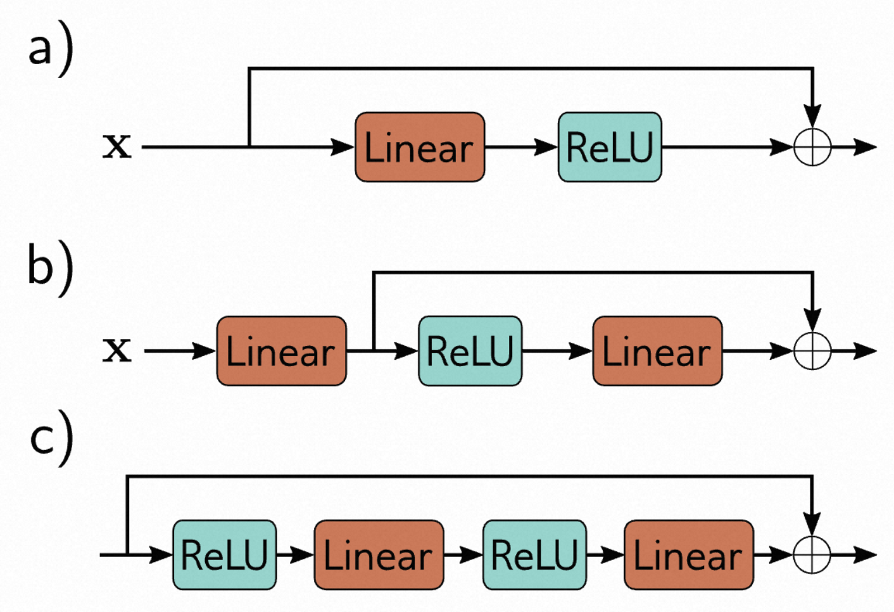

- [第11章 残差网络 - Residual networks](#第11章-残差网络---residual-networks)
  - [11.1 顺序处理 - Sequential processing](#111-顺序处理---sequential-processing)
    - [11.1.1 顺序处理的局限性 - Limitations of sequential processing](#1111-顺序处理的局限性---limitations-of-sequential-processing)
  - [11.2 残差连接和残差块 - Residual connections and residual blocks](#112-残差连接和残差块---residual-connections-and-residual-blocks)
    - [11.2.1 残差块中的操作顺序 - Order of operations in residual blocks](#1121-残差块中的操作顺序---order-of-operations-in-residual-blocks)
    - [11.2.2 更深的网络中的残差连接 - Deeper networks with residual connections](#1122-更深的网络中的残差连接---deeper-networks-with-residual-connections)
  - [11.3 残差网络中的梯度爆炸问题 - Exploding gradients in residual networks](#113-残差网络中的梯度爆炸问题---exploding-gradients-in-residual-networks)
  - [11.4 批量归一化 - Batch normalization](#114-批量归一化---batch-normalization)
    - [11.4.1 批归一化的成本与收益 - Costs and benefits of batch normalization](#1141-批归一化的成本与收益---costs-and-benefits-of-batch-normalization)
  - [11.5 常见的残差网络结构 - Common residual architectures](#115-常见的残差网络结构---common-residual-architectures)
    - [11.5.1 ResNet - ResNet](#1151-resnet---resnet)
    - [11.5.2 DenseNet - DenseNet](#1152-densenet---densenet)
    - [11.5.3 U-Net和Hourglass网络 - U-Nets and hourglass networks](#1153-u-net和hourglass网络---u-nets-and-hourglass-networks)
    - [11.6 为什么具有残差连接的网络表现如此出色？ - Why do nets with residual connections perform so well?](#116-为什么具有残差连接的网络表现如此出色---why-do-nets-with-residual-connections-perform-so-well)
  - [11.7 总结 - Summary](#117-总结---summary)
  - [11.8 注解 - Notes](#118-注解---notes)
  - [11.8 问题 - Problems](#118-问题---problems)

# 第11章 残差网络 - Residual networks

在前一章中，我们了解到随着卷积网络层数的增加，从8层（AlexNet）扩展到18层（VGG），图像分类的性能得到了提升。然而，在尝试构建更深层次的网络时，性能却出现了下降。

本章将介绍*残差块*的概念。在残差块中，每个网络层计算的是当前表示的加性变化，而不是直接进行转换。这种方法可以训练更深的网络，但在初始化时，激活幅值会呈指数级增长。为了解决这个问题，残差块采用了*批归一化*技术，对每一层的激活值进行重新中心化和重新缩放。

## 11.1 顺序处理 - Sequential processing

到目前为止，我们所见到的每个神经网络都是按照顺序依次处理数据的。每一层接收上一层的输出，并将结果传递给下一层（参见图[11.1]()）。例如，一个三层网络可以表示为以下形式：

$$
\begin{array}{rcl}\mathbf{h}_1&=&\mathbf{f}_1[\mathbf{x},\phi_1]\\\mathbf{h}_2&=&\mathbf{f}_2[\mathbf{h}_1,\phi_2]\\\mathbf{h}_3&=&\mathbf{f}_3[\mathbf{h}_2,\phi_3]\\\mathbf{y}&=&\mathbf{f}_4[\mathbf{h}_3,\phi_4],\end{array}
\tag{11.1}
$$

其中$h_{1}$、$h_{2}$和$h_{3}$表示中间隐藏层，$\mathbf x$是网络输入，$\mathbf y$是输出，而函数$\mathbf{f}_k[•, \phi_{k}]$则表示处理过程。
在标准神经网络中，每一层都由线性变换和激活函数组成。参数$ ϕ_{k} $包括线性变换的权重和偏置。而在卷积网络中，每一层由一组卷积运算和激活函数组成。参数包括卷积核和偏置。

> 图11.1展示了顺序处理的方式，它是标准神经网络的一种传递方式。该方式将每一层的输出直接传递给下一层。

由于处理是顺序的，我们可以将这个网络等价地看作一系列嵌套的函数：

$$
\mathbf{y} = \mathbf{f}_4\left[
    \mathbf{f}_3\left[
        \mathbf{f}_2\left[
            \mathbf{f}_1[\mathbf{x},ϕ_1]
            ,ϕ_2
        \right]
        ,ϕ_3
    \right]
    ,ϕ_4
\right]
\tag{11.2}
$$

### 11.1.1 顺序处理的局限性 - Limitations of sequential processing

从理论上说，我们可以添加任意多的层。正如我们在上一章中所看到的，给卷积网络添加更多的层确实提高了性能。例如，具有十八层的VGG网络（图[10.17]()）优于具有八层的AlexNet（图[10.16]()）。然而，当进一步添加层时，图像分类性能再次下降（图[11.2]()）。这一点令人惊讶，因为通常情况下，随着模型容量的增加，性能应该更好（图[8.10]()）。实际上，我们发现这种下降现象在训练集和测试集上都存在，这意味着问题出现在训练更深的网络上，而不是深度网络本身无法泛化。

> 图11.2 添加更多的卷积层时性能下降
>
> - a) 在CIFAR-10数据集的测试集上，一个由20层卷积网络组成的模型优于一个由56层全连接神经网络组成的模型（[Krizhevsky & Hinton], [2009]()）。
> - b) 这个现象在训练集上同样存在，这表明问题出现在训练原始网络时，而不是在无法在新数据上进行泛化。参考文献[He et al. , 2016a]()。

这种现象目前还没有完全被理解。有一种猜测是，当我们在网络的早期层修改参数时，在初始化时，损失的梯度会以一种不可预测的方式改变。通过适当地初始化权重（参见第7.5节），损失相对于这些参数的梯度将会是合理的（即没有爆炸或消失的梯度）。然而，导数的假设是参数的变化是无限小的，而实际的优化算法使用的步长是有限的。因此，任何合理的步长选择都可能会导致算法移动到一个完全不同且无关的梯度的地方。损失曲面看起来像是一系列微小的山脉，而不是一个易于下降的单一平滑结构。因此，当损失函数的梯度变化较慢时，算法无法像在损失函数的梯度变化较快时那样取得进展。

这项研究发现，对于具有单一输入和输出的网络梯度而言，存在一种经验性观察来支持这个猜想。首先，对于浅层网络来说，即使改变输入，输出相对于输入的梯度变化速度较慢（[图11.3a]()）。然而，对于深层网络来说，即使输入微小变化，梯度完全不同（[图11.3b]()）。这种现象可以通过梯度的自相关函数来描述（[图11.3c]()）。对于浅层网络来说，相邻的梯度之间存在相关性，但是对于深层网络来说，这种相关性迅速减弱，最终趋近于零。这种现象被称为“破碎梯度”。

> 图11.3 展示了破碎的梯度现象。
>
>- a) 考虑一个浅层网络，其中有200个隐藏单元，并且使用Glorot初始化（即没有乘以2的He初始化）来初始化权重和偏置。对于标量网络输出$y$对标量输入$x$的梯度$∂y/∂x$，随着输入$x$的变化而变化得相对缓慢。
>- b) 然而，当网络变得更深，比如有24层，每层200个隐藏单元时，这个梯度变化得非常快且不可预测。
>- c) 梯度的自相关函数显示，对于深度网络来说，附近的梯度变得不相关（自相关接近零）。这种 *破碎梯度* 现象可能解释了为什么训练深度网络很困难。梯度下降算法依赖于损失曲面相对平滑，因此每次更新步骤前后的梯度应该是相关的。引自 [Balduzzi 等人，2017]()。

破碎梯度可能是因为随着网络变得更深，早期网络层的变化会以越来越复杂的方式修改输出。在方程[11.1]()中，输出$y$相对于网络的第一层$\mathbf{f}_{1}$的导数为：

$$
\frac{\partial\mathbf{y}}{\partial\mathbf{f}_1}=\frac{\partial\mathbf{f}_4}{\partial\mathbf{f}_3}\frac{\partial\mathbf{f}_3}{\partial\mathbf{f}_2}\frac{\partial\mathbf{f}_2}{\partial\mathbf{f}_1}\tag{11.3}
$$

## 11.2 残差连接和残差块 - Residual connections and residual blocks

**残差连接**或**跳跃连接**是计算路径中的一个分支，它将每个网络层的输入 $\mathbf{f}[•]$ 加到输出中（图[11.4a]()）。与方程[11.1]()类似，残差网络的定义如下：

$$
\begin{aligned}
\mathbf{h}_1 &= \mathbf{x} + \mathbf{f}_1[\mathbf{x},\phi_1] \\
\mathbf{h}_2 &= \mathbf{h}_1 + \mathbf{f}_2[\mathbf{h}_1,\phi_2] \\
\mathbf{h}_3 &= \mathbf{h}_2 + \mathbf{f}_3[\mathbf{h}_2,\phi_3] \\
\mathbf{y} &= \mathbf{h}_3 + \mathbf{f}_4[\mathbf{h}_3,\phi_4]
\end{aligned}
\tag{11.4}
$$

其中，每行右侧的第一项是残差连接。每个函数 $\mathbf{f}_k$ 学习当前表示的加性变化。因此，它们的输出大小必须与输入相同。输入和经过处理的输出的加性组合被称为**残差块**或**残差层**。
再来，我们可以通过引入一个中间变量$ \mathbf h_{k} $来简化这个过程，并将其写成一个单一的函数：

$$
\begin{aligned}
\mathbf{y}=\mathbf{x} & +\mathbf{~f}_1[\mathbf{x}]  \\
&+\text{ f}_2[\mathbf{x}+\mathbf{f}_1[\mathbf{x}]] \\
&+\mathbf{f}_3\bigg[\mathbf{x}+\mathbf{f}_1[\mathbf{x}]+\mathbf{f}_2\big[\mathbf{x}+\mathbf{f}_1[\mathbf{x}]\big]\bigg] \\
&+\mathbf{f}_{4}\bigg[\mathbf{x}+\mathbf{f}_{1}[\mathbf{x}]+\mathbf{f}_{2}\big[\mathbf{x}+\mathbf{f}_{1}[\mathbf{x}]\big]+\mathbf{f}_{3}\bigg[\mathbf{x}+\mathbf{f}_{1}[\mathbf{x}]+\mathbf{f}_{2}\big[\mathbf{x}+\mathbf{f}_{1}[\mathbf{x}]\big]\bigg]\bigg],
\end{aligned}
\tag{11.5}
$$

为了更清楚地表达，我们省略了参数$ ϕ_• $。我们可以将这个方程看作是将网络“展开”（如图所示 [11.4b]()）。可以看到，最终的网络输出是输入和四个较小网络输出的和，对应于方程的每一行；一个解释是，残差连接将原始网络转变为这些较小网络的集合，它们的输出求和以得到最终的结果。
在方程[11.3]()和[11.6]()中，我们使用了符号重载来定义 $\mathbf f_{k}$ 作为函数 $\mathbf f_k[•]$ 的输出。

> 图11.4 展示了残差连接。
>
> - a) 每个函数 $\mathbf f_k[\mathbf x, ϕ_{k}]$ 的输出被添加到其输入中，通过一条被称为残差连接或跳跃连接的并行计算路径进行传递。因此，该函数计算了对表示的加性改变。
> - b) 分解网络方程后，我们发现输出由输入和四个较小的网络组成（分别对应于白色、橙色、灰色和青色，在方程[11.5]中有提及）。我们可以将这个输出看作是一个网络的集合。此外，青色网络的输出本身是另一个集合的一个变换 $\mathbf f_4[•, ϕ_4]$，以此类推。或者，我们可以将网络视为计算图中16个不同路径的组合。一个示例是从输入 $\mathbf x$ 到输出 $\mathbf y$ 的虚线路径，在图(a)和图(b)中是相同的。

关于这个残差网络，我们可以用另一种方式来理解它，即将其看作是由十六条不同长度的路径从输入到输出的组合而成。举例来说，第一个函数 $\mathbf f_1[\mathbf x]$ 出现在这十六个路径中的八个位置，包括作为直接加法项（即路径长度为一）。根据方程式 [11.3]()，我们可以得到相应的导数表达式如下：

$$
\frac{\partial\mathbf{y}}{\partial\mathbf{f}_1}=\mathbf{I}+\frac{\partial\mathbf{f}_2}{\partial\mathbf{f}_1}+\left(\frac{\partial\mathbf{f}_3}{\partial\mathbf{f}_1}+\frac{\partial\mathbf{f}_3}{\partial\mathbf{f}_2}\frac{\partial\mathbf{f}_2}{\partial\mathbf{f}_1}\right)+\left(\frac{\partial\mathbf{f}_4}{\partial\mathbf{f}_1}+\frac{\partial\mathbf{f}_4}{\partial\mathbf{f}_2}\frac{\partial\mathbf{f}_2}{\partial\mathbf{f}_1}+\frac{\partial\mathbf{f}_4}{\partial\mathbf{f}_3}\frac{\partial\mathbf{f}_3}{\partial\mathbf{f}_1}+\frac{\partial\mathbf{f}_4}{\partial\mathbf{f}_3}\frac{\partial\mathbf{f}_3}{\partial\mathbf{f}_2}\frac{\partial\mathbf{f}_2}{\partial\mathbf{f}_1}\right)
\tag{11.6}
$$

这里每个路径对应一个项，右侧的恒等项表示第一层的参数 $ ϕ_{1} $ 的变化直接影响网络输出 $ \mathbf y $ 的变化。它们也通过其他不同长度的导数链间接地产生影响。一般来说，较短路径的梯度更容易控制。由于恒等项和各种较短导数链都对每一层的导数产生影响，具有残差连接的网络受到的梯度破裂问题较少。

### 11.2.1 残差块中的操作顺序 - Order of operations in residual blocks

迄今为止，我们假设加性函数 $\mathbf f[x]$ 可以是任何有效的网络层，如全连接或卷积层。从技术上讲，这是正确的，但操作的顺序至关重要。这些函数必须包括一个非线性激活函数，例如ReLU。否则，整个网络将变成线性的。然而，在典型的网络层中（见图[11.5a]()），ReLU函数位于最后，这意味着输出值是非负的。如果我们遵循这个约定，那么每个残差块只会增加输入值。

因此，在一般情况下，我们会改变操作的顺序，首先应用激活函数，然后进行线性变换（如图[11.5b]()所示）。在残差块中，有时会有多层处理（如图[11.5c]()所示），但通常最后一层是线性变换。此外，我们需要注意到，如果初始网络输入为负数，并且使用ReLU操作，那么这些块将不起作用，因为ReLU会将整个信号剪切为零。因此，通常情况下，我们会从线性变换开始构建网络，而不是从残差块开始，如图[11.5b]()所示。

> 图11.5 剩余块中的操作顺序。
>
>- a) 一般来说，线性变换或卷积之后跟随ReLU非线性意味着每个剩余块只能增加非负量。
> b) 通过采用逆序方法，我们可以同时添加正数和负数。然而，如果输入全是负数，我们就需要在网络的起始位置添加一个线性变换。
> c) 在实际应用中，一个残差块通常由多个网络层组成。
>

### 11.2.2 更深的网络中的残差连接 - Deeper networks with residual connections

通过添加残差连接，我们可以在不降低性能的情况下增加网络的深度至两倍。然而，我们希望进一步提高网络的深度。为了理解为什么不能随意增加残差连接的深度，我们需要考虑前向传播中激活值的方差变化以及反向传播中梯度大小的变化。

## 11.3 残差网络中的梯度爆炸问题 - Exploding gradients in residual networks

在第[7.5节](#parameter-initialization)中，我们已经了解到参数初始化的重要性。如果没有正确初始化，反向传播过程中的中间值可能会呈指数级增长或减少。同样，在进行网络的反向传播时，梯度可能会出现爆炸或消失的问题。

因此，为了确保网络的各个层之间的激活和梯度方差保持不变，我们需要对网络参数进行初始化。对于使用ReLU激活函数的情况，我们将偏置项β初始化为零，并选择均值为零、方差为 $2/D_h$ 的正态分布来初始化权重项 $Ω$，其中 $D_h$ 是前一层的隐藏单元数。

接下来，让我们来考虑一下残差网络。由于每个层都直接对网络输出有贡献，因此我们不需要担心中间值或梯度随着网络深度增加而消失（参见公式[11.5]和图[11.4b]）。然而，即使我们在残差块中使用了He初始化，正向传播中的值也会随着网络深度的增加而指数级增加。

为了解释这个现象，我们可以考虑将处理结果添加到残差块中，然后将其与输入相加。每个分支都有一些不相关的变异性。因此，当我们重新组合它们时，整体方差会增加。在使用ReLU激活函数和He初始化的情况下，每个块的处理不会改变期望方差。因此，当我们将其与输入重新组合时，方差会翻倍（见图11.6a()），并且随着残差块数量的增加呈指数增长。这限制了在前向传播过程中网络深度可能超过的浮点精度。类似的论证也适用于反向传播算法中的梯度反向传递。

> 图11.6显示了残差网络中方差的情况。
>
>- a) 在残差网络中，每个块的输入会与输出相加，这会导致方差在每一层都增加一倍。这种指数级增长的方差可以在图中的灰色数字中看到。为了确保在线性加ReLU层 $\mathbf f_{k}$ 之后预期的方差保持不变，我们需要对残差网络进行初始化。
>- b) 一种方法是在每个残差块之间通过 $1/\sqrt{2}$ 对信号进行重新缩放。这样可以有效地控制方差的增长，使其保持在可接受的范围内。
>- c) 第二种方法是将批量归一化（BN）作为残差块的第一步，并将关联的偏移 $δ$ 初始化为零，缩放 $γ$ 初始化为一。这样可以确保每个层的输入具有单位方差，并且通过 He 初始化，输出方差也将为一。使用这种方法，方差随着残差块的数量线性增加。需要注意的是，在初始化阶段，网络的后续层由残差连接主导，因此接近于计算恒等式。这些方法的副作用是在初始化阶段网络的后续层更多地依赖于残差连接，而接近于计算恒等式。

因此，即使我们使用了He初始化的方法，残差网络仍然存在前向传播不稳定和梯度爆炸的问题。为了解决这个问题，可以采用He初始化的方法，并且将每个残差块的组合输出乘以$1/\sqrt{2}$来抵消其加倍效果（见图11.6b）。然而，更常用的方法是使用批量归一化。

## 11.4 批量归一化 - Batch normalization

批量归一化（BatchNorm），也被称为Batch Normalization，对每个激活值 $h$ 进行平移和重新缩放，以使其在训练过程中的每个小批次（Batch）上的均值和方差成为学习到的值。假设我们有一个批次 $\mathcal{B}$，其中包含了 $|\mathcal{B}|$ 个元素。首先，我们需要计算批次激活的均值 $m_h$ 和标准差 $s_h$，计算公式如下：

$$
\begin{array}{rcl}m_h&=&\frac1{|\mathcal{B}|}\sum_{i\in\mathcal{B}}h_i\\
\\
s_h&=&\sqrt{\frac1{|\mathcal{B}|}\sum_{i\in\mathcal{B}}(h_i-m_h)^2},\end{array}
\tag{11.7}
$$

这里的 $m_h$ 和 $s_h$ 都是标量。接下来，我们使用这些统计数据来归一化批次激活值，使其均值为零，方差为一。具体操作如下：

$$
h_i\leftarrow\frac{h_i-m_h}{s_h+\epsilon}\quad\quad\quad\forall i\in\mathcal{B},
\tag{11.8}
$$

其中 $ϵ$ 是一个很小的数，用于避免除以零的情况，特别是当 $h_{i}$ 在批次中的每个成员都相同且 $s_{h} = 0$ 时。

最后，我们对归一化的激活值进行缩放和平移操作，分别乘以 $γ$ 并加上 $δ$，具体操作如下：

$$
h_i\leftarrow\gamma h_i+\delta\quad\quad\quad\quad\forall i\in\mathcal{B}.
\tag{11.9}
$$

经过这个操作后，批次中的激活值具有平均值 $δ$ 和标准差 $γ$。这两个量都会在训练过程中进行学习。

批归一化是一种独立应用于每个隐藏单元的技术。在标准神经网络中，如果网络有 $ K $ 层，每层有 $ D $ 个隐藏单元，那么就会有 $ KD $ 个学习到的偏移量 $ δ $ 和 $ KD $ 个学习到的缩放因子 $ γ $。而在卷积网络中，归一化统计信息是基于批次和空间位置进行计算的。如果网络有 $ K $ 层，每层有 $ C $ 个通道，那么就会有 $ KC $ 个偏移量和 $ KC $ 个缩放因子。然而，在测试时，我们无法收集到用于计算统计信息的批次数据。为了解决这个问题，统计量 $ m_{h} $ 和 $ s_{h} $ 在整个训练数据集上计算，而不仅仅是一个批次，并且在最终的网络中被固定下来。

### 11.4.1 批归一化的成本与收益 - Costs and benefits of batch normalization

批归一化技术使得神经网络在重新缩放权重和偏差时具有不变性，这些权重和偏差会影响到每个激活函数。如果权重和偏差被放大了，激活函数的输出也会相应地放大，导致估计标准差 $s_h$ 增加。然而，批归一化的补偿机制使得这些变化不会对网络的性能造成负面影响。批归一化针对每个隐藏单元独立进行补偿，因此会产生许多不同的权重和偏差组合，但它们会产生相同的效果。此外，批归一化还引入了两个额外的参数 $γ$ 和 $δ$ 到每个隐藏单元中，使得模型的规模稍微增大。因此，批归一化在权重参数上引入了一些冗余，但同时也通过这些额外的参数来弥补这种冗余。尽管这可能效率不高，但批归一化提供了几个重要的好处。

**稳定的前向传播：** 如果我们将偏差 $ δ $ 初始化为零，将缩放因子 $ γ $ 初始化为一，那么每个输出激活的方差都将是单位方差。在普通的神经网络中，这确保了初始时前向传播过程中的方差保持稳定。然而，在残差网络中，由于每一层都会增加输入的变化来源，方差仍然需要增加。然而，方差的增加是线性的，每个残差块仅会增加一个单位的方差到已有方差中（参见图[11.6c]()）。

这意味着在初始化时，后面的层对总体变化的影响要比前面的层小。在训练初期，网络实际上变得不那么深，因为后面的层趋近于计算恒等映射。随着训练的进行，网络可以逐渐增加后面层的缩放因子 $ γ $，从而控制自身的有效深度。

**更高的学习率：** 实证研究和理论都表明，批量归一化可以使损失曲面及其梯度变得更平滑，从而减少碎片化梯度的问题。这意味着我们可以使用更高的学习率，因为曲面更可预测。正如我们在9.2节中所见，较高的学习率可以改善测试性能。

**正则化：** 此外，在第9章中我们发现，引入噪声到训练过程可以提升模型的泛化能力。批量归一化会引入噪声，因为归一化依赖于批次统计信息。激活函数对于给定的训练样本会在每个训练迭代中以稍微不同的方式进行调整，通过与批次中其他成员的归一化。

## 11.5 常见的残差网络结构 - Common residual architectures

残差连接已经成为深度学习流水线中的标准组件。本节将回顾一些将残差连接纳入结构的著名网络架构。

### 11.5.1 ResNet - ResNet

在卷积神经网络中，引入了一种创新概念，被命名为残差块，首次应用于图像分类任务。基于这一概念构建的网络被称为残差网络，简称ResNet。在ResNet中，每个残差块由批归一化操作、ReLU激活函数和卷积层组成。这些操作按照相同的顺序重复进行，并将结果与输入相加（如图[11.7a]()所示）。实验证明，在图像分类任务中，这种操作顺序表现出色。

当网络非常深时，参数的数量可能变得非常庞大。为了更有效地利用参数，引入了一种称为瓶颈残差块的结构，它由三个卷积层组成。第一个卷积层使用大小为1×1的卷积核来降低通道数。第二个卷积层使用常规的3×3卷积核，而第三个卷积层再次使用大小为1×1的卷积核将通道数增加到原始数量（如图[11.7b]()所示）。通过这种方式，我们可以用更少的参数来整合一个3×3的像素区域中的信息。

> 图11.7 ResNet块。
>
> - a) 在ResNet架构中，标准块由批量归一化操作，激活函数和一个3×3的卷积层组成，并且这个序列被重复多次。
> - b) 瓶颈ResNet块也是在3×3的区域内整合信息，但使用的参数更少。它包含三个卷积操作。第一个1×1的卷积操作用于减少通道数。第二个3×3的卷积操作应用于较小的表示。最后一个1×1的卷积操作再次增加通道数，以便可以将其与输入相加。

ResNet-200模型（见图11.8）是用于在ImageNet数据库（见图10.15）上进行图像分类的模型，它包含200个层。这个模型的结构与AlexNet和VGG类似，但是使用了瓶颈残差块而不是普通的卷积层。与AlexNet和VGG一样，这些块会周期性地降低空间分辨率并增加通道数量。为了降低分辨率，我们使用步幅为2的卷积进行降采样操作。通道数量可以通过在表示中添加零或使用额外的1×1卷积进行增加。在网络的开头，我们使用一个7×7的卷积层，并进行降采样操作。最后，一个全连接层将块映射到一个长度为1000的向量。这个向量经过softmax层处理，生成类别概率。

> 图11.8 展示了ResNet-200模型的结构。
> 首先，我们使用步长为2的标准7×7卷积层进行卷积操作，然后进行MaxPool操作。
> 接下来是一系列的瓶颈残差块（括号中的数字表示经过第一个1×1卷积之后的通道数）。在这些块中，我们周期性地进行下采样，并相应地增加通道数。
> 最后，网络通过对所有空间位置进行平均池化，再经过一个全连接层进行预softmax激活。

在前五个正确类别的识别中，ResNet-200模型取得了引人注目的4.8%错误率，并且在正确识别正确类别方面达到了20.1%的准确率。相比之下，AlexNet（16.4%，38.1%）和VGG（6.8%，23.7%）的表现稍显逊色。ResNet-200成为了首批超越人类表现的网络之一，其在前五个猜测中的错误率仅为5.1%。虽然这个模型是在2016年设计的，已经有一段时间了，并不再是最先进的。最新的研究显示，在这一任务上表现最好的模型的错误率为9.0%（参见图[10.21]()）。值得注意的是，目前所有在图像分类任务中表现最佳的模型都是基于Transformer的（参见第[12]()章）。

### 11.5.2 DenseNet - DenseNet

DenseNet采用了一种不同的方法，即通过密集连接的方式将前一层的输出与当前层的输入相连接。这种连接方式的优点是可以增加表示的大小（每个密集块的输出特征图的通道数量会增加）。然而，我们可以通过一个可选的线性变换来映射回原始尺寸，这相当于在卷积网络中应用一个1×1卷积。这样的设计使得模型能够将表示相加、取加权和，或以更复杂的方式进行组合。

DenseNet架构通过拼接的方式将每一层的输入与之前所有层的输出进行拼接，形成一个新的表示。这种拼接后的表示被传递给下一层进行处理。这种拼接的方式使较早的层对输出的贡献更加直接，从而使损失函数的曲面更加合理。具体来说，每一层的输入都包含了之前所有层输出的拼接结果(参见图[11.9])，经过处理后形成新的表示，然后与之前的表示进行拼接，并传递给下一层。这种方式使得较早的层对输出的影响更加明显，从而提升了模型的性能。

> 图11.9 在密集连接网络（DenseNet）中，我们采用了残差连接的方式来连接较早层的输出和后续层。这种网络结构能够将输入的三通道图像转换为32通道的表示。将输入图像与其连接后，我们总共得到了35个通道。然后，我们将这个组合表示转换为另一个32通道的表示，并将前面的两个表示连接起来，总共得到了67个通道，以此类推。

在实际应用中，这种方法只适用于较小规模的网络层级，因为通道数量和需要处理的参数数量会逐渐增多。为了解决这个问题，在应用下一个3×3的卷积之前，我们可以通过使用一个1×1的卷积来减少通道数量。在卷积神经网络中，输入会定期进行下采样。由于不同尺寸的表示，跨下采样的连接变得没有意义。因此，在这一点上，连接的链条会被断开，并且由一个较小的表示开始一个新的链条。此外，在进行下采样时，可以应用另一个瓶颈1×1的卷积来进一步控制表示的大小。

这个网络在图像分类方面与ResNet模型具有竞争力（参见图[10.21]）；事实上，对于在一定参数数量范围内来说，它可能比ResNet模型表现得更好。这可能是因为它可以更灵活地复用较早层级的处理过程。

### 11.5.3 U-Net和Hourglass网络 - U-Nets and hourglass networks

在[10.5.3](#semantic-segmentation)节中，我们介绍了一种用于语义分割的网络，采用了编码器-解码器或沙漏结构。编码器通过多次下采样对图像进行处理，以增加感受野并整合来自整个图像的信息。然后解码器通过上采样将图像恢复到原始大小。最终输出是每个像素可能属于的物体类别的概率。然而，这种架构存在一个缺点，即网络中间的低分辨率表示需要保留高分辨率的细节信息，以便准确地生成最终结果。然而，如果在编码器和解码器之间使用残差连接来将编码器的表示传递给解码器，这样的操作就是不必要的。

***U-Net***（见图[11.10]()）是一种编码器-解码器结构的网络，通过将较早的特征与较后的特征进行连接来进行工作。最初的实现中使用了“valid”卷积，这意味着每次应用3×3卷积层时，空间尺寸会减小两个像素。因此，解码器中的上采样版本比编码器中的对应版本要小，需要在连接之前进行裁剪。后来的实现中采用了零填充，从而避免了裁剪的需要。需要注意的是，U-Net是一个完全卷积的网络，在训练之后可以用于处理*任意尺寸*的图像。

> 图11.10 展示了U-Net在HeLa细胞分割中的应用。U-Net采用了编码器-解码器的结构。
>
> - 首先，编码器进行下采样（橙色块），然后进行上采样（蓝色块）。
> - 编码器使用常规卷积，而解码器则使用转置卷积。
> - 为了保持信息的流畅传递，U-Net采用了残差连接的方法。这意味着编码器中每个尺度的最后一个表示将会与解码器中相同尺度的第一个表示进行连接（橙色箭头）。
> - 由于原始的U-Net使用了“valid”卷积，即使没有下采样，每层的大小也会略微减小。因此，在连接到解码器之前，编码器获得的表示会被裁剪（虚线方框）。
> 这个图表改编自[Ronneberger等人，2015年]()的研究。

U-Net最初是为了医学图像分割而设计的（见图11.11），但后来在计算机图形和视觉领域发现了许多其他的应用。与U-Net相似，*Hourglass网络*在跳跃连接中应用了更多的卷积层，并将结果添加到解码器中，而不是简单地连接它们。一系列这样的模型形成了一个*堆叠的Hourglass网络*，在局部和全局层面上交替考虑图像。这样的网络被用于姿势估计（见图11.12）。系统被训练来预测每个关节的“热点图”，并估计每个热点图的最大值位置。

> 图11.11 使用U-Net进行三维分割。
>
> - a) 通过扫描电子显微镜拍摄的由三个切片组成的小鼠皮层的三维体积。
> - b) 使用单个U-Net将体素分类为神经突起内部或外部，连接区域用不同颜色标识。

> 图11.12 展示了一个堆叠的沙漏网络用于姿态估计。
>
>- a) 该网络接受一个人的图像作为输入，并输出一组热图，其中每个关节对应一个热图。这个问题被设计为回归问题，目标是生成具有小的高亮区域的热图图像，这些区域标记了真实关节的位置。通过估计热图的峰值，可以确定每个关节的最终位置。
>- b) 这个架构包含初始的卷积层和残差层，后面是一系列的沙漏模块。
>- c) 每个沙漏模块都由一个编码器-解码器网络组成，类似于U-Net的结构。但是，在这个架构中，卷积层使用零填充，并且一些额外的处理是在残差连接中完成的。这些连接将处理后的表示加在一起，而不是将它们连接起来。每个蓝色的长方体本身就是一个瓶颈残差块（参见图[11.7b]()）。这个图示修改自Newell等人的论文（2016年）。

### 11.6 为什么具有残差连接的网络表现如此出色？ - Why do nets with residual connections perform so well?

残差网络之所以表现出色，原因在于它具备以下两个优势。

- 首先，它允许我们构建更深层次的网络架构，甚至可以达到1000层以上，而仍然能够有效地进行训练。
- 其次，它能够克服传统网络中的梯度消失和梯度爆炸问题。

尽管最初人们普遍认为残差连接的性能提升是由于增加了网络的深度，但有两个证据与这一观点相矛盾。

- 首先，增加网络深度并不总是能够带来性能的提升，而有可能导致性能下降。
- 其次，即使在相同的网络深度下，具有残差连接的网络仍然能够比传统网络表现更好。

因此，残差连接的优势并不仅仅来源于网络的深度，还与其独特的设计有关。这种设计可以有效地传递信息和梯度，避免了梯度消失和梯度爆炸问题，从而提高了网络的收敛速度和训练效果。这也是残差网络在图像分类等任务中表现出色的原因之一。

首先，相较于层数较深而通道较少的网络结构，残差网络的层数较浅，但每层的通道数较多，有时表现更优。换句话说，通过使用层数较少但通道数较多的网络结构，我们有时可以获得更好的性能。

其次，有证据表明，在深度网络中，梯度可能无法有效地传播到非常长的路径上（图[11.4b]()）。换句话说，一个非常深的网络可能更像是多个较浅网络的组合。

目前的观点认为，残差连接不仅可以帮助训练更深的网络，还可以为网络带来附加的价值。支持这一观点的理由是，在移除跳跃连接时，残差网络的损失曲面通常在最小值附近更加平滑和可预测（图[11.13]()）。这使得更容易学习到一个具有良好泛化性能的解决方案。

> 图11.13 展示了可视化的神经网络损失曲面。每张图都展示了在参数空间中随机梯度下降（SGD）找到的最小值周围的两个随机方向上的损失曲面，用于CIFAR-10数据集上的图像分类任务。这些方向经过归一化处理，以便进行比较。
>
>- a) 展示了一个由56层组成的残差网络。
>- b) 展示了同样的网络，但没有跳跃连接。
>
> 可以看到，具有跳跃连接的网络表面更加平滑，更容易学习，并且在参数微小错误的情况下更加鲁棒，因此可能具有更好的泛化能力。图片改编自Li等人（2018）。

## 11.7 总结 - Summary

当神经网络的深度无限增加时，图像分类的训练和测试性能会下降。这可能是因为网络中早期参数的损失梯度相对于更新步长的变化过快且不可预测。为了解决这个问题，我们引入了残差连接，即在原始输入上添加经过处理的表示。现在，每个层都直接对输出做出贡献，并且同时贡献于输出，因此不需要通过多个层传播梯度，并且损失曲面更加平滑。

在残差网络的前向传播过程中，我们不会遇到梯度消失的问题。然而，这种网络架构可能会导致激活值的方差呈指数级增加，同时也带来了梯度爆炸的问题。为了解决这些问题，我们通常会引入批量归一化（batch normalization）层。批量归一化通过计算每个批次的经验均值和方差，并使用学习到的参数进行移位和重新缩放，从而对激活值进行补偿。当这些参数被适当地初始化后，我们可以训练非常深的网络。

研究表明，残差连接和批量归一化使得损失函数的曲面更加平滑，从而可以使用更大的学习率。此外，批量统计数据的变化还提供了一种正则化的来源，进一步增强了网络的泛化能力。

残差块已经成功应用于卷积网络中。这些块的引入使得网络可以更深层次地进行训练，从而提高了图像分类的性能。除了传统的残差网络，还有一些变体被提出并应用于不同的任务中。例如，DenseNet架构将前一层的所有输出连接在一起，作为当前层的输入，以增强特征的流动性。还有U-Net，它在编码器-解码器模型中使用残差连接来实现更好的信息传递和细节保留。这些变体的引入为深度学习带来了更多的灵活性和性能提升的机会。

## 11.8 注解 - Notes

**残差连接：** 残差连接是由何凯明等人（2016a）引入的。他们构建了一个比VGG网络（图10.17）大8倍的152层网络，并在ImageNet分类任务上取得了最先进的性能。每个残差块由一个卷积层、批归一化、ReLU激活函数、第二个卷积层和第二个批归一化层组成。在将该块添加回主要表示之后，应用第二个ReLU函数。这个架构被称为ResNet v1。何凯明等人（2016b）研究了不同的残差架构变体，其中要么（i）在跳跃连接上也可以应用处理，要么（ii）在两个分支重新结合之后可以应用处理。他们得出结论，这两种处理都不是必需的，因此得到了图11.7所示的架构，有时被称为预激活残差块，即ResNet v2的骨干。他们训练了一个包含200层的网络，进一步改进了ImageNet分类任务的性能（见图11.8）。自那时以来，关于正则化、优化和数据增强的新方法已经被开发出来。Wightman等人（2021）利用这些方法提出了一个更现代的ResNet架构的训练流程。

**为什么残差连接有助于训练：** 残差网络的出现确实使得对深层网络的训练变得更加容易。这可能是因为它可以减少训练初期的梯度消失问题（Balduzzi等人，2017），并且在接近极小值的区域具有更加平滑的损失曲面，如图11.13所示（Li等人，2018b）。仅使用残差连接（没有批归一化）可以使网络的可训练深度增加约两倍（Sankararaman等人，2020）。通过使用批归一化，我们可以训练非常深的网络，但目前还不清楚深度对性能是否至关重要。Zagoruyko和Komodakis（2016）的研究表明，仅有16层的宽残差网络在图像分类方面超过了当时所有的残差网络。Orhan和Pitkow（2017）提出了另一种解释，即残差连接改善了学习过程中奇异点（损失曲面上的Hessian矩阵退化点）的消除。

**相关架构：** 残差连接是高速网络（Srivas等人，2015）的一种特殊形式。高速网络将计算分为两个分支，并通过加法重新组合。高速网络使用门控函数对两个分支的输入进行加权，权重取决于数据本身。而残差网络则以一种直接的方式将数据发送到两个分支。Xie等人（2017）引入了ResNeXt架构，在多个并行的卷积分支周围设置了残差连接。

**残差网络作为一种集合模型：** Veit等人（2016年）将残差网络描述为一种由多个较短网络组成的集合模型，并提出了“展开网络”的解释（见图11.4b）。他们通过从已经训练好的网络中删除层（即路径的子集）发现，这对性能只有适度的影响，从而证明了这种解释的有效性。相比之下，对于像VGG这样的纯顺序网络，删除一层会造成灾难性的影响。研究还展示了在不同长度路径上的梯度大小，并显示在较长的路径中梯度很容易消失。在由54个块组成的残差网络中，几乎所有的梯度更新都来自于长度为5到17个块的路径，尽管这些路径只占总路径的0.45%。因此，增加更多的块实际上是添加了更多的并行较短路径，而不是创建一个真正更深的网络。

**残差网络的正则化：** 对于权重进行L2正则化，在普通的网络和没有批归一化的残差网络中产生不同的效果。在普通网络中，L2正则化的目标是使该层的输出成为一个常数函数，该常数由偏置确定。而在残差网络中，L2正则化的目标是使残差块计算出一个由偏置确定的恒等映射加上一个常数。

对于残差网络，已经研发出了几种特定的正则化方法。这些方法包括ResDrop（Yamada等，2016年）、随机深度（Huang等，2016年）和RandomDrop（Yamada等，2019年）。这些方法通过在训练过程中随机丢弃残差块来对残差网络进行正则化。在RandomDrop方法中，丢弃块的倾向性由伯努利变量确定，其参数在训练过程中逐渐减小。在测试时，残差块以其期望概率被重新添加到网络中。这些方法实际上是dropout的一种变体，其中一个块中的所有隐藏单元同时被丢弃。在残差网络的多路径视图中（图11.4b），这些方法只是在每个训练步骤中删除一些路径。此外，Wu等人（2018b年）还开发了一种名为BlockDrop的方法，在运行时根据现有网络的分析结果决定使用哪些残差块，以提高推理的效率。

在残差块中，除了使用多条路径之外，还有其他正则化方法被提出。其中，Shake-shake（Gastaldi, 2017a, b）在前向传递和后向传递过程中随机重新加权路径。在前向传递中，可以将其视为对合成随机数据的加权，而在后向传递中，可以将其视为向训练过程中注入另一种形式的噪声。此外，ShakeDrop（Yamada等, 2019）引入了一个伯努利变量，用于决定每个块在训练步骤中是受到Shake-Shake的影响，还是像标准残差单元一样进行操作。

**批归一化：** 批归一化是由Ioffe和Szegedy（2015年）引入的一种方法，不仅适用于残差网络，还适用于其他网络结构。他们的实验结果显示，批归一化能够提高学习速度和收敛速度，并能够更有效地利用sigmoid激活函数（因为通过控制输出分布，避免了sigmoid函数饱和的问题）。Balduzzi等人（2017年）对具有ReLU函数初始化的深度网络中后续层的隐藏单元激活进行了研究。他们发现，许多隐藏单元在输入变化时都会保持激活或非激活状态，但通过批归一化可以减少这种不必要的趋势。

尽管批归一化在网络中有助于稳定信号的传播，但研究人员发现，在没有跳跃连接的ReLU网络中，它可能导致梯度爆炸的问题。每一层都会导致梯度幅值增加 $ \sqrt{π/ (π-1)} ≈ 1.21$。这个观点是由 Luther（2020）总结出来的。虽然残差网络可以被看作是不同长度路径的组合（如图11.4所示），但这种影响也存在于残差网络中。然而，根据推测，通过在网络的前向传播中消除 $ 2^K $ 的幅值增加，批归一化可能带来的好处超过了通过在反向传播中增加 $ 1.21^K $ 的梯度所可能造成的损害，因此总体而言，批归一化使训练更加稳定。

**批归一化化的变体：** 已经提出了几种批归一化的变体（见图[11.14]()）。批归一化是根据整个批次中收集到的统计数据分别对每个通道进行归一化。其中，Ghost批归一化或GhostNorm（Hoffer et al，2017）只使用部分批次来计算归一化统计数据，这样使得统计数据更加嘈杂，并且在批次大小非常大时增加了正则化的程度（见图[11.14b]()）。

在自然语言处理领域，当批量大小非常小或者批次内的波动非常大时，BatchNorm（批归一化）的统计数据可能变得不可靠。为了解决这个问题，Ioffe（2017）提出了*批次重标定*的方法。这种方法通过保持对批次统计数据的累积平均值，并对任何批次的归一化进行修改，以确保它更具代表性。

另一个与批归一化相关的问题是，在递归神经网络中（用于处理序列的网络，其中上一个输出被反馈作为附加输入，随着序列的推进而移动），批归一化并不适用。在这种情况下，统计数据必须在序列的每一步中存储，并且如果测试序列比训练序列更长，则不清楚应该如何处理。

第三个问题是，批归一化需要访问整个批次的数据。然而，在训练分布在多台机器上时，获得整个批次数据可能并不容易。
*层归一化*（LayerNorm）或称为层级归一化（Ba et al., 2016）通过对每个数据示例进行归一化来避免使用批次统计信息，并使用跨通道和空间位置收集的统计数据（图11.14c）。然而，每个通道仍然有单独的学习尺度γ和偏移δ。

*组归一化*（GroupNorm）或称为分组归一化（Wu & He, 2018）类似于层归一化，但将通道分成组，并分别计算每个组内通道和空间位置的统计数据（图11.14d）。同样，每个通道仍然有单独的尺度和偏移参数。

*实例归一化*（InstanceNorm）或称为实例级归一化（Ulyanov et al., 2016）将这一概念推到了极致，其中组的数量与通道的数量相同，因此每个通道都单独进行归一化（图11.14e），仅使用在空间位置上收集的统计数据。

Salimans & Kingma（2016）研究了对网络权重进行归一化而不是激活值，但这在经验上的成功较少。Teye等人（2018）引入了*蒙特卡洛批归一化*，可以对神经网络的预测提供有意义的不确定性估计。最近的研究（Lubana et al., 2021）对不同归一化方案的属性进行了比较。

> 图11.14展示了不同的归一化方案。
>
> - a) BatchNorm使用整个批次和空间位置收集的统计数据，对每个通道进行单独的调整。
> - b) Ghost BatchNorm则只从部分批次中计算这些统计数据，以增加多样性。
> - c) LayerNorm则根据每个批次成员、通道和空间位置分别收集的统计数据进行计算，同时保留了每个通道的独立学习缩放因子。
> - d) GroupNorm在每个通道组内进行归一化，同时保留了每个通道的独立比例因子和偏移参数。
> - e) InstanceNorm在每个通道内进行归一化，仅计算跨空间位置的统计数据。本图改编自Wu和He（2018年）的研究。

**BatchNorm的作用原理：** BatchNorm在控制残差网络（图[11.6c]()）的初始梯度方面起着重要作用。然而，BatchNorm提高性能的具体机制尚不清楚。[Ioffe & Szegedy, 2015]()的论文提出了减少由于前向传播更新前面层而导致输入分布的内部共变量转移问题的目标。然而，[Santurkar等人，2018]()的研究通过人为引发共变量转移的实验结果表明，在具有和不具有BatchNorm的网络中，性能是相同的，这对前述观点提供了支持。

受到这一发现的启发，研究者们开始探索另一种解释，即批归一化如何改善模型性能。他们进行了一系列实验证明，在VGG网络中引入批归一化后，损失函数及其梯度在梯度方向上的变化减小了。换句话说，损失曲面变得更加平滑且变化更加缓慢，因此可以使用更大的学习率。此外，他们还提供了理论证明，无论参数初始化如何，批归一化的网络都能更接近于全局最优解。对此，Bjorck等人认为批归一化改善了损失函数的特性，使得可以使用更大的学习率。

为什么批量归一化（BatchNorm）能够提高性能，还有其他的解释，包括减少调整学习率的重要性（Ioffe＆Szegedy，2015；Arora等，2018）。实际上，Li＆Arora（2019）的研究表明，使用指数增长的学习率调度与批量归一化是可行的。最终，这是因为批量归一化使网络对权重矩阵的尺度不变（有关直观可视化，请参见Huszár，2019）。

Hoffer等（2017）的研究发现，批量归一化具有正则化效果，这是由于批次的随机组合引起的统计波动。他们提出了一种使用“幽灵批次大小”的方法，其中均值和标准差的统计信息是从批次的子集计算的。现在可以使用较大的批次而不会失去较小批次中额外噪声的正则化效果。Luo等（2018）进行了批量归一化正则化效果的研究。

**替代方案：** 尽管批量归一化（BatchNorm）被广泛应用于训练深度残差网络，但并非必选方案。实际上，还有其他方法可以使损失曲面更易处理。Balduzzi等人（2017）提出了一种名为 $\sqrt{1/2}$ 缩放方法的技术，他们认为该方法可以防止梯度爆炸问题，但无法解决梯度消失的问题。

其他研究还尝试对残差块的函数输出进行重新缩放，并将其与输入相加。例如，De和Smith（2020）提出了一种名为SkipInit的方法，在每个残差分支的末尾添加了一个可学习的标量乘法器。他们建议将该乘法器初始化为小于 $\sqrt{1/K}$ 的值，其中$K$是残差块的数量。在实际应用中，他们建议将该乘法器初始化为零。类似地，Hayou等人（2021）提出了一种稳定的ResNet方法，在将第$k$个残差块的函数输出添加到主分支之前，通过常数$λ_{k}$对其进行重新缩放。他们证明，在网络宽度趋于无穷的极限情况下，第一层权重的期望梯度范数受到了对缩放因子 $λ_{k}$ 平方和的下界约束。他们将这些缩放因子设置为常数$\sqrt{1/K}$，其中$K$是残差块的数量，并展示了可以训练具有高达1000个块的网络的可能性。

2019年，张等人提出了一种名为*FixUp*的方法，用于初始化深度残差网络。该方法采用了He归一化初始化每一层，但将每个残差块的最后一个线性/卷积层设为零。这种做法的结果是，初始的正向传播是稳定的（因为每个残差块没有贡献），并且反向传播中的梯度不会爆炸（由于相同的原因）。此外，他们通过重新调整分支的方式，使得参数的总预期变化的大小保持恒定，不会受到残差块数量的影响。

然而，尽管这些方法可以用于训练深度残差网络，但通常无法达到与使用BatchNorm时相同的测试性能。这可能是因为它们没有利用批次统计噪声引发的正则化。为了解决这个问题，2020年，德和史密斯对这些方法进行了修改，引入了dropout来进行正则化，从而帮助缩小这一差距。

**DenseNet 和 U-Net：** DenseNet 是由黄等人在2017年首次提出的，而U-Net是由Ronneberger等人在2015年开发的，stacked hourglass networks 则是由Newell等人在2016年提出的。在这些架构中，U-Net已经被广泛应用。Çiçek等人在2016年提出了3D U-Net，Milletari等人在2016年提出了V-Net，这两种方法将U-Net扩展到了处理3D数据。Zhou等人在2018年结合了DenseNet和U-Net的思想，在一个架构中同时使用了下采样和重新上采样图像，并重复使用中间表示。U-Net在医学图像分割中得到了广泛应用（详见Siddique等人，2021的综述）。然而，它们也被应用于其他领域，包括深度估计（Garg等人，2016），语义分割（Iglovikov和Shvets，2018），修复（Zeng等人，2019），PAN 影像融合（Yao等人，2018），以及图像到图像的转换（Isola等人，2017）。U-Net也是扩散模型（第18章）中的关键组件。

## 11.8 问题 - Problems

**问题 11.1** 如何从方程[11.4]()推导出方程[11.5]()？

**问题 11.2** 如果有(i) 三个残差块和(ii) 五个残差块，展开图[11.4a]()将产生多少条长度为零、一、二、三和四的路径？推导出关于残差块个数$K$的规则。

**问题 11.3** 如何证明方程[11.5]()中网络对第一层$\mathbf{f}_1[x]$的导数由方程[11.6]()给出？

**问题 11.4** ∗ 为什么图[11.6a]()中残差块的两个分支的值是不相关的？证明不相关变量的和的方差等于它们各自方差的和。
**问题11.5** 给定一组标量值$\{z_i\}^{I}_{i=1}$，批归一化的前向传播包括以下操作（见图[11.15]()）：
$$
\begin{aligned}
&f_{1} =\mathbb{E}[z_i] && f_5 &&&& =\sqrt{f_4+\epsilon}  \\
&f_{2i} =x_i-f_1 && f_{6} &&&& =1/f_5  \\
&f_{3i} =f_{2i}^2 && f_{7i} &&&& =f_{2i}\times f_6  \\
&f_4 =\mathbb{E}[f_{3i}] && z_{i}^{\prime} &&&& =f_{7i}\times\gamma+\delta,
\end{aligned}
\tag{11.10}
$$

> 图11.15 批归一化的计算图（参见问题[11.5]()）。

其中$\mathbb{E}[z_i]=\frac{1}{I}\sum_iz_i $。请编写Python代码实现前向传播。现在推导反向传播的算法。通过反向计算图，计算导数，生成一组操作，计算批中每个元素$z_i$的$∂_{z_i}^′/∂_{z_i}$。然后编写Python代码实现反向传播。

**问题11.6** 考虑一个全连接神经网络，它有一个输入，一个输出和十个隐藏层，每个隐藏层包含二十个隐藏单元。这个网络有多少个参数？如果我们在每个线性变换和ReLU之间添加批量归一化操作，它将有多少个参数？

**问题11.7** 考虑对图[11.7a]()中的卷积层的权重应用L2正则化惩罚，但不对接下来的BatchNorm层的缩放参数应用正则化。随着训练的进行，你认为会发生什么？

**问题11.8** 考虑一个卷积残差块，其中包含一个批量归一化操作，接着是一个ReLU激活函数，然后是一个3×3的卷积层。如果输入和输出都有512个通道，需要多少个参数来定义这个块？现在考虑一个瓶颈残差块，其中包含三个批量归一化/ReLU/卷积序列。第一个序列使用1×1的卷积将通道数量从512减少到128。第二个序列使用3×3的卷积，输入和输出通道数相同。第三个序列使用1×1的卷积将通道数量从128增加到512（参见图[11.7b]()）。需要多少个参数来定义这个块？

**问题11.9** U-Net是完全卷积的，可以在训练之后对任意大小的图像进行运行。为什么我们不使用一组任意大小的图像进行训练？
