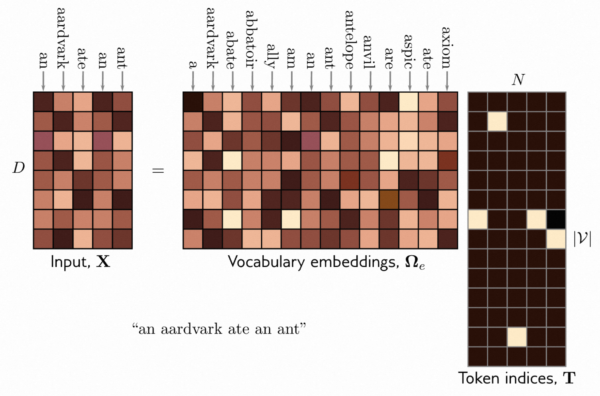

[译]第12章 Transformers 《理解深度学习 - Understanding Deep Learning》

本文是基于Simon J.D. Prince 的新书《Understanding Deep Learning》翻译而来；

* 原书介绍、原书（英文）下载、译文进展 以及 译文内容请戳 ↓↓↓
* [ \[译\]《理解深度学习 - Understanding Deep Learning 》 - 目录&前言 - ATA (atatech.org)](https://ata.atatech.org/articles/11020138829)

----

↓↓↓ 以下正文↓↓↓
----

* [第12章 Transformers](#第12章-transformers)
  * [12.1 处理文本数据 - Processing text data](#121-处理文本数据---processing-text-data)
  * [12.2 点积自注意力 - Dot-product self-attention](#122-点积自注意力---dot-product-self-attention)
    * [12.2.1 计算和加权数值 - Computing and weighting values](#1221-计算和加权数值---computing-and-weighting-values)
    * [12.2.2 计算注意力权重 - Computing attention weights](#1222-计算注意力权重---computing-attention-weights)
    * [12.2.3 自注意力总结 - Self-attention summary](#1223-自注意力总结---self-attention-summary)
    * [12.2.4 矩阵形式 - Matrix form](#1224-矩阵形式---matrix-form)
  * [12.3 将点积自注意力进行扩展 - Extensions to dot-product self-attention](#123-将点积自注意力进行扩展---extensions-to-dot-product-self-attention)
    * [12.3.1 位置编码 - Positional encoding](#1231-位置编码---positional-encoding)
    * [12.3.2 缩放点积自注意力 - Scaled dot product self-attention](#1232-缩放点积自注意力---scaled-dot-product-self-attention)
    * [12.3.3 多头注意力 - Multiple heads](#1233-多头注意力---multiple-heads)
  * [12.4 变换器 - Transformers](#124-变换器---transformers)
  * [12.5 自然语言处理中的Transformer - Transformers for natural language processing](#125-自然语言处理中的transformer---transformers-for-natural-language-processing)
    * [12.5.1 分词 - Tokenization](#1251-分词---tokenization)
    * [12.5.2 嵌入 - Embeddings](#1252-嵌入---embeddings)
    * [12.5.3 Transformer 模型 - Transformer model](#1253-transformer-模型---transformer-model)
  * [12.6 编码器模型示例：BERT - Encoder model example: BERT](#126-编码器模型示例bert---encoder-model-example-bert)
    * [12.6.1 预训练 - Pre-training](#1261-预训练---pre-training)
    * [12.6.2 微调 - Fine-tuning](#1262-微调---fine-tuning)
  * [12.7 解码器模型示例：GPT3 - Decoder model example: GPT3](#127-解码器模型示例gpt3---decoder-model-example-gpt3)
    * [12.7.1 语言模型 - Language modeling](#1271-语言模型---language-modeling)
    * [12.7.2 掩码自注意力 - Masked self-attention](#1272-掩码自注意力---masked-self-attention)
    * [12.7.3 从解码器生成文本 - Generating text from a decoder](#1273-从解码器生成文本---generating-text-from-a-decoder)
    * [12.7.4 GPT3和少样本学习 - GPT3 and few-shot learning](#1274-gpt3和少样本学习---gpt3-and-few-shot-learning)
  * [12.8 编码器-解码器模型示例：机器翻译 - Encoder-decoder model example: machine translation](#128-编码器-解码器模型示例机器翻译---encoder-decoder-model-example-machine-translation)
  * [12.9 长序列的变形器 - Transformers for long sequences](#129-长序列的变形器---transformers-for-long-sequences)
  * [12.10 图像的Transformer - Transformers for images](#1210-图像的transformer---transformers-for-images)
    * [12.10.1 ImageGPT - ImageGPT](#12101-imagegpt---imagegpt)
    * [12.10.2 视觉变压器（ViT） - Vision Transformer (ViT)](#12102-视觉变压器vit---vision-transformer-vit)
    * [12.10.3 多尺度视觉变换器 - Multi-scale vision transformers](#12103-多尺度视觉变换器---multi-scale-vision-transformers)
  * [12.11 总结 - Summary](#1211-总结---summary)
  * [12.12 笔记 - Notes](#1212-笔记---notes)
  * [问题](#问题)

# 第12章 Transformers

第[10]()章介绍了卷积网络，它专门用于处理在规则网格上的数据。它特别适用于处理图像，图像具有非常多的输入变量，不适合使用全连接网络。卷积网络的每一层都采用参数共享，以便在图像的每个位置上以类似的方式处理局部图像块。

这一章介绍了Transformer。最初，Transformer是用于处理自然语言处理（NLP）问题的，它的网络输入是表示单词或单词片段的高维嵌入序列。语言数据集与图像数据集有一些类似，它们输入变量的规模都可能非常大，而且在每个位置上的统计数据也是相似的，例如，对于同一个单词“Dog”，在文本语料库的每个可能位置都重新学习其含义是不明智的。与图像不同的是，语言数据集的复杂之处在于文本序列的长度不同，而且没有简单的方法来调整它们的大小。

## 12.1 处理文本数据 - Processing text data

为了说明Transformer的用途，我们可以思考下面的例子：

> 原文： The restaurant refused to serve me a ham sandwich because it only cooks vegetarian food. In the end, they just gave me two slices of bread. Their ambiance was just as good as the food and service.
> 译文：这家餐厅拒绝给我提供火腿三明治，因为他们只做素食。最后，他们只给了我两片面包。他们的氛围与食物和服务一样好。

假设我们要设计一个网络，将这段文本处理成适合下游任务的表示形式。例如，用它来判断这个评论是积极的还是消极的(分类问题)；或回答一些问题，比如“这家餐厅有没有提供牛排？”

我们立刻可以得出三个观察结论。

* 首先，编码后的输入可能会非常大。在这种情况下，37个词中的每一个都可能会由长度为1024的嵌入向量表示，所以即使对于这段小的文本，编码后的输入长度也会达到 $ 37×1024 = 37888 $ 。而在实际使用场景中，一段真实的文本可能有数百甚至数千个词，对于这样的输入规模，如果我们用全连接神经网络去实现，是不切实际的。
* 其次，自然语言处理问题的一个显著特征是每个输入（一个或多个句子）的长度都不同；因此，如何应用全连接网络甚至都不明确。这个观察结果表明，网络应该在不同的输入位置共享单词的参数，类似于卷积网络在不同的图像位置共享参数。
* 第三，语言是模糊的；仅从语法上来看，很难确定代词“it”指的是餐厅还是火腿三明治。为了理解文本，词语“it”应该与词语“restaurant”有某种连接。在Transformer的术语中，前者应该对后者进行*注意力*计算。这意味着词语之间必须存在连接，并且这些连接的强度将取决于词语本身。此外，这些连接需要跨越大片的文本范围。例如，最后一句中的词语“their”也指的是“restaurant”。

## 12.2 点积自注意力 - Dot-product self-attention

综上所述，一个用于处理文本的模型应该

* （i）使用参数共享来处理不同长度的输入段落，
* （ii）包含依赖于词语本身的单词表示之间的连接。

Transformer通过利用 *点积自注意力* 来实现这两个属性。 标准的神经网络层 $ \mathbf f [\mathbf x] $ 接受一个 $ D×1 $ 的输入 $ \mathbf x $ ，并应用线性变换后跟一个激活函数，如ReLU，因此有：

$$
\mathrm{f[x]=ReLU[\beta+\Omega x],}
 \tag{12.1}
$$

其中 $ β $ 表示偏置， $ Ω $ 表示权重。

自注意力块 $ \mathbf{sa}[•] $ 接受 $ N $ 个输入 $ \mathbf x_{1} , \ldots, \mathbf x_{N} $ ，每个维度为 $ D×1 $ ，并返回相同大小的 $ N $ 个输出向量。在自然语言处理中，每个输入表示一个单词或单词片段。首先，为每个输入计算一组 *值*：

$$
\mathbf{v}_{m}=\beta_{v}+\Omega_{v}\mathbf{x}_{m},
\tag{12.2}
$$

其中 $ β_{v} ∈  \mathbb{R}^{D} $ 和 $ Ω_{v} ∈ \mathbb{R}^{D×D} $ 分别表示偏置和权重。

然后，第n个输出向量 $ \mathbf{sa}_{n}[\mathbf x_1,\ldots,\mathbf x_N] $ 是所有值 $ \mathbf v_{1}, \ldots, \mathbf v_{N} $ 的加权和：

$$
\mathbf{sa}_n[\mathbf{x}_1,\ldots,\mathbf{x}_N]=\sum_{m=1}^Na[\mathbf{x}_m,\mathbf{x}_n]\mathbf{v}_m
\tag{12.3}
$$

标量权重 $ a [\mathbf x_{m},\mathbf x_{n}] $ 是第n个输出向量对输入向量 $ \mathbf x_{m} $ 的*注意力*。这N个权重 $ a[•, \mathbf x_{n}] $ 是非负的，并且加起来等于1。因此，自注意力可以被视为以不同的比例将值路由到每个输出向量中（图[12.1]()）。

> 图12.1 自注意力作为路由。自注意力机制接受 $ N $ 个输入 $ \mathbf x_{1} , \ldots, \mathbf x_N ∈ \mathbb{R}^{D} $ （这里 $ N = 3 $ ， $ D = 4 $ ），并分别对每个输入进行处理以计算 $ N $ 个值向量。第 $ n $ 个输出 $ \mathbf{sa}_n[\mathbf x_{1}, \ldots,\mathbf x_N] $ （简写为 $ \mathbf{sa}_n[\mathbf x_•] $ ）则被计算为 $ N $ 个值向量的加权和，其中权重是正数且总和为一。
>
> * a) 输出 $ \mathbf sa_{1}[\mathbf x_•] $ 的计算方式为：第一个值向量乘以权重 $ a [\mathbf x_{1}, \mathbf x_{1}] = 0.1 $ ，第二个值向量乘以权重 $ a [\mathbf x_{2}, \mathbf x_{1}] = 0.3 $ ，第三个值向量乘以权重 $ a [\mathbf x_{3}, \mathbf x_{1}] = 0.6 $ 。
> * b) 输出 $ \mathbf{sa}_{2}[\mathbf x_•] $ 的计算方式与上述相同，但权重分别为 0.5、0.2 和 0.3。
> * c) 输出 $ \mathbf{sa}_{3}[\mathbf x_•] $ 的权重又有所不同。因此，可以将每个输出看作是对 $ N $ 个值的不同路由。

接下来的几节将更详细地讨论点积自注意力。首先，我们介绍值的计算及其后续加权（方程[12.3]()）。然后我们介绍如何计算注意力权重 $ a [\mathbf x_{m}, \mathbf x_{n}] $ 本身。

### 12.2.1 计算和加权数值 - Computing and weighting values

方程[12.2]()显示，相同的权重 $ Ω_{v}∈ \mathbb{R}^{D×D} $ 和偏置 $ β_{v} ∈  \mathbb{R}^{D} $ 被应用于每个输入 $ \mathbf x_{n}∈ \mathbb{R}^{D} $ 。这个计算与序列长度 $ N $ 成线性比例，因此它所需的参数比将所有的 $ DN $ 个输入与所有的 $ DN $ 个输出相连接的全连接网络要少。数值计算可以被看作是一个带有共享参数的稀疏矩阵运算（图[12.2b]()）。

注意力权重 $ a [\mathbf x_{m}, \mathbf x_{n}] $ 将来自不同输入的值进行组合。它们也是稀疏的，因为对于每个有序对的输入 $ (\mathbf x_{m}, \mathbf x_{n}) $ ，只有一个权重，而不管这些输入的大小（图[12.2c]()）。由此可以得出，注意力权重的数量对于序列长度 $ N $ 具有二次依赖关系，但与每个输入 $ \mathbf x_{n} $ 的长度 $ D $ 无关。

> 图12.2 $ N = 3 $ 个输入 $ \mathbf x_n $ 的自注意力，每个输入的维度为 $ D = 4 $ 。
>
> * a) 每个输入 $ \mathbf x_n $ 都被相同的权重 $ Ω_{v} $ （相同的颜色表示相同的权重）和偏差 $ β_{v} $ （未显示）独立地作用，形成值 $ β_{v} + Ω_{v}\mathbf{x}_n $ 。每个输出是值的线性组合，其中共享的注意力权重 $ a[\mathbf x_m,\mathbf  x_n] $ 定义了第 $ n $ 个输出对第 $ m $ 个值的贡献。
> * b) 显示输入和值之间线性变换 $ Ω_{v} $ 的块稀疏性的矩阵。
> * c) 显示值和输出之间注意力权重的稀疏性的矩阵。

### 12.2.2 计算注意力权重 - Computing attention weights

在前一节中，我们看到输出结果来自两个链式线性变换；对于每个输入 $ \mathbf x_{m} $ ，独立计算值向量 $ β_{v} + Ω_{v}\mathbf x_{m} $ ，然后通过注意力权重 $ a [\mathbf x_{m}, \mathbf x_{n}] $ 进行线性组合。然而，整个自注意力计算是*非线性*的。后续，我们将了解到，注意力权重本身是输入的非线性函数。这是*超网络*的一个例子，其中一个网络分支计算另一个网络的权重。

为了计算注意力，我们对输入应用了两个线性变换：

$$
\begin{array}{rcl}\mathbf{q}_n&=&\boldsymbol{\beta}_q+\boldsymbol{\Omega}_q\mathbf{x}_n\\\\
\mathbf{k}_m&=&\boldsymbol{\beta}_k+\boldsymbol{\Omega}_k\mathbf{x}_m,\end{array}
\tag{12.4}
$$

其中 $ \{\mathbf q_{n}\} $ 和 $ \{\mathbf k_{m}\} $ 分别被称为 *查询* 和 *键* 。然后我们计算查询和键之间的点积，并将结果通过softmax函数进行处理：

$$
\begin{array}{rcl}a[\mathbf{x}_m,\mathbf{x}_n]&=&\operatorname{softmax}_m\left[\mathbf{k}_\bullet^T\mathbf{q}_n\right]\\\\
&=&\frac{\exp\left[\mathbf{k}_m^T\mathbf{q}_n\right]}{\sum_{m^{\prime}=1}^N\exp\left[\mathbf{k}_{m^{\prime}}^T\mathbf{q}_n\right]},\end{array}
\tag{12.5}
$$

因此，对于每个 $ \mathbf x_{n} $ ，它们都是正的并且总和为一（图 [12.3]() ）。出于显而易见的原因，这被称为 *点积自注意力* 。

"queries"和"keys"这两个名称是从信息检索领域继承而来的，具有以下解释：点积操作返回其输入之间的相似度度量，因此权重 $ a [\mathbf x_•, \mathbf x_{n}] $ 取决于第 $ n $ 个查询与所有键之间的相对相似度。softmax函数意味着键向量相互"竞争"以contributed到最终结果。查询和键必须具有相同的维度。然而，这些可以与值的维度不同，值的维度通常与输入的大小相同，因此表示不会改变大小。

> 图12.3 计算注意力权重。
>
> * a) 为每个输入 $ \mathbf x_{n} $ 计算查询向量 $ \mathbf q_n = β_{q} + Ω_{q}\mathbf x_n $ 和键向量 $ \mathbf k_{n} = β_{k} + Ω_{k} \mathbf x_{n} $ 。
> * b) 对每个查询和三个键之间的点积结果进行softmax函数处理，以形成非负的注意力权重，这些权重之和为1。
> * c) 通过稀疏矩阵（图[12.2c]()）将值向量（图[12.1]()）进行路由。

这些值通常与输入的大小相同，因此表示不会改变大小。

### 12.2.3 自注意力总结 - Self-attention summary

第 $n^{th}$ 个输出是对所有输入应用相同线性变换 $ \mathbf v_• = β_{v} + Ω_{v}\mathbf x_• $ 的加权和，其中这些注意力权重是正的并且总和为1。权重依赖于输入 $ \mathbf x_{n} $ 与其他输入之间的相似度度量。这里没有使用激活函数，但由于计算注意力权重时，使用了点积和 softmax 操作，所以机制是非线性的。

请注意，这种机制满足了最初的要求。

* 首先，有一个共享的参数集合 $ ϕ = \{β_{v}, Ω_{v}, β_{q}, Ω_{q}, β_{k}, Ω_{k}\} $ 。这个参数集合与输入的数量 $ N $ 无关，因此该网络可以适用于不同的序列长度。
* 其次，输入（单词）之间存在连接，这些连接的强度取决于输入本身通过注意力权重来决定。

> 图12.4 自注意力的矩阵形式。如果我们将 $ N $ 个输入向量 $ \mathbf x_n $ 存储在 $ DN $ 矩阵 $ \mathbf X $ 的列中，那么自注意力可以有效地实现。输入 $ \mathbf X $ 分别与查询矩阵 $ \mathbf Q $ 、键矩阵 $ \mathbf K $ 和值矩阵 $ \mathbf V $ 进行操作。然后使用矩阵乘法计算点积，并对结果矩阵的每一列分别应用softmax操作来计算注意力。最后，将值与注意力进行矩阵相乘，以创建与输入相同大小的输出。
>

### 12.2.4 矩阵形式 - Matrix form

上述计算可以用一种简洁的形式写成，如果 $ N $ 个输入 $ \mathbf x_{n} $ 形成了 $ D×N $ 矩阵 $ \mathbf X $ 的列。可以计算出值、查询和键为：

$$
\begin{array}{rcl}\mathbf{V}[\mathbf{X}]&=&\beta_v\mathbf{1^T}+\boldsymbol{\Omega}_v\mathbf{X}\\\\
\mathbf{Q}[\mathbf{X}]&=&\beta_q\mathbf{1^T}+\boldsymbol{\Omega}_q\mathbf{X}\\\\
\mathbf{K}[\mathbf{X}]&=&\beta_k\mathbf{1^T}+\boldsymbol{\Omega}_k\mathbf{X},\end{array}
\tag{12.6}
$$

其中 $ \mathbf 1 $ 是一个包含全为1的 $ N×1 $ 向量。自注意力计算如下：

$$
\mathbf{Sa}[\mathbf{X}]=\mathbf{V}[\mathbf{X}]\cdot\mathbf{Softmax}\Big[\mathbf{K}[\mathbf{X}]^T\mathbf{Q}[\mathbf{X}]\Big]
\tag{12.7}
$$

在这个公式中，函数 $ \mathbf{Softmax}[•] $ 接受一个矩阵，并对其每一列独立地执行softmax操作（图 [12.4]()）。在这个公式中，我们明确地包含了值、查询和键对输入 $ \mathbf X $ 的依赖关系，以强调自注意力是基于输入执行一种三重乘积的计算。然而，从现在开始，我们将省略这个依赖关系，只写成：

$$
\mathbf{S}\mathbf{a}[\mathbf{X}]=\mathbf{V}\cdot\mathbf{Softmax}[\mathbf{K}^T\mathbf{Q}].
\tag{12.8}
$$

## 12.3 将点积自注意力进行扩展 - Extensions to dot-product self-attention

在上一节中，我们介绍了自注意力。在这里，我们介绍了三种经常在实践中使用的扩展。

### 12.3.1 位置编码 - Positional encoding

敏锐的读者可能已经注意到，自注意力机制会丢弃了一些重要的信息：即 $ \mathbf x_{n} $ 的顺序，因为在公示中计算对于不同位置的 $ \mathbf x_{n} $ 是相同的。

更准确地说，对于输入排列，它是等变的。然而，当输入对应于句子中的单词时，顺序是重要的。句子“The woman ate the raccoon”的意思与“The raccoon ate the woman”不同。有两种主流的方法可以将位置信息结合起来。

**绝对位置编码：** 将矩阵 $ \mathbf Π $ 添加到输入 $ \mathbf X $ 中，用于编码位置信息（图[12.5]()）。 $ \mathbf Π $ 的每一列都是唯一的，因此包含输入序列中的绝对位置信息。该矩阵可以手动选择或学习。它可以被添加到网络输入或每个网络层中。有时，在计算查询和键时，它被添加到 $ \mathbf X $ 中，但不添加到值中。

> 图12.5 位置编码。自注意力架构对输入的排列具有等变性。为了确保不同位置的输入被不同对待，可以在数据矩阵中添加位置编码矩阵 $ \mathbf Π $ 。每一列都是不同的，因此可以区分不同的位置。这里的位置编码使用了预定义的正弦模式（如果需要，可以扩展到更大的 $ N $ 值）。然而，在通常情况下，它们是通过学习得到的。

**相对位置编码**：自注意机制的输入可以是一个完整的句子，多个句子，或者只是一个句子的片段，而一个词的绝对位置远不及两个输入之间的相对位置重要。当然，如果系统了解两者的绝对位置，这个信息是可以恢复的，但是相对位置编码直接编码了这个信息。注意力矩阵的每个元素对应于查询位置 $ a $ 和键位置 $ b $ 之间的特定偏移量。相对位置编码为每个偏移量学习一个参数 $ \pi_{a, b} $ ，并使用这个参数直接对注意力矩阵进行修改，通过添加这些值，将其乘以它们，或者以其他方式改变注意力矩阵。

### 12.3.2 缩放点积自注意力 - Scaled dot product self-attention

注意力计算中的点积可能具有很大的数值，并将参数移动到softmax函数的区域中，其中最大值完全占主导地位。对softmax函数的输入进行微小的变化现在对输出几乎没有影响（即梯度非常小），使得模型难以训练。为了防止这种情况发生，将点积缩放为查询和键的维度 $ D_{q} $ 的平方根（即 $ Ω_{q} $ 和 $ Ω_{k} $ 的行数，必须相同）：

$$
\mathbf{Sa}[\mathbf{X}]=\mathbf{V}\cdot\mathbf{Softmax}\left[\frac{\mathbf{K}^T\mathbf{Q}}{\sqrt{D}_q}\right].
\tag{12.9}
$$

这被称为*缩放点积自注意力*。

### 12.3.3 多头注意力 - Multiple heads

通常会并行应用多个自注意力机制，这被称为*多头自注意力*。现在计算出 $ H $ 组不同的值、键和查询：

$$
\begin{aligned}
\mathbf{V}_h &= \boldsymbol{\beta}_{vh}1^\mathrm{T} + \boldsymbol{\Omega}_{vh}\mathbf{X} \\
\mathbf{Q}_h &= \boldsymbol{\beta}_{qh}1^\mathrm{T} + \boldsymbol{\Omega}_{qh}\mathbf{X} \\
\mathbf{K}_h &= \boldsymbol{\beta}_{kh}1^\mathrm{T} + \boldsymbol{\Omega}_{kh}\mathbf{X}
\end{aligned}
\tag{12.10}
$$

第 $ h $ 个自注意力机制或*头部*可以表示为：

$$
\mathbf{Sa}_h[\mathbf{X}] = \mathbf{V}_h \cdot \mathbf{Softmax}\left[\frac{\mathbf{K}_h^T\mathbf{Q}_h}{\sqrt{D}_q}\right]
\tag{12.11}
$$

其中每个头部都有不同的参数 $ \{ β_{vh}, Ω_{vh} \} $ , $ \{ β_{qh},Ω_{qh} \} $ 和 $ \{β_{kh}, Ω_{kh} \} $ 。通常情况下，如果输入的维度 $ \mathbf x_{m} $ 是 $ D $ ，且有 $ H $ 个头部，那么值、查询和键的大小都将为 $ D/H $ ，这样可以实现高效的实现。这些自注意力机制的输出被垂直拼接，并应用另一个线性变换 $ Ω_{c} $ 进行合并（图[12.6)]()）：

> 图 12.6 多头自注意力。自注意力并行地在多个“头部”上进行。每个头部都有自己的查询、键和值。这里描绘了两个头部，分别在青色和橙色框中。输出被垂直拼接，并使用另一个线性变换 $ Ω_{c} $ 进行重新组合。
$$
\mathbf{MhSa}[\mathbf{X}]=\mathbf{\Omega}_{c}\Big[\mathbf{Sa}_{1}[\mathbf{X}]^{T},\mathbf{Sa}_{2}[\mathbf{X}]^{T},\ldots,\mathbf{Sa}_{H}[\mathbf{X}]^{T}\Big]^{T}.
\tag{12.12}
$$

多头注意力机制似乎是使Transformer良好工作的必要条件。有人猜测它们可以使自注意力网络对糟糕的初始化更加稳健。

## 12.4 变换器 - Transformers

自注意力只是 *变换器(Transformer)* 机制的一部分。Transformer 包括一个多头自注意力单元（允许单词表示之间相互交互）和一个全连接网络 $ \mathbf{mlp}[x_•] $ （对每个单词分别操作）。这两个单元都是残差网络（即它们的输出加回到原始输入）。此外，通常在自注意力和全连接网络之后添加LayerNorm操作。这类似于BatchNorm，但使用单个输入序列中的标记之间的统计数据进行归一化（第[11.4](#batch-normalization)节和图[11.14]()）。完整的层可以通过以下一系列操作来描述（图[12.7]()）：

$$
\begin{array}{rcl}
    \mathrm{X}&\leftarrow&\mathrm{X}+\mathrm{MhSa}[\mathrm{X}]\\\\
    \mathrm{X}&\leftarrow&\mathrm{LayerNorm}[\mathrm{X}]\\\\
    \mathrm{x}_n&\leftarrow&\mathrm{x}_n+\mathrm{mlp}[\mathrm{x}_n] &\forall n\in\{1,\ldots,N\}\\\\
    \mathrm{X}&\leftarrow&\mathrm{LayerNorm}[\mathrm{X}]
\end{array}
\tag{12.13}
$$

> 图12.7 变换器。输入包含一个 $ D×N $ 矩阵，其中包含每个 $ N $ 个输入标记的D维单词嵌入。输出是相同大小的矩阵。变换器由一系列操作组成。
>
> * 首先，有一个多头注意力块，允许单词嵌入彼此交互。这形成一个残差块的处理，因此输入被添加回输出。
> * 其次，应用了一个LayerNorm操作。
> * 第三，有一个第二个残差层，其中相同的全连接神经网络分别应用于每个 $ N $ 个单词表示（列）。
> * 最后，再次应用LayerNorm。

其中，列向量 $ \mathbf x_n $ 是从完整数据矩阵 $ \mathbf X $ 中分别取出的。在真实的网络中，数据会通过一系列这样的Transformer。

## 12.5 自然语言处理中的Transformer - Transformers for natural language processing

前一节介绍了Transformer。本节将介绍它在自然语言处理（NLP）任务中的应用。典型的NLP流程从一个tokenizer开始，将文本分割成单词或单词片段。然后，每个token都会映射到一个学习到的嵌入向量。这些嵌入向量会通过一系列的Transformer进行处理。下面，我们逐一介绍这些阶段。

### 12.5.1 分词 - Tokenization

一个文本处理流程以*分词器*开始。这将文本从可能的token词汇中分割成较小的组成单元（tokens）。在上述讨论中，我们假设这些tokens就是单词，但是这样的假设会带来一些问题：

* 不可避免地，一些单词（例如姓名）可能不在词汇表中。
* 如何处理标点符号尚不清楚，但这一点很重要。如果一个句子以问号结束，我们必须编码这个信息。
* 词汇表需要不同的标记来表示具有不同后缀的同一个词（例如，walk, walks, walked, walking），而且没有办法明确这些变体之间的关系。

一种方法是使用字母和标点符号作为词汇表，但这意味着将文本分成非常小的部分，并要求后续的网络重新学习它们之间的关系。

实际上，通常会在字母和完整单词之间做出妥协，最终的词汇表包括常见词和由此可以构建出较大且不太常见的词的词片段。词汇表是使用*子词分词器*，例如*字节对编码*（图[12.8]()）计算的，它根据子字符串的频率贪婪地合并常见的子串。

> 图12.8 子词标记化。
>
> * a) 一首童谣的文本片段。最初的标记仅为字符和空白符（用下划线表示），并且它们的频率显示在表中。
> * b) 在每次迭代中，子词标记器查找最常出现的相邻字符对（在本例中是se）并将它们合并。这样创建了一个新的标记，并减少了原始标记s和e的计数。
> * c) 在第二次迭代中，算法合并了e和空白字符\_.请注意，要合并的第一个标记的最后一个字符不能是空白符，这样可以防止跨词合并。
> * d) 经过22次迭代后，标记由字母、词片段和常见词组成。
> * e) 如果我们无限继续这个过程，标记最终将表示完整的单词。
> * f) 随着我们将字母片段添加到字母中，token的数量会随着时间的推移增加，然后再将这些片段合并，数量又会减少。在实际情况中，单词的数量会非常庞大，当词汇量（token的数量）达到预定值时，算法会终止。标点符号和大写字母也会被视为单独的输入字符。

### 12.5.2 嵌入 - Embeddings

词汇表中的每个标记都被映射到唯一的*词嵌入*，而整个词汇表的嵌入则存储在一个矩阵 $ Ω_{e}∈\mathbb{R}^{D×|V|} $ 中。为了实现这一点，首先将 $ N $ 个输入标记编码为矩阵 $ \mathbf{T}∈\mathbb{R}^{|V|×N} $ ，其中第 $ n $ 列对应于第 $ n $ 个标记，并且是一个 $ |\mathcal{V}|×1 $ 的*独热向量*（即，除了与标记相对应的条目为一，其他条目都为零）。输入的嵌入计算为 $ \mathbf{X}=Ω_{e}\mathbf{T} $ ，而 $ Ω_{e} $ 则像其他网络参数一样进行学习（图[12.9]()）。典型的嵌入大小 $ D $ 为1024，典型的总词汇表大小为30,000，因此即使在主网络之前，需要学习的 $ Ω_{e} $ 的参数也非常多。

> 图12.9 输入嵌入矩阵 $ X∈\mathbb{R}^{D×N} $ 包含长度为 $ D $ 的 $ N $ 个嵌入，通过将包含整个词汇表嵌入的矩阵 $ Ω_{e} $ 与一个矩阵相乘，该矩阵的列包含对应的词或子词索引的独热向量。词汇表矩阵 $ Ω_{e} $ 被视为模型的参数，并与其他参数一起进行学习。请注意， $ \mathbf X $ 中表示"an"的两个嵌入是相同的。
>

### 12.5.3 Transformer 模型 - Transformer model

最终，代表文本的嵌入矩阵 $ \mathbf X $ 通过一系列的 $ K $ 个 Transformer（称为 *Transformer 模型*）进行传递。Transformer 模型有三种类型。

* **编码器:** 将文本嵌入转换为能够支持各种任务的表示。
* **解码器:** 预测下一个标记以继续输入的文本。
* **编码器-解码器:** 在 *序列到序列* 任务中使用，其中一个文本字符串被转换为另一个（例如，机器翻译）。这些变体分别在 [12.6-12.8]() 小节中进行了描述。

## 12.6 编码器模型示例：BERT - Encoder model example: BERT

BERT是一种编码器模型，使用了一个由30,000个标记组成的词汇表。输入的标记会被转换为1024维的词嵌入，并通过24个Transformer进行处理。每个Transformer包含一个带有16个头的自注意机制。每个头的查询(query)，键(key)和值(value)的维度为64（即矩阵 $ Ω_{vh}, Ω_{qh}, Ω_{kh} $ 的维度为 $1024×64$）。在Transformer的全连接网络中，单个隐藏层的维度为4096。总参数数量为3.4亿。当BERT被推出时，这被认为是巨大的，但现在它比最先进的模型要小得多。

诸如BERT这样的编码器模型利用了*迁移学习*(第[9.3.6节](#transfer-learning-and-multi-task-learning))。在*预训练*阶段，使用大量文本语料库对变换器架构的参数进行*自我监督*学习。其目标是让模型学习有关语言统计学的一般信息。在*微调阶段*，通过较小规模的有监督训练数据对得到的网络进行调整，以解决特定任务。

### 12.6.1 预训练 - Pre-training

在预训练阶段，网络使用自监督的方法进行训练。这使得可以使用大量的数据，而无需手动标签。对于BERT来说，自监督任务的内容是从一个大型互联网语料库中预测句子中缺失的单词（图[12.10]()）。^[1]^ 在训练过程中，最大的输入长度为512个标记，批次大小为256。系统进行了一百万次步骤的训练，大约相当于3.3亿个单词的语料库执行50个周期。

> 图12.10 BERT-like编码器的预训练过程。输入的标记（以及表示序列起始的特殊\<cls\>标记）被转换为词嵌入。在这里，它们被表示为行而不是列，因此标有"word embeddings"的方框是 $ \mathbf X^{T} $ 。这些嵌入通过一系列的Transformers（橙色连接表示这些层中的每个标记都与其他标记进行注意力计算）传递，以创建一组输出嵌入。输入标记中的一小部分会随机替换为通用的\<mask\>标记。在预训练中，目标是从相关的输出嵌入中预测缺失的词。因此，输出嵌入通过softmax函数，并使用多类别分类损失（第[5.24]()节）进行处理。这个任务的优点是它利用了左右上下文来预测缺失的词，但缺点是它对数据的利用效率不高；在这里，需要处理七个标记才能将两个项添加到损失函数中。

预测缺失的单词能够迫使Transformer网络理解一些语法规则。例如，它可能会学习到形容词"red"经常出现在诸如"house"或"car"之类的名词前面，但从不出现在"shout"这样的动词前面。它还可以让模型学习到一些关于世界的表面"常识"。例如，在训练之后，模型会认为在句子"The \<mask\> pulled into the station"中，缺失的单词更有可能是"train"，而不是"peanut"。然而，这种类型的模型所能达到的"理解"程度是有限的。

> ^[1]^ BERT还使用了一个次要任务，即预测两个句子在文本中是否相邻，但这只能稍微提高性能。

### 12.6.2 微调 - Fine-tuning

在微调阶段，模型参数被调整以使网络专注于特定的任务。在Transformer网络后附加了一个额外的层，将输出向量转换为所需的输出格式。示例包括：

**文本分类：** 在BERT中，有一个特殊的标记称为分类或\<cls\>标记，在预训练期间放置在每个字符串的开头。对于类似于情感分析（将文本标记为具有积极或消极情感色彩）的文本分类任务，与\<cls\>标记相关的向量被映射到一个数字，并通过逻辑sigmoid函数传递（图[12.11a]()）。这有助于生成一个标准的二元交叉熵损失（第[5.4节](#example-2-binary-classification)）。

**词语分类：** *命名实体识别* 的目标是将每个单词分类为实体类型（例如，人名、地名、组织名或非实体）。为此，将每个输入嵌入 $ \mathbf x_{n} $ 映射到一个 $ E×1 $ 的向量，其中 $ E $ 个条目对应于 $ E $ 种实体类型。然后，通过softmax函数将其转化为每个类别的概率，这些概率贡献于多类交叉熵损失（图[12.11b]()）。

> 图12.11 在预训练之后，使用手动标注的数据对编码器进行微调以解决特定任务。通常，会将线性变换或多层感知机（MLP）附加到编码器上，以生成所需的任何输出。
>
> * a) 示例文本分类任务。在这个情感分类任务中，使用\<cls\>标记的嵌入来预测评论是积极的概率。
> * b) 示例词分类任务。在这个命名实体识别问题中，使用每个词的嵌入来预测该词是否对应人名、地名、组织名或者不是一个实体。

**文本跨度预测:** 在SQuAD 1.1的问答任务中，将问题和包含答案的维基百科段落进行拼接和分词处理。然后使用BERT来预测包含答案的段落中的文本跨度。每个标记对应两个数字，表示该位置是文本跨度的起始和结束位置的概率。得到的两组数字通过两个softmax函数进行处理。可以通过结合适当位置的起始和结束概率来推导任何文本跨度成为答案的可能性。

## 12.7 解码器模型示例：GPT3 - Decoder model example: GPT3

本节介绍一个解码器模型示例：GPT3。基本架构与编码器模型非常相似，由一系列在学习的词嵌入上运行的变换器组成。然而，目标不同。编码器的目标是构建一个可以进行微调以解决各种更具体的自然语言处理任务的文本表示。相反，解码器只有一个目的：生成序列中的下一个标记。通过将扩展的序列反馈到模型中，它可以生成连贯的文本段落。

### 12.7.1 语言模型 - Language modeling

GPT3构建了一个自回归的语言模型。通过一个具体的例子来理解这个模型是最容易的。考虑这个句子：It takes great courage to let yourself appear weak（让自己显得软弱需要很大勇气）。为简单起见，假设每个单词都是一个token。整个句子的概率可以表示为：

$$
\begin{align}
Pr(\text{It takes }&\text{great courage to let yourself appear weak}) = \\
&Pr(\text{It})×Pr(\text{takes|It})×Pr(\text{great|It takes})×\\
&Pr(\text{courage|It takes great})×Pr(\text{to|It takes great courage})×\\
&Pr(\text{let|It takes great courage to})×\\
&Pr(\text{yourself|It takes great courage to let})×\\
&Pr(\text{appear|It takes great courage to let yourself})×\\
&Pr(\text{weak|It takes great courage to let yourself appear})
\end{align}
\tag{12.14}
$$

更正式地说，自回归模型将观察到的 $ N $ 个token的联合概率 $ Pr(t_{1}, t_{2}, \ldots, t_{N}) $ 分解为一个自回归序列：

$$
Pr(t_{1},t_{2},\ldots,t_{N})=Pr(t_{1})\prod_{n=2}^{N}Pr(t_{n}|t_{1},\ldots,t_{n-1}).
$$

### 12.7.2 掩码自注意力 - Masked self-attention

为了训练一个解码器，我们最大化自回归模型下输入文本的对数概率。理想情况下，我们会一次性传入整个句子，并同时计算所有的对数概率和梯度。然而，这会导致一个问题；如果我们传入整个句子，计算 $ log[Pr(\operatorname{great}|\operatorname{It} \operatorname{takes})] $ 这一项时，既可以访问答案great，又可以访问正确的上下文courage to let yourself appear weak。因此，系统可以作弊，而不是学习预测接下来的词，并且无法正确训练。

幸运的是，在Transformer网络中，令牌只在自注意力层中相互作用。因此，可以通过确保对答案和正确上下文的关注为零来解决这个问题。这可以通过在自注意力计算（方程[12.5]()）中将相应的点积设为负无穷大，然后再通过 $ \mathbf{softmax}[•] $ 函数传递来实现。这被称为*掩码自注意力*。其效果是使图[12.1]()中的所有向上倾斜箭头的权重为零。

整个解码器网络的操作如下。输入的文本被分词，然后将这些标记转换为嵌入向量。这些嵌入向量被传入Transformer网络，但现在Transformer使用了掩码自注意力机制，这样它们只能关注当前和之前的标记。可以将每个输出的嵌入向量看作表示了一个部分句子，并且对于每个部分句子，目标是预测序列中的下一个标记。因此，在Transformer之后，线性层将每个单词嵌入映射到词汇表的大小，接着使用softmax函数将这些值转换为概率。在训练过程中，我们的目标是使用标准的多类交叉熵损失函数（图[12.12]()）最大化每个位置上下一个标记在真实序列中的对数概率之和。

### 12.7.3 从解码器生成文本 - Generating text from a decoder

自回归语言模型是本书中讨论的第一个*生成模型*的例子。由于它定义了一个文本序列上的概率模型，它可以用来生成新的可能的文本示例。为了从模型中生成文本，我们从一个输入文本序列开始（可以只是一个特殊的\<start\>标记，表示序列的开始），将其输入网络，然后网络输出可能的后续标记的概率。然后，我们可以选择最可能的标记，或者从这个概率分布中进行抽样。新的扩展序列可以再次被输入解码器网络，输出下一个标记的概率分布。通过重复这个过程，我们可以生成大量的文本。由于掩码自注意力机制，计算可以变得非常高效，因为之前的嵌入向量不依赖于后续的嵌入向量。因此，在生成后续标记时，可以重复使用之前的计算。

在实践中，有许多策略可以使输出的文本更连贯。例如，*束搜索*（beam search）会跟踪多个可能的句子完成方式，以找到最有可能的整体结果（这不一定是通过贪婪地选择每一步中最有可能的下一个词来实现的）。*Top-k采样*（top-k sampling）从只有前K个最有可能的选项中随机选择下一个词，以防止系统意外地从低概率的尾部标记中选择，从而导致不必要的语言死胡同。

> 图12.12 GPT3型解码器网络的训练过程。将标记映射为带有特殊\<start\>标记的单词嵌入，嵌入通过一系列使用了掩码自注意力的转换器进行处理。在这里，句子中的每个位置只能关注自己的嵌入以及序列中先前的标记的嵌入（橙色连接）。每个位置的目标是最大化序列中下一个真实标记的概率。换句话说，在位置一，我们希望最大化标记It的概率；在位置二，我们希望最大化标记takes的概率，依此类推。掩码自注意力确保系统不能通过查看后续输入来作弊。自回归任务的优势在于它能有效利用数据，因为每个单词都为损失函数贡献了一个项。然而，它只利用了每个单词的左侧上下文。

### 12.7.4 GPT3和少样本学习 - GPT3 and few-shot learning

GPT3这样的大型语言模型以大规模的方式应用了这些思想。在GPT3中，序列长度为2048个词元，总批次大小为320万个词元。有96个Transformer（其中一些实现了稀疏版本的注意力），每个处理大小为12288的词嵌入。自注意力层中有96个头，值、查询和键的维度为128。它经过了3000亿个词元的训练，并包含了1750亿个参数。

以下是 GPT3 模型填充文本的示例，其中橙色部分是输入给模型的文本，而青色部分是模型生成的文本：

这种文本扩展是合理的，尽管只有部分准确。

这种规模的学习模型有一个令人惊讶的特点，即它们可以在没有进行微调的情况下执行许多任务。如果我们提供了几个正确的问题/答案对的例子，然后再提出另一个问题，它们通常可以通过完成序列来正确回答最后一个问题。一个例子就是纠正英语语法：

在这里，包含橙色示例的文本被提供作为GPT3的上下文，然后系统生成了青色的正确答案。这种现象适用于许多情况，包括根据自然语言描述生成代码片段，进行算术运算，翻译语言之间的文字和回答关于文本段落的问题。因此，可以说庞大的语言模型是少样本学习者；它们可以仅仅依靠少数示例来学习新的任务。然而，实际中的性能不稳定，并且它究竟是在从学习的示例中外推还是仅仅进行内插或逐字复制，尚不清楚。

## 12.8 编码器-解码器模型示例：机器翻译 - Encoder-decoder model example: machine translation

语言之间的翻译是一个*序列到序列*任务的例子。这需要一个编码器（用于计算源句子的表示）和一个解码器（用于生成目标语言的句子）。可以使用一个*编码器-解码器*模型来解决这个任务。

考虑将英语翻译成法语。编码器接收英语句子，并通过一系列的 Transformer 处理，为每个标记创建一个输出表示。在训练过程中，解码器接收法语的真实翻译，并通过一系列的 Transformer 进行处理，使用掩码自注意力机制，在每个位置预测下一个词。然而，解码器层还会关注编码器的输出。因此，每个法语输出词都受到前面的输出词和源英语句子的影响（图 [12.13]() ）。

> 图12.13 编码器-解码器架构。通过将两个句子传递给系统，目标是将第一个句子翻译成第二个句子。
>
> * a) 第一个句子通过标准编码器传递。
> * b) 第二个句子通过解码器传递，解码器使用掩码的自注意力，并且还使用交叉注意力（橙色矩形）关注编码器的输出嵌入。损失函数与解码器模型相同；我们希望最大化输出序列中下一个单词的概率。

这是通过修改解码器中的Transformer来实现的。解码器中的原始Transformer（图[12.12]()）由一个掩码的自注意力层和一个分别应用于每个嵌入的神经网络组成。在这两个组件之间添加了一个新的自注意力层，其中解码器嵌入注意到编码器嵌入。这使用了一种称为*编码器-解码器注意力*或*交叉注意力*的自注意力的版本，其中查询是根据解码器嵌入计算的，而键和值是根据编码器嵌入计算的（图[12.14]()）。

> 图12.14 交叉注意力。计算流程与标准的自注意力相同。然而，查询是根据解码器的嵌入 $ \mathbf X_{dec} $ 计算的，而键和值是根据编码器的嵌入 $ \mathbf X_{enc} $ 计算的。在翻译的上下文中，编码器包含有关源语言的信息，而解码器包含有关目标语言统计信息的信息。

## 12.9 长序列的变形器 - Transformers for long sequences

由于编码器模型中的每个令牌都与其他令牌进行交互，所以计算复杂度与序列长度呈二次关系。对于解码器模型，每个令牌只与前面的令牌进行交互，所以交互次数大约只有一半，但计算复杂度仍然呈二次关系。这些关系可以通过交互矩阵进行可视化表示（图[12.15a-b]()）。

这种计算量的二次增长最终限制了能够处理的序列长度。已经开发了许多方法来扩展Transformer以处理更长的序列。一种方法是修剪自注意力的交互，或者等效地稀疏化交互矩阵（图[12.15c-h]()）。例如，可以将其限制为卷积结构，使得每个标记只与相邻的几个标记进行交互。在多个层次上，随着感受野的扩展，标记仍然在较大的距离上进行交互。与图像中的卷积一样，核的大小和膨胀率可以变化。

> 图12.15 自注意力中的交互矩阵。
>
> * a) 在编码器中，每个标记都与其他每个标记进行交互，计算量随着标记数的增加而二次扩展。
> * b) 在解码器中，每个标记只与前面的标记进行交互，但复杂度仍然是二次的。
> * c) 通过使用卷积结构（编码器情况）可以减少复杂性。
> * d) 用于解码器情况的卷积结构。
> * e-f) 带有膨胀率为2和3的卷积结构（解码器情况）。
> * g) 另一种策略是允许选定的标记与所有其他标记（编码器情况）或所有先前标记（所示的解码器情况）进行交互。
> * h) 或者，可以引入全局标记（左两列和上两行）。这些标记与所有标记以及彼此进行交互。

一个纯卷积的方法需要很多层来整合远距离的信息。加速这个过程的一种方法是允许选择性的token（可能是每个句子的开头）参与到所有其他的token中（编码器模型），或者是所有先前的token中（解码器模型）。类似的想法是拥有一小部分全局token，它们连接到所有其他的token和它们自身。像\<cls\> token一样，这些token并不代表任何单词，而是用来提供远距离的连接。

## 12.10 图像的Transformer - Transformers for images

Transformer最初是为文本数据开发的。它在文本领域的巨大成功引发了大家对使用它处理图像任务的实验。这显然不是一个有希望的想法，原因有两个。

* 首先，图像中的像素比句子中的单词多得多，所以自注意力的二次复杂度构成了一个实际的瓶颈。
* 其次，卷积网络具有很好的归纳偏差，因为每一层都对空间平移具有等变性，并且它们考虑了图像的二维结构。然而，在Transformer网络中，这必须被学习。

尽管存在这些明显的缺点，Transformer网络在图像分类和其他任务上的性能现在已经超过了卷积网络。部分原因是Transformer可构建巨大的规模，并且可以用大量数据来预训练网络。本节描述了图像的Transformer模型。

### 12.10.1 ImageGPT - ImageGPT

ImageGPT是一个Transformer解码器；它构建了一个自回归模型，用于处理部分图像并预测接下来的像素值。Transformer网络的二次复杂度意味着最大的模型（包含68亿个参数）仍然只能处理64×64像素的图像。此外，为了使其可行，原始的24位RGB色彩空间必须被量化为9位色彩空间，因此系统在每个位置上输入（和预测）512个可能的标记之一。

图像本质上是2D对象，但是ImageGPT只是在每个像素处学习不同的位置编码。因此，它必须学习到每个像素与其前面的相邻像素以及上面行中的附近像素之间的密切关系。图[12.16]()展示了一些生成结果的示例。

> 图12.16 ImageGPT。
>
> * a) 从自回归的ImageGPT模型生成的图像。左上角的像素绘制自该位置的经验分布估计。接下来的像素依次生成，以前面的像素为条件，按行工作直到图像的右下角。对于每个像素，变换器解码器生成如方程[12.15]()中的条件分布，并绘制一个样本。然后将扩展序列反馈到网络中生成下一个像素，依此类推。
> * b) 图像补全。在每种情况下，图像的下半部分被删除（顶行），然后ImageGPT逐像素地完成剩余部分（显示了三种不同的补全结果）。改编自[https://openai.com/blog/image-gpt/](https://openai.com/blog/image-gpt/)。
对于ImageNet基准测试，该系统达到了11.45%的Top-1错误率。然而，它的表现并不如最好的当代卷积网络，而这些网络在没有监督预训练的情况下表现更好。卷积网络的强烈归纳偏差只能通过使用大量的训练数据来超越。

这个解码器的内部表示被用作图像分类的基础。最终的像素嵌入被平均化，然后经过一个线性层映射到激活值，再通过一个softmax层预测类别概率。该系统在大量的网络图像上进行预训练，然后在ImageNet数据库上进行微调，将图像大小调整为48x48像素，使用一个包含交叉熵项用于图像分类和生成损失项用于预测像素的损失函数。尽管使用了大量的外部训练数据，该系统在ImageNet上仅达到了27.4%的Top-1错误率（图[10.15]()）。与当时的卷积架构相比，这个错误率较低（参见图[10.21]()），但考虑到输入图像尺寸较小，仍然令人印象深刻；毫不意外，它在目标物体较小或较细的图像分类中无法正常工作。

### 12.10.2 视觉变压器（ViT） - Vision Transformer (ViT)

*视觉变压器*通过将图像分成16×16的块来解决图像分辨率的问题（图[12.17]()）。每个块通过学习得到的线性变换映射到较低维度，并将这些表示输入到变压器网络中。同样，我们也会学习标准的一维位置编码。

> 图12.17 视觉Transformer。视觉Transformer（ViT）将图像划分为一个网格的补丁（原始实现中为16×16）。每个补丁通过学习得到的线性变换进行投影，成为一个补丁嵌入。这些补丁嵌入被输入到Transformer编码器网络中，并使用\<cls\>令牌来预测类别概率。

这是一个带有\<cls\>标记的编码器模型（参见图[12.10-12.11]()）。然而，与BERT不同的是，它使用*监督式*预训练，使用了一个包含303亿个标记图像的大型数据库，这些图像来自于18000个类别。通过最后的网络层将\<cls\>标记映射到激活值，然后通过softmax函数生成类别概率。在预训练后，系统将用于最终的分类任务，通过将最后一层替换为映射到所需类别数量的层，并进行微调。

### 12.10.3 多尺度视觉变换器 - Multi-scale vision transformers

Vision Transformer与卷积架构的不同之处在于它仅在单一尺度上运行。已经提出了几种处理多尺度图像的变换器模型。与卷积网络类似，这些模型通常从高分辨率的图块和少量通道开始，并逐渐降低分辨率，同时增加通道的数量。

> 图12.18 移位窗口（SWin）Transformer（[Liu等，2021c]()）。
>
> * a) 原始图像。
> * b) SWin Transformer将图像划分为一个窗口网格，然后将每个窗口划分为一个子网格的补丁。Transformer网络对每个窗口内的补丁进行独立的自注意力计算。
> * c) 每个交替层会移动窗口，以改变与之交互的补丁子集，从而使信息能够在整个图像中传播。
> * d) 在几个层之后，将2×2的块状表示拼接在一起，以增加有效的块（和窗口）大小。
> * e) 交替层在这个新的较低分辨率上使用了平移的窗口。
> * f) 最终，分辨率足够高，只有一个窗口，并且补丁跨越整个图像。

多尺度变压器的一个典型示例是*平移窗口*或*SWin*变压器。这是一个编码器变压器，将图像划分为补丁，并将这些补丁分组为一个窗口的网格，在其中独立应用自注意力（图[12.18]()）。这些窗口在相邻的变压器中进行平移，因此给定补丁的有效感受野可以扩展到窗口边界之外。

这种架构周期性地通过连接非重叠的2×2补丁的特征，并应用线性变换将这些连接的特征映射到原始通道数量的两倍来降低尺度。这种架构没有\<cls\>标记，而是对最后一层的输出特征进行平均。然后，通过线性层将这些特征映射到所需的类别数量，并通过softmax函数输出类别概率。截至目前，这种架构的最先进版本在ImageNet数据库上实现了9.89％的top-1错误率。

一个相关的想法是定期地整合整个图像中的信息。双重关注视觉Transformer（DaViT）交替使用两种类型的Transformer。在第一个类型中，图像的片段相互关注，自注意力计算使用所有通道。在第二个类型中，通道相互关注，自注意力计算使用所有图像片段。该架构在ImageNet上达到了9.60%的top-1错误率，并且接近于写作时的最新技术水平。

## 12.11 总结 - Summary

本章介绍了自注意力机制和Transformer架构。接着介绍了编码器、解码器和编码器-解码器模型。Transformer在高维嵌入的集合上进行操作。每一层的计算复杂度较低，可以使用矩阵形式并行计算。由于每个输入嵌入与其他所有嵌入都有交互作用，它可以描述文本中的长距离依赖关系。最终，计算复杂度随着序列长度的增加呈二次增长；降低复杂度的一种方法是稀疏化交互矩阵。

本书中，使用大规模无标签数据集对Transformers进行训练是无监督学习（无需标签的学习）的第一个示例。编码器通过预测缺失的标记来学习可以用于其他任务的表示。解码器在输入上构建自回归模型，并且是本书中生成模型的第一个示例。生成解码器可以用于创建新的数据示例。

第13章考虑了用于处理图数据的网络。与Transformers相关的是，在每个网络层中，图的节点相互关注。第14-18章回到了无监督学习和生成模型的主题。

## 12.12 笔记 - Notes

**自然语言处理：** Transformers 是为自然语言处理（NLP）任务而开发的。这是一个涉及文本分析、分类、生成和操作的庞大领域。例子包括词性标注、翻译、文本分类、实体识别（人、地点、公司等）、文本摘要、问答、词义消歧和文档聚类。NLP 最初采用基于规则的方法，利用语法的结构和统计学的知识。关于早期方法，可以参考 [Manning & Schutze , 1999]() 和 [Jurafsky & Martin , 2000]()。

**循环神经网络：** 在引入Transformer之前，许多最先进的自然语言处理（NLP）应用使用循环神经网络（RNN）（图[12.19]()）。"循环"一词是由[Rumelhart et al.，1985]()引入的，但主要思想可以追溯到至少[Minsky＆Papert，1969]()。RNN一次处理一个输入序列（NLP中的单词）。在每个步骤中，网络同时接收新的输入和从上一个时间步骤计算得到的隐藏表示（循环连接）。最终输出包含有关整个输入的信息。该表示可以支持NLP任务，如分类或翻译。它们还可用于解码环境中，其中生成的标记被反馈到模型中形成序列的下一个输入。例如，PixelRNN（[Van den Oord et al.，2016c]()）使用RNN构建了一个图像的自回归模型。

> 图12.19 循环神经网络（RNN）。单词嵌入按顺序通过一系列相同的神经网络。每个网络有两个输出；一个是输出嵌入，另一个（橙色箭头）反馈到下一个神经网络中，同时与下一个单词嵌入一起。每个输出嵌入包含有关单词本身以及在前面的短语中的上下文的信息。原则上，最终的输出包含整个句子的信息，并可以用于支持分类任务，类似于变压器编码器模型中的\<cls\>标记。然而，RNN有时会逐渐地"忘记"更早的时间步的标记。

**从循环神经网络到Transformer：** RNN的一个问题是它们可能会忘记更远处的信息。这种架构的更复杂版本，如长短期记忆网络或LSTM（Hochreiter & Schmidhuber, 1997b）和门控循环单元或GRU（Cho等，2014；Chung等，2014），部分解决了这个问题。然而，在机器翻译中，出现了这样的想法，即可以利用RNN中的所有中间表示来生成输出句子。此外，根据它们之间的关系，某些输出词应该更多地“关注”特定的输入词（Bahdanau等，2015）。这最终导致放弃循环结构，并用编码器-解码器Transformer进行替换（Vaswani等，2017）。在这里，输入标记相互关注（自注意力），输出标记关注先前的序列（掩码自注意力），同时输出标记也关注输入标记（交叉注意力）。有关Transformer的正式算法描述可以在Phuong & Hutter（2022）中找到，并且有关工作的调查可以在Lin等（2022）中找到。需要谨慎对待文献，因为许多对Transformer的改进在经过仔细评估的受控实验中并没有产生有意义的性能提升（Narang等，2021）。

**应用场景：** 基于自注意力和Transformer架构的模型已经应用于文本序列（[Vaswani et al.，2017]()），图像补丁（[Dosovitskiy et al.，2021]()），蛋白质序列（[Rives et al.，2021]()），图形（[Veličković et al.，2019]()），数据库模式（[Xu et al., 2021b]()），语音（[Wang et al., 2020c]()），数学积分（当被建模为一个翻译问题时）（[Lample & Charton,2020]()）以及时间序列（[Wu et al., 2020b]()）。然而，它们最著名的成功是在构建语言模型方面，最近还作为卷积网络在计算机视觉中的替代品。

**大型语言模型：** [Vaswani等，2017]()针对翻译任务进行了目标设定，但如今的Transformers更常用于构建纯编码器或纯解码器模型，其中最著名的是BERT([Devlin等，2019]())和GPT2/GPT3([Radford等，2019](); [Brown等，2020]())。这些模型通常通过GLUE([Wang等，2019b]())等基准进行测试，其中包括在第[12.6.2](#Fine-tuning)节中介绍的SQuAD问题回答任务([Rajpurkar等，2016]())，SuperGLUE([Wang等，2019a]())和BIG-bench([Srivastava等，2022]())，它们将许多自然语言处理任务组合在一起，用于衡量语言能力的综合得分。解码器模型通常不针对这些任务进行微调，但当给出一些问题和答案的示例，并要求完成下一个问题的文本时，它们仍然可以表现出良好的性能。这被称为*少样本学习*( [Brown等，2020]() )。

自GPT3以来，许多解码语言模型已经发布，并在few-shot结果方面稳步改进。这些模型包括GLaM([Du et al.，2022]())，Gopher([Rae et al.，2021]())，Chinchilla([Hoffmann et al.，2023]())，Megatron-Turing NLG([Smith et al.，2022]())和LaMDa([Thoppilanet al.，2022]())。绝大部分性能提升可以归因于模型规模的增加、稀疏激活模块的使用以及对更大数据集的利用。撰写本文时，最新的模型是PaLM([Chowdhery et al.，2022]())，它拥有5400亿个参数，并在6144个处理器上训练了7800亿个标记。有趣的是，由于文本高度可压缩，这个模型有足够的容量来记住整个训练数据集。对于许多语言模型来说，这都是事实。对于大型语言模型超越人类表现的观点已经提出了许多大胆的陈述。对于某些任务来说，这可能是真实的，但是对于这样的陈述应该持谨慎态度（参见[Ribeiro et al.，2021]()；[McCoy et al.，2019]()；[Bowman & Dahl，2021]()；和[Dehghani et al.，2021]()）。

这些模型具备相当丰富的世界知识。例如，在[12.7.4](#gpt3-and-few-shot-learning)节中，模型了解深度学习的关键事实，包括它是一种具有相关算法和应用的机器学习类型。实际上，有一个这样的模型被错误地认为是有感知能力的（[Clark, 2022]()）。然而，有令人信服的论点认为，这类模型所能拥有的“理解”程度是有限的（[Bender & Koller, 2020]()）。

**分词器：** Schuster和Nakajima（2012）和Sennrich等人（2015）分别引入了WordPiece和字节对编码（BPE）两种方法。这两种方法都是根据标记的邻接频率贪婪地合并标记对（图12.8），其主要区别在于初始标记的选择方式。例如，在BPE中，初始标记是字符或标点符号，其中特殊标记用于表示空白字符。合并操作不能跨越空白字符。随着算法的进行，通过递归组合字符来形成新的标记，从而生成子词和词标记。单元语言模型（Kudo，2018）生成多个可能的候选合并，并根据语言模型中的概率选择最佳合并。Provilkov等人（2020）开发了BPE dropout，通过在频率计数过程中引入随机性，更高效地生成候选合并。字节对编码和单元语言模型的不同版本都包含在SentencePiece库中（Kudo和Richardson，2018），该库直接处理Unicode字符，可以处理任何语言。He等人（2020）引入了一种将子词分割视为潜变量并在学习和推断中对其进行边际化的方法。

**解码算法：** Transformer解码器模型接收一段文本并返回下一个标记的概率。然后将其添加到前面的文本中，再次运行模型。从这些概率分布中选择标记的过程被称为*解码*。一种朴素的解码方法是要么（i）贪婪地选择最有可能的标记，要么（ii）根据分布随机选择一个标记。然而，这两种方法在实践中并不有效。在前一种情况下，结果可能会非常普通，而在后一种情况下，可能会导致质量下降的输出（[Holtzman et al.，2020]()）。这部分是因为在训练过程中，模型只接触到了真实标记序列（称为教师强制），但在部署时却看到了自己的输出。

**注意力机制的类型：** 缩放点积注意力（[Vaswani et al.，2017]()）只是一系列注意力机制中的一种，其他注意力机制包括加性注意力（[Bahdanau et al.，2015]()），乘法注意力（[Luong et al.，2015]()），键-值注意力（[Daniluk et al.，2017]()）和内存压缩注意力（[Liu et al.，2019c]()）。[Zhai et al.，2021]()构建了“无注意力”Transformer，其中的标记以一种不具有二次复杂度的方式进行交互。多头注意力也是由[Vaswani et al.，2017]()引入的。有趣的是，经过训练后，大多数头部可以被剪枝而不会对性能产生关键影响（[Voita et al.，2019）](); 有人认为它们的作用是防止糟糕的初始化。[Hu et al.，2018b]()提出了挤压激励网络，这是一种类似于注意力的机制，它基于全局计算的特征对卷积层中的通道进行重新加权。

**自注意力与其他模型的关系：** 自注意力计算与其他模型有密切的联系。首先，它是超网络的一个示例（Ha等人，2017年），因为它使用网络的一部分来选择另一部分的权重：注意力矩阵形成了稀疏网络层的权重，将值映射到输出（图12.3）。*合成器（Tay等人，2021年）简化了这个想法，只需使用神经网络从相应的输入中创建注意力矩阵的每一行。尽管输入的标记不再相互作用以创建注意力权重，但这仍然效果出奇的好。Wu等人（2019年）提出了一个类似的系统，它使用卷积结构生成注意力矩阵，使标记关注其邻居。门控多层感知器（Wu等人，2019年）计算一个矩阵，通过逐点乘法对值进行修改，而不进行混合。Transformer模型与快速权重记忆系统也有密切的关联，这些系统是超网络的前身（Schlag等人，2021年）。

自注意力也可以被看作是一种路由机制（图[12.1]()），从这个角度来看，与胶囊网络（[Sabour et al.，2017]()）存在关联。胶囊网络捕捉图像中的层次关系；较低层的网络可能检测到面部部位（鼻子、嘴巴），然后在表示面部的较高层级胶囊中进行组合（路由）。然而，胶囊网络使用的是*协商路由*。在自注意力中，输入之间竞争着对给定输出的贡献程度（通过softmax操作）。在胶囊网络中，层的输出之间竞争着获取来自较早层的输入。一旦我们将自注意力视为一个路由网络，我们就可以质疑是否有必要使这种路由变得动态化（即依赖于数据）。随机合成器（[Tay et al.，2021]()）完全消除了注意力矩阵对输入的依赖，而是使用预定的随机值或学习的值。这在各种任务中表现出了惊人的效果。

多头自注意力也与图神经网络（参见第13章）、卷积（Cordonnier等人，2020年）、循环神经网络（Choromanski等人，2020年）以及霍普菲尔德网络中的记忆检索（Ramsauer等人，2021年）密切相关。有关Transformer模型与其他模型之间关系的更多信息，请参阅Prince（2021a）。

**位置编码：** 原始的Transformer论文（[Vaswani et al.，2017]()）尝试了预定义位置编码矩阵 $ \mathbf{Π} $ 和学习位置编码 $ \mathbf{Π} $ 。将位置编码添加到 $ D×N $ 的数据矩阵 $ \mathbf{X} $ 上似乎有些奇怪，而不是将它们连接起来。然而，数据维度 $ D $ 通常大于标记的数量 $ N $ ，因此位置编码位于一个子空间中。在 $ \mathbf{X} $ 中学习了词嵌入，因此系统理论上可以将两个组件保持在正交子空间中，并在需要时检索位置编码。[Vaswani et al.，2017]()选择的预定义嵌入是一组具有两个吸引性质的正弦组成部分：（i）使用线性操作可以轻松恢复两个嵌入之间的相对位置，（ii）随着位置之间的距离增加，它们的点积通常会减小（有关更多细节，请参见[Prince,2021a]()）。许多系统，如GPT3和BERT，都会学习位置编码。[Wang et al.，2020a]()研究了这些模型中位置编码的余弦相似性，并显示它们通常随着相对距离的增加而下降，尽管它们还具有周期性的成分。

许多后续的工作对注意力矩阵进行了修改，使得在缩放点积自注意力方程中，只有查询和键包含位置信息：

$$
\mathbf{Sa}[\mathbf{X}]=\mathbf{V}\cdot\mathbf{Softmax}\left[\frac{\mathbf{K}^T\mathbf{Q}}{\sqrt{D}_q}\right],
\tag{12.16}
$$

其中， $ \mathbf{V} $ 、 $ \mathbf{Q} $ 和 $ \mathbf{K} $ 的定义如下：

$$
\begin{array}{rcl}\mathbf{V}&=&\boldsymbol{\beta}_v\boldsymbol{1}^\mathrm{T}+\boldsymbol{\Omega}_v\mathbf{X}\\\mathbf{Q}&=&\boldsymbol{\beta}_q\mathbf{1}^\mathrm{T}+\boldsymbol{\Omega}_q(\mathbf{X}+\boldsymbol{\Pi})\\\mathbf{K}&=&\boldsymbol{\beta}_k\mathbf{1}^\mathrm{T}+\boldsymbol{\Omega}_k(\mathbf{X}+\boldsymbol{\Pi}).\end{array}
\tag{12.17}
$$

这导致了一种通过展开方程[12.16]()中分子中的二次项并保留其中的一部分项的思想。例如，Ke等人（2021）通过保留仅包含内容-内容和位置-位置项，并为每个项使用不同的投影矩阵 $ Ω_{•} $ ，解耦内容和位置信息。

另一种修改是直接注入有关相对位置的信息。相对位置比绝对位置更重要，因为一批文本可以从文档的任意位置开始。[Shaw et al. , 2018]()、[Raffel et al. , 2020]()和[Huang et al. , 2020b]()都开发了系统，其中为每个相对位置偏移学习了单个项，使用这些*相对位置编码*以各种方式修改了注意力矩阵。[Wei et al. , 2019]()研究了基于预定义正弦嵌入而非学习值的相对位置编码。DeBERTa（[He et al. , 2021]()）结合了这些思想；他们仅保留二次展开的子集，并对其应用不同的投影矩阵，并使用相对位置编码。其他研究还探索了在更复杂方式中编码绝对和相对位置信息的正弦嵌入（[Su et al. , 2021]()）。

[Wang et al., 2020a]对BERT中Transformers的性能进行了比较，使用了不同的位置编码方法。他们发现相对位置编码比绝对位置编码效果更好，但使用正弦函数和学习到的嵌入之间几乎没有什么区别。有关位置编码的调查可以在[Dufter et al., 2021]中找到。

**扩展Transformers以处理更长的序列：** 自注意机制的复杂性随着序列长度的增加呈二次增加。一些任务，如摘要或问答，可能需要较长的输入，因此这种二次依赖性限制了性能。有三个方向的工作试图解决这个问题。第一个是减小注意力矩阵的大小，第二个是使注意力稀疏，第三个是修改注意力机制以提高效率。

为了减小注意力矩阵的大小，Liu等人（2018b）引入了*内存压缩注意力*。这种方法对键和值应用步进卷积，以类似于卷积网络中的下采样方式减少了位置的数量。现在，注意力是在相邻位置的加权组合之间应用的，其中权重是可学习的。沿着类似的思路，Wang等人（2020b）观察到实践中注意机制中的量通常具有低秩，并开发了*LinFormer*，在计算注意力矩阵之前将键和值投影到一个较小的子空间上。

为了使注意力稀疏，[Liu et al.，2018b]() 提出了*本地注意力*，其中相邻的标记块只相互关注。这创建了一个块对角交互矩阵（见图[12.15]()）。信息无法从一个块传递到另一个块，因此这些层通常与全局注意力交替使用。沿着同样的思路，GPT3（[Brown et al.，2020]()）使用卷积交互矩阵，并将其与全局注意力交替使用。[Child et al.，2019]() 和[Beltagy et al.，2020]() 尝试了各种交互矩阵，包括具有不同膨胀率的卷积结构，但允许一些查询与每个关键字进行交互。[Ainslie et al.，2020]() 引入了*扩展Transformer结构（图[12.15h]()）*，它使用一组全局嵌入与每个其他标记进行交互。这只能在编码器版本中完成，或者这些隐含地允许系统“向前看”。与相对位置编码相结合，这个方案需要特殊的编码来映射到、从全局嵌入之间的转换。BigBird（[Ainslie et al.，2020]()）将全局嵌入和卷积结构与可能连接的随机采样相结合。其他工作研究了注意力矩阵的稀疏模式学习（[Roy et al.，2021]()； [Kitaev et al.，2020]()； [Tay et al.，2020]()）。

最后，需要注意的是用于计算注意力的softmax操作的分子和分母中的项具有形式exp $  [k^{T}q] $ 。这可以被视为一个核函数，并且可以表示为点积 $ \mathbf g[k]^{T}\mathbf g [q] $ ，其中 $ \mathbf g[•] $ 是一个非线性变换。这种表述将查询和键解耦，使得注意力计算更加高效。不幸的是，为了复制指数项的形式，变换 $ \mathbf g [•] $ 必须将输入映射到无限空间。线性变换器（ [Katharopoulos et al. , 2020]() ）意识到了这一点，并用不同的相似度度量替换了指数项。*Performer*（ [Choromanski et al. , 2020]() ）用有限维度的方法近似了这个无限映射。关于将Transformer扩展到更长序列的更多细节可以在[Tay et al. , 2023]()和[Prince , 2021a]()中找到。

**训练Transformers：** 训练Transformers是具有挑战性的，需要学习率预热（Goyal等人，2018）和Adam（Kingma和Ba，2015）。事实上，Xiong等人（2020a）和Huang等人（2020a）表明，梯度消失，而Adam更新在没有学习率预热的情况下减小幅度。有几个相互作用的因素导致了这个问题。残差连接导致梯度爆炸（图11.6），但规范化层防止了这种情况。Vaswani等人（2017）使用了LayerNorm而不是BatchNorm，因为自然语言处理的统计数据在批次之间变化很大，尽管后续的工作对Transformers进行了修改（Shen等人，2020a）。将LayerNorm放在残差块的外部会导致梯度在通过网络时缩小（Xiong等人，2020a）。此外，残差连接和主要的自注意机制在初始化时的相对权重随着网络的移动而变化（参见图11.6c）。还有一个复杂化的因素是查询和键参数的梯度比值参数更小（Liu等人，2020），这需要使用Adam。这些因素以复杂的方式相互作用，使训练不稳定，并需要学习率预热。

有各种尝试来稳定训练，包括（i）一种名为TFixup的FixUp变种，允许移除LayerNorm组件（[Huang等，2020a]()）；（ii）改变网络中LayerNorm组件的位置（[Liu等，2020]()）；以及（iii）重新加权残差分支中的两个路径（[Liu等，2020]();[Bachlechner等，2021]()）。[Xu等，2021b]()引入了一种名为*DTFixup*的初始化方案，可使Transformer在较小的数据集上进行训练。详细讨论可参见[Prince，2021b]()。

**视觉应用：** ImageGPT（[Chen等，2020a]()）和Vision Transformer（[Doso-vitskiy等，2021]()）都是早期应用于图像的Transformer架构。Transformer已经被用于图像分类（[Dosovitskiy等，2021]()；[Touvron等，2021]()）、目标检测（[Carion等，2020]()；[Zhu等，2020b]()；[Fang等，2021]()）、语义分割（[Ye等，2019]()；[Xie等，2021]()；[Gu等，2022]()）、超分辨率（[Yang等，2020a]()）、动作识别（[Sun等，2019]()；[Girdhar等，2019]()）、图像生成（[Chen等，2021b()]；[Nash等，2021]()）、视觉问答（Su [et al.，2019b]()；[Tan和Bansal，2019]()）、修复（[Wan等，2021]()；[Zheng等，2021]()；[Zhao等，2020b]()；[Li等，2022]()）、上色（[Kumar等，2021]()）等许多其他视觉任务（[Khan等，2022]()；[Liu等，2023b]()）。

**Transformer和卷积网络：** Transformer已经与卷积神经网络结合应用于许多任务，包括图像分类（[Wu et al.，2020a]()）、目标检测（[Hu et al.，2018a](); [Carion et al. , 2020]()）、视频处理（[Wang et al.，2018c](); [Sun et al.，2019]()）、无监督目标发现（[Locatello et al.，2020]()）和各种文本/视觉任务（[Chen et al.，2020d](); [Lu et al.，2019](); [Li et al.，2019]()）。Transformer在视觉任务上可以超过卷积网络，但通常需要大量的数据才能实现优越的性能。通常情况下，它们会在大型数据集（如JRT [Sun et al.，2017]()和LAION [Schuhmann et al.，2021]()）上进行预训练。Transformer没有卷积网络的归纳偏差，但通过使用大量的数据，它可以克服这个缺点。

**从像素到视频：** 非局部网络（[Wang et al.，2018c]()）是对图像数据应用自注意力的早期应用。Transformer最初被应用于局部邻域的像素（[Parmar et al.，2018](); [Hu et al.，2019](); [Parmar et al.，2019](); [Zhao et al.，2020a]()）。ImageGPT（[Chen et al.，2020a]()）将其扩展到了对小图像中的所有像素进行建模。Vision Transformer（ViT）（[Dosovitskiy et al.，2021]()）使用非重叠的补丁来分析更大的图像。

从那时起，许多多尺度系统被开发出来，包括SWin Transformer（[Liu et al.，2021c]()）、SWinV2（[Liu et al.，2022]()）、多尺度Transformer（MViT）（[Fan et al.，2021]()）和金字塔视觉Transformer（[Wang et al.，2021]()）。Crossformer（[Wang et al.，2022b]()）模型用于表示不同空间尺度之间的相互作用。[Ali et al.，2021]()引入了交叉协方差图像Transformer，其中通道而不是空间位置相互关注，从而使注意力矩阵的大小与图像大小无关。双重注意力视觉Transformer（DaViT）由[Ding et al.，2022]()开发，它在子窗口内部进行局部空间注意力和在通道之间进行全局空间注意力之间交替。[Chu et al.，2021]()同样通过对空间域进行子采样，在子窗口内部进行局部注意力和全局注意力之间交替。[Dong et al.，2022]()将图[12.15]()中的元素之间的相互作用稀疏化应用于2D图像域。

Transformers随后被用于视频处理（ [Arnab等，2021](); [Bertasius等，2021](); [Liu等，2021c](); [Neimark等，2021](); [Patrick等，2021]() ）。有关应用于视频的Transformer的调查可以在[Selva等，2022]()中找到。

**将图像和文本相结合：** CLIP（[Radford等，2021]()）使用对比式预训练任务学习了图像和其标题的联合编码器。该系统接受 $ N $ 个图像和它们的标题，并生成图像和标题之间的兼容性矩阵。损失函数鼓励正确的配对具有较高的分数，而错误的配对具有较低的分数。[Ramesh等，2021]()和[Ramesh等，2022]()训练了一个扩散解码器来反转CLIP图像编码器以进行基于文本的图像生成（参见第[18]()章）。

## 问题

**问题12.1** 考虑一个自注意机制，它处理 $ N $ 个长度为 $ D $ 的输入，产生相同大小的 $ N $ 个输出。计算查询、键和值需要多少个权重和偏差？将有多少个注意权重 $ a [•,•] $ ？在将所有 $ DN $ 个输入关联到所有 $ DN $ 个输出的全连接网络中，将有多少个权重和偏差？

**问题12.2** 为什么我们希望确保自注意机制的输入与输出大小相同？

**问题12.3** 证明自注意机制（方程[12.8]()）对于数据 $ \mathbf X $ 的排列 $ \mathbf X\mathbf P $ 是等变的，其中 $ \mathbf P $ 是一个排列矩阵。换句话说，证明：

$$
\mathbf{Sa[XP]}=\mathbf{Sa[X]P}.
\tag{12.18}
$$

**问题12.4** 考虑softmax运算：

$$
y_i=\mathrm{softmax}_{i}[\mathbf{z}]=\frac{\exp[z_i]}{\sum_{j=1}^5\exp[z_j]},
\tag{12.19}
$$

在输入值为 $ z_{1} = -3,   z_{2} = 1, z_{3} = 100,z_{4} = 5, z_{5} = -1 $ 的情况下。计算所有 $ i,j∈\{1, 2, 3, 4, 5\} $ 的25个导数 $ ∂_{y_{i}}/∂_{z_j} $ 。你得出了什么结论？

**问题12.5** 为什么在每个 $ H $ 个头部中的值、查询和键的维度都为 $ D/H $ 时，实现更加高效，其中 $ D $ 是原始数据的维度？

**问题12.6** BERT是通过两个任务进行预训练的。第一个任务要求系统预测缺失（掩码）的单词。第二个任务要求系统对原始文本中的句子对进行分类，判断它们是否相邻。请确定每个任务是生成性任务还是对比性任务（参见第[9.3.6](#transfer-learning-and-multi-task-learning)节） 。为什么你认为他们使用了两个任务？提出两个新的对比性任务，可用于预训练语言模型。

**问题 12.7** 考虑向预计算的掩码自注意机制中添加一个新的标记，该机制含有 $ N $ 个标记。描述合并这个新标记所需的*额外*计算步骤。

**问题 12.8** 视觉Transformer中的计算随着图像的块数呈二次扩展。请设计两种方法，利用图[12.15]()中的原理来减少计算量。

**问题 12.9** 考虑使用16×16块的网格来表示一张图像，每个块由长度为512的块嵌入表示。比较在DaViT Transformer中执行注意力时所需的计算量：(i) 在块之间使用所有通道，(ii) 在通道之间使用所有块。

**问题 12.10** 注意力权重通常计算如下：

$$
a[\mathbf{x}_{m},\mathbf{x}_{n}]=\mathrm{softmax}_{m}\left[\mathbf{k}_{\bullet}^{T}\mathbf{q}_{n}\right]=\frac{\exp\left[\mathbf{k}_{m}^{T}\mathbf{q}_{n}\right]}{\sum_{m^{\prime}=1}^{N}\exp\left[\mathbf{k}_{m^{\prime}}^{T}\mathbf{q}_{n})\right]}.
\tag{12.20}
$$

考虑使用点积 $ \mathbf g [\mathbf k^{T}_m \mathbf q_n] $ 替换 $ \exp [\mathbf k^{T}_m \mathbf q_n] $ ，其中 $ \mathbf g[•] $ 是非线性变换。说明这样做如何使注意力权重的计算更加高效。
