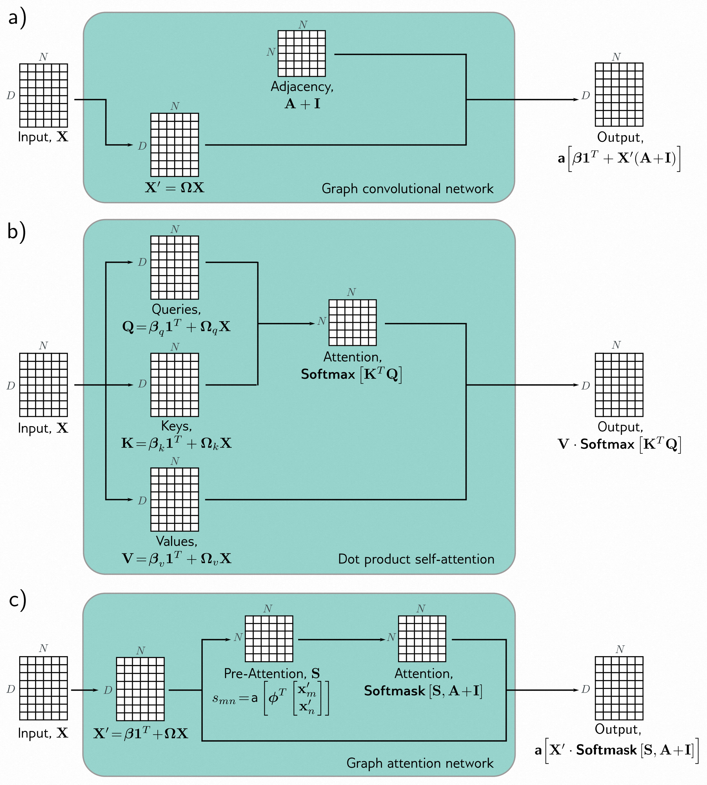

[译]第13章 图神经网络 - Graph neural networks 《理解深度学习 - Understanding Deep Learning》

本文是基于Simon J.D. Prince 的新书《Understanding Deep Learning》翻译而来；

* 原书介绍、原书（英文）下载、译文进展 以及 译文内容请戳 ↓↓↓
* [ \[译\]《理解深度学习 - Understanding Deep Learning 》 - 目录&前言 - ATA (atatech.org)](https://ata.atatech.org/articles/11020138829)

----

↓↓↓ 以下正文↓↓↓
----

# 本章目录

- [本章目录](#本章目录)
- [第13章 图神经网络 - Graph neural networks](#第13章-图神经网络---graph-neural-networks)
  - [13.1 什么是图？ - What is a graph?](#131-什么是图---what-is-a-graph)
    - [13.1.1 图的类型 - Types of graphs](#1311-图的类型---types-of-graphs)
  - [13.2 图的表示 - Graph representation](#132-图的表示---graph-representation)
    - [13.2.1 邻接矩阵的特性 - Properties of the adjacency matrix](#1321-邻接矩阵的特性---properties-of-the-adjacency-matrix)
    - [13.2.2 节点索引的置换 - Permutation of node indices](#1322-节点索引的置换---permutation-of-node-indices)
  - [13.3 图神经网络、任务和损失函数 - Graph neural networks, tasks, and loss functions](#133-图神经网络任务和损失函数---graph-neural-networks-tasks-and-loss-functions)
    - [13.3.1 任务和损失函数 - Tasks and loss functions](#1331-任务和损失函数---tasks-and-loss-functions)
  - [13.4 图卷积网络 - Graph convolutional networks](#134-图卷积网络---graph-convolutional-networks)
    - [13.4.1 等变性和不变性 - Equivariance and invariance](#1341-等变性和不变性---equivariance-and-invariance)
    - [13.4.2 参数共享 - Parameter sharing](#1342-参数共享---parameter-sharing)
    - [13.4.3 示例GCN层 - Example GCN layer](#1343-示例gcn层---example-gcn-layer)
  - [13.5 示例：图分类 - Example: graph classification](#135-示例图分类---example-graph-classification)
    - [13.5.1 批次训练 - Training with batches](#1351-批次训练---training-with-batches)
  - [13.6 归纳模型 vs. 传导模型 - Inductive vs. transductive models](#136-归纳模型-vs-传导模型---inductive-vs-transductive-models)
  - [13.7 示例：节点分类 - Example: node classification](#137-示例节点分类---example-node-classification)
    - [13.7.1 选择批次 - Choosing batches](#1371-选择批次---choosing-batches)
  - [13.8 图卷积网络的图层 - Layers for graph convolutional networks](#138-图卷积网络的图层---layers-for-graph-convolutional-networks)
    - [13.8.1 合并当前节点和聚合邻居 - Combining current node and aggregated neighbors](#1381-合并当前节点和聚合邻居---combining-current-node-and-aggregated-neighbors)
    - [13.8.2 残差连接 - Residual connections](#1382-残差连接---residual-connections)
    - [13.8.3 均值聚合 - Mean aggregation](#1383-均值聚合---mean-aggregation)
    - [13.8.4 Kipf归一化 - Kipf normalization](#1384-kipf归一化---kipf-normalization)
    - [13.8.5 最大池化聚合 - Max pooling aggregation](#1385-最大池化聚合---max-pooling-aggregation)
    - [13.8.6 注意力机制的聚合 - Aggregation by attention](#1386-注意力机制的聚合---aggregation-by-attention)
  - [13.9 边图 - Edge graphs](#139-边图---edge-graphs)
  - [13.10 总结 - Summary](#1310-总结---summary)
  - [13.11 笔记 - Notes](#1311-笔记---notes)
  - [13.12 问题 - Problems](#1312-问题---problems)

# 第13章 图神经网络 - Graph neural networks

第10章我们讨论了卷积神经网络，它主要用于处理规则的数据数组，比如图像。第12章我们介绍了Transformer，它专门处理可变长度的序列，比如文本。而在本章中，我们将要讨论的是*图神经网络*。正如其名所示，这些网络是专门用来处理图这种由节点和边构成的数据结构。

处理图数据面临着三个新的挑战。

* 首先，图的拓扑结构是可变的，这使得设计具有足够表达能力并且能够适应这种变化的网络变得非常困难。
* 其次，图的规模可能非常庞大，例如代表社交网络用户之间连接的图可能包含数十亿个节点。
* 第三，通常只有一个完整的图可用，所以传统的使用多个数据样本进行训练和测试的协议并不总是适用。

本章首先通过展示真实世界的图例来引入图的概念。然后详细描述了如何对这些图进行编码，并且如何将图的问题转化为监督学习问题。接着讨论了处理图的算法要求，这些要求自然地引出了一种特殊类型的图神经网络——图卷积网络。

## 13.1 什么是图？ - What is a graph?

一个图是一种非常通用的结构，由一组“节点”或“顶点”组成，这些节点通过“边”或“链接”相互连接。图通常是稀疏的，只有一小部分可能的边是存在的。

现实世界中的许多物体可以用图的形式来表示。例如，道路网络可以被视为一个图，其中节点代表实际位置，边表示它们之间的道路关系（图13.1a）。化学分子可以看作是小型的图，其中节点代表原子，边表示化学键（图13.1b）。电路也可以用图来表示，其中节点代表组件和接头，边表示电连接（图13.1c）。

> 图13.1 显示了现实世界中的一些例子。道路网络、分子和电路都可以用图的结构来描述。

此外，许多数据集即使在表面上看起来不是图的形式，但实际上也可以用图来表示。例如：

* 社交网络就是一个图，其中节点代表人，边表示人之间的友谊关系。
* 科学文献可以看作是一个图，其中每个论文是一个节点，而引用关系则是边。
* 维基百科可以被视为一个图，其中每个文章是一个节点，而超链接则是边。
* 计算机程序可以表示为一个图，其中每个语法令牌（程序流程中的不同变量）是一个节点，而涉及这些变量的计算则是边。
* 几何点云可以表示为一个图，其中每个点是一个节点，与附近的其他点相连。
* 细胞中的蛋白质相互作用可以表示为一个图，其中每个蛋白质是一个节点，而相互作用则是边。

此外，一个集合（一个无序列表）可以被视为一个图，其中每个成员是一个节点，与其他每个成员相连。图像可以被视为一个具有规则拓扑结构的图，其中每个像素是一个节点，与相邻像素相连。

### 13.1.1 图的类型 - Types of graphs

图可以根据不同的特征进行分类。在图[13.2a]中，社交网络是一种无向图，其中每对个体通过无方向的边连接在一起，彼此成为朋友。而图[13.2b]中的引用网络则是一种有向图，其中每篇论文引用其他论文，这种关系是单向的。

图[13.2c]描述了一个知识图谱，它通过定义节点之间的关系来编码一组对象的事实。从技术上讲，它是一个有向异构多图。这个图是异构的，因为节点可以表示不同类型的实体，例如人、国家、公司等。而它是一个多图，因为任意两个节点之间可以存在多个不同类型的边。

在图[13.2d]()中，我们可以将用于表示飞机的点集转换为图。这可以通过将每个点连接到其 $ K $ 个最近邻节点来实现。这样就形成了一个*几何图*，其中每个点都与3D空间中的位置相关联。图[13.2e]()展示了一个*分层图*，用于描述桌子、灯和房间。每个组件都由一个图表示。这三个图本身是另一个图的节点，用于表示更大模型中对象的拓扑结构。

>
> * a) 社交网络是一种无向图，人与人之间的关系是对称的。
> * b) 引用网络是一种有向图，一篇出版物引用另一篇，因此关系是非对称的。
> * c) 知识图是一种有向异构多图。节点是异构的，表示不同的对象类型（人、地点、公司），多条边可能表示每个节点之间的不同关系。
> * d) 通过在附近的点之间形成边，一个点集可以转换为图。每个节点在三维空间中有一个关联的位置，这被称为几何图（改编自胡等，2022）。
> * e) 左边的场景可以用层次图表示。房间、桌子和灯的拓扑结构都由图表示。这些图构成一个更大的图，表示对象之间的邻接性（改编自费尔南德斯-马德里加尔和冈萨雷斯，2002）。

在深度学习中，我们可以处理各种类型的图。然而，在本章中，我们主要讨论无向图。例如，图[13.2a]()中的社交网络。

## 13.2 图的表示 - Graph representation

除了图的结构本身外，通常还会将每个节点关联的信息存储起来。例如，在社交网络中，每个个体可以通过一个固定长度的向量来表示他们的兴趣。有时，边缘上也会有附加的信息。例如，在道路网络的例子中，每条边可以用长度、车道数、事故频率和速限来描述。节点上的信息存储在**节点嵌入**中，边缘上的信息存储在**边嵌入**中。

更正式地说，一个图由一组 $ N $ 个节点通过一组 $ E $ 个边连接而成。图可以由三个矩阵 $ \mathbf A $ ， $ \mathbf X $ 和 $ \mathbf E $ 来编码，分别表示图的结构、节点嵌入和边嵌入（图13.3）。

> 图13.3 描述了如下内容。
>
> * a) 这是一个示例图，包含六个节点和七条边。每个节点都有一个长度为五的嵌入（棕色向量）。每条边都有一个长度为四的嵌入（蓝色向量）。这个图可以用三个矩阵来表示。
> * b) 邻接矩阵是一个二进制矩阵，其中的元素 $ (m, n) $ 表示节点 $ m $ 是否与节点 $ n $ 相连。
> * c) 节点数据矩阵 $ \mathbf X $ 包含了节点嵌入的拼接。
> * d) 边数据矩阵 $ \mathbf E $ 包含了边的嵌入。

图结构可以用邻接矩阵 $ \mathbf A $ 来表示。邻接矩阵是一个 $ N×N $ 的矩阵，其中的第 $ (m, n) $ 个元素被设置为 1，表示节点 $ m $ 和节点 $ n $ 之间有一条边；被设置为 0，表示没有边相连。对于无向图来说，这个矩阵是对称的。对于大型稀疏图，可以使用连接列表来存储图的结构，以节省内存。

每个节点 $ n^{th} $ 都有一个与之关联的嵌入向量 $ \mathbf x^{(n)} $ ，其长度为 $ D $ 。这些嵌入向量被连接在一起，并存储在一个 $ D×N $ 的节点数据矩阵 $ \mathbf X $ 中。类似地，每条边 $ e^{th} $ 都有一个与之关联的嵌入向量 $ e^{(e)} $ ，其长度为 $ D_{E} $ 。这些边嵌入向量被收集在一个 $ D_{E}×E $ 的矩阵 $ \mathbf E $ 中。为了简化问题，我们首先考虑只有节点嵌入的图，之后在 [13.9](#edge-graphs) 节中再回顾边嵌入的情况。

### 13.2.1 邻接矩阵的特性 - Properties of the adjacency matrix

邻接矩阵可以通过线性代数的方法来查找一个节点的邻居。我们可以将第 $ n $ 个节点编码为一个 one-hot 列向量（一个只有一个非零元素在位置 $ n $ 的向量，该元素设为1）。当我们将这个向量与邻接矩阵相乘时，它提取了邻接矩阵的第 $ n $ 列，并返回一个在邻居位置（即从第 $ n $ 个节点开始的长度为1的行走可以到达的所有位置）处为1的向量。如果我们重复这个过程（即再次与 $ \mathbf A $ 相乘），得到的向量将包含从节点 $ n $ 到每个节点的长度为2的行走的数量（图 [13.4d-f]()）。

总的来说，如果我们将邻接矩阵的幂提升到 $ L $ 次方， $ \mathbf A^{L} $ 在位置 $ (m, n) $ 处的值就包含了从节点 $ n $ 到节点 $ m $ 的长度为 $ L $ 的独特路径数量（图[13.4a-c]()）。这与独特路径的数量不同，因为它包括了访问同一个节点多次的路径。然而， $ \mathbf A^{L} $ 仍然包含了关于图的连通性的有价值的信息；在位置 $ (m, n) $ 处的非零值表明从 $ m $ 到 $ n $ 的距离必须小于或等于 $ L $ 。

> 图13.4 展示了邻接矩阵的属性。
>
> * a) 一个示例图。
> * b) 邻接矩阵 $ \mathbf A $ 中的位置 $ (m, n) $ 表示从节点 $ m $ 到节点 $ n $ 的行走距离为一的次数。
> * c) 平方邻接矩阵 $ \mathbf A^{2} $ 中的位置 $ (m, n) $ 表示从节点 $ n $ 到节点 $ m $ 的行走距离为二的次数。
> * d) 在面板 (a) 中，节点六的 one-hot 向量被高亮显示。
> * e) 当我们使用矩阵 $ \mathbf A $ 对这个向量进行乘法运算时，结果中包含了从节点六到每个节点的行走距离为一的次数；我们可以通过一步到达节点五、七和八。
> * f) 当我们使用矩阵 $ \mathbf A^{2} $ 对这个向量进行乘法运算时，结果中包含了从节点六到每个节点的行走距离为二的次数；我们可以通过两步到达节点二、三、四、五和八，并且可以通过节点五、七和八以三种不同的方式回到原来的节点。

### 13.2.2 节点索引的置换 - Permutation of node indices

在图中，节点的索引是任意的，对这些索引进行排列会改变节点数据矩阵 $ \mathbf X $ 的列的排列顺序，以及邻接矩阵 $ \mathbf A $ 的行和列的排列顺序。然而，这并不改变底层的图结构（见图[13.5]()）。这与图像不同，对像素进行排列会生成不同的图像，以及与文本不同，对单词进行排列会生成不同的句子。

> 图13.5 显示了节点索引的排列方式。
>
> * a) 一个示例图，
> * b) 相应的邻接矩阵和
> * c) 节点嵌入。
> * d) 相同的图，只是其中节点的（任意）顺序已经改变。
> * e) 邻接矩阵
> * f) 节点矩阵现在是不同的。因此，任何在图上运行的网络层都应该对节点的顺序不敏感。

通过数学表达，我们可以使用一个称为“置换矩阵”的矩阵 $P$ 来表示节点索引的交换操作。这个矩阵的每一行和每一列中只有一个元素的值为1，其余元素的值为0。当我们将置换矩阵中的位置 $(m, n)$ 设置为1时，表示将节点 $m$ 置换为节点 $n$。为了实现从一个索引到另一个索引的映射，我们使用以下操作：

$$
\begin{aligned}
\mathbf{X}' &= \mathbf X \mathbf P\\
\mathbf{A}' &= \mathbf P^T \mathbf A \mathbf P
\end{aligned}
\tag{13.1}
$$

在这里，通过后乘 $ \mathbf P$ ，我们重新排列了矩阵 $ \mathbf X$ 的列，而通过前乘  $\mathbf P^T$ ，我们重新排列了矩阵 $ \mathbf A$ 的行。因此，任何应用于图处理的方法都应该对这些置换操作保持不变，否则结果将取决于节点索引的选择。

## 13.3 图神经网络、任务和损失函数 - Graph neural networks, tasks, and loss functions

图神经网络是一种模型，它以节点嵌入 $ \mathbf X $ 和邻接矩阵 $ \mathbf A $ 作为输入，并通过一系列 $ K $ 层进行处理。在每一层，节点嵌入都会更新，从而建立起中间的“隐藏”表示 $ \mathbf H_k $ ，最终计算出输出嵌入 $ \mathbf H_K $ 。

当网络开始时，输入节点嵌入 $ \mathbf X $ 中的每一列只包含有关节点本身的信息。而在结束时，模型输出 $ \mathbf H_K $ 中的每一列都包含有关节点及其在图中上下文中的信息。这类似于单词嵌入经过变换网络。它们在开始时代表单词，但在结束时代表句子上下文中的词义。

### 13.3.1 任务和损失函数 - Tasks and loss functions

在开始讨论图神经网络模型之前，我们先描述一下这些网络所解决的问题类型以及它们所使用的损失函数。监督式图问题通常可以分为三类（见图[13.6]()）：

> 图13.6 常见的图任务。在每种情况下，输入都是由邻接矩阵和节点嵌入表示的图。图神经网络通过一系列的层来处理节点嵌入。最后一层的节点嵌入中包含了节点以及其在图中上下文的信息。
>
> * a) 图分类。节点嵌入被组合起来（例如通过平均值），然后映射到一个固定大小的向量，通过softmax函数进行处理，从而生成类别的概率。
> * b) 节点分类。每个节点嵌入被单独用于分类（青色和橙色分别表示节点的类别）。
> * c) 边预测。与边相邻的节点嵌入被组合起来（例如通过点积）以计算一个数值，通过sigmoid函数处理该数值，从而生成缺失边存在的概率。

**图级任务：** 图级任务是指在整个图中为每个节点分配一个标签或预测一个或多个值的任务。这些任务利用了图的结构和节点的嵌入特征。举例来说，我们可以使用图级任务来预测某个分子在何种温度下会转变成液体（回归任务），或者判断某个分子对人类是否具有毒性（分类任务）。

在图级任务中，我们需要对输出节点嵌入进行组合。一种常见的方法是对节点嵌入进行平均求和，并使用线性变换或神经网络将其映射为固定大小的向量。对于回归任务，我们使用最小二乘损失函数来衡量预测结果与实际值之间的差异。而对于二分类任务，则需要使用sigmoid函数将输出映射到0和1之间，并使用二元交叉熵损失函数来度量预测结果与真实标签之间的差异。

在这里，我们可以使用以下公式来计算图属于类别1的概率：

$$
Pr(y=1|\mathbf{X},\mathbf{A})=\operatorname{sig}\left[\beta_K+\boldsymbol{\omega}_K\mathbf{H}_K\mathbf{1}/N\right]
\tag{13.2}
$$

在上述公式中， $ β_K $ 是一个标量， $ ω_K $ 是一个大小为 $ 1×D $ 的向量，它们都是通过学习得到的参数。我们将输出嵌入矩阵 $ \mathbf H_K $ 与一个包含全为1的列向量 $ \mathbf 1 $ 进行右乘运算，相当于对所有嵌入进行求和并除以节点数 $ N $ ，从而计算得到平均值。这一过程被称为*平均池化*（见图[10.11]()）。

**节点级任务：** 图的节点级任务是为图中的每个节点分配一个标签（分类）或一个或多个值（回归），通过使用图的结构和节点嵌入。例如，对于一个由三维点云组成的图，目标可能是根据节点是否属于机翼或机身对节点进行分类。节点级任务的损失函数与图级任务相同，只是现在在每个节点 $n$ 上独立进行计算：

$$
Pr(y^{(n)}=1|\mathbf{X},\mathbf{A})=\operatorname{sig}\left[\beta_K+\boldsymbol{\omega}_K\mathbf{h}_K^{(n)}\right]
\tag{13.3}
$$

**边预测任务：** 图的边预测任务是预测节点 $n$ 和 $m$ 之间是否应该存在边。例如，在社交网络设置中，可以预测两个人是否互相认识和喜欢，并建议建立连接。这是一个二分类任务，需要将两个节点嵌入映射到表示边存在概率的单个数字。一种可能性是计算节点嵌入的点积，并通过sigmoid函数将结果传递以创建概率：

$$
Pr(y^{(mn)}=1|\mathbf{X},\mathbf{A})=\mathrm{sig}\left[\mathbf{h}^{(m)T}\mathbf{h}^{(n)}\right]
\tag{13.4}
$$

## 13.4 图卷积网络 - Graph convolutional networks

存在许多类型的图神经网络，但在这里我们关注空间卷积图神经网络，即 GCNs。这些模型是卷积的，因为它们通过从附近节点聚合信息来更新每个节点。因此，它们引入了关系归纳偏置，即偏向于优先考虑邻居节点的信息。它们是基于空间的，因为它们使用原始图结构。这与基于谱的方法形成对比，后者在傅里叶域中应用卷积。GCN 的每一层都是一个函数 $ \mathbf{F}[•] $ ，具有参数 $ \Phi $ ，它接收节点嵌入和邻接矩阵，并输出新的节点嵌入。因此，网络可以表示为：

$$
\begin{aligned}
& \mathbf{H}_1 && =\quad\mathbf{F}[\mathbf{X},\mathbf{A},\boldsymbol{\phi}_0]  \\
&\mathbf{H}_2&& =\quad\mathbf{F}[\mathbf{H}_1,\mathbf{A},\boldsymbol{\phi}_1]  \\
&\mathbf{H}_3&& =\quad\mathbf{F}[\mathbf{H}_2,\mathbf{A},\boldsymbol{\phi}_2]  \\
&\quad\vdots&&=\quad\vdots\\
&\mathbf{H}_{K}&& =\quad\mathbf{F}[\mathbf{H}_{K-1},\mathbf{A},\boldsymbol{\phi}_{K-1}]
\end{aligned}
\tag{13.5}
$$

其中 $ \mathbf X $ 是输入， $ \mathbf A $ 是邻接矩阵， $ \mathbf H_{k} $ 包含第 $ k^{th} $ 层的更新后的节点嵌入， $ \phi_{k} $ 表示从第 $ k $ 层到第 $ k + 1 $ 层的映射的参数。

### 13.4.1 等变性和不变性 - Equivariance and invariance

前面我们提到，图中节点的索引是任意的，对节点索引的置换不会改变图的特性。因此，任何模型都必须遵守这个特性。换句话说，每一层都必须是等变的，也就是说，如果我们对节点索引进行置换，每一层的节点嵌入也会以相同的方式进行置换。用数学术语来说，如果 $ \mathbf P $ 是一个置换矩阵，我们必须满足以下等式：

$$
\mathbf{H}_{k+1}\mathbf{P}=\mathbf{F}[\mathbf{H}_k\mathbf{P},\mathbf{P}^T\mathbf{A}\mathbf{P},\boldsymbol{\phi}_k]
\tag{13.6}
$$

对于节点分类和边预测任务，模型的输出也应该对节点索引的置换具有等变性。然而，对于图级任务来说，最后一层会从整个图中汇总信息，所以输出对于节点顺序是不变的。事实上，方程[13.2]()的输出层可以实现这一点，因为：

$$
y=\operatorname{sig}\left[\beta_K+\boldsymbol{\omega}_K\mathbf{H}_K\boldsymbol{1}/N\right]=\operatorname{sig}\left[\beta_K+\boldsymbol{\omega}_K\mathbf{H}_K\mathbf{P}\boldsymbol{1}/N\right]
\tag{13.7}
$$

其中 $ \boldsymbol{1} $ 是一个全1向量， $ N $ 是节点的数量，对于任意的置换矩阵 $ \mathbf P $ （参见问题[13.6]()）。

这个问题与图像处理类似，其中图像分割应该对几何变换具有等变性，而图像分类应该具有不变性（参见图10.1）。在这方面，卷积和池化层部分地实现了平移等变性，但目前还没有已知的方法可以确保在更一般的变换下完全具备这些属性。然而，对于图来说，可以定义网络来保证在置换下具有等变性或不变性。

### 13.4.2 参数共享 - Parameter sharing

第10章讨论了将全连接网络应用于图像是不明智的，因为这要求网络在每个图像位置上单独学习如何识别对象。相反，我们使用了卷积层，它们以相同的方式处理图像中的每个位置。这样做减少了参数的数量，并引入了归纳偏差，迫使模型以相同的方式处理图像的每个部分。

同样的理论也适用于图中的节点。我们可以为每个节点设计一个独立的参数模型。但是，这样的话，网络必须单独学习连接图中节点的意义，这意味着需要训练许多具有相同拓扑结构的图。相比之下，我们构建了一个在每个节点上使用相同参数的模型，从而减少了参数的数量，并且通过共享网络在每个节点上学习到的知识，在整个图中进行了信息传递。
回想一下，卷积（方程[10.3]()）通过对周围邻居的加权信息进行汇总来更新变量。一种思考方式是，每个邻居向感兴趣的变量发送一条消息，这些消息被集合起来形成更新。当我们考虑图像时，邻居是当前位置周围固定大小的正方形区域中的像素，因此每个位置的空间关系是相同的。然而，在图中，每个节点可能有不同数量的邻居，并且没有统一的关系；没有一种方式可以使我们从“上方”节点的信息与从“下方”节点的信息有所区别。

### 13.4.3 示例GCN层 - Example GCN layer

这些思考过程引导产生了一个简单的 GCN 层（见图[13.7]()）。在第 $ k $ 层的每个节点 $ n $ 上，我们通过对其邻居节点的节点嵌入 $ \mathbf h_{•} $ 进行求和来聚合信息：

$$
\mathrm{agg}[n,k]=\sum_{m\in\mathrm{ne}{[n]}}\mathbf{h}_k^{(m)}
\tag{13.8}
$$

> 图13.7 简单的图卷积层。
>
> * a) 输入图由结构（由图邻接矩阵 $ \mathbf A $ 体现，未显示）和节点嵌入（存储在 $ \mathbf X $ 的列中）组成。
> * b) 第一个隐藏层中每个节点的更新步骤如下：(i) 合并相邻节点以形成一个向量，(ii) 对合并后的节点应用线性变换 $ Ω_{0} $ ，(iii) 对原始节点应用相同的线性变换 $ Ω_{0} $ ，(iv) 将它们与偏置项 $ β_{0} $ 相加，最后 (v) 应用非线性激活函数 $ \mathbf a[•] $ ，例如ReLU。
> * c) 在后续层中重复以上过程（但每层有不同的参数），直到我们得到网络末尾的最终嵌入表示。

其中 $ \mathrm{ne}[n] $ 返回节点 $ n $ 的邻居节点的索引集合。然后我们对当前节点的嵌入 $ h^{(n)}_k $ 和这个聚合值应用线性变换 $ Ω_{k} $ ，加上偏置项 $ β_{k} $ ，并将结果通过非线性激活函数 $ \mathbf a[•] $ ，这个函数独立应用于其向量参数的每个成员：

$$
\mathbf{h}_{k+1}^{(n)}=\mathbf{a}\left[\boldsymbol{\beta}_k+\boldsymbol{\Omega}_k\cdot\mathbf{h}_k^{(n)}+\boldsymbol{\Omega}_k\cdot\mathrm{agg}[n,k]\right]
\tag{13.9}
$$

我们可以更简洁地表示这个过程，通过注意到矩阵乘以向量的后乘返回其列的加权和。邻接矩阵 $ \mathbf A $ 的第 $ n $ 列在邻居位置处有1。因此，如果我们将节点嵌入收集到 $ D×N $ 矩阵 $ \mathbf H_{k} $ 中，并将其与邻接矩阵 $ \mathbf A $ 进行后乘，结果的第 $ n $ 列就是 $ \mathbf{agg}[n, k] $ 。现在节点的更新为：

$$
\begin{array}{rcl}\mathbf{H}_{k+1}&=&\text{a}\left[\boldsymbol{\beta}_k\boldsymbol{1}^T+\boldsymbol{\Omega}_k\mathbf{H}_k+\boldsymbol{\Omega}_k\mathbf{H}_k\mathbf{A}\right]\\&=&\text{a}\left[\boldsymbol{\beta}_k\boldsymbol{1}^T+\boldsymbol{\Omega}_k\mathbf{H}_k(\mathbf{A}+\mathbf{I})\right]\end{array}
\tag{13.10}
$$

其中 $ 1 $ 是一个包含1的 $ N×1 $ 向量。在这里，非线性激活函数 $ \mathbf a[•] $ 独立地应用于其矩阵参数的每个成员。

这一层满足了设计要求：它对节点索引的排列具有等变性，可以处理任意数量的邻居，利用图的结构提供关系归纳偏好，并在整个图中共享参数。

## 13.5 示例：图分类 - Example: graph classification

现在，我们将这些想法结合起来，描述一个将分子分类为有毒或无害的网络。网络的输入是邻接矩阵和节点嵌入矩阵 $ \mathbf X $ 。

邻接矩阵 $ A∈\mathbb{R}^{N×N} $ 是从分子结构中得到的。节点嵌入矩阵 $ X∈\mathbb{R}^{118×N} $ 的每一列都是一个指示向量，用于表示周期表中的118个元素是否存在。换句话说，这些向量的长度为118，除了对应于相应元素的位置外，其他位置都为零，对应位置设为一。我们可以通过使用第一个权重矩阵 $ Ω_{0} \in \mathbb{R}^{D×118} $ ，将节点嵌入转换为任意维度 $ D $ 的向量。

网络方程如下：

$$
\begin{aligned}
\begin{array}{rcl}
\mathbf{H}_{1}&&=\quad\text{a}\left[\boldsymbol{\beta}_0\boldsymbol{1}^T+\boldsymbol{\Omega}_0\mathbf{X}(\mathbf{A}+\mathbf{I})\right]  \\
\mathbf{H}_{2}&&=\quad\text{a}\left[\boldsymbol{\beta}_1\boldsymbol{1}^T+\boldsymbol{\Omega}_1\mathbf{H}_1(\mathbf{A}+\mathbf{I})\right]  \\
\vdots&&=\quad\vdots \\
\mathbf{H}_{K}&&=\quad\text{a}\left[\boldsymbol{\beta}_{K-1}\boldsymbol{1}^T+\boldsymbol{\Omega}_{K-1}\mathbf{H}_{k-1}(\mathbf{A}+\mathbf{I})\right]  \\
\mathrm{f}[\mathbf{X},\mathbf{A},\mathbf{\Phi}]&&=\quad\mathrm{sig}\left[\beta_K+\boldsymbol{\omega}_K\mathbf{H}_K\mathbf{1}/N\right]
\end{array}
\end{aligned}
\tag{13.11}
$$

其中，网络输出 $ \mathbf f [\mathbf X,\mathbf A,\mathbf Φ] $ 是一个确定分子毒性概率的单个值（参见方程[13.2]()）。

### 13.5.1 批次训练 - Training with batches

在批次训练中，我们给定了 $ I $ 个训练图 $ \{\mathbf X_{i},\mathbf A_{i}\} $ ，以及它们对应的标签 $ y_{i} $ 。我们使用参数 $ \mathbf Φ =\{β_{K}, Ω_{K}\}^{K}_{k=0} $ 和随机梯度下降（SGD）以及二元交叉熵损失（方程 [5.19]()）进行学习。全连接网络、卷积网络和Transformer都能够利用现代硬件的并行性，同时处理整个批次的训练样本。为了实现这一点，我们将批次元素连接成一个更高维度的张量（参见第 [7.4.2](#algorithmic-differentiation) 节）。

然而，每个图可能包含不同数量的节点。因此，矩阵 $ \mathbf X_{i} $ 和 $ \mathbf A_{i} $ 的大小是不同的，无法将它们连接成3D张量。

幸运的是，我们可以使用一种简单的技巧来并行处理整个批次。批次中的每个图都被视为单个大图的非交叉组件。然后，我们可以将网络作为网络方程的单个实例运行。均值池化操作仅在每个图上进行，以生成每个图的单一表示，然后将其输入到损失函数中。

## 13.6 归纳模型 vs. 传导模型 - Inductive vs. transductive models

到目前为止，本书中的所有模型都是*归纳式*的：我们使用一组带有标签数据的训练集来学习输入与输出之间的关系。然后，我们将学习到的规则应用到新的测试数据上。可以这样理解，我们正在学习如何将输入映射到输出的规则，然后将其应用到其他数据上。

相比之下，*转导模型*综合考虑了有标签和无标签的数据。它不会生成规则，而是对未知输出进行标注。这种方法有时被称为*半监督学习*。它的优点是可以利用无标签数据中的模式来辅助决策。然而，它的缺点是在添加额外的无标签数据时，需要重新训练模型。

这两种问题类型在图中经常出现（见图[13.8]()）。有时，我们拥有大量带有标签的图，并且学习图与标签之间的映射关系。例如，我们可能有许多分子，每个分子都被标记为对人类是否有毒。我们学习将图映射到有毒/无毒标签的规则，然后将这些规则应用于新的分子。然而，有时候我们只有一个整体图。在科学论文引用图中，我们可能有一些节点表示领域（如物理学、生物学等）的标签，希望为其余节点进行标注。在这种情况下，训练和测试数据是不可分割的。

> 图13.8 归纳式与推理式问题。
>
> * a) 归纳设置中的节点分类任务。我们给定一组 $ I $ 个训练图，其中节点标签（橙色和青色）是已知的。训练后，我们会得到一个测试图，必须为每个节点分配标签。
> * b) 节点分类的传递设置。我们有一张大图，其中一些节点已被标记为橙色或青色，而其他节点的标签未知。我们的目标是训练一个模型来准确预测已知标记，并检查未知节点的预测结果。

图级任务通常只出现在归纳学习设置中，其中包含了训练图和测试图。然而，节点级任务和边预测任务可以在任何设置中进行。在传递式学习中，我们的目标是通过最小化模型输出与已知真实值之间的差异来计算损失函数。我们通过运行前向传播并获取未知真实值的结果来计算新的预测值。

## 13.7 示例：节点分类 - Example: node classification

作为第二个例子，我们来考虑在转导设置中的二元节点分类任务。我们从一个包含数百万个节点的商业规模的图开始。其中一些节点已经有了二元的真实标签，我们的目标是对其余未标记的节点进行标记。网络的主体部分与之前的例子相同（方程[13.11]()），但最后一层不同，它产生一个大小为 $ 1 × N $ 的输出向量：

$$
\mathrm{f}[\mathbf{X},\mathbf{A},\mathbf{\Phi}]=\mathrm{sig}\left[\beta_K\mathbf{1}^T+\boldsymbol{\omega}_K\mathbf{H}_K\right]
\tag{13.12}
$$

其中函数 $ \mathbf{sig}[•] $ 逐个元素地将 sigmoid 函数应用于行向量输入。正如之前所说，我们使用二元交叉熵损失，但现在仅在我们知道地面真实标签 $ y $ 的节点上使用。需要注意的是，方程[13.12]()只是方程[13.3]()中节点分类损失的向量化版本。

训练这个神经网络会遇到两个问题。首先，训练如此大规模的图神经网络在逻辑上是困难的。因为我们需要在前向传播中存储每个网络层的节点嵌入，这将涉及存储和处理一个整个图的几倍大小的数据结构，这可能是不切实际的。其次，我们只有一个图，所以如何进行随机梯度下降并不明显。如果只有一个对象，我们应该如何形成一个批次呢？

### 13.7.1 选择批次 - Choosing batches

一种形成批次的方法是在每个训练步骤中选择一组随机子集的标记节点。每个节点依赖于其前一层的邻居。这些邻居又依赖于它们在前一层的邻居，因此每个节点具有等效的感受野（图[13.9]()）。感受野的大小被称为*k-跳邻域*。因此，我们可以使用形成批次节点的k-跳邻域的并集来执行梯度下降步骤；剩余的输入则不起作用。

> 图13.9 图神经网络中的感受野。考虑隐藏层二中的橙色节点（右侧），它接收隐藏层1中 “1跳邻域” 的节点的输入（中心的阴影区域）。隐藏层1中的这些节点依次接收其邻居的输入，而隐藏层2中的橙色节点则从 “2跳邻域“（左侧的阴影区域）中接收所有输入节点的输入。对于给定节点，贡献于其的图区域等同于卷积神经网络中感受野的概念。

然而，如果图中有很多层且密集连接，那么每个输入节点可能都在每个输出节点的感受野范围内。这就是所谓的*图扩展问题*。为了解决这个问题，我们可以采用两种方法：*邻域采样*和*图分割*。

**邻居采样：** 邻居采样是一种通过对完整图进行采样来减少每个网络层连接的方法（图[13.10]()）。例如，我们可以从批次中的节点开始，并随机采样一定数量的上一层邻居。然后，我们再随机采样一定数量的上一层之前的邻居，以此类推。图仍然会随着每一层的增加而增大，但是可以更好地控制。每个批次都会重新进行这个过程，因此即使相同的批次被重复采样，贡献的邻居也会有所不同。这种方法类似于退出（第9.3.3节）并引入了一些正则化效果。

> 图 13.10 邻域采样。
>
> * a）在处理大型图时，一种形成批次的方法是选择输出层中的一部分标记节点（这里仅为第二层的一个节点，右侧），然后向前回溯，找到 K-跳邻域（感受野）中的所有节点。只有这个子图需要用于训练该批次。不过，如果图的连接非常密集，那么这个子图可能会保留大部分的图结构。
> * b）邻域采样是一种解决方案。当我们从最后一层向前回溯时，选择前一层中的一部分邻居节点（这里选择了三个），以及这些邻居节点在再前一层中的一部分邻居节点。这样可以限制用于训练批次的图的大小。在所有的图示中，亮度表示节点与原始节点之间的距离。

**图分割：** 第二种方法是在处理之前将原始图分割成互不相交的子区域（也就是不相连的小图）（见图 [13.11]()）。有一些标准算法可以选择这些子区域以最大化内部连接的数量。这些小图可以被看作是批次，或者可以将其中的一些随机子集组合成一个批次（通过恢复它们之间的边来自原始图）。

> 图13.11 图分割。
>
> * a) 输入图。
> * b) 我们采用一种基于原则的方法，将输入图分割成较小的子图，以最小化边的移除数量。
> * c-d) 现在，我们可以将这些子图作为批次在传导设置中进行训练，因此有四个可能的批次。
> * e) 另外，我们可以使用子图的组合作为批次，并恢复它们之间的边。如果我们使用子图对，那么将有六个可能的批次。

使用上述方法之一形成批次后，我们现在可以像处理归纳设置一样训练网络参数，将标记的区域分为训练、测试和验证集，以便根据需要进行实验；我们已经成功地将一个归纳问题转化为了一个归纳问题。为了进行推理，我们根据未知区域的 k-hop 邻域计算预测值。与训练不同，这不需要存储中间表示，因此更节省内存。

## 13.8 图卷积网络的图层 - Layers for graph convolutional networks

在之前的例子中，我们使用了将相邻节点的消息与转换后的当前节点相加的方法来组合它们。这是通过将节点嵌入矩阵 $ \mathbf H $ 与邻接矩阵加上单位矩阵 $ \mathbf A + \mathbf I $ 进行矩阵乘法来实现的。现在，我们考虑不同的方法来处理 (i) 当前嵌入与聚合邻居的组合，以及 (ii) 聚合过程本身。

### 13.8.1 合并当前节点和聚合邻居 - Combining current node and aggregated neighbors

在上述 GCN 层的示例中，我们通过将聚合的邻居 $ \mathbf H\mathbf A $ 与当前节点 $ \mathbf H $ 相加来进行合并，如下所示：

$$
\mathbf{H}_{k+1}=\text{a}\Big[\boldsymbol{\beta}_k\mathbf{1}^T+\boldsymbol{\Omega}_k\mathbf{H}_k(\mathbf{A}+\mathbf{I})\Big]
\tag{13.13}
$$

另一种变体是在将当前节点贡献到总和之前乘以因子 $ (1 + ϵ_{k}) $ ，其中 $ ϵ_{k} $ 是每个层不同的可学习标量：

$$
\mathbf{H}_{k+1}=\text{a}\Big[\boldsymbol{\beta}_k\boldsymbol{1}^T+\boldsymbol{\Omega}_k\mathbf{H}_k(\mathbf{A}+(1+\epsilon_k)\mathbf{I})\Big]
\tag{13.14}
$$

这被称为*对角线增强*。另一个相关变体是对当前节点应用不同的线性变换 $ \mathbf Ψ_{k} $ ：

$$
\begin{aligned}
\mathbf{H}_{k+1}& =\quad\text{a}\left[\boldsymbol{\beta}_k\boldsymbol{1}^T+\boldsymbol{\Omega}_k\mathbf{H}_k\mathbf{A}+\boldsymbol{\Psi}_k\mathbf{H}_k\right]  \\
&\left.=\quad\mathrm{~a}\left[\boldsymbol{\beta}_k\boldsymbol{1}^T+\begin{bmatrix}\boldsymbol{\Omega}_k&\boldsymbol{\Psi}_k\end{bmatrix}\right.\begin{bmatrix}\mathbf{H}_k\mathbf{A}\\\mathbf{H}_k\end{bmatrix}\right] \\
&\left.=\quad\text{a}\left[\boldsymbol{\beta}_k\boldsymbol{1}^T+\boldsymbol{\Omega}_k^{\prime}\begin{bmatrix}\mathbf{H}_k\mathbf{A}\\\mathbf{H}_k\end{bmatrix}\right.\right]
\end{aligned}
\tag{13.15}
$$

在第三行中，我们定义了 $ Ω^′_k = [Ω_{k} Ψ_{k}] $ 。

### 13.8.2 残差连接 - Residual connections

残差连接通过对邻居节点的聚合表示进行变换，并在经过激活函数之前与当前节点进行求和或连接。对于后一种情况，相关的网络方程为：

$$
\mathbf{H}_{k+1}=\begin{bmatrix}\mathrm{a}\left[\boldsymbol{\beta}_k\boldsymbol{1}^T+\boldsymbol{\Omega}_k\mathbf{H}_k\mathbf{A}\right]\\\mathbf{H}_k\end{bmatrix}
\tag{13.16}
$$

### 13.8.3 均值聚合 - Mean aggregation

上述方法通过对节点嵌入进行求和来聚合邻居节点。然而，可以以不同的方式组合嵌入。有时候，取邻居的平均值可能比求和更好；如果嵌入信息更重要，而结构信息则不那么重要，那么这种方法可能更优，因为邻居贡献的大小不会取决于邻居的数量：

$$
\operatorname{agg}[n]=\frac1{|\text{ne}[n]|}\sum_{m\in\text{ne}[n]}\mathbf{h}_m
\tag{13.17}
$$

其中， $ \text{ne}[n] $ 表示包含第 $ n $ 个节点邻居索引的集合。方程（13.17）可以通过引入一个对角线元素为 $ N\times N $ 的度矩阵 $ D $ 来整洁地以矩阵形式计算。该矩阵的每个非零元素包含了相应节点的邻居数。因此，逆矩阵 $ D^{-1} $ 中的每个对角元素都包含了计算平均值所需的分母。新的GCN层可以写成：

$$
\mathbf{H}_{k+1}=\text{a}\Big[\boldsymbol{\beta}_k\boldsymbol{1}^T+\boldsymbol{\Omega}_k\mathbf{H}_k(\mathbf{A}\mathbf{D}^{-1}+\mathbf{I})\Big]
\tag{13.18}
$$

### 13.8.4 Kipf归一化 - Kipf normalization

基于均值聚合的图神经网络有很多变体。有时候，当前节点与其邻居一起参与均值计算，而不是单独处理。在Kipf归一化中，节点表示的和被规范化为：

$$
\operatorname{agg}[n]=\sum_{m\in\text{ne}[n]}\frac{\mathbf{h}_m}{\sqrt{|\text{ne}[n]||\text{ne}[m]|}}
\tag{13.19}
$$

这样做的逻辑是，来自邻居节点的信息应该被降权，因为邻居节点有很多连接，提供的唯一信息较少。这也可以使用度矩阵在矩阵形式下表示：

$$
\mathbf{H}_{k+1}=\text{a}\Big[\boldsymbol{\beta}_k\boldsymbol{1}^T+\boldsymbol{\Omega}_k\mathbf{H}_k(\mathbf{D}^{-1/2}\mathbf{A}\mathbf{D}^{-1/2}+\mathbf{I})\Big]
\tag{13.20}
$$

### 13.8.5 最大池化聚合 - Max pooling aggregation

另一种对置换不变的操作是计算一组对象的最大值。*最大池化*聚合操作符定义为：

$$
\operatorname{agg}[n]=\max_{m\in\text{ne}[n]}[\mathbf{h}_m]
\tag{13.21}
$$

其中，运算符 $ \max[•] $ 返回与当前节点 $ n $ 的邻居向量 $ \mathbf{h}_m $ 的逐元素最大值。

### 13.8.6 注意力机制的聚合 - Aggregation by attention

迄今为止，我们讨论的聚合方法要么对邻居的贡献进行相等加权，要么根据图的拓扑结构进行加权。然而，在*图注意力层*中，权重取决于节点的数据。我们将线性变换应用于当前节点的嵌入，得到以下形式的聚合：

$$
\mathbf{H}_k^{\prime}=\boldsymbol{\beta}_k\mathbf{1}^T+\boldsymbol{\Omega}_k\mathbf{H} \tag{13.22}
$$

接下来，我们计算每对转换后的节点嵌入 $ \mathbf h^′_m $ 和 $ \mathbf h^′_n $ 的相似度 $ s_{mn} $ 。具体做法是将它们连接在一起，然后与一个学习参数的列向量 $ ϕ_k $ 进行点积运算，并应用一个激活函数：

$$
\mathbf{H}_{k+1} = a\Big[\mathbf{H}_k^{\prime}\cdot\text{Softmask}[\mathbf{S},\mathbf{A}+\mathbf{I}]\Big]
\tag{13.24}
$$

这里的 $ \mathbf{a}[•] $ 是第二个激活函数。函数 $ \operatorname{Softmask}[•,•] $ 通过对矩阵 $ \mathbf{S} $ 的每一列单独应用softmax操作来计算注意力权重。然而，只有在矩阵 $ \mathbf{A}+\mathbf{I} $ 的对应位置为零时，才将注意力权重设置为负无穷，以确保这些值不会被考虑。这样做可以确保非邻居节点的注意力权重为零。

这个系统与 Transformers 中的自注意力计算非常相似（参见图[13.12]()），但存在以下几点差异：(i) 键、查询和值都是相同的，(ii) 相似度的度量方式不同，(iii) 注意力被屏蔽，使得每个节点只关注自身和邻居节点。与 Transformers 类似，这个系统可以扩展为使用并行运行和重新组合的多个头部。

> 图13.12对比了图卷积网络、点积注意力和图注意力网络的工作原理。在每种情况下，这个机制都将存储在大小为 $ D×N $ 的矩阵 $ \mathbf X $ 中的 $ N $ 个大小为 $ D $ 的嵌入映射为相同大小的输出。
>
> * a) 图卷积网络将线性变换应用于数据矩阵，得到转换后的数据矩阵 $ \mathbf X^′ = \mathbf Ω\mathbf X $ 。然后，它通过加权和来计算转换后的数据，其中权重是基于邻接矩阵的。接着，它添加一个偏置项 $ β $ 并将结果通过激活函数进行处理。
> * b) 自注意机制的输出也是对输入进行转换后的加权和，但这次的权重是根据数据本身通过注意力矩阵来决定的。
> * c) 图注意力网络将这两种机制结合在一起；权重既是基于数据计算得到的，也是基于邻接矩阵的。
这些变量被存储在一个大小为 $ N×N $ 的矩阵 $ \mathbf{S} $ 中，其中每个元素代表节点之间的相似度。与点积自注意力一样，我们使用softmax操作将对每个输出嵌入的贡献归一化为正值，并且总和为一。然而，只有当前节点及其邻居节点的值应该有贡献。注意力权重被应用于变换后的嵌入：

## 13.9 边图 - Edge graphs

迄今为止，我们一直关注处理节点嵌入。这些嵌入会随着它们通过网络的传递而演变，以至于在网络的末端，它们能够同时表示节点本身和节点在图中的上下文。现在我们来考虑与图的边相关的信息的情况。

在将机器适应于处理边嵌入的方法中，一种常用的方法是使用边图（也被称为伴图或线图）。边图是一种补充图，其中原始图中的每条边都变成了一个节点，并且原始图中具有共同节点的每两条边在新图中都会创建一条边（见图[13.13]()）。总的来说，边图可以恢复原始图，因此可以在这两种表示之间进行切换。

> 图13.13 展示了边图的示例：
>
> * a) 是一个具有六个节点的图。
> * b) 为了创建边图，我们为每条原始边分配一个节点（青色圆圈）
> * c) 如果新的节点与原始图中的同一节点相连接，则连接它们

在处理边嵌入时，我们将图转换为边图。然后，我们使用相同的技术，从邻居节点中聚合信息，并将其与当前表示组合在一起。当节点嵌入和边嵌入同时存在时，我们可以在这两个图之间相互转换。现在有四种可能的更新方式（节点更新节点，节点更新边，边更新节点和边更新边），可以根据需要交替使用，或者稍作修改，可以同时从节点和边更新节点。

## 13.10 总结 - Summary

一个图由一组节点和它们之间的边组成。节点和边都可以携带数据，这被称为节点嵌入和边嵌入。图可以用来表示许多现实世界中的问题，我们的目标是确定整个图的属性，每个节点或边的属性，或者图中可能存在的额外边。

图神经网络是一种应用于图的深度学习模型。由于图中节点的顺序是任意的，图神经网络的层必须具备对节点索引的置换等变性。基于空间的卷积网络是一种图神经网络，它通过聚合节点的邻居信息，并使用这些信息来更新节点嵌入。
处理图的一个挑战是，它们通常出现在转导设置中，其中只有一部分图被标记，而不是一组用于训练和测试的图。此外，这些图往往非常庞大，这给训练带来了更多的挑战，并促使我们开发采样和分区算法。在边图（edge graph）中，每条边都有一个节点。通过将图转换为这种表示形式，我们可以使用图神经网络来更新边节点的嵌入。

## 13.11 笔记 - Notes

[Sanchez-Lengeling et al., 2021]()和[Daigavane et al., 2021]()介绍了使用神经网络进行图处理的入门文章。欲了解有关图神经网络研究的最新调查，请参阅[Zhou et al., 2020a](), [Wu et al., 2020c]()和[Veličković, 2023]()的文章，以及[Hamilton, 2020]()和[Ma＆Tang, 2021]()的书籍。GraphEDM([Chami et al., 2020]())将许多现有的图算法统一为一个框架。本章中，我们采用[Bruna et al., 2013]()的方法将图与卷积网络相关联，但也与信念传播([Dai et al., 2016]())和图同构测试([Hamilton et al., 2017a]())密切相关。[Zhang et al., 2019c]()提供了一个专注于图卷积网络的综述。[Bronstein et al., 2021]()为几何深度学习提供了概述，包括在图上的学习。[Loukas, 2020]()讨论了图神经网络所能学习的函数类型。

**应用：** 图分类（例如，Zhang等，2018b），节点分类（例如，Kipf＆Welling，2017），边预测（例如，Zhang＆Chen，2018），图聚类（例如，Tsitsulin等，2020）和推荐系统（例如，Wu等，2023）是图神经网络的一些应用领域。节点分类方法由Xiao等（2022a）进行了综述，图分类方法由Errica等（2019）进行了回顾，边预测方法由Mutlu等（2020）和Kumar等（2020a）进行了回顾。

**图神经网络：** 图神经网络是由Gori等人（2005年）和Scarselli等人（2008年）引入的概念，将其作为递归神经网络的一般化形式。后者采用了迭代更新的方法：

$$
\mathrm{h}_n\leftarrow\mathrm{f}\left[\mathrm{x}_n,\mathrm{x}_{m\in\text{ne}[n]},\mathrm{e}_{e\in\text{nee}[n]},\mathrm{h}_{m\in\text{ne}[n]},\phi\right]
\tag{13.25}
$$

在这个公式中，每个节点嵌入 $ \mathbf h_n $ 通过使用初始嵌入 $ \mathbf x_n $ 、相邻节点的初始嵌入 $ \mathbf x_m∈ne_{[n]} $ 、相邻边的初始嵌入 $\mathbf  e_e∈nee_{[n]} $ 和相邻节点嵌入 $ \mathbf h_m\in ne_{[n]} $ 进行更新。为了达到收敛，函数 $ f[•,• ,• ,• , ϕ] $ 必须是一个压缩映射（参见图16.9）。如果我们将这个方程在时间上展开 $ K $ 步，并允许每个时间步 $ K $ 使用不同的参数 $ ϕ_{k} $ ，那么方程13.25就类似于图卷积网络。后续的研究将图神经网络扩展到使用门控循环单元（Li [et al.，2016b]）和长短期记忆网络（Selsam et al.，2019）。

**谱方法：** Bruna等人（2013）在傅里叶域中应用了卷积操作。傅里叶基向量可以通过对*图拉普拉斯矩阵*进行特征分解来获得，其中 $ \mathbf L = \mathbf D-\mathbf A $ ， $ \mathbf D $ 表示度矩阵， $ \mathbf A $ 表示邻接矩阵。然而，这种方法存在一些缺点：滤波器不是局部化的，并且对于大型图来说，计算分解的代价非常高。Henaff等人（2015）通过强制傅里叶表示平滑（从而实现空域局部化）来解决了第一个问题。Defferrard等人（2016）引入了ChebNet，通过利用切比雪夫多项式的递归性质有效地近似滤波器。这一方法不仅提供了空域局部化的滤波器，还减少了计算量。Kipf和Welling（2017）进一步简化了这个方法，构建了只使用1跳邻居的滤波器，与本章介绍的空间方法类似，为谱方法和空间方法之间的桥梁提供了一个解决方案。

**空间方法：** 光谱方法最终是基于图拉普拉斯矩阵的，因此如果图发生变化，模型必须重新训练。这个问题促使了空间方法的发展。[Duvenaud等人，2015]()在空间域中定义了卷积，使用不同的权重矩阵来组合每个节点度数的相邻嵌入。然而，这种方法的一个缺点是，如果某些节点具有非常大的连接数，那么它变得不切实际。为了解决这个问题，扩散卷积神经网络（[Atwood＆Towsley，2016]()）使用归一化邻接矩阵的幂来在不同尺度上混合特征，将这些特征相加，并通过激活函数生成节点嵌入。[Gilmer等人，2017]()引入了“消息传递神经网络”，将图上的卷积定义为从空间邻居传播消息。*GraphSAGE*（[Hamilton等人，2017a]()）的“聚合和组合”形式符合这一框架。

**聚合与结合：** 在图卷积网络中（Kipf & Welling, 2017），我们对邻居节点和当前节点进行加权平均，并应用线性映射和ReLU激活函数。GraphSAGE（Hamilton et al., 2017a）则是对每个邻居应用神经网络层，并取元素级别的最大值进行聚合。而Chiang等人（2019）则提出了“对角线增强”方法，在此方法中，先前的嵌入比邻居节点的嵌入更加重要。Kipf & Welling（2017）在图卷积网络中引入了Kipf归一化，根据当前节点和邻居节点的度数对邻居嵌入的总和进行归一化处理（见方程[13.19]）。

*混合模型网络*或*MoNet*（[Monti et al.，2017]()）进一步推进了这一点，通过学习一种基于当前节点和邻居度数的加权方法。他们为每个节点关联了一个伪坐标系统，其中邻居的位置取决于这两个数量。然后，他们使用基于高斯混合的连续函数，并在邻居的伪坐标处进行采样以获得权重。通过这种方式，他们能够学习节点和具有任意度数的邻居之间的权重关系。[Pham et al.，2017]()则采用了节点嵌入和邻居的线性插值方法，同时使用不同的加权组合来处理每个维度。这个门控机制的权重是作为数据的一个函数生成的。

**高阶卷积层：** Zhou & Li（2017）引入了高阶卷积层，将邻接矩阵 $ \mathbf{A} $ 替换为 $ \tilde{\mathbf{A}} = \operatorname{Min}[\mathbf{A}^{L} + \mathbf{I}, 1] $ 。其中 $ L $ 是最大行走长度， $ \mathbf{I} $ 是一个只包含1的矩阵。 $ \operatorname{Min}[•] $ 对其两个矩阵参数进行逐点最小值运算，更新了至少存在长度为 $ L $ 的行走的节点的贡献。Abu-El-Haija 等人（2019）提出了 *MixHop* 方法，通过使用邻接矩阵 $ \mathbf{A} $ 的邻居、邻居的邻居（使用 $ \mathbf{A}^{2} $ ），以此类推，来计算节点的更新，并将这些更新在每一层连接在一起。Lee 等人（2018）通过使用几何 *模式* 将超出直接邻居的节点的信息结合起来，这些模式是图中的小型局部几何模式，例如一个完全连接的五个节点的团。

**残差连接：** 在2017年，Kipf和Welling提出了一种残差连接的方法，即将原始的嵌入向量添加到更新后的嵌入向量中。Hamilton等人在2017年的研究中将前一层的嵌入向量连接到下一层的输出中，具体形式可见方程13.16。此外，Rossi等人在2020年提出了一种类似于Inception风格的网络，其中节点嵌入向量不仅与其邻居聚合的结果连接，还与两步内的所有邻居聚合的结果连接（通过计算邻接矩阵的幂）。另外，Xu等人引入了"jump knowledge connections"的概念，即每个节点的最终输出由整个网络中连接的节点嵌入向量级联而成。此外，Zhang和Meng在2019年提出了一种名为"GResNet"的残差嵌入的通用形式，并研究了几种变体，其中包括添加前一层的嵌入向量、输入嵌入向量或这些嵌入向量的某些版本（无需进一步转换）以聚合邻居节点的信息。

**图神经网络中的注意力机制：**[Veličković等人，2019]()提出了*图注意力网络（见图[13.12c]()）*。他们的模型使用了多头注意力机制，将多个头部的输出以对称的方式进行组合。另外，门控注意力网络（[Zhang等人，2018a]()）根据数据本身来对不同头部的输出进行加权。Graph-BERT（[Zhang等人，2020]()）则仅仅使用自注意力机制来进行节点分类。为了捕捉图的结构，类似于transformer（第12章）中捕捉单词的绝对或相对位置，Graph-BERT在数据中添加了位置嵌入，这些位置嵌入依赖于图中节点之间的跳数。

**置换不变性：** 在《DeepSets》一书中，Zaheer等人（2017）提出了一种处理集合的通用置换不变操作符。Janossy池化（Murphy等人，2018）认为许多函数不具备置换等变性，而是使用对置换敏感的函数，并对多个置换结果进行平均。

**边图：** 边图、线图或伴图的概念可以追溯到Whitney（1932）的研究。Kearnes等人（2016）提出了一种"编织"层的思想，通过更新节点嵌入、从节点嵌入更新边嵌入、从边嵌入更新节点嵌入以及从边嵌入更新边嵌入。然而，在这里，节点-节点和边-边的更新不涉及邻居信息。Monti等人（2018）引入了一种名为"对偶-原始图卷积神经网络"的现代形式，该网络在CNN框架中交替更新原始图和边图的表示。

**图神经网络的威力：** Xu等人（2019）认为，神经网络应该能够区分不同的图结构。如果两个具有相同初始节点嵌入但不同邻接矩阵的图被映射到相同的输出，这是不可取的。他们确定了一些以前的方法（如GCNs（Kipf＆Welling，2017）和GraphSAGE（Hamilton等人，2017a））无法区分的图结构。为了解决这个问题，他们开发了一种更强大的架构，它具有与Weisfeiler-Lehman图同构测试相同的区分能力（Weisfeiler＆Leman，1968）。这种架构被称为*图同构网络*，它基于聚合操作：

$$
\mathbf{h}_{k+1}^{(n)}=\mathrm{mlp}\left[\left(1+\epsilon_k\right)\mathbf{h}*k^{(n)}+\sum*{m\in\text{ne}[n]}\mathbf{h}_k^{(m)}\right]
\tag{13.26}
$$

**批次处理：** 在最初的图卷积网络论文中（Kipf＆Welling，2017），使用了全批量梯度下降。然而，这种方法在训练过程中的内存需求与节点数、嵌入大小和层数成正比，导致内存消耗很大。为了减少内存需求并在转导设置中为SGD创建批次，后续提出了三种方法：节点采样、层采样和子图采样。这些方法的目标是在减少内存需求的同时，保持模型的训练效果。

*节点采样方法* 首先随机选择一部分目标节点，然后通过网络逐步回溯，在每个阶段添加接收域中的一部分节点。GraphSAGE（Hamilton等人，2017a）提出了固定数量的邻居采样，如图13.10b所示。Chen等人（2018b）引入了一种方差缩减技术，但这仍然需要高内存要求，因为它使用了节点的历史激活信息。PinSAGE（Ying等人，2018a）从目标节点开始进行随机游走，并选择具有最高访问计数的K个节点。这优先选择与目标节点更密切相关的祖先。

在通过图的后向传播过程中，节点采样是必要的，它可以增加节点数量。为了解决这个问题，一种称为*层采样方法*的技术被提出。这种方法通过对每一层独立进行接收域采样来实现。层采样的示例包括FastGCN（Chen等，2018a）、自适应采样（Huang等，2018b）和层相关重要性采样（Zou等，2019）。

*子图采样方法* 是一种随机选择子图或将原始图划分为子图的方法。然后，这些子图被用作独立的数据样本进行训练。其中一些方法包括 *GraphSAINT*（[Zeng等人，2020]（）），该方法在训练过程中使用随机游走来采样子图，然后在子图上运行完整的GCN，以校正小批量的偏差和方差。Cluster GCN（[Chiang等人，2019]（））在预处理阶段通过最大化嵌入利用率或批内边的数量将图划分为簇，并随机选择簇来形成小批量。为了增加随机性，他们训练这些簇的随机子集以及它们之间的边（见图[13.11]（））。

Wolfe等人（2021）提出了一种分布式训练方法，该方法通过在不同层级上对特征空间进行分区，并同时对较窄的GCN进行并行训练。关于图采样的更多信息可以在Rozemberczki等人（2020）的论文中找到。

**正则化和归一化：** Rong等人（2020）提出了一种名为DropEdge的方法，该方法通过在每次训练迭代中随机删除图中的边来掩盖邻接矩阵。这种操作可以应用在整个神经网络上，也可以逐层进行不同的处理（逐层DropEdge）。从某种意义上说，这类似于dropout，因为它打断了数据流的连接，但也可以被视为一种数据增强方法，因为改变图类似于扰动数据。Schlichtkrull等人（2018）、Teru等人（2020）和Veličković等人（2019）也提出了从图中随机删除边作为类似于dropout的正则化形式。节点采样方法（Hamilton等人，2017；Huang等人，2018；Chen等人，2018）也可以看作是正则化器。Hasanzadeh等人（2020）提出了一个通用框架，称为DropConnect，将上述许多方法统一起来。

还有许多标准化方案专门针对图神经网络进行研究，其中包括*PairNorm*（[Zhao & Akoglu，2020]()）、权重归一化（[Oono & Suzuki，2019]()）、可微分的分组归一化（[Zhou等，2020b]()）和*GraphNorm*（[Cai等，2021]()）。

**多关系图：** [Schlichtkrull等，2018]()提出了一种针对多关系图（即具有多个边类型的图）的图卷积网络变体。他们的方案使用不同的参数来分别聚合每种边类型的信息。然而，如果存在许多不同的边类型，参数的数量可能会变得很庞大。为了解决这个问题，他们建议使用不同的参数基组合对每种边类型进行加权。

**分层表示和汇聚：** 在图像分类中，卷积神经网络（CNN）通过逐渐减小表示的大小来处理图像，但网络的深度增加后通道数会增加。然而，在本章中用于图像分类的图卷积网络（GCN）在最后一层之前会保留整个图，并将所有节点组合在一起计算最终的预测结果。[Ying等人，2018b]()提出了*DiffPool*方法，它通过对图节点进行聚类来创建一个随着深度增加而逐渐变小的图，这种方法是可微分的，因此可以通过学习进行优化。该方法可以仅基于图结构完成，也可以根据图结构和节点嵌入自适应地进行。另外，还有其他汇聚方法，如*SortPool*（[Zhang等人，2018b]()）和*自注意图汇聚*（[Lee等人，2019]()）。有关用于图神经网络的汇聚层的比较，请参考[Grattarola等人，2022]()。[Gao＆Ji，2019]()提出了基于U-Net的图编码器-解码器结构（见图[11.10]()）。

**几何图：** MoNet模型（[Monti et al.，2017]（））能够利用几何信息，因为相邻节点在空间上具有明确的位置。该模型学习高斯函数的混合，并根据相邻节点的相对坐标进行采样。通过这种方式，它可以根据相对位置对相邻节点进行加权，就像标准的卷积神经网络一样，尽管这些位置并不是固定的。几何CNN（[Masciet al.，2015]（））和各向异性CNN（[Boscaini et al.，2016]（））将卷积运算应用于由三角网格表示的流形（即表面）。它们将表面局部逼近为平面，并在当前节点周围的该平面上定义一个坐标系。

**过度平滑和悬停动画：** 与其他深度学习模型不同，直到最近，图神经网络并没有明显受益于增加深度。事实上，原始的GCN论文（Kipf和Welling，2017）和GraphSAGE（Hamilton等，2017a）仅使用了两层，并且Chiang等人（2019）训练了一个五层的Cluster-GCN，在PPI数据集上获得了最先进的性能。一个可能的解释是**过度平滑**（Li等人，2018c）；在每一层，网络会将更大邻居的信息纳入考虑，这可能最终导致局部信息的消失，而这些局部信息是重要的。事实上，（Xu等人，2018）证明了一个节点对另一个节点的影响与通过**K步随机游走**达到该节点的概率成正比。随着K的增加，这逼近于在图上进行随机游走的平稳分布，导致局部邻域被冲刷掉。

阿隆和雅哈夫（2021）提出了一个解释，解释了为什么增加网络深度不能提高性能。他们认为，增加深度可以允许信息通过更长的路径进行聚合。然而，在实际操作中，邻居数量呈指数增长的问题导致了一个瓶颈，即太多的信息被“压缩”到固定大小的节点嵌入中。

据Ying等人（2018a）指出，当神经网络的深度超过一定限制时，梯度不再向后传播，导致训练和测试都会失败。他们将这种现象称为“悬停状态”。类似地，当将许多层简单地添加到卷积神经网络中时，也会出现这种情况（如图11.2所示）。为了解决这个问题，他们提出了一种残差连接的方法，使得更深的网络可以得到有效的训练。Li等人（2021b）也将消失的梯度（第7.5节）视为一种限制。

近年来，通过采用各种形式的残差连接（如Xu等人，2018；Li等人，2020a；Gong等人，2020；Chen等人，2020b；Xu等人，2021a），我们已经能够训练更深的图神经网络。Li等人（2021a）还使用可逆网络减少了训练所需的内存，并在一个拥有超过1000层的最先进模型上进行了训练（见第16章）。

## 13.12 问题 - Problems

**问题 13.1** 请写出图[13.14]() 中两个图的邻接矩阵。

**问题 13.2**∗ 绘制对应于以下邻接矩阵的图：

$$
\mathbf{A}_1=\begin{bmatrix}0&1&1&0&0&0&0\\1&0&0&1&1&1&0\\1&0&0&0&0&1&1\\0&1&0&0&0&1&1\\0&1&0&0&0&0&1\\0&1&1&1&0&0&0\\0&0&1&1&1&0&0\end{bmatrix}\quad\mathrm{~和~}\quad\mathbf{A}_2=\begin{bmatrix}0&0&1&1&0&0&1\\0&0&1&1&1&0&0\\1&1&0&0&0&0&0\\1&1&0&0&1&1&1\\0&1&0&1&0&0&1\\0&0&0&1&0&0&1\\1&0&0&1&1&1&0\end{bmatrix}
$$

**问题 13.3** ∗ 考虑图[13.14]() 中的两个图。从节点一到节点二有多少种方式可以在（i）三步和（ii）七步内行走？

**问题 13.4** 图[13.4c]() 中 $ \mathbf  A^{2} $ 的对角线包含了连接到每个对应节点的边的数量。请解释这一现象。
**问题13.5**：哪个排列矩阵负责将图[13.5a-c]()转换为图[13.5d-f]()？

**问题13.6**：证明：
$$
\operatorname{sig}\left[\beta_K+\boldsymbol{\omega}_K\mathbf{H}_K\mathbf{1}\right]=\operatorname{sig}\left[\beta_K+\boldsymbol{\omega}_K\mathbf{H}_K\mathbf{P}\mathbf{1}\right]
\tag{13.27}
$$

其中 $ \mathbf P $ 是一个 $ N×N $ 的排列矩阵（即除了每行和每列中恰好一个元素为1，其他元素都为0）， $ 1 $ 是一个 $ N×1 $ 的全1向量。
**问题13.7** 考虑简单的图神经网络（GNN）层:

$$
\begin{aligned}
\mathbf{H}_{k+1} &= \text{GraphLayer}[\mathbf{H}_k,\mathbf{A}] \\
&= \mathbf{a}\left[\boldsymbol{\beta}_k\boldsymbol{1}^T+\boldsymbol{\Omega}_k\begin{bmatrix}\mathbf{H}_k\\\mathbf{H}_k\mathbf{A}\end{bmatrix}\right]
\end{aligned}
\tag{13.28}
$$

这里， $ \mathbf{H} $ 是一个包含 N 个节点嵌入的列向量的大小为 $ D×N $ 的矩阵， $ \mathbf{A} $ 是一个 $ N×N $ 的邻接矩阵， $ \beta $ 是偏置向量， $ \Omega $ 是权重矩阵。我们需要证明该层对节点顺序的排列是等变的，也就是说：

$$
\text{GraphLayer}[\mathbf{H}_k,\mathbf{A}]\mathbf{P}=\text{GraphLayer}[\mathbf{H}_k\mathbf{P},\mathbf{P}^T\mathbf{A}\mathbf{P}]
\tag{13.29}
$$

其中， $ \mathbf{P} $ 是一个 $ N×N $ 的置换矩阵。
**问题13.8** 图 [13.14]() 中每个图的度矩阵 $ \mathbf D $ 是什么？

**问题13.9** GraphSAGE 的作者（[Hamilton et al.，2017a]()）提出了一种池化方法，其中节点嵌入与其邻居的嵌入平均在一起，使得：

$$
\mathrm{agg}[n]=\frac1{1+|\mathrm{ne}[n]|}\left(\mathrm{h}*n+\sum*{m\in\mathrm{ne}[n]}\mathrm{h}_m\right)
\tag{13.30}
$$

请描述如何使用线性代数同时计算在 $ D×N $ 嵌入矩阵 $ \mathbf H $ 中的所有节点嵌入的这个操作。您需要使用邻接矩阵 $ \mathbf A $ 和度矩阵 $ D $ 。

**问题13.10**∗ 设计一个基于点积自注意力的图注意力机制，并用 [13.12]() 风格的图示显示其机制。

**问题13.11**∗ 绘制与图 [13.15a]() 中的图相关联的边图。

> 图13.15 显示了问题[13.11-13.13]()的图。

**问题13.12**∗ 绘制与图 [13.15b]() 中的边图对应的节点图。

**问题 13.13** 对于一个通用的无向图，描述节点图的邻接矩阵与相应的边图的邻接矩阵之间的关系。

**问题 13.14**∗ 设计一个层，根据其邻居节点嵌入 $\{h_{m}\}_{m \in ne_[n]}$ 和邻居边嵌入 $\{e_{m}\}_{m \in nee_[n]}$ 来更新节点嵌入 $\mathbf h_n$。你需要考虑到边嵌入可能与节点嵌入的大小不一致的情况。
