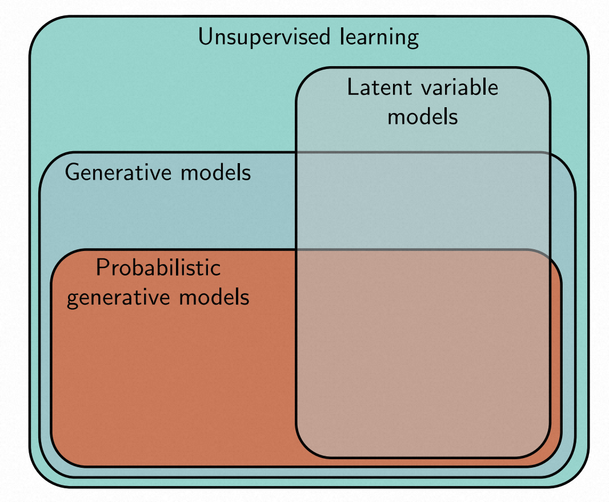
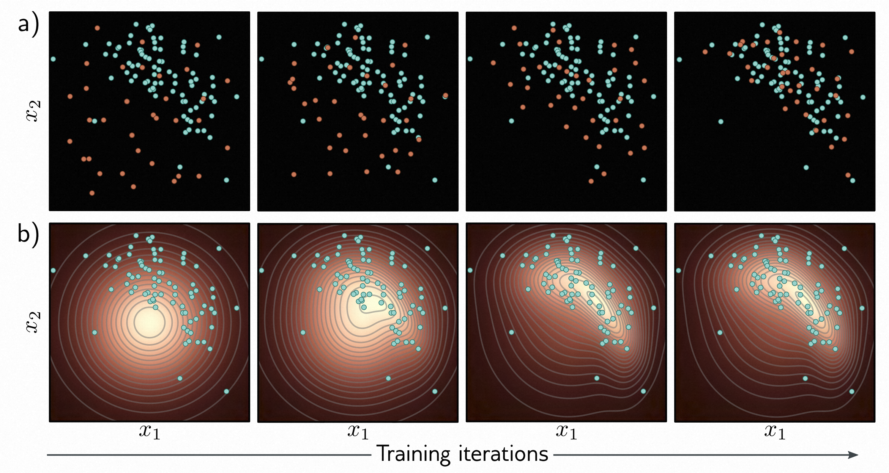
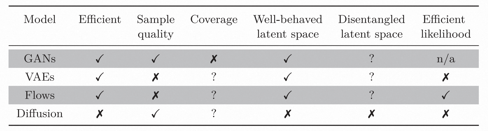
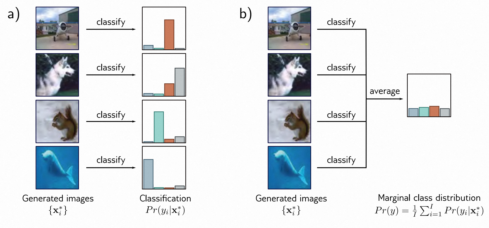
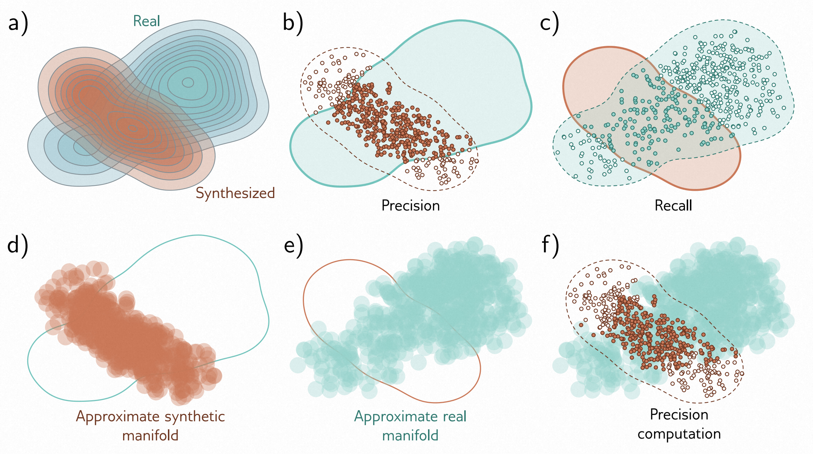

[译]第14章 无监督学习 - Unsupervised learning 《理解深度学习 - Understanding Deep Learning》

本文是基于Simon J.D. Prince 的新书《Understanding Deep Learning》翻译而来；

* 原书介绍、原书（英文）下载、译文进展 以及 译文内容请戳 ↓↓↓
* [ \[译\]《理解深度学习 - Understanding Deep Learning 》 - 目录&前言 - ATA (atatech.org)](https://ata.atatech.org/articles/11020138829)

----

↓↓↓ 以下正文↓↓↓
----

# 本章目录

- [本章目录](#本章目录)
- [第14章 无监督学习 - Unsupervised learning](#第14章-无监督学习---unsupervised-learning)
  - [14.1 无监督学习模型的分类 - Taxonomy of unsupervised learning models](#141-无监督学习模型的分类---taxonomy-of-unsupervised-learning-models)
  - [14.2 一个好的生成模型应具备哪些特点？ - What makes a good generative model?](#142-一个好的生成模型应具备哪些特点---what-makes-a-good-generative-model)
  - [14.3 评估模型性能 - Quantifying performance](#143-评估模型性能---quantifying-performance)
  - [14.4 总结 - Summary](#144-总结---summary)
  - [14.5 笔记 - Notes](#145-笔记---notes)

# 第14章 无监督学习 - Unsupervised learning

在前面的章节[2-9]()中，我们介绍了*监督学习*的流程。我们定义了一个模型，它可以将观测数据 $ \mathbf x $ 映射到输出值 $ \mathbf y $ ，并引入了一个损失函数，用于衡量该映射在训练数据集 $ \{\mathbf x_{i}, \mathbf y_{i}\} $ 上的质量。然后，我们讨论了如何拟合这些模型并评估它们的性能。在章节[10-13]()中，我们介绍了更复杂的模型架构，包括参数共享和允许并行计算的路径。

*无监督学习模型*是指在没有标签的情况下，通过对观察到的一组数据 $ \{\mathbf x_{i}\} $ 进行学习的模型。所有的无监督学习模型都具有这个共同特点，但它们有着不同的目标。这些模型可以用于生成新的合理样本，对样本进行操作、降噪、插值或压缩。它们还可以用于揭示数据集的内部结构（例如将数据分成一致的簇），或者判断新的样本是否属于同一个数据集，或者是异常值。

本章将介绍无监督学习模型的分类方法，并讨论了这些模型的理想特性以及如何评估它们的性能。接下来的四章将详细介绍四种特定的模型：生成对抗网络（GANs）、变分自编码器（VAEs）、归一化流和扩散模型。^[1]^

> ^[1]^ 直到此刻，几乎所有相关的数学内容都已经融入到文中。然而，接下来的四章将需要坚实的概率知识基础。这些章节将包含相关的材料。

## 14.1 无监督学习模型的分类 - Taxonomy of unsupervised learning models

在无监督学习中，一种常见的策略是定义数据样本 $ \mathbf x $ 与一组未见过的 *潜在* 变量 $ \mathbf z $ 之间的映射关系。这些潜在变量捕捉了数据集中的潜在结构，并且通常具有比原始数据更低的维度；从这个意义上说，潜在变量 $ \mathbf z $ 可以被认为是数据样本 $ \mathbf x $ 的一个压缩版本，它捕捉了其本质特质（见图 [1.9-1.10](#figure_1.9-1.10)） 。

在原则上，观测变量和潜在变量之间的映射可以是双向的。一些模型会将数据 $ \mathbf x $ 映射到潜在变量 $ \mathbf z $ 。例如，著名的*k-means*算法将数据 $ \mathbf x $ 映射到一个聚类分配 $ z \in \{1, 2, \ldots, K \} $ 。而其他模型则会将潜在变量 $ \mathbf z $ 映射到数据 $ \mathbf x $ 。在这些模型中，我们考虑定义一个分布 $ Pr(\mathbf z) $ 在潜在变量 $ \mathbf z $ 上。这样，我们可以通过以下步骤生成新的样本：(i) 从该分布中抽样，然后 (ii) 将抽样结果映射到数据空间 $ \mathbf x $ 。因此，这些模型被称为*生成模型(见图 [14.1]())*。

> 图14.1 无监督学习模型的分类
>
> * **无监督学习(Unsupervised learning)** :是指在没有标签的数据集上训练的任何模型。
> * **生成模型(Generative models)** : 可以合成（生成）与训练数据具有相似统计特性的新示例。
> * **概率模型(Probabilistic generative models)**，并定义了数据的分布。我们从这个分布中抽样来生成新的示例。
> * **潜变量模型(Latent variable models)**: 定义了一个从潜在解释（潜变量）到数据的映射。它们可能属于上述任何一类。

第15到第18章的四个模型都是使用潜变量的生成模型。生成对抗网络（第15章）通过使用鼓励生成样本与真实样本难以区分的损失，从潜变量 $ \mathbf z $ 生成数据样本 $ \mathbf x^{∗} $ （图14.2a）。

*归一化流、变分自编码器*和*扩散模型*（第[16-18]()章）都属于*概率生成模型*。它们不仅可以生成新的样本，还可以为每个数据点 $ \mathbf x $ 分配一个概率 $ Pr (\mathbf x|ϕ) $ 。这个概率取决于模型参数 $ ϕ $ 。在训练过程中，我们的目标是最大化观察数据 $ \{\mathbf x_{i}\} $ 的概率。因此，我们将损失定义为负对数似然的累加（见图[14.2b)]()）:

 $$
L[\boldsymbol{\phi}]=-\sum_{i=1}^I\log\Bigl[Pr(\mathbf{x}_i|\boldsymbol{\phi})\Bigr]
\tag{14.1}
 $$

> 图 14.2 拟合生成模型
>
> * a) 生成对抗模型提供了一种生成样本的机制（橙色点）。随着训练的进行（从左到右），损失函数鼓励这些样本逐渐变得与真实样本（青色点）越来越难以区分。
> * b) 概率模型（包括变分自编码器、归一化流和扩散模型）学习了训练数据的概率分布。随着训练的进行（从左到右），真实样本在该分布下的似然性增加，可以用于生成新样本和评估新数据点的概率。

由于概率分布的总和必须等于1，因此这个损失函数隐含地降低了远离观察数据的样本的概率。除了作为训练准则之外，分配概率本身也非常有用。我们可以使用测试集上的概率来定量比较两个模型的性能，也可以使用一个样本的概率来确定它是否属于同一数据集，或者是否是一个*离群值*。^[2]^

> ^[2]^ 需要注意的是，并非所有的概率生成模型都依赖于潜在变量。例如，Transformer解码器（第[12.7]()节）是在没有标签的情况下训练的，它可以生成新的样本，并为这些样本分配概率。然而，Transformer模型的生成过程是基于自回归的（见方程[12.15]()）。

## 14.2 一个好的生成模型应具备哪些特点？ - What makes a good generative model?

基于潜变量的生成模型应满足以下要求：

* **高效的采样(Efficient sampling)：** 从模型中生成样本应该在计算上廉价，并利用现代硬件的并行性。
* **多样性的生成(High-quality sampling)：** 生成模型应该能够生成多样化的样本，而不仅仅是生成与训练数据一模一样的样本。这样可以提供更多的创造性和多样性。
* **准确的拟合(Coverage)：** 生成模型应该能够准确地拟合训练数据的分布，以便能够生成与训练数据相似的样本。这样可以确保生成样本的质量和真实性。
* **可解释性(Well-bahaved latent space)：** 生成模型应该能够提供对生成样本的解释，即能够揭示生成样本产生的原因和机制。这样可以增强对生成模型的理解和信任。
* **稳健性(Disentangled latent space)：** 生成模型应该对输入数据中的噪声和变化具有一定的鲁棒性，能够在存在噪声和变化的情况下仍然生成高质量的样本。
* **可扩展性(Efficient likelihood computation)：** 生成模型应该能够适应不同规模的数据集，并能够在大规模数据集上进行高效的训练和生成。

这自然引发了一个问题：我们所考虑的生成模型是否具备这些属性呢？答案是主观的，但图[14.3]()对此提供了一些指导。具体的分配可能存在争议，但大多数从业者会同意，没有一种单一的模型能够同时满足所有这些特性。

> 图14.3 四种生成模型的特性。生成对抗网络（GANs）、变分自编码器（VAEs）、归一化流（Flows）和扩散模型（Diffusion）都没有完美特性的完整集合。

## 14.3 评估模型性能 - Quantifying performance

在前一节中，我们讨论了生成模型的理想特性。现在我们要考虑如何定量评估生成模型的成功程度。由于图像数据广泛可用且样本质量可以进行定性评估，因此许多生成模型的实验都使用了图像。因此，其中一些评估指标只适用于图像数据。

**测试似然度（Test likelihood）：** 比较概率模型的一种方法是测量它们在测试数据集上的似然度。测量训练数据的似然度是无效的，因为模型可以给每个训练点分配非常高的概率，并在其他区域分配非常低的概率。这种模型的训练似然度很高，但只能复制训练数据。测试似然度捕捉了模型从训练数据中推广的程度，也反映了其覆盖能力；如果模型给训练数据的某个子集分配了很高的概率，那么它必须在其他地方分配较低的概率，因此一部分测试示例将具有较低的概率。

测试似然性是一种合理的量化概率模型的方法。然而，对于生成对抗模型、变分自编码器和扩散模型来说，它们并不涉及概率分配，因此似然性并不相关，并且估计代价很高（尽管可以计算对数似然性的下界）。归一化流是唯一一种能够准确且高效地计算似然性的模型类型。

**创造性评分（Inception Score）** :是一种用于评估生成模型在图像生成任务上的指标。通常情况下，该指标适用于在ImageNet数据库上进行训练的模型。创造性评分利用预训练的分类模型（通常是“Inception”模型）来计算。其计算基于两个标准。首先，对于每个生成的图像 $ \mathbf x^{∗} $ ，它应该看起来像是ImageNet数据库中的1000个可能类别 $ y $ 中的一个且仅一个。因此，生成的图像在正确类别上的概率分布 $ Pr (y_{i}|\mathbf x^{∗}_{i}) $ 应该高度聚集。其次，整组生成的图像应该以等概率分配给各个类别，因此求所有生成示例的平均时，类别概率 $ Pr (y) $ 应该是平坦的。

> 图14.4 创造性评分。
>
> * a) 预训练网络对生成的图像进行分类，如果生成的图像逼真，那么得到的类别概率 $ Pr(y_i|\mathbf x^{∗}) $ 应该在正确的类别上呈现出高峰的形态。
> * b) 如果模型生成的每个类别的频率都是相等的，边际（平均）类别概率应该是平坦的。Inception Score衡量的是（a）中的分布与（b）中的分布之间的平均距离。图片引用自[Deng et al.，2009]()。

创造性评分是衡量深度学习模型在生成集合中表现的一种指标，它计算了生成分布与目标分布之间的平均距离。如果一个分布呈现尖峰形状，而另一个分布呈现平坦形状，那么这个距离就会很大（如图14.4所示）。更具体地说，创造性评分是期望 KL散度 的指数，该指数衡量了生成样本的条件概率分布 $ Pr(y_i|\mathbf x_i^*) $ 和目标分布 $ Pr(y) $ 之间的差异。

$$
IS = \exp\left[\frac1I\sum_{i=1}^ID_{KL}\Big[Pr(y_i|\mathbf{x}_i^*)||Pr(y)\Big]\right]
\tag{14.2}
 $$

其中 $ I $ 表示生成样本的数量。公式14.3表示目标分布的计算方法：

$$
Pr(y) = \frac1I\sum_{i=1}^IPr(y_i|\mathbf{x}_i^*)
\tag{14.3}
$$

需要注意的是，创造性评分只在对ImageNet数据库进行生成时才有意义，并且对于特定的分类模型非常敏感。重新训练模型可能会得到完全不同的数值结果。此外，创造性评分并不考虑同一对象类别内的多样性。如果模型只生成了每个类别的一个逼真样本，评分会更高。

**Fréchet inception distance（FID）：** 这个指标也适用于图像。它衡量了生成样本和真实样本之间分布的对称距离。由于准确描述真实样本的分布是生成模型的首要任务，因此很难精确描述这两个分布。因此，FID通过使用多元高斯分布对这两个分布进行近似，并使用Fréchet距离来估计它们之间的距离。

然而，它并非根据原始数据的距离来进行模拟，而是根据Inception分类网络的最深层激活来进行比较。这些隐藏单元与物体类别之间具有最强相关性，因此比较是在语义层面上进行的，忽略了图像更细粒度的细节。这个度量指标确实考虑了类内多样性，但它严重依赖于Inception网络中特征所保留的信息；如果网络丢弃了任何信息，都不会对结果产生贡献。而一些被丢弃的信息可能仍然对生成逼真的样本至关重要。

**流形的精确度/召回率：** Fréchet inception distance对于样本的真实性和多样性都非常敏感，但无法区分这两个因素。为了解决这个问题，我们考虑了数据流形（即真实样本所在的数据空间子集）与模型流形（即生成样本所在的数据空间子集）之间的重叠部分。*精确度*是指模型生成的样本中落在数据流形内的比例，用来衡量生成样本中真实样本的比例。*召回率*是指真实数据中落在模型流形内的比例，用来衡量模型能够生成的真实数据的比例（见图[14.5]()）。

为了对流形进行估计，我们通过在每个数据示例周围放置超球体来进行近似。这些球体的半径是通过与第k个最近邻的距离来确定的。通过这种方式，我们可以很容易地确定一个新点是否位于流形中。这种流形估计通常是在分类器的特征空间中进行计算的，具有相应的优点和缺点。

> 图14.5 流形精确率/召回率。
>
> * a) 真实样本的真实分布和由生成模型生成的样本分布。
> * b) 重叠部分可以通过*精确度*（合成样本与真实样本分布或流形重叠的比例）来总结，
> * c) 以及*召回率*（真实样本与合成样本流形重叠的比例）。
> * d) 合成样本的流形可以通过将一组以每个样本为中心的超球并集来进行近似。这里，这些超球的半径是固定的，但更常见的是半径基于到第k个最近邻的距离。
> * e) 真实样本的流形也可以类似地进行近似。
> * f) 精确度可以计算为位于样本近似流形内的真实样本比例。类似地，召回率可以计算为位于真实样本近似流形内的样本比例（未显示）。摘自[Kynkäänniemi et al.，2019]()。

## 14.4 总结 - Summary

在没有标签的情况下，无监督模型可以学习数据集的结构。其中一类模型是生成模型，可以生成新的数据样本。另一类模型是概率模型，可以生成新的样本并对观察到的数据分配概率。接下来的四章讨论的模型都以已知分布的潜在变量 $ \mathbf z $ 作为起点，并通过深度神经网络将其映射到观察数据空间。我们考虑了生成模型的理想属性，并引入了试图量化性能的度量标准。

## 14.5 笔记 - Notes

流行的生成模型包括生成对抗网络(GAN)（Goodfellow等，2014），变分自编码器(VAE)（Kingma和Welling，2014），归一化流(NF)（Rezende和Mohamed，2015），扩散模型（Sohl-Dickstein等，2015；Ho等，2020），自回归模型（Bengio等，2000；Van den Oord等，2016b），以及基于能量的模型（LeCun等，2006）。除了能量模型之外，本书讨论了所有这些模型。最近，Bond-Taylor等人（2022）对生成模型进行了调查。

**评估（Evaluation）：** [Salimans et al., 2016]()引入了 inception score，[Heusel et al., 2017]()引入了Fréchet Inception距离，两者都基于Inception V3模型的Pool-3层（[Szegedy et al., 2016]()）。[Nash et al., 2021]()使用了同一网络的较早层，这些层保留了更多的空间信息，以确保图像的空间统计特性也得到了复制。[Kynkäänniemi et al., 2019]()引入了流形精确度/召回率方法。[Barratt & Sharma, 2018]()详细讨论了Inception分数，并指出了其缺点。[Borji, 2022]()讨论了评估生成模型的不同方法的利弊。
