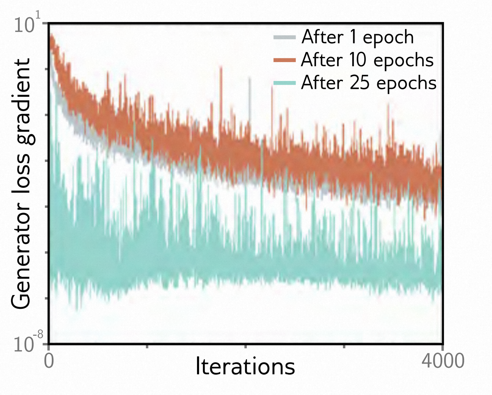

[译]第15章 生成对抗网络 - Generative Adversarial Networks 《理解深度学习 - Understanding Deep Learning》

本文是基于Simon J.D. Prince 的新书《Understanding Deep Learning》翻译而来；

* 原书介绍、原书（英文）下载、译文进展 以及 译文内容请戳 ↓↓↓
* [ \[译\]《理解深度学习 - Understanding Deep Learning 》 - 目录&前言 - ATA (atatech.org)](https://ata.atatech.org/articles/11020138829)

----

↓↓↓ 以下正文↓↓↓
----

# 本章目录

- [本章目录](#本章目录)
- [第15章 生成对抗网络 - Generative Adversarial Networks](#第15章-生成对抗网络---generative-adversarial-networks)
  - [15.1 鉴别器作为一个信号 - Discrimination as a signal](#151-鉴别器作为一个信号---discrimination-as-a-signal)
    - [15.1.1 GAN 损失函数 - GAN loss function](#1511-gan-损失函数---gan-loss-function)
    - [15.1.2 GAN的训练 - Training GANs](#1512-gan的训练---training-gans)
    - [15.1.3 深度卷积生成对抗网络 - Deep convolutional GAN](#1513-深度卷积生成对抗网络---deep-convolutional-gan)
    - [15.1.4 GAN 训练的难点 - Difficulty training GANs](#1514-gan-训练的难点---difficulty-training-gans)
  - [15.2 提高稳定性 - Improving stability](#152-提高稳定性---improving-stability)
    - [15.2.1 GAN损失函数的分析 - Analysis of GAN loss function](#1521-gan损失函数的分析---analysis-of-gan-loss-function)
    - [15.2.2 梯度消失 - Vanishing gradients](#1522-梯度消失---vanishing-gradients)
    - [15.2.3 Wasserstein 距离 - Wasserstein distance](#1523-wasserstein-距离---wasserstein-distance)
    - [15.2.4 离散分布的Wasserstein距离 - Wasserstein distance for discrete distributions](#1524-离散分布的wasserstein距离---wasserstein-distance-for-discrete-distributions)
    - [15.2.5 Wasserstein distance for continuous distributions - Wasserstein distance for continuous distributions](#1525-wasserstein-distance-for-continuous-distributions---wasserstein-distance-for-continuous-distributions)
    - [15.2.6 Wasserstein GAN损失函数 - Wasserstein GAN loss function](#1526-wasserstein-gan损失函数---wasserstein-gan-loss-function)
  - [15.3 渐进增长、小批量区分和截断 - Progressive growing, minibatch discrimination, and](#153-渐进增长小批量区分和截断---progressive-growing-minibatch-discrimination-and)
  - [15.4 条件生成 - Conditional generation](#154-条件生成---conditional-generation)
    - [15.4.1 条件GAN - Conditional GAN](#1541-条件gan---conditional-gan)
    - [15.4.2 辅助分类生成对抗网络 - Auxiliary classifier GAN](#1542-辅助分类生成对抗网络---auxiliary-classifier-gan)
    - [15.4.3 InfoGAN - InfoGAN](#1543-infogan---infogan)
  - [15.5 图像转换 - Image translation](#155-图像转换---image-translation)
    - [15.5.1 Pix2Pix - Pix2Pix](#1551-pix2pix---pix2pix)
    - [15.5.2 对抗损失 - Adversarial loss](#1552-对抗损失---adversarial-loss)
    - [15.5.3 CycleGAN - CycleGAN](#1553-cyclegan---cyclegan)
  - [15.6 StyleGAN - StyleGAN](#156-stylegan---stylegan)
  - [15.7 总结 - Summary](#157-总结---summary)
  - [15.8 笔记 - Notes](#158-笔记---notes)
  - [15.9 问题 - Problems](#159-问题---problems)

# 第15章 生成对抗网络 - Generative Adversarial Networks

*生成对抗网络*（**GAN**）是一种无监督模型，旨在生成与训练样本难以区分的新样本。GAN只是一种创建新样本的机制；它们无法建立模型数据上的概率分布，因此无法评估新数据点属于相同分布的概率。

在生成对抗网络（GAN）中，主要的“生成器”网络通过将随机噪声映射到输出数据空间来创建样本。如果第二个“鉴别器”网络无法区分生成的样本和真实的样本，那么生成的样本必须是可信的。如果鉴别器能够辨别出差异，这个反馈信息可以用来改善样本的质量。这个想法很简单，但是训练 GAN 非常困难：学习算法可能不稳定，尽管 GAN 可能能够学会生成逼真的样本，但并不意味着它们能够生成*所有可能的样本*。

GAN 已经应用于许多类型的数据，包括音频、三维模型、文本、视频和图形。然而，它们在图像领域取得了最大的成功，在那里它们可以生成几乎与真实图片无法区分的样本。因此，本章的示例重点放在合成图像上。

## 15.1 鉴别器作为一个信号 - Discrimination as a signal

我们的目标是生成一组与真实训练数据 $ \{\mathbf x_{i}\} $ 来自同一分布的新样本 $ \{ \mathbf x^{∗}_j \} $。生成单个新样本的过程如下：

* (i) 从一个简单的基础分布（例如标准正态分布）中选择一个 *潜变量* $ \mathbf z_{j} $
* (ii) 然后通过一个带有参数 $ \mathbf θ $ 的网络 $ \mathbf x^{∗} = \mathbf g[\mathbf z_{j}, θ] $ 对这个数据进行处理。

这个网络被称为 *生成器*。在学习过程中，我们的目标是找到参数 $ θ $，使得生成的样本 $ \{\mathbf x_j^* \} $ 看起来与真实数据 $ \{\mathbf x_{i}\} $ "相似"（见图 [14.2a]()）。

相似性可以用很多方式来定义，但生成对抗网络（GAN）使用的原则是样本在统计上应该和真实数据无法区分。为了达到这个目标，引入了第二个网络 $ \mathbf f [•, ϕ] $ ，其中 $ ϕ $ 是参数，被称为“鉴别器”。这个网络的目标是将输入的样本分类为真实示例或生成的样本。如果这是不可能的，那么生成的样本将和真实样本无法区分，也就是说我们取得了成功。如果是可能的，鉴别器将提供一个信号，可以用来改进生成过程。

图[15.1]()展示了这个方案。我们从一个真实的1D示例训练集 $ \{x_{i}\} $ 开始。每个面板（青色箭头）都显示了这些示例的不同批次 $ \{x_{i}\}^{10}_{i=1} $ 。为了生成一批样本 $ \{x_j^*\} $ ，我们使用简单的生成器：

$$
x_j^*=\text{g}[z_j,\theta]=z_j+\theta
\tag{15.1}
$$

其中，潜在变量 $ \{z_{j}\} $ 从标准正态分布中抽取，并且参数 $ θ $ 将生成的样本沿 x 轴平移（图[15.1]()）。

> 图 15.1 GAN 机制。
>
> * a) 给定一个参数化函数（生成器），该函数合成样本（橙色箭头）和一批真实示例（青色箭头），我们训练一个鉴别器来区分真实示例和生成的样本（sigmoid曲线表示数据点是真实的概率）。
> * b) 通过调整生成器的参数，使得鉴别器对于合成样本的置信度降低（在这个例子中，将橙色样本向右移动）。然后更新鉴别器。
> * c) 通过交替更新生成器和鉴别器，使得生成的样本与真实样本无法区分，并减弱改变生成器的动力（即 sigmoid 函数的斜率）。

在初始化时， $ θ = 3.0 $ ，生成的样本（橙色箭头）位于真实样本（青色箭头）的左侧。鉴别器被训练成能够区分生成的样本和真实样本（sigmoid 曲线表示数据点是真实样本的概率）。在训练过程中，会调整生成器的参数 $ θ $ ，以增加其样本被分类为真实样本的概率。在这里，这意味着增加 $ θ $ ，使样本向右移动，sigmoid 曲线的数值更高。

我们在判别器和生成器之间交替进行更新。图[15.1 b-c]()展示了这个过程的两个迭代。随着数据的分类越来越困难，改变 $ θ $ 的动力变得较弱（即S型函数变得更平坦）。在整个过程结束时，无法区分两组数据；判别器的表现现在是随机的，被抛弃了，我们只剩下一个能够生成逼真样本的生成器。

### 15.1.1 GAN 损失函数 - GAN loss function

现在我们来更准确地定义 GAN 的训练损失函数。鉴别器 $ \mathbf f [\mathbf x, ϕ] $ 接受输入 $ \mathbf x $ ，有参数 $ ϕ $ ，并返回一个标量，当它认为输入是真实样本时，这个标量的值会较高。这是一个二元分类任务，因此我们采用二元交叉熵损失函数（第 [5.4]() 节），其原始形式如下：

$$
\hat{\phi}=\operatorname*{argmin}_{\boldsymbol{\phi}}\left[\sum_i-(1-y_i)\log\Bigl[1-\operatorname{sig}[\mathrm{f}[\mathbf{x}_i,\boldsymbol{\phi}]]\Bigr]-y_i\log\Bigl[\operatorname{sig}[\mathrm{f}[\mathbf{x}_i,\boldsymbol{\phi}]]\Bigr]\right]
\tag{15.2}
$$

其中 $ y_{i} \in \{ 0, 1\} $ 是标签， $ \operatorname{sig}[•] $ 是逻辑 sigmoid 函数（见图 [5.7]()）。

在这种情况下，我们假设真实样本 $ \mathbf x $ 的标签为 $ y = 1 $ ，生成的样本 $ \mathbf x^{∗} $ 的标签为 $ y = 0 $ ，所以有：

$$
\hat{\boldsymbol{\phi}}=\underset{\phi}{\operatorname*{argmin}}\left[\sum_{j}-\log\left[1-\operatorname{sig}[\mathrm{f}[\mathbf{x}_j^*,\phi]]\right]-\sum_{i}\log\left[\operatorname{sig}[\mathrm{f}[\mathbf{x}_i,\phi]]\right]\right]
\tag{15.3}
$$

其中 $ i $ 和 $ j $ 分别表示真实样本和生成样本的索引。

现在我们用生成器的定义替换 $ \mathbf x_j^∗ =\mathbf g [\mathbf z_{j}, θ] $ ，并且注意我们必须相对于 $ θ $ 最大化，因为我们希望生成的样本被错误分类（即具有低的合成概率或高的负对数似然）：

$$
\hat{\boldsymbol{\theta}}=\underset{\boldsymbol{\theta}}{\operatorname*{argmax}}\left[\min_{\boldsymbol{\phi}}\left[\sum_{j}-\log\Bigl[1-\operatorname{sig}[\mathrm{f}[\mathrm{g}[\mathbf{z}_j,\boldsymbol{\theta}],\boldsymbol{\phi}]]\Bigr]\Bigr]-\sum_{i}\log\Bigl[\operatorname{sig}[\mathrm{f}[\mathbf{x}_i,\boldsymbol{\phi}]]\Bigr]\right]\right].
\tag{15.4}
$$

### 15.1.2 GAN的训练 - Training GANs

方程[15.4]()是一个比我们之前见过的更复杂的损失函数；鉴别器参数 $ ϕ $ 被调整以最小化损失函数，生成器参数 $ θ $ 被调整以最大化损失函数。GAN的训练被描述为*极小极大博弈*；生成器试图找到欺骗鉴别器的新方法，而鉴别器则寻找区分生成样本和真实样本的新方法。从技术上讲，解决方案是一个*Nash均衡* - 优化算法搜索同时是一个函数最小值和另一个函数最大值的位置。如果训练按计划进行，那么在收敛时，生成的样本 $ \mathbf{g}[\mathbf z, θ] $ 将来自与真实数据相同的分布，而鉴别器的输出 $ \operatorname{sig}[\mathbf{f}[•, ϕ]] $ 将为随机的（即0.5）。

为了训练生成对抗网络（GAN），我们可以将方程[15.4]分解为两个损失函数：

$$
\begin{array}{rcl}
L[\phi]&=&\sum_j-\log\Big[1-\operatorname{sig[f[g[z_j,\theta],\phi]]}\Big]-\sum_i\log\Big[\operatorname{sig[f[x_i,\phi]]}\Big]\\\\
L[\theta]&=&\sum_j\log\Big[1-\operatorname{sig[f[g[z_j,\theta],\phi]]}\Big]\Big]
\end{array}
\tag{15.5}
$$

其中，我们将第二个函数乘以-1，将其转化为一个最小化问题，并去掉了第二项，因为它不依赖于 $ θ $ 。最小化第一个损失函数用于训练鉴别器，最小化第二个损失函数用于训练生成器。

在每一步中，我们从基本分布中抽取一批潜在变量 $ z_j $ ，并通过生成器生成样本 $ x_j^* = \mathbf g[\mathbf z_j, θ] $ 。然后，我们选择一批真实的训练样本 $ \mathbf x_i $ 。有了这两批样本，我们现在可以对每个损失函数进行一次或多次梯度下降步骤（图[15.2]）。

> 图 15.2 GAN 的损失函数。从基本分布中抽取一个潜在变量 $ \mathbf z_j $ ，通过生成器生成一个样本 $ \mathbf x^{∗} $ 。将样本批次 $ \{\mathbf x^{∗}_j\} $ 和真实样本批次 $ \{ \mathbf x_{i} \} $ 传递给判别器，它会给每个样本分配一个概率来判断其真实性。判别器参数 $ ϕ $ 会被调整，使真实样本具有较高的概率，生成样本具有较低的概率。生成器参数 $ θ $ 会被调整，以“欺骗”判别器，使生成样本具有较高的概率。

### 15.1.3 深度卷积生成对抗网络 - Deep convolutional GAN

*深度卷积生成对抗网络*（DCGAN）是一种早期的生成对抗网络架构，专门用于生成图像（图[15.3]()）。生成器接收一个从均匀分布中采样得到的100维潜在变量 $ \mathbf z $ 作为输入。潜在变量首先通过线性变换映射为 $ 4×4 $ 的空间表示，具有1024个通道。然后，通过四个卷积层，每个卷积层都使用分数步长卷积将分辨率加倍（即步长为0.5的卷积）。在最后一层， $ 64×64×3 $ 的信号通过反正切函数生成范围在 $ [-1, 1] $ 之间的图像 $ \mathbf x^{∗} $ 。鉴别器是一个标准的卷积网络，最后一层的卷积层将图像大小减小到 $ 1×1 $ ，通道数为1。这个单一的数字通过sigmoid函数转换为输出的概率。

> 图 15.3 DCGAN 架构。在生成器中，从均匀分布中提取一个100维的潜变量 $ \mathbf z $ ，并经过线性变换映射为具有1024个通道的 $ 4×4 $ 表示。然后，通过一系列卷积层逐渐上采样表示并减少通道数。最后，通过反正切函数将 $ 64×64×3 $ 的表示映射到一个固定范围，以表示一张图像。判别器使用标准的卷积网络，将输入分类为真实样本或生成样本。

训练结束后，判别器被丢弃。为了生成新样本，从基本分布中提取潜变量 $ \mathbf z $ 并通过生成器传递。图[15.4]()展示了一些合成图像的示例。

> 图 15.4 DCGAN模型生成的图片
>
> * a）从面部数据集训练的 DCGAN 中随机生成的样本。
> * b）使用 ImageNet 数据库生成的随机样本（参见图 [10.15]()）。
> * c）从 LSUN 场景理解数据集中随机抽取的样本。改编自 [Radford et al.，2015]()。

### 15.1.4 GAN 训练的难点 - Difficulty training GANs

理论上来说，GAN 相对来说是相当简单的。然而，GAN 的训练过程却以难度高而著称。例如，要使 DCGAN 能够可靠地训练，就需要进行以下操作：

* （i）在上采样和下采样时使用步幅卷积；
* （ii）在生成器和判别器中使用批量归一化（BatchNorm），除了最后一层和第一层之外；
* （iii）在判别器中使用泄露线性整流（leaky ReLU）激活函数（图 [3.13]()）；
* （iv）使用 Adam 优化器，但动量系数低于通常情况。这是不寻常的。大多数深度学习模型对这些选择相对较鲁棒。

一个常见的失败模式是，生成器生成了可信的样本，但这些样本只代表了数据的部分内容（例如，对于人脸，可能永远不会生成有胡须的脸）。这被称为“模式丢失”。在极端情况下，生成器完全或大部分忽略了潜在变量 $ \mathbf z $ ，将所有样本都收敛到一个或少数几个点；这被称为“模式塌陷”（图[15.5]()）。

> 图15.5 模式塌陷。通过使用类似于DCGAN的MLP生成器对LSUN场景理解数据集进行训练的GAN合成的图像。样本质量较低，许多样本相似。改编自[Arjovsky等，2017]()。
>

## 15.2 提高稳定性 - Improving stability

为了理解为什么GAN很难训练，有必要准确理解损失函数代表的是什么。

### 15.2.1 GAN损失函数的分析 - Analysis of GAN loss function

如果我们将等式[15.3]()中的两个求和项除以实际样本和生成样本的数量 $ I $ ， $ J $ ，则可以用期望的方式来表示损失函数：

$$
\begin{array}{rcl}
L[\phi] &=&\frac{1}{J}\sum_{j=1}^{J}\bigg(\log\bigg[1-\mathrm{sig}[\mathrm{f}[\mathbf{x}_j^*,\boldsymbol{\phi}]\bigg]\bigg)+\frac{1}{I}\sum_{i=1}^{I}\bigg(\log\bigg[\mathrm{sig}[\mathrm{f}[\mathbf{x}_i,\boldsymbol{\phi}]]\bigg]\bigg)\\\\
&\approx&\mathbb{E}_{\mathbf{x}^*}\left[\log\Bigl[1-\mathrm{sig}[\mathrm{f}[\mathbf{x}^*,\phi]]\Bigr]\right]+\mathbb{E}_{\mathbf{x}}\biggl[\log\Bigl[\mathrm{sig}[\mathrm{f}[\mathbf{x},\phi]]\Bigr]\biggr] \\\\
&=&\int Pr(\mathbf{x}^*)\log\Bigl[1-\mathrm{sig}[\mathrm{f}[\mathbf{x}^*,\boldsymbol{\phi}]]\Bigr]d\mathbf{x}^*+\int Pr(\mathbf{x})\log\Bigl[\operatorname{sig}[\mathrm{f}[\mathbf{x},\boldsymbol{\phi}]]\Bigr]d\mathbf{x}
\end{array}
\tag{15.6}
$$

这里， $ Pr (\mathbf x^{∗}) $ 表示生成样本的概率分布， $ Pr (\mathbf x) $ 表示真实样本的概率分布。

最优的判别器取决于底层的概率：

$$
Pr(\mathbf{x}\text{ is real})=\text{sig}\big[\text{f}[\mathbf{x},\boldsymbol{\phi}]\big]=\frac{Pr(\mathbf{x})}{Pr(\mathbf{x}^*)+Pr(\mathbf{x})}.
\tag{15.7}
$$

将这个表达式代入方程[15.6]()，我们得到：

$$
\begin{array}{rcl}
L[\phi] =&&\int Pr(\mathbf{x}^*)\log\Bigl[1-\operatorname{sig}[\operatorname{f}[\mathbf{x}^*,\boldsymbol{\phi}]]\Bigr]d\mathbf{x}^*+\int Pr(\mathbf{x})\log\Bigl[\operatorname{sig}[\operatorname{f}[\mathbf{x},\boldsymbol{\phi}]]\Bigr]d\mathbf{x}) \\\\
=&&\int Pr(\mathbf{x}^{*})\log\left[1-\frac{Pr(\mathbf{x})}{Pr(\mathbf{x}^{*})+Pr(\mathbf{x})}\right]d\mathbf{x}^{*}+\int Pr(\mathbf{x})\log\left[\frac{Pr(\mathbf{x})}{Pr(\mathbf{x}^{*})+Pr(\mathbf{x})}\right]d\mathbf{x} \\\\
=&& \int Pr(\mathbf{x}^*)\log\left[\frac{Pr(\mathbf{x}^*)}{Pr(\mathbf{x}^*)+Pr(\mathbf{x})}\right]d\mathbf{x}^*+\int Pr(\mathbf{x})\log\left[\frac{Pr(\mathbf{x})}{Pr(\mathbf{x}^*)+Pr(\mathbf{x})}\right]d\mathbf{x}
\end{array}
\tag{15.8}
$$

忽略加法和乘法常数，这是合成分布 $ Pr (x^{∗}) $ 和真实分布 $ Pr (x) $ 之间的Jensen-Shannon散度：

$$
\begin{array}{rcl}
D_{JS}\Big[Pr(\mathbf{x}^*)||Pr(\mathbf{x})\Big]\\
&=&\frac12D_{KL}\left[Pr(\mathbf{x}^{*})\left|\left|\frac{Pr(\mathbf{x}^{*})+Pr(\mathbf{x})}2\right.\right]+\frac12D_{KL}\left[Pr(\mathbf{x})\left|\left|\frac{Pr(\mathbf{x}^{*})+Pr(\mathbf{x})}2\right.\right]\right.\right. \\\\
&=&\underbrace{\frac12\int Pr(\mathbf{x}^*)\log\left[\frac{2Pr(\mathbf{x}^*)}{Pr(\mathbf{x}^*)+Pr(\mathbf{x})}\right]d\mathbf{x}^*}_{\text{质量}} +\underbrace {\frac12 \int P r ( \mathbf{x})\log\left[\frac{2Pr(\mathbf{x})}{Pr(\mathbf{x}^*)+Pr(\mathbf{x})}\right]d\mathbf{x}}_{\text{覆盖率}}
\end{array}
\tag{15.9}
$$

其中 $ D_{KL}[•||•] $ 是Kullback-Leibler散度。

第一个项表示，如果在样本密度 $ Pr (\mathbf x^{∗}) $ 高的地方，混合概率 $ (Pr (\mathbf x^{∗}) + Pr (\mathbf x) ) /2$ 也很高，那么距离就会很小。换句话说，它惩罚那些有样本 $ \mathbf x^{∗} $ 但没有真实样本 $ \mathbf x $ 的区域；它强调了生成样本的“质量”。

第二个项表示，如果在真实密度 $ Pr (\mathbf x) $ 高的地方，混合概率 $ (Pr (\mathbf x^{∗}) + Pr (\mathbf x) )/2 $ 也很高，那么距离就会很小。换句话说，它惩罚那些有真实样本但没有生成样本的区域。它强调了生成样本的“覆盖率”。根据方程 [15.6]() ，我们可以看到第二个项与生成器无关，因此生成器并不关心覆盖率；它只关心准确地生成可能的样本子集。这可能是模式丢失的原因。

### 15.2.2 梯度消失 - Vanishing gradients

在前一节中，我们看到当判别器达到最优时，损失函数最小化了生成样本和真实样本之间距离的度量。然而，使用概率分布之间的距离作为优化GAN的标准存在潜在问题。如果概率分布完全不相交，这个距离是无穷大的，对生成器的任何微小改动都不会减小损失。同样的现象也可以在考虑原始公式时看到；如果判别器能够完全将生成样本和真实样本分开，对生成数据的任何微小改动都不会改变分类得分（图 [15.6]()）。

> 图 15.6 GAN 损失函数的问题。如果生成的样本（橙色箭头）与真实样本（青色箭头）很容易区分开来，那么鉴别器（sigmoid）在样本位置可能具有非常小的斜率；因此，用于更新生成器参数的梯度可能非常微小。

很不幸，生成的样本和真实样本的分布可能真的是不相交的；生成的样本位于一个大小为潜在变量 $ \mathbf z $ 的子空间中，而真实样本也位于一个低维子空间中，这是由于生成数据的物理过程导致的（图 [1.9]() ）。这些子空间之间可能几乎没有或没有重叠，结果就是梯度非常小或没有梯度。

图 [15.7]() 提供了实证证据支持这个假设。如果冻结 DCGAN 生成器，反复更新鉴别器以提高其分类性能，那么生成器的梯度会下降。简而言之，鉴别器和生成器之间需要一个非常微妙的平衡；如果鉴别器变得太好，生成器的训练更新就会减弱。

> 图 15.7 DCGAN 生成器中的梯度消失。生成器在1、10和25个时期后冻结，判别器继续训练。生成器的梯度迅速下降（注意对数刻度）；如果判别器变得过于准确，生成器的梯度就会消失。改编自[Arjovsky & Bottou, 2017]()。

### 15.2.3 Wasserstein 距离 - Wasserstein distance

前面的章节展示了两点：

* （i）GAN 损失可以用概率分布之间的距离来解释
* （ii）当生成样本与真实样本相差较大时，这个距离的梯度会变为零。

那么很明显，下一步就是选择一个具有更好性质的距离度量。

**Wasserstein距离**，或者（对于离散分布而言）*地球移动者*距离是指将概率质量从一个分布移动到另一个分布所需的工作量。这里的“工作量”是指质量乘以移动的距离。这个概念听起来更靠谱：即使分布是不相交的，Wasserstein距离也有明确定义，并且随着它们彼此靠近而平滑地减小。

### 15.2.4 离散分布的Wasserstein距离 - Wasserstein distance for discrete distributions

对于离散分布来说，Wasserstein距离最容易理解（见图[15.8]()）。考虑在K个箱子上定义的分布 $ Pr(x = i) $ 和 $ q(x = j) $ 。假设将一单位的质量从第一个分布的箱子 $ i $ 移动到第二个分布的箱子 $ j $ 需要成本 $ C_{ij} $ ；这个成本可能是索引之间的绝对差值 $ |i - j| $ 。移动的数量形成了一个**传输计划**，并存储在矩阵 $ \mathbf p $ 中。

> 图 15.8 Wasserstein 距离或者地球物理距离。
>
> * a) 考虑离散分布 $ Pr(x=i) $ 。
> * b) 我们希望通过移动概率质量来创建目标分布 $ q(x=j) $ 。
> * c) 运输计划 $ \mathbf p $ 确定将有多少质量从 $ i $ 移动到 $ j $ 。例如，青色突出显示的正方形 $ p_{54} $ 表示将有多少质量从 $ i=5 $ 移动到 $ j=4 $ 。运输计划的元素必须是非负的，对 $ j $ 的求和必须等于 $ Pr(x=i) $ ，对 $ i $ 的求和必须等于 $ q(x=j) $ 。因此， $ \mathbf p $ 是一个联合概率分布。
> * d) 元素 $ i $ 和 $ j $ 之间的距离矩阵。最优的运输计划 $ \mathbf p $ 通过最小化 $ \mathbf p $ 和距离矩阵的逐点乘积之和（即Wasserstein距离）来实现。因此， $ \mathbf p $ 的元素通常位于距离成本最低的对角线附近。摘自[Hermann , 2017]()。

Wasserstein距离定义如下：

$$
D_w\Big[Pr(x)||q(x)\Big]=\min_\mathbf{P}\left[\sum_{i,j}P_{ij}\cdot|i-j|\right]
\tag{15.10}
$$

 限制条件为：

$$
\begin{array}{rcl}
\sum_jP_{ij}&=&Pr(x=i)&\text{给定}Pr(x)\text{的初始分布}\\\\
\sum_iP_{ij}&=&q(x=j)&\text{给定}q(x)\text{的初始分布}\\\\
P_{ij}&\geq&0&\text{非负质量。}
\end{array}
\tag{15.11}
$$

 换句话说，Wasserstein距离是将一个分布的质量映射到另一个分布的一个受限制的最小化问题的解。这是不方便的，因为我们每次计算距离时都必须解决这个最小化问题中的元素 $ P_{ij} $ 。幸运的是，这是一个标准问题，很容易对小型方程系统进行求解。它是其*原始形式*中的一个*线性规划问题*。
$$
\begin{array}{rrrr|rrrr}
\text{原始形式}&&&&&\text{对偶形式}&&&\\\\
\hline\\\\
\mathrm{极小化}&\mathbf{c}^T\mathbf{p},&&&\mathrm{极大化}&\mathbf{b}^T\mathbf{f},&&\\
\mathrm{满足}&\mathbf{A}\mathbf{p}&=&\mathbf{b}&\mathrm{满足}&\mathbf{A}^T\mathbf{f}&\leq&\mathbf{c}&\\\mathrm{且}&\mathbf{p}&\geq&\mathbf{0}&&&&\end{array}
$$

其中 $ \mathbf p $ 包含确定质量移动量 $ P_{ij} $ 的向量化元素， $ \mathbf c $ 包含距离， $ \mathbf {Ap} = \mathbf b $ 包含初始分布约束，而 $ \mathbf p ≥ 0 $ 确保质量移动是非负的。 ^[1]^

> ^[1]^ 由于篇幅限制，本文省略了数学背景。线性规划是一个标准问题，已有众多已知算法可用于寻找最小解。

对于所有线性规划问题，都存在一个具有相同解的*对偶问题*。在这里，我们最大化一个变量 $ \operatorname
{f} $ ，该变量应用于初始分布，并且受到依赖于距离 $ \mathbf c $ 的约束的限制。对于这个对偶问题的解是：

$$
D_w\Big[Pr(x)\|q(x)\Big]=\max_\mathbf{f}\left[\sum_iPr(x=i)f_i-\sum_jq(x=i)f_j\right]
\tag{15.12}
$$

在这个约束条件下：

$$
|f_{i+1}-f_i|<1
\tag{15.13}
$$

换句话说，我们在优化过程中，使用了一组新的变量 $ \{f_{i}\} $ ，相邻值之间的变化不超过1。

### 15.2.5 Wasserstein distance for continuous distributions - Wasserstein distance for continuous distributions

将这些结果转化为连续多维域，与原始形式（方程[15.10]）等效的是：

$$
D_w\Big[Pr(\mathbf{x}),q(\mathbf{x})\Big]=\min_{\pi[\bullet,\bullet]}\left[\int\int\pi(\mathbf{x}_1,\mathbf{x}_2)\cdot||\mathbf{x}_1-\mathbf{x}_2||d\mathbf{x}_1d\mathbf{x}_2\right]
\tag{15.14}
$$

在传输计划 $ \pi (\mathbf x_{1}, \mathbf x_{2}) $ 上受到与方程[15.11]类似的约束，该计划表示从位置 $ \mathbf x_{1} $ 移动到 $ \mathbf x_{2} $ 的质量。而对偶形式（方程[15.12]）的等效形式是：

$$
D_w\Big[Pr(\mathbf{x}),q(\mathbf{x})\Big]=\max_{\mathrm{f}[\mathbf{x}]}\left[\int Pr(\mathbf{x})\mathrm{f}[\mathbf{x}]d\mathbf{x}-\int q(\mathbf{x})\mathrm{f}[\mathbf{x}]d\mathbf{x}\right]
\tag{15.15}
$$

其中，函数 $ \operatorname{f} [\mathbf x] $ 的Lipschitz常数小于1（即函数的绝对梯度小于1）。

### 15.2.6 Wasserstein GAN损失函数 - Wasserstein GAN loss function

在神经网络的背景下，我们通过优化神经网络 $ \mathbf f [\mathbf x, ϕ] $ 中的参数 $ ϕ $ 来在函数空间 $ \operatorname{f} [\mathbf x] $ 上进行最大化，并且我们使用生成的样本 $ \mathbf x_{i}^∗ $ 和真实样本 $ \mathbf x_{i} $ 来近似这些积分。

$$
\begin{array}{rcl}
L[\phi]&=&\sum_j\mathrm{f}[\mathbf{x}_j^*,\phi]-\sum_i\mathrm{f}[\mathbf{x}_i,\phi]\\\\
&=&\sum_j\mathrm{f}[\mathrm{g}[\mathbf{z}_j,\boldsymbol{\theta}],\phi]-\sum_i\mathrm{f}[\mathbf{x}_i,\boldsymbol{\phi}]
\end{array}
\tag{15.16}
$$

在每个位置 $ \mathbf x $ 处，我们必须限制神经网络判别器 $ \operatorname{f} [\mathbf x_{i}, ϕ] $ 的绝对梯度范数小于1。

$$
\left|\frac{\partial\mathrm{f}[\mathbf{x},\boldsymbol{\phi}]}{\partial\mathbf{x}}\right|<1.
\tag{15.17}
$$

有一种方法是将判别器权重剪裁到一个小范围内（例如 $ [-0.01, 0.01] $ ）。另一种方法是使用 *梯度惩罚Wasserstein GAN* 或 *WGAN-GP*，它添加了一个正则化项，该项随着梯度范数与1的偏离而增加。

## 15.3 渐进增长、小批量区分和截断 - Progressive growing, minibatch discrimination, and

Wasserstein公式使GAN的训练更加稳定。然而，为了生成高质量的图像，我们还需要采取进一步的措施。下面我们将介绍*渐进增长、小批量区分*和*截断*，这些方法都可以提高生成图像的质量。

在*渐进生长*（图[15.9]()）中，我们首先训练一个使用类似于DCGAN的架构合成 $ 4×4 $ 图像的GAN。然后我们向生成器添加后续层，对表示进行上采样和进一步处理，以创建一个 $ 8×8 $ 的图像。鉴别器也添加了额外的层，使其能够接收更高分辨率的图像，并将其分类为生成样本或真实样本。在实践中，更高分辨率的层会逐渐“淡入”；最初，更高分辨率的图像是先前结果的上采样版本，通过剩余连接传递，然后新的层逐渐接管。

> 图15.9 渐进生长。
>
> * a）生成器最初训练用于创建非常小的 $ (4×4) $ 图像，鉴别器用于识别这些图像是合成的还是经过降采样的真实图像。
> * b) 在训练完成低分辨率图像后，我们会在生成器中添加后续层来生成 $ (8×8) $ 的图像。类似的层也会被添加到鉴别器中，进行再次下采样。
> * c) 这个过程会继续创建 $ (16×16) $ 的图像，以此类推。通过这种方式，我们可以训练出生成非常逼真的高分辨率图像的GAN。
> * d) 不同阶段从相同潜在变量中生成的图像分辨率逐渐增加。改编自[Wolf , 2021]()，使用[Karras等人，2018]()的方法。

***小批量区分*** 确保样本具有足够的多样性，从而有助于防止模式崩溃。这可以通过计算合成数据和真实数据的小批量之间的特征统计来实现。这些统计结果可以总结并添加为一个特征图（通常在判别器的末尾）。这样判别器就能向生成器发送一个信号，鼓励它在合成数据中包含与原始数据集中相似的变化量。

***截断*** 是改进生成结果的另一个技巧（图[15.10]()），在采样过程中只选择潜在变量 $ \mathbf z $ 概率较高（即接近均值）的样本。这样可以减少样本的变化，提高其质量。同时，仔细调整标准化和正则化方案也可以提高样本的质量。

通过综合运用这些方法，GANs可以合成出多样且逼真的图像（图[15.11]()）。此外，在潜在空间中平滑移动有时还能产生从一个合成图像到另一个合成图像的逼真插值（图[15.12]()）。

> 图15.10 截断。通过拒绝潜在变量 $ \mathbf z $ 距离均值超过 $ τ $ 个标准差的样本，可以在GAN样本的质量和多样性之间进行权衡。
>
> * a）如果这个阈值较大 $ (τ = 2.0) $ ，样本在视觉上是多样的，但可能存在缺陷。
> * b-c) 随着阈值的降低，视觉质量平均提升，但多样性减少。
> * d) 当阈值非常小的时候，样本几乎完全相同。通过合理地选择阈值，可以提高GAN结果的平均质量。改编自[Brock等人，2019]()。

> 图15.11 渐进增长。这种方法在CELEBA-HQ数据集上训练时可以生成逼真的人脸图像，并在LSUN类别上训练时可以生成更复杂、多样化的物体。改编自[Karras等人，2018]()。

> 图15.12 遍历LSUN汽车训练的渐进GAN的潜在空间。在潜在空间中移动会产生平滑变化的汽车图像。这通常只适用于短期轨迹；最终，潜在变量会移动到产生不真实图像的位置。改编自[Karras等人，2018]()。

## 15.4 条件生成 - Conditional generation

GAN可以生成逼真的图像，但无法指定图像的属性，例如发色、种族或年龄，除非为每种属性组合单独训练GAN。*条件生成*模型可以使我们具备这种控制能力。

### 15.4.1 条件GAN - Conditional GAN

在*条件GAN*中，生成器和判别器都接收一个属性向量 $ \mathbf c $ ，它们分别表示为 $ \mathbf g [\mathbf z, \mathbf c, θ] $ 和 $ \operatorname{f} [\mathbf x, \mathbf c, ϕ] $ 。生成器的目标是将潜在变量 $ \mathbf z $ 转化为具有正确属性 $ \mathbf c $ 的数据样本 $ \mathbf x $ 。判别器的目标是区分（i）具有目标属性的生成样本或（ii）具有真实属性的真实样本（图 [15.13a]() ）。

> Figure 15.13 条件生成.
>
> * a) **条件生成（Conditional GAN）:** 对抗网络的生成器还接收一个属性向量 $ \mathbf c $ ，用于描述图像的某个方面。与往常一样，判别器接收真实样本或生成样本，但现在它还接收属性向量；这既促使生成的样本逼真，又使其与属性相匹配。
> * b) **辅助分类生成对抗网络（Auxiliary classifier GAN , ACGAN）:** 的生成器使用离散属性变量。判别器必须同时（i）确定输入是真实的还是合成的，以及（ii）正确分类。
> * c) **InfoGAN:** 将潜变量分为噪声 $ \mathbf z $ 和未指定的随机属性 $ \mathbf c $ 。判别器必须判断其输入的真实性，并重构这些属性。实际上，这意味着变量 $ \mathbf c $ 对应于数据的显著方面，并具有现实世界的解释（即，潜空间是“解耦”的）。

对于生成器来说，在潜在向量 $ \mathbf z $ 中可以添加属性 $ \mathbf c $ 。对于判别器来说，如果数据是1D的，可以将属性添加到输入中。如果数据是图像，可以将属性线性转换为2D表示，并添加为判别器输入或其中一个隐藏层的额外通道。

### 15.4.2 辅助分类生成对抗网络 - Auxiliary classifier GAN

辅助分类器生成对抗网络（ACGAN）通过要求鉴别器正确预测属性（图15.13b）来简化条件生成。对于具有 $C$ 个不同类别的离散属性，鉴别器将真实或合成图像作为输入，并输出 $C+1$ 个结果；其中第一个结果经过sigmoid函数，用于预测样本是生成的还是真实的。其余的结果经过softmax函数，用于预测数据属于 $C$ 个类别中的每一个的概率。使用这种方法训练的网络能够从ImageNet中合成出多个不同类别的图像（图15.14）。

> 图 15.14 辅助分类器 GAN。生成器不仅接受潜在向量，还接受类标签作为输入。判别器必须既识别数据点是否真实，又预测类标签。该模型是在十个 ImageNet 类别上进行训练的。从左到右：生成的茱莉蔷薇蝴蝶、金翅雀、雏菊、红脚鹬和灰鲸的示例。改编自 [Odena et al. , 2017]() 。

### 15.4.3 InfoGAN - InfoGAN

条件 GAN 和 ACGAN 都可以生成具有预设属性的样本。相比之下，InfoGAN（图 [15.13c]()）尝试自动识别重要的属性。生成器接收由随机噪声变量 $ \mathbf z $ 和 *随机* 属性变量 $ \mathbf c $ 组成的向量作为输入。判别器既预测图像是否真实，又估计属性变量。

我们的洞察力是，可解释的现实世界特征最容易预测，因此会在属性变量 $ \mathbf c $ 中进行表示。 $ \mathbf c $ 中的属性可以是离散的（使用二元或多类交叉熵损失函数）或连续的（使用最小二乘损失函数）。离散变量用于识别数据中的类别，而连续变量用于识别渐进的变化模式（图 [15.15]()）。

> 图15.15 InfoGAN for MNIST
>
> * a) MNIST数据库中的训练样本，包含手写数字的 $ 28×28 $ 像素图像。
> * b) 第一个属性 $ c_{1} $ 是分类型变量，有10个类别；每一列显示的都是由其中一个类别生成的样本。InfoGAN可以恢复这十个数字。属性向量 $ c_{2} $ 和 $ c_{3} $ 是连续的。
> * c) 从左到右，每一列代表了 $ c_{2} $ 的不同值，同时保持其他潜变量不变。这个属性似乎与字符的方向对应。
> * d) 第三个属性似乎与笔画的粗细对应。改编自[Chen et al. , 2016b]()。

## 15.5 图像转换 - Image translation

尽管对抗式鉴别器最初是在生成随机样本的 GAN 中使用的，但它也可以作为一种先验，用于在将一个数据示例转化为另一个数据示例的任务中追求现实主义。这在图像领域最为常见，我们可能希望将灰度图像转化为彩色图像，将噪声图像转化为清晰图像，将模糊图像转化为清晰图像，或将素描转化为逼真的照片。

本节讨论了三种使用不同数量手动标注的图像转换模型。Pix2Pix 模型使用了训练时的前后图像对。对抗损失模型在主模型中使用了前后图像对，但在鉴别器中还利用了未配对的“后”图像。CycleGAN 模型使用了未配对的图像。

### 15.5.1 Pix2Pix - Pix2Pix

Pix2Pix 模型（图 [15.16]() ）是一个网络 $ \mathbf x = \mathbf g [\mathbf c, θ] $，它使用 U-Net（图 [11.10]() ）和参数 $ θ $ 将一个图像 $ \mathbf c $ 转换为不同风格的图像 $ \mathbf x $。一个典型的用例是图像上色，其中输入是灰度图像，输出是彩色图像。输出应该与输入相似，并且通过使用 *内容损失* 来鼓励这一点，该损失惩罚输入和输出之间的 $ ℓ_{1} $ 范数 $ ||\mathbf x-\mathbf g [\mathbf c, θ]||_{1} $。

> 图 15.16 Pix2Pix 模型。
>
> * a）该模型使用U-Net来将输入图像转换为不同风格的预测（详见图[11.10]()）。在这个案例中，它将灰度图像映射为似乎合理的彩色版本。U-Net通过两种损失进行训练。首先，内容损失鼓励输出图像与输入图像具有相似的结构。其次，对抗损失鼓励灰度/彩色图像对在每个局部区域内与真实图像对无法区分。这个框架可以用于许多任务，包括
> * b）地图转换为卫星图像，
> * c）将手提包的草图转换为逼真的示例，
> * d）彩色化
> * e）将标签地图转换为逼真的建筑立面。改编自[Isola et al. ，2017]()。

然而，输出的图像也应该像输入图像的真实转换一样。为了实现这一点，我们引入了一个对抗鉴别器 $ \operatorname{f} [\mathbf c, \mathbf x, ϕ] $ ，它接收输入的前后图像 $ \mathbf c $ 和 $ \mathbf x $ 。在每一步中，鉴别器试图区分真实的前后图像对和合成的前后图像对。通过成功区分它们，我们可以得到一个反馈信号，用来修改U-Net以使其输出更加真实。由于内容损失确保了图像的大规模结构正确，所以鉴别器主要用来确保图像的局部纹理看起来合理。为了达到这个目的，我们使用了*PatchGAN*损失，它是基于一个纯卷积分类器的。在最后一层，每个隐藏单元都表示其感受野内的区域是真实的还是合成的。所有这些响应被平均后得到最终的输出。

这个模型可以被看作是一个条件GAN，其中U-Net作为生成器，与其说是基于标签，不如说是基于图像。然而，需要注意的是，U-Net的输入并不包含噪声，所以在传统意义上并不能称之为"生成器"。有趣的是，原始作者尝试在U-Net中添加了噪声 $ \mathbf z $ ，并且还有输入图像 $ \mathbf c $ 。然而，网络只学会忽略这些噪声。

### 15.5.2 对抗损失 - Adversarial loss

Pix2Pix模型的判别器试图区分图像转换任务中的前/后对是否合理。这种方法的缺点是我们需要有关前/后对的真实数据来利用判别器的损失。幸运的是，我们可以在监督学习的背景下利用对抗判别器的能力，而无需额外的标记训练数据。

如果一个鉴别器可以从监督网络的输出中区分出真实示例和其输出领域中的样本，那么*对抗性损失*就会进行惩罚。因此，监督模型会调整其预测结果以减少这种惩罚。这可以在整个输出的范围内进行，也可以像Pix2Pix算法一样在补丁级别进行。这有助于提高复杂结构输出的*真实感*。然而，这并不一定会在原始损失函数方面得到更好的解决方案。

***超分辨率生成对抗网络*（SRGAN）** 使用了这种方法（图[15.17]()）。主要的模型是一个卷积网络，通过残差连接将低分辨率图像转换为高分辨率图像。该网络通过三种损失进行训练。内容损失衡量输出图像与真实高分辨率图像之间的平方差异。*VGG损失*或*感知损失*通过VGG网络将生成的图像和真实的图像通过，并衡量它们的激活值之间的平方差异。这样可以使生成的图像在语义上与目标图像相似。最后，对抗损失使用一个判别器，试图区分生成的图像是真实的高分辨率图像还是上采样图像。这样可以使生成的图像与真实示例无法区分。

> 图 15.17 超分辨率生成对抗网络（SRGAN）
>
> * a) 通过训练带有残差连接的卷积网络，可以将图像的分辨率提高四倍。这个模型具有一些损失函数，它们鼓励生成的图像与真实高分辨率图像尽可能接近，同时还包括了一个对抗损失函数，以惩罚那些可以与真实高分辨率图像区分开的结果。
> * b) 使用双三次插值进行上采样的图像。
> * c) 使用SRGAN进行上采样的图像。
> * d) 使用双三次插值进行上采样的图像。
> * e) 使用SRGAN进行上采样的图像。引自[Ledig等人，2017]()。

### 15.5.3 CycleGAN - CycleGAN

对抗损失假设我们有主要监督网络的标记过的前后图片。*CycleGAN* 解决的是我们有两组数据，具有不同风格但*没有*匹配对的情况。一个例子是将一张照片转换成莫奈的艺术风格。虽然存在很多照片和莫奈的画作，但它们之间没有一一对应的关系。CycleGAN利用了这样一个思想，即将一张图片从一个方向转换（例如，照片转换为莫奈画作），然后再转回来应该能够恢复原始图片。

CycleGAN的损失函数是三个损失的加权和（图15.18）。内容损失鼓励前后图像的相似性，基于 $ ℓ_{1} $ 范数。对抗损失使用一个鉴别器来保证输出和目标域中的真实样本无法区分。最后，*循环一致性*损失鼓励映射的可逆性。这里，两个模型同时进行训练。一个将第一个域映射到第二个域，另一个则相反。如果翻译后的图像能够成功地再次翻译回原始域中的图像，那么循环一致性损失将很低。该模型通过结合这三个损失来训练网络，实现图像从一种风格转换到另一种风格，然后再转换回原始风格。

> 图15.18 CycleGAN。两个模型同时进行训练。第一个模型通过将第一个风格（马）的图像 $ \mathbf c $ 转换为第二个风格（斑马）的图像 $ \mathbf c^′ $ 来进行训练。而第二个模型则通过将第二个风格（斑马）的图像 $ \mathbf c^′ $ 转换回第一个风格（马）的图像 $ \mathbf c $ 来进行训练。如果两个模型不能成功地将图像转换到另一个风格，并返回原始图像，循环一致性损失将对两个模型进行惩罚。此外，两个对抗性损失鼓励转换后的图像看起来像目标风格的真实示例（这里仅显示斑马）。而两个内容损失则鼓励映射前后的图像细节和布局相似（即斑马的位置和姿势与马相同，背景也相同，反之亦然）。引自[Zhu et al. , 2017]()。

## 15.6 StyleGAN - StyleGAN

StyleGAN是一种更现代的生成对抗网络（GAN），它将数据集中的变化划分为有意义的组成部分，每个部分由一部分潜在变量控制。特别是，StyleGAN可以控制不同尺度上的输出图像，并将样式与噪声分离。对于人脸图像来说，大尺度的变化包括脸型和头部姿势，中尺度的变化包括面部特征的形状和细节，细小尺度的变化包括头发和皮肤颜色。样式部分代表了对人类来说重要的图像特征，而噪声部分则代表了不重要的变化，比如头发、胡须、雀斑或皮肤毛孔的具体位置。

迄今为止，我们见过的生成对抗网络（GANs）都是从一个从标准基本分布中抽取的潜在变量 $ \mathbf z $ 开始。这个潜在变量经过一系列的卷积层处理后，生成输出图像。然而，在生成器中，我们可以在不同的位置引入潜在变量，并以不同的方式修改当前表示。StyleGAN 通过巧妙地选择这些方式来控制尺度，并将风格与噪音分开（图[15.19]()）。

> 图 15.19 StyleGAN。主要的流程（中间行）以一个已学习的常数表示（灰色框）开始。通过一系列卷积层，逐渐上采样生成输出。噪声（顶行）通过定期添加具有通道缩放 $ ψ_• $ 的高斯变量 $ \mathbf z_• $ 在不同尺度上进行添加。高斯风格变量 $ \mathbf z $ 经过全连接网络生成中间变量 $ \mathbf w $ （底行）。这些变量用于在流程的各个阶段设置每个通道的均值和方差。

StyleGAN的主要生成分支从一个512通道的 $ 4×4 $ 的学习到的常数表达式开始。它通过一系列的卷积层逐渐上采样表示，以生成最终分辨率的图像。在每个尺度上引入了两组随机潜在变量，分别表示风格和噪声；它们离输出越近，表示的细节尺度就越精细。

表示噪声的潜在变量是独立采样的高斯向量 $ \mathbf z_{1}, \mathbf z_{2},\ldots $ ，它们在主要生成过程的每个卷积操作之后以叠加的方式注入。它们与主表达式在被添加的位置具有相同的空间尺寸，但是乘以学习到的每个通道的缩放因子 $ ψ_{1}, ψ_{2}, \ldots $ ，所以对每个通道的贡献不同。随着网络分辨率的增加，这种噪声在更精细的尺度上发挥作用。

代表风格的潜变量最初是一个 $ 1×1×512 $ 的噪音张量，通过一个七层全连接网络传递，生成一个中间变量 $ \mathbf w $ 。这使得网络能够解耦风格的各个方面，使得 $ \mathbf w $ 的每个维度可以表示一个独立的现实世界因素，例如头部姿势或发色。然后，将这个变量 $ \mathbf w $ 线性转换为一个 $ 2×1×512 $ 的张量 $ \mathbf y $ ，并用于在噪声添加后调整主分支中每个通道在空间位置上的均值和方差。这个过程被称为*自适应实例标准化（图 [11.14e]()）。在主分支的不同位置多次注入一系列的向量 $ \mathbf y_{1}, \mathbf y_{2}  ，\ldots，$ 以便相同的风格在不同的尺度上发挥作用。图[15.20]()展示了在不同尺度上操纵风格和噪声向量的示例。

> 图 15.20 StyleGAN 的结果。前四列展示了不同尺度上风格的系统变化。第五列展示了增加噪声幅度的效果。最后两列展示了在两个不同尺度上的不同噪声向量。

## 15.7 总结 - Summary

GANs 学习一个生成器网络，将随机噪声转化为与训练集几乎无法区分的数据。为此，生成器使用一个判别器网络进行训练，该网络试图区分真实样本和生成样本。然后，生成器被更新，以使其创建的数据被判别器认定为更"真实"的数据。这个想法原本存在的一个缺陷是，当容易确定样本是真实还是生成的时候，训练信号会很弱。因此出现了改进的 Wasserstein GAN，它提供了一个更一致的训练信号。

我们回顾了用卷积GAN生成图像的方法，以及一系列提高生成图像质量的技巧，包括渐进增长、小批量区分和截断。条件GAN的结构引入了辅助向量，可以对输出进行控制（例如，选择对象类别）。图像转换任务在保留了条件信息的同时去除了随机噪声。GAN的判别器现在作为额外的损失项，有利于生成"逼真"的图像。最后，我们介绍了StyleGAN，它通过在生成器中巧妙地注入噪声，可以控制不同尺度上的样式和噪声。

## 15.8 笔记 - Notes

生成对抗网络（GAN）是由[Goodfellow et al., 2014]()提出的。早期的研究进展可以在[Goodfellow, 2016]()中找到。近期的综述包括[Creswell et al., 2018]()和[Gui et al., 2021]()。[Park et al., 2021]()提供了一个关注计算机视觉应用的GAN模型的综述。[Hindupur, 2022]()维护了一个包含已命名GAN模型的列表（目前有501个模型），从ABC-GAN（[Susmelj et al., 2017]()）到ZipNet-GAN（[Zhang et al., 2017b]()）。[Odena, 2019]()列出了与GAN相关的待解决问题。

**数据：** GAN主要是为图像数据开发的。例如，本章介绍的深度卷积GAN（[Radford等人，2015年]()）、渐进式GAN（[Karras等人，2018年]()）和StyleGAN（[Karras等人，2019年]()）模型。因此，大多数GAN都基于卷积层，然而最近也有一些利用生成器和判别器中的transformer来捕捉长程相关性的GAN被开发出来（例如SAGAN，[Zhanget al.，2019b]()）。除此之外，GAN还被用于生成分子图（[De Cao＆Kipf，2018年]()）、语音数据（[Saito等人，2017年]()；[Donahue等人，2018b]()；[Kaneko＆Kameoka，2017年]()；[Fang等人，2018年]()）、EEG数据（[Hartmann等人，2018年]()）、文本（[Lin等人，2017a]()；[Fedus等人，2018年]()）、音乐（[Mogren，2016年]()；[Guimaraes等人，2017年]()；[Yu等人，2017年]()）、3D模型（[Wu等人，2016年]()）、DNA（[Killoran等人，2017年]()）和视频数据（[Vondrick等人，2016年]()；[Wang等人，2018a]()）。

**GAN损失函数：** 最初声称GAN在训练过程中会收敛到纳什均衡。然而，最新的证据表明这并不总是成立。有研究人员发现最初的GAN损失函数是不稳定的，因此提出了不同的公式。例如，有人引入了最小二乘GAN，通过选择适当的参数，可以隐含地最小化皮尔逊 $ χ^{2} $ 散度。还有人认为Jensen-Shannon散度是更大的f-散度家族的一个特例，并证明了任何f-散度都可以用于训练GAN。此外，还有人提出了相对论GAN，判别器不再估计真实数据和生成数据的绝对概率，而是估计真实数据比生成数据更真实的概率。还有人将GAN重新表述为一个通用的基于能量的框架，判别器将低能量归因于真实数据，将高能量归因于其他地方。举个例子，他们使用了一个自编码器，并将能量基于重构误差。

[Arjovsky & Bottou，2017]()分析了GAN中的梯度消失问题，并由此提出了基于"地球运输距离/最优传输"的Wasserstein GAN（[Arjovsky et al.，2017]()）。Wasserstein GAN的公式要求鉴别器的Lipschitz常数小于1；原始论文提出了剪辑鉴别器权重的方法，但后续的研究则采用了梯度惩罚（[Gulrajani et al.，2016]()）或应用了谱归一化（[Miyatoet al.，2018]()）来限制Lipschitz常数。关于Wasserstein GAN的其他变种由[Wu et al.，2018a]()，[Bellemare et al.，2017b]()和[Adler & Lunz，2018]()引入。[Hermann，2017]()在一篇优秀的博客文章中讨论了对偶性和Wasserstein GAN。如果你想了解更多关于最优传输的信息，请参考[Peyré et al.，2019]()的书籍。[Lucic et al.，2018]()对GAN损失函数进行了实证比较。

**训练 GAN 的技巧：** 有很多启发式方法可以提高训练 GAN 的稳定性和最终结果的质量。[Marchesi，2017]()首次使用了截断技巧（图 [15.10]()），以在 GAN 输出的多样性和质量之间达到平衡。这个方法也被[Pieters＆Wiering，2018]()和[Brock等，2019]()提出，并增加了一个正则化项，鼓励生成器中的权重矩阵正交。这意味着截断潜在变量与截断输出方差之间有更密切的关系，并且可以提高样本的质量。

其他的技巧包括只使用最真实的前K个图像的梯度（[Sinha et al.，2020]()），在判别器中使用标签平滑（[Salimans et al.，2016]()），使用生成图像的历史而不是最新生成器产生的图像来更新判别器，以避免模型的“振荡”（[Salimans et al.，2016]()），并在判别器输入中添加噪声（[Arjovsky＆Bottou，2017]()）。[Kurach et al.，2019]()对GAN中的标准化和正则化进行了概述。[Chintala et al.，2020]()提供了进一步训练GAN的建议。

**样本多样性：** 最初的 GAN 论文（Goodfellow等人，2014）认为，只要容量、训练样本和计算时间足够，GAN 就可以学会让生成的样本与真实分布之间的差异最小化。然而，后续的研究对此提出了质疑。Arora等人（2017）指出，鉴别器的有限容量意味着即使输出分布的变化有限，GAN 的训练目标也可以接近最优值。Wuet al.（2017）使用退火重要性采样近似计算 GAN 生成的分布的对数似然，并发现生成的分布与真实分布存在不匹配。Arora和Zhang（2017）要求人类观察员识别出 GAN 生成的（近似）重复样本，并通过这些重复样本的频率推断图像的多样性。他们发现，对于 DCGAN，400个样本中有重复出现的概率超过50%；这意味着支持的大小约为400,000，小于训练集的大小。他们还表明，多样性随着鉴别器规模的增加而增加。Bau等人（2019）采用了不同的方法，研究了 GAN 无法生成的数据空间的部分内容。

**增加多样性和防止模式坍塌：** 缺乏多样性的极端情况是*模式坍塌*，即网络反复生成相同的图像（[Salimans et al.，2016]()）。这在条件生成对抗网络中是一个特殊的问题，因为有时会完全忽略潜在变量，输出仅仅取决于条件信息。[Mao et al.，2019]()引入一种正则化项来帮助防止条件生成对抗网络中的模式坍塌，该项通过最大化生成图像与相应潜在变量之间的距离比率来鼓励输出的多样性。其他旨在减少模式坍塌的工作包括VEEGAN（[Srivastava et al.，2017]()），它引入了一个重构网络，将生成的图像映射回原始的噪声，从而防止了从噪声到图像的多对一映射。

[Salimans等，2016]()建议在小批量计算统计数据，并通过鉴别器确保这些数据与真实图像批次的统计数据无法区分，这被称为“小批量鉴别”，此方法通过在鉴别器的最后添加一层实现，该层学习每个图像的张量以捕捉批处理的统计数据。[Karras等，2018]()对此进行了简化，他们在小批量上计算每个空间位置上每个特征的标准差，然后对空间位置和特征进行平均，得出一个单一的估计值，再复制一份得到一个单一的特征图，该特征图附加在鉴别器网络的末端。[Lin等，2018]()将连接的（真实或生成的）样本传递给鉴别器，并提供了关于如何向鉴别器提供多个样本以增加多样性的理论分析。MAD-GAN（[Ghosh等，2018]()）通过使用多个生成器，并要求单个鉴别器识别生成器创建的样本，从而提供一个信号来帮助推动生成器创建不同于其他生成器的样本，以增加GAN样本的多样性。

**多尺度：** 为了确保图像在所有频带上的质量都很高，[Wang et al. , 2018b]()采用了不同尺度上的多个判别器。其他研究也提出了在不同分辨率下定义生成器和判别器的方法（[Denton et al. , 2015](); [Zhang et al. , 2017d](); [Huang et al. , 2017c]()）。[Karras et al. , 2018]()引入了一种渐进增长的方法（图[15.9]()），该方法相对简单且训练速度更快。

**StyleGAN:** [Karras et al. , 2019]() 提出了 StyleGAN 框架（第 [15.6](#stylegan) 节）。在随后的工作中（[Karras et al. ，2020b]()），他们通过重新设计生成器中的归一化层，消除了“水滴”伪影，并通过改变渐进增长框架，减少了细节不随粗略细节变化的伪影，从而提高了生成图像的质量。此外，还开发了使用有限数据训练 GAN 的方法（[Karras et al. ，2020a]()），修复了混淆伪影（[Karras et al. ，2021]()）。大量的研究工作发现并操作 StyleGAN 中的潜在变量来编辑图像（例如，[Abdal et al. ，2021]()；[Collins et al. ，2020]()；[Härkönen et al. ，2020]()；[Patashnik et al. ，2021]()；[Shenet al. ，2020b]()；[Tewari et al. ，2020]()；[Wu et al. ，2021]()；[Roich et al. ，2022]()）。

**条件生成对抗网络（Conditional GANs）：** 条件生成对抗网络是由[Mirza & Osindero, 2014]()开发的，辅助分类生成对抗网络是由[Odena等人，2017]()开发的，InfoGAN是由[Chen等人，2016b]()开发的。这些模型的判别器通常将条件信息附加到判别器输入（[Mirza & Osindero, 2014]()；[Denton等人，2015]()；[Saito等人，2017]()）或者附加到判别器中间隐藏层（[Reed等人，2016a]()；[Zhang等人，2017d]()；[Perarnau等人，2016]()）。然而，[Miyato & Koyama，2018]()尝试在判别器的一层中使用嵌入式条件信息与内积的方法，这受到了潜在概率模型中类别信息的影响。GAN生成的图像可以根据类别（如[Odena等人，2017]()）、输入文本（[Reed等人，2016a]()；[Zhang等人，2017d]()）、属性（[Yan等人，2016]()；[Donahue等人，2018a]()；[\mathbf xiao等人，2018b]()）、边界框和关键点（[Reed等人，2016b]()）以及图像（如[Isola等人，2017]()）进行条件约束。

**图像翻译：** [Isola等人，2017]()开发了Pix2Pix算法（图[15.16]()），随后[Wang等人，2018b]()开发了一个更高分辨率结果的类似系统。StarGAN（[Choi等人，2018]()）使用单个模型在多个领域之间进行图像到图像的翻译。循环一致性损失的概念由[Zhou等人，2016b]()在DiscoGAN和[Zhu等人，2017]()在CycleGAN（图[15.18]()）中引入。

**对抗性损失：** 在许多图像翻译任务中，并没有"生成器"；这样的模型可以看作是具有对抗性损失的监督学习任务，以提高图像的真实感。[Ledig等人，2017]()的超分辨率算法是一个很好的例子（图[15.17]()）。[Esser等人，2021]()使用了一个带有对抗性损失的自编码器。该网络接收一张图像，将其表示大小减小以创建一个"瓶颈"，然后通过这个减小的数据空间重新构建图像。在实践中，该架构类似于编码器-解码器网络（例如，图[10.19]()）。经过训练，自编码器能够产生接近图像并具有高度逼真性的结果。他们对自编码器的瓶颈进行矢量量化（离散化），然后使用transformer解码器学习离散变量上的概率分布。通过从该transformer解码器中进行采样，他们能够生成极大且高质量的图像。

**反转 GANs：**一种编辑真实图像的方法是将其映射到潜在空间，操纵潜在变量，然后重新映射到图像空间。这个过程称为*重合成*。不幸的是，GANs 只能从潜在变量映射到观察数据，而不能反过来。因此，出现了一些反转 GANs 的方法（即找到与观察图像最相似的潜在变量）。这些方法可以分为两类。第一类是学习一个将方向反转的网络（[Donahue et al.，2018b](); [Luo et al.，2017a](); [Perarnau et al.，2016](); [Dumoulin et al.，2017](); [Guan et al.，2020]()），这被称为*编码器*。第二类方法是从某个潜在变量 $ \mathbf z $ 开始，对其进行优化，直到尽可能准确地重建图像（[Creswell & Bharath，2018](); [Karras et al.，2020b](); [Abdal et al.，2019](); [Lipton & Tripathi，2017]()）.[Zhu et al.，2020a]() 结合了这两种方法。

StyleGAN 的反转引起了特别大的关注，因为它能够产生出色的效果，并且可以在不同的尺度上控制图像。不幸的是，[Abdal et al.，2020年]() 表明，在没有伪影的情况下无法完美地反转 StyleGAN，并提出了将其反转到扩展风格空间，而 [Richardson et al., 2021年]() 训练了一个可靠的编码器将其映射到该空间。即使反转到扩展空间后，对于超出领域的图像进行编辑可能仍然效果不佳。[Roich et al., 2022年]() 解决了这个问题，他们通过微调 StyleGAN 的生成器来实现图像的精确重构，并展示了良好的编辑结果。他们还添加了额外的项来精确重构附近的点，以便修改是局部的。这种技术被称为“关键微调”。在 [\mathbf xia et al., 2022年]() 中可以找到关于 GAN 反转技术的调查。

**使用GAN进行图像编辑：** iGAN（[Zhu et al.，2016]（））允许用户通过涂鸦或扭曲现有图像的部分进行交互式编辑。然后，该工具会调整输出图像，使其既逼真又符合这些新的约束条件。它通过寻找一个潜在向量来生成一个与编辑图像相似且符合任何添加线条的边缘图的图像。通常还会添加一个蒙版，以仅更改靠近编辑部分的图像区域。EditGAN（[Ling et al.，2021]（））同时对图像及其语义分割蒙版进行建模，并允许对蒙版进行编辑。

## 15.9 问题 - Problems

**问题15.1** 当 $ q（\mathbf x）= Pr（\mathbf x） $ 时，方程[15.8]中的损失将是多少？

**问题15.2**∗ 写出将方程[15.8]中的损失 $ L $ 与方程[15.9]中的Jensen-Shannon距离 $ D_{JS} [q（\mathbf x）||Pr（\mathbf x）] $ 相关联的方程。

**问题 15.3** 考虑使用原始形式的线性规划计算地球移动距离。离散分布 $ Pr (x = i) $ 和 $ q (x = j) $ 定义在 $ \mathbf x = 1, 2, 3, 4 $ 上，并且：

$$
\mathbf{b}=\begin{bmatrix}Pr(x=1),Pr(x=2),Pr(x=3),Pr(x=4),q(x=1),q(x=2),q(x=3),q(x=4)\end{bmatrix}^T
\tag{15.18}
$$

请列出 $ 8×16 $ 矩阵 $ A $ 的内容。可以假设向量 $ \mathbf P $ 的内容已按列进行了排列。

**问题 15.4**∗ 计算 (i) $ KL $ 散度，(ii) 反向 $ KL $ 散度，(iii) Jensen-Shannon 散度和 (iv) Wasserstein 距离两个分布之间的距离：

$$
Pr(z)=\begin{cases}0&\quad z<0\\1&\quad0\leq z\leq1\\0&\quad z>1\end{cases},\quad\text{和}\quad Pr(z)=\begin{cases}0&\quad z<a\\1&\quad a\leq z\leq a+1\\0&\quad z>a&\end{cases}.
$$

对于范围 $ a \in [-3, 3] $ 的情况，我们可以得到Wasserstein距离的一个特殊案例公式，这里考虑到必须移动的总的"地球"（即概率质量），并将其与它必须移动的距离的平方相乘。

**问题15.5** 一维高斯分布之间的 $ KL $ 距离和Wasserstein距离分别为：
$$
D_{kl}=\log\left[\frac{\sigma_2}{\sigma_1}\right]+\frac{\sigma_1^2+(\mu_1-\mu_2)^2}{2\sigma_2^2}-\frac12
\tag{15.20}
$$

和

$$
D_w=(\mu_1-\mu_2)^2+\sigma_1+\sigma_2-2\sqrt{\sigma_1\sigma_2},
\tag{15.21}
$$

在 $ σ^{1} = σ^{2} = 1 $ 的特殊情况下，将这些距离作为 $ µ_{1} $ 和 $ µ_{2} $ 的函数进行绘制。

**问题 15.6** 假设有一个维度为 100 的潜变量 $ \mathbf z $ 。我们将其值截断为 (i) $ τ = 2.0 $ ，(ii) $ τ = 1.0 $ ，(iii) $ τ = 0.5 $ ，(iv) $ τ = 0.04 $ 个标准偏差。在每种情况下，原始概率分布中被忽略的比例是多少？
