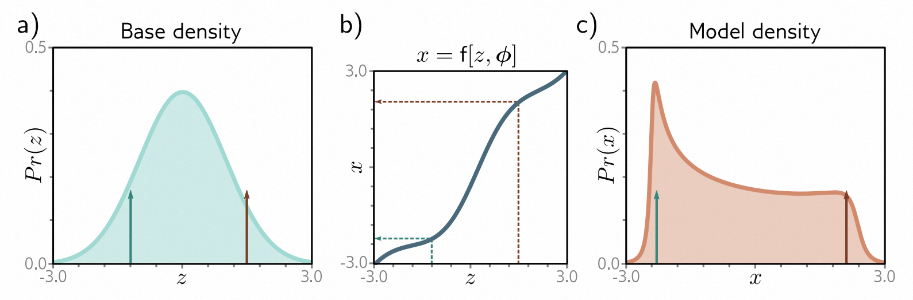
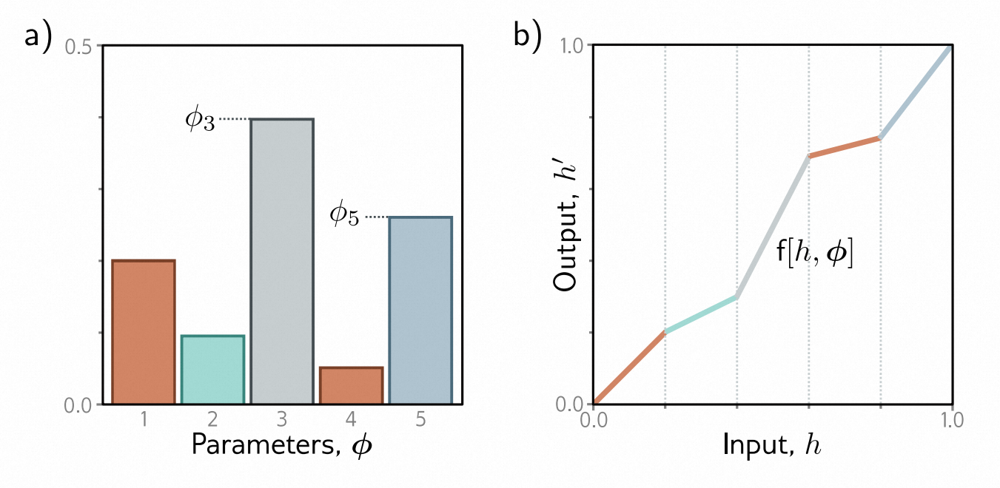

[译]第16章 正则流 - Normalizing flows 《理解深度学习 - Understanding Deep Learning》7

本文是基于Simon J.D. Prince 的新书《Understanding Deep Learning》翻译而来；

* 原书介绍、原书（英文）下载、译文进展 以及 译文内容请戳 ↓↓↓
* [ \[译\]《理解深度学习 - Understanding Deep Learning 》 - 目录&前言 - ATA (atatech.org)](https://ata.atatech.org/articles/11020138829)

----

↓↓↓ 以下正文↓↓↓
----

# 本章目录

- [本章目录](#本章目录)
- [第16章 正则流 - Normalizing flows](#第16章-正则流---normalizing-flows)
  - [16.1 1D示例 - 1D example](#161-1d示例---1d-example)
  - [16.1.1 测量概率 - Measuring probability](#1611-测量概率---measuring-probability)
    - [16.1.2 正向映射和逆向映射 - Forward and inverse mappings](#1612-正向映射和逆向映射---forward-and-inverse-mappings)
    - [16.1.3 学习 - Learning](#1613-学习---learning)
  - [16.2 一般情况 - General case](#162-一般情况---general-case)
    - [16.2.1 用神经网络来定义正向映射 - Forward mapping with a deep neural network](#1621-用神经网络来定义正向映射---forward-mapping-with-a-deep-neural-network)
    - [16.2.2 网络层的要求 - Desiderata for network layers](#1622-网络层的要求---desiderata-for-network-layers)
  - [16.3 可逆网络层 - Invertible network layers](#163-可逆网络层---invertible-network-layers)
    - [16.3.1 线性流 - Linear flows](#1631-线性流---linear-flows)
    - [16.3.2 逐元素流动 - Elementwise flows](#1632-逐元素流动---elementwise-flows)
    - [16.3.3 耦合流 - Coupling flows](#1633-耦合流---coupling-flows)
    - [16.3.4 自回归流 - Autoregressive flows](#1634-自回归流---autoregressive-flows)
    - [16.3.5 逆自回归流 - Inverse autoregressive flows](#1635-逆自回归流---inverse-autoregressive-flows)
    - [16.3.6 残差流:iRevNet - Residual flows: iRevNet](#1636-残差流irevnet---residual-flows-irevnet)
    - [16.3.7 残差流与收缩映射：iResNet - Residual flows and contraction mappings: iResNet](#1637-残差流与收缩映射iresnet---residual-flows-and-contraction-mappings-iresnet)
  - [16.4 多尺度流 - Multi-scale flows](#164-多尺度流---multi-scale-flows)
  - [16.5 应用 - Applications](#165-应用---applications)
    - [16.5.1 密度建模 - Modeling densities](#1651-密度建模---modeling-densities)
    - [16.5.2 合成 - Synthesis](#1652-合成---synthesis)
    - [16.5.3 近似其他密度模型 - Approximating other density models](#1653-近似其他密度模型---approximating-other-density-models)
  - [16.6 总结 - Summary](#166-总结---summary)
  - [16.7 笔记 - Notes](#167-笔记---notes)
  - [16.8 问题 - Problems](#168-问题---problems)

# 第16章 正则流 - Normalizing flows

在第15章，我们介绍了生成对抗网络（GAN）。这是一种生成模型，通过将潜在变量通过深度网络传递以创建新样本。GAN的训练原则是使生成的样本与真实数据无法区分。然而，它们并没有定义数据示例的分布，因此评估一个新示例属于同一数据集的概率并不简单。

在本章中，我们将介绍“正则流”。通过使用深度网络将简单分布转变为更复杂的分布，正则流可以学习一个概率模型。正则流不仅可以从该分布中进行采样，还可以评估新示例的概率。而为了实现这一点，正则流需要使用一种特殊的架构：每层都必须是可逆的，即能够在两个方向上转换数据。

## 16.1 1D示例 - 1D example

标准化流是一种概率生成模型：它将一个概率分布拟合到训练数据中（图[14.2b]()）.考虑对一个1D分布 $ Pr (x) $ 进行建模。标准化流从一个简单可计算的“基础”分布 $ Pr (z) $ 开始，该分布定义了一个潜在变量 $ z $ ，并应用一个函数 $ x = \operatorname f [ z, ϕ] $ ，其中参数 $ ϕ $ 被选择为使得 $ Pr ( x) $ 具有所需的分布（图[16.1]()）。生成一个新的示例 $ x^{∗} $ 很容易；我们从基础密度中抽取 $ z^{∗} $ ，并通过函数传递，以得到 $ x^{∗} = \operatorname f [z^{∗}, ϕ] $ 。

> 图 16.1 转换概率分布。
>
> * a）基础密度是在一个潜在变量 $ z $ 上定义的标准正态分布。
> * b) 这个变量经过函数 $ x = \operatorname f [ z, ϕ] $ 的转换，得到了一个新的变量 $ x $ ，
> * c) 其具有了一个新的分布。为了从这个模型中进行抽样，我们从基础密度中抽取了值 $ z $ （面板（a）中的绿色和棕色箭头展示了两个示例）。然后，我们将这些值通过函数 $ \operatorname{f} [ z, ϕ] $ （面板（b）中的虚线箭头展示）传递，生成了 $ x $ 的值，这些值在面板（c）中用箭头表示。

## 16.1.1 测量概率 - Measuring probability

测量数据点 $ x $ 的概率很有挑战性。考虑将函数 $ \operatorname{f} [ z, ϕ] $ 应用于具有已知密度 $ Pr (z) $ 的随机变量 $ \mathbf z $ 上。函数会在被拉伸的区域导致概率密度减小，在被压缩的区域导致概率密度增加，以保持新分布下的总概率为一。函数 $ \operatorname{f} [ z, ϕ] $ 拉伸或压缩其输入的程度取决于其梯度的大小。如果输入微小变化导致输出大幅变化，那么函数会拉伸。如果输入微小变化导致输出变化较小，那么函数会压缩（图[16.2]()）。

> 图 16.2 分布转换。基础密度（青色，底部）通过一个函数（蓝色曲线，右上角）进行转换，生成模型密度（橙色，左侧）。将基础密度分为等间距区间（灰色垂直线）。在转换后，相邻区间之间的概率质量必须保持不变。青色阴影区域经过一个梯度大于一的函数部分，因此该区域被拉伸。为了保持与青色阴影区域相同的面积，橙色阴影区域的高度必须相应降低。而在其他位置（例如， $ z = -2 $ ），梯度小于一，模型密度相对于基础密度增加。

更准确地说，根据转化后分布，数据 $ x $ 出现的概率可以表示为：

$$
Pr(x|\boldsymbol{\phi})\quad=\quad\left|\frac{\partial\mathrm{f}[z,\boldsymbol{\phi}]}{\partial z}\right|^{-1}\cdot Pr(z),
\tag{16.1}
$$

其中 $ z = \operatorname f^{-1} [x, ϕ] $ 是生成 $ x $ 的潜变量。潜变量在基础密度下的原始概率通过函数的导数大小进行调节。如果导数大于1，概率减小。如果导数小于1，概率增加。

### 16.1.2 正向映射和逆向映射 - Forward and inverse mappings

为了从分布中抽取样本，我们需要使用正向映射 $ x = \operatorname f [z, ϕ] $ ，但为了计算似然性，我们需要计算逆向映射 $ z = \operatorname f^{-1} [ x, ϕ] $ 。因此，我们需要选择合理的 $ \operatorname{f} [ z, ϕ] $ ，使其能够进行逆向映射。

正向映射有时被称为“生成方向”。通常选择标准正态分布作为基本密度。因此，逆向映射被称为“标准化方向”，因为它将复杂的分布转化为关于 $ z $ 的正态分布（图[16.3]()）。

> 图 16.3 逆向映射（标准化方向）。如果函数是可逆的，那么可以将模型密度转换回原始的基本密度。在模型密度下，点 $ x $ 的概率部分取决于基本密度下等价点 $ z $ 的概率（参见方程[16.1]()）。

### 16.1.3 学习 - Learning

学习过程中，为了学习分布，我们寻找最大化训练数据 $ \{x_{i}\}^I_{i=1} $ 的似然概率的参数 $ ϕ $ ，或者等价地最小化负对数似然：

$$
\begin{aligned}
\text{φ}& =\quad\underset{\phi}{\operatorname*{argmax}}\left[\prod_{i=1}^IPr(x_i|\boldsymbol{\phi})\right] \\
&=\quad\underset{\boldsymbol{\phi}}{\operatorname*{argmin}}\left[\sum_{i=1}^I-\log\left[Pr(x_i|\boldsymbol{\phi})\right]\right] \\
&=\quad\underset{\boldsymbol{\phi}}{\operatorname*{argmin}}\left[\sum_{i=1}^I\log\left[\left|\frac{\partial\mathrm{f}[z_i,\boldsymbol{\phi}]}{\partial z_i}\right|\right]-\log\Bigl[Pr(z_i)\Bigr]\right],
\end{aligned}
\tag{16.2}
$$

在第一行中，我们假设数据是独立同分布的，并在第三行中使用了方程[16.1]()中的似然定义。

## 16.2 一般情况 - General case

上一节中，我们介绍了一个简单的一维示例，通过将一个简单的基础密度函数 $ Pr (z) $ 转化为概率分布函数 $ Pr (x) $ 来建模。现在，我们将这个概念扩展到多变量分布 $ Pr (\mathbf x) $ 和 $ Pr (\mathbf z) $ ，并增加了一些复杂性，即变换由深度神经网络定义。

考虑将一个函数 $ \mathbf x = \mathbf f [\mathbf z, \phi] $ 应用于一个随机变量 $ \mathbf z \in \mathbb{R}^{D} $ ，其基础密度为 $ Pr (\mathbf z) $ ，其中 $ \mathbf f [\mathbf z, \phi] $ 是一个深度神经网络。生成的变量 $ \mathbf x \in \mathbb{R}^{D} $ 具有一个新的分布。我们可以通过以下步骤从该分布中抽取一个新样本 $ \mathbf x^{*} $ ：(i) 从基础密度中抽取一个样本 $ \mathbf z^{*} $ ，(ii) 将该样本通过神经网络进行处理，得到 $ \mathbf x^{*} = \mathbf f [\mathbf z^{*}, \phi] $ 。

根据方程[16.1]()的类比，样本在这个分布下的似然可以表示为：

$$
Pr(\mathbf{x}|\boldsymbol{\phi})=\left|\frac{\partial\mathbf{f}[\mathbf{z},\boldsymbol{\phi}]}{\partial\mathbf{z}}\right|^{-1}\cdot Pr(\mathbf{z})
\tag{16.3}
$$

其中 $ \mathbf z = \mathbf f^{-1} [\mathbf x, ϕ] $ 是潜在变量 $ \mathbf z $ 生成 $ \mathbf x $ 。第一项是雅可比矩阵 $ ∂\operatorname{f}[\mathbf z, ϕ]/∂\mathbf z $ 的行列式的倒数，该矩阵包含位置 $ (i,j) $ 处的项 $ ∂ \operatorname{f}_{i}[\mathbf z,ϕ]/∂z_{j} $ 。类似于绝对导数测量在应用函数时1D函数上某一点面积的变化，绝对行列式测量在多变量函数中某一点的体积变化。第二项是潜在变量在基础密度下的概率。

### 16.2.1 用神经网络来定义正向映射 - Forward mapping with a deep neural network

在实践中，我们通常使用神经网络来定义正向映射 $ \operatorname{f}[\mathbf z, ϕ] $ ，它由一系列带有参数 $ ϕ_{k} $ 的层 $ \operatorname{f}_k[•, ϕ_{k}] $ 组成，这些层按照顺序组合在一起：

$$
\mathbf{x}=\mathbf{f}[\mathbf{z},\boldsymbol{\phi}]=\mathbf{f}_K\bigg[\mathbf{f}_{K-1}\bigg[\ldots\mathbf{f}_2\bigg[\mathbf{f}_1[\mathbf{z},\boldsymbol{\phi}_1],\boldsymbol{\phi}_2\bigg],\ldots\boldsymbol{\phi}_{K-1}\bigg],\boldsymbol{\phi}_K\bigg]
\tag{16.4}
$$

逆向映射（归一化方向）由每个层的逆向操作 $ \operatorname f^{-1}_k [•, ϕ_{k}] $ 按照相反的顺序应用而定义：

$$
\mathbf{z}=\mathbf{f}^{-1}[\mathbf{x},\phi]=\mathbf{f}_{1}^{-1}\bigg[\mathbf{f}_{2}^{-1}\bigg[\ldots\mathbf{f}_{K-1}^{-1}\big[\mathbf{f}_{K}^{-1}[\mathbf{x},\phi_{K}],\phi_{K-1}\big],\ldots\phi_{2}\bigg],\phi_{1}\bigg]
\tag{16.5}
$$

基础密度 $ Pr (\mathbf z) $ 通常被定义为多元标准正态分布（均值为零，协方差为单位矩阵）。因此，每个逆向层的作用是逐渐将数据密度向这个正态分布移动或「流动」（图 [16.4]() ）。因此，这种方法被称为「归一化流」。

> 图16.4 深度神经网络的正向和逆向映射。基本密度（左侧）通过网络层$ \operatorname f_{1}[• , ϕ], \operatorname f_{2}[•, ϕ], \ldots $逐渐变换，形成模型密度。每一层都是可逆的，我们也可以等价地认为层的逆映射将模型密度逐渐“流动”回基本密度。

前向映射的雅可比矩阵可以表示为：

$$
\frac{\partial\mathbf{f}[\mathbf{z},\mathbf{\phi}]}{\partial\mathbf{z}}=\frac{\partial\mathbf{f}_K[\mathbf{f}_{K-1},\boldsymbol{\phi}_K]}{\partial\mathbf{f}_{K-1}}\cdot\frac{\partial\mathbf{f}_{K-1}[\mathbf{f}_{K-2},\boldsymbol{\phi}_{K-1}]}{\partial\mathbf{f}_{K-2}}\ldots\frac{\partial\mathbf{f}_2[\mathbf{f}_1,\boldsymbol{\phi}_2]}{\partial\mathbf{f}_1}\cdot\frac{\partial\mathbf{f}_1[\mathbf{z},\boldsymbol{\phi}_1]}{\partial\mathbf{z}}
\tag{16.6}
$$

其中，我们重载了符号，使得 $ \mathbf f_{k} $ 成为函数 $ \mathbf f_K [•,ϕ_{k}] $ 的输出。通过计算每个部分绝对行列式的乘积，可以得到该雅可比矩阵的绝对行列式：

$$
\left|\frac{\partial\mathbf{f}[\mathbf{z},\phi]}{\partial\mathbf{z}}\right|=\left|\frac{\partial\mathbf{f}_K[\mathbf{f}_{K-1},\phi_K]}{\partial\mathbf{f}_{K-1}}\right|\cdot\left|\frac{\partial\mathbf{f}_{K-1}[\mathbf{f}_{K-2},\phi_{K-1}]}{\partial\mathbf{f}_{K-2}}\right|\cdots\left|\frac{\partial\mathbf{f}_2[\mathbf{f}_1,\phi_2]}{\partial\mathbf{f}_1}\right|\cdot\left|\frac{\partial\mathbf{f}_1[\mathbf{z},\phi_1]}{\partial\mathbf{z}}\right|
\tag{16.7}
$$

反向映射的雅可比矩阵的绝对行列式可以通过对等式[16.5]()应用相同的规则。它是前向映射中绝对行列式的倒数。

我们使用一个包含 $ I $ 个训练样本的数据集 $ \{\mathbf x_{i}\} $ 来训练正规化流，训练的目标是最小化负对数似然准则：

$$
\begin{array}{rcl}\hat{\phi}&=&\underset{\phi}{\operatorname*{argmax}}\left[\prod_{i=1}^IPr(\mathbf{z}_i)\cdot\left|\frac{\partial\mathbf{f}[\mathbf{z}_i,\boldsymbol{\phi}]}{\partial\mathbf{z}_i}\right|^{-1}\right]\\&=&\underset{\phi}{\operatorname*{argmin}}\left[\underset{\phi}{\operatorname*{\sum}}^I\log\left[\left|\frac{\partial\mathbf{f}[\mathbf{z}_i,\boldsymbol{\phi}]}{\partial\mathbf{z}_i}\right|\right]-\log\left[Pr(\mathbf{z}_i)\right]\right],\end{array}
\tag{16.8}
$$

其中 $ \mathbf z_{i} = \mathbf f^{-1} [\mathbf x_{i}, ϕ] $ ， $ Pr(\mathbf z_{i}) $ 是基础分布下的测量结果，绝对行列式 $ |∂\operatorname{f} [\mathbf z_{i}, ϕ]/∂\mathbf z_{i}| $ 由方程[16.7]()给出。

### 16.2.2 网络层的要求 - Desiderata for network layers

标准化流理论十分简单明了。但是，为了能够实际应用，我们需要满足以下四个条件的神经网络层 $ \mathbf f_{k} $ 。

1. 网络层的集合必须具备足够的*表达能力*，可以将多元标准正态分布映射为任意的概率密度函数。
2. 网络层必须是*可逆*的；每一层必须定义了一个从输入点到输出点的唯一一对一映射（*双射*）。如果多个输入被映射到同一个输出，逆映射将不明确。
3. 我们必须能够*高效地计算*每一层的*逆映射*。在评估似然函数时，我们需要每次都进行这个计算。在训练期间，这个计算会反复进行，所以必须有一个闭式解或者快速算法来计算逆映射。
4. 还必须能够*高效地计算*正向或逆向映射的雅可比矩阵的行列式。

## 16.3 可逆网络层 - Invertible network layers

下面我们将介绍不同的可逆网络层或*流*，用于这些模型。我们首先从线性流和逐元素流开始。它们很容易进行反演，并且可以计算其雅可比矩阵的行列式，但是它们不能充分地表达基本密度的任意变换。然而，它们是耦合流、自回归流和剩余流的基本构成部分，这些流具有更强大的表达能力。

### 16.3.1 线性流 - Linear flows

线性流的形式为 $ \operatorname{f} [\mathbf h] = β + Ω\mathbf h $ 。如果矩阵 $ Ω $ 是可逆的，则线性变换是可逆的。对于 $ Ω ∈ \mathbb{R}^{D×D} $ ，反演的计算复杂度为 $ \mathcal{O} [D^{3}] $ 。雅可比矩阵的行列式就是 $ Ω $ 的行列式，也可以在 $ \mathcal O [D^{3}] $ 中计算得到。这意味着随着维度 $ D $ 的增加，线性流变得越来越昂贵。

如果矩阵 $ Ω $ 具有特殊形式，那么求逆和计算行列式的效率会更高，但变换的灵活性会减少。例如，对角矩阵只需要 $ \mathcal O [D] $ 的计算量来求逆和计算行列式，但 $ \mathbf h $ 的元素之间没有相互影响。正交矩阵也更容易求逆，并且它们的行列式是固定的，但不允许对各个维度进行缩放。而三角矩阵更实用，可以使用一种称为回代的过程进行求逆，复杂度为 $ \mathcal O [D^{2}] $ ，行列式则等于对角元素的乘积。

为了实现一个通用的、高效可逆并且雅可比矩阵计算效率高的线性流，一种直接使用LU分解来参数化的方法被提出。简单来说，我们使用以下公式：

$$
\boldsymbol{\Omega}=\mathbf{PL}(\mathbf{U}+\mathbf{D})
\tag{16.9}
$$

其中 $ \mathbf p $ 是一个预先确定的置换矩阵， $ \mathbf L $ 是一个下三角矩阵， $ \mathbf U $ 是一个上三角矩阵，对角线上的元素为零， $ \mathbf D $ 是一个对角矩阵，用于填补缺失的对角元素。这个分解可以在 $ \mathcal O[D^{2}] $ 的复杂度内进行求逆，而对数行列式则是对 $ \mathbf D $ 对角线上的绝对值取对数并相加得到的。

很遗憾，线性流动的表达能力不足。当将线性函数 $ \operatorname{f} [\mathbf h] = β + Ω\mathbf h $ 应用于服从正态分布的输入 $ \operatorname{Norm}_{\mathbf h}[µ, Σ]] $ 时，结果也服从正态分布，其均值和方差分别为 $ \mathbf β + \mathbf Ω \mathbf µ $ 和 $ \mathbf Ω \mathbf Σ \mathbf Ω^{T} $ 。因此，仅仅使用线性流动无法将正态分布映射到任意密度。

### 16.3.2 逐元素流动 - Elementwise flows

由于线性流动的表达能力不足，我们必须转向非线性流动。其中最简单的是逐元素流动，它对输入的每个元素应用具有参数 $ ϕ $ 的逐点非线性函数 $ \mathbf f [•, ϕ] $ ，使得：

$$
\mathbf{f}[\mathbf{h}]=\left[\mathrm{f}[h_1,\boldsymbol{\phi}],\mathrm{f}[h_2,\boldsymbol{\phi}],\ldots\mathrm{f}[h_D,\boldsymbol{\phi}]\right]^T.
\tag{16.10}
$$

雅可比矩阵 $ \frac{\partial f[\mathbf h]}{\partial \mathbf h} $ 是一个对角矩阵，因为第 $d^{th}$ 个输入对 $ \operatorname{f}[\mathbf h] $ 的第 $d^{th}$ 个输出有影响。它的行列式是对角线元素的乘积，所以：

$$
\left|\frac{\partial\mathbf{f}[\mathbf{h}]}{\partial\mathbf{h}}\right|=\prod_{d=1}^D\left|\frac{\partial\mathrm{f}[h_d]}{\partial h_d}\right|.
\tag{16.11}
$$

 $ \mathbf f[•, ϕ] $ 函数可以是一个固定的可逆非线性函数，比如泄漏的ReLU（图3.13），在这种情况下没有参数，或者它可以是任何参数化的可逆一对一映射。一个简单的例子是一个分段线性函数，有 $ K $ 个区域（图16.5），它将[0, 1]映射到[0, 1]，如下所示：

$$
\mathrm{f}[h_d,\boldsymbol{\phi}]=\left(\sum_{k=1}^{b-1}\phi_k\right)+(hK-b)\phi_b,
\tag{16.12}
$$

这个函数中， $ ϕ_{1}, ϕ_{2} , \ldots, ϕ_{K} $ 是一系列正数，并且它们的和为 $ K $ ，而 $ b = ⌊Kh⌋ $ 表示包含 $ h $ 的块的索引。第一项表示前面所有块的总和，而第二项表示 $ h $ 在当前块中的位置比例。这个函数很容易进行反转，并且在几乎任何地方都可以计算其梯度。还有许多类似的方案可以创建平滑的函数，通常使用参数化的样条曲线，以确保函数是单调的，从而可以进行反转。

> 图16.5 分段线性映射。将输入域 $ h \in [0, 1] $ 等分为 $ K $ 个大小相等的区域（这里 $ K=5 $ ），可以创建一个可逆的分段线性映射 $ \mathbf h^′ = \mathbf f [h, ϕ] $ 。每个区域具有参数 $ \phi_k $ 控制斜率。
>
> * a) 如果这些参数是正数并且总和为一，则
> * b) 函数将是可逆的，并将输入域 $ h \in [0, 1] $ 映射到输出域 $ h^′ \in [0, 1] $ 。

逐元素流是非线性的，但是不会混合输入维度，因此它们无法创建变量之间的相关性。当与混合维度的线性流（混合变换）交替使用时，可以建模更复杂的变换。然而，在实践中，逐元素流被用作更复杂层的组成部分，如*耦合流*。

### 16.3.3 耦合流 - Coupling flows

*耦合流*将输入 $ \mathbf{h} $ 分为两部分，$\mathbf{h} = [ \mathbf{h}_1^T,\mathbf{h}_2^T]^T$。对于流 $ \operatorname{f} [\mathbf{h}, \boldsymbol{\phi}] $ 的定义如下：

$$
\begin{array}{rcl}\mathbf{h}_1^{\prime}&=&\mathbf{h}_1\\\mathbf{h}_2^{\prime}&=&\mathbf{g}\Big[\mathbf{h}_2,\boldsymbol{\phi}[\mathbf{h}_1]\Big].\end{array}
\tag{16.13}
$$

其中 $ \mathbf{g}[•, \boldsymbol{\phi}] $ 是一个逐元素流（或其他可逆层），其参数 $ \boldsymbol{\phi}[\mathbf{h}_{1}] $ 本身是输入 $ \mathbf{h}_{1} $ 的非线性函数（图 [16.6]()）。函数 $ \boldsymbol{\phi}[•] $ 通常是某种类型的神经网络，并不一定是可逆的。原始变量可以通过以下方式恢复：

$$
\begin{array}{rcl}\mathbf{h}_1&=&\mathbf{h}_1^{\prime}\\\mathbf{h}_2&=&\mathbf{g}^{-1}\Big[\mathbf{h}_2^{\prime},\boldsymbol{\phi}[\mathbf{h}_1]\Big].\end{array}
\tag{16.14}
$$

> 图 16.6 耦合流。
>
> * a）输入（橙色向量）被分为 $ \mathbf h_{1} $ 和 $ \mathbf h_{2} $ 两部分。输出（青色向量）的第一部分 $ \mathbf h^′_1 $ 是 $ \mathbf h_{1} $ 的副本。通过将不可逆的变换 $ \mathbf g [•, ϕ] $ 应用于 $ \mathbf h_{2} $ ，得到输出 $ \mathbf h^′_2 $ ，其中参数 $ ϕ $ 是 $ \mathbf h_{1} $ 的一个（不一定可逆）函数。
> * b）在逆映射中， $ \mathbf h_{1} = \mathbf h^′_1 $ 。这使我们能够计算参数 $ ϕ [\mathbf h_{1}] $ ，然后应用逆变换 $ \mathbf g^{-1} [\mathbf h^′_2, ϕ] $ 来恢复 $ \mathbf h_{2} $ 。

如果函数 $ \mathbf g [•, ϕ] $ 是逐元素变换，Jacobian 矩阵将为对角线矩阵，左上象限为单位矩阵，右下象限为逐元素变换的导数。其行列式为这些对角线值的乘积。

逆向和雅可比矩阵可以高效地计算，但是这种方法只能将参数的后一半以依赖于前一半的方式进行转换。为了进行更一般的转换，可以通过使用排列矩阵对 $ \mathbf h $ 的元素进行随机重排，以使每个变量最终都受到其他变量的影响。在实际应用中，学习这些排列矩阵是困难的。因此，它们被随机初始化后就会被保持不变。对于像图像这样的结构化数据，通道会被分成两半 $ \mathbf h_{1} $ 和 $ \mathbf h_{2} $ ，然后使用 $ 1×1 $ 卷积在层之间进行排列。

### 16.3.4 自回归流 - Autoregressive flows

自回归流是耦合流的一种推广形式，它将每个输入维度视为单独的“块”（图[16.7]()）。根据输入的前 $ d-1 $ 维 $\mathbf h$ 来计算输出的第 $ d^{th} $ 维 $ \mathbf h^′ $ ：

$$
h'_d=\text{g}\Big[h_d,\phi[\mathbf{h}_{1:d-1}]\Big].
\tag{16.15}
$$

> 图 16.7 自回归流。将输入 $ \mathbf h $ （橙色列）和输出 $ \mathbf h^′ $ （青色列）分成它们各自的维度（这里是四个维度）。
>
> * a）输出 $ h^′_1 $ 是对输入 $ h_{1} $ 进行可逆变换得到的。输出 $ h^′_2 $ 是对输入 $ h_{2} $ 进行可逆函数处理得到的，而函数的参数取决于 $ h_{1} $ 。输出 $ h^′_3 $ 是对输入 $ h_{3} $ 进行可逆函数处理得到的，而参数取决于之前的输入 $ h_{1} $ 和 $ h_{2} $ ，以此类推。这些输出之间相互独立，因此可以并行计算。
> * b）与耦合流相似，自回归流的逆过程也是采用类似的方法计算得到的。然而，需要注意的是，为了计算 $ h_{2} $ ，我们必须已经知道 $ h_{1} $ ；为了计算 $ h_{3} $ ，我们必须已经知道 $ h_{1} $ 和 $ h_{2} $ ，以此类推。因此，逆过程无法并行计算。

转换函数 $ \mathbf g [•,•] $ 被称为*转换器* ^[1]^，而参数 $ ϕ, ϕ [h_{1}], ϕ [h_{1}, h_{2}], \ldots $ 被称为*条件器*。就耦合流而言，转换器 $ \mathbf g [•, ϕ] $ 必须是可逆的，而条件器 $ ϕ [•] $ 可以采用任何形式，通常是神经网络。如果转换器和条件器足够灵活，自回归流就是*通用的逼近器*，因为它们能够表示任何概率分布。

> ^[1]^ 这与第[12]()章讨论的转换器层无关。

可以通过使用适当的掩码网络以并行方式计算输出 $ \mathbf h^′ $ 的所有条目，使得位置 $ d $ 上的参数 $ ϕ $ 仅依赖于先前的位置。这被称为*掩码自回归流*。这个原则与掩码自注意力（第[12.7.2]()节）非常相似；将输入与先前的输出相关联的连接被剪除。

反转转换的效率较低。考虑正向映射：

$$
\begin{array}{rcl}h'_1&=&\mathrm{g}\Big[h_1,\phi\Big]\\\\
h'_2&=&\mathrm{g}\Big[h_2,\phi[h_1]\Big]\\\\
h'_3&=&\mathrm{g}\Big[h_3,\phi[h_{1:2}]\Big]\\\\
h'_4&=&\mathrm{g}\Big[h_4,\phi[h_{1:3}]\Big].\end{array}
\tag{16.16}
$$

这必须按照与耦合流类似的原则顺序进行反转：

$$
\begin{array}{rcl}h_1&=&\mathrm{g}^{-1}\Big[h_1',\boldsymbol{\phi}\Big]\\\\
h_2&=&\mathrm{g}^{-1}\Big[h_2',\boldsymbol{\phi}[h_1]\Big]\\\\
h_3&=&\mathrm{g}^{-1}\Big[h_3',\boldsymbol{\phi}[h_{1:2}]\Big]\\\\
h_4&=&\mathrm{g}^{-1}\Big[h_4',\boldsymbol{\phi}[h_{1:3}]\Big].\end{array}
\tag{16.17}
$$

由于计算 $ h_{d} $ 的结果取决于 $ h_{1:d-1} $ （即到目前为止的部分结果），所以无法并行进行。因此，当输入较大时，反转是耗时的。

### 16.3.5 逆自回归流 - Inverse autoregressive flows

掩码自回归流是在归一化（逆）方向上定义的。这是为了有效地计算似然函数并学习模型所必需的。然而，采样需要正向方向，即在每个层次上逐个计算每个变量，这样会很慢。如果我们在正向（生成）转换中使用自回归流，那么采样会很高效，但计算似然函数（和训练）会很慢。这就是所谓的“逆自回归流”。

一种允许快速学习和快速（但近似的）采样的技巧是构建一个掩码自回归流来学习分布（即老师），然后使用该分布来训练逆自回归流以进行高效的采样（即学生）。这种方法需要一种不同的归一化流的表达方式，即从另一个函数而不是一组样本中进行学习（详见第16.5.3节）。

### 16.3.6 残差流:iRevNet - Residual flows: iRevNet

*残差流*借鉴了残差网络的思想。它将输入分成两部分 $ \mathbf h = [\mathbf h^{T}_1, \mathbf h^{T}_2]^{T} $ （类似于耦合流），并将输出定义为：

$$
\begin{aligned}\mathbf{h}_1^{\prime}&=&\mathbf{h}_1+\mathbf{f}_1[\mathbf{h}_2,\boldsymbol{\phi}_1]\\\mathbf{h}_2^{\prime}&=&\mathbf{h}_2+\mathbf{f}_2[\mathbf{h}_1^{\prime},\boldsymbol{\phi}_2],\end{aligned}
\tag{16.18}
$$

其中 $ \mathbf{f}_1[•, ϕ_{1}] $ 和 $ \mathbf{f}_2[•, ϕ_{2}] $ 是两个不一定可逆的函数（见图[16.8]()）。通过颠倒计算顺序，可以计算出逆运算：

$$
\begin{array}{rcl}\mathbf{h}_2&=&\mathbf{h}_2^{\prime}-\mathbf{f}_2[\mathbf{h}_1^{\prime},\phi_2]\\\mathbf{h}_1&=&\mathbf{h}_1^{\prime}-\mathbf{f}_1[\mathbf{h}_2,\phi_1].\end{array}
\tag{16.19}
$$

> 图16.8 残差流。
a) 可逆函数通过将输入分成 $ \mathbf h_{1} $ 和 $ \mathbf h_{2} $ ，并创建两个剩余层进行计算。在第一个剩余层中，对 $ \mathbf h_{2} $ 进行处理并与 $ \mathbf h_{1} $ 相加。在第二个剩余层中，处理结果并与 $ \mathbf h_{2} $ 相加。
b) 在反向机制中，函数按相反的顺序进行计算，并且加法运算变为减法。

对于耦合流，将输入分成块限制了可以表示的变换的种类。因此，需要在层之间对输入进行排列，以便变量可以以任意方式混合。

这个公式可以很容易地进行反转，但对于一般的函数 $ \mathbf{f}_1[•, ϕ_{1}] $ 和 $ \mathbf{f}_2[•, ϕ_{2}] $ 来说，没有有效的方法来计算雅可比矩阵。这种公式有时被用于在训练残差网络时节省内存；因为网络是可逆的，所以在正向传播中存储每层的激活是不必要的。

### 16.3.7 残差流与收缩映射：iResNet - Residual flows and contraction mappings: iResNet

利用残差网络的另一种方法是应用Banach不动点定理或收缩映射定理，该定理指出每个收缩映射都有一个不动点。收缩映射 $ \operatorname{f} [•] $ 具有以下特性：

$$
\operatorname{dist}\Big[\operatorname{f}[z'],\operatorname{f}[z]\Big]<\beta\cdot\operatorname{dist}\Big[z',z\Big]\quad\quad\forall z,z',
\tag{16.20}
$$

其中 $ \operatorname{dist}[•, •] $ 是一个距离函数， $ 0<β<1 $ 。当这样的函数被反复应用时（即，将输出反复作为输入），结果会收敛到一个不动点，即 $ \operatorname{f} [z] = z $ （如图[16.9]()所示）。理解这一点，可以考虑将函数应用于不动点和当前位置；不动点保持不变，但两者之间的距离必须变小，因此当前位置必须接近不动点。

> 图 16.9 收缩映射。如果一个函数在每个点的斜率都小于一，不断迭代该函数会收敛到一个固定点 $ \operatorname{f} [z] = z $ 。
>
> * a）从初始点 $ z_{0} $ 开始，我们计算出 $ z_{1} = \mathbf f [z_{0}] $ 。然后将 $ z_{1} $ 再次输入函数进行迭代。最终，这个过程会收敛到满足 $ \operatorname{f} [z] = z $ 的点（即函数与虚线对角线相交的位置）。
> * b）这可以用于求解形如 $ y = z + f [z] $ 的方程，通过观察到 $ y^{∗} - \operatorname{f} [z] $ 的不动点（橙色线与虚线相交的位置）与 $ y^{∗} = z + f [z] $ 的解位置相同。

利用这个定理，我们可以反演具有以下形式的方程：

$$
y=z+\mathrm{f}[z]
\tag{16.21}
$$

前提是 $ \operatorname{f} [z] $ 是一个收缩映射。换句话说，我们可以用这个定理找到对应给定值 $ y^{∗} $ 的 $ z^{∗} $ 。方法是从任意点 $ z_{0} $ 开始迭代 $ z_{k+ 1} = y^{∗}-\operatorname{f} [z_{k}] $ 。这个迭代过程会在 $ z + \operatorname{f}[z] = y^{∗} $ 处收敛（参见图 [16.9b]()）。

如果我们确保 $ \operatorname{f} [\mathbf h, ϕ] $ 是一个收缩映射，那么同样的原理可以用于反转形式为 $ \mathbf h^′ = \mathbf h + \mathbf f [\mathbf h, ϕ] $ 的残差网络层。实际上，这意味着Lipschitz常数必须小于1。假设激活函数的斜率不大于1，这相当于确保每个权重矩阵 $ \mathbf Ω $ 的最大特征值小于1。一种简单的方法是通过裁剪权重 $ \mathbf Ω $ 的绝对值来保持其小。

雅可比行列式很难计算，但可以使用一系列技巧来近似计算其对数。
$$
\begin{aligned}
\log\left[\left|\mathbf{I}+\frac{\partial\mathbf{f}[\mathbf{h},\boldsymbol{\phi}]}{\partial\mathbf{h}}\right|\right]& \begin{aligned}=\quad\mathrm{trace}\left[\log\left[\mathbf{I}+\frac{\partial\mathbf{f}[\mathbf{h},\boldsymbol{\phi}]}{\partial\mathbf{h}}\right]\right]\end{aligned} \\
&=\quad\sum_{k=1}^\infty(-1)^{k-1}\text{trace}\left[\frac{\partial\mathbf{f}[\mathbf{h},\boldsymbol{\phi}]}{\partial\mathbf{h}}\right]^k,
\end{aligned}
\tag{16.22}
$$

在第一行中，我们使用了等式 $ \log[|\mathbf A|] = \operatorname{trace}[\operatorname{log}[A]] $ ，并在第二行将其展开为幂级数形式。

即使我们截断了这个级数，计算每个项的迹（$\operatorname{trace}$）仍然非常耗时。因此，我们使用*Hutchinson的迹估计器*来近似计算。假设有一个均值为0，方差为$\mathbf I$的正态随机变量$\mathbf ϵ$。我们可以通过以下方式估计矩阵$\mathbf A$的迹：

$$
\begin{aligned}
\text{trace[A]}& =\quad\mathrm{trace}\left[\mathbf{A}\mathbb{E}\left[\boldsymbol{\epsilon}\boldsymbol{\epsilon}^T\right]\right]  \\
&=\quad\mathrm{trace}\left[\mathbb{E}\left[\mathbf{A}\boldsymbol{\epsilon}\boldsymbol{\epsilon}^T\right]\right] \\
&=\quad\mathbb{E}\left[\operatorname{trace}\left[\mathbf{A\epsilon\epsilon}^T\right]\right] \\
&=\quad\mathbb{E}\left[\mathrm{trace}\left[\boldsymbol{\epsilon}^T\mathbf{A}\boldsymbol{\epsilon}\right]\right] \\
&=\quad\mathbb{E}\left[\boldsymbol{\epsilon}^T\mathbf{A}\boldsymbol{\epsilon}\right],
\end{aligned}
\tag{16.23}
$$

其中第一行成立是因为$\mathbb E [ϵϵ^{T}] = \mathbf I$。第二行是根据期望算子的性质推导出来的。第三行是由于迹（trace）算子的线性性质。第四行是由于迹（trace）对循环置换的不变性。最后一行成立是因为第四行的参数现在是一个标量。我们通过从$Pr (\mathbf ϵ)$中抽取$I$个样本$ \mathbf ϵ_{i} $，然后使用以下公式来估计迹（trace）的值：

$$
\begin{aligned}
\text{trace[A]}& =\quad\mathbb{E}\begin{bmatrix}\boldsymbol{\epsilon}^T\mathbf{A}\boldsymbol{\epsilon}\end{bmatrix}  \\
&\approx\quad\frac1I\sum_{i=1}^I\boldsymbol{\epsilon}_i^T\mathbf{A}\boldsymbol{\epsilon}_i.
\end{aligned}
\tag{16.24}
$$

通过这种方式，我们可以近似计算Taylor展开（方程[16.22]()）的各项的迹，并评估对数概率。

## 16.4 多尺度流 - Multi-scale flows

在归一化流中，潜在空间 $ \mathbf z $ 必须与数据空间 $ \mathbf x $ 的大小相同，但我们知道自然数据集通常可以用较少的潜在变量来描述。然而，在整个网络中将所有这些变量都传递一遍是非常低效的。因此，引入了*多尺度流*(图[16.10]() )的概念。通过构建多个层次的流动，可以逐步引入更多的潜在变量，以更高效地描述数据。这种方法可以提高流模型的性能和效率。

> 图 16.10 多尺度流。
> 在正常化流中，潜空间 $ \mathbf z $ 的大小必须与模型密度相同。然而，它可以被分成几个组件，并逐渐引入到不同的层中。这样做可以加快密度估计和采样的速度。对于逆过程，黑色箭头反转，每个块的最后一部分都跳过剩余的处理。例如， $ \mathbf f^{-1}_3 [•, ϕ_3] $ 只对前三个块进行操作，第四个块成为 $ \mathbf z_{4} $ 并与基础密度进行比较评估。

在生成方向上，多尺度流将潜在向量分为 $ \mathbf z = [\mathbf z_{1}, \mathbf z_{2}, \ldots, \mathbf z_{N}] $ 。第一个分区 $ \mathbf z_{1} $ 经过一系列具有与 $ \mathbf z_{1} $ 相同维度的可逆层进行处理，直到某个时刻， $ \mathbf z_{2} $ 被添加并与第一个分区相结合。这样的过程一直进行，直到网络的大小与数据 $ \mathbf x $ 相同。在标准化方向上，网络从 $ \mathbf x $ 的完整维度开始，但当它达到添加 $ \mathbf z_{n} $ 的位置时，会与基本分布进行比较。

## 16.5 应用 - Applications

我们现在介绍三个标准化流的应用。首先，我们考虑对概率密度进行建模。其次，我们介绍用于生成图像的 GLOW 模型。最后，我们讨论使用标准化流来近似其他分布。

### 16.5.1 密度建模 - Modeling densities

在本书中介绍的四种生成模型中，归一化流是唯一能够计算新样本精确对数似然的模型。生成对抗网络不是概率模型，而变分自编码器和扩散模型只能返回对似然的下界^[2]^。图[16.11]()展示了使用i-ResNet在两个玩具问题中估计的概率分布。密度估计的一个应用是异常检测；使用归一化流模型来描述干净数据集的数据分布。概率较低的新样本被标记为异常值。然而，必须谨慎使用，因为可能存在概率较高的异常值，它们不属于典型集合（参见图[8.13]()）。

>^[2]^ 对于扩散模型，似然的下界实际上可以超过归一化流的精确计算，但数据生成速度要慢得多（请参见第18章）。

> 图 16.11 模拟密度。
>
> * a）玩具 2D 数据样本。
> * b）使用 iResNet 模型生成的密度。
> * c-d）第二个例子。改编自 [Behrmann et al. , 2019]()

### 16.5.2 合成 - Synthesis

*生成流模型（Generative flows）*，即 *GLOW*，是一种能够生成高保真度图像（图 [16.12]()）的归一化流模型，并借鉴了本章中的许多思想。它在归一化方向上最容易理解。GLOW从一个包含 $ 256×256×3 $ 的张量开始，其中包含一个 RGB 图像。它使用耦合层来分割通道，将其分为两个部分。第二部分在每个空间位置都会受到不同的仿射变换的影响，这些仿射变换的参数是通过在另一部分通道上运行的二维卷积神经网络计算得到的。耦合层与 $ 1×1 $ 卷积交替出现，其中 $ 1×1 $ 卷积的参数被参数化为LU分解，从而混合通道中的信息。

> 图 16.12 GLOW 在 CelebA HQ 数据集（[Karraset al.，2018]()）上训练的样本。这些样本的质量还算不错，但是相比起 GAN 和扩散模型，它们的效果稍逊一筹。改编自[Kingma & Dhariwal，2018]()。

周期性地，我们将每个$ 2×2 $的图像块合并到一个位置，将图像的分辨率减半，并且通道数增加四倍。GLOW是一个多尺度流模型，其中一些通道周期性地被移除，并成为潜在向量$ \mathbf z $的一部分。由于图像是离散的（RGB值是经过量化的），因此我们在输入中添加噪声，以防止训练似然函数无限增加。这个过程被称为*去量化*。

为了生成更加真实的图像，GLOW模型通过提高基本密度的幂次来进行采样。这样选择的样本更接近密度中心，而不是尾部。这类似于GAN中的截断技巧（图[15.10]()）。值得注意的是，与GAN或扩散模型相比，这些样本的质量没有那么好。目前还不清楚这是因为可逆层的基本限制，还是因为对此目标的研究工作较少。

图[16.13]()展示了使用GLOW进行插值的示例。通过将两张真实图像在标准化方向上进行转换，计算出两个潜在向量。然后通过线性插值计算这两个潜在向量之间的中间点，并使用生成方向的网络将其投影回图像空间。结果是一组在两个真实图像之间实现逼真插值的图像集。

> 图 16.13 使用 GLOW 模型进行插值。左右两张图片是真实人物的照片。中间的图片是通过将真实图片投影到潜空间，进行插值，然后再将插值点投影回图像空间计算得到的。摘自 [Kingma & Dhariwal , 2018]().

### 16.5.3 近似其他密度模型 - Approximating other density models

归一化流模型还可以学习生成近似于已知密度的样本，这些密度易于评估但难以直接采样。在这种情况下，我们将归一化流称为“学生”，目标密度称为“老师”。

为了取得进展，我们从学生模型中生成样本 $ \mathbf x_{i} = \mathbf f [\mathbf z_{i}, ϕ] $ 。由于这些样本是我们自己生成的，我们知道它们对应的潜在变量 $ \mathbf z_{i} $ ，并且可以在不进行反演的情况下计算它们在学生模型中的似然。因此，我们可以使用一种像是掩码自回归流的模型，其中反演速度较慢。我们定义了一个基于反向KL散度的损失函数，鼓励学生模型和教师模型的似然相同，并使用它来训练学生模型（图[16.14)]()）：

$$
\hat{\boldsymbol{\phi}}=\underset{\boldsymbol{\phi}}{\operatorname*{argmin}}\left[\mathrm{KL}\left[\sum_{i=1}^I\delta\big[\mathbf{x}-\mathrm{f}[\mathbf{z}_i,\boldsymbol{\phi}]\big]\bigg|\bigg|q(\mathbf{x})\bigg]\right].\right.
\tag{16.25}
$$

> 图16.14 密度模型的近似。
>
> * a) 训练数据。
> * b) 通常情况下，我们修改流模型的参数，通过最小化从训练数据到流模型的KL散度来拟合最大似然。这相当于使用正向KL散度中的交叉熵项（第[5.7节](#cross-entropy-loss)）。
> * c) 或者，我们可以修改流参数 $ ϕ $，通过最小化从流样本 $ x_{i} = \operatorname f [z_i, ϕ] $ 到
> * d) 目标密度的KL散度来拟合最大似然。

这种方法与通常使用归一化流来构建一个概率模型$ Pr (x_{i} , ϕ)$ 来拟合未知分布的数据样本 $ \mathbf x_{i} $ 的最大似然方法形成对比。最大似然方法依赖于正向KL散度中的交叉熵项（第[5.7节](#cross-entropy-loss)）：

$$
\hat{\phi}=\underset{\boldsymbol{\phi}}{\operatorname*{argmin}}\left[\underset{i}{\operatorname*{\mathrm{KL}}}\left[\frac1I\sum_{i=1}^I\delta[\mathbf{x}-\mathbf{x}_i]\Big|\Big|Pr(\mathbf{x}_i,\boldsymbol{\phi})\right]\right].
\tag{16.26}
$$

归一化流可以使用这个技巧来在VAE中对后验进行建模（见第[17章]()）。

## 16.6 总结 - Summary

标准化流将一个基础分布（通常是正态分布）转变为一个新的概率密度函数。它们的优点是可以精确评估样本的概率，并生成新的样本。然而，它们的架构限制在于每一层都必须是可逆的；我们需要正向变换来生成样本，反向变换来评估概率。

在评估似然函数时，能够高效地估计雅可比矩阵非常重要；这需要反复进行以学习概率密度。然而，即使无法高效地估计雅可比矩阵，可逆层仍然具有自身的用处；它们将训练 *K-层* 网络所需的内存要求从 $ \mathcal{O}[K] $ 降低到 $ \mathcal{O}[1] $ 。本章回顾了可逆网络层或流。我们考虑了线性流和逐元素流，它们虽然简单但表达能力不够。然后，我们介绍了更复杂的流，如耦合流，自回归流和残差流。最后，我们展示了如何利用正规化流来估计似然函数，生成和插值图像，并近似其他分布。

## 16.7 笔记 - Notes

流动归一化最初由[Rezende & Mohamed，2015]()引入，但在[Tabak & Vanden-Eijnden，2010]()，[Tabak & Turner，2013]()和[Rippel & Adams，2013]()的工作中已有相关的先例。有关流动归一化的综述可以在[Kobyzev et al.，2020]()和[Papamakarios et al.，2021]()中找到。[Kobyzev et al.，2020]()对许多流动归一化方法进行了定量比较。他们的研究得出结论，Flow++模型（一种耦合流模型，具有新颖的逐元素转换和其他创新）在当时表现最佳。

**可逆网络层：** 可逆层可以减少反向传播算法的内存需求；在前向传播中，不再需要存储激活值，因为可以在反向传播中重新计算。除了本章讨论的常规网络层和残差层（[Gomez et al. , 2017]() ; [Jacobsen et al. , 2018]()），还针对图神经网络（[Li et al. , 2021a]()）、循环神经网络（[MacKay et al. , 2018]()）、掩码卷积（[Song et al. , 2019]()）、U-Net（[Brügger et al. , 2019]() ; [Etmann et al. , 2020]()）和Transformer（[Mangalam et al. , 2022]()）等领域开发了可逆层。

**径向和平面流动：** 最初的正常化流论文（[Rezende＆Mohamed，2015]()）采用了平面流动（沿着某些维度收缩或扩展分布）和径向流动（围绕某一点扩展或收缩）。这些流动的反函数不能轻易计算，但它们在近似分布的情况下很有用，特别是在抽样较慢或似然度只能评估到一个未知缩放因子的情况下（图[16.14]()）。

**应用：** 这些应用包括图像生成、噪声建模、视频生成、音频生成、图形生成、图像分类、图像隐写术、超分辨率、风格迁移、动作风格转换、3D形状建模、压缩、sRGB到RAW图像转换、去噪、异常检测、图像到图像的转换、合成不同分子干预下的细胞显微镜图像以及光传输模拟。对于使用图像数据的应用，学习之前必须添加噪声，因为输入是量化的、离散的。

[Rezende & Mohamed , 2015]()使用归一化流对VAEs中的后验进行建模。[Abdalet al. , 2021]()使用归一化流来建模StyleGAN潜在空间中属性的分布，并利用这些分布来改变真实图像中指定的属性。[Wolfet al. , 2021]()利用归一化流学习在给定清晰图像的噪声输入图像的条件下生成对应的图像，并模拟可用于训练去噪或超分辨率模型的噪声数据。

正规化流在物理学（Kanwar等，2020年；Köhler等，2020年；Noé等，2019年；Wirnsberger等，2020年；Wong等，2020年）中也有多种用途，在自然语言处理（Tran等，2019年；Ziegler和Rush，2019年；Zhou等，2019年；He等，2018年；Jin等，2019年）和强化学习（Schroecker等，2019年；Haarnoja等，2018a；Mazoure等，2020年；Ward等，2019年；Touati等，2020年）中也有应用。

**线性流动:** 对角线性流动可以代表归一化变换，如批量归一化和激活归一化。研究者们提出了不同的参数化方法，如三角矩阵和由Householder变换参数化的正交变换，以及LU参数化方法和QR分解方法。在深度学习中，卷积是一种常用的线性变换，但其逆和行列式计算并不直观。研究者们使用了 $ 1×1 $ 卷积来实现完全的线性变换。此外，还有一些其他方法，如ConvFlow和堆叠掩蔽自回归卷积或在傅立叶域中操作，用于建模2D卷积。

**逐元素流和耦合函数：** 逐元素流使用相同的函数（但对于每个变量使用不同的参数）独立地转换每个变量。相同的流可以用于构造耦合流和自回归流中的耦合函数，这种情况下它们的参数取决于前面的变量。为了可逆，这些函数必须是单调的。

添加耦合函数（[Dinh et al. , 2015]()）只是在变量上加上一个偏移量。仿射耦合函数是对变量进行缩放和偏移的操作，其被[Dinh et al. , 2015]()，[Dinh et al. , 2016]()，[Kingma & Dhariwal , 2018]()，[Kingma et al. , 2016]()，以及[Papamakarios et al. , 2017]()使用。[Ziegler & Rush , 2019]()提出了非线性平方流，它是一个由五个参数构成的可逆多项式比率。连续混合CDF（[Ho et al. , 2019]()）基于K个逻辑函数的累积分布函数（CDF），通过逻辑反函数、缩放和偏移进行单调转换。

分段线性耦合函数（图[16.5]()）是由[Müller等人，2019b]()开发的。随后，基于三次样条曲线（[Durkan等人，2019a]()）和有理二次样条曲线（[Durkan等人，2019b]()）的系统被提出。[Huang等人，2018a]()引入了神经自回归流，其中函数由产生单调函数的神经网络表示。一个充分条件是权重都是正数且激活函数单调。由于满足权重为正的约束条件是困难的，因此出现了无约束单调神经网络（[Wehenkel和Loupp]() e，[2019]()），它们对严格正函数进行建模，然后通过数值积分得到单调函数。[Jaini等人，2019]()根据一个经典结果构造了可以通过闭式积分得到的正函数，该结果表明所有正的单变量多项式都可以表示为多项式的平方和。最后，[Dinh等人，2019]()研究了分段单调耦合函数。

**耦合流**：[Dinh et al., 2015]() 提出了耦合流的概念，将维度分为两半（图[16.6]()）。[Dinh et al., 2016]() 引入了*RealNVP*，通过交替像素或通道块来分割图像输入。[Das et al., 2019]() 根据导数的大小选择传播部分的特征。[Dinh et al., 2016]() 将逐渐引入维度的多尺度流解释为耦合流，其中参数 $ ϕ $ 与数据的另一半无关。[Kruse et al., 2021]() 提出了一种分层形式的耦合流，每个分区都递归地分成两个部分。GLOW（图[16.12-16.13]()）是由[Kingma & Dhariwal, 2018]() 设计的，使用了耦合流，NICE（[Dinh et al., 2015]()）、RealNVP（[Dinh et al., 2016]()）、FloWaveNet（[Kim et al., 2018]()）、WaveGlOW（[Prenger et al., 2019]()）和Flow++（[Ho et al., 2019]()）也使用了耦合流。

**自回归流:** [Kingma等，2016]()使用自回归模型进行标准化流。[Germain等，2015]()开发了一种掩盖先前变量的通用方法。这一方法被[Papamakarios等，2017]()应用于掩盖自回归流中同时计算所有输出的过程。[Kingma等，2016]()引入了反向自回归流。Parallel WaveNet ([Van den Oord等，2018]())将WaveNet ([Van denOord等，2016a]())，一种不同类型的音频生成模型，提炼成反向自回归流，以实现快速采样（参见图[16.14c-d]()）。

**剩余流：** 剩余流是基于剩余网络（He等人，2016a）。RevNets和iRevNets将输入分成两个部分，每个部分都通过一个剩余网络（图16.8）。这些网络是可逆的，但是雅可比行列式的计算并不容易。剩余连接可以解释为普通微分方程的离散化，这种观点导致了不同的可逆架构。然而，这些网络的雅可比行列式仍然无法高效地计算。Behrmann等人指出，如果网络的利普希茨常数小于1，则可以使用不动点迭代将网络反演。这就引入了iResNet，其中雅可比行列式的对数行列式可以使用Hutchinson的迹估计器进行估计。Chen等人通过使用俄罗斯轮盘估计器消除了在方程中幂级数截断引起的偏差（16.22）。

**微小流动：**如果将残差网络视为普通微分方程（ODE）的离散化表示，那么下一步合乎逻辑的就是通过ODE直接表示变量的变化。神经ODE是由[Chen et al., 2018e]()探索出来的，它利用了ODE中正向和反向传播的标准方法。不再需要雅可比矩阵来计算似然函数；而是通过一个不同的ODE来表示，其中对正向传播导数的迹与对数概率的变化相关联。[Grathwohlet al., 2019]()使用Hutchinson估计器来估计这个迹，并进一步简化了计算过程。[Finlay et al., 2020]()在损失函数中添加了正则化项，使训练更容易，而[Dupont et al., 2019]()则通过增强表示能力，使神经ODE能够表示更广泛的微分同胚。[Tzen & Raginsky, 2019]()和[Peluchetti & Favaro, 2020]()则用随机微分方程替代了ODE。

**普适性：** 普适性属性指的是归一化流能够以任意准确的方式建模任何概率分布的能力。某些流（例如平面流、逐元素流）并不具备这个属性。当耦合函数是神经单调网络（[Huang et al.，2018a]()）、基于单调多项式（[Jaini et al.，2020]()）或基于样条曲线（[Kobyzev et al.，2020]()）时，可以证明自回归流具有普适性属性。对于维度 $ D $ ，一系列包含 $ D $ 个耦合流的自回归流可以实现此目标。为了理解其中的原理，需要注意将 $ \mathbf h_{1} $ 和 $ \mathbf h_{2} $ 分成两部分，这意味着在任何给定的层面上， $ \mathbf h_{2} $ 仅依赖于先前的变量（图[16.6]()）。因此，如果我们在每一层中增加 $ \mathbf h_{1} $ 的大小一个单位，就可以构建一个自回归流，并且结果是普适的。目前尚不清楚是否可以使用少于 $ D $ 个层来实现耦合流的普适性。然而，在实践中它们表现良好（例如，GLOW），并且无需引入这种自回归结构。

**其他研究工作：** 正规化流领域的研究活动重点包括对离散流（[Hoogeboom et al.，2019a]（）; [Tran et al.，2019]（））、非欧几里得流（[Gemici et al.，2016]（）; [Wang＆Wang，2019]（） ）以及等变流（[Köhler et al.，2020]（）; [Rezendeet al.，2019]（））的研究，旨在创建对一类变换不变的密度。

## 16.8 问题 - Problems

**问题 16.1** 考虑使用函数 $ x = \operatorname f [z] = z_{2} $ 将定义在 $ z [0, 1] $ 上的均匀基础密度进行转换。求转换后的分布 $ Pr ( x) $ 的表达式。

**问题 16.2**∗ 考虑将标准正态分布进行转换：

$$
Pr(z)=\frac1{\sqrt{2\pi}}\exp\left[\frac{-z^2}2\right],
\tag{16.27}
$$

 使用函数：

$$
x=\text{f}[z]=\frac1{1+\exp[-z]}.
\tag{16.28}
$$

 求转换后的分布 $ Pr (x) $ 的表达式。

**问题16.3** ∗ 根据方程 $ \mathbf z = \operatorname f^{-1} [\mathbf x, ϕ] $ ，求出反演映射雅可比矩阵的表达式，并计算该雅可比矩阵的绝对行列式，使其形式与方程 [16.6]() 和 [16.7]() 相似。

**问题16.4** 手动计算以下矩阵的逆矩阵和行列式：

$$
\boldsymbol{\Omega}_1=\begin{bmatrix}2&0&0&0\\0&-5&0&0\\0&0&1&0\\0&0&0&2\end{bmatrix}\quad\boldsymbol{\Omega}_2=\begin{bmatrix}1&0&0&0\\2&4&0&0\\1&-1&2&0\\4&-2&-2&1\end{bmatrix}.
\tag{16.29}
$$

**问题16.5** 考虑一个随机变量 $ \mathbf z $ ，其均值为 $ \mathbf µ $ ，协方差为 $ \mathbf Σ $ ，经过转换为 $ \mathbf x = \mathbf A\mathbf z + \mathbf b $ 。证明 $ \mathbf x $ 的期望值为 $ \mathbf A\mathbf µ + \mathbf b $ ，协方差为 $ \mathbf A\mathbf Σ\mathbf A^{T} $ 。

**问题16.6** 证明如果 $ \mathbf x = \mathbf f [\mathbf z] = \mathbf A\mathbf z + \mathbf b $ ，且 $ Pr (\mathbf z) = \operatorname{Norm}_{z}[\mathbf µ, \mathbf Σ] $ ，则 $ Pr (\mathbf x) = \operatorname{Norm}_{x}[\mathbf A\mathbf µ+\mathbf b, \mathbf A\mathbf Σ\mathbf A^{T} ] $ ，这是通过使用如下关系式得到的:

$$
Pr(\mathbf{x})=\Pr(\mathbf{z})\cdot\left|\frac{\partial\mathbf{f}[\mathbf{z}]}{\partial\mathbf{z}}\right|^{-1}.
\tag{16.30}
$$

**问题16.7** Leaky ReLU 定义如下:
$$
\text{LReLU}[z]=\begin{cases}0.1z&\quad z<0\\z&\quad z\geq0\end{cases}.
\tag{16.31}
$$

请写出 leaky ReLU 的反函数表达式，以及对于多元变量 $ \mathbf z $ 的逐元素变换 $ \mathbf x = \mathbf f [z] $ 的雅可比行列式的反绝对值 $ |∂\mathbf f[\mathbf z]/∂\mathbf z|^{-1} $ 的表达式，其中:

$$
\mathbf{f}[\mathbf{z}]=\begin{bmatrix}\text{LReLU}[z_1],\text{LReLU}[z_2],\ldots,\text{LReLU}[z_D]\end{bmatrix}^T.
$$

**问题16.8** 考虑将方程[16.12]()中定义的分段线性函数 $ \operatorname{f} [h, \phi] $ 应用于定义域为 $ h^′\in [0, 1] $ 的输入向量 $ \mathbf h = [h_{1}, h_{2}, \ldots, h_D]^{T} $ ，使得输出向量 $ \operatorname{f} [\mathbf h] = [\operatorname f [h_{1}, \phi], \operatorname f [h_{2}, \phi] , \ldots, \operatorname f [h_D, \phi]] $ 。请问 Jacobian 矩阵 $ ∂\operatorname f [\mathbf h]/∂\mathbf h $ 是什么？Jacobian 矩阵的行列式是多少？

**问题16.9**∗ 考虑根据等间距箱体中平方根函数的锥形组合构建逐元素流：

$$
\mathbf{h}^{\prime}=\text{f}[h,\phi]=\sqrt{[Kh-b]\phi_b}+\sum_{k=1}^b\sqrt{\phi_k},
\tag{16.33}
$$

其中 $ b = ⌊Kh⌋ $ 是 $ h $ 所在的箱体，参数 $ ϕ_{k} $ 是正数，并且总和为一。考虑当 $ K = 5 $ 且 $ ϕ_{1} = 0.1, ϕ_{2} = 0.2 , ϕ_{3} = 0.5 , ϕ_{4} = 0.1 , ϕ_{5} = 0.1 $ 的情况。绘制函数 $ \operatorname{f} [h, \phi] $ 。绘制反函数 $ \operatorname f^{-1} [h^′, \phi] $ 。

**问题16.10** 绘制图[16.8]()中残差流的正向映射的雅可比矩阵结构，并标出其中为零的元素，分别考虑以下情况：（i）全连接神经网络，（ii）逐元素流。

**问题16.11**∗ 给出方程[16.25]()中KL散度的表达式。为什么我们只需计算概率 $ q(\mathbf x) $ 的缩放因子 $ κ $ ？网络是否必须是可逆的才能最小化这个损失函数？请解释你的推理。
