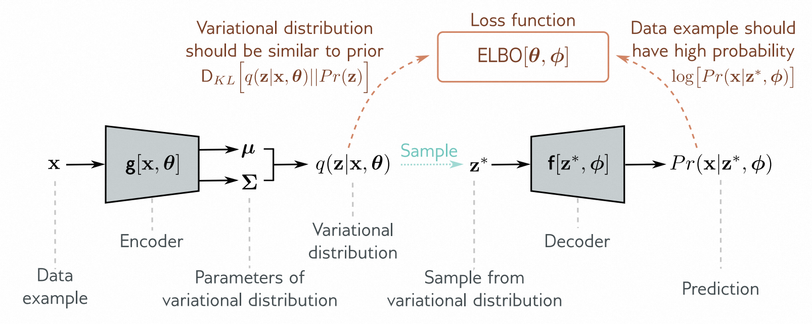
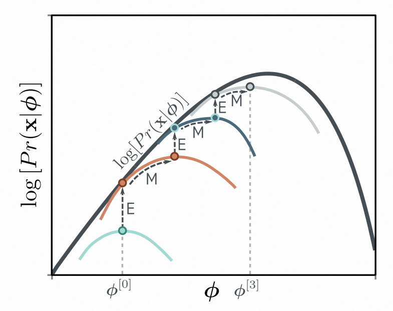

[译]第17章 变分自编码器（VAE） - The variational autoencoder 《理解深度学习 - Understanding Deep Learning》

本文是基于Simon J.D. Prince 的新书《Understanding Deep Learning》翻译而来；

* 原书介绍、原书（英文）下载、译文进展 以及 译文内容请戳 ↓↓↓
* [ \[译\]《理解深度学习 - Understanding Deep Learning 》 - 目录&前言 - ATA (atatech.org)](https://ata.atatech.org/articles/11020138829)

----

↓↓↓ 以下正文↓↓↓
----

# 本章目录

- [本章目录](#本章目录)
- [第17章 变分自编码器（VAE） - The variational autoencoder](#第17章-变分自编码器vae---the-variational-autoencoder)
  - [17.1 潜变量模型 - Latent variable models](#171-潜变量模型---latent-variable-models)
    - [17.1.1 例子：高斯混合模型 - Example: mixture of Gaussians](#1711-例子高斯混合模型---example-mixture-of-gaussians)
  - [17.2 非线性潜变量模型 - Nonlinear latent variable model](#172-非线性潜变量模型---nonlinear-latent-variable-model)
    - [17.2.1 生成 - Generation](#1721-生成---generation)
  - [17.3 训练 - Training](#173-训练---training)
    - [17.3.1 证据下界（ELBO） - Evidence lower bound (ELBO)](#1731-证据下界elbo---evidence-lower-bound-elbo)
    - [17.3.2 Jensen不等式 - Jensen's inequality](#1732-jensen不等式---jensens-inequality)
    - [17.3.3 推导下界 - Deriving the bound](#1733-推导下界---deriving-the-bound)
  - [17.4 ELBO 概念 - ELBO properties](#174-elbo-概念---elbo-properties)
    - [17.4.1 界限的紧密度 - Tightness of bound](#1741-界限的紧密度---tightness-of-bound)
    - [17.4.2 ELBO可以表示为重建损失减去与先验之间的KL距离 - ELBO as reconstruction loss minus KL distance to prior](#1742-elbo可以表示为重建损失减去与先验之间的kl距离---elbo-as-reconstruction-loss-minus-kl-distance-to-prior)
  - [17.5 变分逼近 - Variational approximation](#175-变分逼近---variational-approximation)
  - [17.6 变分自编码器 - The variational autoencoder](#176-变分自编码器---the-variational-autoencoder)
    - [17.6.1 变分自编码器（ VAE ）算法 - VAE algorithm](#1761-变分自编码器-vae-算法---vae-algorithm)
  - [17.7 重新参数化技巧 - The reparameterization trick](#177-重新参数化技巧---the-reparameterization-trick)
  - [17.8 应用 - Applications](#178-应用---applications)
    - [17.8.1 近似样本概率 - Approximating sample probability](#1781-近似样本概率---approximating-sample-probability)
    - [17.8.2 生成 - Generation](#1782-生成---generation)
    - [17.8.3 重新组合 - Resynthesis](#1783-重新组合---resynthesis)
    - [17.8.4 解缠绑 - Disentanglement](#1784-解缠绑---disentanglement)
  - [17.8 小结 - Summary](#178-小结---summary)
  - [17.9 注释 - Notes](#179-注释---notes)
  - [17.10 问题 - Problems](#1710-问题---problems)

# 第17章 变分自编码器（VAE） - The variational autoencoder

生成对抗网络学习了一种可以生成与训练数据在统计上无法区分的样本的机制。与此不同的是，变分自编码器（ VAE ）和归一化流一样，是一种概率生成模型；它的目标是学习数据上的分布 $ Pr (\mathbf x) $ （见图[14.2]()）。在训练完成后，可以从这个分布中抽取（生成）样本。然而，由于 VAE 的特性，无法精确地评估新样本 $ \mathbf x^{∗} $ 的概率。

通常我们会将 VAE 看作是 $ Pr(\mathbf x) $ 的模型，但这是误导性的； VAE 是一种神经网络结构，旨在帮助学习 $ Pr(\mathbf x) $ 的模型。最终的 $ Pr(\mathbf x) $ 模型既不包括"变分"部分，也不包括"自编码器"部分，更好的描述可能是一个*非线性潜变量模型*。

本章首先介绍了潜变量模型的一般性质，然后探讨了非线性潜变量模型的具体情况。很明显，对该模型进行最大似然学习并不简单。然而，可以定义一个似然下界， VAE 架构使用蒙特卡洛（采样）方法来近似这个下界。本章最后介绍了几个 VAE 的应用。

## 17.1 潜变量模型 - Latent variable models

潜变量模型采用了一种间接的方法来描述多维变量 $ \mathbf x $ 上的概率分布 $ Pr (\mathbf x) $ 。它们不直接给出 $ Pr (\mathbf x) $ 的表达式，而是建立了数据 $ \mathbf x $ 和未观测到的*隐藏变量*或*潜变量* $ \mathbf{z} $ 的联合分布 $ Pr (\mathbf x, \mathbf z) $ 。然后，它们将 $ Pr (\mathbf x) $ 的概率描述为联合概率的边际化，即：

$$
Pr(\mathbf{x})=\int Pr(\mathbf{x},\mathbf{z})d\mathbf{z}.
\tag{17.1}
$$

通常，联合概率 $ Pr (\mathbf x, \mathbf z) $ 通过使用条件概率的规则分解为数据相对于潜变量的似然项 $ Pr (\mathbf x|\mathbf z) $ 和先验概率 $ Pr (\mathbf z) $ ：

$$
Pr(\mathbf{x})=\int Pr(\mathbf{x}|\mathbf{z})Pr(\mathbf{z})d\mathbf{z}.
\tag{17.2}
$$

这是一种相对间接的描述 $ Pr (\mathbf x) $ 的方法，但它很有用，因为通过相对简单的表达式 $ Pr (\mathbf x|\mathbf z) $ 和 $ Pr (\mathbf z) $ 可以定义复杂的分布 $ Pr (\mathbf x) $ 。

### 17.1.1 例子：高斯混合模型 - Example: mixture of Gaussians

在一维高斯混合模型中（图 [17.1a]()），潜变量 $ z $ 是离散的，先验分布 $ Pr ( z) $ 是一个分类分布（图 [5.9]()），每个可能的 $ z $ 值对应一个概率 $ λ_{n} $ 。给定潜变量 $ z $ 取值为 $ n $ 时，数据 $ x $ 的似然函数 $ Pr (x|z = n) $ 是一个均值为 $ µ_{n} $ ，方差为 $ σ^{2}_n $ 的正态分布:

$$
\begin{array}{rcl}Pr(z=n)&=&\lambda_{n}\\\\
Pr(x|z=n)&=&\mathrm{Norm}_{x}\big[\mu_{n},\sigma_{n}^{2}\big].\end{array}
\tag{17.3}
$$

> 图 17.1 高斯混合模型（MoG）。
>
> * a）混合高斯（MoG）将一个复杂的概率分布（青色曲线）表示为多个高斯分量（虚线曲线）的加权和。
> * b）这个加权和是连续观测数据 $ x $ 和离散潜在变量 $ z $ 之间联合密度 $ Pr(x,z) $ 的边缘化。

根据方程[17.2]，似然函数 $ Pr(x) $ 通过对潜在变量 $ z $ 进行边缘化来计算（图[17.1b]）。在这里，潜在变量是离散的，因此我们对其可能的值进行求和以进行边缘化：

$$
\begin{aligned}
Pr(x)& =\quad\sum_{n=1}^{N}Pr(x,z=n) \\\\
&=\quad\sum_{n=1}^{N}Pr(x|z=n)\cdot Pr(z=n) \\\\
&=\quad\sum_{n=1}^{N}\lambda_{n}\cdot\mathrm{Norm}_{x}\big[\mu_{n},\sigma_{n}^{2}\big].
\end{aligned}
\tag{17.4}
$$

通过简单的似然函数和先验函数，我们描述了一个复杂的多模态概率分布。

## 17.2 非线性潜变量模型 - Nonlinear latent variable model

在非线性潜变量模型中，数据 $ \mathbf x $ 和潜变量 $ \mathbf z $ 都是连续且多变量的。先验分布 $ Pr (\mathbf z) $ 是标准的多维正态分布：

$$
Pr(\mathbf{z})=\mathrm{Norm}_{\mathbf{z}}[\mathbf{0},\mathbf{I}].
\tag{17.5}
$$

似然函数 $ Pr (\mathbf x |\mathbf z, ϕ) $ 也服从正态分布；其均值 $ \operatorname{f} [\mathbf z, ϕ] $ 是潜变量的非线性函数，协方差 $ σ^{2} \mathbf I $ 是球形的：

$$
Pr(\mathbf{x}|\mathbf{z},\boldsymbol{\phi})=\mathrm{Norm}_{\mathbf{x}}\Big[\mathbf{f}[\mathbf{z},\boldsymbol{\phi}],\sigma^{2}\mathbf{I}\Big].
\tag{17.6}
$$

函数 $ \operatorname{f} [\mathbf z, ϕ] $ 是由具有参数 $ ϕ $ 的深度网络来描述的。潜变量 $ \mathbf z $ 的维度低于数据 $ \mathbf x $ 。模型 $ \operatorname{f} [\mathbf z, ϕ] $ 描述了数据的重要方面，而剩下未建模的方面则归因于噪声 $ σ^{2} \mathbf I $ 。

通过对潜变量 $ \mathbf z $ 的边缘化，可以找到数据概率 $ Pr (\mathbf x|ϕ) $ ：

$$
\begin{aligned}
Pr(\mathbf{x}|\phi)& =\quad\int Pr(\mathbf{x},\mathbf{z}|\boldsymbol{\phi})d\mathbf{z} \\\\
&=\quad\int Pr(\mathbf{x}|\mathbf{z},\phi)\cdot Pr(\mathbf{z})d\mathbf{z} \\\\
&=\quad\int\mathrm{Norm}_{\mathbf{x}}\Big[\mathbf{f}[\mathbf{z},\boldsymbol{\phi}],\sigma^{2}\mathbf{I}\Big]\cdot\mathrm{Norm}_{\mathbf{z}}\left[\mathbf{0},\mathbf{I}\right]d\mathbf{z}.
\end{aligned}
\tag{17.7}
$$

我们可以将它视为具有不同均值的球形高斯分布的无限加权和（即无限混合），其中权重为 $ Pr(\mathbf z) $ ，均值为网络输出 $ \operatorname{f}[\mathbf z, \phi] $ （图[17.2]()）。

> 图17.2 非线性潜变量模型。通过对潜在变量 $ z $ 上的联合分布 $ Pr(\mathbf x, z) $ （左图）进行边缘化，我们创建了一个复杂的二维密度 $ Pr(\mathbf x) $ （右图）；为了创建 $ Pr(\mathbf x) $ ，我们对维度 $ z $ 上的三维体积进行积分。对于每个 $ z $ ， $ x $ 上的分布是一个球形高斯分布（显示了两个切片），其均值 $ \operatorname{f}[z, \phi] $ 是 $ \mathbf z $ 的非线性函数，并且依赖于参数 $ \phi $ 。分布 $ Pr(\mathbf x) $ 是这些高斯分布的加权和。

### 17.2.1 生成 - Generation

使用祖先采样（图[17.3]()）可以生成新的示例 $ \mathbf x^{∗} $ 。我们从先验分布 $ Pr(\mathbf z) $ 中抽取 $ z^{∗} $ ，并通过网络 $ \operatorname{f}[\mathbf z^{∗}, ϕ] $ 计算似然 $ Pr(\mathbf x|\mathbf z^{∗}, ϕ) $ 的均值（方程[17.6]()），然后我们抽取 $ \mathbf x^{∗} $ 。先验分布和似然都是正态分布，因此这一步非常简单。

> 图17.3 非线性潜变量模型的生成过程。
>
> * a) 我们从潜变量的先验概率 $ Pr(z) $ 中抽取一个样本 $ z^{∗} $ 。
> * b) 然后从 $ Pr(\mathbf x|z^{∗}, ϕ) $ 中抽取样本 $ \mathbf x^{∗} $ 。这个分布是一个球形高斯分布，其均值是一个关于 $ z^{∗} $ 的非线性函数 $ \operatorname{f}[•, ϕ] $ ，方差是固定的。
> * c) 如果我们多次重复这个过程，最后我们可以得到密度 $ Pr(\mathbf x|ϕ) $ 的分布。

## 17.3 训练 - Training

为了训练模型，我们通过最大化对于模型参数的对数似然函数在训练数据集 $ \{x_{i}\}^I_{i=1} $ 上进行训练。为了简化起见，我们可以假设似然函数中的方差项 $ σ^{2} $ 是已知的，并集中于学习 $ ϕ $ ：

$$
\hat{\phi}\quad=\quad\underset{\phi}{\operatorname*{argmax}}\left[\sum_{i=1}^{I}\log\Bigl[Pr(\mathbf{x}_{i}|\phi)\Bigr]\right]
\tag{17.8}
$$

其中:

$$
Pr(\mathbf{x}_{i}|\boldsymbol{\phi})\quad=\quad\int\mathrm{Norm}_{\mathbf{x}_{i}}[\mathbf{f}[\mathbf{z},\phi],\sigma^{2}\mathbf{I}]\cdot\mathrm{Norm}_{\mathbf{z}}[\mathbf{0},\mathbf{I}]d\mathbf{z}
\tag{17.9}
$$

不幸的是，这个问题是无法解决的。对于积分没有闭合形式的表达式，是没有简便的方法来对特定的 $ \mathbf x $ 值进行评估的。

### 17.3.1 证据下界（ELBO） - Evidence lower bound (ELBO)

为了取得进展，我们定义了一个对数似然的*下界*。对于给定的 $ ϕ $ 值，该函数始终小于或等于对数似然，并且还依赖于其他一些参数 $ θ $ 。最终，我们将构建一个网络来计算这个下界并进行优化。为了定义这个下界，我们需要使用*Jensen不等式*。

### 17.3.2 Jensen不等式 - Jensen's inequality

Jensen不等式表明，对于数据 $ y $ 的期望的凹函数 $ \operatorname g [•] $ 大于或等于函数对数据的期望：

$$
g[\mathbb{E}[y]]\geq\mathbb{E}\big[g[y]\big].
\tag{17.10}
$$

在本例中，凹函数是对数函数，所以我们有：

$$
\log\big[\mathbb{E}[y]\big]\geq\mathbb{E}\big[\log[y]\big],
\tag{17.11}
$$

或者将期望的表达式完全展开，我们有：

$$
\log\left[\int Pr(y)ydy\right]\geq\int Pr(y)\log[y]dy.
\tag{17.12}
$$

这个问题在图[17.4-17.5]()中有详细探讨。实际上，稍微更一般的陈述也是成立的：

$$
\log\left[\int Pr(y)h[y]dy\right]\geq\int Pr(y)\log[h[y]]dy.
\tag{17.13}
$$

其中 $ h [y] $ 是 $ y $ 的一个函数。这是因为 $ h [y] $ 是另一个具有新分布的随机变量。由于我们从未指定 $ Pr (y) $ ，所以这个关系仍然成立。

> 图 17.4 Jensen不等式（离散情况）。
> 对数函数（黑色曲线）是一个凹函数；你可以在曲线上的任意两点之间画一条直线，这条直线总是在曲线下方。因此，对数函数上的任何凸组合（权重和为1的正权重加权和）必须位于曲线下方的灰色区域中。在这里，我们将这些点均等加权（即取均值），得到青色点。由于这个点位于曲线下方，所以 $ \operatorname{log}[\mathbb{E} [y]] > \mathbb{E}[\operatorname{log} [y]] $ 。

> 图 17.5 Jensen不等式（连续情况）。对于一个凹函数，计算分布 $ Pr (y) $ 的期望，并通过函数传递它的结果大于或等于通过函数转换变量 $ y $ 然后计算新变量的期望。以对数函数为例，我们有 $ \operatorname{log}[\mathbb{E}[y]] ≥ \mathbb{E}[\operatorname{log}[y]] $ 。图的左侧对应于不等式的左侧，图的右侧对应于右侧。可以这样理解，我们将橙色分布中定义在 $ y \in [0, 1] $ 上的点看作是凸组合。根据图[17.4]()的逻辑，这些点必然位于曲线下方。另一种思考方式是，凹函数相对于低值将 $ y $ 的高值进行压缩，因此当我们首先通过函数传递 $ y $ 时，期望值会较低。

### 17.3.3 推导下界 - Deriving the bound

我们现在使用Jensen不等式来推导对数似然的下界。首先，我们通过一个任意的概率分布 $ q(\mathbf{z}) $ 对潜变量进行乘除运算，将对数似然乘以并除以它：

$$
\begin{aligned}
\log[Pr(\mathbf{x}|\boldsymbol{\phi})]& =\quad\log\left[\int Pr(\mathbf{x},\mathbf{z}|\boldsymbol{\phi})d\mathbf{z}\right] \\\\
&=\quad\log\left[\int q(\mathbf{z}){\frac{Pr(\mathbf{x},\mathbf{z}|\boldsymbol{\phi})}{q(\mathbf{z})}}d\mathbf{z}\right],
\end{aligned}
\tag{17.14}
$$

然后，我们使用对数的Jensen不等式（方程[17.12]()）找到一个下界：

$$
\log\left[\int q(\mathbf{z})\frac{Pr(\mathbf{x},\mathbf{z}|\boldsymbol{\phi})}{q(\mathbf{z})}d\mathbf{z}\right]\quad\geq\quad\int q(\mathbf{z})\log\left[\frac{Pr(\mathbf{x},\mathbf{z}|\boldsymbol{\phi})}{q(\mathbf{z})}\right]d\mathbf{z},
\tag{17.15}
$$

其中右侧被称为*证据下界（ELBO）*或*ELBO*。它得到这个名称是因为在贝叶斯公式的上下文中， $ Pr(\mathbf{x}|\boldsymbol{\phi}) $ 被称为*证据*。

在实践中，分布 $ q (\mathbf z) $ 是由参数 $ θ $ 控制的，因此 ELBO 可以被写成：

$$
\operatorname{ELBO}[\boldsymbol{\theta},\boldsymbol{\phi}]=\int q(\mathbf{z}|\boldsymbol{\theta})\log\left[\frac{Pr(\mathbf{x},\mathbf{z}|\boldsymbol{\phi})}{q(\mathbf{z}|\boldsymbol{\theta})}\right]d\mathbf{z}.
\tag{17.16}
$$

为了学习非线性潜变量模型，我们通过最大化这个量来确定 $ ϕ $ 和 $ θ $ 的取值。 VAE 是一种计算这个量的神经网络结构。

## 17.4 ELBO 概念 - ELBO properties

当我们第一次遇到ELBO时，它可能是一个有些神秘的概念，因此现在我们提供一些关于它性质的直觉理解。想象一下，原始数据的对数似然是参数 $ ϕ $ 的一个函数，我们想要找到它的最大值。对于任何固定的 $ θ $ ，ELBO仍然是参数的一个函数，但它必须位于原始似然函数的下方。当我们改变 $ θ $ 时，我们改变了这个函数，而且根据我们的选择，这个下界可能会离对数似然越来越近或者越来越远。当我们改变 $ ϕ $ 时，我们沿着下界函数移动（参见图[17.6]()）。

> 图 17.6 证据下界（ELBO）(ELBO)。
> 目标是最大化对参数 $ \phi $ 的对数似然 $ \operatorname{log}[Pr(\mathbf{x}|\phi)] $ （黑色曲线）。ELBO是一个在对数似然下方的函数。它既与参数 $ \phi $ 有关，也与第二个参数集 $ \theta $ 有关。对于固定的 $ \theta $ ，我们得到一个关于 $ \phi $ 的函数（不同 $ \theta $ 值的两个彩色曲线）。因此，我们可以通过改善ELBO来提高对数似然，要么是通过改变新的参数 $ \theta $ （从橙色曲线到绿色曲线），要么是通过改变原始参数 $ \phi $ （沿着当前的彩色曲线移动）。

### 17.4.1 界限的紧密度 - Tightness of bound

当对于某个固定的 $ \phi $ 值时，ELBO 和似然函数重合时，ELBO 是“紧”的。为了找到使边界紧密的分布 $ q(\mathbf z|\theta) $ ，我们使用条件概率的定义对 ELBO 中对数项的分子进行因式分解：

$$
\begin{aligned}
\operatorname{ELBO}[\theta,\phi]& =\quad\int q(\mathbf{z}|\boldsymbol{\theta})\log\left[{\frac{Pr(\mathbf{x},\mathbf{z}|\boldsymbol{\phi})}{q(\mathbf{z}|\boldsymbol{\theta})}}\right]d\mathbf{z} \\\\
&=\quad\int q(\mathbf{z}|\boldsymbol{\theta})\log\left[\frac{Pr(\mathbf{z}|\mathbf{x},\boldsymbol{\phi})Pr(\mathbf{x}|\boldsymbol{\phi})}{q(\mathbf{z}|\boldsymbol{\theta})}\right]d\mathbf{z} \\\\
&=\quad\int q(\mathbf{z}|\boldsymbol{\theta})\log\bigl[Pr(\mathbf{x}|\boldsymbol{\phi})\bigr]d\mathbf{z}+\int q(\mathbf{z}|\boldsymbol{\theta})\log\left[\frac{Pr(\mathbf{z}|\mathbf{x},\boldsymbol{\phi})}{q(\mathbf{z}|\boldsymbol{\theta})}\right]d\mathbf{z} \\\\
&=\quad\log\bigl[Pr(\mathbf{x}|\boldsymbol{\phi})\bigr]+\int q(\mathbf{z}|\boldsymbol{\theta})\log\left[\frac{Pr(\mathbf{z}|\mathbf{x},\boldsymbol{\phi})}{q(\mathbf{z}|\boldsymbol{\theta})}\right]d\mathbf{z} \\\\
&=\quad\log\bigl[Pr(\mathbf{x}|\boldsymbol{\phi})\bigr]-\mathrm{D}_{KL}\biggl[q(\mathbf{z}|\boldsymbol{\theta})\biggl|\biggl|Pr(\mathbf{z}|\mathbf{x},\boldsymbol{\phi})\biggr].
\end{aligned}
$$

在这里，第一个积分在第三行和第四行之间消失，因为 $ \operatorname{log}[Pr (\mathbf x|ϕ) ] $ 不依赖于 $ \mathbf z $ ，而概率分布 $ q (\mathbf z|θ) $ 的积分为1。在最后一行，我们使用了Kullback-Leibler (KL) 散度的定义。

这个方程表明ELBO是原始对数似然减去KL散度 $ D_{KL}[q(\mathbf z|θ)||Pr(\mathbf z|\mathbf x, ϕ)] $ 。KL散度衡量分布之间的“距离”，只能取非负值。因此，ELBO是对 $ \operatorname{log}[Pr (\mathbf x|ϕ) ] $ 的下界。当 $ q (\mathbf z|θ) = Pr (\mathbf z|\mathbf x, ϕ) $ 时，KL距离为零，下界将会“严密”。这是关于潜在变量 $ \mathbf z $ 的后验分布，给定观测数据 $ \mathbf x $ ，它指示了哪些潜在变量的值可能对数据点负责（图[17.7]()）。

> 图17.7 潜在变量的后验分布。
a) 后验分布 $ Pr(z|\mathbf x^{∗}, ϕ) $ 是对潜在变量 $ z $ 负责的可能值的分布，可以解释数据点 $ \mathbf x^{∗} $ 。我们通过应用贝叶斯定理计算它 $ Pr(z|\mathbf x^{∗}, ϕ)∝ Pr(\mathbf x^{∗}|z, ϕ)Pr(z) $ 。
b) 我们通过将 $ \mathbf x^{∗} $ 与与每个 $ \mathbf z $ 值相关的对称高斯分布相比较来计算右边的第一项（似然）。在这里，它更可能是由 $ z_{1} $ 而不是 $ z_{2} $ 生成的。第二项是潜变量的先验概率 $ Pr (z) $ 。将这两个因素结合并进行标准化，使得分布总和为一，我们得到了后验分布 $ Pr (\mathbf z|x^{∗}, ϕ) $ 。

### 17.4.2 ELBO可以表示为重建损失减去与先验之间的KL距离 - ELBO as reconstruction loss minus KL distance to prior

方程17.16和17.17是表达ELBO的两种不同方式。第三种方式是将界限视为重建误差减去与先验之间的距离：

$$
\begin{aligned}
\operatorname{ELBO}[\theta,\phi]& =\quad\int q(\mathbf{z}|\boldsymbol{\theta})\log\left[{\frac{Pr(\mathbf{x},\mathbf{z}|\boldsymbol{\phi})}{q(\mathbf{z}|\boldsymbol{\theta})}}\right]d\mathbf{z} \\\\
&=\quad\int q(\mathbf{z}|\boldsymbol{\theta})\log\left[\frac{Pr(\mathbf{x}|\mathbf{z},\boldsymbol{\phi})Pr(\mathbf{z})}{q(\mathbf{z}|\boldsymbol{\theta})}\right]d\mathbf{z} \\\\
&=\quad\int q(\mathbf{z}|\boldsymbol{\theta})\log\left[Pr(\mathbf{x}|\mathbf{z},\boldsymbol{\phi})\right]d\mathbf{z}+\int q(\mathbf{z}|\boldsymbol{\theta})\log\left[\frac{Pr(\mathbf{z})}{q(\mathbf{z}|\boldsymbol{\theta})}\right]d\mathbf{z} \\\\
&=\quad\int q(\mathbf{z}|\boldsymbol{\theta})\log\Bigl[Pr(\mathbf{x}|\mathbf{z},\boldsymbol{\phi})\Bigr]d\mathbf{z}-\mathrm{D}_{KL}\Bigl[q(\mathbf{z}|\boldsymbol{\theta})\Bigr|\Bigr|Pr(\mathbf{z})\Bigr]
\end{aligned}
\tag{17.18}
$$
在第一行和第二行之间，联合分布 $ Pr (\mathbf x, \mathbf z|ϕ) $ 被分解为条件概率 $ Pr (\mathbf x|\mathbf z, ϕ) Pr (\mathbf z) $ ，并且在最后一行再次使用了KL散度的定义。

在这个公式中，第一项衡量潜变量和数据之间的平均一致性 $ Pr (\mathbf x|\mathbf z, ϕ) $ ，也被称为重构损失。第二项衡量辅助分布 $ q (\mathbf z|θ) $ 与先验分布的匹配程度。这个公式是变分自编码器中使用的公式。

## 17.5 变分逼近 - Variational approximation

在方程[17.17]()中我们看到，当 $ q (\mathbf z|θ) $ 等于后验分布 $ Pr (\mathbf z|\mathbf x, ϕ) $ 时，ELBO是最紧密的。从原则上讲，我们可以使用贝叶斯规则计算后验分布：

$$
Pr(\mathbf{z}|\mathbf{x},\phi)=\frac{Pr(\mathbf{x}|\mathbf{z},\phi)Pr(\mathbf{z})}{Pr(\mathbf{x}|\mathbf{\phi})},
\tag{17.19}
$$

但在实践中，这是不可行的，因为我们无法在分母中评估数据的似然性（见第[17.3](#training-1)节）。

一种解决方法是进行变分近似：我们选择一个简单的参数形式 $ q (\mathbf z|θ) $ 来近似真实的后验分布。在这里，我们选择均值为 $ µ $ ，协方差为对角矩阵 $ Σ $ 的多变量正态分布。这种选择不一定能完全匹配后验分布，但对于某些 $ µ $ 和 $ Σ $ 的值会更好一些。在训练过程中，我们会找到与真实后验分布 $ Pr (\mathbf z|\mathbf x) $ 最接近的正态分布（见图[17.8]()）。这相当于最小化方程[17.17]()中的KL散度，并将图[17.6]()中的彩色曲线向上移动。

> 图17.8展示了变分近似的过程。后验$ Pr (\mathbf z| \mathbf x^{∗}, ϕ) $无法以闭合形式计算。为了近似后验分布，变分近似选择了一族分布$ q (\mathbf z|\mathbf x, θ) $（这里选择高斯分布），并试图找到这族分布中与真实后验最接近的成员。
>
> * a) 有时候，近似分布（青色曲线）能够很好地拟合真实后验分布（橙色曲线）。
> * b) 然而，如果真实后验分布是多峰的（如图[17.7]()所示），高斯近似将会表现不佳。

由于最优的$ q (\mathbf z|θ) $选择是后验分布$ Pr (\mathbf z|\mathbf x) $，而后验分布又依赖于数据样本$ \mathbf x $，因此变分近似应该采用相同的策略，因此我们选择：
$$
q(\mathbf{z}|\mathbf{x},\mathbf{\theta})=\mathrm{Norm}_{\mathbf{z}}\bigg[\mathbf{g}_{\mu}[\mathbf{x},\mathbf{\theta}],\mathbf{g}_{\Sigma}[\mathbf{x},\mathbf{\theta}]\bigg],
\tag{17.20}
$$

其中 $ \mathbf g [\mathbf x, θ] $ 是一个带有参数 $ θ $ 的第二个神经网络，用于预测正态变分逼近的均值 $ µ $ 和方差 $ Σ $ 。

## 17.6 变分自编码器 - The variational autoencoder

最后，我们来介绍一下变分自编码器（ VAE ）。我们构建了一个网络来计算ELBO（证据下界（ELBO））：

$$
\mathrm{ELBO}[\theta,\phi]=\int q(\mathbf{z}|\mathbf{x},\mathbf{\theta})\log\bigl[Pr(\mathbf{x}|\mathbf{z},\mathbf{\phi})\bigr]d\mathbf{z}-\mathrm{D}_{KL}\biggl[q(\mathbf{z}|\mathbf{x},\mathbf{\theta})\biggl|\biggl|Pr(\mathbf{z})\biggr],
\tag{17.21}
$$

其中，分布 $ q (\mathbf z|\mathbf x, θ) $ 是方程[17.20]()中的近似分布。

第一项仍然包含一个难以解决的积分，但由于它是关于 $ q (\mathbf z|\mathbf x, θ) $ 的期望，我们可以通过采样来近似它。对于任何函数 $ a [•] $ ，我们有：

$$
\mathbb{E}_{\mathbf{z}}\big[\mathrm{a}[\mathbf{z}]\big]=\int\mathrm{a}[\mathbf{z}]q(\mathbf{z}|\mathbf{x},\mathbf{\theta})d\mathbf{z}\approx\frac{1}{N}\sum_{n=1}^{N}\mathrm{a}[\mathbf{z}_{n}^{*}],
\tag{17.22}
$$

其中 $ \mathbf z^{∗}_n $ 是从 $ q (\mathbf z|\mathbf x, θ) $ 中采样得到的第 $ n $ 个样本。这被称为*蒙特卡洛估计*。对于一个非常粗略的估计，我们可以只使用从 $ q (\mathbf z|\mathbf x, θ) $ 中获得的单个样本 $\mathbf z^{∗} $ ：

$$
\mathrm{ELBO}[\theta,\phi]\quad\approx\quad\log\big[Pr(\mathbf{x}|\mathbf{z}^{*},\phi)\big]-\mathrm{D}_{KL}\Big[q(\mathbf{z}|\mathbf{x},\mathbf{\theta})\Big|\Big|Pr(\mathbf{z})\Big].
$$

第二项是变分分布 $ q (\mathbf z|\mathbf x, θ) = Norm_{z}[µ, Σ] $ 和先验分布 $ Pr (\mathbf z) = Norm_{z}[0,\mathbf I] $ 之间的KL散度。两个正态分布之间的KL散度可以通过闭式计算得到。对于其中一个分布的参数为 $ \mathbf µ, \mathbf Σ $ ，而另一个分布是标准正态分布的特殊情况，KL散度可以表示为：

$$
\operatorname{D}_{KL}\Big[q(\mathbf{z}|\mathbf{x},\mathbf{\theta})\Big|\Big|Pr(\mathbf{z})\Big]={\frac{1}{2}}\bigg(\operatorname{Tr}[\mathbf{\Sigma}]+\mu^{T}\mathbf{\mu}-D_{\mathbf{z}}-\log\Big[\det[\mathbf{\Sigma}]\Big]\bigg).
\tag{17.24}
$$

其中 $ D_{\mathbf z} $ 是潜在空间的维度。

### 17.6.1 变分自编码器（ VAE ）算法 - VAE algorithm

简而言之，我们的目标是构建一个模型，计算给定数据点 $ \mathbf x $ 的证据下界（ELBO）。然后，我们使用一个优化算法来最大化这个下界，从而改善对数似然。为了计算证据下界（ELBO），我们需要执行以下步骤：

* 使用网络 $ \mathbf g [\mathbf x, θ] $ 来计算变分后验分布 $ q (\mathbf z|\mathbf θ, \mathbf x) $ 的均值 $ µ $ 和方差 $ Σ $ ，对于给定的数据点 $ \mathbf x $
* 从该分布中抽取一个样本 $ \mathbf z^{∗} $
* 使用指定的方程式[17.23]()计算证据下界（ELBO）

图[17.9]()展示了相关的架构。现在应该明白为什么它被称为变分自编码器了。它之所以称为变分自编码器，是因为它对后验分布进行了高斯近似计算。它也被称为自编码器，是因为它从数据点 $ \mathbf x $ 开始，计算出一个较低维度的潜变量 $ \mathbf z $ ，然后尽可能地利用这个向量重新创造数据点 $ \mathbf x $ 。在这个背景下，网络 $ \mathbf g [\mathbf x, θ] $ 将数据映射到潜变量被称为*编码器*，而网络 $ \operatorname{f} [\mathbf z, ϕ] $ 将潜变量映射到数据被称为*解码器*。

> 图 17.9 变分自编码器。编码器 $ \mathbf g [\mathbf x, θ] $ 接受一个训练示例 $ \mathbf x $ 并预测变分分布 $ q (\mathbf z|\mathbf x, θ) $ 的参数 $ µ, Σ $ 。我们从该分布中进行采样，然后使用解码器 $ \operatorname{f} [\mathbf z, ϕ] $ 预测数据 $ \mathbf x $ 。损失函数是负 ELBO，取决于预测的准确性以及变分分布 $ q (\mathbf z|\mathbf x, θ) $ 与先验分布 $ Pr (\mathbf z) $ 的相似程度（方程 [17.21]() ）。

 VAE 使用 $ ϕ $ 和 $ θ $ 计算ELBO作为界限。为了最大化这个界限，我们通过网络运行小批量样本，并使用优化算法（如SGD或Adam）更新这些参数。使用自动微分通常计算参数相对于ELBO的梯度。在这个过程中，我们在图17.10中同时在彩色曲线之间移动（改变 $ θ $ ）和沿着曲线移动（改变 $ ϕ $ ）。在这个过程中，参数 $ ϕ $ 被改变，使得数据在非线性潜在变量模型中具有更高的可能性。

> 图17.10 VAE 通过调整解码器的参数 $ ϕ $ 和编码器的参数 $ θ $ 来增加下界，从而更新每次迭代时决定下界的两个因素。

## 17.7 重新参数化技巧 - The reparameterization trick

还有一个更为复杂的问题；网络中涉及到一个采样步骤，对这个随机组件进行微分是困难的。然而，为了更新网络中在其之前的参数 $ θ $ ，对采样步骤进行微分是必要的。

幸运的是，我们有一个简单的解决方法；我们可以将随机部分转移到网络的一个分支中，从 $ Norm_{ϵ}[0,\mathbf I] $ 中抽取一个样本 $ ϵ^{∗} $ ，然后使用关系式：

$$
\mathbf{z}^{*}=\mu+\Sigma^{1/2}\epsilon^{*}
\tag{17.25}
$$

从所需的高斯分布中抽取。现在，我们可以像往常一样计算导数，因为反向传播算法不需要通过随机分支。这被称为 *重新参数化技巧* (图 [17.11]() )。

> 图 17.11 重参数化技巧。在原始架构（图 [17.9]()）中，我们无法轻松地通过采样步骤进行反向传播。通过重参数化技巧，我们将采样步骤从主要流程中分离出来；我们从标准正态分布中抽取样本，并将其与预测的均值和协方差相结合，从而获得来自变分分布的样本。

## 17.8 应用 - Applications

变分自编码器在许多方面都有用途，包括去噪、异常检测和压缩。本节将介绍几个用于图像数据的应用案例。

### 17.8.1 近似样本概率 - Approximating sample probability

在[17.3节](#training-1)中，我们已经讨论过使用 VAE 评估样本概率的不可能性。这个概率可以描述为：

$$
\begin{aligned}
Pr(\mathbf{x})& =\quad\int Pr(\mathbf{x}|\mathbf{z})Pr(\mathbf{z})d\mathbf{z} \\\\
&=\quad\mathbb{E}_{\mathbf{z}}\bigg[Pr(\mathbf{x}|\mathbf{z})\bigg] \\\\
&=\quad{\mathbb{E}_{\mathbf{z}}}\bigg[\mathrm{Norm}_{\mathbf{x}}[\mathbf{f}[\mathbf{z},\phi],\sigma^{2}\mathbf{I}]\bigg].
\end{aligned}
\tag{17.26}
$$

原则上，我们可以使用等式[17.22]()通过从 $ Pr(\mathbf{z}) = Norm_{z} $ 中抽取样本并计算来近似这个概率：

$$
Pr(\mathbf{x})\approx{\frac{1}{N}}\sum_{n=1}^{N}Pr(\mathbf{x}|\mathbf{z}_{n}).
\tag{17.27}
$$

然而，维度诅咒意味着我们抽样得到的 $ \mathbf z_{n} $ 值几乎都具有非常低的概率；我们需要抽取大量样本才能得到可靠的估计结果。更好的方法是采用“重要性采样”。在这种方法中，我们从辅助分布 $ q(\mathbf z) $ 中抽取 $ \mathbf z $ ，计算 $ Pr(\mathbf x | \mathbf z_{n}) $ 的值，并用新分布下的概率 $ q(\mathbf z) $ 对结果进行重新缩放：

$$
\begin{aligned}
Pr(\mathbf{x}) & = \quad\int Pr(\mathbf{x}|\mathbf{z})Pr(\mathbf{z})d\mathbf{z} \\
& = \quad\int\frac{Pr(\mathbf{x}|\mathbf{z})Pr(\mathbf{z})}{q(\mathbf{z})}q(\mathbf{z})d\mathbf{z} \\
& = \quad\mathbb{E}_{q(\mathbf{z})}\Big[\frac{Pr(\mathbf{x}|\mathbf{z})Pr(\mathbf{z})}{q(\mathbf{z})}\Big] \\
& \approx \quad{\frac{1}{N}}\sum_{n=1}^{N}{\frac{Pr(\mathbf{x}|\mathbf{z}_{n})Pr(\mathbf{z}_{n})}{q(\mathbf{z}_{n})}}
\end{aligned}
$$

现在我们从 $ q(\mathbf z) $ 中抽取样本。如果 $ q(\mathbf z) $ 接近 $ Pr(\mathbf x|\mathbf z) $ 的高概率区域，那么我们将在相关的空间区域集中采样，并且更有效地估计 $ Pr(\mathbf x) $ 。

我们试图计算的 $ Pr(\mathbf x|\mathbf z)Pr(\mathbf z) $ 与后验分布 $ Pr(\mathbf z|\mathbf x) $ 成正比（根据贝叶斯定理）。因此，合理的选择是使用编码器计算得到的变分后验 $ q(\mathbf z|\mathbf x) $ 作为辅助分布。

通过这种方法，我们可以近似计算新样本的概率。通过足够的样本，这将提供比下界更好的估计，并可以通过评估测试数据的对数似然来评估模型的质量。或者，它可以用作确定新样本是否属于分布中还是异常值的判据。

### 17.8.2 生成 - Generation

 VAE 构建了一个概率模型，通过从潜变量的先验 $ Pr(\mathbf{z}) $ 中进行抽样，将结果传递给解码器 $ f[\mathbf{z}, \phi] $ ，并根据 $ Pr(\mathbf{x}|f[\mathbf{z}, \phi]) $ 添加噪声，可以方便地从该模型中生成样本。然而，普通的 VAE 生成的样本通常质量较低（图[17.12a-c]()）。这部分原因是因为天真的球面高斯噪声模型，部分原因是因为先验和变分后验所使用的高斯模型。改善生成质量的一个技巧是从“聚合后验” $ q(\mathbf{z}| \theta)=(1/I)\sum_i q(\mathbf{z}|\mathbf{x}_i, \theta) $ 中进行采样，而不是从先验中进行采样；这是所有样本的平均后验，是高斯混合物，更能代表潜在空间中真实的分布。

现代的变分自编码器（ VAE ）通过使用分层先验、专门的网络架构和正则化技术，可以生成高质量的样本（图[17.12d]()）。扩散模型（第[18]()章）可以看作是具有分层先验的 VAE 。这些模型同样可以生成非常高质量的样本。

> 图17.12 在CELEBA数据集上训练的标准 VAE 进行采样。每一列中，先绘制一个潜变量 $ \mathbf z^{∗} $ ，然后通过模型预测均值 $ \operatorname{f} [\mathbf z^{∗}, ϕ] $ ，最后添加独立的高斯噪声（参见图[17.3]()）。
>
> * a)是一组样本，它们是 预测的均值(b) 和 球形高斯噪声向量(c) 的叠加。在添加噪声之前，图像看起来过于平滑，之后则过于嘈杂。这是典型情况，通常显示去噪版本，因为噪声被认为代表了模型未能建模的图像特征。改编自[Dorta等人，2018]()。
> * d) 现在，利用分层先验、特殊的架构和仔细的规范化，可以从 VAEs 生成高质量的图像。改编自[Vahdat & Kautz , 2020]()。

### 17.8.3 重新组合 - Resynthesis

 VAE s还可以用于修改真实数据。可以通过两种方式将数据点 $ \mathbf x $ 投影到潜在空间中：

* (i) 使用编码器预测的分布的均值
* (ii) 使用最大化后验概率的优化过程来找到潜在变量 $ \mathbf z $

根据贝叶斯定理，后验概率与 $ Pr (\mathbf x|\mathbf z) Pr (\mathbf z) $ 成正比。

在图[17.13]()中，我们将多张标记为“中性”或“微笑”的图像投影到潜在空间中。通过计算这两组图像的潜在空间均值之间的差异来估计代表这种变化的向量。同时，我们还估计了另一个向量来表示“嘴巴闭合”与“嘴巴张开”。

> 图17.13 重合合成。
> 使用编码器将左侧的原始图像投影到潜在空间中，并选择预测的高斯分布的均值来表示该图像。在网格中，左侧中间的图像是输入图像的重建结果。其他图像是在潜在空间中按照表示微笑/中性（水平方向）和嘴巴张开/闭合（垂直方向）的方向进行操作后的重建结果。改编自[White, 2016]()。

现在，我们将对感兴趣的图像进行投影，然后通过添加或减去这些向量来调整图像的表达。为了生成中间图像，我们使用球形线性插值（Slerp）而不是线性插值。可以将这个过程类比为在球体表面上插值和直接穿过球体内部挖掘隧道之间的区别。

在对输入数据进行解码之前，对数据进行编码（可能还会进行修改）的过程被称为*重新合成*。GANs和归一化流也可以用来实现这个过程。然而，在GANs中，没有编码器，所以必须使用单独的方法来找到对应于观察数据的潜在变量。

### 17.8.4 解缠绑 - Disentanglement

在上面的重构示例中，需要使用带有标签的训练数据来估计表示可解释属性的空间方向。其他研究试图改进潜在空间的特性，使其坐标方向对应于真实世界的属性。当每个维度都代表一个独立的真实世界因素时，我们将潜在空间描述为“解缠绑”。例如，在对面部图像进行建模时，我们可能希望将头部姿势或头发颜色作为独立的因素来揭示。

鼓励解缠的方法通常通过在损失函数中添加正则化项来实现，这些正则化项基于两种情况：(i) 潜变量后验概率 $ q(\mathbf{z}|\mathbf{x},θ) $ ，或者 (ii) 聚合后验概率 $ q (\mathbf z|θ) = (1/I)\sum_{i}q(\mathbf z|\mathbf x_{i}, θ) $ ：

$$
L_{\mathrm{new}}=-\mathrm{ELBO}[\theta,\phi]+\lambda_{1}\mathbb{E}_{Pr(\mathbf{x})}\Big[\mathrm{r}_{1}\Big[q(\mathbf{z}|\mathbf{x},\mathbf{\theta})\Big]\Big]+\lambda_{2}\mathrm{r}_{2}\Big[q(\mathbf{z}|\boldsymbol{\theta})\Big].
\tag{17.29}
$$

在这里，正则化项 $ r_{1}[•] $ 是关于后验概率的函数，并且被加权为 $ λ_{1} $ 。而项 $ r_{2} [•] $ 是关于聚合后验概率的函数，并且被加权为 $ λ_{2} $ 。

例如，*beta VAE* 在 ELBO（方程[17.18]）中增加了第二项权重：

$$
\mathrm{ELBO}[\theta,\phi]\quad\approx\quad\log\big[Pr(\mathbf{x}|\mathbf{z}^{*},\phi)\big]-\beta\cdot\mathrm{D}_{KL}\Big[q(\mathbf{z}|\mathbf{x},\mathbf{\theta})\Big|\Big|Pr(\mathbf{z})\Big],
\tag{17.30}
$$

其中 $ β>1 $ 决定了相对于重构误差，偏离先验 $ Pr (\mathbf z) $ 的程度加权。由于先验通常是具有球面协方差矩阵的多变量正态分布，它的维度是独立的。因此，增加此项的权重鼓励后验分布之间的相关性较小。另一种变体是总相关性 VAE ，它增加了一个项来减小潜在空间中变量之间的总相关性（图[17.14]()），并最大化潜在变量的一个小子集与观测之间的互信息。

> 图17.14 总相关 VAE 中的解缠绕。 VAE 模型被修改，以鼓励最小化潜在变量的总相关性，从而促进解缠绕。当在椅子图像的数据集上进行训练时，一些潜在维度具有明确的现实世界解释，包括
>
> * a）旋转，
> * b）整体尺寸，以及
> * c）腿（转椅与普通椅子）。在每种情况下，中央列显示了模型的样本，当我们从左到右在潜在空间中减去或添加一个坐标向量。改编自[Chen et al. ，2018d]()。

## 17.8 小结 - Summary

 VAE 是一种有助于学习非线性潜变量模型的架构，可在 $ \mathbf{x} $ 上生成新的示例，通过从潜变量中进行采样，将结果经过深度网络处理，然后添加独立的高斯噪声。

无法通过闭式计算来确定数据点的可能性，这给最大似然训练带来了问题。但是，我们可以定义可能性的一个下界，并最大化这个下界。不幸的是，为了使下界更紧密，我们需要计算给定观测数据的潜变量的后验概率，这也是不可行的。解决方案是使用变分近似。这是一个更简单的分布（通常是高斯分布），它近似于后验分布，并由第二个编码器网络计算其参数。

为了从 VAE 中生成高质量的样本，似乎需要使用比高斯先验和后验更复杂的概率分布来建模潜在空间。一种选择是使用层次先验（其中一个潜变量生成另一个）。下一章将讨论扩散模型，它可以产生非常高质量的例子，并可看作是层次 VAE 。

## 17.9 注释 - Notes

 VAE 最初由[Kingma & Welling，2014]()引入。关于变分自编码器的详细介绍可以在[Kingma等，2019]()中找到。

**应用：** VAE 及其变种已应用于图像（[Kingma & Welling，2014]()；[Gregor等，2016]()；[Gulrajani等，2016]()；[Akuzawa等，2018]()），语音（[Hsu等，2017b]()），文本（[Bowman等，2015]()；[Hu等，2017]()；[\mathbf xu等，2020]()），分子（[Gómez-Bombarelli等，2018]()；[Sultan等，2018]()），图形（[Kipf＆Welling，2016]()；[Simonovsky＆Komodakis，2018]()），机器人（[Hernández等，2018]()；[Inoue等，2018]()；[Park等，2018]()），强化学习（[Heess等，2015]()；[Van Hoof等，2016]()），3D场景（[Eslami等，2016，2018]()；[Rezende Jimenez等，2016]()）和手写（[Chung等，2015]()）。

应用包括重新合成和插值，协同过滤和压缩。利用 VAE 构建了化学结构的连续表示，然后可以对其进行优化以获得理想的性质。模拟天文观测以校准测量结果。

**与其他模型的关系：** 自编码器（Rumelhart等，1985；Hinton和Salakhutdinov，2006）通过编码器将数据传递到瓶颈层，然后使用解码器进行重构。瓶颈层与 VAE 中的潜在变量类似，但其动机有所不同。在这里，目标不是学习概率分布，而是创建一个能够捕捉数据本质的低维表示。自编码器还有许多应用，包括去噪（Vincent等，2008）和异常检测（Zong等，2018）。

如果编码器和解码器是线性变换，那么自动编码器就等同于主成分分析（PCA）。因此，非线性自动编码器是PCA的一种推广。还有一种概率形式的PCA。概率PCA（Tipping＆Bishop，1999年）在重构过程中加入球形高斯噪声，以创建一个概率模型，而因子分析则加入对角高斯噪声（参见Rubin＆Thayer，1982年）。如果我们将这些概率变体的编码器和解码器设为非线性，就得到了变分自动编码器。

**架构变体：** 条件 VAE （Sohn等人，2015）在编码器和解码器中都传递了类别信息 $ \mathbf c $ 。这样的结果是潜变量空间不需要编码类别信息。例如，当MNIST数据以数字标签为条件时，潜变量可能会编码数字的方向和宽度，而不是数字本身的类别。Sønderby等人（2016a）提出了阶梯变分自动编码器，通过与数据相关的近似似然项递归地修正生成分布。

修改似然性：其他研究探索了更复杂的似然模型 $ Pr (\mathbf x|\mathbf z) $ 。Pixel VAE （ [Gulrajani et al. , 2016]() ）在输出变量上使用了自回归模型。[Dorta et al. , 2018]() 不仅对解码器的均值进行建模，还对解码器输出的协方差进行了建模。[Lambet al. , 2016]() 通过添加额外的正则化项来提高重构质量，这些项鼓励重构与原始图像在图像分类模型的一层激活特征空间中相似。该模型鼓励保留语义信息，并用于生成图 [17.13]() 中的结果。[Larsen et al. , 2016]() 在重构中使用对抗性损失，也改善了结果。

**潜变量空间、先验和后验：** 人们研究了许多不同形式的变分近似方法来逼近后验分布，包括归一化流（[Rezende & Mohamed, 2015](https://arxiv.org/abs/1505.05770)；[Kingma et al., 2016](https://arxiv.org/abs/1312.6114)）、有向图模型（[Maaløe et al., 2016](https://arxiv.org/abs/1511.02386)）、无向模型（[Vahdat et al., 2020](https://arxiv.org/abs/2002.05202)）以及递归模型用于时序数据（[Gregor et al., 2016, 2019](https://arxiv.org/abs/1511.02799)）。

其他研究者探索了使用离散潜变量空间的方法（[Van Den Oord et al., 2017](https://arxiv.org/abs/1711.00937)；[Razavi et al., 2019b](https://arxiv.org/abs/1906.00446)；[Rolfe, 2017](https://arxiv.org/abs/1706.00130)；[Vahdat et al., 2018a, b](https://arxiv.org/abs/1803.10122)。例如，[Razavi et al., 2019b](https://arxiv.org/abs/1906.00446) 使用了矢量量化的潜变量空间，并用自回归模型（方程式[12.15](https://arxiv.org/abs/1906.00446)）来建模先验分布。尽管从中抽样速度较慢，但可以描述非常复杂的分布。

[Jiang等，2016]()使用高斯混合模型进行后验推断，实现了聚类分析。这种层次潜变量模型在后验中引入了一个离散的潜变量，以增加其灵活性。其他作者（[Salimans等，2015](); [Ranganath等，2016](); [Maaløe等，2016](); [Vahdat和Kautz，2020]()）尝试使用连续变量的层次模型。这些模型与扩散模型（第18章）有密切的关联。

**与其他模型的组合：** [Gulrajani等，2016]()将 VAE 与自回归模型结合，以生成更逼真的图像。[Chung等，2015]()将 VAE 与循环神经网络结合，对时变测量进行建模。

正如上面所讨论的那样，对抗性损失已经被用来直接确定似然项。然而，其他模型以不同的方式将生成对抗网络（GANs）的思想与变分自编码器（ VAE s）相结合。[Makhzani et al. ，2015]() 在潜在空间中使用对抗性损失；其思想是鉴别器将确保聚合的后验分布 $ q (\mathbf z) $ 和先验分布 $ Pr (\mathbf z) $ 不可区分。[Tolstikhin et al. ，2018]() 将此推广到先验分布和聚合的后验分布之间的更广泛的距离家族。[Dumoulin et al. ，2017]() 引入了通过对抗性学习来区分两对潜在/观察数据点的方法。在一个情况下，潜在变量来自于潜在的后验分布，而在另一个情况下，来自于先验分布。其他的 VAE s和GANs的
混合模型由[Larsen et al. ，2016]()，[Brock et al. ，2016]()，和[Hsu et al. ，2017a]() 提出。

**后验坍塌：** 训练中的一个潜在问题是*后验坍塌*，即编码器总是预测先验分布。这个问题在[Bowman等人，2015年]()的研究中被发现，并且可以通过逐渐增加鼓励后验分布和先验分布之间KL距离变小的项来缓解。已经提出了几种其他方法来防止后验坍塌（[Razavi等人，2019a](); [Lucas等人，2019b, a]()），而且这也是使用离散潜在空间的动机之一（[Van Den Oord等人，2017]()）。

**模糊的重建：** [Zhao et al. , 2017c]() 提供了证据表明，模糊的重建部分是由于高斯噪声，也是由于变分逼近引起的次优后验分布。也许并非巧合的是，一些最佳的合成结果来自于使用复杂的自回归模型建模的离散潜在空间（[Razavi et al. , 2019b]()），或者来自于使用分层潜在空间（[Vahdat &Kautz , 2020]()；见图[17.12d]()）。图[17.12a-c]()使用的是在CELEBA数据库上训练的 VAE （[Liu et al. , 2015]()）。图[17.12d]()使用的是在CELEBA HQ数据集上训练的分层 VAE （[Karras et al. , 2018]()）。

**其他问题：**[Chen et al. , 2017]()指出，当使用更复杂的似然项时，例如PixelCNN（[Van den Oord et al. , 2016c]()），输出可能完全不依赖于潜变量。他们称之为“信息偏好”问题。[Zhao et al. , 2017b]()在Info VAE 中解决了这个问题，他们增加了一个额外的项，最大化了潜变量与观测分布之间的互信息。

另一个问题是 VAE 中可能存在与任何现实样本都不相对应的“孔洞”。[\mathbf xu et al. , 2020]()引入了约束后验 VAE ，通过添加正则化项来防止潜空间中出现这些虚无的区域。这样可以实现更好的真实样本插值。

**解开潜在表示：**解开潜在表示的方法包括beta VAE （Higgins等人，2017）以及其他方法（如Kim和Mnih，2018；Kumar等人，2018）。Chen等人（2018）进一步将ELBO分解，揭示了衡量潜在变量之间总相关性的项的存在（即聚合后验和其边缘乘积之间的距离）。他们以此为基础提出了总相关性 VAE ，试图将其最小化。Factor VAE （Kim和Mnih，2018）采用了不同的方法来最小化总相关性。Mathieu等人（2019）讨论了在解开表示中的重要因素。

**重新参数化技巧：**考虑计算某个函数的期望值，其中期望值所采用的概率分布取决于某些参数。重新参数化技巧计算了这个期望值关于这些参数的导数。本章介绍了这个方法作为通过对期望的采样过程进行微分的一种方法；还有其他方法（见问题[17.5]()），但重新参数化技巧提供了一个（通常）方差较低的估计器。这个问题在[Rezende等人，2014]()，[Kingma等人，2015]()和[Roeder等人，2017]()中进行了讨论。

**下界与EM算法：** VAE 的训练基于优化证据的下界（有时也称为ELBO、变分下界或负变分自由能）。[Hoffman & Johnson，2016]()和[Lücke et al.，2020]()以多种方式重新解释了这个下界，以阐明其性质。其他研究工作旨在使这个下界更加紧密（[Burda et al.，2016]()；[Li & Turner，2016]()；[Bornschein et al.，2016]()；[Masraniet al.，2019]()）。例如，[Burda et al.，2016]()使用了一种修改后的下界，该下界基于使用近似后验的多个重要性加权样本来构建目标函数。

当分布 $ q (\mathbf z|θ) $ 与后验 $ Pr (\mathbf z|\mathbf x, ϕ) $ 匹配时，ELBO（证据下界（ELBO））是紧密的。这是*期望最大化*（EM）算法（[Dempster et al.，1977]()）的基础。在这里，我们交替进行以下两个步骤：（i）选择 $ θ $ 使得 $ q (\mathbf z|θ) $ 等于后验 $ Pr (\mathbf z|\mathbf x, ϕ) $ ，（ii）改变 $ ϕ $ 以最大化下界（图[17.15]()）。对于像高斯混合模型这样的模型，我们可以通过计算得到封闭形式的后验分布。不幸的是，对于非线性潜变量模型，情况并非如此，因此不能使用这种方法。

> 图 17.15 期望最大化（EM）算法。EM算法交替调整辅助参数 $ θ $ （在彩色曲线之间移动）和模型参数 $ ϕ $ （沿着彩色曲线移动），直到达到极大值。这些调整分别称为E步和M步。由于E步使用后验分布 $ Pr (h|\mathbf x , ϕ) $ 用于 $ q (h|\mathbf{x} , θ) $ ，因此界限很紧，每次E步之后，彩色曲线都会触碰到黑色似然曲线。

## 17.10 问题 - Problems

**问题 17.1** 创建一个一维高斯混合模型，需要多少个参数？每个参数可能取值的范围是什么？

**问题 17.2** 如果一个函数的二阶导数在任意点都小于或等于零，则该函数是凹函数。证明对于函数 $ \mathbf g [\mathbf x] = log [\mathbf x] $ ，这是成立的。

**问题 17.3** 对于凸函数而言，Jensen不等式的方向是相反的。

$$
g\big[\operatorname{E}[y]\big]\leq\operatorname{E}\big[g[y]\big].
\tag{17.31}
$$

如果一个函数的二阶导数在任何地方都大于或等于零，则该函数是凸函数。证明对于任意 $ n \in [1, 2, 3, \ldots] $ ，函数 $ g [x] = x^{2n} $ 都是凸函数。利用这个结果和Jensen不等式，证明分布 $ Pr (x) $ 的均值 $ \mathbb{E}[x] $ 的平方必须小于或等于它的二阶矩 $ \mathbb{E} [ x^{2}] $ 。

**问题 17.4**∗ 证明 ELBO，如方程 [17.18]() 所示，可以通过变分分布 $ q (\mathbf z|\mathbf x) $ 和真实后验分布 $ Pr (\mathbf z|\mathbf x, ϕ) $ 之间的 KL 散度来推导出来：

$$
\mathrm{D}_{KL}\Big[q(\mathbf{z}|\mathbf{x})\Big|\Big|Pr(\mathbf{z}|\mathbf{x},\phi)\Big]=\int q(\mathbf{z}|\mathbf{x})\log\Big[\frac{q(\mathbf{z}|\mathbf{x})}{Pr(\mathbf{z}|\mathbf{x},\phi)}\Big]d\mathbf{z}.
\tag{17.32}
$$

首先使用贝叶斯定理 (方程 [17.19]() )。

**问题 17.5** 重参数化技巧用于计算函数 $ \mathrm{f} [x] $ 期望的导数：

$$
\frac{\partial}{\partial\phi}\mathbb{E}_{Pr(x|\phi)}\left[\mathrm{f}[x]\right],
\tag{17.33}
$$

其中 $ \phi $ 是分布 $ Pr (x | \phi) $ 的参数，期望是对该分布的计算结果。证明这个导数还可以通过如下计算得到：

$$
\begin{aligned}
\frac{\partial}{\partial\boldsymbol{\phi}}\mathbb{E}*{Pr(x|\boldsymbol{\phi})}\left[\mathbf{f}[x]\right]& =\quad\mathrm{E}*{Pr(x|\phi)}\left[\mathrm{f}[x]\frac{\partial}{\partial\phi}\log\bigl[Pr(x|\phi)\bigr]\right] \\\\
&\approx\quad\frac{1}{I}\sum_{i=1}^{I}\mathrm{f}[x_{i}]\frac{\partial}{\partial\phi}\log\bigl[Pr(x_{i}|\phi)\bigr].
\end{aligned}
\tag{17.34}
$$

这种方法被称为*REINFORCE算法*或*得分函数估计器*。

**问题17.6** 在潜在空间中移动时，为什么使用球面线性插值比普通线性插值更好？提示：考虑图[8.13]()。

**问题17.7** 推导具有 $ N $ 个组分的一维高斯混合模型算法的EM算法。为此，你需要（i）找到数据点 $ x $ 的潜变量 $ \mathbf z \in \{ 1, 2, \ldots, N\} $ 的后验分布 $ Pr ( z| x) $ 的表达式，以及（ii）找到一个根据所有数据点的后验分布更新证据下界（ELBO）的表达式。你需要使用Lagrange乘数来确保高斯函数的权重 $ λ_{1} , \ldots, λ_N $ 之和为1。
