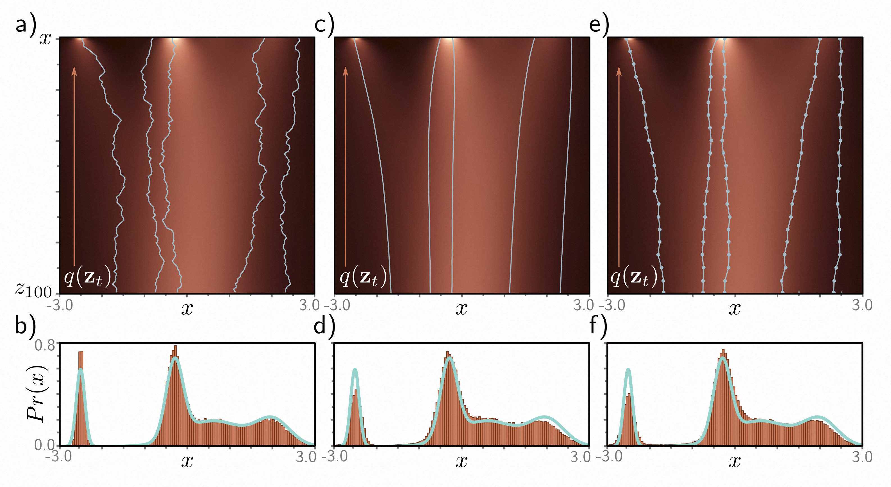

[译]第18章 扩散模型 - Diffusion model 《理解深度学习 - Understanding Deep Learning》

本文是基于Simon J.D. Prince 的新书《Understanding Deep Learning》翻译而来；

* 原书介绍、原书（英文）下载、译文进展 以及 译文内容请戳 ↓↓↓
* [ \[译\]《理解深度学习 - Understanding Deep Learning 》 - 目录&前言 - ATA (atatech.org)](https://ata.atatech.org/articles/11020138829)

----

↓↓↓ 以下正文↓↓↓
----

# 第18章 扩散模型 - Diffusion model

第15章讲述了生成对抗模型，它们可以生成看起来合理的样本，但并不能明确定义数据的概率分布。第16章讨论了归一化流模型。这些模型可以明确定义数据的概率分布，但需要对网络进行一些结构上的限制；每一层都必须可逆，而且雅可比行列式的计算必须容易。第17章介绍了变分自编码器，它们也有坚实的概率基础，但计算似然函数是困难的，需要通过一个下界来近似。

本章介绍了扩散模型。与标准化流模型类似，扩散模型是一种将潜在变量与观测数据之间定义为非线性映射的概率模型，两者具有相同的维度。与变分自编码器类似，它们使用基于编码器的下界来近似数据的似然性，该编码器将数据映射到潜在变量。然而，在扩散模型中，编码器是预先确定的；目标是学习一个与该过程相反的解码器，用于生成样本。扩散模型易于训练，并且能够生成比GAN生成的样本更逼真的高质量样本。在阅读本章之前，读者应该熟悉变分自编码器（第17章）。

## 18.1 概览 - Overview

扩散模型由一个编码器和一个解码器组成。编码器接收一个数据样本 $ \mathbf x $ ，并通过一系列中间潜在变量 $ \mathbf z_{1} \ldots \mathbf z_{T} $ 进行映射。解码器则反向进行这个过程；它从 $ \mathbf z_{T} $ 开始，并通过 $ \mathbf z_{T-1}, \ldots, \mathbf z_{1} $ 进行映射，最终（重新）生成数据点 $ \mathbf x $ 。在编码器和解码器中，映射是随机的，而不是确定的。

编码器是预先指定的；它逐渐将输入与白噪声样本混合在一起（图[18.1]()）。经过足够的步骤，最终潜在变量的条件分布 $ q (\mathbf z_{T} | \mathbf x) $ 和边缘分布 $ q (\mathbf z_{T}) $ 都变成了标准正态分布。由于这个过程是预先指定的，所有学习到的参数都在解码器中。

> 图 18.1 扩散模型。
>
> * 编码器（正向，或扩散过程）将输入 $ \mathbf x $ 通过一系列潜在变量 $ \mathbf z_{1} \ldots \mathbf z_T $ 映射。这个过程是预先指定的，并逐渐将数据与噪声混合，直到只剩下噪声。
> * 解码器（反向过程）是通过学习得到的，并将数据通过潜在变量传递回去，每个阶段去除噪声。训练后，通过对噪声向量 $ \mathbf z_T $ 进行采样，并通过解码器传递它们来生成新的示例。

在解码器中，我们训练了一系列网络来进行相邻的潜变量 $ \mathbf z_{t} $ 和 $ \mathbf z_{t-1} $ 之间的反向映射。通过鼓励每个网络反转对应的编码器步骤，损失函数会逐渐消除表示中的噪声，直到剩下一个逼真的数据示例。为了生成一个新的数据示例 $ \mathbf x $ ，我们从 $ q (\mathbf z_{T}) $ 中抽样，并将其经过解码器处理。

在第18.2节中，我们详细讨论了编码器。尽管它的属性并不明显，但对于学习算法来说至关重要。在第18.3节中，我们讨论了解码器。第18.4节推导出了训练算法，并在第18.5节中重新表述以使其更加实用。第18.6节讨论了实现细节，包括如何根据文本提示进行生成。

## 18.2 编码器（正向过程） - Encoder (forward process)

*扩散* 或 *正向* 过程^[1]^（图 [18.2]() ）将数据样本 $ \mathbf x $ 通过一系列与 $ \mathbf x $ 大小相同的中间变量 $ \mathbf z_{1},\mathbf z_{2} , \ldots,\mathbf z_{T} $ 进行映射：

> ^[1]^注意，这与归一化流的命名方式相反，其中逆映射从数据到潜在变量，正向映射再次返回。

$$
\begin{array}{rcl}\mathbf{z}_1&=&\sqrt{1-\beta_1}\cdot\mathbf{x}+\sqrt{\beta_1}\cdot\boldsymbol\epsilon_1\\\\
\mathbf{z}_t&=&\sqrt{1-\beta_t}\cdot\mathbf{z}_{t-1}+\sqrt{\beta_t}\cdot\boldsymbol\epsilon_t&\forall t\in2,\ldots,T,\end{array}
\tag{18.1}
$$

其中 $ ϵ_{t} $ 是从标准正态分布中抽取的噪声。第一项减弱了数据以及迄今为止添加的任何噪声，第二项添加了更多噪声。超参数 $ β_{t} \in [0,1] $ 决定了噪声融合的速度，被称为*噪声调度*。正向过程可以等价地表示为：

$$
\begin{array}{rcl}q(\mathbf{z}_1|\mathbf{x})&=&\mathrm{Norm}_{\mathbf{z}_1}\left[\sqrt{1-\beta_1}\mathbf{x},\beta_1\mathbf{I}\right]\\\\
q(\mathbf{z}_t|\mathbf{z}_{t-1})&=&\mathrm{Norm}_{\mathbf{z}_t}\left[\sqrt{1-\beta_t}\mathbf{z}_{t-1},\beta_t\mathbf{I}\right]&\forall t\in\{2,\ldots,T\}.\end{array}
\tag{18.2}
$$

这是一个*马尔可夫链*，因为概率 $ \mathbf z_{t} $ 只依赖于前一变量 $ \mathbf z_{t-1} $ 的值。通过足够多的步骤 $ T $ ，所有原始数据的痕迹都被消除， $ q(\mathbf z_{T}|\mathbf x) = q(\mathbf z_{T}) $ 变成了一个标准正态分布。^[2]^

> ^[2]^ 我们使用 $ q (\mathbf z_{t} |\mathbf z_{t-1}) $ 而不是 $ Pr (\mathbf z_{t} |\mathbf z_{t-1}) $ ，以匹配前一章节中VAE编码器描述的符号表示法。

对于给定的输入 $ \mathbf x $ ，所有潜变量 $ \mathbf z_{1},\mathbf z_{2} , \ldots, \mathbf z_{T} $ 的联合分布为：

$$
q(\mathbf{z}_{1\ldots T}|\mathbf{x})=q(\mathbf{z}_{1}|\mathbf{x})\prod_{t=2}^{T}q(\mathbf{z}_{t}|\mathbf{z}_{t-1}).
\tag{18.3}
$$

> 图 18.2 正向过程。
>
> * a）我们考虑一维数据 $ x $ ，其中包含 $ T=100 $ 个潜在变量 $ \mathbf z_{1}, \ldots, \mathbf z_{100} $ ，以及固定的 $ β=0.03 $ 。初始化了三个 $ x $ 值（灰色、青色和橙色）。这些值通过潜在变量 $ z_1, \ldots, z_{100} $ 进行传递。在每个步骤中，变量通过衰减其值 $ \sqrt{1-β} $ ，并添加均值为零、方差为 $ β $ 的噪声（方程[18.1]()）进行更新。因此，这三个示例通过变量的噪声传播，倾向于朝向零。
> * b）条件概率 $ Pr(z_{1}|x) $ 和 $ Pr(z_t|z_{t-1}) $ 是正态分布，均值略微接近当前点的零点，方差固定为 $ β_{t} $ （方程[18.2]()）。

### 18.2.1 扩散核 $ q (\mathbf z_{t} |\mathbf x) $ - Diffusion kernel $ q (\mathbf z_{t} |\mathbf x)$

为了训练解码器以反转这个过程，我们使用多个样本 $ \mathbf z_{t} $ 在时间 $ t $ 上对于同一个示例 $ \mathbf x $ 。然而，当 $ t $ 很大时，使用方程 [18.1]() 逐个生成这些样本是耗时的。幸运的是，对于 $ q (\mathbf z_{t} |\mathbf x) $ 存在一个闭式表达式，它允许我们直接给定初始数据点 $ \mathbf x $ 绘制样本 $ \mathbf z_{t} $ ，而无需计算中间变量 $ \mathbf z_{1} \ldots \mathbf z_{t-1} $ 。这被称为*扩散核* (图 [18.3]() )。为了得到 $ q (\mathbf z_{t} |\mathbf x) $ 的表达式，考虑正向过程的前两个步骤：

$$
\begin{array}{rcl}\mathbf{z}_1&=&\sqrt{1-\beta_1}\cdot\mathbf{x}+\sqrt{\beta_1}\cdot\boldsymbol\epsilon_1\\\\
\mathbf{z}_2&=&\sqrt{1-\beta_2}\cdot\mathbf{z}_1+\sqrt{\beta_2}\cdot\boldsymbol\epsilon_2.\end{array}
\tag{18.4}
$$

将第一个方程代入第二个方程，我们得到：

$$
\begin{aligned}\mathbf{z}_2&=\quad\sqrt{1-\beta_2}\left(\sqrt{1-\beta_1}\cdot\mathbf{x}+\sqrt{\beta_1}\cdot\mathbf{\epsilon}_1\right)+\sqrt{\beta_2}\cdot\boldsymbol\epsilon_2\\\\
&=\quad\sqrt{1-\beta_2}\left(\sqrt{1-\beta_1}\cdot\mathbf{x}+\sqrt{1-(1-\beta_1)}\cdot\boldsymbol\epsilon_1\right)+\sqrt{\beta_2}\cdot\boldsymbol\epsilon_2\\\\
&=\quad\sqrt{(1-\beta_2)(1-\beta_1)}\cdot\mathbf{x}+\sqrt{1-\beta_2-(1-\beta_2)(1-\beta_1)}\cdot\boldsymbol\epsilon_1+\sqrt{\beta_2}\cdot\boldsymbol\epsilon_2.\end{aligned}
\tag{18.5}
$$

最后两项是从均值为零、方差分别为 $ 1-β_{2}-(1-β_{2})(1-β_{1}) $ 和 $ β_{2} $ 的正态分布中独立采样得到的。这个和的均值为零，方差是各分量方差之和（参见问题[18.2]()），因此：

$$
\begin{array}{rcl}\mathbf{z}_2&=&\sqrt{(1-\beta_2)(1-\beta_1)}\cdot\mathbf{x}+\sqrt{1-(1-\beta_2)(1-\beta_1)}\cdot\boldsymbol{\epsilon},\end{array}
\tag{18.6}
$$

其中 $ ϵ $ 也是从标准正态分布中采样得到的样本。

如果我们将这个方程代入 $ \mathbf z_{3} $ 的表达式中，并继续这个过程，我们可以证明：

$$
\mathbf{z}_t=\sqrt{\alpha_t}\cdot\mathbf{x}+\sqrt{1-\alpha_t}\cdot\boldsymbol{\epsilon},
\tag{18.7}
$$

其中 $ α_{t}=\prod_{s=1}^t 1-β_{s} $ 。我们可以用概率的形式来等效地表示：

$$
q(\mathbf{z}_t|\mathbf{x})=\mathrm{Norm}_{\mathbf{z}_t}\Big[\sqrt{\alpha_t}\cdot\mathbf{x},(1-\alpha_t)\mathbf{I}\Big].
\tag{18.8}
$$

对于任意起始数据点 $ \mathbf x $ ，变量 $ \mathbf z_{t} $ 服从已知均值和方差的正态分布。因此，如果我们不关心中间变量 $ \mathbf z_{1} \ldots \mathbf z_{t-1} $ 的演化历史，就可以很容易地从 $ q (\mathbf z_{t} |\mathbf x) $ 中生成样本。

> 图 18.3 扩散核。
>
>* a) 点 $ \mathbf x^{∗} = 2.0 $ 通过方程[18.1]()传播到潜变量上（灰色表示五条路径）。扩散核 $ q (z_t|x^{∗}) $ 是给定从 $ x^{∗} $ 出发的变量 $ z_T $ 的概率分布。它可以通过闭合形式计算，并且是一个均值趋向于零，方差随 $ t $ 增加而增加的正态分布。热图显示了每个变量的 $ q (z_t|x^{∗}) $ 。青色线表示均值加减 $ 2 $ 个标准差。
>* b) 在实践中，扩散核 $ q (z_t|x^{∗}) $ 在 $ t = 20, 40, 80 $ 时显示出来。实际上，扩散核允许我们在不计算中间变量 $ z_{1} , \ldots, z_{t-1} $ 的情况下，对应于给定 $ x^{∗} $ 的样本潜变量 $ z_T $ 。当 $ t $ 变得非常大时，扩散核变成一个标准正态分布。

### 18.2.2 边际分布 $ q(\mathbf z_{t}) $ - Marginal distributions $ q (\mathbf z_{t}) $

边际分布 $ q(\mathbf z_{t}) $ 表示在给定可能的起始点 $ \mathbf x $ 和每个起始点的可能扩散路径（图18.4）的情况下，观察到 $ \mathbf z_{t} $ 的概率。可以通过考虑联合分布 $ q(\mathbf x,\mathbf z_{1 \ldots t}) $ 并在除 $ \mathbf z_{t} $ 之外的所有变量上进行边际化来计算：

$$
\begin{aligned}
q(\mathbf{z}_{t})& =\quad\int\int q(\mathbf{z}_{1...t},\mathbf{x})d\mathbf{z}_{1...t-1}d\mathbf{x} \\\\
&=\quad\int\int q(\mathbf{z}_{1...t}|\mathbf{x})Pr(\mathbf{x})d\mathbf{z}_{1...t-1}d\mathbf{x},
\end{aligned}
\tag{18.9}
$$

其中方程[18.3]()中定义了 $ q(\mathbf z_{1 \ldots t}|\mathbf x) $ 。

然而，由于我们现在有了“跳过”中间变量的扩散核 $ q(\mathbf z_{t} |\mathbf x) $ 的表达式，我们可以等价地写成：

$$
q(\mathbf{z}_t)=\int q(\mathbf{z}_t|\mathbf{x})Pr(\mathbf{x})d\mathbf{x}.
$$
因此，如果我们反复从数据分布 $ Pr (\mathbf x) $ 中采样，并在每个样本上叠加扩散核 $ q (\mathbf z_{t} |\mathbf x) $ ，得到的结果就是边缘分布 $ q (\mathbf z_{t}) $ （图[18.4]()）。然而，由于我们不知道原始数据分布 $ Pr (\mathbf x) $ ，所以边缘分布无法用闭式形式表示。

> 图18.4 边际分布。
>
>* a）给定初始密度 $ Pr(x) $ （顶部行），扩散过程会逐渐使分布变模糊，并通过潜在变量 $ z_T $ 将其转变为标准正态分布。每个后续的热力图水平线代表一个边际分布 $ q(z_t) $ 。
>* b）顶部图表展示了初始分布 $ Pr(x) $ 。其他两个图表展示了边际分布 $ q(z_{20}) $ 和 $ q(z_{60}) $ 。

### 18.2.3 条件分布 $ q (\mathbf z_{t-1}|\mathbf z_{t}) $ - Conditional distribution $ q (\mathbf z_{t-1}|\mathbf z_{t}) $

我们将条件概率 $ q (\mathbf z_{t}|\mathbf z_{t-1}) $ 定义为混合过程（方程[18.2]()）。

为了逆转这个过程，我们应用贝叶斯定理：

$$
q(\mathbf{z}_{t-1}|\mathbf{z}_t)=\frac{q(\mathbf{z}_t|\mathbf{z}_{t-1})q(\mathbf{z}_{t-1})}{q(\mathbf{z}_t)}.
\tag{18.11}
$$

由于无法计算边缘分布 $ q (\mathbf z_{t-1}) $ ，这个过程是无法实现的。

对于这个简单的一维例子，可以通过数值方法来计算 $ q (\mathbf z_{t-1} |\mathbf z_{t}) $ （图 [18.5]()）。一般情况下，它们的形式很复杂，但在许多情况下，可以很好地近似为正态分布。这一点很重要，因为当我们构建解码器时，我们将使用正态分布来近似反向过程。

> 图 18.5 条件分布 $ q (z_{t-1}|z_{t}) $ 。
>
> * a）边际密度 $ q (z_t) $ ，突出显示了三个点 $ z^{∗}_t $ 。
> * b）概率 $ q (z_{t-1}|z^{∗}_t) $ （青色曲线）通过贝叶斯定理计算，与 $ q (z^{∗}_t|z_{t-1})q (z_{t-1}) $ 成正比。一般来说，它不服从正态分布（上图），尽管通常正态分布是一个很好的近似（下面两个图）。第一个似然项 $ q (z^{∗}_t|z_{t-1}) $ 在 $ z_{t-1} $ 上是正态分布（方程[18.2]()），其均值略微偏离零点，并且比 $ z^{∗}_t $ （棕色曲线）较远。第二个项是边缘密度 $ q (z_{t-1}) $ （灰色曲线）。

### 18.2.4 条件扩展分布 $ q (\mathbf z_{t-1}|\mathbf z_{t}, \mathbf x) $ - Conditional diffusion distribution $ q (\mathbf z_{t-1}|\mathbf z_{t}, \mathbf x) $

在考虑编码器相关的最后一个分布。我们注意到，我们无法找到条件分布 $ q (\mathbf z_{t-1} |\mathbf z_{t}) $ ，因为我们不知道边缘分布 $ q (\mathbf z_{t-1}) $ 。然而，如果我们知道起始变量 $ \mathbf x $ ，那么我们在之前的时刻就可以知道分布 $ q (\mathbf z_{t-1}|\mathbf x) $ 。这就是扩散核（图 [18.3]()），它服从正态分布。

因此，我们可以通过计算得到条件扩散分布 $ q (\mathbf z_{t-1} |\mathbf z_{t} , \mathbf x) $ （图[18.6]()）。这个分布用于训练解码器。当我们知道当前的潜在变量 $ \mathbf z_{t} $ 和训练数据示例 $ \mathbf x $ （在训练时我们当然知道）时，它描述了 $ \mathbf z_{t-1} $ 的分布。为了计算 $ q (\mathbf z_{t-1}|\mathbf z_{t} , \mathbf x) $ 的表达式，我们从贝叶斯规则开始:

$$
\begin{aligned}
q(\mathbf{z}_{t-1}|\mathbf{z}_t,\mathbf{x})&=\quad\frac{q(\mathbf{z}_t|\mathbf{z}_{t-1},\mathbf{x})q(\mathbf{z}_{t-1}|\mathbf{x})}{q(\mathbf{z}_t|\mathbf{x})} \\\\
&\propto\quad q(\mathbf{z}_t|\mathbf{z}_{t-1})q(\mathbf{z}_{t-1}|\mathbf{x}) \\\\
&=\quad\mathrm{Norm}_{\mathbf{z}_t}\left[\sqrt{1-\beta_t}\cdot\mathbf{z}_{t-1},\beta_t\mathbf{I}\right]\mathrm{Norm}_{\mathbf{z}_{t-1}}\left[\sqrt{\alpha_{t-1}}\cdot\mathbf{x},(1-\alpha_{t-1})\mathbf{I}\right] \\\\
&\propto\quad\mathrm{Norm}_{\mathbf{z}_{t-1}}\left[\frac1{\sqrt{1-\beta_t}}\mathbf{z}_t,\frac{\beta_t}{1-\beta_t}\mathbf{I}\right]\mathrm{Norm}_{\mathbf{z}_{t-1}}\left[\sqrt{\alpha_{t-1}}\cdot\mathbf{x},(1-\alpha_{t-1})\mathbf{I}\right]
\end{aligned}
\tag{18.12}
$$

在第一二步之间，我们利用了扩散过程是马尔可夫过程的事实，即 $ q (\mathbf z_{t}|\mathbf z_{t-1}, \mathbf x) = q (\mathbf z_{t} |\mathbf z_{t-1}) $ ，因为所有关于 $ \mathbf z_{t} $ 的信息都由 $ \mathbf z_{t-1} $ 捕获到。

在第三行和第四行之间，我们使用了高斯变量改变的公式，将第一个分布重新表示为 $ \mathbf z_{t-1} $ 的形式。然后，我们使用第二个高斯变量的公式将两个 $ \mathbf z_{t-1} $ 中的正态分布合并在一起。

这样得到的结果是：

$$
q(\mathbf{z}_{t-1}|\mathbf{z}_t,\mathbf{x})=\mathrm{Norm}_{\mathbf{z}_{t-1}}\left[\frac{(1-\alpha_{t-1})}{1-\alpha_t}\sqrt{1-\beta_t}\mathbf{z}_t+\frac{\sqrt{\alpha_{t-1}}\beta_t}{1-\alpha_t}\mathbf{x},\frac{\beta_t(1-\alpha_{t-1})}{1-\alpha_t}\mathbf{I}\right]。
$$
请注意，方程[18.12, 18.13]和[18.14]中的比例常数必须相互抵消，因为最终结果已经是正确的归一化概率分布。

## 18.3 解码器（逆向过程） - Decoder model (reverse process)

当我们学习扩散模型时，我们实际上学习的是*逆向过程*。也就是说，我们学习了一系列从潜变量 $ \mathbf z_{T} $ 逆推回 $ \mathbf z_{T-1} $ ，从 $ \mathbf z_{t-1} $ 逆推回 $ \mathbf z_{T-2} $ 等的概率映射，直到达到数据 $ \mathbf x $ 。实际的逆向分布 $ q (\mathbf z_{T-1}|\mathbf z_{t}) $ 是复杂的多模态分布（图[18.5]()），它依赖于数据分布 $ Pr (\mathbf x) $ 。我们将其近似为正态分布：

$$
\begin{aligned}
Pr(\mathbf{z}_t)& =\quad\mathrm{Norm}_{\mathbf{z}_t}[\mathbf{0},\mathbf{I}] \\\\
Pr(\mathbf{z}_{t-1}|\mathbf{z}_t,\boldsymbol{\phi}_t)& =\quad\mathrm{Norm}_{\mathbf{z}_{t-1}}\left[\mathbf{f}_t[\mathbf{z}_t,\boldsymbol{\phi}_t],\sigma_t^2\mathbf{I}\right] \\\\
Pr(\mathbf{x}|\mathbf{z}_1,\boldsymbol{\phi}_1)& =\quad\mathrm{Norm}_\mathbf{x}\biggl[\mathbf{f}_1[\mathbf{z}_1,\boldsymbol{\phi}_1],\sigma_1^2\mathbf{I}\biggr],
\end{aligned}
\tag{18.16}
$$

其中 $ \operatorname{f}_t[\mathbf z_{t}, ϕ_{t}] $ 是一个神经网络，用于计算从 $ \mathbf z_{t} $ 到前一个潜变量 $ \mathbf z_{t-1} $ 的估计映射中的正态分布的均值。项 $ \{ σ^{2}_t \} $ 是预先确定的。如果扩散过程中的超参数 $ β_{t} $ 接近零（并且时间步数 $ T $ 较大），那么这个正态分布的近似是合理的。
我们使用祖先抽样的方法从 $ Pr (\mathbf x) $ 生成新的样本。首先，我们从 $ Pr (\mathbf z_{T}) $ 中抽取 $ \mathbf z_{T} $ 。然后，我们从 $ Pr (\mathbf z_{T-1}|\mathbf z_{T}, ϕ_{T}) $ 中抽取 $ \mathbf z_{T-1} $ ，从 $ Pr (\mathbf z_{T-2}| \mathbf z_{T-1}, ϕ_{T-1}) $ 中抽取 $ \mathbf z_{T-2} $ ，依此类推，直到最后我们从 $ Pr (\mathbf x| \mathbf z_{1}, ϕ_{1}) $ 生成 $ \mathbf x $ 。

> 图 18.6 条件分布 $ q (z_{t-1}|z_{t},x) $ 的示意图。
>
> * a) 在 $ x^{∗} = -2.1 $ 的情况下，有三个点 $ z^{∗}_t $ 被突出显示的扩散核。
> * b) 通过贝叶斯法则计算概率 $ q (z_{t-1}|z^{∗}, x^{∗}) $ ，该概率与 $ q (z^{∗}_t|z_{t-1})q (z_{t-1}|x^{∗}) $ 成正比。这个概率是正态分布的，可以通过闭式计算得到。第一个似然项 $ q (z^{∗}_t|z_{t-1}) $ 在 $ z_{t-1} $ 上是正态分布的（式 [18.2]() ），其均值比 $ z^{∗}_t $ 稍微远离零点（棕色曲线）。第二个项是扩散核 $ q (z_{t-1}|x^{∗}) $ （灰色曲线）。

## 18.4 训练 - Training

观测变量 $ \mathbf x $ 和潜在变量 $ \{\mathbf z_{t}\} $ 的联合分布是：

$$
Pr(\mathbf{x},\mathbf{z}_{1\ldots T}|\phi_{1\ldots T})=Pr(\mathbf{x}|\mathbf{z}_{1},\phi_{1})\prod_{t=2}^{T}Pr(\mathbf{z}_{t-1}|\mathbf{z}_{t},\phi_{t})\cdot Pr(\mathbf{z}_{T}).
\tag{18.17}
$$

通过对潜在变量进行边缘化，可以得出观测数据的似然 $ Pr (\mathbf x| ϕ_{1 \ldots T}) $ ：

$$
Pr(\mathbf{x}|\boldsymbol{\phi}_{1\ldots T})=\int Pr(\mathbf{x},\mathbf{z}_{1\ldots T}|\boldsymbol{\phi}_{1\ldots T})d\mathbf{z}_{1\ldots T}.
\tag{18.18}
$$

为了训练模型，我们针对参数$ϕ$最大化训练数据$ \{\mathbf x_{i}\} $的对数似然：

$$
\hat{\phi}_{1\ldots T}=\underset{\phi_{1\ldots T}}{\operatorname_{argmax}}\left[\sum_{i=1}^I\log\Bigl[Pr(\mathbf{x}_i|\boldsymbol{\phi}_{1\ldots T})\Bigr]\right].
\tag{18.19}
$$

由于方程[18.18]()中的边缘化计算是难以处理的，因此我们使用Jensen不等式来定义似然的下界，并且与VAE（参见第[17.3.1](#evidence-lower-bound-elbo)节）相同，针对这个下界优化参数$ ϕ_{1 \ldots T}$。

### 18.4.1 证据下界（ELBO） - Evidence lower bound (ELBO)

为了得到下界，我们将对数似然乘以编码器分布 $ q(\mathbf z_{1 \ldots T}|\mathbf x) $ 并除以它，然后应用Jensen不等式（见第[17.3.2节](#jensens-inequality)）：

$$
\begin{aligned}
\log\left[Pr(\mathbf{x}|\boldsymbol{\phi}_{1...T})\right]& =\quad\log\left\lfloor\int Pr(\mathbf{x},\mathbf{z}_{1...T}|\boldsymbol{\phi}_{1...T})d\mathbf{z}_{1...T}\right\rfloor  \\\\
&=\quad\log\left[\int q(\mathbf{z}_{1\ldots T}|\mathbf{x})\frac{Pr(\mathbf{x},\mathbf{z}_{1\ldots T}|\boldsymbol{\phi}_{1\ldots T})}{q(\mathbf{z}_{1\ldots T}|\mathbf{x})}d\mathbf{z}_{1\ldots T}\right] \\\\
&\geq\quad\int q(\mathbf{z}_{1\ldots T}|\mathbf{x})\log\left[\frac{Pr(\mathbf{x},\mathbf{z}_{1\ldots T}|\boldsymbol{\phi}_{1\ldots T})}{q(\mathbf{z}_{1\ldots T}|\mathbf{x})}\right]d\mathbf{z}_{1\ldots T}
\end{aligned}
\tag{18.20}
$$

这给我们带来了证据下界（ELBO）：

$$
\mathrm{ELBO}\big[\phi_{1\ldots T}\big]=\int q(\mathbf{z}_{1\ldots T}|\mathbf{x})\log\left[\frac{Pr(\mathbf{x},\mathbf{z}_{1\ldots T}|\boldsymbol{\phi}_{1\ldots T})}{q(\mathbf{z}_{1\ldots T}|\mathbf{x})}\right]d\mathbf{z}_{1\ldots T}
\tag{18.21}
$$

在VAE中，编码器 $ q(\mathbf z|\mathbf x) $ 用于近似潜在变量的后验分布，以使界限更紧密，解码器则通过最大化该界限来完成工作（图[17.10]()）。在扩散模型中，由于编码器没有参数，所以解码器必须承担所有的工作。它通过两种方式使界限更紧密：（i）改变自身的参数，使得静态编码器近似后验分布 $ Pr(\mathbf z_{1 \ldots T}|\mathbf x, ϕ_{1 \ldots T}) $ ；（ii）针对该界限优化自身的参数（参见图[17.6]()）。

### 18.4.2 简化ELBO - Simplifying the ELBO

现在，我们将ELBO中的对数项进行简化，得到最终会进行优化的形式。首先，我们分别使用方程[18.17]和[18.3]中的定义替换分子和分母：

$$
\begin{aligned}
\log\left[\frac{Pr(\mathbf{x},\mathbf{z}_{1\ldots T}|\boldsymbol{\phi}_{1\ldots T})}{q(\mathbf{z}_{1\ldots T}|\mathbf{x})}\right]& =\log\left[\frac{Pr(\mathbf{x}|\mathbf{z}_1,\boldsymbol{\phi}_1)\prod_{t=2}^TPr(\mathbf{z}_{t-1}|\mathbf{z}_t,\boldsymbol{\phi}_t)\cdot Pr(\mathbf{z}_T)}{q(\mathbf{z}_1|\mathbf{x})\prod_{t=2}^Tq(\mathbf{z}_t|\mathbf{z}_{t-1})}\right] \\\\
&=\log\left[\frac{Pr(\mathbf{x}|\mathbf{z}_1,\boldsymbol{\phi}_1)}{q(\mathbf{z}_1|\mathbf{x})}\right]+\log\left[\frac{\prod_{t=2}^TPr(\mathbf{z}_{t-1}|\mathbf{z}_t,\boldsymbol{\phi}_t)}{\prod_{t=2}^Tq(\mathbf{z}_t|\mathbf{z}_{t-1})}\right]+\log\Bigl[Pr(\mathbf{z}_T)\Bigr]
\end{aligned}
\tag{18.22}
$$

然后我们展开第二项的分母：

$$
q(\mathbf{z}_t|\mathbf{z}_{t-1})=q(\mathbf{z}_t|\mathbf{z}_{t-1},\mathbf{x})=\frac{q(\mathbf{z}_{t-1}|\mathbf{z}_t,\mathbf{x})q(\mathbf{z}_t|\mathbf{x})}{q(\mathbf{z}_{t-1}|\mathbf{x})},
\tag{18.23}
$$

其中第一个等式成立是因为变量 $ \mathbf z_{t} $ 的所有信息都包含在 $ \mathbf z_{t-1} $ 中，因此对数据 $ \mathbf x $ 的额外条件无关紧要。第二个等式是对贝叶斯规则的简单应用。
将这个结果代入得到：

$$
\begin{aligned}
&\log\left[\frac{Pr(\mathbf{x},\mathbf{z}_{1\ldots T}|\boldsymbol{\phi}_{1\ldots T})}{q(\mathbf{z}_{1\ldots T}|\mathbf{x})}\right] \\\\
&=\log\left[\frac{Pr(\mathbf{x}|\mathbf{z}_1,\phi_1)}{q(\mathbf{z}_1|\mathbf{x})}\right]+\log\left[\frac{\prod_{t=2}^TPr(\mathbf{z}_{t-1}|\mathbf{z}_t,\phi_t)\cdot q(\mathbf{z}_{t-1}|\mathbf{x})}{\prod_{t=2}^Tq(\mathbf{z}_{t-1}|\mathbf{z}_t,\mathbf{x})\cdot q(\mathbf{z}_t|\mathbf{x})}\right]+\log\Bigl[Pr(\mathbf{z}_T)\Bigr] \\\\
&=\log\left[Pr(\mathbf{x}|\mathbf{z}_1,\phi_1)\right]+\log\left[\frac{\prod_{t=2}^TPr(\mathbf{z}_{t-1}|\mathbf{z}_t,\phi_t)}{\prod_{t=2}^Tq(\mathbf{z}_{t-1}|\mathbf{z}_t,\mathbf{x})}\right]+\log\left[\frac{Pr(\mathbf{z}_T)}{q(\mathbf{z}_T|\mathbf{x})}\right] \\\\
&\begin{aligned}\approx\log\left[Pr(\mathbf{x}|\mathbf{z}_1,\boldsymbol{\phi}_1)\right]+\sum_{t=2}^T\log\left[\frac{Pr(\mathbf{z}_{t-1}|\mathbf{z}_t,\boldsymbol{\phi}_t)}{q(\mathbf{z}_{t-1}|\mathbf{z}_t,\mathbf{x})}\right],\end{aligned}
\end{aligned}
\tag{18.24}
$$

 在第二行和第三行之间，比值乘积中的所有项都相互抵消，只剩下 $ q (\mathbf z_{1} | \mathbf x) $ 和 $ q (\mathbf z_{T} | \mathbf x) $ 。第三行的最后一项近似为 $ \operatorname{log} [1] = 0 $ ，因为正向过程 $ q (\mathbf z_{T} | \mathbf x) $ 的结果是一个标准正态分布，所以与先验 $ Pr (\mathbf z_{T}) $ 相等。

简化后的 ELBO 如下：

$$
\begin{aligned}
\text{ELBC}& \begin{bmatrix}\phi_1...T\end{bmatrix} \\\\
&=\quad\int q(\mathbf{z}_{1\ldots T}|\mathbf{x})\log\left[\frac{Pr(\mathbf{x},\mathbf{z}_{1\ldots T}|\boldsymbol{\phi}_{1\ldots T})}{q(\mathbf{z}_{1\ldots T}|\mathbf{x})}\right]d\mathbf{z}_{1\ldots T} \\\\
&\approx\quad\int q(\mathbf{z}_{1\ldots T}|\mathbf{x})\left(\log\left[Pr(\mathbf{x}|\mathbf{z}_{1},\phi_{1})\right]+\sum_{t=2}^{T}\log\left[\frac{Pr(\mathbf{z}_{t-1}|\mathbf{z}_{t},\phi_{t})}{q(\mathbf{z}_{t-1}|\mathbf{z}_{t},\mathbf{x})}\right]\right)d\mathbf{z}_{1\ldots T} \\\\
&=\quad\mathbb{E}_{q(\mathbf{z}_1|\mathbf{x})}\left[\log\left[Pr(\mathbf{x}|\mathbf{z}_1,\phi_1)\right]\right]-\sum_{t=2}^T\mathbb{E}_{q(\mathbf{z}_t|\mathbf{x})}\left[\mathrm{D}_{KL}\left[q(\mathbf{z}_{t-1}|\mathbf{z}_t,\mathbf{x})||Pr(\mathbf{z}_{t-1}|\mathbf{z}_t,\boldsymbol{\phi}_t)\right]\right],
\end{aligned}
\tag{18.25}
$$

在第二行和第三行之间，我们对 $ q (\mathbf z_{1 \ldots T}|\mathbf x) $ 中的无关变量进行了边际化，然后使用了 KL 散度的定义（参见问题 [18.7]()）。

### 18.4.3 分析ELBO - Analyzing the ELBO

ELBO中的第一个概率项在方程[18.16]()中被定义为：

$$
Pr(\mathbf{x}|\mathbf{z}_1,\boldsymbol{\phi}_1)=\mathrm{Norm}_\mathbf{x}\Big[\mathbf{f}_1[\mathbf{z}_1,\boldsymbol{\phi}_1],\sigma_1^2\mathbf{I}\Big],
\tag{18.26}
$$

它相当于VAE中的重构项。如果模型的预测与观察数据匹配，ELBO的值将更大。对于VAE，我们将使用蒙特卡洛估计（见方程[17.22-17.23]()）来近似对这个量的对数期望，其中我们使用从 $ q(\mathbf z_{1} |\mathbf x) $ 中采样的样本来进行估计。

ELBO中的KL散度项衡量了先前时刻的潜变量 $\mathbf  z_{t-1} $ 在给定当前时刻的潜变量 $\mathbf  z_t $ 和参数 $ \phi_t $ 的条件下的分布 $ Pr(\mathbf z_{t-1}|\mathbf z_t, \phi_t) $ 与后验分布 $ q(\mathbf z_{t-1}|\mathbf z_t, x) $ 之间的差异，分别在方程[18.16]()和[18.15]()中定义：

$$
\begin{array}{rcl}Pr(\mathbf{z}_{t-1}|\mathbf{z}_t,\phi_t)&=&\mathrm{Norm}_{\mathbf{z}_{t-1}}\left[\mathbf{f}_t[\mathbf{z}_t,\phi_t],\sigma_t^2\mathbf{I}\right]\\\\
q(\mathbf{z}_{t-1}|\mathbf{z}_t,\mathbf{x})&=&\mathrm{Norm}_{\mathbf{z}_{t-1}}\left[\frac{(1-\alpha_{t-1})}{1-\alpha_t}\sqrt{1-\beta_t}\mathbf{z}_t+\frac{\sqrt{\alpha_{t-1}}\beta_t}{1-\alpha_t}\mathbf{x},\frac{\beta_t(1-\alpha_{t-1})}{1-\alpha_t}\mathbf{I}\right].\end{array}
\tag{18.27}
$$

两个正态分布之间的KL散度有一个闭式表达式。此外，该表达式中的许多项不依赖于参数 $ ϕ $ （参见问题[18.8]()），因此该表达式简化为均值之间的平方差加上一个常数 $ C $ ：

$$
\begin{aligned}D_{KL}\left[q(\mathbf{z}_{t-1}|\mathbf{z}_t,\mathbf{x})||Pr(\mathbf{z}_{t-1}|\mathbf{z}_t,\boldsymbol{\phi}_t)\right]&=&\\\\
&\frac1{2\sigma_t^2}\left\|\frac{(1-\alpha_{t-1})}{1-\alpha_t}\sqrt{1-\beta_t}\mathbf{z}_t+\frac{\sqrt{\alpha_{t-1}}\beta_t}{1-\alpha_t}\mathbf{x}-\mathbf{f}_t[\mathbf{z}_t,\boldsymbol{\phi}_t]\right\|^2+C.\end{aligned}
\tag{18.28}
$$

### 18.4.4 扩散损失函数 - Diffusion loss function

为了拟合模型，我们最大化对参数$ ϕ_{1 \ldots T}$的ELBO。通过乘以负一并用样本来近似期望，我们将其重新表述为最小化的损失函数：

$$
\begin{aligned}L[\phi_{1...T}]&=\sum_{i=1}^{I}\Big(\overbrace{-\log\Big[\mathrm{Norm}_{\mathbf{x}_i}\big[\mathbf{f}_1[\mathbf{z}_{i1},\phi_1],\sigma_1^2\mathbf{I}\big]}^{\text{重构项}} \Big ]\\\\
& +  \sum _ { t = 2 }^{T}\frac{1-\alpha_{t-1}}{2\sigma_t^2}\Big\Vert\underbrace{\frac{1-\alpha_{t-1}}{1-\alpha_t}\sqrt{1-\beta_t}\mathbf{z}_{it}+\frac{\sqrt{\alpha_{t-1}}\beta_t}{1-\alpha_t}\mathbf{x}_i}_{\text{目标，}q(\mathbf{z}_{t-1}|\mathbf{z}_{t},\mathbf{x})\text{的均值}}-\underbrace{\mathbf{f}_t[\mathbf{z}_{it},\mathbf{\phi}_t]}_{\text{预测的}\mathbf{z}_{t-1}}\Big\Vert^2\Big),\end{aligned}
\tag{18.29}
$$

其中$ \mathbf x_{i} $是第$ i^{th} $个数据点，而$ \mathbf z_{it} $是扩散步骤$ t $对应的潜变量。

### 18.4.5 训练过程 - Training procedure

这个损失函数可用于为每个扩散时间步训练网络。它的目标是使前一时间步的隐藏变量估计 $ \mathbf f_t[\mathbf z_{t}, ϕ_{t}] $ 与给定的真实去噪数据 $ \mathbf x $ 的最可能值之间的差异最小化。

图[18.7]()和[18.8]()展示了简单的1D示例的拟合逆过程。该模型的训练步骤如下：(i) 从原始密度中获取大量示例 $ \mathbf x $ ，(ii) 使用扩散核在每个时间 $ t $ 预测潜在变量 $ \mathbf z_{t} $ 的多个对应值，然后 (iii) 训练模型 $ \mathbf f_t[\mathbf z_{t}, ϕ_{t}] $ 以最小化方程[18.29]()中的损失函数。这些模型是非参数的（即，将1D输入与1D输出相关联的查找表），但更常见的情况是它们是深度神经网络。

> 图 18.7 拟合模型。
>
> * a) 通过从标准正态分布 $ Pr(z_T) $ （底部行）中进行采样，然后从 $ Pr(z_{T-1}|z_T) = \operatorname{Norm}_{\mathbf z_{T-1}}[\operatorname{f}_{T}[z_T,ϕ_T], σ^{2}_T\mathbf I] $ 中采样 $ z_{T-1} $ ，一直进行下去，直到得到 $ \mathbf x $ （显示了五条路径）。这些样本的估计边际密度（热图）是这些样本的聚合，与真实的边际密度（图[18.4]()）相似。
> * b) 估计的分布 $ Pr(z_{t-1}|z_{t}) $ （棕色曲线）是扩散模型的真实后验 $ q(z_{t-1}|z_{t}) $ （青色曲线）的合理近似，如图[18.5]()所示。估计模型和真实模型的边际分布 $ Pr(z_t) $ 和 $ q(z_t) $ （分别为深蓝色和灰色曲线）也相似。

> 图 18.8 拟合模型的结果。
> 青色和棕色曲线分别对应图[18.4]()和图[18.7]()的顶部行所示的原始和估计密度。垂直条是从模型中生成的分箱样本，通过从 $ Pr(\mathbf z_T) $ 进行采样，并通过变量 $ \mathbf z_{t-1}, \mathbf z_{t-2}, \ldots $ 向前传播生成，如图[18.7]()中的五条路径所示。

## 18.5 损失函数的参数化 - Reparameterization of loss function

虽然可以使用方程[18.29]中的损失函数，但是在不同的参数化下发现扩散模型效果更好；修改了损失函数，使得模型的目标是预测当前变量中与原始数据示例混合的噪声。第18.5.1节讨论了目标的参数化（方程[18.29]第二行的前两个术语），第18.5.2节讨论了网络的参数化（方程[18.29]第二行的最后一个术语）。

### 18.5.1 目标的参数化 - Reparameterization of target

原始的扩散更新公式如下：

$$
\mathbf{z}_t=\sqrt{\alpha_t}\cdot\mathbf{x}+\sqrt{1-\alpha_t}\cdot\boldsymbol{\epsilon}.
\tag{18.30}
$$

根据方程[18.28]()，数据项 $ \mathbf{x} $ 可以表示为扩散图像减去添加的噪声：

$$
\mathbf{x}=\frac1{\sqrt{\alpha_t}}\cdot\mathbf{z}_t-\frac{\sqrt{1-\alpha_t}}{\sqrt{\alpha_t}}\cdot\boldsymbol{\epsilon}.
$$
将这个代入方程[18.29]()的目标项中，可以得到：

$$
\begin{aligned}
\frac{(1-\alpha_{t-1})}{1-\alpha_t}\sqrt{1-\beta_t}\mathbf{z}_t&+\frac{\sqrt{\alpha_{t-1}}\beta_t}{1-\alpha_t}\mathbf{x} \\\\
&=\frac{(1-\alpha_{t-1})}{1-\alpha_t}\sqrt{1-\beta_t}\mathbf{z}_t+\frac{\sqrt{\alpha_{t-1}}\beta_t}{1-\alpha_t}\left(\frac1{\sqrt{\alpha_t}}\mathbf{z}_t-\frac{\sqrt{1-\alpha_t}}{\sqrt{\alpha_t}}\boldsymbol{\epsilon}\right) \\\\
&=\frac{(1-\alpha_{t-1})}{1-\alpha_t}\sqrt{1-\beta_t}\mathbf{z}_t+\frac{\beta_t}{1-\alpha_t}\left(\frac1{\sqrt{1-\beta_t}}\mathbf{z}_t-\frac{\sqrt{1-\alpha_t}}{\sqrt{1-\beta_t}}\boldsymbol{\epsilon}\right),
\end{aligned}
$$

其中在第二行和第三行之间用到了 $ \sqrt{α_{t}}/\sqrt{α_{t-1}} = \sqrt{1-β_{t}} $ 的关系。进一步简化后，我们得到：

$$
\begin{aligned}
\frac{(1-\alpha_{t-1})}{1-\alpha_t}\sqrt{1-\beta_t}\mathbf{z}_t&+\frac{\sqrt{\alpha_{t-1}}\beta_{t}}{1-\alpha_{t}}\mathbf{x} \\\\
&=\left(\frac{(1-\alpha_{t-1})\sqrt{1-\beta_t}}{1-\alpha_t}+\frac{\beta_t}{(1-\alpha_t)\sqrt{1-\beta_t}}\right)\mathbf{z}_t-\frac{\beta_t}{\sqrt{1-\alpha_t}\sqrt{1-\beta_t}}\boldsymbol{\epsilon} \\\\
&=\left(\frac{(1-\alpha_{t-1})(1-\beta_t)}{(1-\alpha_t)\sqrt{1-\beta_t}}+\frac{\beta_t}{(1-\alpha_t)\sqrt{1-\beta_t}}\right)\mathbf{z}_t-\frac{\beta_t}{\sqrt{1-\alpha_t}\sqrt{1-\beta_t}}\boldsymbol{\epsilon} \\\\
&=\frac{(1-\alpha_{t-1})(1-\beta_t)+\beta_t}{(1-\alpha_t)\sqrt{1-\beta_t}}\mathbf{z}_t-\frac{\beta_t}{\sqrt{1-\alpha_t}\sqrt{1-\beta_t}}\boldsymbol{\epsilon} \\\\
&=\frac{1-\alpha_t}{(1-\alpha_t)\sqrt{1-\beta_t}}\mathbf{z}_t-\frac{\beta_t}{\sqrt{1-\alpha_t}\sqrt{1-\beta_t}}\boldsymbol{\epsilon} \\\\
&=\frac1{\sqrt{1-\beta_t}}\mathbf{z}_t-\frac{\beta_t}{\sqrt{1-\alpha_t}\sqrt{1-\beta_t}}\boldsymbol{\epsilon},
\end{aligned}
$$

其中在第二行和第三行之间将第一项的分子和分母都乘以了 $ \sqrt{1-β_{t}} $ ，将各项展开，并在第三行和第四行之间简化了第一项的分子。

将其代入损失函数（方程[18.29]()）中，我们有：

$$
\begin{array}{rcl}L[\boldsymbol{\phi}_{1\ldots T}]&=&\sum_{i=1}^I-\log\Bigl[\mathrm{Norm}_{\mathbf{x}_i}\left[\mathbf{f}_1[\mathbf{z}_{i1},\boldsymbol{\phi}_1],\sigma_1^2\mathbf{I}\right]\Bigr]\\\\
&&+\sum_{t=2}^T\frac{1}{2\sigma_t^2}\left\|\left(\frac{1}{\sqrt{1-\beta_t}}\mathbf{z}_{it}-\frac{\beta_t}{\sqrt{1-\alpha_t}\sqrt{1-\beta_t}}\boldsymbol{\epsilon}\right)-\mathbf{f}_t[\mathbf{z}_{it},\boldsymbol{\phi}_t]\right\|^2.\end{array}
\tag{18.34}
$$

### 18.5.2 网络的重参数化 - Reparameterization of network

现在我们用一个新模型 $ \hat{\mathbf z}_{t-1} = \mathbf f_{t}[\mathbf z_t,ϕ_t] $ 替换模型 $ \hat{\mathbf z}_{t-1} = \mathbf f_{t}[\mathbf z_t,ϕ_t] $ ，新模型 $ \hat{ϵ} = \mathbf g_t [\mathbf z_{t}, ϕ_{t}] $ 预测了与 $ \mathbf x $ 混合以创建 $ \mathbf z_{t} $ 的噪声 $ ϵ $ ：

$$
\mathrm{f}_t[\mathbf{z}_t,\phi_t]=\frac{1}{\sqrt{1-\beta_t}}\mathbf{z}_t-\frac{\beta_t}{\sqrt{1-\alpha_t}\sqrt{1-\beta_t}}\mathbf{g}_t[\mathbf{z}_t,\phi_t].
\tag{18.35}
$$

将新模型代入方程[18.34]()得到的准则是：

$$
\begin{aligned}
L[\phi_{1\ldots T}]=&\\
\sum_{i=1}^{I}-&\log\Bigl[\mathrm{Norm}_{\mathbf{x}_i}\left[\mathrm{f}_1[\mathbf{z}_{i1},\phi_1],\sigma_1^2\mathbf{I}\right]\Bigr]+\sum_{t=2}^{T}\frac{\beta_t^2}{(1-\alpha_t)(1-\beta_t)2\sigma_t^2}\Bigr\Vert\mathrm{g}_t[\mathrm{z}_{it},\phi_t]-\epsilon_{it}\Bigr\Vert^2.
\end{aligned}
\tag{18.36}
$$

对数正态分布可以写成最小二乘损失加上常数 $ C_i $ （参见[5.3.1节](#least-squares-loss-function)）：
$$
L[\phi_{1\ldots T}]=\sum_{i=1}^I\frac1{2\sigma_1^2}\begin{Vmatrix}\mathbf{x}_i-\mathbf{f}_1[\mathbf{z}_{i1},\phi_1]\end{Vmatrix}^2+\sum_{t=2}^T\frac{\beta_t^2}{(1-\alpha_t)(1-\beta_t)2\sigma_t^2}\begin{Vmatrix}\mathbf{g}_t[\mathbf{z}_{it},\boldsymbol{\phi}_t]-\boldsymbol{\epsilon}_{it}\end{Vmatrix}^2+C_i
$$

将 $ \mathbf x $ 和 $ \mathbf f_1[\mathbf z_{1}, ϕ_{1}] $ 的定义从方程[18.31]()和[18.35]()中代入，第一项简化为：

$$
\frac{1}{2\sigma_1^2}\left\|\mathbf{x}_i-\mathbf{f}_1[\mathbf{z}_{i1},\boldsymbol{\phi}_1]\right\|^2=\frac{1}{2\sigma_1^2}\left\|\frac{\beta_1}{\sqrt{1-\alpha_1}\sqrt{1-\beta_1}}\mathbf{g}_1[\mathbf{z}_{i1},\boldsymbol{\phi}_1]-\frac{\beta_1}{\sqrt{1-\alpha_1}\sqrt{1-\beta_1}}\boldsymbol{\epsilon}_{i1}\right\|^2.
\tag{18.37}
$$

将此项加到最终的损失函数中：

$$
L[\phi_{1...T}]=\sum_{i=1}^I\sum_{t=1}^T\frac{\beta_t^2}{(1-\alpha_t)(1-\beta_t)2\sigma_t^2}\Big\Vert\mathbf{g}_t[\mathbf{z}_{it},\phi_t]-\epsilon_{it}\Big\Vert^2,
\tag{18.38}
$$

我们忽略了加法常数 $ C_{i} $ 。

在实践中，忽略了缩放因子（在每个时间步可能不同），得到了一个更简单的公式：

$$
\begin{aligned}
L[\boldsymbol{\phi}_{1\ldots T}]& \begin{aligned}=&\sum_{i=1}^I\sum_{t=1}^T\left\|\mathbf{g}_t[\mathbf{z}_{it},\phi_t]-\boldsymbol{\epsilon}_{it}\right\|^2\end{aligned} \\
&=\quad\sum_{i=1}^I\sum_{t=1}^T\left\|\mathbf{g}_t\Big[\sqrt{\alpha_t}\cdot\mathbf{x}_i+\sqrt{1-\alpha_t}\cdot\boldsymbol{\epsilon}_{it},\boldsymbol{\phi}_t\Big]-\boldsymbol{\epsilon}_{it}\right\|^2,
\end{aligned}
\tag{18.39}
$$

在第二行中，我们使用了扩散核（方程18.30）来重新表示 $ \mathbf z_{t} $ 。

## 18.6 实现 - Implementation

这导致了训练模型（算法[18.1]()）和抽样（算法[18.2]()）的简单算法。训练算法的优点是它既易于实现，又能自然地增加数据集；在每个时间步骤中，我们可以使用不同的噪声实例化 $ \mathbf x_{i} $ 多次重复使用每个原始数据点。抽样算法的缺点是需要串行处理许多神经网络 $ \mathbf g_t[\mathbf z_{t}, ϕ_{t}] $ ，因此耗时。

### 18.6.1 图像应用 - Application to images

扩散模型在建模图像数据方面非常成功。在这里，我们需要构建能够接收带有噪声的图像并预测每个步骤中添加的噪声的模型。对于这种图像到图像的映射，最明显的架构选择是UNet（第11.10节）。然而，可能会有非常多的扩散步骤，训练和存储多个U-Net是低效的。解决方案是训练一个单独的U-Net，该U-Net还接收表示时间步骤的预定向量作为输入（图18.9）。实际上，这个向量被调整大小以匹配U-Net每个阶段的通道数，并用于在每个空间位置上调整和/或缩放表示。

> 图 18.9 在图像扩散模型中使用的 U-Net。该网络旨在预测添加到图像中的噪声。它由一个编码器和一个解码器组成。编码器通过减小尺度和增加通道数来处理输入，而解码器通过增加尺度和减少通道数来恢复输出。编码器的表示与解码器的相应表示级联连接起来。相邻表示之间的连接包括残差块，并且周期性全局自注意力机制使得每个空间位置都与其他空间位置相互作用。同一个网络在所有时间步骤中都被使用，通过将正弦时间嵌入（图 [12.5]()）通过一个浅层神经网络，并将结果添加到 U-Net 的每个空间位置的通道中。

为了使条件概率 $ q (\mathbf z_{t-1}|\mathbf z_{t}) $ 接近正态分布，与解码器分布 $ Pr (\mathbf z_{t-1} |\mathbf z_{t}, ϕ_{t}) $ 的形式相匹配，需要进行大量的时间步骤。然而，这样会导致采样速度变慢。为了生成好的图像，我们可能需要运行U-Net模型进行1000个步骤。

### 18.6.2 改善生成速度 - Improving generation speed

损失函数（公式[18.39]）要求扩散核函数具有形式 $ q(\mathbf z_{t-1}|\mathbf z_t)=\operatorname{Norm}[\sqrt{α_{t}}\mathbf x, \sqrt{1-α_{t}}·\mathbf I] $ 。对于满足这种关系的任何前向过程，都可以使用相同的损失函数，而且有一系列与之兼容的过程。这些过程都是通过相同的损失函数进行优化的，但在前向过程中有不同的规则，以及在逆向过程中使用估计的噪声 $ \operatorname g [\mathbf z_{t}, ϕ_{t}] $ 来从 $ \mathbf z_{t} $ 预测 $ \mathbf z_{t-1} $ 的相应规则（图[18.10]()）。

> 图18.10 与相同模型兼容的不同扩散过程。
>
>* a）在地面真实边缘分布上叠加了重新参数化模型的五条采样轨迹。顶部行代表 $ Pr(\mathbf x) $ ，随后的行代表 $ q(\mathbf x_t) $ 。
>* b）从重新参数化模型生成的样本直方图与地面真实密度曲线 $ Pr(\mathbf x) $ 绘制在一起。同一个训练模型适用于一系列扩散模型（和相应的相反方向的更新），包括去噪扩散隐式（DDIM）模型，该模型是确定性的，在每个步骤中不添加噪声。
>* c）DDIM模型的五条轨迹。
>* d）DDIM模型的样本直方图。同一个模型也适用于加速扩散模型，该模型跳过推断步骤以增加采样速度。
>* e）加速模型的五条轨迹。
>* f）加速模型的样本直方图。

在这个家族中，有一种叫做"去噪扩散隐式模型"的模型，在第一步从 $ \mathbf x $ 到 $ \mathbf z_{1} $ 后就不再是随机的了。还有一种叫做"加速采样"的模型，它只在时间步的子序列上定义正向过程。这种模型允许跳过一些时间步骤进行反向过程，从而使采样更加高效；当正向过程不再是随机的时候，只需要50个时间步就能产生良好的样本。虽然这比以前快了很多，但仍然比大多数其他生成模型慢一些。

### 18.6.3 条件生成 - Conditional generation

如果数据附带有标签 $ c $ ，我们可以利用这些标签来控制生成过程。在生成对抗网络中，有时这样做可以改善生成结果，我们也可以期望在扩散模型中也是如此；如果你对图像的内容有一些信息，那么去噪图像就会更容易。在扩散模型中，一种条件合成的方法是*分类器引导*。它通过修改从 $ \mathbf z_{t} $ 到 $ \mathbf z_{t-1} $ 的去噪更新来考虑类别信息 $ c $ 。在实践中，这意味着在算法[18.2]()的最后一个更新步骤中添加一个额外的项，得到：

$$
\mathbf{z}_{t-1}=\hat{\mathbf{z}}_{t-1}+\sigma_t^2\frac{\partial\log\bigl[\Pr(c|\mathbf{z}_t)\bigr]}{\partial\mathbf{z}_t}+\sigma_t\boldsymbol{\epsilon}.
\tag{18.40}
$$

新的项取决于基于潜变量 $ \mathbf z_{t} $ 的分类器 $ Pr (c|\mathbf{z}_{t}) $ 的梯度。这个分类器将U-Net的下采样部分的特征映射到类别 $ \mathbf c $ 。与U-Net类似，该分类器通常在所有时间步共享，并将时间作为输入。从 $ \mathbf z_{t} $ 更新到 $ \mathbf z_{t-1} $ 现在使得类别 $ c $ 更有可能发生。

*无分类器引导* 是一种避免学习单独分类器 $ Pr (c|\mathbf{z}_{t}) $ 的方法，而是将类别信息融入到主要模型 $ \operatorname{g}_t[\mathbf z_{t}, ϕ_{t}, c] $ 中。在实践中，通常通过在 U-Net 的层中添加基于 $ c $ 的嵌入来实现，类似于添加时间步的方式（参见图 [18.9]() ）。该模型通过在训练过程中随机丢弃类别信息，联合训练条件和无条件目标。因此，在测试时，它可以生成无条件或有条件的数据示例，或者两者的加权组合。这带来了一个令人惊讶的优势；如果过度加权条件信息，模型倾向于产生非常高质量但稍微刻板的示例。这在某种程度上类似于 GAN 中的截断使用（图 [15.10]() ）。

### 18.6.4 改善生成质量 - Improving generation quality

就像其他生成模型一样，通过在基本模型上应用一些技巧和扩展可以获得最高质量的结果。首先，已经注意到估计反向过程的方差 $ σ^{2} $ 和均值（即图 [18.7]() 中褐色正态分布的宽度）也对提高结果的质量有所帮助。尤其是在采样时使用较少的步骤时，这一点尤为重要。其次，可以改变正向过程中的噪声调度，使得每个步骤中的 $ β_{t} $ 都有所变化，这也可以改善结果的质量。

第三，为了生成高分辨率图像，使用了一系列的扩散模型。首先创建一个低分辨率图像（可能由类信息引导）。随后的扩散模型逐步生成更高分辨率的图像。它们根据低分辨率图像的大小进行条件控制，将其调整大小并添加到组成U-Net的层中，同时还可以使用其他类信息（图[18.11]()）。

> 图18.11 基于文本提示的级联条件生成。
>
> * a）使用一系列U-Net生成64×64的图像。
> * b）这个生成过程以语言模型计算的句子嵌入为条件。
> * c）生成了更高分辨率的256×256图像，并以较小图像和文本编码为条件。
> * d）重复该过程以创建1024×1024的图像。
> * e）最终的图像序列。改编自[Saharia et al. , 2022b]()。

通过结合所有这些技术，可以生成非常高质量的图像。图[18.12]()展示了基于ImageNet类别条件的模型生成的图像示例。令人印象深刻的是，同一模型能够学习生成如此多样的类别。图[18.13]()展示了从一个模型生成的图像，该模型经过训练能够根据由类似BERT的语言模型编码的文本标题进行条件建模，这些标题以与时间步骤相同的方式插入到模型中（参见图[18.9]()和[18.11]()）。这样可以生成与标题相符的非常逼真的图像。由于扩散模型的本质是随机的，因此可以生成多个基于相同标题的图像。

> 图 18.12 使用分类器引导的条件生成。根据不同的 ImageNet 类别作为条件生成的图像样本。同一个模型可以生成高质量的各种不同类别的图像样本。改编自[Dhariwal & Nichol, 2021]()。

> 图 18.13 使用文本提示的条件生成。通过一个级联生成框架，根据由大型语言模型编码的文本提示作为条件生成的合成图像。这个随机模型可以生成许多与提示相匹配的不同图像。该模型可以计算物体数量并将文本融入图像中。改编自[Saharia 等人，2022b]()。

## 18.7 总结 - Summary

扩散模型通过多次融合当前表示和随机噪声，将数据示例映射到一系列潜在变量上。经过足够多的步骤后，表示将变得与白噪声无法区分。由于这些步骤很小，每个步骤的反向去噪过程可以用正态分布来近似，并由深度学习模型进行预测。损失函数基于证据下界（ELBO），最终导致一个简单的最小二乘公式。

在图像生成中，每个去噪步骤都使用 U-Net 实现，因此与其他生成模型相比，采样速度较慢。为了提高生成速度，可以将扩散模型改为确定性公式，并且在这种情况下，采样较少的步骤也能得到良好的效果。已经提出了几种方法来将生成与类别信息、图像和文本信息相结合，这些方法产生了令人印象深刻的文本到图像的合成结果。

## 18.8 笔记 - Notes

去噪扩散模型是由[Sohl-Dickstein et al., 2015]()引入的，而基于分数匹配的早期相关工作是由[Song＆Ermon, 2019]()进行的。[Ho et al., 2020]()生成的图像样本与GAN相媲美，并引发了对这一领域的浓厚兴趣。本章中的大部分内容，包括原始公式和重新参数化，都是基于这篇论文推导出来的。[Dhariwal＆Nichol, 2021]()改善了这些结果的质量，并首次证明了扩散模型的图像在Frechet Inception Distance方面比GAN模型更好。截至撰写本文时，有关条件图像合成的最先进成果是由[Karras et al., 2022]()实现的。关于去噪扩散模型的调查可在[Croitoru et al., 2022]()，[Cao et al., 2022]()，[Luo, 2022]()和[Yang et al., 2022]()中找到。

**图像应用：** 扩散模型的应用包括文本转图像生成（Nichol等，2022；Ramesh等，2022；Saharia等，2022b），图像转图像的任务，如上色、修复、裁剪还原（Saharia等，2022a），超分辨率（Saharia等，2022c），图像编辑（Hertz等，2022；Meng等，2021），去除对抗性干扰（Nie等，2022），语义分割（Baranchuk等，2022）和医学影像（Song等，2021b；Chung＆Ye等，2022；Chung等，2022；Peng等，2022；xie＆Li，2022；Luo等，2022），有时扩散模型被用作先验。

**不同的数据类型：** 扩散模型也被应用于视频数据（[Ho等，2022b]；[Harvey等，2022]；[Yang等，2022]；[Höppe等，2022]；[Voleti等，2022]）用于生成、预测过去和未来帧以及插值。它们还被用于3D形状生成（[Zhou等，2021]；[Luo＆Hu，2021]），最近还引入了一种仅使用2D文本到图像扩散模型生成3D模型的技术（[Poole等，2023]）。[Austin等，2021]和[Hoogeboom等，2021]研究了离散数据的扩散模型。[Kong等，2021]和[Chen等，2021d]将扩散模型应用于音频数据。

**去噪的替代方法：** 本章中的扩散模型将噪声与数据混合，并构建一个模型逐渐去除噪声。然而，并非必须使用噪声来降低图像质量。[Rissanen等人，2022年]()提出了一种逐渐模糊图像的方法，[Bansal等人，2022]()证明了相同的思想在一大类不必是随机的图像降级方法中同样适用，包括遮蔽、变形、模糊和像素化等方法。

**与其他生成模型的比较：** 扩散模型比其他生成模型合成的图像质量更高，并且训练起来更简单。可以将它们看作是分层VAE的一种特殊情况（[Vahdat＆Kautz，2020]()；[Sønderby等，2016b]()），其中编码器是固定的，潜在空间的大小与数据相同。它们是概率性的，但在基本形式下，只能计算数据点似然的下界。然而，[Kingma等，2021]()证明，这个下界对于来自归一化流和自回归模型的测试数据的精确对数似然有所改进。扩散模型的似然可以通过将其转换为常微分方程（[Song等，2021c]()）或通过训练基于扩散标准的连续归一化流模型（[Lipman等，2022]()）来计算。扩散模型的主要缺点是速度较慢，并且潜在空间没有语义解释。

**提升质量：** 已经提出了许多技术来改善图像质量。其中包括在网络中重新参数化（参见第 [18.5](#reparameterization-of-loss-function) 节）和对后续项进行等权重处理（[Ho et al. ，2020]()）。随后，[Choi et al. ，2022]() 对损失函数中的不同项进行了权重调整的研究。

[Kingma et al. ，2021]() 通过学习去噪权重 $ β_{t} $ 提高了模型的测试对数似然。相反，[Nichol & Dhariwal ，2021]() 在训练模型之外，通过学习每个时间步骤去噪估计的独立方差 $ σ^{2} $ 来提高性能。[Bao et al. ，2022]() 展示了如何在训练模型之后学习方差的方法。

[Ho等人，2022a]()提出了级联方法来生成非常高分辨率的图像（图[18.11]()）。为了防止低分辨率图像中的伪影传播到更高分辨率，他们引入了*噪声条件增强*；在训练过程中，通过在每个步骤中向低分辨率条件图像添加噪声来降低对具体细节的依赖。在推断过程中，也会进行这一步骤，通过尝试不同的噪声水平来选择最佳的噪声水平值。

**提高速度：** 扩散模型的一个主要缺点是训练和样本抽取需要很长时间。稳定扩散（[Rombach等人，2022]()）通过传统的自动编码器将原始数据投影到较小的潜在空间，并在这个较小的空间中进行扩散过程。这样做的好处是减少了扩散过程中训练数据的维度，并且可以使用扩散模型描述其他类型的数据（如文本、图形等）。[Vahdat等人，2021]()采用了类似的方法。

[Song et al. , 2021a]() 的研究表明，一整个扩散过程家族与训练目标是兼容的。其中大部分过程是非马尔科夫的（即扩散步骤不仅依赖于前一步的结果）。其中一个模型是去噪扩散隐式模型（DDIM），其中更新是非随机的（图18.10b）。这个模型可以采取更大的步长（图18.10b）而不引起大误差。它有效地将模型转化为一个常微分方程（ODE），其中轨迹的曲率很低，并且可以应用高效的数值方法来求解ODEs。

Song等人（2021c）提出了将基础的随机微分方程转化为*概率流动ODE*，其具有与原始过程相同的边际分布。Vahdat等人（2021）、xiao等人（2022b）和Karras等人（2022）都利用求解ODE的技术来加快合成过程。Karras等人（2022）确定了最佳的时间离散化方法，并评估了不同的采样器调度策略。这些和其他改进措施导致在合成过程中所需的步骤数量显著减少。
采样速度较慢，因为需要进行许多小的扩散步骤，以确保后验分布 $ q (\mathbf z_{t-1}|\mathbf z_{t}) $ 接近高斯分布（图 [18.5]() ），因此解码器中的高斯分布是适当的。如果我们在每个去噪步骤中使用描述更复杂分布的模型，那么首先可以减少扩散步骤。为此，[xiao et al. , 2022b]() 研究了使用条件 GAN 模型，[Gao et al. , 2021]() 研究了使用条件能量模型。尽管这些模型不能完全描述原始数据的分布，但它们足以预测（简单得多的）逆扩散步骤。

[Salimans & Ho , 2022]() 将去噪过程的相邻步骤融合为单个步骤，以加快合成的速度。[Dockhorn et al. , 2022]() 在扩散过程中引入了动量。这使得轨迹更加平滑，因此更适合进行粗糙采样。

**条件生成：** [Dhariwal & Nichol , 2021]() 提出了分类器引导的方法，在这种方法中，分类器学习在每个步骤中识别合成对象的类别，并用于偏向该类别的降噪更新。这种方法效果很好，但训练一个独立的分类器成本很高。无分类器引导（[Ho & Salimans , 2022]()）同时训练有条件和无条件的降噪模型，通过在一定比例的时间内丢弃类别信息，实现了类似于dropout的过程。这种技术可以控制条件和无条件成分的相对贡献。过度加权条件成分会使模型生成更典型和真实的样本。

在对图像进行条件控制的标准技术中，通常是将（调整大小后的）图像追加到U-Net的不同层中。例如，在级联生成超分辨率的过程中使用了这种技术（Ho等人，2022a）。Choi等人（2021）提供了一种在无条件扩散模型中对图像进行条件控制的方法，该方法通过将潜在变量与条件图像的潜在变量进行匹配。对于文本的条件控制的标准技术是将文本嵌入线性转换为与U-Net层大小相同，然后以与引入时间嵌入的方式相同将其添加到表示中（图18.9）。

使用一种称为“控制网络”的神经网络结构，现有的扩散模型还可以进行微调，以实现对边缘图、联合位置、分割、深度图等进行条件控制（Zhang＆Agrawala，2023）。

在扩散模型出现之前，最先进的文本生成图像系统基于Transformer。GLIDE和Dall E 2都使用来自CLIP模型的嵌入作为条件，该模型可以生成文本和图像数据的联合嵌入。研究表明，使用大型语言模型的文本嵌入可以产生更好的结果。同样的研究人员还创建了一个用于评估模型能力的基准测试，包括颜色、物体数量、空间关系等特征。此外，还有一种针对中文的文本生成图像模型被开发出来。

**与其他模型的关联：** 本章将扩散模型描述为分层变分自动编码器，因为这种方法与本书的其他部分关联最紧密。然而，扩散模型还与随机微分方程（考虑图[18.5]()中的路径）以及得分匹配（[Song＆Ermon，2019，2020]()）密切相关。[Song等，2021c]()提出了一个基于随机微分方程的框架，涵盖了去噪和得分匹配的解释。扩散模型还与归一化流（[Zhang＆Chen，2021]()）密切相关。[Yang等，2022]()总结了扩散模型与其他生成方法之间的关系。

## 18.9 问题 - Problems

**问题 18.1** 证明当 $ \operatorname{Var}[\mathbf x_{t-1}] = \mathbf I $ 时，使用更新公式：

$$
\mathbf{x}_{t}=\sqrt{1-\beta_{t}}\cdot\mathbf{x}_{t-1}+\sqrt{\beta_{t}}\cdot\mathbf{\epsilon}_{t},
 \tag{18.41}
$$

则有 $ \operatorname{Var}[\mathbf x_t] = \mathbf I $ ，即方差保持不变。

**问题 18.2** 考虑以下变量：

$$
z=a\cdot\epsilon_{1}+b\cdot\epsilon_{2},
\tag{18.42}
$$

其中 $ ϵ_{1} $ 和 $ ϵ_{2} $ 都是从独立的标准正态分布中随机抽取的，均值为零，方差为一。证明：

$$
\begin{array}{rcl}\mathbb{E}[z]&=&0\\\operatorname{Var}[z]&=&a^2+b^2,\\\\\hline\end{array}
\tag{18.43}
$$

因此我们可以等价地计算 $ \mathbf z = \sqrt{ a^{2} + b^{2}}·ϵ $ ，其中 $ ϵ $ 也是从标准正态分布中随机抽取的。

**问题18.3** 按照方程[18.5]()的过程继续，证明：

$$
\begin{array}{rcl}\mathbf{z}_{3}&=&\sqrt{(1-\beta_{3})(1-\beta_{2})(1-\beta_{1})}\cdot\mathbf{x}+\sqrt{1-(1-\beta_{3})(1-\beta_{2})(1-\beta_{1})}\cdot\mathbf{\epsilon}^{\prime},\end{array}
\tag{18.44}
$$

其中 $ ϵ^′ $ 是从标准正态分布中随机抽取的一个数。

**问题18.4**∗ 证明关系：

$$
\mathrm{Norm}_{\mathbf{v}}[\mathbf{A}\mathbf{w},\mathbf{B}]\propto\mathrm{Norm}_{\mathbf{w}}\Big[(\mathbf{A}^T\mathbf{B}^{-1}\mathbf{A})^{-1}\mathbf{A}^T\mathbf{B}^{-1}\mathbf{v},(\mathbf{A}^T\mathbf{B}^{-1}\mathbf{A})^{-1}\Big].
\tag{18.45}
$$

**问题18.5**∗ 证明关系：

$$
\begin{array}{rcl}\mathrm{Norm_x[a,A]Norm_x[b,B]}&\propto&\mathrm{Norm_x}\Big[(\mathbf{A}^{-1}+\mathbf{B}^{-1})^{-1}(\mathbf{A}^{-1}\mathbf{a}+\mathbf{B}^{-1}\mathbf{b}),(\mathbf{A}^{-1}+\mathbf{B}^{-1})^{-1}\Big].
\end{array}
\tag{18.46}
$$

**问题18.6**∗ 推导方程[18.15]()。

**问题 18.7**∗ 从第二行推导出方程[18.25]的第三行。

**问题 18.8**∗ 两个具有均值为 $ \mathbf a $ 和 $ \mathbf b $ 以及协方差矩阵 $ \mathbf A $ 和 $ \mathbf B $ 的多维正态分布之间的KL散度为：

$$
D_{KL}\Big[\mathrm{Norm}_{\mathbf{w}}[\mathbf{a},\mathbf{A}]\big|\big|\mathrm{Norm}_{\mathbf{w}}[\mathbf{b},\mathbf{B}]\big]=\frac12\left(\mathrm{tr}\left[\mathbf{B}^{-1}\mathbf{A}\right]-d+(\mathbf{a}-\mathbf{b})^T\mathbf{B}^{-1}(\mathbf{a}-\mathbf{b})+\log\left[\frac{|\mathbf{B}|}{|\mathbf{A}|}\right]\right).
\tag{18.47}
$$

将方程[18.27]的定义代入这个表达式，并且证明只有方程[18.28]的第一项依赖于参数 $ ϕ $ 。

**问题 18.9**^∗^ 如果 $ α_t = \prod^t_{s=1} 1 -β_{s} $ ，则证明：

$$
\sqrt{\frac{\alpha_{t}}{\alpha_{t-1}}}=\sqrt{1-\beta_{t}}.
\tag{18.48}
$$

**问题 18.10** 如果 $ α_t = \prod^t_{s=1} 1 -β_{s} $ ，那么证明：

$$
\frac{(1-\alpha_{t-1})(1-\beta_t)+\beta_t}{(1-\alpha_t)\sqrt{1-\beta_t}}=\frac1{\sqrt{1-\beta_t}}.
\tag{18.49}
$$

**问题 18.11**∗ 证明方程式 [18.37]() 。

**问题 18.12** 无分类器的引导使我们能够创建更多类别的固定化的“典型”图像。当我们描述变压器解码器、生成对抗网络和 GLOW 算法时，我们还讨论了减少变异程度和生成更具典型特征的输出的方法。这些方法是什么？你认为我们应该以这种方式限制生成模型的输出是不可避免的吗？
