[译]第19章 强化学习 - Reinforcement learning 《理解深度学习 - Understanding Deep Learning》

本文是基于Simon J.D. Prince 的新书《Understanding Deep Learning》翻译而来；

* 原书介绍、原书（英文）下载、译文进展 以及 译文内容请戳 ↓↓↓
* [ \[译\]《理解深度学习 - Understanding Deep Learning 》 - 目录&前言 - ATA (atatech.org)](https://ata.atatech.org/articles/11020138829)

----

↓↓↓ 以下正文↓↓↓
----

# 本章目录

* [本章目录](#本章目录)
* [第19章 强化学习 - Reinforcement learning](#第19章-强化学习---reinforcement-learning)
  * [19.1 马尔可夫决策过程、回报和策略 - Markov decision processes, returns, and policies](#191-马尔可夫决策过程回报和策略---markov-decision-processes-returns-and-policies)
    * [19.1.1 马尔可夫过程 - Markov process](#1911-马尔可夫过程---markov-process)
    * [19.1.2 马尔可夫奖励过程 - Markov reward process](#1912-马尔可夫奖励过程---markov-reward-process)
    * [19.1.3 马尔可夫决策过程 - Markov decision process](#1913-马尔可夫决策过程---markov-decision-process)
    * [19.1.4 部分可观察的马尔可夫决策过程 - Partially observable Markov decision process](#1914-部分可观察的马尔可夫决策过程---partially-observable-markov-decision-process)
    * [19.1.5 策略 - Policy](#1915-策略---policy)
  * [19.2 期望回报 - Expected return](#192-期望回报---expected-return)
    * [19.2.1 状态和动作值 - State and action values](#1921-状态和动作值---state-and-action-values)
    * [19.2.2 最佳策略 - Optimal policy](#1922-最佳策略---optimal-policy)
    * [19.2.3 Bellman 方程 - Bellman equations](#1923-bellman-方程---bellman-equations)
  * [19.3 Tabular强化学习算法 - Tabular reinforcement learning](#193-tabular强化学习算法---tabular-reinforcement-learning)
    * [19.3.1 动态规划 - Dynamic programming](#1931-动态规划---dynamic-programming)
    * [19.3.2 蒙特卡洛方法 - Monte Carlo methods](#1932-蒙特卡洛方法---monte-carlo-methods)
    * [19.3.3 时间差异方法 - Temporal difference methods](#1933-时间差异方法---temporal-difference-methods)
  * [19.4 拟合Q学习 - Fitted Q-learning](#194-拟合q学习---fitted-q-learning)
    * [19.4.1 用于玩 ATARI 游戏的深度 Q 网络 - Deep Q-networks for playing ATARI games](#1941-用于玩-atari-游戏的深度-q-网络---deep-q-networks-for-playing-atari-games)
    * [19.4.2 双 Q 学习和双深度 Q 网络 - Double Q-learning and double deep Q-networks](#1942-双-q-学习和双深度-q-网络---double-q-learning-and-double-deep-q-networks)
    * [19.5 策略梯度方法 - Policy gradient methods](#195-策略梯度方法---policy-gradient-methods)
    * [19.5.1 梯度更新的推导 - Derivation of gradient update](#1951-梯度更新的推导---derivation-of-gradient-update)
    * [19.5.2 REINFORCE 算法 - REINFORCE algorithm](#1952-reinforce-算法---reinforce-algorithm)
    * [19.5.3 基准值 - Baselines](#1953-基准值---baselines)
    * [19.5.4 基于状态的基准 - State-dependent baselines](#1954-基于状态的基准---state-dependent-baselines)
  * [19.6 行动者-评论家方法 - Actor-critic methods](#196-行动者-评论家方法---actor-critic-methods)
  * [19.7 离线强化学习 - Offline reinforcement learning](#197-离线强化学习---offline-reinforcement-learning)
  * [19.8 总结 - Summary](#198-总结---summary)
  * [19.9 注释 - Notes](#199-注释---notes)
  * [问题](#问题)

# 第19章 强化学习 - Reinforcement learning

强化学习（RL）是一个顺序决策的框架，代理通过学习在环境中执行动作，以最大化获得的奖励。例如，在一个视频游戏中，一个RL算法可以控制一个角色（代理）的移动（动作），以最大化得分（奖励）。在机器人领域，一个RL算法可以控制一个机器人（代理）在世界中的移动（动作），执行一个任务（获得奖励）。在金融领域，一个RL算法可以控制一个虚拟交易者（代理）在交易平台上买卖资产（动作），以最大化利润（奖励）。

考虑学习下棋。在这里，如果代理赢了游戏，游戏结束时的奖励是+1；如果代理输了游戏，奖励是-1；如果是平局，奖励是0，在其他时间步骤都是0。这说明了强化学习的挑战。

* 首先，奖励是稀疏的；在这里，我们必须玩整个游戏才能得到反馈。
* 其次，奖励与导致它的动作的时间间隔有所偏差；在取得胜利之前可能需要走30步。我们必须将奖励与这个关键的动作联系起来，这被称为“时序信用分配问题”。
* 第三，环境是随机的；对手在相同的情况下并不总是采取相同的动作，因此很难知道一个动作是真的好还是只是幸运。
* 最后，代理必须在探索环境（例如尝试新的开局）和利用已知信息之间取得平衡（例如坚持以前成功的开局），这被称为“探索和利用的权衡”。

强化学习是一个综合框架，不一定需要深度学习。然而，在实践中，最先进的系统通常使用深度网络来编码环境（如视频游戏显示、机器人传感器、金融时间序列或棋盘），并将其直接或间接地映射到下一个动作（图1.13）。

## 19.1 马尔可夫决策过程、回报和策略 - Markov decision processes, returns, and policies

强化学习将环境的观察映射到动作，旨在最大化与所接收到的奖励相关的数值量。在最常见的情况下，我们学习一种在马尔可夫决策过程中最大化期望回报的*策略*。本节将解释这些术语。

### 19.1.1 马尔可夫过程 - Markov process

马尔可夫过程假设世界始终处于一组可能的状态之一。马尔可夫一词意味着处于某个状态的概率仅取决于前一个状态，而不取决于之前的状态。状态之间的转换通过转移概率 $ Pr(s_{t+1}|s_t) $ 来捕捉，该概率表示在当前状态 $ s_t $ 的情况下，转移到下一个状态 $ s_{t+1} $ 的概率，其中 $ t $ 表示时间步骤。因此，马尔可夫过程是一个演化系统，产生一系列状态 $ s_1, s_2, s_3, \ldots $ （图19.1）。

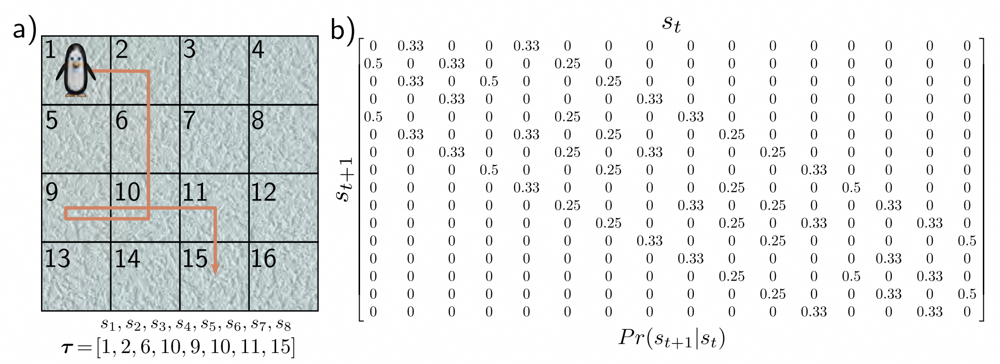
> 图19.1 马尔可夫过程。
> 马尔可夫过程由一组状态和转移概率 $ Pr(s_{t+1}|s_t) $ 定义，该概率表示在当前状态 $ s_t $ 的情况下转移到状态 $ s_{t+1} $ 的概率。
>
> * a) 这只企鹅可以在冰上访问16个不同的位置（状态）。
> * b) 冰是滑的，因此每次都有相等的概率移动到任何相邻状态。例如，在位置6，它有25%的概率移动到状态2、5、7和10。该过程的轨迹 $ τ = [s_{1}, s_{2}, s_{3}, \ldots] $ 由一系列状态组成。

### 19.1.2 马尔可夫奖励过程 - Markov reward process

*马尔可夫奖励过程* 还包括了在下一个时间步骤中，给定我们处于状态 $ s_{t} $ ，可能获得的奖励 $ r_{t+1} $ 的分布 $ Pr(r_{t+1}|s_t) $ 。这样就产生了一个状态和相应奖励的序列 $ s_{1}, r_{2}, s_{2}, r_{3}, s_{3}, r_{4} \ldots $ (图 [19.2]() )。

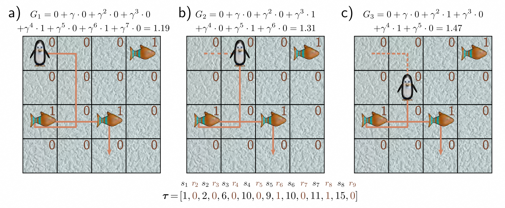
> 图 19.2 马尔可夫奖励过程。
> 这将每个状态 $ s_t $ 关联到了奖励 $ r_{t+1} $ 的分布 $ Pr(r_{t+1}|s_t) $ 。
>
> * a) 在这个例子中，奖励是确定的；如果企鹅落在鱼上，将获得 +1 的奖励，否则为 0。现在轨迹 $ τ $ 由交替的状态和奖励序列 $ s_{1}, r_{2}, s_{2}, r_{3}, s_{3}, r_{4} \ldots $ 组成，八个步骤后终止。回报 $ G_t $ 是未来奖励的折扣和，这里的折扣因子为 $ γ = 0.9 $ 。
> * b-c) 随着企鹅沿着轨迹前进并接近奖励，回报逐渐增加。

马尔可夫奖励过程还包括一个 *折扣因子* $ γ \in (0, 1] $ ，用于计算时间 $ t $ 的 *回报* $ G_{t} $ ：

$$
G_{t}=\sum_{k=0}^{\infty}\gamma^{k}r_{t+k+1}
\tag{19.1}
$$

回报是未来奖励的累积折扣和，它衡量了沿着这条轨迹的未来收益。小于一的折扣因子使得离现在更近的奖励比离现在较远的奖励更有价值。

### 19.1.3 马尔可夫决策过程 - Markov decision process

*马尔可夫决策过程* 或 *MDP* 在每个时间步骤上添加了一组可能的 *动作*。动作 $ a_{t} $ 改变了转移概率，现在写作 $ Pr(s_{t+1}|s_t, a_{t}) $ 。奖励也可以依赖于动作，现在写作 $ Pr(r_{t+1}|s_t, a_{t}) $ 。MDP 产生了一个状态、动作和奖励的序列 $ s_{1}, a_{1}, r_{2}, s_{2}, a_{2}, r_{3}, s_{3}, a_{3}, r_{4} \ldots $ (图 [19.3]() )。执行这些动作的实体被称为 *智能体（Agent）*。
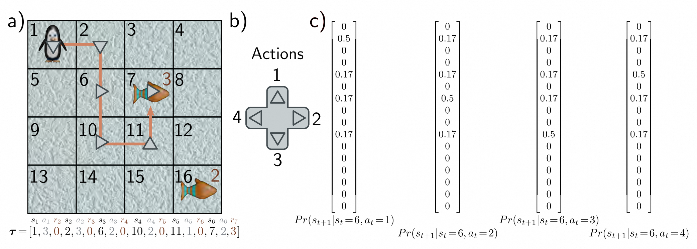
> 图 19.3 马尔可夫决策过程。
>
> * a）代理（企鹅）在每个状态下可以执行一组动作。动作既会影响移动到后继状态的概率，也会影响获得奖励的概率。
> * b）这里，四个动作分别对应向上、向右、向下和向左移动。
> * c）对于任何状态（这里是状态6），动作会改变移动到下一个状态的概率。企鹅以50%的概率沿着预期的方向移动，但冰面很滑，所以它可能以相同的概率滑向其他相邻位置。因此，在图（a）中，所采取的动作（灰色箭头）并不总是与轨迹（橙色线）一致。在这里，动作不会影响奖励，因此 $ Pr(r_{t+1}|s_t,a_t) = Pr(r_{t+1}|s_t) $ 。MDP的轨迹τ由一系列交替的状态 $ s_t $ 、动作 $ a_t $ 和奖励 $ r_{t+1} $ 组成。请注意，这里企鹅在离开有鱼的状态时才会获得奖励（即通过鱼的方格时获得奖励，无论企鹅是否有意到达那里）。

### 19.1.4 部分可观察的马尔可夫决策过程 - Partially observable Markov decision process

在*部分可观察的马尔可夫决策过程*或*POMDP*中，状态不是直接可见的（图[19.4]()）。相反，代理接收到一个从 $ Pr(o_{t}|s_{t}) $ 中抽取的观测 $o_t$。因此，一个POMDP产生了一系列的状态、观测、动作和奖励的序列 $ s_{1}, o_{1}, a_{1}, r_{2}, s_{2}, o_{2}, a_{2}, r_{3}, o_{3}, a_{3}, s_{3}, r_{4} \ldots $ 。一般来说，每个观测都更适合某些状态而不是其他状态，但不足以唯一确定状态。
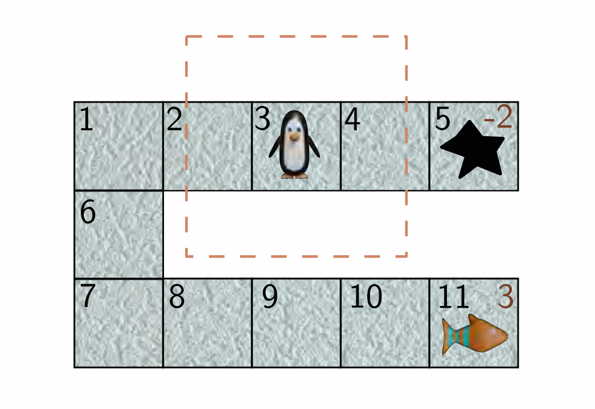
> 图 19.4 部分可观测的马尔可夫决策过程（POMDP）。
> 在POMDP中，代理无法获得完整的状态信息。在这个例子中，企鹅处于第三个状态，只能看到虚线框中的区域。这与它在第九个状态看到的是一样的。在第一种情况下，向右移动会导致掉入冰洞（-2的奖励），而在后一种情况下，会找到鱼（+3的奖励）。

### 19.1.5 策略 - Policy

决定代理在每个状态下采取的动作的规则被称为*策略（图[19.5]()）*。策略可以是随机的（策略为每个状态定义了一个动作的分布）或者确定性的（代理在给定状态下始终采取相同的动作）。一个随机策略 $ π[a|s] $ 返回每个可能动作 $ a $ 的概率分布，从中采样得到一个新的动作。一个确定性策略 $ π[a|s] $ 返回被选择为状态 $ s $ 的动作 $ a $ ，否则返回0。一个 $ s_t $ *稳态*策略只依赖于当前状态。一个*非稳态*策略还依赖于时间步。

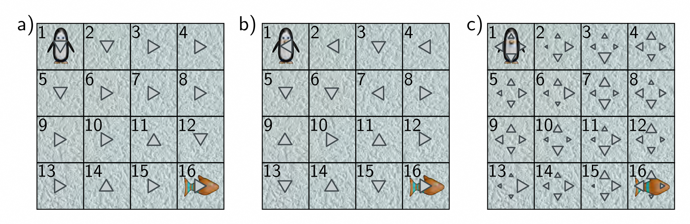
> 图 19.5 策略。
>
> * a）确定性策略在每个状态下总是选择相同的动作（由箭头表示）。有些策略比其他策略更好。这个策略不是最优的，但通常会引导企鹅从左上角到右下角，那里有奖励。
> * b）这个策略更加随机一些。
> * c）随机策略对于每个状态都有一个动作的概率分布（概率由箭头的大小表示）。这样的策略有利于代理更全面地探索状态，并且在部分可观测的马尔可夫决策过程中达到最优的性能可能是必要的。

环境和智能体（Agent）形成一个循环（图 [19.6]()）。智能体（Agent）从上一个时间步接收到状态 $ s_{t} $ 和奖励 $ r_{t} $ 。基于这些信息，如果需要的话，智能体（Agent）可以修改策略 $ π [a_{t}|s_{t}] $ 并选择下一个动作 $ a_{t} $ 。然后，根据 $ Pr (s_{t+1}|s_{t}, a_{t}) $ 分配下一个状态，并根据 $ Pr (r_{t+1}|s_{t}, a_{t}) $ 分配奖励。

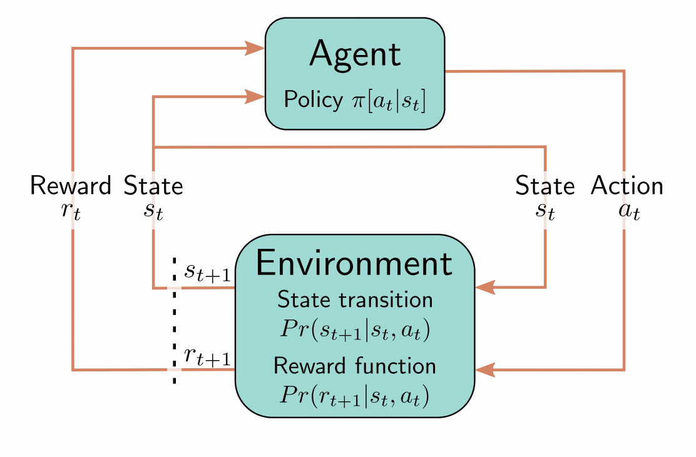
> 图 19.6 强化学习循环。
> 智能体（Agent）根据状态 $ s_t $ 和策略 $ π [a_t|s_t] $ 在时间 $ t $ 选择动作 $ a_t $ 。这会触发新状态 $ s_{t+1} $ （通过状态转移函数）和奖励 $ r_{t+1} $ （通过奖励函数）的生成。两者都传递回智能体（Agent），然后智能体（Agent）选择一个新的动作。

## 19.2 期望回报 - Expected return

前一节介绍了马尔可夫决策过程和智能体（Agent）根据策略执行动作的概念。我们希望选择一个最大化期望回报的策略。在本节中，我们将这个想法数学化。为此，我们为每个状态 $ s_{t} $ 和状态-动作对 $ \{s_{t}, a_{t}\} $ 分配一个*值*。

### 19.2.1 状态和动作值 - State and action values

回报 $ G_{t} $ 取决于状态 $ s_{t} $ 和策略 $ π [a|s] $ 。从这个状态开始，智能体（Agent）将通过一系列的状态，采取动作并接收奖励。由于策略 $ π [a_{t}|s_{t}] $ 、状态转移 $ Pr (s_{t+1}|s_t,a_{t}) $ 和奖励分配 $ Pr (r_{t+1}|s_t,a_{t}) $ 通常是随机的，所以每次智能体（Agent）在相同的位置开始时，这个序列都会有所不同。

我们可以通过考虑预期回报来评估在给定策略下一个状态的“好坏”。这个预期回报被称为状态值函数或状态值（图19.7a）：

$$
v[s_t|\pi]=\mathbb{E}\Big[G_t|s_t,\pi\Big]
\tag{19.2}
$$

简单来说，状态值告诉我们，如果我们从这个状态开始，并按照指定的策略继续，我们可以预期获得的“长期”回报。对于可能很快带来较大回报的后续转移，状态值较高（假设折扣因子 $ γ $ 小于1）。

类似地，动作值函数 $ q[s_{t},a_{t}|\pi] $ 是在状态 $ s_{t} $ 中执行动作 $ a_{t} $ 时的预期回报（图19.7b）：

$$
q[s_{t},a_{t}|\pi]=\mathbb{E}\Big[G_{t}|s_{t},a_{t},\pi\Big]
\tag{19.3}
$$

动作值告诉我们，如果我们从这个状态开始，执行这个动作，并按照指定的策略继续，我们可以预期获得的“长期”回报。通过这个概念，强化学习算法将未来的回报与当前的动作联系起来（即解决时序的信用分配问题）。

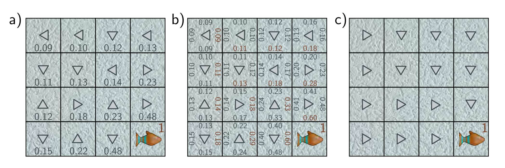
> 图19.7 状态值和动作值。
>
> * a）状态 $ s_{t} $ 的值 $ v[s_{t}|\pi] $ （每个位置的数字）是在给定策略 $ π $ 下，该状态对应的预期回报（灰色箭头）。它是从该状态开始的许多轨迹中收到的折扣回报的平均值。在这里，离鱼更近的状态更有价值。
> * b）在状态 $ s_{t} $ 中采取动作 $ a_{t} $ 的值 $ q[s_{t}, a_{t}, \pi] $ （每个位置/状态下的四个数字对应于四个动作）是在采取该特定动作时得到的预期回报。在这种情况下，随着我们离鱼越来越近，它变得越来越大，并且对于指向鱼的动作而言更大。
> * c）如果我们知道一个状态的动作值，那么可以修改策略，使其选择这些值中的最大值（面板b中的红色数字）。
>
### 19.2.2 最佳策略 - Optimal policy

我们希望找到一种能够最大化预期回报的策略。对于 MDP（但不适用于 POMDP）来说，总是存在一种确定性、稳定的策略，使得每个状态都能达到最大值。如果我们知道这个最佳策略，那么我们可以得到最佳的状态值函数 $ v^{∗}[s_{t}] $ ：

$$
v^{*}[s_{t}]=\max_{\pi}\bigg[\mathbb{E}\bigg[G_{t}|s_{t},\pi\bigg]\bigg].
\tag{19.4}
$$

同样地，最佳的状态-动作值函数也可以在最佳策略下得到：

$$
q^{*}[s_{t},a_{t}]=\max_{\pi}\Big[\mathbb{E}\Big[G_{t}|s_{t},a_{t},\pi\Big]\Big]
\tag{19.5}
$$

换句话说，如果我们知道最佳的动作值函数 $ q^{∗}[s_{t}, a_{t}] $ ，那么我们可以通过选择具有最高值的动作 $ a_{t} $ 来得到最佳策略（图 [19.7c)]() ）：^[1]^

$$
\pi[a_{t}|s_{t}]\leftarrow\mathrm{argmax}\Big[q^{*}[s_{t},a_{t}]\Big]
\tag{19.6}
$$

> ^[1]^ 方程 [19.6]，[19.12] 和 [19.13] 中的符号 $ π [a_t|s_t] ← a $ 的意思是将动作 $ a $ 的概率设为一，其它动作的概率设为零。

事实上，一些强化学习算法是基于交替估计动作值函数和策略的（参见第 [19.3](#tabular-reinforcement-learning) 节）。

### 19.2.3 Bellman 方程 - Bellman equations

我们可能不知道任何策略下的状态值 $ v [s_{t}] $ 或动作值 $ q [s_{t}, a_{t}] $ 。^[2]^ 但是，我们知道它们必须相互一致，并且很容易写出它们之间的关系。状态值 $ v [s_{t}] $ 可以通过将动作值 $ q [s_{t}, a_{t}] $ 加权求和得到，其中权重取决于策略 $ π [a_{t}|s_{t}] $ 在采取该动作的概率（图 [19.8)]() ）：

$$
v[s_{t}]=\sum_{a_{t}}\pi[a_{t}|s_{t}]q[s_{t},a_{t}].
\tag{19.7}
$$

> ^[2]^ 为了简化起见，我们从现在开始只写 $ v [s_t] $ 和 $ q [s_t,a_t] $ ，而不是 $ v [s_t|π] $ 和 $ q [s_t, a_t|π] $ 。

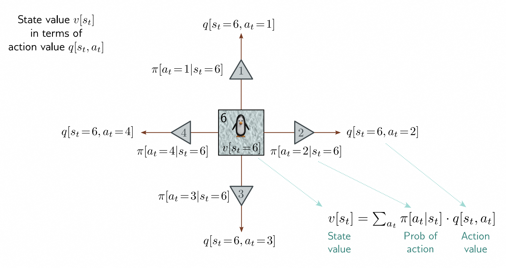
> 图 19.8 状态值和动作值之间的关系。
> 状态六 $ v [s_t = 6] $ 的值是状态六的动作值 $ q [s_t = 6,a_t] $ 的加权和，其中权重是采取该动作的策略概率 $ π [a_t|s_t = 6] $ 。

同样，动作的值是采取该动作所获得的即时奖励 $ r_{t+1} = r [s_{t}, a_{t}] $ 加上处于后续状态 $ s_{t+1} $ 的值 $ v [s_{t+1}] $ ，并进行折现 $ γ $ （图 [19.9]()） 。^[3]^ 由于 $ s_{t+1} $ 的分配不确定，我们根据转移概率 $ Pr (s_{t+1}|s_{t}, a_{t}) $ 对值 $ v [s_{t+1}] $ 进行加权求和：

$$
q[s_{t},a_{t}]=r[s_{t},a_{t}]+\gamma\cdot\sum_{s_{t+1}}Pr(s_{t+1}|s_{t},a_{t})v[s_{t+1}]
\tag{19.8}
$$

> ^[3]^ 我们还假设奖励是确定的，可以用 $ r [s_t,a_t] $ 表示。

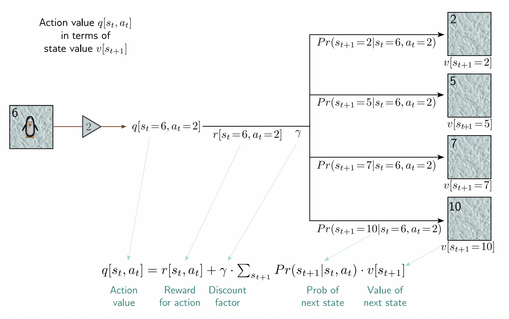
> 图 19.9 动作值和状态值之间的关系。
> 在状态六采取动作二的值 $ q [s_t = 6,a_t = 2] $ 是采取该动作所获得的奖励 $ r [s_t = 6,a_t = 2] $ 加上处于后继状态的折现值 $ v [s_{t + 1}] $ 的加权和，其中权重是转移概率 $ Pr (s_{t + 1} | s_t = 6, a_t = 2) $ 。贝尔曼方程将此关系与图 [19.8]() 的关系相链接，以连接当前和下一个（i）状态值和（ii）动作值。

将方程 [19.8]() 代入方程 [19.7]()，得到时间 $ t $ 和 $ t + 1 $ 的状态值之间的关系：

$$
v[s_{t}]=\sum_{a_{t}}\pi[a_{t}|s_{t}]\left(r[s_{t},a_{t}]+\gamma\cdot\sum_{s_{t+1}}Pr(s_{t+1}|s_{t},a_{t})v[s_{t+1}]\right)
\tag{19.9}
$$

同样，将方程 [19.7]() 代入方程 [19.8]()，得到时间 $ t $ 和 $ t + 1 $ 的动作值之间的关系：

$$
q[s_{t},a_{t}]=r[s_{t},a_{t}]+\gamma\cdot\sum_{s_{t+1}}Pr(s_{t+1}|s_{t},a_{t})\left(\sum_{a_{t+1}}\pi[a_{t+1}|s_{t+1}]q[s_{t+1},a_{t+1}]\right).
\tag{19.10}
$$

后两个关系是*贝尔曼方程*，是许多强化学习方法的基础。简单地说，它们表明状态（动作）值必须是自洽的。因此，当我们更新一个状态（动作）值的估计时，这将产生涟漪效应，影响所有其他值的修改。

## 19.3 Tabular强化学习算法 - Tabular reinforcement learning

Tabular强化学习算法（即不依赖于函数逼近的算法）分为基于模型和无模型的方法。基于模型的方法明确使用MDP结构，并根据转移矩阵 $ Pr(s_{t+1}|s_t,a_{t}) $ 和奖励结构 $ r[s, a] $ 找到最佳策略。如果这些是已知的，那么这是一个直接的优化问题，可以使用动态规划来解决。如果这些是未知的，那么必须先从观察到的MDP轨迹中估计它们。^[4]^

> ^[4]^ 在RL中，一个轨迹是一系列观察到的状态、奖励和动作。一次模拟的轨迹称为一个回合（rollout）。一个回合是从初始状态开始并在终止状态结束的轨迹（例如，从标准开局位置开始并以胜利、失败或平局结束的整个国际象棋游戏）。

相反，无模型的方法放弃了MDP模型，并分为两类：

1. 价值估计方法首先估计最优状态动作值函数，然后根据每个状态中具有最大值的动作分配策略。
2. 策略估计方法直接使用梯度下降技术估计最优策略，而不需要估计模型或值的中间步骤。

在每个类别中，蒙特卡洛方法通过对给定策略在MDP中模拟多个轨迹来收集信息，以改进该策略。有时在更新策略之前模拟多个轨迹是不可行或不实际的。时序差分（TD）方法在智能体（Agent）遍历MDP时更新策略。

现在我们简要介绍一下动态规划方法、蒙特卡洛值估计方法和TD值估计方法。第[19.4](#fitted-q-learning)节详细介绍了如何在TD值估计方法中使用深度网络。而在第[19.5](#policy-gradient-methods)节中，我们将探讨策略估计方法。

### 19.3.1 动态规划 - Dynamic programming

动态规划算法假设我们对状态转移和奖励结构有*完美*的了解。这与大多数强化学习算法不同，后者通过观察智能体（Agent）与环境的交互来间接地收集有关这些量的信息。

我们将状态值 $ v[s] $ 任意初始化（通常为零）。确定性策略 $ π[a|s] $ 也会被初始化（例如，为每个状态选择一个随机动作）。然后算法会交替进行策略评估和策略改进，以便计算当前策略的状态值。

**策略评估：** 我们遍历状态 $ s_{t} $ 并更新其值：

$$
v[s_{t}]\leftarrow\sum_{a_{t}}\pi[a_{t}|s_{t}]\left(r[s_{t},a_{t}]+\gamma\cdot\sum_{s_{t+1}}Pr(s_{t+1}|s_{t},a_{t})v[s_{t+1}]\right)
\tag{19.11}
$$

其中 $ s_{t+1} $ 是后继状态， $ Pr (s_{t+ 1}|s_t,a_{t}) $ 是状态转移概率。每次更新都使用状态值的贝尔曼方程（方程[19.9]()）将 $ v [s_{t}] $ 与后继状态 $ s_{t+1} $ 的值保持一致。这个过程称为*自举*。

**策略改进：** 为了更新策略，我们会贪心地选择在每个状态下能最大化值的动作：

$$
\pi[a_{t}|s_{t}]\leftarrow\underset{a_{t}}{\mathrm{argmax}}\bigg[r[s_{t},a_{t}]+\gamma\cdot\sum_{s_{t+1}}Pr(s_{t+1}|s_{t},a_{t})v[s_{t+1}]\bigg].
\tag{19.12}
$$

根据*策略改进定理*，这样做可以保证改进策略。

这两个步骤会反复进行，直到策略收敛（图[19.10]()）。

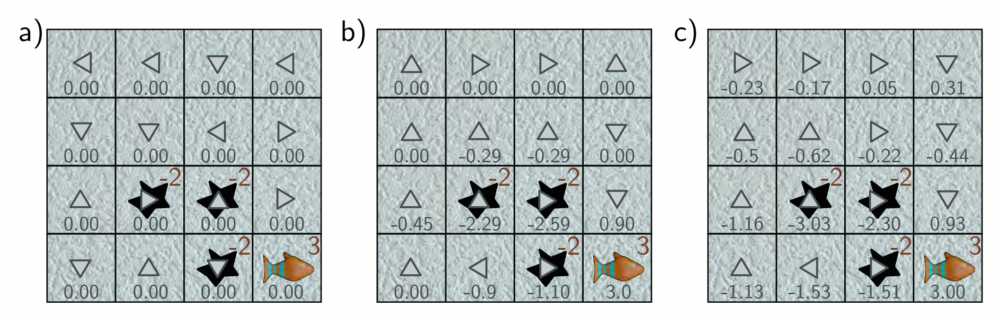
> 图 19.10 动态规划。
>
> * a）状态值被初始化为零，并且策略（箭头）是随机选择的。
> * b）状态值被更新，以与周围状态保持一致（方程[19.11]()，经过两次迭代后显示）。策略被更新，以将代理移动到具有最高值的状态（方程[19.12]()）。
> * c）经过多次迭代，该算法收敛到最优策略，也就是企鹅会尽量避免掉进洞里，并尽量到达鱼的位置。

这种方法有很多变种。在*策略迭代*中，在策略改进之前，会先进行策略评估步骤，直到收敛。值可以在原地更新，也可以在每次遍历中同步更新。在*值迭代*中，在策略改进之前，策略评估过程只进行一次。*异步*动态规划算法不需要按照系统性的顺序遍历所有的值，而是可以按任意顺序原地更新一部分状态的值。

### 19.3.2 蒙特卡洛方法 - Monte Carlo methods

与动态规划算法不同，蒙特卡洛方法不需要知道MDP的转移概率和奖励结构。相反，它通过重复从MDP中采样轨迹并观察奖励来积累经验。它们的工作方式是先计算动作值（基于经验），然后根据动作值更新策略。

为了估计动作值 $ q[s, a] $ ，需要运行一系列*回合*。每个回合从给定的状态和动作开始，然后按照当前策略进行，产生一系列的动作、状态和回报（图[19.11a]()）。在当前策略下，给定状态-动作对的动作值估计为每次观察到该对后随之产生的经验回报的平均值（图[19.11b]()）。然后，通过在每个状态选择具有最大值的动作来更新策略（图[19.11c]()）：

$$
\pi[a|s]\leftarrow\underset{a}{\mathrm{angmax}}\Big[q[s,a]\Big].
\tag{19.13}
$$

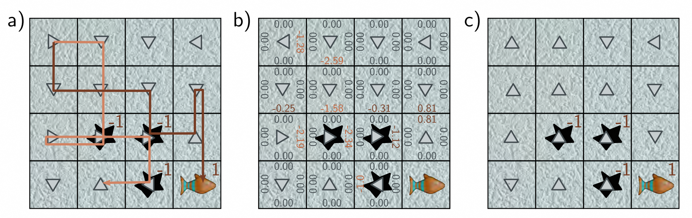
> 图 19.11 蒙特卡洛方法。
>
> * a）策略（箭头）随机初始化。MDP被重复模拟，这些回合的轨迹被存储（橙色和棕色路径代表两个轨迹）。
> * b）基于观察到的回报的经验估计的动作值，通过对这些轨迹进行平均计算得到。在本例中，动作值最初都为零，并在观察到动作后进行了更新。
> * c）然后，根据获得最佳（或最少坏）回报的动作来更新策略。

这是一种*按政策进行*的方法；通过当前最佳策略指导智能体（Agent）在环境中进行操作。该策略基于每个状态中观察到的行动值，但是当然，无法估计未使用过的行动的价值，并且没有任何东西鼓励算法去探索这些行动。一种解决方案是使用*探索初始值*。在这种情况下，将启动具有所有可能的状态-动作对的情节，以便每个组合至少观察一次。然而，如果状态数目很大或起始点无法控制，这种方法就不实际。另一种方法是使用*ε-贪婪策略*，在该策略中，以概率 $ ϵ $ 选择随机行动，并将剩余的概率分配给最优行动。选择 $ ϵ $ 的值平衡了利用和探索。在这里，按政策进行的方法将从这个ε-贪婪策略家族中寻求最佳策略，而这通常不会是最佳的整体策略。

相反，在*离策略*方法中，根据由不同的*行为策略* $ π^′ $ 生成的情节来学习最优策略 $ π $ （*目标策略*）。通常，目标策略是确定性的，而行为策略是随机的（例如，ε-贪婪策略）。因此，行为策略可以对环境进行探索，但学习到的目标策略保持高效。一些离策略方法明确使用重要性采样（第[17.8.1节]()）来估计在策略 $ π $ 下的行动值，使用来自 $ π^′ $ 的样本。其他方法，如Q学习（下一节中描述），基于贪婪行动估计值，尽管这不一定是实际选择的行动。

### 19.3.3 时间差异方法 - Temporal difference methods

动态规划方法使用自我引导的过程来更新值，以使其符合当前策略下的一致性。蒙特卡洛方法通过采样MDP来获取信息。时间差异（TD）方法结合了自我引导和采样。然而，与蒙特卡洛方法不同的是，它们在代理人遍历MDP的状态时而不是之后更新值和策略。

*SARSA*（状态-动作-奖励-状态-动作）是一种以策略为基础的算法，其更新公式为：

$$
q[s_{t},a_{t}]\leftarrow q[s_{t},a_{t}]+\alpha\Big(r[s_{t},a_{t}]+\gamma\cdot q[s_{t+1},a_{t+1}]-q[s_{t},a_{t}]\Big)
\tag{19.14}
$$

其中 $ α ∈ \mathbb R^{ + } $ 是学习率。方括号中的项被称为时间差异误差，用于衡量估计的动作值 $ q [s_{t}, a_{t}] $ 和在经过单步后的估计 $ r [s_{t}, a_{t}] + γ·q [s_{t+ 1}, a_{t+1}] $ 之间的一致性。

相比之下，*Q学习*是一种离策略算法，其更新公式为（图 [19.12)]()）：

$$
q[s_{t},a_{t}]\leftarrow q[s_{t},a_{t}]+\alpha\Big(r[s_{t},a_{t}]+\gamma\cdot\max_{a}\big[q[s_{t+1},a]\big]-q[s_{t},a_{t}]\Big)
\tag{19.15}
$$

其中，每一步的行动选择是根据不同的行为策略 $ π^′ $ 得到的。

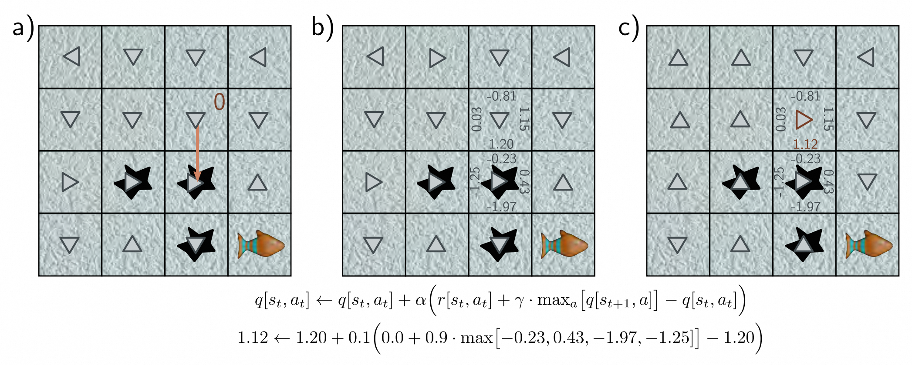
> 图 19.12 Q学习。
>
> * a）代理人从状态 $ s_t $ 开始，并根据策略采取动作 $ a_t = 2 $ 。它不会在冰上滑倒，向下移动，离开原始状态获得奖励 $ r [s_t,a_t] = 0 $ 。
> * b）找到新状态下的最大动作值（这里是0.43）。
> * c）基于当前对后续状态最大动作值的估计、奖励、折扣因子 $ γ = 0.9 $ 和学习率 $ α = 0.1 $ ，将原始状态中动作2的动作值更新为1.12。这改变了原始状态的最高动作值，因此策略发生了变化。

在这两种情况下，策略的更新是通过在每个状态上选择动作值的最大值来进行的（方程[19.13]()）。可以证明这些更新是收缩映射（参见方程[16.20]()）；假设每个状态-动作对都被无限次访问，动作值最终会收敛。

## 19.4 拟合Q学习 - Fitted Q-learning

上述的表格蒙特卡洛和TD算法重复遍历整个MDP并更新动作值。然而，如果状态-动作空间很大，这种方法是不切实际的。不幸的是，这种情况很少出现；即使是对于象棋棋盘这样受限制的环境，可能的合法状态超过 $ 10^{40} $ 。

在*拟合Q学习*中，动作值的离散表示 $ q [s_{t}, a_{t}] $ 被机器学习模型 $ q [s_{t}, a_{t}, ϕ] $ 所取代，其中状态现在用向量 $ s_{t} $ 表示，而不仅仅是一个索引。然后，我们定义了一个基于相邻动作值一致性的最小二乘损失（类似于Q学习中的方法，参见方程[19.15]()）：

$$
L[\phi]=\left(r[\mathbf{s}_{t},a_{t}]+\gamma\cdot\max_{a}\Big[q[\mathbf{s}_{t+1},a,\phi]\Big]-q[\mathbf{s}_{t},a_{t},\phi]\right)^{2}
\tag{19.16}
$$

这导致了以下更新：

$$
\phi\leftarrow\phi+\alpha\bigg(r[\mathbf{s}_{t},a_{t}]+\gamma\cdot\max_{a}\bigg[q[\mathbf{s}_{t+1},a,\phi]\bigg]-q[\mathbf{s}_{t},a_{t},\phi]\bigg)\frac{\partial q[\mathbf{s}_{t},a_{t},\boldsymbol{\phi}]}{\partial\boldsymbol{\phi}}.
\tag{19.17}
$$

拟合Q学习与Q学习的不同之处在于不再保证收敛。参数的改变可能同时修改目标 $ r[s_{t}, a_{t}] + γ·\operatorname{max}_{a_{t+1}}[q[s_{t+1}, a_{t+1}, ϕ]] $ （最大值可能会改变）和预测 $ q[s_{t}, a_{t}, ϕ] $ 。

这可以从理论上和实践上都证明会对收敛性产生不利影响。

### 19.4.1 用于玩 ATARI 游戏的深度 Q 网络 - Deep Q-networks for playing ATARI games

深度神经网络非常适合从高维状态空间中进行预测，因此在拟合 Q 学习模型中，它们是一个天然的选择。原则上，它们可以同时接收状态和动作作为输入，并预测相应的值，但在实际应用中，网络只接收状态，并同时预测每个动作的值。

*深度 Q 网络* 是一种突破性的强化学习架构，利用深度网络来学习玩 ATARI 2600 游戏。观察到的数据包括 $ 220×160 $ 的图像，每个像素有 $ 128 $ 种可能的颜色（图 [19.13]() ）。这些图像被重新调整为 $ 84×84 $ 的大小，并且只保留了亮度值。不幸的是，从单个帧无法完全观察到完整的状态。例如，游戏对象的速度是未知的。为了解决这个问题，网络在每个时间步骤中使用最近的四个帧来形成状态 $ s_{t} $ 。它将这些帧通过三个卷积层和一个全连接层映射，以预测每个动作的值（图 [19.14]() ）。

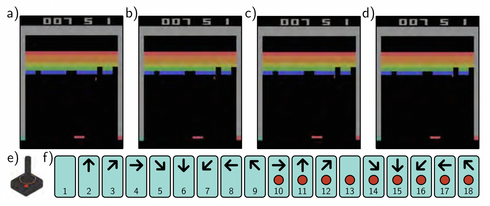
> 图 19.13 Atari 基准。
> Atari 基准包含了49个 Atari 2600 游戏，包括打砖块（如图所示）、乒乓球和各种射击、平台等类型的游戏。
>
> * a-d) 即使对于单屏游戏，从单个帧无法完全观察到完整的状态，因为对象的速度是未知的。因此，通常使用几个相邻帧（这里是四个）来表示状态。
> * e) 通过摇杆来模拟用户输入的动作。
> * f) 一共有18种动作，分别对应八个移动方向或不移动，对于每种情况，还有一个按钮是否被按下。

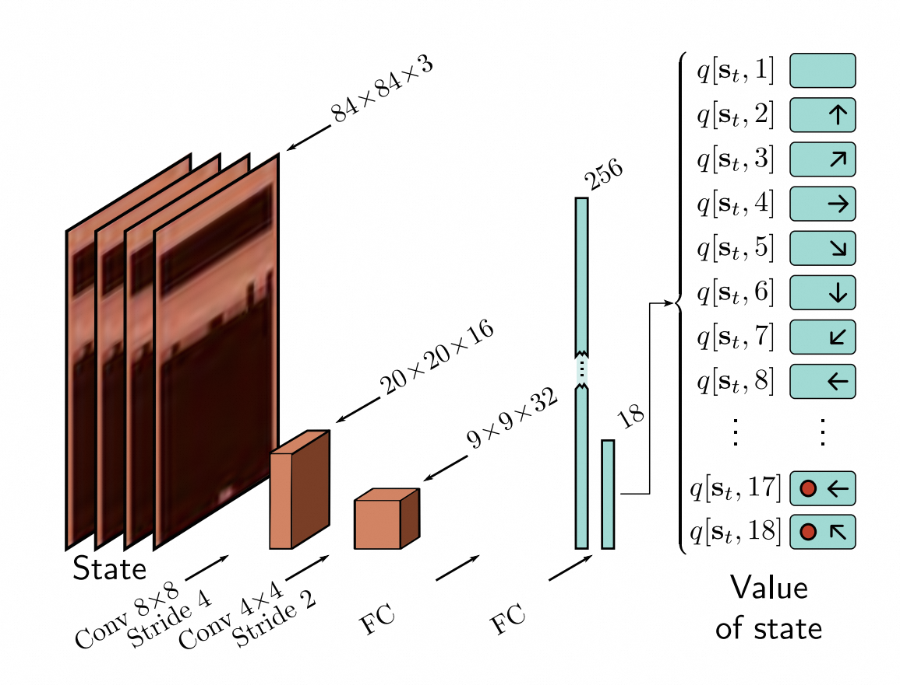
> 图 19.14 Deep Q-network 架构。
> 输入 $ s_t $ 是 ATARI 游戏的四个相邻帧。每个帧都被调整为 $ 84×84 $ 的大小，并将其转换为灰度图像。这些帧通过 $ 8×8 $ 的步长为四的卷积层进行处理，然后是步长为2的 $ 4×4 $ 的卷积层，最后是两个全连接层。最终的输出预测了该状态下每个动作的动作价值 $ q [s_t,a_t] $ ，共有18个动作。

对标准训练程序进行了几个修改。首先，奖励（由游戏中的分数驱动）被剪裁为负值变化时为1，正值变化时为+1。这样做是为了弥补不同游戏之间分数差异很大的问题，并且可以使用相同的学习率。其次，该系统利用了*经验回放*。而不是基于当前步骤或最后 $ I $ 个元组的批处理更新网络，而是将所有最近的元组存储在缓冲区中。然后，在每个步骤中从该缓冲区随机采样生成一个批次。这种方法多次重复使用数据样本，并减少了由于相邻帧相似性导致的批次中样本之间的相关性。

最后，通过将目标参数固定为值 $ ϕ^{-} $ 并定期更新它们，解决了拟合 Q 网络中的收敛问题。这给出了以下更新公式：

$$
\phi\leftarrow\phi+\alpha\bigg(r[\mathbf{s}_{t},a_{t}]+\gamma\cdot\max_{a}\bigg[q[\mathbf{s}_{t+1},a,\phi^{-}]\bigg]-q[\mathbf{s}_{t},a_{t},\phi]\bigg)\frac{\partial q[\mathbf{s}_{t},a_{t},\phi]}{\partial\phi}.
\tag{19.18}
$$

现在，网络不再追逐移动的目标，而且不容易出现振荡现象。

使用这些和其他的启发式方法以及*ϵ-贪婪策略*，在相同的网络上（针对每个游戏单独训练）的49个游戏中，Deep Q-Networks的表现相当于一名专业游戏测试员。需要注意的是，训练过程需要大量数据。每个游戏学习所需的经验时间约为38天。在某些游戏中，该算法超过了人类的表现。但在其他游戏中，如《蒙特祖玛的复仇》（Montezuma's Revenge），几乎没有取得任何进展。这款游戏的特点是奖励很稀疏，多个屏幕外观差异很大。

### 19.4.2 双 Q 学习和双深度 Q 网络 - Double Q-learning and double deep Q-networks

Q 学习的一个潜在缺陷是在更新中对动作进行最大化操作时会引入对估计状态值 $ q [s_{t}, a_{t}] $ 的系统性偏差：

$$
q[s_{t},a_{t}]\leftarrow q[s_{t},a_{t}]+\alpha\Big(r[s_{t},a_{t}]+\gamma\cdot\max_{a}\big[q[s_{t+1},a]\big]-q[s_{t},a_{t}]\Big)
\tag{19.19}
$$

考虑两个提供相同平均奖励的动作，但一个是随机的，另一个是确定的。随机奖励大约一半的时间会超过平均奖励，并通过最大化操作被选择，导致相应的动作值 $ q [s_{t}, a_{t}] $ 被高估。对网络输出 $ q [s_{t}, a_{t}, ϕ] $ 的随机不准确性或 q 函数的随机初始化也存在类似的问题。

这个问题的根源在于同一个网络既选择目标（通过最大化操作），又更新值。双 Q 学习通过同时训练两个模型 $ q_1[s_{t}, a_{t}, π_{1}] $ 和 $ q_2{ [s_{t}, a_{t}, π_{2}]} $ 来解决这个问题：
$$
\begin{array}{rcl}q_1[s_t,a_t]&\leftarrow&q_1[s_t,a_t]+\alpha\Big(r[s_t,a_t]+\gamma\cdot q_2\Big[s_{t+1},\mathop{\mathrm{argmax}}\Big[q_1[s_{t+1},a]\Big]\Big]-q_1[s_t,a_t]\Big)\\\\
q_2[s_t,a_t]&\leftarrow&q_2[s_t,a_t]+\alpha\Big(r[s_t,a_t]+\gamma\cdot q_1\Big[s_{t+1},\mathop{\mathrm{argmax}}\Big[q_2[s_{t+1},a]\Big]\Big]-q_2[s_t,a_t]\Big).\end{array}
\tag{19.20}
$$

现在目标的选择和目标本身是分离的，这有助于防止这些偏差。在实践中，新的元组 $ < s, a, r, s^′> $ 被随机分配给其中一个模型进行更新。这被称为*双 Q 学习*。*双深度 Q 网络*（double DQNs）使用深度网络 $ q [s_{t}, a_{t}, ϕ_{1}] $ 和 $ q [s_{t}, a_{t}, ϕ_{2}] $ 来估计动作值，并且更新变为：
$$
\begin{gathered}
\phi_{1}\leftarrow\phi_{1}+\alpha\left(r[\mathbf{s}_{t},a_{t}]+\gamma\cdot q\left[\mathbf{s}_{t+1},\operatorname{argmax}\Big[q[\mathbf{s}_{t+1},a,\phi_{1}]\Big],\phi_{2}\right]-q[\mathbf{s}_{t},a_{t},\phi_{1}]\right)\frac{\partial q[\mathbf{s}_{t},a_{t},\phi_{1}]}{\partial\phi_{1}} \\\\
\phi_{2}\leftarrow\phi_{2}+\alpha\left(r[\mathbf{s}_{t},a_{t}]+\gamma\cdot q\left[\mathbf{s}_{t+1},\operatorname{argmax}\Big[q[\mathbf{s}_{t+1},a,\phi_{2}]\Big],\phi_{1}\right]-q[\mathbf{s}_{t},a_{t},\phi_{2}]\right){\frac{\partial q[\mathbf{s}_{t},a_{t},\boldsymbol{\phi}_{2}]}{\partial\phi_{2}}}
\end{gathered}
\tag{19.21}
$$

### 19.5 策略梯度方法 - Policy gradient methods

Q 学习首先估计动作值，然后使用这些值来更新策略。相反，*基于策略的方法*直接学习了一个随机策略 $ π [a_{t}|s_{t}, θ] $ 。这是一个具有可训练参数 $ θ $ 的函数，将状态 $ s_{t} $ 映射到动作 $ a_{t} $ 的分布 $ Pr (a_{t} | s_{t}) $ ，我们可以从中进行采样。在 MDP 中，总是存在一个最优确定性策略。然而，使用随机策略有三个原因：

1. 随机策略自然有助于对空间进行探索；我们不必在每个时间步骤上选择最佳动作。
2. 当我们修改随机策略时，损失函数会平滑变化。这意味着即使奖励是离散的，我们也可以使用梯度下降方法。这类似于在（离散）分类问题中使用最大似然估计。随着模型参数的变化，使得真实类别的概率更大，损失函数会平滑变化。
3. MDP 假设通常是不正确的；我们通常没有完全了解状态。例如，考虑一个在只能观察附近位置的环境中导航的智能体（Agent）（例如，图 [19.4]() ）。如果两个位置看起来相同，但附近的奖励结构是不同的，随机策略允许在消除这种模糊性之前采取不同的行动。

### 19.5.1 梯度更新的推导 - Derivation of gradient update

考虑一个在MDP中的轨迹 $ τ = [s_{1}, a_{1}, s_{2}, a_{2}, \ldots, s_{T}, a_{T}] $ 。这个轨迹 $ Pr (τ|θ) $ 的概率取决于状态演化函数 $ Pr (s_{t + 1}|s_{t}, a_{t}) $ 和当前的随机策略 $ π [a_{t}|s_{t}, θ] $ ：

$$
Pr(\tau|\boldsymbol{\theta})\quad=\quad Pr(\mathbf{s}_{1})\prod_{t=1}^{T}\pi[a_{t}|\mathbf{s}_{t},\boldsymbol{\theta}]Pr(\mathbf{s}_{t+1}|\mathbf{s}_{t},a_{t}).
\tag{19.22}
$$

策略梯度算法的目标是最大化许多这样轨迹的期望回报 $ r [τ] $ ：

$$
\theta=\underset{\theta}{\operatorname*{argmax}}\bigg[\mathbb{E}_{\tau}\bigg[r[\tau]\bigg]\bigg]=\underset{\theta}{\operatorname*{argmax}}\bigg[\int Pr(\tau|\theta)r[\tau]d\tau\bigg]
\tag{19.23}
$$

其中回报是沿轨迹收到的所有奖励的总和。

为了最大化这个量，我们使用梯度上升更新：

$$
\begin{array}{rcl}\theta&\leftarrow&\theta+\alpha\cdot\frac{\partial}{\partial\theta}\int Pr(\tau|\theta)r[\tau]d\tau\\\\
&=&\theta+\alpha\cdot\int\frac{\partial Pr(\tau|\theta)}{\partial\theta}r[\tau]d\tau\end{array}
\tag{19.24}
$$

其中 $ α $ 是学习率。

我们希望用经验观测到的轨迹总和来近似这个积分。这些轨迹是从分布 $ Pr (τ|θ) $ 中抽取的，所以为了取得进展，我们将被积函数乘以这个分布并除以它：

$$
\begin{aligned}
\boldsymbol{\theta}& \leftarrow\quad\theta+\alpha\cdot\int\frac{\partial Pr(\boldsymbol{\tau}|\boldsymbol{\theta})}{\partial\boldsymbol{\theta}}r[\boldsymbol{\tau}]d\boldsymbol{\tau} \\
&=\quad\theta+\alpha\cdot\int Pr(\tau|\theta)\frac{1}{Pr(\tau|\theta)}\frac{\partial Pr(\tau|\boldsymbol{\theta})}{\partial\theta}r[\tau]d\tau \\
&\approx\quad\theta+\alpha\cdot\frac{1}{I}\sum_{i=1}^{I}\frac{1}{Pr(\tau_{i}|\theta)}\frac{\partial Pr(\tau_{i}|\boldsymbol{\theta})}{\partial\theta}r[\tau_{i}].
\end{aligned}
\tag{19.25}
$$

这个公式有一个简单的解释（图[19.15)]()）；更新将参数 $ θ $ 改变为与来自该轨迹的奖励 $ r [τ_{i}] $ 成比例地增加观测到的轨迹 $ τ_{i} $ 的概率 $ Pr (τ_{i}|θ) $ 。然而，它还通过观察到该轨迹的概率进行归一化，以补偿一些轨迹被观察到的频率比其他轨迹更高的事实。如果一条轨迹已经很常见并且产生高回报，那么我们就不需要做太多改变。最大的更新将来自于不常见但产生较大回报的轨迹。
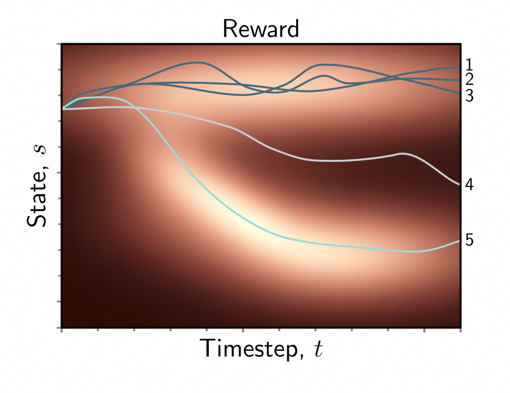
> 图 19.15 策略梯度。同一策略的五个轨迹（亮度表示奖励较高）。轨迹 1、2 和 3 产生了一致较高的奖励，但是在该策略下，类似的轨迹已经经常出现，因此无需改变。相反，轨迹 4 的奖励较低，所以应该修改策略以避免产生类似的轨迹。轨迹 5 的奖励较高且不寻常。这将在方程 [19.25]() 下对策略产生最大的改变。

我们可以使用 *似然比恒等式* 简化这个表达式:

$$
\frac{\partial\log[\mathrm{f}[z]]}{\partial z}=\frac{1}{f[z]}\frac{\partial\mathrm{f}[z]}{\partial z},
\tag{19.26}
$$

从而得到更新公式:

$$
\theta\leftarrow\theta+\alpha\cdot\frac{1}{I}\sum_{i=1}^{I}\frac{\partial\log\bigl[Pr(\tau_{i}|\theta)\bigr]}{\partial\theta}r[\tau_{i}].
\tag{19.27}
$$

轨迹的对数概率 $ \operatorname{log}[Pr (τ|θ) ] $ 如下所示:

$$
\begin{array}{rcl}\log[Pr(\tau|\boldsymbol{\theta})]&=&\log\Bigl[Pr(\mathbf{s}_1)\prod\limits_{t=1}^T\pi[a_t|\mathbf{s}_t,\boldsymbol{\theta}]2r(\mathbf{s}_{t+1}|\mathbf{s}_t,a_t)\Bigr]\\\\
[1ex]&=&\log\Bigl[Pr(\mathbf{s}_1)\Bigr]+\sum\limits_{t=1}^T\log\bigl[\pi[a_t|\mathbf{s}_t,\boldsymbol{\theta}]\bigr]+\sum\limits_{t=1}^T\log\bigl[Pr(\mathbf{s}_{t+1}|\mathbf{s}_t,a_t)\bigr],\end{array}
\tag{19.28}
$$

注意只有中间项依赖于 $ θ $ ，我们可以把方程 [19.27]() 的更新改写为:

$$
\theta\leftarrow\theta+\alpha\cdot\frac{1}{I}\sum_{i=1}^{I}\sum_{t=1}^{T}\frac{\partial\log\bigl[\pi[a_{it}|\mathbf{s}_{it},\mathbf{\theta}]\bigr]}{\partial\theta}r[\tau_{i}]
\tag{19.29}
$$

其中 $ s_{it} $ 是第 $ i $ 次轨迹中时间 $ t $ 的状态， $ a_{it} $ 是第 $ i $ 次轨迹中时间 $ t $ 的动作。请注意，由于涉及到状态演化 $ Pr (s_{t + 1}|s_t, a_{t}) $ 的项消失了，这个参数更新不假设马尔可夫时间演化过程。
我们可以进一步简化这个过程，注意到：

$$
r[\tau_{i}]=\sum_{t=1}^{T}r_{it}=\sum_{k=1}^{t-1}r_{ik}+\sum_{k=t}^{T}r_{ik}
\tag{19.30}
$$

其中 $ r_{it} $ 表示第 $ i $ 个回合的第 $ t $ 时刻的奖励。第一项（时刻 $ t $ 之前的奖励）不会影响从时刻 $ t $ 开始的更新，因此我们可以写成：

$$
\theta\leftarrow\theta+\alpha\cdot\frac{1}{I}\sum_{i=1}^{I}\sum_{t=1}^{T}\frac{\partial\log\bigl[\pi[a_{it}|\mathbf{s}_{it},\mathbf{\theta}]\bigr]}{\partial\theta}\sum_{k=t}^{T}r_{ik}.
\tag{19.31}
$$

### 19.5.2 REINFORCE 算法 - REINFORCE algorithm

*REINFORCE* 是一种早期的策略梯度算法，利用了这个结果并引入了折扣。它是一种蒙特卡洛方法，根据当前策略 $ π [a|s, θ] $ 生成轨迹 $ τ_{i} = [s_{i1}, a_{i1}, r_{i2}, s_{i2}, a_{i2}, r_{i3}, \ldots, r_{iT}] $ 。对于离散动作，这个策略可以由一个神经网络 $ π [s|θ] $ 决定，该网络接受当前状态 $ s $ 并为每个可能的动作输出一个结果。这些结果通过 softmax 函数生成一个动作分布，在每个时间步骤上进行采样。

对于每个轨迹 $ i $ ，我们循环遍历每个步骤 $ t $ 并计算从时刻 $ t $ 开始的部分轨迹 $ τ_{it} $ 的经验折扣回报：

$$
r[\tau_{it}]=\sum_{k=t+1}^{T}\gamma^{k-t-1}r_{ik}
\tag{19.32}
$$

然后我们更新每个轨迹中每个时间步骤 $ t $ 的参数：

$$
\theta\leftarrow\theta+\alpha\cdot\gamma^t\frac{\partial\log\left[\pi_{a_{it}}[\mathbf{s}_{it},\theta]\right]}{\partial\theta}r[\tau_{it}]\quad\forall i,t
\tag{19.33}
$$

这里， $ π_{a_t}[s_{t}, θ] $ 是神经网络在给定当前状态 $ s_{t} $ 和参数 $ θ $ 的情况下生成动作 $ a_{t} $ 的概率， $ α $ 是学习率。额外的项 $ γ_{t} $ 确保奖励相对于序列起始点进行折扣，因为我们最大化整个序列的对数概率（方程 [19.23]() ）。

### 19.5.3 基准值 - Baselines

策略梯度方法存在一个缺点，即方差较高；可能需要许多回合才能获得稳定的导数更新。降低方差的一种方法是从基准值 $ b $ 中减去轨迹回报 $ r [\tau] $ ：

$$
\theta \leftarrow \theta + \alpha \cdot \frac{1}{I} \sum_{i=1}^{l}\sum_{t=1}^{T} \frac{\partial \log \left[\pi_{a_{it}} [\mathbf{s}_{it}, \boldsymbol{\theta}] \right]}{\partial \boldsymbol{\theta}} \left(r[\boldsymbol{\tau}_{it}] - b \right)
\tag{19.34}
$$

只要基准值 $ b $ 不依赖于动作：

$$
\mathbb{E}_{\tau} \left[ \sum_{t=1}^{T} \frac{\partial \log \left[\pi_{a_{it}} [\mathbf{s}_{it}, \boldsymbol{\theta}] \right]}{\partial \boldsymbol{\theta}} \cdot b \right] = 0
\tag{19.35}
$$

期望值不会改变。然而，如果基准值与增加不确定性的无关因素共变，则减去它会减小方差（图 [19.16]() ）。这是*控制变量*方法的一个特例（参见问题 [19.7]() ）。

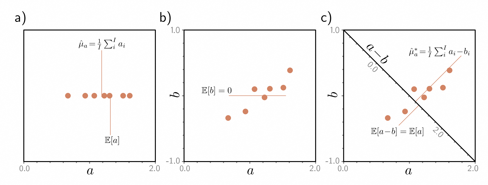
> 图 19.16 使用控制变量减小估计方差。
>
> * a）考虑尝试从少量样本中估计 $ \mathbb E [a] $ 。估计值（样本的平均值）将根据样本数量和样本的方差而变化。
> * b）现在考虑观察另一个与 $ a $ 共变且具有 $ \mathbb E [b] = 0 $ 和与 $ a $ 相同方差的变量 $ b $ 。
> * c） $ a-b $ 的样本方差远小于 $ a $ 的样本方差，但期望值 $ \mathbb E [a-b] = \mathbb E [a] $ ，因此我们得到一个具有较低方差的估计器。

这引出了一个问题，我们应该如何选择 $ b $ 。我们可以通过写出方差的表达式，对 $ b $ 求导，将结果设为零，并解出 $ b $ 的值来找到使方差最小化的 $ b $ 的值：

$$
b=\sum_{i}\frac{\sum_{t=1}^{T}\left(\partial\log\bigl[\pi_{a_{it}}[\mathbf{s}_{it},\mathbf{\theta}]\bigr]/\partial\mathbf{\theta}\right)^{2}r[\tau_{it}]}{\sum_{t=1}^{T}\left(\partial\log\bigl[\pi_{a_{it}}[\mathbf{s}_{it},\mathbf{\theta}]\bigr]/\partial\mathbf{\theta}\bigr)^{2}\right.}
\tag{19.36}
$$

在实践中，通常近似为：

$$
b=\frac{1}{I}\sum_{i}r[\tau_{i}].
\tag{19.37}
$$

减去这个基准可以消除方差，这种方差可能发生在所有轨迹的回报 $ r [τ_{i}] $ 大于典型情况，但只是因为它们刚好经过具有高于平均回报的状态，无论采取什么行动。

### 19.5.4 基于状态的基准 - State-dependent baselines

更好的选择是使用依赖于当前状态 $ s_{it} $ 的基准 $ b [s_{it}] $ 。

$$
\theta\leftarrow\theta+\alpha\cdot\frac{1}{I}\sum_{i=1}^{l}\sum_{t=1}^{T}\frac{\partial\log\bigl[\pi[a_{it}|\mathbf{s}_{it},\mathbf{\theta}]\bigr]}{\partial\theta}\left(r[\tau_{it}]-b[\mathbf{s}_{it}]\bigr).\right.
\tag{19.38}
$$

在这里，我们通过某些状态的整体回报比其他状态更大来补偿引入的方差，无论我们采取什么行动。

一个明智的选择是基于当前状态的预期未来回报，即状态值 $ v [s] $ 。在这种情况下，实证观察到的回报与基准之间的差异被称为*优势估计*。由于我们处于 Monte Carlo 上下文中，这可以由一个带参数 $ ϕ $ 的神经网络 $ b [s] = v [s, ϕ] $ 参数化，我们可以使用最小二乘损失来拟合观察到的回报：

$$
L[\phi]=\sum_{i=1}^{I}\sum_{t=1}^{T}\left(v[s_{it},\phi]-\sum_{j=y}^{T}r_{ij}\right)^{2}.
\tag{19.39}
$$

## 19.6 行动者-评论家方法 - Actor-critic methods

行动者-评论家算法是时差（TD）策略梯度算法。它们可以在每一步更新策略网络的参数。这与 Monte Carlo REINFORCE 算法形成对比，后者在更新参数之前*必须*等待一个或多个回合的完成。

在 TD 方法中，我们无法准确获取轨迹上的未来奖励 $ r [τ_{t}] = Σ^{T}_{k=t} r_{k} $ 。Actor-critic 算法通过使用当前观察到的奖励以及下一个状态的折现值来近似未来奖励的总和：

$$
\sum_{k=1}^{T}r[\tau_{ik}]\approx r_{it}+\gamma\cdot v[\mathbf{s}_{i,t+1},\phi].
\tag{19.40}
$$

 这里的值 $ v [s_{i, t + 1}, ϕ] $ 是由第二个神经网络（参数为 $ ϕ $ ）估计的。

 将这个结果代入方程式 [19.38]() 中，我们得到了更新公式：

$$
\theta\leftarrow\theta+\alpha\cdot\frac{1}{I}\sum_{i=1}^{I}\sum_{t=1}^{T}\frac{\partial\log[Pr(a_{it}|\mathbf{s}_{it},\theta)]]}{\partial\theta}\Big(r_{it}+\gamma\cdot v[\mathbf{s}_{i,t+1},\phi]-v[\mathbf{s}_{i,t},\phi]\Big).
\tag{19.41}
$$

 同时，我们通过使用以下损失函数对参数 $ ϕ $ 进行引导更新：

$$
L[\phi]=\sum_{i=1}^{I}\sum_{t=1}^{T}\left(r_{it}+\gamma\cdot v[\mathbf{s}_{i,t+1},\phi]-v[\mathbf{s}_{i,t},\phi]\right)^{2}
\tag{19.42}
$$

 预测策略 $ π [s_{t}, θ] $ 的策略网络被称为“actor”。估计值 $ v [s_{t}, ϕ] $ 的值网络被称为“critic”。通常情况下，同一个网络既代表 actor，又代表 critic，它有两组输出，分别用于预测策略和值。需要注意的是，虽然 actor-critic 方法可以在每个步骤更新策略参数，但在实践中很少这样做。代理通常会在多个时间步骤上收集一批经验，然后再更新策略。

## 19.7 离线强化学习 - Offline reinforcement learning

强化学习的核心在于与环境的互动。然而，在某些场景下，直接将一个天真的智能体（Agent）送入环境中探索不同动作的效果是不切实际的。这可能是因为环境中的异常行为是危险的（例如自动驾驶车辆）或者因为数据收集是耗时或昂贵的（例如进行金融交易）。

然而，在这两种情况下，我们都可以从人类智能体（Agent）那里收集历史数据。离线强化学习（Offline RL）或批处理强化学习的目标是通过观察过去的序列 $ s_{1}, a_{1}, r_{2}, s_{2}, a_{2}, r_{3} \ldots $ 来学习如何采取行动以在未来的回合中最大化奖励，而无需与环境进行互动。它与模仿学习（Imitation Learning）不同，模仿学习是一种相关技术，它（i）没有奖励信息，并且（ii）试图复制历史智能体（Agent）的性能而不是改进它。

虽然基于Q-Learning和策略梯度的离线强化学习方法已经存在，但这种范式开辟了新的可能性。特别地，我们可以将其视为一个序列学习问题，目标是在给定状态、奖励和动作的历史情况下预测下一个动作。决策转换器（Decision Transformer）利用了一个Transformer解码器框架（第12.7节）来进行这些预测（图19.17）。

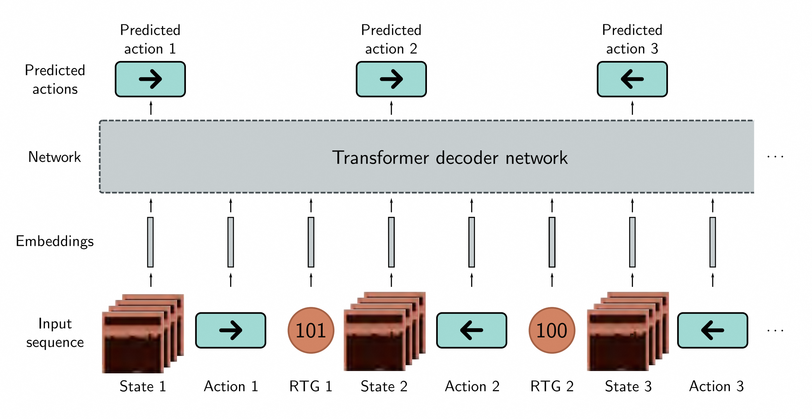
> 图 19.17 决策 Transformer。
> 决策 Transformer 将离线强化学习看作是一个序列预测任务。输入是一系列的状态、动作和“剩余奖励（返回值）”，每个都被映射到一个固定大小的嵌入向量中。在每个时间步，网络预测下一个动作。在测试阶段，我们无法得知“剩余奖励”，但实际上我们可以从一个初始估计值开始，并逐渐减去之后观察到的奖励。

然而，我们的目标是基于未来的奖励来预测行动，而这些奖励在标准的 $s, a, r$ 序列中无法直接获得。因此，决策转换器将奖励 $r_{t}$ 替换为返回值 R（即经验观察到的未来奖励的总和）。剩下的框架与标准的变换器解码器非常相似。状态、行动和返回值都通过学习映射转换为固定大小的嵌入。对于 Atari 游戏来说，状态嵌入可以通过类似于图 [19.14]() 中的卷积网络来获取。行动和返回值的嵌入则可以像词嵌入（图 [12.9]()）那样进行学习。变换器使用掩码的自注意力和位置嵌入进行训练。

这种训练方式在理论上是合理的，但在推理过程中却面临一个困境，因为我们无法得知返回值。为了解决这个问题，可以在第一步使用预期的总返回值，并随着获得奖励的递减。例如，在 Atari 游戏中，期望的总返回值将是获胜所需的总分数。

决策转换器还可以通过在线经验进行微调，从而随着时间的推移不断学习。它们的优势在于减少了大部分强化学习机制及其相关的不稳定性，并采用了标准的监督学习方法。变换器可以从大量的数据中学习，并在较长的时间范围内整合信息（从而更好地解决时间上的学分分配问题）。这代表了强化学习领域一种新颖而有趣的方向。

## 19.8 总结 - Summary

强化学习是一种用于马尔可夫决策过程和类似系统的顺序决策框架。本章回顾了RL的表格方法，包括动态规划（已知环境模型），蒙特卡洛方法（多次运行多个剧集，并基于接收到的奖励改变动作值和策略），以及时序差分方法（在剧集进行时更新这些值）。

Deep Q-Learning是一种时序差分方法，其中利用深度神经网络预测每个状态的动作值。它可以训练代理以达到与人类相似水平的Atari 2600游戏。策略梯度方法直接优化策略而不是为动作分配值。它们产生随机策略，在环境部分可观察时非常重要。更新是有噪声的，为了减少方差，引入了许多改进方法。

离线强化学习用于当我们无法与环境进行交互但必须从历史数据中学习的情况。决策变换器利用深度学习的最新进展，构建了状态-动作-奖励序列的模型，并预测将最大化奖励的动作。

## 19.9 注释 - Notes

[Sutton & Barto, 2018]() 对表格强化学习方法进行了深入介绍。[Li, 2017]()，[Arulkumaran et al., 2017]()，[François-Lavet et al., 2018]()和[Wang et al., 2022c]() 都提供了深度强化学习的概述。[Graesser & Keng, 2019]() 是一本包含Python代码的优秀入门资源。

**深度强化学习的里程碑：** 自强化学习的重要突破大多出现在视频游戏或现实世界游戏中，因为这些环境具有限制和固定的规则。深度 Q 学习（Mnih 等人，2015年）在 ATARI 游戏中取得了与人类相媲美的表现。AlphaGo（Silver 等人，2016年）击败了围棋世界冠军。以前，计算机被认为很难下围棋。Berner 等人（2019年）构建了一个系统，在五对五的游戏《DOTA2》中战胜了世界冠军团队，这需要玩家之间的合作。Ye 等人（2021年）构建了一个系统，可以在 ATARI 游戏中以有限的数据击败人类（与之前的系统相比，需要比人类更多的经验）。最近，Cicero 系统在需要自然语言协商和玩家之间协调的游戏《Diplomacy》中展现出了与人类水平相当的表现（FAIR，2022年）。

强化学习还成功应用于组合优化问题（见Mazyavkina等人，2021年）。例如，Kool等人（2019年）学习了一个模型，其性能与旅行推销员问题的最佳启发式方法相似。最近，AlphaTensor（Fawzi等人，2022年）将矩阵乘法视为一种游戏，并学习了更快的矩阵乘法方式，使用更少的乘法操作。由于深度学习高度依赖矩阵乘法，这是AI自我提升的一个典型例子。

**经典强化学习方法：**  [Thompson, 1933]()和[Thompson, 1935]()在MDP理论方面进行了早期的重要贡献。Bellman的递归思想由[Bellman, 1966]()引入。[Howard, 1960]()提出了策略迭代的概念。[Sutton & Barto, 2018]()将[Andreae, 1969]()的工作视为首次使用MDP形式化描述强化学习。

强化学习的现代时代可以说始于[Sutton, 1984]()和[Watkins, 1989]()的博士论文。[Sutton, 1988]()提出了时间差分学习的术语。[Watkins, 1989]()和[Watkins & Dayan, 1992]()引入了Q-Learning，并通过Banach的定理证明了其收敛于一个不动点，因为Bellman运算符是收缩映射。[Watkins, 1989]()首次明确地将动态规划和强化学习联系起来。SARSA是[Rummery & Niranjan, 1994]()开发的。[Gordon, 1995]()引入了“拟合Q学习”的概念，其中使用机器学习模型来预测每个状态-动作对的行动价值。[Riedmiller, 2005]()引入了“神经网络拟合Q学习”，它使用神经网络同时预测所有动作的价值。[Singh & Sutton, 1996]()进行了蒙特卡洛方法的早期研究，而[Sutton & Barto, 1999]()则引入了“探索起点算法”。需要注意的是，这只是对五十多年工作的概括性总结。更详细的论述请参考[Sutton & Barto, 2018]()。

**深度 Q 网络：** 深度 Q-Learning 是由[Mnih 等，2015]() 提出的，是神经拟合 Q-Learning 的一种智能继承者。它利用了卷积网络的最新成功，开发了一种能够在 ATARI 游戏基准测试中实现人类水平表现的拟合 Q-Learning 方法。深度 Q-Learning 遭受三重问题（[Sutton 和 Barto，2018]())的困扰：任何包含（i）自助法、（ii）离策略学习和（iii）函数逼近的方案中的训练都可能不稳定。随后的工作主要目标是使训练更加稳定。[Mnih 等，2015]() 引入了经验回放缓冲区（[Lin，1992]()），后来被[Schaul 等，2016]()改进，以更青睐重要的元组，从而提高学习速度。这被称为“优先经验回放”。

原始的 Q-Learning 论文将四个帧连接起来，以便网络能够观察物体的速度，并使底层过程更接近完全可观察。[Hausknecht 和 Stone，2015]()引入了*深度循环 Q-Learning*，它使用一种递归网络架构，每次只接收一个帧，因为它可以“记住”之前的状态。[Van Hasselt，2010]()发现了由于最大操作而导致状态值的系统性高估，并提出了双 Q-Learning，即同时训练两个模型来解决这个问题。这后来应用于深度 Q-Learning（[Van Hasseltet al.，2016]()），尽管它的有效性受到了质疑（[Hessel 等，2018]()）。[Wang 等，2016]()引入了*深度对决网络*，其中同一网络的两个头预测（i）状态值和（ii）每个动作的*优势（相对值）*。这里的直觉是有时候状态值很重要，采取什么动作并不重要，而解耦这些估计值可以提高稳定性。

[Fortunato et al. , 2018]() 提出了*噪声深度Q网络*，在该网络中，Q网络的某些权重被噪声乘以，以增加预测的随机性并促进探索。随着网络逐渐收敛到一个合理的策略，它可以学习降低噪声的幅度。分布式DQN（[Bellemare et al. , 2017a]()；[Dabney et al. , 2018]()）旨在更全面地估计回报分布的信息，而不仅仅是期望值。这可能使网络能够缓解最坏情况的结果，并且还可以提高性能，因为预测更高阶矩提供了更丰富的训练信号。Rainbow（[Hessel et al. , 2018]()）将六项改进应用于原始的深度Q学习算法，包括对决网络、分布式DQN和噪声DQN，以提高在ATARI基准测试上的训练速度和最终性能。

**策略梯度:**  [Williams , 1992]() 提出了REINFORCE算法。术语“策略梯度方法”最早见于[Sutton et al. , 1999]()。[Konda & Tsitsiklis , 1999]()提出了行动者-评论家算法。通过使用不同的基线来降低方差的方法在[Greensmith et al. , 2004]()和[Peters & Schaal , 2008]()中进行了讨论。后来有人认为价值基线主要是降低更新的侵略性，而不是方差（[Mei et al. , 2022]()）。

策略梯度已经被改进为产生确定性策略（[Silver et al. , 2014]()；[Lillicrap et al. , 2016]()；[Fujimoto et al. , 2018]()）。最直接的方法是最大化可能的动作，但如果动作空间是连续的，这就需要在每一步进行优化过程。*深度确定性策略梯度*算法（[Lillicrap et al. , 2016]()）将策略沿着动作值的梯度方向移动（即使用行动者-评论家方法）。

**现代策略梯度：**  我们在参数更新方面介绍了策略梯度。然而，它们也可以被视为一种基于重要性采样的期望奖励的代理损失优化方法，使用当前策略参数的轨迹。这种观点使我们能够有效进行多次优化步骤。然而，这可能导致非常大的策略更新。在监督学习中，超出范围只是一个小问题，因为轨迹可以在后期进行修正。然而，在强化学习中，它影响未来的数据收集，并可能具有极其破坏性。

已提出了几种方法来调节这些更新。基于自然梯度（[Kakade，2001]()）的自然策略梯度，通过费舍尔信息矩阵修改下降方向。这提供了一个更好的更新，更不容易陷入局部高原。然而，在具有许多参数的模型中，计算费舍尔矩阵是不切实际的。在信任区域策略优化（TRPO）（Sc [hulman等人，2015]()）中，通过最大化替代目标并对旧策略和新策略之间的KL散度设置约束来进行优化。[Schulman等人，2017]()提出了一个更简单的公式，其中KL散度作为正则化项出现。正则化权重根据KL散度与表示我们希望策略改变多少的目标之间的距离进行调整。近端策略优化（PPO）（Sc [hulman等人，2017]()）是一种更简单的方法，其中损失被剪辑以确保更新更小。

**行动者-评论家算法：** 在行动者-评论家算法（[Konda＆Tsitsiklis，1999]()）中，评论家使用了一步估计。也可以使用k步估计（我们观察到k个折扣回报，并用状态值的估计近似后续回报）。随着k的增加，估计的方差增加，但偏差减小。广义优势估计（Sc [hulman等，2016]()）将多步骤的估计结合在一起，并通过一个权重参数来权衡偏差和方差。[Mnih等，2016]()引入了*异步行动者-评论家*或*A3C*，其中多个代理在并行环境中独立运行并更新相同的参数。策略和值函数每隔T个时间步使用k步回报的混合进行更新。[Wang等，2017]()引入了几种方法，旨在使异步行动者-评论家更高效。软行动者-评论家（[Haarnoja等，2018b]()）在成本函数中添加了一个熵项，鼓励探索并降低过拟合程度，因为策略被鼓励变得不那么自信。

**离线强化学习：** 在离线强化学习中，通过观察其他代理的行为（包括他们接收到的奖励），学习策略，而无法更改策略。它与模仿学习相关，目标是在没有奖励的情况下复制另一个代理的行为（参见[Hussein等，2017]()）。一种方法是将离线强化学习视为离线策略评估。然而，在实践中，观察到的策略和应用的策略之间的分布变化导致对行动价值的过于乐观估计和性能不佳（参见[Fujimoto等，2019]()；[Kumar等，2019a]()；[Agarwal等，2020]()）。保守Q学习（[Kumar等，2020b]()）通过对Q值进行正则化来学习值函数的保守下界估计。决策变压器（[Chen等，2021c]()）是一种简单的离线学习方法，利用了经过深入研究的自注意力架构。它可以随后通过在线训练进行微调（[Zheng等，2022]()）。

**强化学习和聊天机器人：**  聊天机器人可以使用一种称为*强化学习与人类反馈*或*RLHF*（ [Christiano et al. , 2018]() ; [s_tiennon et al. , 2020]() ）的技术进行训练。例如，InstructGPT（ChatGPT的前身，[Ouyang et al. , 2022]() ）从一个标准的Transformer解码器模型开始。然后根据人类注释员编写的提示-回应对对其进行微调。在这个训练过程中，模型被优化为预测真实回应中的下一个单词。

不幸的是，这种训练数据的产生成本很高，无法以足够数量支持高质量的性能。为了解决这个问题，人类注释员会指出他们更喜欢哪种模型回应。这些（更便宜的）数据用于训练一个*奖励模型*。这是一个第二个Transformer网络，它接收提示和模型回应，并返回一个标量，指示回应的好坏程度。最后，进一步训练微调的聊天机器人模型，使用奖励模型作为监督来产生高奖励。在这里，标准的梯度下降无法使用，因为无法通过聊天机器人输出的采样过程计算导数。因此，模型使用近端策略优化（一种能计算导数的策略梯度方法）进行训练，以生成更高的奖励。

**其他强化学习领域：**  强化学习是一个庞大的领域，很容易可以写一本书，而这篇文献综述只是表面的。我们没有讨论的其他值得注意的强化学习领域包括*基于模型的强化学习*，其中对状态转移概率和奖励函数进行建模（参见[Moerland et al. , 2023]() ）。这可以进行前向规划，并且具有相同模型可以在不同的奖励结构下重用的优点。*混合方法*，如AlphaGo（[Silver et al. , 2016]() ）和MuZero（[Schrittwieser et al. , 2020]() ），对状态的动态、策略以及未来位置的价值有单独的模型。

本章仅讨论了一些简单的探索方法，例如ε贪婪方法、有噪声的Q学习以及添加熵项以惩罚过于自信的策略。内在动机*是指为探索添加奖励的方法，从而赋予智能体（Agent）"好奇心"（参见[Barto，2013](); [Aubret et al.，2019]()）。层次化强化学习（参见[Pateria et al.，2021]()）是一种将最终目标分解为子任务的方法。多智能体（Agent）强化学习（参见[Zhang et al.，2021a]（））考虑了多个智能体（Agent）在共享环境中共存的情况。这可以是竞争性或合作性的情境。

## 问题

**问题19.1**  图[19.18]() 展示了一个示例马尔可夫决策过程的单个轨迹。假设折扣因子 $ γ $ 为0.9，计算轨迹中每一步的回报。

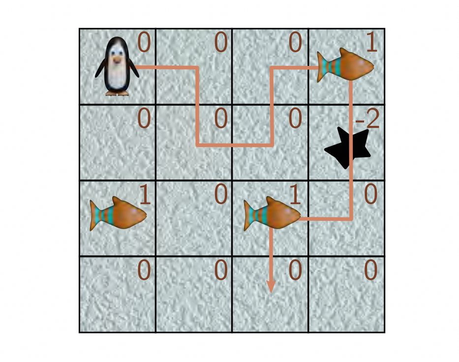
> 图19.18 一个马尔可夫决策过程的单个轨迹。企鹅在到达第一个鱼瓷砖时获得+1的奖励，在掉入洞中时获得+2的奖励，并在到达第二个鱼瓷砖时获得+1的奖励。折扣因子 $ γ $ 为0.9。

**问题19.2** ∗ 证明策略改进定理。考虑从策略 $ π $ 改变到策略 $ π^′ $ ，其中对于状态 $ s_t $ ，新策略 $ π^′ $ 选择使期望回报最大化的动作:

$$
\pi^{\prime}[a_{t}|s_{t}]=\underset{a_{t}}{\operatorname*{argmax}}\bigg[r[s_{t},a_{t}]+\gamma\cdot\sum_{s_{t+1}}Pr(s_{t+1}|s_{t},a_{t})v[s_{t+1}|\pi]\bigg].
\tag{19.43}
$$

对于其他所有状态，策略保持不变。证明原始策略的值必须小于或等于新策略的值 $ v[s_t|π^′] = q[s_t, π^′[a|s_t]|π] $ :

$$
\begin{aligned}
v[s_{t}|\pi]& \leq\quad q\Big[s_{t},\pi^{\prime}[a_{t}|s_{t}]\Big|\pi\Big] \\\\
&=\quad\mathbb{E}_{\pi^{\prime}}\left[r_{t+1}+\gamma\cdot v[s_{t+1}|\pi]\right].
\end{aligned}
\tag{19.44}
$$

提示: 从新策略的角度，将项 $ v [s_{t + 1}|π] $ 用新策略重新表示。

**问题 19.3**  证明当状态值和策略初始化为图 [19.10a]() 中的值时，经过两次（i）策略评估（根据当前值更新所有状态，然后替换之前的状态）和（ii）策略改进后，它们变为图 [19.10b]() 中的值。状态转移将一半的概率分配给策略指示的方向，并将剩余的概率平均分配给其他有效操作。奖励函数在企鹅离开孔洞时返回-2，无论采取何种行动。奖励函数在企鹅离开鱼砖时返回+3，并且该情节结束，因此鱼砖的值为+3。

**问题 19.4**  *Boltzmann策略*通过将行动概率 $ π[a|s] $ 基于当前状态-行动奖励函数 $ q[s, a] $ 来平衡探索和利用。温度参数 $ \tau $ 的变化可以优先考虑探索或利用。

**问题 19.5**  当学习率 $ \alpha $ 为1时，Q-Learning的更新公式为：
$$ \mathrm{f}\big[q[s,a]\big]=r[s,a]+\gamma\cdot\max_{a}\big[q[s^{\prime},a]\big] $$
证明这是一个收缩映射（方程16.30），从而得到：
$$ \bigg|\bigg|\mathrm{f}\big[q_1[s,a]\big]-\mathrm{f}\big[q_2[s,a]\big]\bigg|\bigg|_\infty<\bigg|\bigg|q_1[s,a]-q_2[s,a]\bigg|\bigg|_\infty\quad\forall q_1,q_2 $$
其中 $ ||•||_\infty $ 表示 $ ℓ_\infty $ 范数。根据Banach定理，固定点将存在，并且更新最终会收敛。

**问题19.6**  证明：添加基准更新不会改变预期的策略梯度更新。

**问题19.7**  假设我们想要从样本 $ a_{1}, a_{2}, \ldots a_I $ 中估计一个量 $ \mathbb{E} [a] $ 。同时，我们还有与 $ a $ 协变的配对样本 $ b_{1}, b_{2},\ldots ,b_I $ ，其中 $ \mathbb E [b] = µ_{b} $ 。我们定义了一个新的变量：
$$
a^{'}=a-c(b-\mu_{b}).
\tag{19.49}
$$
证明当选择适当的常数 $ \mathbf c $ 时， $ \operatorname{Var}[a^′] ≤ \operatorname{Var}[a] $ 。找到最佳的 $ \mathbf c $ 的表达式。

**问题19.8**  方程式 [19.34]() 中的梯度估计可以表示为：
$$
\mathbb{E}_{\tau}\bigg[g[\theta](r[\tau_{t}]-b)\bigg]
\tag{19.50}
$$
其中，
$$
g[\theta]=\sum_{t=1}^{T}\frac{\partial\log\left[Pr(a_{t}|\mathbf{s}_{t},\boldsymbol{\theta})\right] ]}{\partial\theta}
\tag{19.51}
$$
以及
$$
r[\tau_{t}]=\sum_{k=t}^{T}r_{k}.
\tag{19.52}
$$

证明最小化梯度估计的方差的 $ b $ 的值为：

$$
b=\frac{\mathbb{E}[g[\tau]^{2}]r[\tau]}{\mathbb{E}[g[\tau]^{2}]}.
\tag{19.53}
$$
