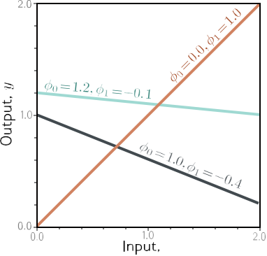
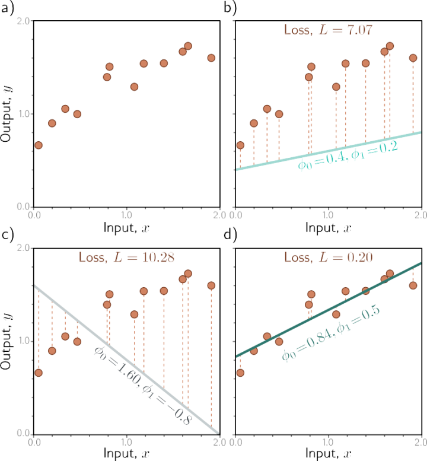
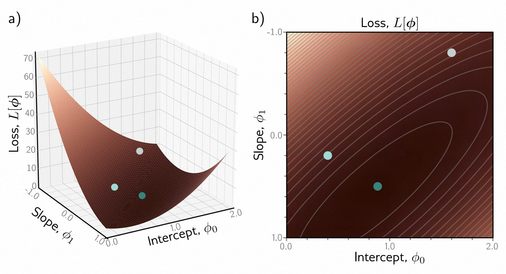
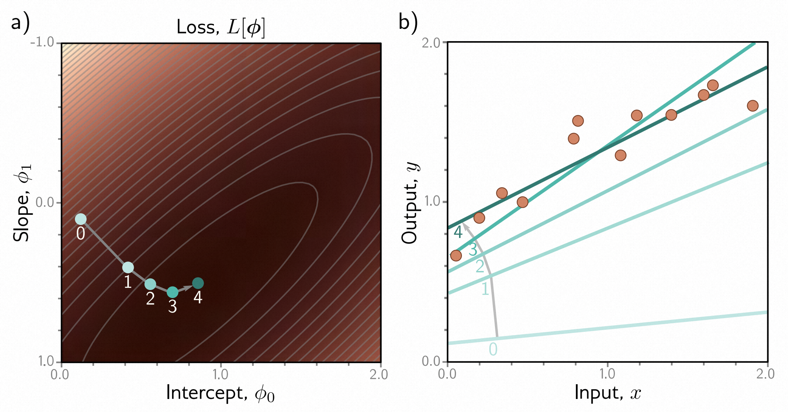

# 第2章 监督学习 - Supervised learning

*监督学习模型* 定义了从一个或多个输入到一个或多个输出的映射关系。例如，输入可能是一辆二手丰田普锐斯的年龄和里程，输出可能是该车的估值（以美元计算）。

模型只是一个数学方程；当输入通过该方程时，它会计算输出，这被称为*推断*。模型方程还包含*参数*。不同的参数值会改变计算结果；模型方程描述了输入和输出之间可能的关系，而参数则指定了具体的关系。

当我们*训练*或*学习*一个模型时，我们找到描述输入和输出之间真实关系的参数。学习算法使用一组 **输入/输出对(input-output pair)** 的训练集，并调整参数，使得输入尽可能准确地预测其对应的输出。如果模型对这些训练对表现良好，我们希望它对于未知的新输入也能做出良好的预测输出。

本章的目标是进一步扩展这些思想。首先，我们更正式地描述这个框架，并引入一些符号表示。然后，我们通过一个简单的例子来说明如何使用一条直线来描述输入和输出之间的关系。这个线性模型既熟悉又容易可视化，但它涵盖了监督学习的所有主要思想。

## 2.1 监督学习概述 - Supervised learning overview

在监督学习中，我们的目标是构建一个模型，它接收一个输入 $x$ 并输出一个预测值 $y$。为简单起见，我们假设输入 $x$ 和输出 $y$ 都是预先确定且固定大小的向量，并且每个向量的元素始终以相同的顺序排列；在上面的普锐斯示例中，输入 $x$ 将始终包含车辆的年龄和里程，按照这个顺序排列。这被称为*结构化*或*表格化*数据。

为了进行预测，我们需要一个模型 $f[•]$，它接收输入 $x$ 并返回 $y$，因此有：
$$
\mathbf{y}=f[\mathbf{x}]\tag{2.1}
$$

当我们从输入 $x$ 计算出预测 $y$ 时，称之为*推断*。

模型只是一个具有固定形式的数学方程。它表示了输入和输出之间的不同关系的集合。模型还包含参数 $\phi$。参数的选择决定了输入和输出之间的具体关系，因此我们实际上应该写成：
$$
\mathbf{y}=f[\mathbf{x},\mathbf{ϕ}]\tag{2.2}
$$

当我们谈论*学习*或*训练*一个模型时，意味着我们试图找到参数 $\phi$，使得从输入产生合理的输出预测。我们使用一个包含 ***I*** 对输入和输出示例的训练数据集来学习这些参数，表示为 ${ x_i , y_i }$ 。我们的目标是能够尽可能准确地找到训练数据中的每个输入映射到其相关输出的参数。我们用*损失 L*来量化这种映射的不匹配程度。损失是一个标量值，总结了模型根据参数 $\phi$ 对训练输出从相应的输入进行预测的不准确程度。

我们可以将损失视为这些参数的函数 $\mathcal{L}\left[\phi\right]$。当我们训练模型时，我们寻找使得这个*损失函数*最小化的参数 $\hat{\phi}$：[1](#_bookmark45)

$$
\hat{\phi}=\underset{\phi}{\operatorname*{argmin}}\Big[\mathcal{L}\left[\phi\right]\Big] \tag{2.3}
$$

如果在这个最小化过程后损失较小，我们就找到了能够准确预测训练输出 $y_i$ 的训练输入 $x_i$ 的模型参数。

训练完模型后，我们现在需要评估它的性能；我们在单独的*测试数据*上运行模型，看它在没有在训练中观察过的示例上的*泛化*能力如何。如果性能足够好，那么我们就可以部署这个模型。

## 2.2 线性回归示例 - Linear regression example

让我们通过一个简单的例子将这些思想具体化。我们考虑一个模型 $y = f[x, ϕ]$，它从一个输入 $x$ 预测一个输出 $y$。然后我们开发一个损失函数，最后讨论模型训练。

### 2.2.1 一维线性回归模型 - 1D linear regression model

*一维线性回归模型*将输入 $x$ 和输出 $y$ 的关系描述为一条直线：

$$
\begin{array}{rcl}y&=&\text{f}[x,\boldsymbol{\phi}]\\&=&\phi_0+\phi_1x.\end{array} \tag{2.4}
$$

> 更准确地说，损失函数还依赖于训练数据 $\{\mathbf{x}_i,\mathbf{y}_i\}$，因此我们应该写成 $\mathcal{L}[\{\mathbf{x}_i,\mathbf{y}_i\},\phi]$，但这样写会非常繁琐。

> 图2.1 线性回归模型。对于给定的参数选择 $\mathbfϕ=[\mathbfϕ_0,\mathbfϕ_1]^T$，模型根据输入（x轴）预测输出（y轴）。不同的y截距 $\phi_0$ 和斜率 $\phi_1$ 选择会改变这些预测（青色、橙色和灰色线）。线性回归模型（方程[2.4)](#_bookmark44)定义了一族输入/输出关系（直线），而参数确定了这个族中的成员（特定的直线）。

这个模型有两个参数 $\mathbfϕ=[\mathbfϕ_0,\mathbfϕ_1]^T$，其中 $\phi_0$ 是直线的y截距，$\phi_1$ 是斜率。不同的y截距和斜率选择会导致输入和输出之间的不同关系（图[2.1](#_bookmark47)）。因此，方程[2.4](#_bookmark44)定义了一组可能的输入输出关系（所有可能的直线），而参数的选择确定了这个族中的成员（特定的直线）。

### 2.2.2 损失函数

对于这个模型，训练数据集（图[2.2a)](#_bookmark49)）由 ***I*** 个*输入/输出对* $\{x_i,y_i\}$ 组成。图[2.2b-d](#_bookmark49)展示了由三组参数定义的三条直线。图[2.2d](#_bookmark49)中的绿线比其他两条更准确地描述了数据，因为它更接近数据点。然而，我们需要一种有原则的方法来判断哪些参数 $\phi$ 比其他参数更好。为此，我们为每种参数选择分配一个数值，以量化模型与数据之间的不匹配程度。我们将这个值称为*损失*；较低的损失意味着更好的拟合。

不匹配通过模型预测值 $f[x_i,\phi]$（在 $x_i$ 处的线的高度）与真实输出 $y_i$ 之间的偏差来捕捉。这些偏差在图[2.2b-d](#_bookmark49)中以橙色虚线表示。我们量化总偏差、训练误差或损失，将其定义为所有 ***I*** 个训练对的偏差平方和：

$$
\begin{array}{rcl}\mathrm{L}[\phi]&=&\displaystyle\sum_{i=1}^I\left(\mathrm{f}[x_i,\phi]-y_i\right)^2\\&=&\displaystyle\sum_{i=1}^I\left(\phi_0+\phi_1x_i-y_i\right)^2.\end{array}\tag{2.5}
$$

由于最佳参数使得这个表达式最小，我们称之为*最小二乘*损失。平方操作意味着偏差的方向（即线在数据上方还是下方）是无关紧要的。这个选择还有理论上的原因，在第[5章](#_bookmark152)中我们会回到这个问题。

> 图2.2 线性回归的训练数据、模型和损失。
> *  a) 训练数据（橙色点）由 *I = 12* 个输入/输出对 $\{x_i,y_i\}$ 组成。
> *  b-d) 每个面板显示了具有不同参数的线性回归模型。根据y截距和斜率参数的选择 $\mathbf{\phi}=[\mathbf{\phi_0}, \mathbf{\phi_1}]^T$，模型的误差（橙色虚线）可能更大或更小。损失函数 *L* 是这些误差的平方和。面板（b）和（c）中定义线的参数具有较大的损失 *L = 7.07* 和 *L = 10.28*，因为模型拟合得不好。
> *  面板（d）中的损失 *L = 0.20* 较小，因为模型拟合得很好；实际上，这是所有可能线中损失最小的参数，因此这些是最优参数。

> 图2.3 线性回归模型在图[2.2a](#_bookmark49)中的损失函数。
> *  a) 每组参数 $\mathbf{\phi}=[\mathbf{\phi_0}, \mathbf{\phi_1}]^T$ 都有一个相应的损失。得到的损失函数 $L[\phi]$ 可以可视化为一个曲面。三个圆代表图[2.2b-d](#_bookmark49)中的三条线。
> *  b) 损失也可以可视化为热图，亮色区域表示较大的损失；这里我们从上方俯视(a)中的曲面，灰色椭圆表示等高线。最佳拟合线（图[2.2d](#_bookmark49)）具有最小的损失参数（绿色圆）。

损失 *L* 是参数 $\phi$ 的函数；当模型拟合较差时（图[2.2b,c](#_bookmark49)），它会更大，而当拟合较好时（图[2.2d](#_bookmark49)），它会更小。从这个角度来看，我们将 $L[\phi]$ 称为*损失函数*或*代价函数*。目标是找到使这个量最小化的参数 $\hat{\phi}$：

$$
\begin{aligned}
\hat{\phi}& =\quad\underset{\boldsymbol{\phi}}{\operatorname*{argmin}}\Big[\operatorname{L}[\phi]\Big]  \\
&=\quad\underset{\phi}{\operatorname*{argmin}}\left[\sum_{i=1}^I\left(\mathrm{f}[x_i,\boldsymbol{\phi}]-y_i\right)^2\right] \\
&=\quad\underset{\phi}{\operatorname*{argmin}}\left[\sum_{i=1}^I\left(\phi_0+\phi_1x_i-y_i\right)^2\right].
\end{aligned}\tag{2.6}
$$

由于只有两个参数（y截距 $\phi_0$ 和斜率 $\phi_1$），我们可以计算每个值组合的损失，并将损失函数可视化为一个曲面（图[2.3](#_bookmark51)）。这个曲面的最小值对应于“最佳”的参数。

### 2.2.3 训练

寻找使损失最小化的参数的过程称为*模型拟合*、*训练*或*学习*。基本方法是随机选择初始参数，然后通过“下降”损失函数来改进它们，直到达到最低点（图[2.4](#_bookmark56)）。其中一种方法是测量当前位置处曲面的梯度，并朝最陡峭的下坡方向迈出一步。然后我们重复这个过程，直到梯度变平，无法再进一步改进[2](#_bookmark54)。

### 2.2.4 测试

在训练完模型之后，我们希望知道它在真实世界中的表现如何。为了做到这一点，我们需要在一个单独的*测试数据集*上计算损失。预测准确性在多大程度上能够*泛化*到测试数据取决于训练数据的代表性和完整性。然而，它还取决于模型的表达能力。像一条直线这样简单的模型可能无法捕捉输入和输出之间的真实关系。这被称为*欠拟合*。相反，一个非常表达能力强的模型可能描述训练数据的统计特性，而这些特性在数据中是不典型的，导致异常的预测结果。这被称为*过拟合*。

## 2.3 总结

监督学习模型是一个函数 $\mathbf y=f[\mathbf x,\mathbf ϕ]$，它将输入 $x$ 和输出 $y$ 相关联。具体的关系由参数 $\phi$ 决定。为了训练模型，我们定义了一个损失函数 $\mathcal{L}\left[\phi\right]$，它基于参数 $\phi$ 将模型预测 $f[ x_i , ϕ ]$ 与观测输出 $y_i$ 的不匹配进行量化。然后我们寻找使损失最小化的参数。我们使用不同的测试数据集来评估模型在新输入上的泛化能力。

第[3-9章](#_bookmark358)对这些思想进行了扩展。首先，我们解决模型本身；线性回归的明显缺点是它只能将输入和输出之间的关系描述为一条直线。浅层神经网络（第[3章](#_bookmark61)）比线性回归稍微复杂一些，但可以描述更大的输入/输出关系族。深层神经网络（第[4章](#_bookmark112)）同样具有表达能力，但可以用更少的参数描述复杂的函数，并在实践中表现更好。

第[5章](#_bookmark152)研究了不同任务的损失函数，并揭示了最小二乘损失的理论基础。第[6章](#_bookmark209)和第[7章](#_bookmark258)讨论了训练过程。第[8章](#_bookmark314)讨论了如何衡量模型的性能。第[9章](#_bookmark358)考虑了改善性能的*正则化*技术。

> 这种迭代方法实际上对于线性回归模型并不是必需的。在这种情况下，可以找到参数的闭式表达式。然而，这种*梯度下降*方法适用于更复杂的模型，其中没有闭式解，并且有太多参数无法对每个值组合计算损失。

> 图2.4 线性回归训练。目标是找到与最小损失相对应的y截距和斜率参数。
> *  a) 迭代训练算法随机初始化参数，然后通过“向下走坡”来改进它们，直到无法再进一步改进。在这里，我们从位置0开始，向下走一定距离（垂直于等高线方向）到达位置1。然后我们重新计算向下走的方向，移动到位置2。最终，我们到达函数的最小值（位置4）。
> *  b) 面板（a）中的每个位置0-4对应于不同的*y*截距和斜率，因此代表不同的线。随着损失的减小，这些线更好地拟合数据。

## 笔记

损失函数与代价函数：在机器学习中，以及本书中，损失函数和代价函数这两个术语是可以互换使用的。然而，更准确地说，损失函数是与数据点相关联的个别项（即方程[2.5]右侧的每个平方项），而代价函数是要最小化的整体数量（即方程[2.5]的整个右侧）。代价函数可能包含与个别数据点无关的附加项（参见第[9.1节](#_bookmark360)）。更一般地说，*目标函数*是要最大化或最小化的任何函数。

生成模型与判别模型：本章中的模型 $\mathbf{y}=\mathbf{f}[\mathbf{x},\phi]$ 是*判别模型*。它们根据实际测量的$x$进行输出预测$y$。另一种方法是构建一个*生成模型* $\mathbf{x}=\mathbf{g}[\mathbf{y},\phi]$，其中实际测量值$x$是输出$y$的函数计算得到。

生成方法的缺点是它不能直接预测$y$。为了进行推断，我们必须反转生成方程，即 $\mathbf{y}=\mathbf{g}^{-1}[\mathbf{x},\phi]$，这可能很困难。然而，生成模型的优点是我们可以在数据生成过程中内置先验知识。例如，如果我们想要预测图像 $x$中汽车的3D位置和方向 $y$，那么我们可以将关于汽车形状、3D几何和光传输的知识构建到函数$\mathbf{x}=\mathbf{g}[\mathbf{y},\phi]$中。

这看起来是一个好主意，但事实上，判别模型在现代机器学习中占据主导地位。通过学习大量的训练数据，利用判别模型的灵活性通常能够超越在生成模型中利用先验知识所获得的优势。

## 问题

**问题2.1** 为了在损失函数（方程[2.5]）上“向下走坡”，我们需要计算它对参数 $\phi_0$和 $\phi_1$的梯度。计算斜率 $∂L/∂ϕ_0$和 $∂L/∂ϕ_1$的表达式。

**问题2.2** 证明我们可以通过将问题[2.1](#_bookmark58)中的导数表达式置零并解出 $\phi_0$和 $\phi_1$来找到损失函数的闭式最小值。请注意，这仅适用于线性回归，而对于更复杂的模型，我们使用迭代模型拟合方法，如梯度下降（图[2.4]）。

**问题2.3** 考虑将线性回归重新构建为一个生成模型，即 $\mathbf{x}=g[\mathbf{y},\mathbf{ϕ}]=\mathbf{ϕ}_0+\mathbf{ϕ}_1\mathbf{y}$。新的损失函数是什么？找到执行推断所使用的反函数$\mathbf{y}=g^{-1}[\mathbf{x},\mathbf{ϕ}]$的表达式。对于给定的训练数据集 $\{ x_i , y_i \}$，这个模型会产生与判别版本相同的预测吗？建立代码，使用这两种方法拟合三个数据点的直线，并查看结果是否相同。