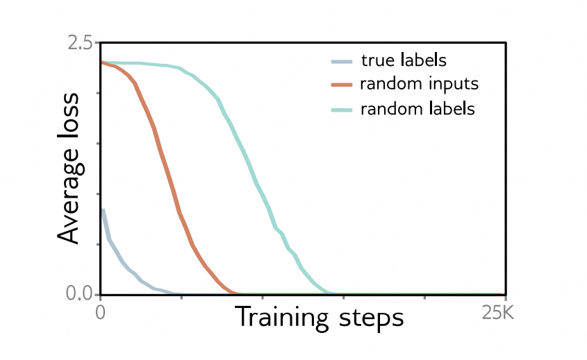

[译]第20章 深度学习为何有效？ - why does deep learning work? 《理解深度学习 - Understanding Deep Learning》

本文是基于Simon J.D. Prince 的新书《Understanding Deep Learning》翻译而来；

* 原书介绍、原书（英文）下载、译文进展 以及 译文内容请戳 ↓↓↓
* [ \[译\]《理解深度学习 - Understanding Deep Learning 》 - 目录&前言 - ATA (atatech.org)](https://ata.atatech.org/articles/11020138829)

----

↓↓↓ 以下正文↓↓↓
----

# 本章目录

<!-- vscode-markdown-toc -->
* [本章目录](#本章目录)
* [第20章 深度学习为何有效？](#第20章-深度学习为何有效)
  * [20.1 反对深度学习的观点 - The case against deep learning](#201-反对深度学习的观点---the-case-against-deep-learning)
    * [20.1.1 训练 - Training](#2011-训练---training)
    * [20.1.2 泛化 - Generalization](#2012-泛化---generalization)
    * [20.1.3 深度学习的卓越有效性 - The unreasonable effectiveness of deep learning](#2013-深度学习的卓越有效性---the-unreasonable-effectiveness-of-deep-learning)
  * [20.2 影响拟合性能的因素 - Factors that influence fitting performance](#202-影响拟合性能的因素---factors-that-influence-fitting-performance)
    * [20.2.1 数据集 - Dataset](#2021-数据集---dataset)
    * [20.2.2 正则化 - Regularization](#2022-正则化---regularization)
    * [20.2.3 随机训练算法 - Stochastic training algorithms](#2023-随机训练算法---stochastic-training-algorithms)
    * [20.2.4 过参数化 - Overparameterization](#2024-过参数化---overparameterization)
    * [20.2.5 激活函数 - Activation functions](#2025-激活函数---activation-functions)
    * [20.2.6 初始化 - Initialization](#2026-初始化---initialization)
    * [20.2.7 网络深度 - Network depth](#2027-网络深度---network-depth)
    * [20.3 损失函数的性质 - Properties of loss functions](#203-损失函数的性质---properties-of-loss-functions)
    * [20.3.1 多个全局最小值 - Multiple global minima](#2031-多个全局最小值---multiple-global-minima)
    * [20.3.2 达到最小值的路径 - Route to the minimum](#2032-达到最小值的路径---route-to-the-minimum)
    * [20.3.3 最小值之间的联系 - Connections between minima](#2033-最小值之间的联系---connections-between-minima)
    * [20.3.4 损失曲面的曲率 - Curvature of loss surface](#2034-损失曲面的曲率---curvature-of-loss-surface)
  * [20.4 决定泛化的因素 - Factors that determine generalization](#204-决定泛化的因素---factors-that-determine-generalization)
    * [20.4.1 训练算法 - Training algorithms](#2041-训练算法---training-algorithms)
    * [20.4.2 最小值的平坦性 - Flatness of minimum](#2042-最小值的平坦性---flatness-of-minimum)
    * [20.4.3 架构 - Architecture](#2043-架构---architecture)
    * [20.4.4 权重的范数 - Norm of weights](#2044-权重的范数---norm-of-weights)
    * [20.4.5 过度参数化 - Overparameterization](#2045-过度参数化---overparameterization)
    * [20.4.6 离开数据流形 - Leaving the data manifold](#2046-离开数据流形---leaving-the-data-manifold)
  * [20.5 我们需要这么多参数吗？ - Do we need so many parameters?](#205-我们需要这么多参数吗---do-we-need-so-many-parameters)
    * [20.5.1 剪枝 - Pruning](#2051-剪枝---pruning)
    * [20.5.2 知识蒸馏 - Knowledge distillation](#2052-知识蒸馏---knowledge-distillation)
    * [20.5.3 讨论 - Discussion](#2053-讨论---discussion)
  * [20.6 网络是否必须深层？ - Do networks have to be deep?](#206-网络是否必须深层---do-networks-have-to-be-deep)
    * [20.6.1 建模函数的复杂性 - Complexity of modeled function](#2061-建模函数的复杂性---complexity-of-modeled-function)
    * [20.6.2 训练的可行性 - Tractability of training](#2062-训练的可行性---tractability-of-training)
    * [20.6.3 归纳偏差 - Inductive bias](#2063-归纳偏差---inductive-bias)
  * [20.7 总结 - Summary](#207-总结---summary)
  * [20.8 问题 - Problems](#208-问题---problems)

<!-- vscode-markdown-toc-config
	numbering=true
	autoSave=true
	/vscode-markdown-toc-config -->
<!-- /vscode-markdown-toc -->

# 第20章 深度学习为何有效？

本章与前面的章节有所不同。它不是呈现已被确认的结果，而是提出了有关深度学习为何如此有效的问题。这些问题在教科书中很少被讨论。然而，我们要认识到（尽管本书的标题如此），对深度学习的理解仍然有限。

我们认为令人惊讶的是，深度神经网络很容易进行训练，并且具有泛化能力。然后我们依次探讨了这些问题。我们列举了影响训练成功的因素，并讨论了对于深度神经网络的损失函数已知的情况。然后，我们考虑了影响泛化能力的因素。最后，我们讨论了网络是否需要过度参数化和深度。

## 20.1 反对深度学习的观点 - The case against deep learning

MNIST-1D 数据集（图[8.1]()）只有 40 个输入维度和 10 个输出维度。当每层有足够的隐藏单元时，一个两层全连接网络能够完美地对 10000 个 MNIST-1D 训练数据点进行分类，并且在未见过的样本上能够合理地进行泛化（图[8.10a]()）。事实上，我们现在认为只要有足够的隐藏单元，深度网络几乎可以对任何训练集进行近乎完美的分类。我们还默认拟合的模型将能够泛化到新的数据。然而，训练过程是否能够成功，以及产生的模型是否能够泛化，这两个现象都不是显而易见的。本节将讨论这两个现象是多么令人惊讶。

### 20.1.1 训练 - Training

当每层都有43个隐藏单元（4000个参数）时，一个有两层全连接网络在10000个MNIST-1D训练样本上的表现是完美的。然而，找到任意非凸函数的全局最小值是一个NP难问题([Murty &Kabadi , 1987]() )，而对于某些神经网络损失函数来说也是如此([Blum &Rivest , 1992]() )。令人惊讶的是，拟合算法不会陷入局部最小值或者困在鞍点附近，并且它能够高效地利用多余的模型容量来拟合未解释的训练数据。

也许当参数比训练数据多得多时，这种成功情况就不那么令人惊讶了。AlexNet有6000万个参数，用100万个数据点进行训练。然而，复杂性在于，每个训练样本都被增加了2048个变换。GPT-3有1750亿个参数，用3000亿个标记进行训练。这两个模型是否过于参数化还存在争议，但它们都取得了成功。

简言之，我们能够可靠高效地拟合深度网络是令人惊讶的。数据、模型、训练算法或者它们三者的组合必须具备某些特殊属性，才使这成为可能。

### 20.1.2 泛化 - Generalization

如果神经网络的高效拟合令人惊叹，那么它们对新数据的泛化能力就更加令人瞠目结舌。首先，在*先验*的情况下，典型的数据集是否足以描述输入/输出映射是不明显的。维度灾难意味着训练数据集相对于*可能的*输入来说是微不足道的；如果将MNIST-1D数据的40个输入中的每一个量化为10个可能的值，那么可能的输入就有 $ 10^{40} $ 种，这比训练样本数量多了 $ 10^{35} $ 倍。

其次，深度网络可以描述非常复杂的函数。一个具有两个宽度为400的隐藏层的MNIST-1D全连接网络可以创建高达 $ 10^{42} $ 个线性区域的映射。这大约是每个训练样本 $ 10^{37} $ 个区域，所以在训练过程中很少有这些区域包含数据；尽管如此，那些与数据点相交的区域会限制其它区域的行为合理。

第三，随着参数数量的增加，泛化能力会变得更好（图[8.10]()）。前面段落中的模型有177,201个参数。假设它可以拟合一个训练样本一个参数，那么它有167,201个多余的自由度。这样的过多自由度使得模型可以在训练数据之外做几乎任何事情，但它仍然能够表现得合理。

### 20.1.3 深度学习的卓越有效性 - The unreasonable effectiveness of deep learning

简而言之，我们事先并不清楚我们能否拟合深度网络，也不知道它们是否能够泛化。从先验的角度来看，深度学习不应该起作用。然而，它确实起作用。本章将探讨其中的原因。[20.2-20.3节](#loss-function)介绍了我们对拟合深度网络及其损失函数的了解。[20.4-20.6节](#do-networks-have-to-be-deep)探讨了泛化能力。

## 20.2 影响拟合性能的因素 - Factors that influence fitting performance

图[6.4]()显示，非线性模型的损失函数可能存在局部最小值和鞍点。然而，我们可以可靠地拟合复杂的训练集。例如，图[8.10]()展示了对MNIST-1D、MNIST和CIFAR-100的完美训练效果。本节讨论可能解决这一矛盾的因素。

### 20.2.1 数据集 - Dataset

要知道，我们其实并不能学习*任何*函数。想象一下，将每个可能的 $28×28$ 二进制图像映射到十个类别中的一个，而这个映射是完全随机的。由于这个函数没有任何结构，我们唯一的办法就是记住 $ 2^{784} $ 个分配。然而，在MNIST数据集（图 [8.10]() 和 [15.15]() ）上训练一个模型是很容易的，该数据集包含 60,000 个 $28×28$ 图像的示例，每个示例都标有十个类别之一。这种矛盾的解释之一可能是，因为我们模拟的现实世界的函数相对简单，所以很容易找到全局最小值。^[1]^

> ^[1]^ 在本章中，我们宽泛地使用术语“全局最小值”来指任何将所有数据都正确分类的解决方案。我们无法知道是否存在其他更低损失的解决方案。

[Zhang et al. , 2017a]() 研究了这个假设，他们在CIFAR-10图像分类数据集上训练了AlexNet，其中（i）用高斯噪声替换了每个图像，以及（ii）将十个类别的标签随机重排（图 [20.1]() ）。这些改变减慢了学习速度，但网络仍然可以很好地适应这个有限的数据集。这表明数据集的特性并不是至关重要的。

> 图 20.1 拟合随机数据。
> 用SGD训练的AlexNet架构在CIFAR-10数据集上的损失。当像素从与原始数据相同的高斯随机分布中采样时，模型仍然可以拟合（尽管速度较慢）。当标签被随机排列时，模型仍然可以拟合（尽管更慢）。改编自[Zhang et al. , 2017a]()。
>
### 20.2.2 正则化 - Regularization

模型训练容易的另一个可能的解释是，一些正则化方法，比如L2正则化（权重衰减），可以使损失曲面更加平缓和凸起。然而，[Zhang等人，2017a]()发现，拟合随机数据并不需要L2正则化或者Dropout。这并不能完全消除由于拟合算法的有限步长而产生的隐式正则化（第9.2节）。然而，这种效应随着学习率的增加而增强（方程式[9.9]()），并且使用较大的学习率并不能使模型的拟合变得更容易。

### 20.2.3 随机训练算法 - Stochastic training algorithms

第6章论述了SGD算法在训练过程中有可能在“山谷”之间移动。然而，[Keskar等人，2017]()的研究表明，多个模型（包括全连接网络和卷积网络）可以使用非常大的批次（5000-6000个图像）几乎完美地拟合许多数据集（包括CIFAR-100和MNIST）。这消除了大部分的随机性，但训练仍然成功。

图[20.2]()显示了4个全连接模型拟合4000个MNIST-1D示例的训练结果，使用的是全批次（即非随机）梯度下降，标签是随机化的。没有明确的正则化，并且学习率被设置为一个小的常数值0.0025以减小隐式正则化。在这种情况下，从数据到标签的真实映射没有结构，训练是确定性的，也没有正则化，然而训练误差仍然会降到零。这表明这些损失函数可能真的没有局部最小值。

> 图 20.2 MNIST-1D 训练。
> 使用全批梯度下降、He初始化、无动量或正则化以及学习率0.0025，在4000个带有随机标签的MNIST-1D示例上拟合了四个全连接网络。每层1、2、3、4个神经网络分别有298、100、75和63个隐藏单元，以及15208、15210、15235和15139个参数。所有模型都训练成功，但是深层模型需要更少的迭代次数。

### 20.2.4 过参数化 - Overparameterization

过参数化几乎肯定是训练容易的一个重要因素。它意味着存在一大类退化解决方案，因此可能总有一种方向可以修改参数以减少损失。[Sejnowski, 2020]() 表示“解决方案的退化性改变了问题的性质，从在一堆干草中找到一根针，变成了在一堆针中找到一根针。”

在实践中，网络经常过参数化一到两个数量级（图[20.3]()）。然而，数据增强使得进行精确的陈述变得困难。增强可能使数据增加几个数量级，但这些是对现有示例的操作，而不是独立的新数据点。此外，图[8.10]()显示，当与数据点数量相同或更少的参数时，神经网络有时可以很好地拟合训练数据。这可能是由于来自相同基础函数的训练示例的冗余性。几个理论上的收敛结果表明，在某些情况下，当网络过参数化时，随机梯度下降会收敛到全局最小值。例如，[Du et al. , 2019b]() 表明，当具有足够隐藏单元的浅层全连接的ReLU网络使用最小二乘损失进行随机初始化时，SGD会收敛到全局最小值。类似地，[Du et al. , 2019a]() 考虑了具有光滑和利普希茨激活函数的深层、残差和卷积网络。[Zou et al. , 2020]() 分析了使用hinge损失函数对深层全连接网络进行梯度下降的收敛性。[Allen-Zhu et al. , 2019]() 考虑了具有ReLU函数的深层网络。

> 图 20.3 过度参数化。
> 卷积神经网络在过度参数化情况下的 ImageNet 性能（作为数据集大小的倍数）。大多数模型的参数比训练样本多 10-100 倍。比较的模型包括 ResNet（[He等，2016a，b]()）、DenseNet（[Huang等，2017b]()）、Xception（[Chollet，2017]()）、EfficientNet（[Tan和Le，2019]()）、Inception（[Szegedy等，2017]()）、ResNeXt（[Xie等，2017]()）和AmoebaNet（[Cubuk等，2019]()）。

如果神经网络足够过度参数化，可以记住任何固定大小的数据集，那么所有的驻点都会成为全局最小值（[Livni等，2014]()；[Nguyen和Hein，2017，2018]()）。其他研究结果表明，如果网络足够宽，局部最小值的损失高于全局最小值的情况很少见（参见[Choromanska等，2015]()；[Pascanu等，2014]()；[Pennington和Bahri，2017]()）。[Kawaguchi等，2019]()证明，当网络变得更深、更宽或两者兼而有之时，对于平方损失函数，局部最小值的损失越接近全局最小值。

这些理论结果很有意思，但通常对网络结构做出了不切实际的假设。例如，[Du等，2019a]()表明，当网络的宽度 $ D $ （即隐藏单元的数量）为 $ \mathcal O[I^{4}K^{2}] $ 时，残差网络的训练损失将趋近于零，其中 $ I $ 是训练数据量， $ K $ 是网络的深度。同样，[Nguyen和Hein，2017]()假设网络的宽度大于数据集大小，在大多数实际情况下是不切实际的。过度参数化似乎很重要，但理论尚不能解释实际拟合性能。

### 20.2.5 激活函数 - Activation functions

激活函数也被认为影响着训练的难度。相比于只在输入范围的一小部分变化的激活函数，ReLU（在一半的输入范围内变化）或 Leaky ReLU（在整个范围内变化）更容易进行拟合；例如，sigmoid 和 tanh 非线性函数（图 [3.13a]() ）在其尾部具有较浅的梯度；当激活函数接近常数时，训练梯度接近零，因此无法改善模型。

### 20.2.6 初始化 - Initialization

另一个可能的解释是 Xavier/He 初始化将参数设置为易于优化的值。当然，对于更深的网络，这种初始化是必要的，以避免梯度爆炸和梯度消失，因此从某种程度上讲，初始化对于训练的成功至关重要。然而，对于更浅的网络，权重的初始方差就不那么重要了。[Liu et al. , 2023c]() 在1000个MNIST数据点上训练了一个具有每层200个隐藏单元的3层全连接网络。他们发现，随着方差从He提出的方差增加，需要更多的迭代次数来拟合训练数据，但这最终并没有妨碍拟合。因此，初始化对于解释为什么拟合神经网络容易并没有提供太多启示，尽管梯度爆炸/梯度消失揭示了在有限精度算术中进行训练困难的初始化。

> 图 20.4 初始化和拟合。
> 使用AdamW，在1000个MNIST示例上，训练了一个具有每层200个隐藏单元的三层全连接网络，使用one-hot目标和均方误差损失。使用更大的He初始化倍数进行拟合需要更长时间，但这并不改变结果。这可能只是反映了权重必须移动的额外距离。改编自[Liu et al. , 2023c]() 。
>
### 20.2.7 网络深度 - Network depth

当网络的深度变得非常大时，神经网络的拟合变得更加困难，原因是梯度爆炸和梯度消失（见图 [7.7]()）以及梯度分散（见图 [11.3]()）。然而，这些问题可以说是实际数值问题。没有确凿的证据表明随着网络深度的增加，潜在的损失函数在凸性上有所不同。图 [20.2]() 显示，对于随机标签和He初始化的MNIST数据集，更深的网络训练所需的迭代次数更少。然而，这可能是因为（i）更深的网络中的梯度更陡峭，或者（ii）He初始化使得更宽更浅的网络离最优参数更远。

[Frankle & Carbin, 2019]() 表明，对于像VGG这样的小型网络，如果您（i）训练网络，（ii）修剪权重最小的权重，以及（iii）从相同的初始权重重新训练，您可以获得相同或更好的性能。如果重新初始化权重，则无法实现相同的效果。他们得出结论，原始的过度参数化网络包含了足够的小型可训练子网络来提供性能。他们将这种观点称为“彩票假设”，并将这些子网络称为“中奖券”。这表明有效的子网络数量可能在拟合中起重要作用。这个数量可能因网络深度的不同而有所变化，但对于这个观点的准确描述尚不清楚。

### 20.3 损失函数的性质 - Properties of loss functions

前一节讨论了影响神经网络训练难易程度的因素。参数数量（过度参数化的程度）和激活函数的选择都很重要。令人惊讶的是，数据集的选择、拟合算法的随机性以及正则化的使用似乎不是很重要。没有确凿的证据表明（对于固定的参数数量）网络的深度对结果有重要影响（除了由于梯度爆炸/消失/分散而导致的数值问题）。本节从不同的角度考虑损失函数的实证性质。大部分证据来自于全连接网络和卷积神经网络；对于Transformer网络的损失函数来说，了解得较少。

### 20.3.1 多个全局最小值 - Multiple global minima

我们预计深度网络的损失函数具有很多等价的全局最小值。在全连接网络中，每层的隐藏单元及其相关的权重可以进行排列而不改变输出。在卷积网络中，适当地排列通道和卷积核也不会改变输出。我们可以在ReLU函数之前乘以权重，之后除以一个正数而不改变输出。使用BatchNorm会引入另一组冗余，因为每个隐藏单元或通道的均值和方差会被重设。

上述修改对于每个输入都会产生相同的输出。然而，全局最小值只取决于训练数据点的输出。在过度参数化的网络中，还会有一系列在数据点上表现相同但在它们之间表现不同的解。所有这些也是全局最小值。

### 20.3.2 达到最小值的路径 - Route to the minimum

[Goodfellow et al.，2015b]()认为初始参数和最终值之间有一条直线。他们证明了沿着这条直线的损失函数通常是单调递减的（有时在开始处有一个小的颠簸）。这种现象在几种不同类型的网络和激活函数上都被观察到（图[20.5a]()）。

> 图 20.5 损失函数的线性切片。
>
> * a）在MNIST上训练的一个二层全连接ReLU网络。在起始参数（δ=0）和训练参数（δ=1）之间的一条直线上的损失函数单调递减。
> * b）然而，在MNIST上的一个二层全连接MaxOut网络中，在一个解（δ=0）和另一个解（δ=1）之间的直线上有一个损失的增加。改编自[Goodfellow et al.，2015b]()。

当然，实际的优化轨迹并不是一条直线。然而，Li等人（2018b）发现它们确实位于低维子空间中。他们认为这是因为在损失函数空间中存在大而几乎是凸的区域，这些区域早期就捕捉到了轨迹，并将其引导到几个重要的方向。令人惊讶的是，Li等人（2018a）表明，即使优化被限制在一个随机的低维子空间中，网络仍然能够很好地训练（图20.6）。

> 图20.6 子空间训练。
> 在MNIST数据集上，训练了一个具有两个隐藏层，每个隐藏层有200个单位的全连接网络。参数使用标准方法进行初始化，然后限制在一个随机子空间内。当子空间的维度为750D（称为*内在维度*）时，性能达到无约束情况的90%。图源自Li等人（2018a）。

Li和Liang（2018）显示出，在网络宽度增加时，训练过程中参数的相对变化减小；对于更大的宽度，参数的初始值较小，相对变化的比例也较小，并且收敛所需的步骤更少。

### 20.3.3 最小值之间的联系 - Connections between minima

Goodfellow等人（2015b）通过直线连接两个独立发现的最小值来研究损失函数。他们发现在这两个最小值之间的损失有显著增加（图20.5b）；好的最小值通常并没有线性联系。然而，Frankle等人（2020）表明，如果网络在最初训练时是相同的，并且之后通过使用不同的SGD噪声和数据增强来产生差异，这种增加就会消失。这表明解决方案在训练初期受到限制，并且*某些*最小值之间是线性相关的。
[Draxler et al., 2018]() 发现在 CIFAR-10 数据集上存在着具有良好性能（尽管不同）的极小值。他们还展示了可以从一个极小值构建到另一个极小值的路径，在这个路径上损失函数保持较低。研究结果表明，存在一个单一连通的低损失流形（图 [20.7]() ）。随着网络的宽度和深度增加，这一结论似乎越来越成立。[Garipov et al., 2018]() 和 [Fort & Jastrzębski, 2019]() 还提出了其他连接极小值的方法。

> 图 20.7 极小值之间的连接。
> CIFAR-10 数据集上 DenseNet 的损失函数切片。参数 $ ϕ_{1} $ 和 $ ϕ_{2} $ 是两个独立发现的极小值。线性插值这些参数会显示一个能量障碍（虚线）。然而，在足够深和宽的网络中，可以找到一个低能量的曲线路径来连接两个极小值（青色线）。改编自 [Draxler et al., 2018]()。

### 20.3.4 损失曲面的曲率 - Curvature of loss surface

随机高斯函数（其中点的联合分布协方差由它们之间距离的核函数给出）具有一个有趣的性质：在梯度为零的点上，函数向下弯曲的方向的比例会随着这些点的损失值降低而减小（参见 [Bahri et al., 2020]()）。[Dauphin et al., 2014]() 在神经网络损失函数中寻找鞍点，并发现损失和负特征值的数量之间存在相关性（图 [20.8]()）。[Baldi & Hornik, 1989]() 分析了浅层网络的误差曲面，并发现并不存在局部极小值，只有鞍点。这些结果表明，几乎没有或没有不良的局部极小值存在。

> 图 20.8 临界点 vs. 损失函数。
>
> * a) 在随机高斯函数中，函数在梯度为零的点处向下弯曲的方向数量随函数的高度减少，因此所有的极小值都出现在较低的函数值处。
> * b) [Dauphin et al., 2014]() 在神经网络损失函数表面上找到了临界点（即梯度为零的点）。他们表明，负特征值（指向下方的方向）的比例随着损失值的减小而减少。这意味着所有的极小值（梯度为零且没有向下的方向）都具有较低的损失值。图中是根据[Dauphin et al., 2014]()和[Bahri et al., 2020]()的研究改编的。

[Fort & Scherlis, 2019]()对神经网络损失函数表面上的随机点进行了曲率测量；他们发现，当权重的 $ ℓ_{2} $ 范数在一个特定范围内时（图 [20.9]()），曲面的曲率异常正。他们称之为“Goldilocks区间”。He和Xavier初始化正好处于这个范围内。

> 图 20.9 Goldilocks区间。
> 随着参数的平方半径 $ r_{2} $ 相对于Xavier初始化的增加，Hessian矩阵在随机子空间*Ds*中特征值大于零的比例（度量正曲率/凸性）的变化。在双层全连接网络中应用ReLU函数并使用MNIST数据集。存在一个明显的正曲率区域被称为“Goldilocks区间”。图中是根据[Fort & Scherlis, 2019]()的研究改编的。

## 20.4 决定泛化的因素 - Factors that determine generalization

前面两节讨论了网络是否能够成功训练以及神经网络损失函数的相关知识。本节将讨论影响网络泛化效果的因素。这与正则化（第9章）的讨论相辅相成，正则化明确旨在促进泛化。

### 20.4.1 训练算法 - Training algorithms

由于深度网络通常存在过多的参数，训练过程的细节决定了算法收敛到哪个极小值点。其中一些细节可以可靠地改善泛化效果。

[LeCun等人，2012]()研究表明，随机梯度下降（SGD）比全批量梯度下降更好地泛化。有人认为SGD比Adam更好地泛化（例如，[Wilson等人，2017]()；[Keskar＆Socher，2017]()），但最近的研究表明，当超参数搜索谨慎进行时，两者之间几乎没有差异（[Choi等人，2019]()）。[Keskar等人，2017]()的研究表明，在没有使用其他形式正则化的情况下，较小的批量大小可以更好地泛化深度网络。而且，众所周知，较大的学习率倾向于更好地泛化（例如，图[9.5]()）。[Jastrzębski等人，2018]()、[Goyal等人，2018]()和He等人（[2019]）认为批量大小/学习率比例很重要。[He等人，2019]()展示了这种比例与泛化程度之间的显著相关性，并为神经网络提供了泛化界限，这个界限与比例呈正相关（图[20.10]()）。

> 图 20.10 批大小与学习率的比例。
> 在 CIFAR-10 数据库上，两个模型的泛化能力取决于批大小与学习率的比例。随着批大小增加，泛化能力减弱。随着学习率增加，泛化能力增强。这是基于[He等人，2019年]()的研究结果。

这些观察结果与随机梯度下降（SGD）隐式地向损失函数中添加正则化项（第[9.2节](#implicit-regularization)）的发现一致，其大小取决于学习率。这种正则化会改变参数的轨迹，使其收敛到能够良好泛化的损失函数的某一部分。

### 20.4.2 最小值的平坦性 - Flatness of minimum

自从[Hochreiter和Schmidhuber，1997a]()以来，有人猜测损失函数中的平坦最小值比尖锐最小值更具有泛化能力（图[20.11]()）。简单来说，如果最小值越平坦，那么对估计参数的小误差的影响就越小。这也可以从不同的理论观点进行解释。例如，最小描述长度理论认为，用更少的比特数表示的模型具有更好的泛化能力（[Rissanen，1983]()）。对于宽的最小值，存储权重所需的精度较低，因此它们应该具有更好的泛化能力。

> 图 20.11 平坦 vs. 尖锐最小值。
> 预计平坦最小值具有更好的泛化能力。在平坦区域中，对估计参数的小误差或训练和测试损失函数之间的对齐性的小误差不会带来太大问题。这是基于[Keskar等人，2017年]()的研究结果。

平坦度可以通过以下方式进行衡量：（i）训练损失相似的最小值周围的连通区域的大小（[Hochreiter & Schmidhuber, 1997a]()）；（ii）最小值周围的二阶曲率（[Chaudhari et al., 2019]()）；或者（iii）最小值附近的邻域内的最大损失值（[Keskar et al., 2017]()）。

然而，需要注意的是，由于ReLU函数的非负同质性属性，估计的平坦度可能会受到网络微调微不足道的改变的影响（[Dinh et al., 2017]()）。

尽管如此，[Keskar et al., 2017]()改变了批量大小和学习率，并且显示平坦度与泛化有关。[Izmailov et al., 2018]()对学习轨迹中的多个点的权重进行了平均。这既导致了最小值处测试和训练表面的平坦性，又改善了泛化性能。其他正则化技术也可以从这个角度来看待。例如，模型输出的平均（集成）也可以使测试损失曲面变得更平坦。[Kleinberg et al., 2018]()表明，在训练过程中梯度方差较大有助于避免尖锐区域。这可能解释了为什么减小批量大小和添加噪声有助于泛化。

上述研究考虑了单个模型和训练集的平坦度。然而，尖锐度不是预测数据集之间的泛化的好指标；当CIFAR数据集中的标签被随机化（使泛化不可能）时，最小值的平坦度没有相应的降低（[Neyshabur et al., 2017]()）。

### 20.4.3 架构 - Architecture

网络的架构决定了其归纳偏差，合理的模型选择可以极大地提高泛化能力。第10章介绍了卷积网络，其设计用于处理规则网格上的数据；它们隐含地假设输入的统计特性在整个输入上是相同的，因此它们在位置上共享参数。同样地，Transformer适用于对置换不变的数据进行建模，而图神经网络适用于表示在不规则图上的数据。将架构与数据的属性相匹配可以改善泛化能力，而不是使用通用的全连接架构（参见图10.8）。

### 20.4.4 权重的范数 - Norm of weights

第20.3.4节回顾了[Fort＆Scherlis，2019年]()的研究结果，发现当权重的 $ ℓ_{2} $ 范数在一定范围内时，损失曲面的曲率异常正。同样，这些作者提供了证据，当 $ ℓ_{2} $ 权重范数位于这个合适的区间时，泛化性能也很好（图20.12）。这或许不足为奇。权重的范数（间接地）与模型的Lipschitz常数相关。如果这个范数太小，那么模型将无法快速改变以捕捉基础函数的变化。如果范数太大，那么模型在训练点之间将变得过于复杂，并且插值不平滑。

> 图20.12 超球面上的泛化。
> 在MNIST数据库上训练了一个具有两个隐藏层的全连接网络，每个隐藏层有200个单元（198,450个参数）。参数初始化为给定的 $ ℓ_{2} $ 范数，然后限制保持这个范数并位于一个子空间中（垂直方向）。网络在Xavier初始化定义的半径 $ r $ 周围的一个小范围内具有很好的泛化性能（青色虚线）。改编自[Fort＆Scherlis，2019年]()。
这一研究发现被[Liu等人，2023c]()用来解释“grokking”现象([Power等人，2022]() )，即训练误差已经降为零的情况下，泛化性能在训练很多轮后突然出现显著改善（图[20.13]()）。他们提出，当初始权重范数过大时，会出现“grokking”。这意味着模型在训练数据上拟合得很好，但数据点之间的模型变化很大。随着时间的推移，隐式或显式的正则化会降低权重的范数，直到它们达到合适的范围，泛化性能突然提升。

> 图20.13 Grokking。
> 当参数的 $ ℓ_{2} $ 范数（半径）明显大于He初始化指定的范数时，训练时间更长（虚线），泛化时间更长（实线）。泛化滞后与权重的范数减小回到合适范围所花费的时间有关。改编自[Liu等人，2023c]()。

### 20.4.5 过度参数化 - Overparameterization

我们之前看到，过度参数化程度越高，泛化性能越好。结合偏差/方差折衷曲线，就会出现双峰现象。对于这种改善，一个可能的解释是，在模型过度参数化时，网络在训练数据点之间有更大的灵活性，可以变得更加平滑。

进一步地，权重的范数也可以用来解释双峰现象。当参数的数量与数据点的数量相近时（模型为了精确拟合这些点而扭曲自身），权重的范数增加，导致泛化性能降低。但当网络变得更宽，权重数量增加时，这些权重的整体范数减小；由于权重是用He或Glorot初始化的，它们与初始值的变化非常小。

### 20.4.6 离开数据流形 - Leaving the data manifold

到目前为止，我们已经讨论了模型如何泛化到从与训练数据相同分布中抽取的新数据。这对于实验来说是一个合理的假设。然而，在现实世界中部署的系统可能会遇到意料之外的数据，这可能是由于噪声、数据统计上的变化或故意攻击造成的。当然，对于这种情况很难做出明确的陈述，但[D'Amour et al. ，2020]()的研究表明，在被损坏的数据上训练的具有不同种子的相同模型的可变性可能是巨大且难以预测的。

[Goodfellow et al. ，2015a]()的研究表明，深度学习模型容易受到*对抗攻击*。考虑对一个被网络正确分类为“狗”的图像进行扰动，使得正确类别的概率尽快下降直到类别翻转。如果这个图像现在被分类为飞机，你可能会期待扰动后的图像看起来像狗和飞机之间的交叉。然而，在实践中，扰动后的图像几乎无法与原始的狗图像区分开来（图[20.14]()）。

> 图 20.14 对抗示例。在每种情况下，左边的图像被AlexNet正确分类。通过考虑网络输出相对于输入的梯度，可以找到一个小扰动（中间图像，放大了10倍供观察），当添加到原始图像（右边）时，使得网络错误地将其分类为鸵鸟。尽管对人类来说，原始图像和扰动后的图像几乎无法区分。改编自[Szegedy et al. ，2014]()。

结论是存在一些接近但不在数据流形上的位置，这些位置被错误分类。这些被称为*对抗性样本。它们的存在令人惊讶；对网络输入做出如此微小的改变竟然会对输出产生如此巨大的变化？目前最好的解释是，对抗性样本并不是因为对训练数据流形外的数据缺乏鲁棒性，而是利用了训练分布中的一种信息源，该信息源的范数很小，对人类来说是无法察觉的（[Ilyas et al.，2019]()）。

## 20.5 我们需要这么多参数吗？ - Do we need so many parameters?

[20.4](#factors-that-determine-generalization)节指出，在复杂数据集上取得最先进的性能几乎没有模型的参数数量明显小于训练数据点的例子。

然而，[20.2](#factors-that-influence-fitting-performance)节总结了一些证据表明，随着参数数量的增加，训练变得更容易。因此，目前尚不清楚较小模型是否由于某些基本属性无法表现得像较大模型那样好，还是训练算法无法为较小模型找到良好的解决方案。"修剪"和"蒸馏"是两种减小训练模型大小的方法。本节将研究这些方法是否能够产生保留过参数化模型性能的欠参数化模型。

### 20.5.1 剪枝 - Pruning

剪枝训练过的模型可以减小其大小，从而降低存储要求（图[20.15]()）。最简单的方法是移除个别权重。这可以基于损失函数的二阶导数来完成，也可以根据权重的绝对值来进行操作。还有其他的方法可以剪枝隐藏单元、卷积网络中的通道，或者剪枝残差网络中的整个层。通常，在剪枝后会对网络进行微调，有时也需要多次迭代进行剪枝。

> 图20.15 剪枝神经网络。
> 目标是在不降低性能的情况下尽可能多地删除权重。这通常仅基于权重的大小来完成。剪枝后通常需要对网络进行微调。
>
> * a) 示例全连接网络。
> * b) 剪枝后的网络。

一般来说，模型越小，可以剪枝的权重比例就越大，而不会对性能造成显著影响。例如，当仅保留VGG网络权重的8%时，Han等人在ImageNet分类任务中仍然保持了良好的性能。这样可以大大减小模型的大小，但还不足以证明过度参数化是不必要的；VGG网络的参数量是ImageNet训练数据的100倍（不考虑数据增强）。

修剪是一种架构搜索的方法。在他们的彩票票研究中，Frankle和Carbin（2019）通过以下步骤实现：（i）训练网络，（ii）修剪具有最小幅度的权重，然后（iii）使用相同的初始权重重新训练剩余的网络。通过反复进行这个过程，他们在CIFAR-10数据库（60,000个示例）上将VGG-19网络（原始拥有1.38亿参数）的大小减小了98.5%，同时保持了良好的性能。对于ResNet-50（拥有2560万个参数），他们在ImageNet（拥有128万个示例）上减少了80%的参数，而不降低性能。这些演示非常令人印象深刻，但是（忽略数据增强）修剪后的这些网络仍然存在过多的参数。

### 20.5.2 知识蒸馏 - Knowledge distillation

通过训练一个较小的网络（学生网络）来复制一个较大的网络（教师网络）的性能，也可以减少参数。这被称为“知识蒸馏”，最早可以追溯到至少[Buciluǎ et al.，2006]()。[Hinton et al.，2015]()表明，输出类别之间的信息模式很重要，并训练一个较小的网络来近似较大网络的预softmax激活函数（图[20.16]()）。

> 图20.16 知识蒸馏。
>
> * a）一个用于图像分类的教师网络通常使用多类别交叉熵分类损失进行训练。
> * b）一个较小的学生网络使用相同的损失进行训练，并且还使用蒸馏损失，鼓励预softmax激活函数与教师网络相同。

[Zagoruyko & Komodakis, 2017]() 进一步提出将学生网络的激活空间图与教师网络在各个点上保持相似。他们利用这种“注意力传递”方法，在ImageNet分类任务上，用一个18层残差网络（1100万个参数）的性能近似一个34层残差网络（6300万个参数）。然而，这个模型仍然比训练样本的数量（100万张图像）要大。现代方法（如[Chen et al., 2021a]()）可以改进这个结果，但蒸馏方法尚未提供令人信服的证据，证明欠参数化的模型可以表现良好。

### 20.5.3 讨论 - Discussion

目前的证据表明，对于当前使用的数据集的规模和复杂性而言，过度参数化是泛化所必需的。目前还没有展示出在复杂数据集上，使用的参数数量明显少于训练样本时能够达到最先进性能的示例。通过修剪或蒸馏训练过的网络来减小模型规模并没有改变这种情况。

此外，最近的理论表明，模型的 Lipschitz 常数和过度参数化之间存在权衡；[Bubeck & Sellke, 2021]()证明，在 $ D $ 维度中，平滑的插值需要比简单的插值多 $ D $ 倍的参数。他们认为当前用于大型数据集（如 ImageNet）的模型并没有过度参数化；进一步增加模型容量可能是提高性能的关键。

## 20.6 网络是否必须深层？ - Do networks have to be deep?

第[3]()章讨论了通用逼近定理，它表明浅层神经网络在具备足够的隐藏单元的情况下可以近似任何函数，达到任意精度。这引发了一个思考：网络是否必须是深层的呢？

首先，我们来考虑一下需要深度的证据。从历史上看，性能与深度之间存在明显的相关性。例如，在ImageNet基准测试中，网络深度的增加最初会提高性能，直到训练变得困难。后来，通过引入残差连接和批归一化（第[11]()章），使得可以训练更深层的网络，并且性能也随之提升。截至撰写本文时，几乎所有最先进的应用，包括图像分类（如视觉变换器）、文本生成（如GPT3）和文本引导图像合成（如DALL E-2），都是基于拥有数十甚至上百层的深层网络。

尽管存在这种趋势，但也有人尝试使用更浅的网络。[Zagoruyko & Komodakis, 2016]()构建了更浅但更宽的残差神经网络，并取得了与ResNet相似的性能。最近，[Goyal et al., 2021]()构建了一个使用并行卷积通道的网络，只有12层，但却实现了与更深的网络相近的性能。此外，[Veit et al., 2016]()表明，在残差网络中，性能主要由具有5-17层的较短路径驱动。

然而，综合证据表明，深度是至关重要的；即使是表现良好的图像分类的浅层网络也需要超过10层。然而，为什么深度如此重要目前还没有明确的解释。有三种可能的解释：（i）深层网络能够表示比浅层网络更复杂的功能；（ii）深层网络更容易训练；（iii）深层网络具有更好的归纳偏差。

### 20.6.1 建模函数的复杂性 - Complexity of modeled function

第4章显示，相同参数数量的深度网络比浅层网络具有更多的线性区域。我们还看到已经确定了一些所谓的“病态”函数，用浅层网络建模这些函数需要指数级的隐藏单元，而深层网络却不需要（例如，Eldan & Shamir, 2016；Telgarsky, 2016）。事实上，Liang & Srikant, 2016发现了一些更适合由深层网络建模的一般函数族。然而，Nye & Saxe, 2018发现这些函数中的一些在实践中并不容易被深层网络拟合。此外，很少有证据表明我们近似的真实世界函数具有这种“病态”属性。

### 20.6.2 训练的可行性 - Tractability of training

另一种解释是，具有适量隐藏单元的浅层网络可以支持最先进的性能，但是找到既能很好地拟合训练数据又能合理插值的好解决方案是困难的。

一种证明这一点的方法是将成功的深度网络提炼为更浅（但更宽）的学生模型，并观察是否能够保持性能。Urban等人（2017）将一个由16个卷积网络组成的集合模型用于CIFAR-10数据集的图像分类，将其提炼为不同深度的学生模型。他们发现，浅层网络无法复制更深的教师网络的性能，并且学生性能随着深度的增加而提升，但参数数量保持不变。

### 20.6.3 归纳偏差 - Inductive bias

目前大多数模型都依赖于卷积块或者Transformer。这些网络共享输入数据的局部区域的参数，并且通常会逐渐整合整个输入的信息。这些限制意味着这些网络能够表示的函数并不是通用的。因此，深度网络占据主导地位的一个解释是，这些限制具有良好的归纳偏好，并且很难强制浅层网络遵守这些限制。

多层卷积架构似乎本质上是有帮助的，即使没有经过训练。[Ulyanov et al. , 2018]()证明了未经训练的CNN的结构可以作为先验用于低层任务，如去噪和超分辨率。[Frankleet al. ,2021]()通过随机初始化核、固定其值，仅训练批量归一化的偏移和缩放因子，在图像分类上取得了良好的性能。[Zhang et al. ,2017a]()显示，通过随机初始化的卷积滤波器提取的特征可以支持使用核模型进行后续的图像分类。

从[Urban et al. ,2017]()的研究中，我们可以得到进一步的证据，证明卷积网络提供了有用的归纳偏好。他们试图将卷积网络蒸馏成浅层网络。他们发现，将网络蒸馏到卷积架构中的效果比蒸馏到全连接网络中的效果更好。这表明卷积架构具有一些固有的优势。由于浅层网络无法轻松复制卷积网络的顺序局部处理，这证明了深度确实很重要。

## 20.7 总结 - Summary

本章提出了深度学习的成功是令人惊讶的观点。我们讨论了优化高维损失函数的挑战，并认为超参数化和激活函数的选择是使深度网络能够解决这些问题的两个最重要因素。我们注意到，在训练过程中，参数会在一个低维子空间中移动，最终收敛到了一组相互关联的全局最小值中，并且并不存在明显的局部最小值。

神经网络的泛化能力也会随着超参数化的增加而提高，尽管其他因素如最小值的平坦度和架构的归纳偏好也很重要。我们观察到大量的参数和多层网络对于良好的泛化是必要的，但我们尚不清楚其中的原因。

仍然有许多问题没有得到解答。我们目前没有任何理论可以准确预测训练和泛化的成功或失败。我们还不知道深度网络学习的限制，也不确定是否存在更高效的模型。我们也不知道在同一模型中是否存在能够更好泛化的参数。深度学习的研究仍然主要依靠经验验证。这些经验证明的结果无疑令人印象深刻，但我们对深度学习机制的理解仍然有限。

## 20.8 问题 - Problems

**问题 20.1** 考虑 ImageNet 图像分类任务，输入图像包含 $ 224×224×3 $ 个 RGB 值。考虑将这些输入粗略量化为每个 RGB 值十个区间，并使用 $ 10^{7} $ 个训练样本进行训练。每个训练数据点有多少种可能的输入？

**问题 20.2** 考虑图 [20.1]()。为什么你认为当像素被随机排列时，算法适应数据的速度比标签被随机排列时快？

**问题 20.3** 图 [20.2]() 显示了一个非随机拟合过程，固定学习率成功拟合随机数据。这是否意味着损失函数没有局部最小值？这是否意味着函数是凸函数？请证明你的回答，并给出一个反例，如果你认为其中任何一个说法是错误的。
