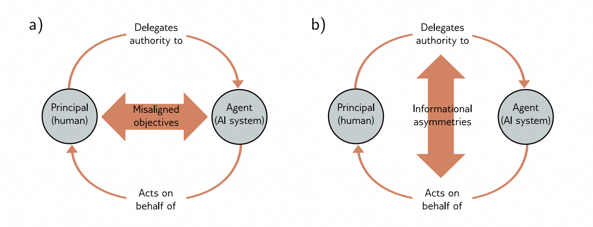
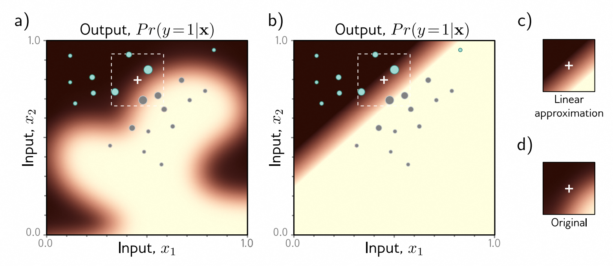

[译]第21章 深度学习与伦理 - Deep learning and ethics《理解深度学习 - Understanding Deep Learning》

本文是基于Simon J.D. Prince 的新书《Understanding Deep Learning》翻译而来；

* 原书介绍、原书（英文）下载、译文进展 以及 译文内容请戳 ↓↓↓
* [ \[译\]《理解深度学习 - Understanding Deep Learning 》 - 目录&前言 - ATA (atatech.org)](https://ata.atatech.org/articles/11020138829)

----

↓↓↓ 以下正文↓↓↓
----

* [第21章 深度学习与伦理 - Deep learning and ethics](#第21章-深度学习与伦理---deep-learning-and-ethics)
  * [21.1 价值对齐 - Value alignment](#211-价值对齐---value-alignment)
    * [21.1.1 偏见和公平性 - Bias and fairness](#2111-偏见和公平性---bias-and-fairness)
    * [21.1.2 人工道德代理 - Artificial moral agency](#2112-人工道德代理---artificial-moral-agency)
    * [21.1.3 透明性和不透明性 - Transparency and opacity](#2113-透明性和不透明性---transparency-and-opacity)
    * [21.1.4 可解释性和可理解性 - Explainability and interpretability](#2114-可解释性和可理解性---explainability-and-interpretability)
  * [21.2 故意滥用 - Intentional misuse](#212-故意滥用---intentional-misuse)
    * [21.2.1 人脸识别和分析 - Face recognition and analysis](#2121-人脸识别和分析---face-recognition-and-analysis)
    * [21.2.2 军事化和政治干预 - Militarization and political interference](#2122-军事化和政治干预---militarization-and-political-interference)
    * [21.2.3 欺诈 - Fraud](#2123-欺诈---fraud)
    * [21.2.4 数据隐私 - Data privacy](#2124-数据隐私---data-privacy)
  * [21.3 其他社会、伦理和专业问题 - Other social, ethical, and professional issues](#213-其他社会伦理和专业问题---other-social-ethical-and-professional-issues)
    * [21.3.1 知识产权 - Intellectual property](#2131-知识产权---intellectual-property)
    * [21.3.2 自动化偏见和道德弱化 - Automation bias and moral deskilling](#2132-自动化偏见和道德弱化---automation-bias-and-moral-deskilling)
    * [21.3.3 环境影响 - Environmental impact](#2133-环境影响---environmental-impact)
    * [21.3.4 就业和社会 - Employment and society](#2134-就业和社会---employment-and-society)
    * [21.3.5 权力集中 - Concentration of power](#2135-权力集中---concentration-of-power)
  * [21.4 案例研究 - Case study](#214-案例研究---case-study)
  * [21.5 科学价值自由理念 - The value-free ideal of science](#215-科学价值自由理念---the-value-free-ideal-of-science)
  * [21.6 负责任的人工智能研究是一个集体行动问题 - Responsible AI research as a collective action problem](#216-负责任的人工智能研究是一个集体行动问题---responsible-ai-research-as-a-collective-action-problem)
    * [21.6.1 科学传播 - Scientific communication](#2161-科学传播---scientific-communication)
    * [21.6.2 多样性和异质性 - Diversity and heterogeneity](#2162-多样性和异质性---diversity-and-heterogeneity)
  * [21.7 未来的方向 Ways forward](#217-未来的方向-ways-forward)
  * [21.8 总结 - Summary](#218-总结---summary)
  * [问题](#问题)

# 第21章 深度学习与伦理 - Deep learning and ethics

> 本章由Travis LaCroix和Simon J.D.Prince撰写。

人工智能正处于可以改变社会的关键时刻，可能带来好处，也可能带来坏处。这些技术在社会福利方面有着巨大的潜力（Taddeo和Floridi，2018年；Tomašev等，2020年），包括在医疗保健（Rajpurkar等，2022年）和应对气候变化（Rolnick等，2023年）方面发挥重要作用。然而，它们也有被滥用和造成意外伤害的潜力。这就出现了*人工智能伦理*领域。

深度学习的现代时代始于2012年的AlexNet，但对人工智能伦理的持续关注并没有立即出现。事实上，关于机器学习公平性的研讨会在2013年的NeurIPS上因为缺乏材料而被拒绝。直到2016年，人工智能伦理才有了它的“AlexNet”时刻，即ProPublica关于COMPAS再犯预测模型偏见的揭露（Angwin等，2016年）和Cathy O'Neil的书籍《数学摧毁之武器》（O'Neil，2016年）。自那时以来，人们对此的兴趣不断增加；自2018年成立以来，提交给"公平性、问责性和透明度"（FAccT）会议的论文数量增加了近十倍。

与此同时，许多组织针对负责任的人工智能提出了政策建议。[Jobin et al.，2019]()发现了84份包含人工智能伦理原则的文件，其中88%是在2016年之后发布的。这种泛滥的非立法政策协议依赖于自愿的、非约束性的合作，对其有效性产生了质疑（[McNamara et al.，2018]()；[Hagendorff，2020]()；[LaCroix & Mohseni，2022]()）。简而言之，人工智能伦理还处于初级阶段，道德考虑往往是被动的而非主动的。

本章探讨了人工智能系统设计和使用中可能产生的潜在危害。其中包括算法偏见、缺乏解释性、数据隐私侵犯、军事化、欺诈和环境问题。我们的目标不是提供如何更加道德的建议，而是在哲学、政治学和广泛的社会科学领域引发思想和讨论的关键领域。

## 21.1 价值对齐 - Value alignment

在机器学习模型中，损失函数是我们真正目标的代理，而两者之间的不一致被称为“外部对齐问题”。如果代理函数不够准确，系统就会找到“漏洞”来最小化损失函数，但却无法达到预期的目标。举个例子，考虑训练一个强化学习代理来下棋。如果代理只被奖励捕获棋子，那可能会导致很多平局，而不是我们期望的行为（赢得比赛）。而内部对齐问题则是要确保人工智能系统的行为不会偏离预期目标，即使损失函数已经很好地指定。如果学习算法无法找到全局最小值，或者训练数据不够具有代表性，那么训练就有可能收敛到与真正目标不一致的解决方案，从而导致不良行为。

Gabriel（2020）将价值对齐问题分为技术和规范两个组成部分。技术组成部分关注的是如何将价值观准确地编码到模型中，以确保模型能够可靠地实现其应有的功能。例如，避免奖励作弊和进行安全的探索等具体问题可能有纯技术的解决方案（Amodei等人，2016年）。相反，规范组成部分关注的是首先确定正确的价值观。考虑到不同文化和社会对事物的重视程度各不相同，可能不存在唯一的答案。重要的是所编码的价值观能够代表每个人，而不仅仅是社会中某些文化主导的群体。

将价值对齐看作是一个结构性问题，它在人类委托者将任务交给人工智能代理人时会出现（LaCroix，2022年）。这类似于经济学中的委托代理问题（Laffont和Martimort，2002年），在任何期望一个方面为另一个方面最大化利益的关系中，都存在着竞争性的激励因素。在人工智能的背景下，利益冲突可能出现在两种情况下：一是目标设定不正确，二是委托者与代理人之间存在信息不对称（图21.1）。

> 图 21.1 值对齐问题的结构描述。
> 问题来源于：
>
> * a）目标不一致（例如，偏见）或
> * b）（人类）委托方和（人工）代理方之间的信息不对称（例如，缺乏可解释性）。改编自[LaCroix, 2023]()。

通过这种结构性观点，我们可以更好地理解AI伦理学中的许多问题。接下来的章节将讨论偏见和公平性，以及人工道德代理（两者都涉及目标的具体化）和透明度和可解释性（两者都与信息不对称相关）。

### 21.1.1 偏见和公平性 - Bias and fairness

从纯科学的角度来看，偏见是指相对某种规范的统计偏差。在AI中，当这种偏差取决于*不合法的*因素，从而影响输出结果时，它可能是有害的。例如，性别与工作表现无关，所以以性别作为招聘候选人的依据是不合法的。同样地，种族与犯罪无关，所以以种族作为累犯预测的特征也是不合法的。

AI模型中存在的偏见可能通过多种方式引入（[Fazelpour＆Danks，2021]()）：

**问题规范：** 选择模型的目标需要对我们认为重要的价值进行判断，这可能会导致偏见的产生（[Fazelpour＆Danks，2021]()）。如果我们未能成功将这些选择具体化，并且问题的规范未能准确捕捉到我们的预期目标，进一步的偏见可能会出现（[Mitchell et al。，2021]()）。

**数据：** 在数据集不具有代表性或不完整的情况下，算法的偏见可能会产生（[Danks＆London，2017]()）。例如，PULSE人脸超分辨率算法（[Menon et al。，2020]()）是在主要由白人名人照片组成的数据库上进行训练的。当应用于一张低分辨率的巴拉克·奥巴马肖像时，它生成了一张白人男性的照片（[Vincent，2020]()）。

即使是完整且具有代表性的数据集，如果生成训练数据的社会对边缘化群体存在结构性偏见，也可能会导致偏见的产生（[Mayson，2018]()）。例如，在美国，黑人个体比白人更容易受到监管和监禁。因此，用于训练再犯预测模型的历史数据已经带有对黑人社区的偏见。

**建模和验证：** 选择一种数学定义来衡量模型的公平性是需要进行价值判断的。存在着不同但同样直观的定义，它们在逻辑上是不一致的。这表明需要从纯数学的公平概念转向对算法是否在实践中促进公正进行更实质性的评估。

**部署：** 已部署的算法可能与社会中的其他算法、结构或机构互动，形成复杂的反馈循环，巩固现有的偏见。例如，像GPT3这样的大型语言模型是基于网络数据进行训练的。然而，当GPT3的输出在线发布时，未来模型的训练数据会下降。这可能加剧偏见并产生新的社会危害。

不公平可能会因**交叉性** 的考虑而加剧；社会类别可以结合在一起，形成重叠和相互依赖的压迫系统。例如，一个有色人种的酷儿女性所经历的歧视不仅仅是作为酷儿、性别或种族的歧视之和。在人工智能领域，研究表明，主要在较浅肤色的脸上训练的人脸分析算法在较深肤色的脸上表现不佳。然而，它们在考虑皮肤颜色和性别等特征组合时的表现甚至比单独考虑这些特征时更差。

当然，我们可以采取措施确保数据的多样性、代表性和完整性。但是，如果生成训练数据的社会结构对边缘化社群存在偏见，即使是完全准确的数据集也会产生偏见。鉴于可能存在算法偏见以及训练数据集中的代表性不足，我们还需要考虑这些系统输出的失败率如何可能加剧对已经处于边缘化社群的歧视。由此产生的模型可能会将权力和压迫的体系固化和巩固，包括资本主义和阶级主义；性别歧视、厌女和父权制；殖民主义和帝国主义；种族主义和白人至上主义；残障歧视；以及异性恋和二元规范性。对于偏见的观点要保持对权力动态的敏感性，需要考虑数据中编码的历史不公平和劳动条件。

为了避免这种情况，我们必须积极确保我们的算法是公平的。一种天真的方法是通过无视公平性来实现，即从输入特征中删除“受保护属性”（例如种族、性别）。不幸的是，这种方法是无效的，剩下的特征仍然可能带有关于受保护属性的信息。更实际的方法首先为公平性定义了一个数学标准。例如，在二元分类中，使用“分离”度量需要预测结果 $ \hat y $ 在给定真实标签 $ y $ 的条件下与受保护变量 $ a $（如种族）是条件独立的。然后，它们以各种方式进行干预，以最小化与这个度量标准的偏差（图 [21.2]() ）。

|数据收集|预处理|训练|后处理|
|----|----|----|----|
|<li/>识别缺少的样本或变量并收集数据|<li/>修改标签 <li/>修改输入数据 <li/>修改输入/输出对|<li/>对抗训练 <li/>为公平性进行规范化 <li/>限制为公平|<li/>改变阈值 <li/>权衡准确性|
> 图 21.2 偏见缓解。已经提出了各种方法来弥补训练过程中的偏见，从数据收集到已经训练好的模型的后处理。详见 [Barocas et al.，2023]() 和 [Mehrabi et al.，2022]()。

另一个复杂因素是，除非我们能确定社区成员身份，否则我们无法判断算法是否对某个社区存在不公平，并采取相应措施来解决。目前对算法偏见和公平性的大部分研究都集中在训练数据中可能存在的*可观察*特征上（例如性别）。然而，边缘化社区的特征往往是*不可观察的*，这使得偏见的减少变得更加困难。例如，性取向（[Tomasev等，2021]()）、残疾状况、神经类型、阶级和宗教。而当训练数据中的可观察特征被移除以防止模型利用它们时，也会出现类似的问题。

### 21.1.2 人工道德代理 - Artificial moral agency

在许多决策空间中，所做的行动并不涉及道义问题。例如，在下一步棋的选择中并没有明显的道德后果。然而，在其他领域，行动可能具有道义重量。例如，自动驾驶车辆的决策制定（[Awad等，2018]()；[Evans等，2020]()）、致命自主武器系统（[Arkin，2008a，b]()）以及用于儿童保育、老年护理和医疗保健的专业服务机器人（[An-derson＆Anderson，2008]()；[Sharkey＆Sharkey，2012]()）。随着这些系统的自主性越来越高，它们可能需要独立于人类的输入做出道德决策。

这引出了"人工道德智能"的概念。人工道德智能是指能够作出道德判断的自主人工智能系统。道德代理可以根据复杂程度进行分类（[Moor, 2006]()）：

1. **伦理影响代理** 是指其行为对道德产生影响的代理。因此，几乎任何部署在社会中的技术都可能被视为伦理影响代理。

2. **隐式伦理代理** 是指具有一些内置安全特性的伦理影响代理。

3. **显式伦理代理** 可以根据一般的道德原则或道德行为规则来进行情境性的遵循。

4. **完全伦理代理** 是指具有信念、欲望、意图、自由意志和对自己行为的意识的代理。

机器伦理学领域致力于寻找创建人工道德代理的方法。这些方法可以分为"自上而下"、"自下而上"或"混合"（[Allen et al., 2005]()）三类。自上而下（理论驱动）的方法直接根据某些道德理论实现并层级排列具体规则，以引导道德行为。阿西莫夫的"机器人三大定律"就是这种方法的一个简单例子。

在自下而上（学习驱动）的方法中，模型通过从数据中学习道德规律来进行操作，而无需进行明确的编程（[Wallach et al.，2008]）。

例如，[Noothigattu等，2018]设计了一个基于投票的系统，用于道德决策，该系统利用从人类在道德困境中收集到的偏好数据来学习社会偏好；然后，该系统对结果进行总结和汇总，以作出“道德”决策。混合方法结合了自上而下和自下而上的方法。

一些研究人员对人工道德代理的概念提出了质疑，并认为确保安全并不需要道德代理（[van Wynsberghe＆Robbins，2019]）。最近关于人工道德代理的调查请参见[Cervantes等，2019]，关于技术方法的人工道德代理的最新调查请参见[Tolmeijer等，2020]。

### 21.1.3 透明性和不透明性 - Transparency and opacity

如果一个复杂的计算系统的所有细节都是已知的，那么该系统就是“透明”的。如果人类可以理解系统如何做出决策，那么该系统就是“可解释的”。在缺乏透明性或可解释性的情况下，用户和AI系统之间存在信息不对称，这会导致难以确保价值的一致性。

[Creel , 2020]() 将透明度划分为几个不同的层次。*功能透明度*指的是对系统算法功能的了解（即将输入转化为输出的逻辑规则）。本书中的方法都在这个层次上进行了详细描述。*结构透明度*意味着了解程序执行算法的方式。当使用高级编程语言编写的命令被转化为机器码执行时，这一过程可能会变得模糊不清。最后，*运行透明度*要求了解程序在特定实例中的执行情况。对于深度网络来说，这包括对硬件、输入数据、训练数据以及它们之间的相互影响的了解。这些信息都无法通过仔细检查代码来获得。

例如，GPT3在功能上是透明的；其架构在[Brownet al. , 2020]()中有详细描述。然而，它在结构上并不透明，因为我们无法获取其代码；它在运行上也不透明，因为我们无法获取学习到的参数、硬件或训练数据。而后续版本的GPT4则完全不透明。这个商业产品的工作细节是未知的。

### 21.1.4 可解释性和可理解性 - Explainability and interpretability

尽管系统是透明的，也不意味着我们能够理解决策的制定过程以及所依据的信息。深度网络可能包含数十亿个参数，仅凭检查是无法理解其工作原理的。然而，在某些司法管辖区中，公众可能有权要求解释决策的依据。欧盟《通用数据保护条例》第22条建议，在决策完全基于自动化过程的情况下，所有数据主体都应该有权“获取决策的解释”。^[1]^

> ^[1]^ 关于《通用数据保护条例》是否实际上要求此类权利存在，存在争议（参见[Wachter et al. , 2017]()）。

由于这些困难，解释性人工智能这一子领域应运而生。其中一个相对成功的领域是提供局部解释。虽然我们无法解释整个系统，但有时我们可以描述特定输入是如何被分类的。例如，*局部可解释的模型无关解释*（LIME）[Ribeiro et al. , 2016]()会在附近的输入上对模型输出进行采样，并利用这些样本构建一个更为简单的模型（图[21.3]()）。这为我们提供了对分类决策的洞察，即使原始模型既不透明也无法解释。

> 图 21.3 LIME。深度网络的输出函数非常复杂；在高维空间中，很难知道为什么做出某个决策，或者如何修改输入以改变决策，除非能够访问模型。
>
> * a）考虑试图理解为什么白色十字处的 $ Pr (y = 1|\mathbf x) $ 很低。LIME在附近的点上测试网络，看它是否将这些点视为 $ Pr (y = 1|\mathbf x) < 0.5 $（青色点）或 $ Pr (y = 1|\mathbf x) ≥ 0.5 $（灰色点）。它根据与兴趣点的距离对这些点进行加权（权重由圆圈的大小表示）。
> * b）使用加权的点来训练一个更简单的模型（在这里是逻辑回归 - 一个通过sigmoid函数的线性函数）。
> * c）在白色十字附近，这个近似值接近于：
> * d）原始函数。即使我们无法访问原始模型，但是我们可以从这个近似模型的参数推断出，如果增加 $ x_{1} $ 或减少 $ x_{2} $，$ Pr (y = 1|\mathbf x) $ 将增加，输出类别将发生变化。改编自[Prince, 2022]()。

目前尚不清楚是否能够构建出用户甚至创建者完全可理解的复杂决策系统。关于系统的可解释性、可理解性或可解释性的含义，目前还存在争议([Erasmus et al. ,  2021])，对这些概念尚无明确的定义。更多信息请参见[Molnar ,  2022]。

## 21.2 故意滥用 - Intentional misuse

前一节中的问题源于目标规范不明确和信息不对称。然而，即使一个系统正常运行，它可能导致不道德行为或者被故意滥用。本节重点阐述了一些由于人工智能系统滥用而引起的具体道德问题。

### 21.2.1 人脸识别和分析 - Face recognition and analysis

人脸识别技术存在着特别高的滥用风险。威权主义国家可以利用这些技术来识别和压制抗议者，从而危及自由言论和抗议权利的民主理念。[Smith & Miller, 2022]认为，自由民主的价值观（如安全、隐私、自主权和问责制）与这些技术的潜在应用场景（如边境安全，刑事调查和执法，国家安全以及个人数据的商业化）之间存在不匹配。因此，一些研究人员、活动家和政策制定者对这项技术是否应存在提出了质疑([Barrett, 2020])。

此外，这些技术经常不能如它们所声称的那样工作（Raji等人，2022）。例如，尽管某个概念验证试验报告显示在可接受的参数范围内人脸识别的成功率为零，纽约大都会交通管理局仍然继续推进并扩大了它的人脸识别使用（Berger，2019）。同样，人脸分析工具经常夸大其能力（Raji和Fried，2020），怀疑地声称能够推测个体的性取向（Leuner，2019）、情绪（Stark和Hoey，2021）、就业能力（Fetscherin等人，2020）或犯罪倾向（Wu和Zhang，2016）。Stark和Hutson（2022）强调计算机视觉系统已经使相貌学和头脑学等“毫无科学依据、种族主义和不信任的伪科学领域”重新兴起。

### 21.2.2 军事化和政治干预 - Militarization and political interference

政府有着出于国家安全和国家建设的名义资助人工智能研究的利益。这可能导致国家之间的军备竞赛，带来“高额的投资、缺乏透明度、相互的怀疑和恐惧，以及对首次部署的意图的感知”（Sisson等人，2020）。

致命的自主武器系统因为容易想象而受到了广泛关注，实际上许多这样的系统正在开发中（[Heikkilä，2022]()）。然而，人工智能还促进了网络攻击和虚假信息宣传（即通过不准确或误导性信息共享来欺骗）。人工智能系统可以创建高度逼真的虚假内容，并且通常以大规模、针对特定受众的方式传播（[Akers等，2018]()）（[Bontridder＆Poullet，2021]()）。

[Kosinski等，2013]() 提出，敏感变量，如性取向、种族、宗教和政治观点、人格特质、智力、幸福感、对成瘾物质的使用、父母分居、年龄和性别，仅通过社交媒体上的“赞”就能预测得出。利用这些信息，可以用于操纵目的，例如改变投票行为。

### 21.2.3 欺诈 - Fraud

不幸的是，人工智能是自动化欺诈活动的有用工具，例如发送大量电子邮件或短信来欺骗人们透露敏感信息或发送资金。生成式人工智能可以欺骗人们认为他们正在与合法实体互动，或生成欺骗或误导人的假文件。此外，人工智能还可以增加网络攻击的复杂性，例如生成更具说服力的钓鱼邮件或适应目标组织的防御。

这凸显了对机器学习系统透明性的呼吁存在的负面影响：这些系统越是开放和透明，就越容易受到安全风险的威胁或者被恶意行为利用。例如，生成式语言模型（如ChatGPT）已被用于编写可能被用于间谍活动、勒索软件和其他恶意软件的软件和电子邮件。

将计算机行为拟人化的倾向，特别是将意义投射到符号串上，被称为“ELIZA效应”。这在与复杂的聊天机器人互动时会产生一种虚假的安全感，使人们更容易受到基于文本的欺诈，如浪漫骗局或商业电子邮件篡改计划的影响。[Véliz，2023]强调了一些聊天机器人中使用表情符号的本质上是操纵性的，利用了对情感图像的本能反应。

### 21.2.4 数据隐私 - Data privacy

现代深度学习方法依赖于庞大的众包数据集，其中可能包含敏感或个人信息。即使删除了敏感信息，辅助知识和冗余编码也可以用于重新识别数据集的匿名性。事实上，这在1997年发生在马萨诸塞州州长William Weld身上。在一个保险集团发布了已经剥离了明显个人信息（如患者姓名和地址）的健康记录后，一名有抱负的研究生通过与公开的选民名册交叉参照，成功“重新识别”出属于William Weld州长的记录。

因此，在将深度学习技术应用于医疗保健和金融等高风险领域时，隐私优先的设计对于确保个人信息的安全非常重要。可以使用差分隐私和语义安全（同态加密或安全多方计算）方法来确保模型训练过程中的数据安全（参见[Mireshghallah et al.，2020]；[Boulemtafes et al.，2020]）。

## 21.3 其他社会、伦理和专业问题 - Other social, ethical, and professional issues

上一节已经指出了人工智能可能被有意滥用的领域。本节将介绍人工智能广泛应用可能产生的其他潜在副作用。

### 21.3.1 知识产权 - Intellectual property

知识产权（IP）可以被定义为非实体财产，是原创思维的产物（[Moore & Himma，2022]）。实际上，许多人工智能模型都是在受版权保护的材料上进行训练的。因此，这些模型的部署可能带来法律和伦理风险，并触犯知识产权（[Henderson et al.，2023]）。

有时候，这些问题是明确的。当语言模型接收到受版权保护的材料片段时，它们的输出可能会直接包含受版权保护的文字，类似的问题也适用于扩散模型在图像生成方面（[Hendersonet al. ,  2023]() ; [Carlini et al. ,  2022 ,  2023]() ）。即使培训行为符合“合理使用”的标准，但在某些情况下，这可能会侵犯内容创作者的道德权益（[Weidinger et al. ,  2022]() ）。更微妙的是，生成模型（第[12, 14-18]() 章）提出了关于人工智能和知识产权的新问题。机器学习模型的输出（如艺术、音乐、代码、文本）是否可以受到版权或专利的保护？在道德上是否可以接受或合法地对模型进行微调，以重现某个艺术家的风格？知识产权法是一个突出显示出现有立法并未考虑到机器学习模型的领域。尽管政府和法院可能在不久的将来设立先例，但这些问题在撰写本文时仍未确定。

### 21.3.2 自动化偏见和道德弱化 - Automation bias and moral deskilling

随着社会对人工智能系统的依赖程度越来越高，自动化偏见的风险也在增加（即认为模型的输出是正确的，因为它们是“客观的”）。这使得人们普遍认为量化方法比定性方法更好。然而，正如我们将在[21.5节](#the-value-free-ideal-of-science)中看到的那样，所谓的客观努力很少是毫无价值的。

劳动社会学中的"技能消解"概念指的是在自动化的背景下技能的冗余和贬值([Braverman, 1974]())。例如，将记忆等认知技能依赖于技术可能会导致我们记忆能力的下降。类似地，人工智能在涉及道德决策的自动化中的应用可能会导致我们的道德能力下降([Vallor, 2015]())。例如，在战争背景下，武器系统的自动化可能会对战争受害者产生非人性化的影响([Asaro, 2012]；[Heyns, 2017])。同样，在老年人、儿童或医疗保健环境中使用护理机器人可能会减少我们相互关心的能力([Vallor, 2011])。

### 21.3.3 环境影响 - Environmental impact

训练深度网络需要大量的计算能力，因此消耗了大量的能源。[Strubell等人]()（[2019, 2020]()）估计，训练一个拥有2.13亿个参数的Transformer模型会排放约284吨的$ CO_{2} $。^[2]^ [Luccioni等人，2022]()也对训练BLOOM语言模型产生的排放做出了类似的估计。不幸的是，封闭的专有模型越来越普遍，我们对它们的环境影响一无所知（[Luccioni，2023]()）。

> ^[2]^ 作为一个基准，平均每个人每年负责大约5吨的$ CO_{2} $排放，而来自主要石油生产国的个人负责的排放量是这个数量的三倍。详见[https://ourworldindata.org/co2-emissions](https://ourworldindata.org/co2-emissions)。

### 21.3.4 就业和社会 - Employment and society

技术创新的历史就是工作被取代的历史。2018年，麦肯锡全球研究所估计到2030年，人工智能可能使经济产出增加约13万亿美元，主要是通过自动化替代劳动力实现的（[Bughin等人，2018]()）。麦肯锡全球研究所的另一项研究表明，在2016年至2030年间，全球劳动力中高达30%的人（10亿至8亿人）可能因为人工智能而失去工作（[Manyika等人，2017]()；[Manyika和Sneader，2018]()）。

然而，预测本身就是困难的，虽然AI的自动化可能导致短期内的失业，但“技术失业”的概念被描述为“暂时的不适应阶段”（[Keynes，2010]()）。这是因为财富的增长可以通过创造对产品和服务的需求来抵消生产力的增长。此外，新技术还可以创造新的就业岗位。

即使自动化在长期内不会导致总体就业的净损失，但在短期内可能仍需要新的社会计划。因此，无论对于人工智能引发失业的可能性持乐观态度（[Brynjolfsson & McAfee，2016]()；[Danaher，2019]()），中立态度（[Metcalf等，2016]()；[Calo，2018]()；[Frey，2019]()）还是悲观态度（[Frey & Osborne，2017]()），都清楚地表明社会将发生重大变化。

### 21.3.5 权力集中 - Concentration of power

随着深度网络规模的增加，训练这些模型所需的数据和计算能力也相应增加。在这方面，小公司和创业公司可能无法与大型、成熟的科技公司竞争。这可能导致权力和财富逐渐集中在少数几家公司手中，形成一个恶性循环。最近的一项研究发现，大型科技公司和“精英”大学在重要的人工智能会议上发表的论文数量与中低级别大学之间存在越来越大的差距（ [Ahmed & Wahed , 2016]() ）。在许多观点中，这种财富和权力的集中与社会的公正分配是不相符的（ [Rawls , 1971]() ）。

这引发了呼吁通过使每个人都能够创建这样的系统来实现人工智能的民主化（ [Li , 2018]() ； [Knight, 2018]() ； [Kratsios , 2019]() ； [Riedl , 2020]() ）。这个过程需要通过开源和开放科学，使深度学习技术更加广泛地可用和易于使用，以便更多人从中受益。这降低了进入门槛，增加了对人工智能的获取，同时降低了成本，确保了模型的准确性，并增加了参与度和包容性（ [Ahmed et al. , 2020]() ）。

## 21.4 案例研究 - Case study

现在我们来讲述一个案例研究，涉及到本章讨论的许多问题。2018年，媒体报道了一个备受争议的面部分析模型，被戏称为"gaydar AI"（[Wang & Kosinski，2018年]），标题充满了轰动效应，比如*AI可以判断你是否是同性恋*：通过一张照片惊人准确地预测性取向（[Ahmed，2017年]）；一种可怕的AI可以以91%的准确率判断一个人是否是同性恋（[Matsakis，2017年]）；以及*人工智能系统可以判断你是否是同性恋*（[Fernandez，2017年]）。

这项工作存在一些问题。首先，训练数据集极度偏颇且不具代表性，主要由高加索人的图像组成。其次，考虑到性别和性取向的多变性，模型的建模和验证也具有问题。第三，这个模型最明显的应用是针对在同性恋被定罪的国家迫害LGBTQ+个体。第四，就透明度、可解释性以及价值认同而言，这个"gaydar"模型似乎是通过造型、表达和生活方式中的模式来捕捉虚假相关性，而不是作者声称的面部结构（[Agüera yArcas等，2018年]）。第五，就数据隐私而言，在从约会网站上"公开"的照片和性取向标签中收集数据的伦理问题引发了一些疑问。最后，就科学传播而言，研究人员以一种肯定会吸引眼球的方式传达了他们的研究结果：甚至论文的标题都夸大了模型的能力：*深度神经网络可以从面部判断性取向*（它们实际上不能）。

显而易见，一个用于确定性取向的面部分析模型对LGBTQ+社群毫无益处。如果它要造福社会，最重要的问题是一个特定的研究、实验、模型、应用或技术是否符合相关社群的利益。

## 21.5 科学价值自由理念 - The value-free ideal of science

这一章列举了一些人工智能系统目标与人类价值观无意识地或者通过误用而发生偏离的方式。我们在这里争论科学家并不是中立的行动者；他们的价值观不可避免地影响他们的工作。

或许这让人感到惊讶。人们普遍相信科学是客观的，或者应该是客观的。这被科学价值自由理念所规定。许多人会认为机器学习是客观的，因为算法只是数学。然而，与算法偏见类似，有四个阶段会使人工智能从业者的价值观影响他们的工作：

1. 选择研究问题。

2. 收集与研究问题相关的证据。

3. 将科学假设作为问题的答案接受。

4. 应用科学研究的结果。

可以说，在这四个阶段中，价值观在第一阶段和最后一阶段发挥了重要作用是毫无争议的。研究问题的最初选择和随后的应用选择受科学家、机构和资助机构的兴趣影响。然而，科学的价值自由理念规定在其中介的科学过程中最小化道德、个人、社会、政治和文化价值的影响。这个想法基于价值中立论，它认为科学家可以在第二阶段和第三阶段中注意到这些价值判断而不做出这些价值判断。

然而，无论是有意为之还是无意之间，价值观都已渗透到机器学习研究中。其中大部分价值观可被归为*认识论*（例如性能、泛化、在先前工作基础上构建、效率、新颖性）。然而，决定这些价值观的集合本身就是一个充满价值取向的决策；很少有论文明确讨论社会需求，甚至更少的论文讨论潜在的负面影响（[Birhane et al. , 2022b]()）。科学哲学家们对于科学价值观是否可以实现或者是否可取提出了质疑。例如，[Longino]()（[1990 , 1996]()）认为这些认识论价值观并非*纯粹的*认识论。而[Kitcher]()（[2011a, b]）则认为科学家们通常并不关心*真理*本身，相反，他们追求与其目标和兴趣相关的真理。

机器学习依赖归纳推理，因此容易受到归纳风险的影响。模型仅在训练数据点上受到约束，并且由于维度灾难，这只占据了输入空间的很小一部分；无论我们用多少数据来训练模型，输出总可能是错误的。因此，选择接受或拒绝模型的预测需要进行价值判断：即若我们在接受时犯错所带来的风险较低，则选择接受；若我们在拒绝时犯错所带来的风险较低，则选择拒绝。

因此，使用归纳推理意味着机器学习模型具有深刻的价值取向(Johnson, 2022)。事实上，如果它们没有这种价值取向，它们将毫无用处：正是因为它们具有价值取向，它们才有用。因此，接受算法在现实世界中用于排名、排序、过滤、推荐、分类、标记、预测等方面，就意味着这些过程将产生实际的影响。随着机器学习系统的商业化和应用越来越广泛，它们越来越深入地影响着我们关心的事物。

这些观点对于那些认为算法在某种程度上比人类决策者更客观（因此应该在我们认为客观性很重要的领域取代人类决策者）的研究人员具有重要意义。

## 21.6 负责任的人工智能研究是一个集体行动问题 - Responsible AI research as a collective action problem

推卸责任很容易。阅读本章的学生和专业人员可能会认为他们的工作与现实世界相距甚远，或者只是一个更大机器的一个小部分，他们的行动不会产生影响。然而，这是一个错误。研究人员经常可以选择他们投入时间的项目、他们工作的公司或机构、他们追求的知识、他们交往的社交和知识圈子，以及他们沟通的方式。

无论涉及什么内容，做正确的事情通常会遇到社会困境；最好的结果取决于合作，尽管对于个人而言，合作并不一定符合个人利益：负责任的人工智能研究是一个集体行动问题。

### 21.6.1 科学传播 - Scientific communication

一个积极的步骤是负责任地进行沟通。在许多社交网络中，错误信息比真相传播得更快、更持久（[LaCroix等，2021](); [Ceylan等，2023]()）。因此，重要的是不夸大机器学习系统的能力（参见上面的案例研究），避免误导性的拟人化。还要注意机器学习技术被错误应用的可能性。例如，类似相面术和颅相学的伪科学实践在人工智能领域出现了意想不到的复兴（[Stark＆Hutson, 2022]()）。

### 21.6.2 多样性和异质性 - Diversity and heterogeneity

第二个积极的步骤是鼓励多样性。当社会群体是同质的（主要由相似成员组成）或同质化的（由倾向于与相似他人交往的成员组成）时，主导群体往往会重复和稳定其惯例（[O'Connor＆Bruner，2019]()）。减轻压迫系统的一种方式是确保考虑到多样的观点。这可以通过机构层面的公平、多样性、包容性和可访问性倡议，研究层面的参与性和基于社区的方法，以及个体层面对社会、政治和道德问题的增强认识来实现。

*立场认识论*理论（[Harding, 1986]()）认为，知识是社会定位的（即依赖于一个人在社会中的社会地位）。技术圈的同质性可能导致有偏见的技术（[Noble, 2018](); [Eubanks, 2018](); [Benjamin, 2019](); [Broussard, 2023]()）。缺乏多样性意味着创造这些技术的个体的观点会渗入数据集、算法和代码中，成为默认的视角。[Broussard, 2023]()认为，因为很多技术是由健全的、白人、异性恋、美国男性开发的，所以这些技术被优化为适合健全的、白人、异性恋、美国男性，他们的观点被视为现状。确保技术造福历史上被边缘化的社群需要研究人员了解这些社群的需求、愿望和观点（[Birhane等，2022a]()）。*设计公正*和参与性和基于社区的人工智能研究方法认为，受技术影响的社群应该积极参与其设计（[Constanza-Chock, 2020]()）。

## 21.7 未来的方向 Ways forward

不可否认，人工智能将对社会产生彻底的改变，无论是积极的还是消极的。然而，对于由人工智能推动的未来乌托邦社会的乐观愿景，应该持谨慎态度，进行健康的反思。人工智能所宣传的许多好处只在特定情境下，对特定社会群体有益。例如，[Green, 2019]()指出，使用人工智能增强警察问责制度和替代监禁的项目，以及使用人工智能通过预测性警务增加安全性的项目，都被宣传为“以人工智能造福社会”。给这个标签贴上价值判断是没有根据的；一个社区的利益可能对另一个社区来说是伤害。

在考虑新兴技术对社会的益处时，有必要思考这些益处是否能够公平地分配。通常认为，技术最先进的解决方案就是最好的，这就是所谓的“技术至上主义”([Broussard, 2018]())。然而，许多社会问题源于根本的社会问题，并不需要技术解决方案。

本章涉及到了一些共同的主题，我们希望向读者强调四个关键点：

1. 机器学习研究无法回避伦理问题。以往，研究人员可以在受控的实验室环境中专注于他们工作的基础方面。然而，由于商业化人工智能的巨大经济激励以及学术工作受到工业界资助的程度，即使是理论研究也可能对社会产生影响，因此研究人员必须关注他们工作的社会和伦理层面。

2. 即使是纯粹的技术决策也可能带有价值导向。有一种普遍看法认为人工智能基本上只是数学，因此是“客观的”，伦理是无关紧要的。但是，当我们考虑到人工智能系统的创建和部署时，这种假设是不正确的。

3. 我们应该对人工智能工作所处的结构进行质疑。许多关于人工智能伦理的研究着重于具体情境，而不是质疑人工智能将被部署的更大社会结构。例如，确保算法公平性引起了很大兴趣，但在现有的社会和政治结构中，可能无法完全体现公平、正义或公正的概念。因此，技术本质上是政治性的。

4. 社会和伦理问题不一定需要技术解决方案。许多围绕人工智能技术的潜在伦理问题主要是社会和结构性的，因此仅靠技术创新无法解决这些问题；如果科学家们想要通过新技术实现积极变革，他们必须采取政治和道德立场。

这对于一般的科学家来说意味着什么？也许有以下重要事项：有必要反思自己工作的道德和社会层面。这可能需要积极与那些可能受到新技术影响最大的社群进行互动，以培养研究者和社群之间的关系，并赋予这些社群权力。同样，这可能还涉及到拓展自己学科范畴之外的文献。对于哲学问题，*斯坦福哲学百科全书*是一个非常有价值的资源。跨学科会议在这方面也非常有用。在公平、问责和透明度会议（FAccT）和人工智能与社会会议（AIES）上都发表了领先的研究成果。

## 21.8 总结 - Summary

本章考虑了深度学习和人工智能的伦理影响。价值对齐问题是确保人工智能系统目标与人类目标一致的任务。通过这个视角，我们可以看待偏见、可解释性、人工道德代理和其他相关主题。人工智能可能会被有意滥用，本章详细介绍了一些可能发生的方式。人工智能的进展还对知识产权法和气候变化等领域产生了进一步的影响。

伦理人工智能是一个集体行动问题，本章最后呼吁科学家考虑他们工作的道德和伦理影响。并不是每个个体计算机科学家都能控制每个伦理问题。然而，这并不意味着研究人员没有责任考虑他们所创建的系统被滥用的可能性，并在可能的情况下加以缓解。

## 问题

**问题 21.1**  提出了一个观点，即AI的价值对齐问题最常见的定义是“确保AI系统的价值与人类的价值相一致的问题”。讨论这个问题陈述的不明确之处。*讨论资源*: [LaCroix ,  2023]() 。

**问题 21.2**  Goodhart定律指出，“当一个衡量指标成为目标时，它就不再是一个好的衡量指标。”考虑到损失函数只是我们真正目标的一个代理，思考一下如何重新制定这个定律，以适用于人工智能的价值对齐。

**Problem 21.3**  假设一所大学利用过去学生的数据构建模型，用于预测“学生成功”，以支持政策和实践的明智变革。请思考偏见如何影响该模型的开发和部署的四个阶段。

**Problem 21.4**  我们可以将功能透明度、结构透明度和运行透明度看作是相互独立的。请举一个例子，说明某种透明度的提高可能不会导致另一种透明度的相应提高。

**Problem 21.5**  如果一位计算机科学家撰写了一篇关于人工智能的研究论文或向公共代码库提交了代码，您认为他们是否应该对其工作未来的滥用负责？

**Problem 21.6**  您认为人工智能的军事化在多大程度上是不可避免的？

**Problem 21.7**  鉴于第 [21.2](#intentional-misuse) 节中强调的人工智能可能被滥用的情况，对深度学习研究的开源文化进行正反两方面的论述。

**问题21.8**  有人认为个人数据对于拥有者来说是一种权力的来源。探讨个人数据对于应用深度学习的公司的价值，并思考个人隐私损失是集体经历还是个体经历的论点。

**问题21.9**  生成式人工智能对创意产业有哪些影响？你认为知识产权法应该如何修改以适应这一新发展？

**问题21.10**  一个良好的预测必须（i）具体到足以判断其错误的时机，（ii）考虑可能存在的认知偏见，以及（iii）允许理性地更新信念。思考一下最近媒体上关于未来人工智能的任何主张，并讨论它是否满足这些标准。讨论资源：[Tetlock & Gardner, 2016]()。

**问题21.11**  一些批评人士认为，呼吁民主化人工智能过于侧重于"参与性"方面，这可能增加集体感知、推理和行动中的错误风险，导致不良的道德结果。思考以下每个问题：应该民主化哪些人工智能的方面？为什么应该民主化人工智能？如何民主化人工智能？

**问题21.12**  2023年3月，未来生命研究所发表了一封名为"暂停巨型人工智能实验"的公开信，呼吁所有人工智能实验室立即暂停训练比GPT-4更强大的人工智能系统至少六个月。讨论作者撰写此信的动机、公众反应以及这样的暂停对于人工智能伦理问题的影响。将这一事件与将人工智能伦理问题视为集体行动问题的观点联系起来。讨论资源：[Gebru et al., 2023]()。

**问题 21.13**  讨论[21.7]()节中四个观点的优势。你是否同意这些观点？
