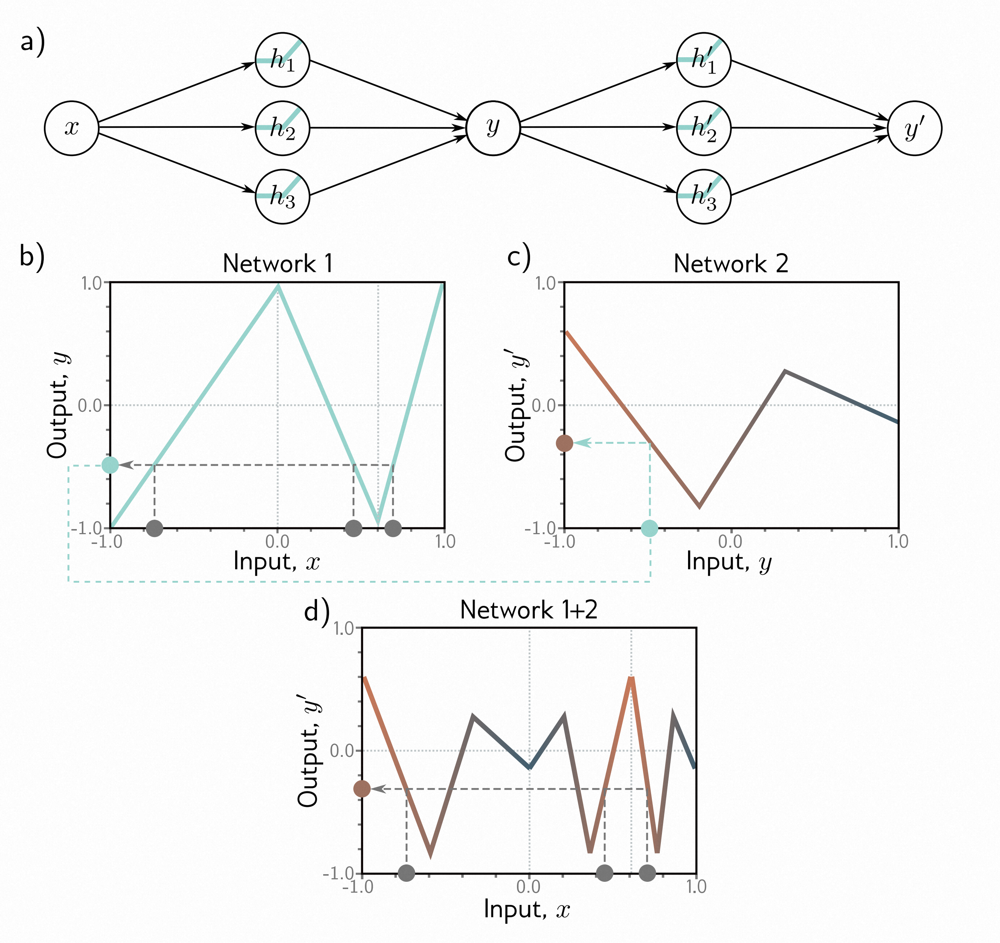

## 第4章 深度神经网 - deep-neural-networks

上一章介绍了浅层神经网络，它们只有一个隐藏层。本章介绍深度神经网络，它们有多个隐藏层。使用ReLU激活函数，浅层和深层网络都可以描述从输入到输出的分段线性映射。

随着隐藏单元数量的增加，浅层神经网络的描述能力也会提高。事实上，通过足够多的隐藏单元，浅层网络可以在高维空间中描述任意复杂的函数。然而，对于某些函数来说，所需的隐藏单元数量是不可想象的多。相比之下，深层网络在给定参数数量的情况下可以产生比浅层网络更多的线性区域。因此，从实际角度来看，它们可以用来描述更广泛的函数集合。

## 4.1 组合神经网络 -  Composing neural networks

为了深入了解深度神经网络的行为，我们首先考虑将两个浅层网络组合起来，使第一个网络的输出成为第二个网络的输入。考虑两个具有三个隐藏单元的浅层网络（图[4.1a](#_bookmark115) ）。第一个网络接受输入$x$并返回输出$y$，定义如下：
$$
h_{1} = a[θ_{10} + θ_{11}x]\\
h_{2} = a[θ_{20} + θ_{21}x]\\
h_{3} = a[θ_{30} + θ_{31}x] \tag{4.1}
$$
和
$$
y = ϕ_{0} + ϕ_{1}h_{1} + ϕ_{2}h_{2} + ϕ_{3}h_{3}\tag{4.2}
$$

第二个网络以$y$作为输入并返回$y^′$，定义如下：
$$
 h_{1}^′ = a[θ_{10}^′ + θ_{11}^′y]\\
 h_{2}^′ = a[θ_{20}^′ + θ_{21}^′y]\\
 h_{3}^′ = a[θ_{30}^′ + θ_{31}^′y] \tag{4.3}
 $$

 和

$$
 y^′ = ϕ_{0}^′+ϕ_{1}^′h_{1}^′+ϕ_{2}^′h_{2}^′+ϕ_{3}^′h_{3}^′\tag{4.4}
$$

> 图4.1 两个具有三个隐藏单元的单层网络的组合。
>
> * a)  第一个网络的输出$y$成为第二个网络的输入。
> * b)  第一个网络使用由三个线性区域组成的函数将输入$x∈[-1, 1]$映射到输出$y∈[-1, 1]$，这些线性区域的斜率交替变化。现在，多个输入 $x$（灰色圆圈）映射到相同的输出 $y$（青色圆圈）。
> * c)  第二个网络定义了一个由三个线性区域组成的函数，它将$y$作为输入并返回$y^′$（即，青色圆圈映射到棕色圆圈）。
> * d)  当这两个函数组合在一起时，它们的组合效果是：（i）第一个网络将三个不同的输入$x$映射到任意给定的$y$值，（ii）这些输入在第二个网络中以相同的方式处理；结果是，面板（c）中第二个网络定义的函数被复制三次，根据面板（b）中区域的斜率进行翻转和缩放。

使用ReLU激活函数，这个模型也描述了一族分段线性函数集合。然而，线性区域的数量可能比具有六个隐藏单元的浅层网络更多。为了看清楚这一点，考虑选择第一个网络产生三个交替斜率的区域（图[4.1b](#_bookmark115) ）。这意味着三个不同的$x$范围被映射到相同的输出范围$y∈[-1, 1]$，并且从这个$y$范围到$y^′$的后续映射被应用了三次。总体效果是，第二个网络定义的函数被复制三次，创建了九个线性区域。同样的原理也适用于更高维度的情况（图[4.2](#_bookmark120) ）。

组合网络的另一种思考方式是，第一个网络将输入空间$x$“折叠”到自身，以便多个输入生成相同的输出。然后，第二个网络在所有被折叠在一起的点上应用一个被复制的函数（图[4.3](#_bookmark121) ）。

## 4.2 从组合网络到深度网络 -  From composing networks to deep networks

前一节展示了我们可以通过将一个浅层神经网络的输出传递到第二个网络中来创建复杂的函数。现在我们将展示这是一个具有两个隐藏层的深度网络的特例。

第一个网络的输出($ y = ϕ_{0} + ϕ_{1}h_{1} + ϕ_{2}h_{2} + ϕ_{3}h_{3} $) 是隐藏单元激活的线性组合。第二个网络的第一步操作（方程[4.3](#_bookmark116) 中计算 $ θ_{10}^′ + θ_{11}^′y $, $θ_{20}^′ + θ_{21}^′y $ , 和 $ θ_{30}^′ + θ_{31}^′y $ ）是对第一个网络输出的线性操作。将一个线性函数应用于另一个线性函数会得到另一个线性函数。将 $ y $ 的表达式代入方程[4.3](#_bookmark116) 得到：

$$
h_{1}′ = a[θ_{10}^′ + θ_{11}^′y] = a[θ_{10}^′ + θ_{11}^′ϕ_{0} + θ_{11}^′ϕ_{1}h_{1} + θ_{11}^′ϕ_{2}h_{2} + θ_{11}^′ϕ_{3}h_{3}]\\
h_{2}^′ = a[θ_{20}^′ + θ_{21}^′y] = a[θ_{20}^′ + θ_{21}^′ϕ_{0} + θ_{21}^′ϕ_{1}h_{1} + θ_{21}^′ϕ_{2}h_{2} + θ_{21}^′ϕ_{3}h_{3}]\\
h_{3}^′ = a[θ_{30}^′ + θ_{31}^′y] = a[θ_{30}^′ + θ_{31}^′ϕ_{0} + θ_{31}^′ϕ_{1}h_{1} + θ_{31}^′ϕ_{2}h_{2} + θ_{31}^′ϕ_{3}h_{3}] \tag{4.5}
$$

我们可以将其重写为：

$$
h_{1}^′ = a[ψ_{10} + ψ_{11}h_{1} + ψ_{12}h_{2} + ψ_{13}h_{3}]\\
h_{2}^′ = a[ψ_{20} + ψ_{21}h_{1} + ψ_{22}h_{2} + ψ_{23}h_{3}]\\
h_{3}^′ = a[ψ_{30} + ψ_{31}h_{1} + ψ_{32}h_{2} + ψ_{33}h_{3}], \tag{4.6}
$$

其中 $ ψ_{10} = θ_{10}^′ + θ_{11}^′ϕ_{0}, ψ_{11} = θ_{11}^′ϕ_{1}, ψ_{12} = θ_{11}^′ϕ_{2} $ 等等。结果是一个具有两个隐藏层的网络（图[4.4](#_bookmark122) ）。

由此可见，具有两个隐藏层的网络可以表示通过将一个单层网络的输出传递到另一个网络中创建的函数集合。事实上，它表示了一个更广泛的函数集合，因为在方程[4.6](#_bookmark119) 中，九个斜率参数 $ ψ_{11}, ψ_{21} , ..., ψ_{33} $ 可以取任意值，而在方程[4.5](#_bookmark118) 中，这些参数被限制为外积 $ [θ_{11}^′,  θ_{21}^′, θ_{31}^′]^{T}[ϕ_{1}, ϕ_{2}, ϕ_{3}] $ 。

> 图4.2 使用2D输入组合神经网络。
>
> * a) 第一个网络（来自图[3.8](#_bookmark80) ）有三个隐藏单元，接受两个输入 $ x_{1} $ 和 $ x_{2} $ ，返回一个标量输出 $ y $ 。这个输出传递到第二个具有两个隐藏单元的网络中，产生 $ y^′ $ 。
> * b) 第一个网络产生的函数由七个线性区域组成，其中一个是平的。
> * c) 第二个网络在 $ y ∈ [-1, 1] $ 中定义了由两个线性区域组成的函数。
> * d) 当这些网络组合在一起时，第一个网络的六个非平坦区域被第二个网络分割成两个新区域，总共产生了13个线性区域。

> 图4.3 深度网络作为输入空间的折叠。
>
> * a) 从图[4.1](#_bookmark115) 中思考第一个网络的一种方式是将输入空间“折叠”在一起。
> * b) 第二个网络将其函数应用于折叠空间。
> * c) 最终输出通过“展开”再次显示出来。

> 图4.4 具有一个输入、一个输出和两个包含三个隐藏单元的隐藏层的神经网络。

## 4.3 深度神经网络 -  Deep neural networks

在前一节中，我们展示了组合两个浅层网络可以得到一个具有两个隐藏层的深度网络的特殊情况。现在我们考虑一个包含两个隐藏层的深度网络的一般情况，每个隐藏层都包含三个隐藏单元（图[4.4](#_bookmark122) ）。

第一层定义如下：
$$
h_{1} = a[θ_{10} + θ_{11}x]\\
h_{2} = a[θ_{20} + θ_{21}x]\\
h_{3} = a[θ_{30} + θ_{31}x] \tag{4.7}
$$

第二层定义如下：
$$
h_{1}^′ = a[ψ_{10} + ψ_{11}h_{1} + ψ_{12}h_{2} + ψ_{13}h_{3}]\\
h_{2}^′ = a[ψ_{20} + ψ_{21}h_{1} + ψ_{22}h_{2} + ψ_{23}h_{3}]\\
h_{3}^′ = a[ψ_{30} + ψ_{31}h_{1} + ψ_{32}h_{2} + ψ_{33}h_{3}]\tag{4.8}
$$

输出定义如下：
$$
y^′ = ϕ_{0}^′ + ϕ_{1}^′h_{1}^′ + ϕ_{2}^′h_{2}^′ + ϕ_{3}^′h_{3}^′.\tag{4.9}
$$

考虑这些方程可以得到另一种思考网络如何构建越来越复杂函数的方式（图[4.5](#_bookmark128) ）：

1. 第一层的三个隐藏单元$h_{1}$、$h_{2}$和$h_{3}$通常通过形成输入的线性函数并通过ReLU激活函数传递来计算（方程[4.7](#_bookmark124) ）。

2. 第二层的预激活通过对这些隐藏单元的三个新线性函数进行计算（方程[4.8](#_bookmark125) ）。此时，我们实际上得到了一个具有三个输出的浅层网络；我们计算了三个分段线性函数，其“接缝”在相同的位置（参见图[3.6](#_bookmark78) ）。

3. 在第二个隐藏层，对每个函数应用另一个ReLU函数$\text{a}[•]$（方程[4.8](#_bookmark125) ），这会剪切它们并为每个函数添加新的“接缝”。

4. 最终输出是这些隐藏单元的线性组合（方程[4.9](#_bookmark126) ）。

总之，我们可以将每一层视为“折叠”输入空间，或者创建新的函数，这些函数被剪切（创建新的区域）然后重新组合。前一种观点强调输出函数中的依赖关系，但不强调剪切如何创建新的接缝，而后一种观点则强调相反。最终，这两种描述只提供了关于深度神经网络如何运作的部分见解。不管怎样，重要的是不要忽视这仅仅是一个将输入$x$与输出$y^′$相关联的方程。事实上，我们可以将方程[4.7--4.9](#_bookmark126) 组合成一个表达式：

$$
\begin{aligned}
\begin{aligned}y'&&=&&\end{aligned}\phi_{0}'+\phi_{1}'\text{a}\left[\psi_{10}+\psi_{11}\text{a}[\theta_{10}+\theta_{11}x]+\psi_{12}\text{a}[\theta_{20}+\theta_{21}x]+\psi_{13}\text{a}[\theta_{30}+\theta_{31}x]\right]  \\
+\phi_2'\text{a}[\psi_{20}+\psi_{21}\text{a}[\theta_{10}+\theta_{11}x]+\psi_{22}\text{a}[\theta_{20}+\theta_{21}x]+\psi_{23}\text{a}[\theta_{30}+\theta_{31}x]] \\
+\phi_3'\text{a}[\psi_{30}+\psi_{31}\text{a}[\theta_{10}+\theta_{11}x]+\psi_{32}\text{a}[\theta_{20}+\theta_{21}x]+\psi_{33}\text{a}[\theta_{30}+\theta_{31}x]]\tag{4.10}
\end{aligned}
$$

尽管这可能很难理解。

### 4.3.1 超参数 -  Hyperparameters

我们可以将深度网络的构建扩展到超过两个隐藏层；现代网络可能具有超过一百个层，每个层都有数千个隐藏单元。每个层中的隐藏单元数量被称为网络的*宽度*，隐藏层的数量被称为*深度*。隐藏单元的总数是网络*容量*的度量。

我们将层数表示为$ K $，每个层中的隐藏单元数量表示为$ D_{1}, D_{2} $，..., $ D_{K} $。这些是*超参数*的示例。它们是在我们学习模型参数（即斜率和截距项）之前选择的量。对于固定的*超参数*（例如，$ K=2 $层，每层有$ D_{k}=3 $个隐藏单元），模型描述了一族函数集合，而参数确定了特定的函数。因此，当我们考虑超参数时，我们可以将神经网络看作是将输入与输出相关联的一族函数的集合。

> 图4.5 图[4.4](#_bookmark122) 中深度网络的计算。
>
> * a-c)  第二个隐藏层的输入（即预激活）是三个分段线性函数，其中线性区域之间的“接头”处于相同的位置（参见图[3.6](#_bookmark78) ）。
> * d-f)  每个分段线性函数通过ReLU激活函数被剪切为零。
> * g-i)  然后，这些剪切的函数分别与参数$ϕ_{1}^′$，$ϕ_{2}^′$和$ϕ_{3}^′$相乘。
> * j)  最后，剪切和加权的函数被求和，并添加一个控制整体高度的偏移量$ϕ_{0}^′$。

> 图4.6 网络的矩阵表示，其中$ D_{i} $为3维输入$ x $，$ D_{o} $为2维输出$ y $，$ K=3 $是维度分别为$ D_{1} = 4 $，$ D_{2} = 2 $和$ D_{3} = 3 $的隐藏层$ h_{1}，h_{2} $和$ h_{3} $。权重存储在矩阵$ Ω_{k} $中，该矩阵将前一层的激活预乘到后一层的预激活中。例如，计算$ h_{2} $中的预激活的权重矩阵$ Ω_{1} $具有维度$ 2×4 $。它应用于第一层的四个隐藏单元，并创建第二层的两个隐藏单元的输入。偏置存储在向量$ β_{k} $中，并具有它们所馈送的层的维度。例如，偏置向量$ β_{2} $的长度为三，因为层$ h_{3} $包含三个隐藏单元。

## 4.4 矩阵表示 -  Matrix notation

我们已经看到，深度神经网络由交替的线性变换和激活函数组成。我们可以等价地用矩阵表示来描述方程[4.7-4.9](#_bookmark126) ：
$$
\begin{bmatrix}h_1\\h_2\\h_3\end{bmatrix}=\mathbf{a}\left[\begin{bmatrix}\theta_{10}\\\theta_{20}\\\theta_{30}\end{bmatrix}+\begin{bmatrix}\theta_{11}\\\theta_{21}\\\theta_{31}\end{bmatrix}x \right] \tag{4.11}
$$

$$
\begin{bmatrix}h_1'\\h_2'\\h_3'\end{bmatrix}=\mathbf{a}\left[\begin{bmatrix}\psi_{10}\\\psi_{20}\\\psi_{30}\end{bmatrix}+\begin{bmatrix}\psi_{11}&\psi_{12}&\psi_{13}\\\psi_{21}&\psi_{22}&\psi_{23}\\\psi_{31}&\psi_{32}&\psi_{33}\end{bmatrix}\begin{bmatrix}h_{1}\\h_{2}\\h_{3}\end{bmatrix}\right] \tag{4.12}
$$
和
$$
y'=\phi_0'+\begin{bmatrix}\phi_1'&\phi_2'&\phi_3'\end{bmatrix}\begin{bmatrix}h_1'\\h_2'\\h_3'\end{bmatrix} \tag{4.13}
$$

或者更简洁地用矩阵表示为：

$$
\begin{aligned}
 h = a[θ_{0} + θ_{x}]\\
h' = a[ψ_{0} + Ψ_{h}]\\
y = ϕ_{0}' + ϕ'h'\tag{4.14}
\end{aligned}
$$

在每种情况下，函数$ a[•] $将激活函数分别应用于其向量输入的每个元素。

### 4.4.1 一般形式 -  General formulation

对于具有许多层的网络，这种表示方法变得繁琐。因此，从现在开始，我们将第$ k $层的隐藏单元向量表示为$ h_{k} $，对第$ k + 1 $层隐藏单元有贡献的偏置（截距）向量表示为$ β_{k} $，对第$ k^{th} $层应用的权重（斜率）并对第$ (k + 1) ^{th} $层有贡献的权重矩阵表示为$ Ω_{k} $。现在，一个具有$ K $层的一般深度网络$ y = f[x, ϕ] $可以写成：

$$
\begin{array}{rcl}\mathbf{h}_1&=&\mathbf{a}[\mathbf{\beta}_0+\mathbf{\Omega}_0\mathbf{x}]\\\mathbf{h}_2&=&\mathbf{a}[\mathbf{\beta}_1+\mathbf{\Omega}_1\mathbf{h}_1]\\\mathbf{h}_3&=&\mathbf{a}[\mathbf{\beta}_2+\mathbf{\Omega}_2\mathbf{h}_2]\\&&\vdots\\\mathbf{h}_K&=&\mathbf{a}[\mathbf{\beta}_{K-1}+\mathbf{\Omega}_{K-1}\mathbf{h}_{K-1}]\\\mathbf{y}&=&\mathbf{\beta}_K+\mathbf{\Omega}_K\mathbf{h}_K.\end{array}
\tag{4.15}
$$

这个模型的参数$ ϕ $包括所有这些权重矩阵和偏置向量$ϕ = \{β_k, Ω_k\}_{k=0}^K$。

如果第$ k^{th} $层有$ D_{k} $个隐藏单元，则偏置向量$ β_{k-1} $的大小为$ D_{k} $。

最后一个偏置向量$ β_{K} $的大小为输出的$ D_{o} $。第一个权重矩阵$ Ω_{0} $的大小为$ D_{1} × D_{i} $，其中$ D_{i} $是输入的大小。最后一个权重矩阵$ Ω_{K} $是$ D_{o} $ × $ D_{K} $，其余的矩阵$ Ω_{k} $是$ D_{k+1} × D_{k} $（图[4.6](#_bookmark129) ）。

我们可以等价地将网络写成一个单一的函数：
$$
y = β_{K} + Ω_{K}\text{a}[β_{K-1} + Ω_{K-1} \text{a}[\ldots β_{2} + Ω_{2}\text{a}[β_{1} + Ω_{1}\text(a) [β_{0} + Ω_{0}x]]\ldots]]
\tag{4.16}
$$

## 4.5 浅层与深层神经网络 -  Shallow vs. deep neural networks

第[3](#_bookmark61) 章讨论了浅层网络（只有一个隐藏层），而在这里我们描述了深层网络（具有多个隐藏层）。现在我们来比较这些模型。

### 4.5.1 近似不同函数的能力 -  Ability to approximate different functions

在第[3.2](#universal-approximation-theorem) 节中，我们认为具有足够容量（隐藏单元）的浅层神经网络可以任意接近地模拟任何连续函数。在本章中，我们看到具有两个隐藏层的深层网络可以表示两个浅层网络的组合。如果这两个网络中的第二个计算的是恒等函数，那么这个深层网络就复制了一个单一的浅层网络。因此，只要容量足够，它也可以任意接近地逼近任何连续函数。

### 4.5.2 每个参数的线性区域数量 -  Number of linear regions per parameter

具有一个输入、一个输出和$D>2$个隐藏单元的浅层网络可以创建多达$D + 1$个线性区域，并由$3D+1$个参数定义。具有一个输入、一个输出和$ K $层$D>2$个隐藏单元的深层网络可以使用$3D + 1 + (K - 1) D(D + 1) $个参数创建具有$(D + 1) ^{K}$个线性区域的函数。

> 图4.7 神经网络的线性区域数量随网络深度的增加而迅速增加。
>
> * a)  输入为$ D_{i} = 1 $的网络。每条曲线代表固定数量的隐藏层$ K $，当我们改变每层的隐藏单元数$ D $时。对于固定的参数预算（水平位置），深层网络比浅层网络产生更多的线性区域。具有$ K = 5 $层和每层$ D = 10 $个隐藏单元的网络有471个参数（突出显示的点），可以产生161,051个区域。
> * b)  输入为$ D_{i} = 10 $的网络。每个曲线上的每个后续点代表十个隐藏单元。在这里，具有$ K = 5 $层和每层$ D = 50 $个隐藏单元的模型有10,801个参数（突出显示的点），可以创建超过$ 10^{134} $个线性区域。

图[4.7a](#_bookmark138) 显示了随着网络将标量输入$ x $映射到标量输出$ y $所需参数数量的增加，最大线性区域的数量如何增加。对于固定的参数预算，深度神经网络可以创建更复杂的函数。当输入维度$ D_{i} $增加时（图[4.7b](#_bookmark138) ），这种效应被放大，尽管计算最大区域的数量不那么直观。

这看起来很有吸引力，但函数的灵活性仍然受到参数数量的限制。深度网络可以创建极大数量的线性区域，但这些区域包含复杂的依赖关系和对称性。当我们将深度网络视为将输入空间“折叠”时，我们就会看到其中一些（图[4.3](#_bookmark121) ）。因此，除非（i）我们希望逼近的真实函数中存在类似的对称性，或者（ii）我们有理由相信从输入到输出的映射确实涉及较简单函数的组合，否则更多的区域数量并不一定是一个优势。

### 4.5.3 深度效率 -  Depth efficiency

深度网络和浅层网络都可以模拟任意函数，但是一些函数可以用深度网络更高效地逼近。已经确定了一些需要浅层网络具有指数级更多隐藏单元才能达到与深层网络等效逼近的函数。这种现象被称为神经网络的*深度效率*。这个特性也很有吸引力，但我们不清楚我们想要逼近的真实函数是否属于这个类别。

### 4.5.4 大型结构化输入 -  Large, structured inputs

我们已经讨论了全连接网络，其中每个层的每个元素都对下一层的每个元素有贡献。然而，对于像图像这样的大型结构化输入，这种方法并不实际，因为其输入可能包含大约$10^6$个像素。参数的数量规模将是让我们难以承受的，并且我们希望图像的不同部分被类似地处理；在图像的每个可能位置独立学习识别相同的对象是没有意义的。

解决方案是并行处理局部图像区域，然后逐渐整合来自越来越大的区域的信息。这种从局部到全局的处理很难在不使用多个层的情况下实现（见第[10](#_bookmark412) 章）。

### 4.5.5 训练和泛化 -  Training and generalization

深层网络相对于浅层网络的另一个可能的优势是它们更容易拟合；通常比训练浅层网络更容易训练适度深的网络（见图[20.2](#_bookmark1068) ）。可能是因为过参数化的深度模型有一个大的等价解集合，很容易找到。然而，随着我们添加更多的隐藏层，训练变得更加困难，尽管已经开发了许多方法来缓解这个问题（见第[11](#_bookmark482) 章）。

深度神经网络似乎也比浅层网络更好地泛化到新数据。实际上，对于大多数任务，使用具有数十层或数百层的网络可以获得最佳结果。这些现象都没有得到很好的理解，我们将在第[20](#_bookmark1059) 章中回顾它们。

## 4.6 总结 -  Summary

在本章中，我们首先考虑了当我们组合两个浅层网络时会发生什么。我们认为第一个网络“折叠”了输入空间，然后第二个网络应用了分段线性函数。第二个网络的效果在输入空间折叠到自身的地方被复制。

然后，我们展示了这种浅层网络组合是具有两个层的深层网络的特例。我们将每个层中的ReLU函数解释为在多个位置剪切输入函数并在输出函数中创建更多的“接头”。我们引入了超参数的概念，对于我们迄今看到的网络，超参数包括隐藏层的数量和每个隐藏层中的隐藏单元的数量。

最后，我们比较了浅层和深层网络。我们看到（i）两种网络都可以在足够的容量下逼近任何函数，（ii）深层网络每个参数可以产生更多的线性区域，（iii）某些函数可以通过深层网络更高效地逼近，（iv）大型结构化输入如图像最好在多个阶段进行处理，以及（v）实践中，大多数任务的最佳结果是使用具有许多层的深层网络实现的。

现在我们了解了深层和浅层网络模型，我们将把注意力转向训练它们。在下一章中，我们将讨论损失函数。对于给定的参数值$ ϕ $，损失函数返回一个指示模型输出与训练数据集的真实预测之间不匹配程度的单个数字。在第[6](#_bookmark209) 章和第[7](#_bookmark258) 章中，我们将处理训练过程本身，其中我们寻求最小化此损失的参数值。

## 4.7 注释 - Notes

 **深度学习:** 人们早就知道，通过组合浅层神经网络或者开发具有多个隐藏层的网络，可以构建更复杂的函数。事实上，术语“深度学习”最早是由[Dechter](#_bookmark1455)  [(1986)](#_bookmark1455) 提出的。然而，由于实际问题的限制，人们对此兴趣有限，无法很好地训练这样的网络。现代深度学习的时代始于[Krizhevsky等人](#_bookmark1771)  [(2012)](#_bookmark1771) 报道的图像分类方面的惊人进展。这种突然的进展可以说是由四个因素的结合所致：更大的训练数据集、改进的训练处理能力、ReLU激活函数的使用以及随机梯度下降的使用（参见第[6](#_bookmark209) 章）。[LeCun等人](#_bookmark1801)  [(2015)](#_bookmark1801) 概述了现代深度学习的早期进展。

 **线性区域的数量:** 对于使用ReLU激活函数的深度网络，其中总共使用了$ D $个隐藏单元，线性区域的上界是$ 2^{D} $ [(Montufar等人](#_bookmark1934) 、[2014](#_bookmark1934) ) 。同样的作者还证明了，具有$D_i$维输入和$ K $层的深度ReLU网络，每个层包含$D≥D_i$个隐藏单元，具有$\mathcal{O}\left((D/D_i) ^{(K-1) D_i}D^{D_i}\right) $个线性区域。[Montúfar](#_bookmark1932)  [(2017)](#_bookmark1932) 、[Arora等人](#_bookmark1269)  [(2016)](#_bookmark1269) 和[Serra等人](#_bookmark2124)  [(2018)](#_bookmark2124) 都提供了更紧密的上界，考虑了每层具有不同数量的隐藏单元的可能性。[Serra等人](#_bookmark2124)  [(2018)](#_bookmark2124) 提供了一种计算神经网络中线性区域数量的算法，尽管只适用于非常小的网络。

 如果每个$ K $层中的隐藏单元数$ D $相同，并且$ D $是输入维度$D_i$的整数倍，则最大线性区域数$N_r$可以精确计算为
$$
N_r=\left(\frac{D}{D_i}+1\right) ^{D_i(K-1) }\cdot\sum_{j=0}^{D_i}\begin{pmatrix}D\\j\end{pmatrix}
\tag{4.17}
$$

 这个表达式中的第一项对应于网络的前$ K-1 $层，可以将其视为重复折叠输入空间。然而，我们现在需要为每个输入维度分配$D/D_i$个隐藏单元来创建这些折叠。这个方程中的最后一项（二项式系数的和）是浅层网络可以创建的区域数量，并且归因于最后一层。有关更多信息，请参考[Montufar等人](#_bookmark1934)  [(2014)](#_bookmark1934) 、[Pascanu等人](#_bookmark2004)  [(2013)](#_bookmark2004) 和[Montúfar](#_bookmark1932)  [(2017)](#_bookmark1932) 。

 **通用逼近定理:** 我们在第[4.5.1](#ability-to-approximate-different-functions) 节中认为，如果深度网络的层具有足够的隐藏单元，则适用于宽度版本的通用逼近定理：存在一个网络，可以以任意精度逼近$\mathbb{R}^{D_i}$的紧致子集上的任何给定连续函数。[Lu等人](#_bookmark1864)  [(2017)](#_bookmark1864) 证明了存在一个具有ReLU激活函数和每层至少$D_i + 4$个隐藏单元的网络，可以以任意精度逼近任何指定的$D_i$维勒贝格可积函数，只要层数足够多。这被称为通用逼近定理的*深度版本*。

 **深度效率:** 一些结果表明，深度网络可以实现的函数无法由任何容量上界指数受限的浅层网络实现。换句话说，为了准确描述这些函数，浅层网络需要指数级更多的单元。这被称为神经网络的*深度效率*。

[Telgarsky](#_bookmark2204) （2016）表明，对于任何整数$ k $，可以构建具有一个输入、一个输出和$\mathcal{O}[k^{3}] $层恒定宽度的网络，而这不能通过$\mathcal{O}[k]$层和小于$ 2^{k} $宽度的网络实现。也许令人惊讶的是，[Eldan & Shamir](#_bookmark1488) （2016）表明，当存在多变量输入时，如果容量在输入维度上是次指数级的，则存在一个三层网络，任何两层网络都无法实现。[Cohen et al](#_bookmark1420)  . （2016），[Safran](#_bookmark2100)   [& Shamir](#_bookmark2100)   （2017），以及[Poggio et al](#_bookmark2018)  . （2017）还证明了深层网络可以高效逼近的函数，而浅层网络则不能。[Liang & Srikant](#_bookmark1816)   （2016）表明，对于一类广泛的函数，包括一元函数，在给定逼近误差上，浅层网络需要指数级更多的隐藏单元比深层网络。

**宽度效率：**[Lu et al](#_bookmark1864)  . （2017）研究了是否存在宽浅层网络（即具有大量隐藏单元的浅层网络），而这些网络不能由深度不大得多的窄网络实现。他们表明，存在一类宽而浅的网络，只能由具有多项式深度的窄网络表示。这被称为神经网络的*宽度效率*。宽度的多项式下界比深度的指数下界更宽松，这表明深度更重要。[Vardi](#_bookmark2247)   [et al](#_bookmark2247)  . （2022）随后证明，使宽度变小的代价只是网络深度线性增加，对于具有ReLU激活的网络来说。

## 4.8 问题 - Problems

**问题4.1** 考虑组合图[4.8](#_bookmark145) 中的两个神经网络。绘制输入$x$和输出$y^{\prime}$之间的关系图，其中$x\in[-1, 1]$。

**问题4.2** 确定图[4.6](#_bookmark129) 中的四个超参数。

**问题4.3** 利用ReLU函数的非负齐次性质（参见问题[3.5](#_bookmark101) ），证明：

> 图4.8 问题[4.1](#_bookmark142) 的两个网络的组合。
>
> * a)  第一个网络的输出$y$成为第二个网络的输入。
> * b)  第一个网络在输出值$y\in[-1, 1]$上计算该函数。
> * c)  第二个网络在输入范围$y\in[-1, 1]$上计算该函数。

$$
\operatorname{ReLU}\left[\boldsymbol{\beta}_1+\lambda_1\cdot\boldsymbol{\Omega}_1\operatorname{ReLU}\left[\boldsymbol{\beta}_0+\lambda_0\cdot\boldsymbol{\Omega}_0\mathbf{x}\right]\right]=\lambda_0\lambda_1\cdot\operatorname{ReLU}\left[\frac{1}{\lambda_0\lambda_1}\boldsymbol{\beta}_1+\boldsymbol{\Omega}_1\operatorname{ReLU}\left[\frac{1}{\lambda_0}\boldsymbol{\beta}_0+\boldsymbol{\Omega}_0\mathbf{x}\right]\right]
\tag{4.18}
$$

其中$λ_{0}$和$λ_{1}$是非负标量。从中我们可以看出，只要调整偏置，权重矩阵可以按任意大小进行重新缩放，并且在网络末端可以重新应用比例因子。

**问题4.4** 写出一个深度神经网络的方程，该网络接受$D_{i}=5$个输入，$D_{o}=4$个输出，并且有三个隐藏层，分别具有大小$D_{1}=20$，$D_{2}=10$和$D_{3}=7$。分别用方程[4.15](#_bookmark132) 和[4.16](#_bookmark133) 的形式表示。每个权重矩阵$Ω_{•}$和偏置向量$β_{•}$的大小是多少？

**问题4.5** 考虑一个深度神经网络，其中$D_{i}=5$个输入，$D_{o}=1$个输出，$K=20$个包含$D=30$个隐藏单元的隐藏层。这个网络的深度是多少？宽度是多少？

**问题4.6** 考虑一个网络，其中$D_{i}=1$个输入，$D_{o}=1$个输出，$K=10$层，每层有$D=10$个隐藏单元。如果我们增加深度或宽度，权重的数量会增加得更多？请说明你的理由。

**问题4.7** 为方程[3.1](#_bookmark64) 中的浅层神经网络选择参数$ϕ=ϕ_{0}, ϕ_{1}, ϕ_{2}, ϕ_{3}, θ_{10}, θ_{11}, θ_{20}, θ_{21}, θ_{30}, θ_{31}$，以定义在有限范围$x∈[a, b]$上的恒等函数。

**问题4.8** 图[4.9](#_bookmark150) 显示了一个浅层网络的三个隐藏单元的激活情况（如图[3.3](#_bookmark72) 所示）。隐藏单元的斜率分别为1.0、1.0和-1.0，而隐藏单元的“连接点”分别位于1/6、2/6和4/6的位置。找到$ϕ_{0}, ϕ_{1}, ϕ_{2}$和$ϕ_{3}$的值，使得将隐藏单元的激活组合为$ϕ_{0} + ϕ_{1}h_{1} + ϕ_{2}h_{2} + ϕ_{3}h_{3}$，从而创建一个具有四个线性区域的函数，该函数在输出值为零和一之间振荡。最左侧区域的斜率应为正数，下一个区域为负数，依此类推。如果我们将这个网络与自身组合，我们将创建多少个线性区域？如果我们将其与自身组合$K$次，我们将创建多少个线性区域？

**问题4.9** 在问题[4.8](#_bookmark149) 之后，使用两个隐藏单元的浅层网络是否可能创建一个具有三个线性区域的函数，该函数在输出值为零和一之间来回振荡？使用四个隐藏单元的浅层网络是否可能创建一个具有五个线性区域的函数，该函数以相同的方式振荡？

> 图4.9 问题[4.8](#_bookmark149) 的隐藏单元激活情况。
>
> * a)  第一个隐藏单元在位置$x=1/6$处有一个连接点，在活动区域内斜率为1。
> * b)  第二个隐藏单元在位置$x=2/6$处有一个连接点，在活动区域内斜率为1。
> * c)  第三个隐藏单元在位置$x=4/6$处有一个连接点，在活动区域内斜率为-1。

**问题4.10** 考虑一个深度神经网络，具有单个输入、单个输出和$K$个隐藏层，每个隐藏层包含$D$个隐藏单元。证明该网络将具有总共$3D + 1 + (K - 1) D(D + 1) $个参数。

**问题4.11** 考虑两个将标量输入$x$映射到标量输出$y$的神经网络。第一个网络是浅层网络，具有$D=95$个隐藏单元。第二个网络是深层网络，具有$K=10$层，每层包含$D=5$个隐藏单元。每个网络有多少个参数？每个网络可以创建多少个线性区域？哪个网络运行速度更快？
