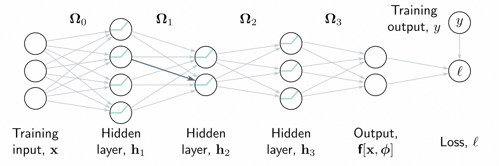
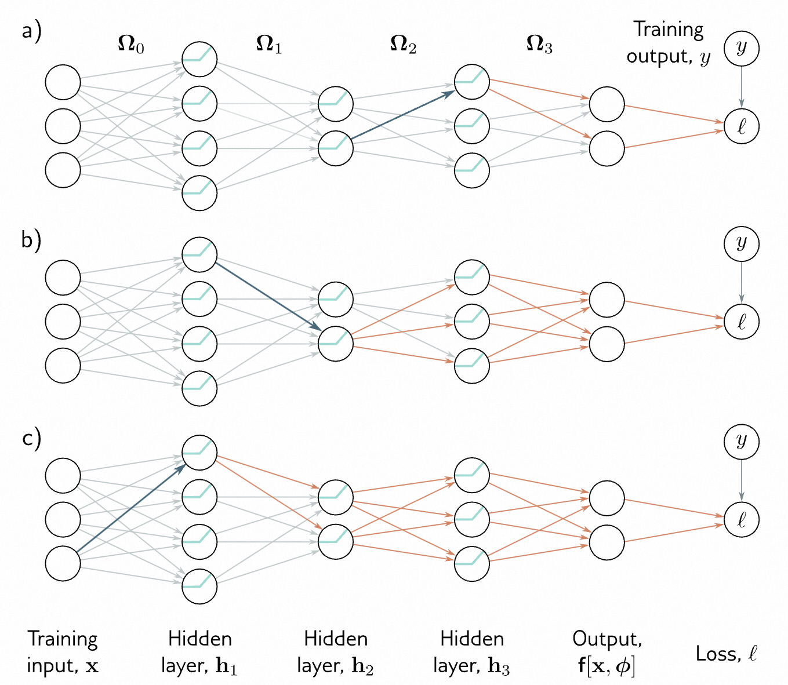
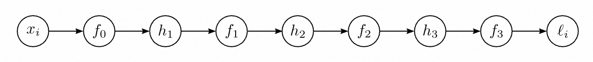
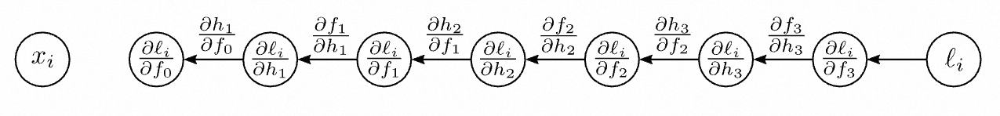
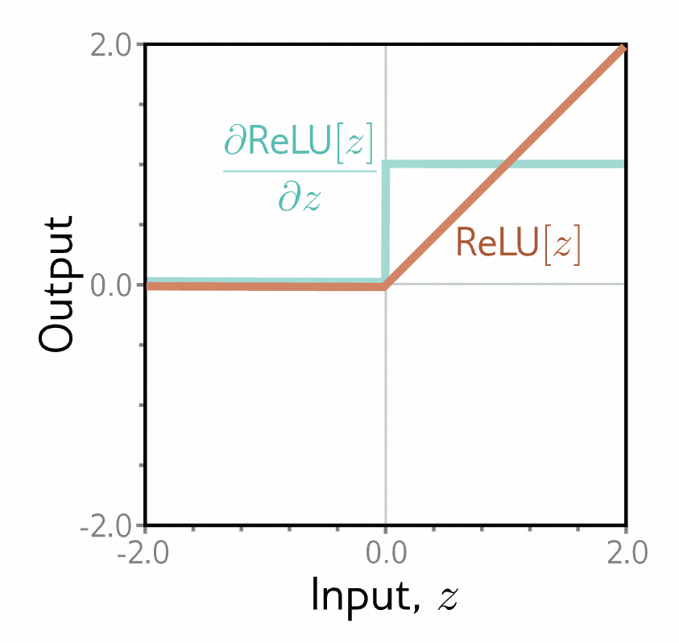
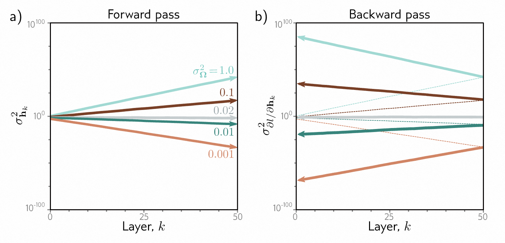
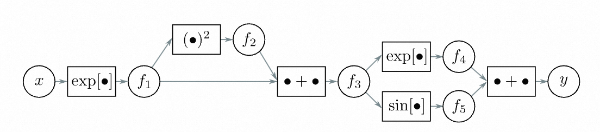

# 本章目录

- [本章目录](#本章目录)
- [第7章 梯度和初始化 - Gradients and initialization](#第7章-梯度和初始化---gradients-and-initialization)
  - [7.1 问题定义 - Problem definitions](#71-问题定义---problem-definitions)
  - [7.2 计算导数 - Computing derivatives](#72-计算导数---computing-derivatives)
  - [7.3 玩具示例 - Toy example](#73-玩具示例---toy-example)
  - [7.4 反向传播算法 - Backpropagation algorithm](#74-反向传播算法---backpropagation-algorithm)
    - [7.4.1 反向传播算法总结 - Backpropagation algorithm summary](#741-反向传播算法总结---backpropagation-algorithm-summary)
    - [7.4.2 算法微分 - Algorithmic differentiation](#742-算法微分---algorithmic-differentiation)
    - [7.4.3 将扩展到任意计算图 - Extension to arbitrary computational graphs](#743-将扩展到任意计算图---extension-to-arbitrary-computational-graphs)
  - [7.5 参数初始化 - Parameter initialization](#75-参数初始化---parameter-initialization)
    - [7.5.1 前向传播的初始化 - Initialization for forward pass](#751-前向传播的初始化---initialization-for-forward-pass)
    - [7.5.2 后向传播的初始化 - Initialization for backward pass](#752-后向传播的初始化---initialization-for-backward-pass)
    - [7.5.3 前向传播和后向传播的初始化 - Initialization for both forward and backward pass](#753-前向传播和后向传播的初始化---initialization-for-both-forward-and-backward-pass)
  - [7.6 示例训练代码 - Example training code](#76-示例训练代码---example-training-code)
  - [7.7 总结 - Summary](#77-总结---summary)
  - [7.8 笔记 - Notes](#78-笔记---notes)
  - [7.9 问题 - Problems](#79-问题---problems)

# 第7章 梯度和初始化 - Gradients and initialization

第6章介绍了迭代优化算法。这些是通用的方法，用于寻找函数的最小值。在神经网络的背景下，它们找到使模型能够准确预测输入的训练输出的参数，从而最小化损失。基本的方法是随机选择初始参数，然后进行一系列小的改变，以平均降低损失。每个改变都基于当前位置的参数对损失的梯度。本章讨论了神经网络特有的两个问题。首先，我们考虑如何高效地计算梯度。这是一个严峻的挑战，因为目前最大的模型具有 $ 10^{12} $ 个参数，并且在训练算法的每一次迭代中都要为所有的参数计算梯度。其次，我们要考虑如何初始化参数。如果我们在初始化参数时不够小心，初始的损失及其梯度可能会非常大或非常小，无论哪种情况，都会对训练过程造成严重的影响。

## 7.1 问题定义 - Problem definitions

考虑一个具有多元输入  $ x $ 、参数  $ \phi $  和三个隐藏层  $ h_{1} $ 、 $ h_{2} $  和  $ h_{3} $  的网络  $ f[x, \phi] $ ：

$$
\begin{array}{rcl}\\\\\mathbf{h}_1&=&\mathbf{a}[\mathbf{\beta}_0+\mathbf{\Omega}_0\mathbf{x}]\\\mathbf{h}_2&=&\mathbf{a}[\mathbf{\beta}_1+\mathbf{\Omega}_1\mathbf{h}_1]\\\mathbf{h}_3&=&\mathbf{a}[\mathbf{\beta}_2+\mathbf{\Omega}_2\mathbf{h}_2]\\\mathbf{f}[\mathbf{x},\mathbf{\phi}]&=&\mathbf{\beta}_3+\mathbf{\Omega}_3\mathbf{h}_3,\end{array}
\tag{7.1}
$$

其中函数 $ a[•] $ 将激活函数分别应用于输入的每个元素。模型参数 $ \phi = \{\beta_{0}, \Omega_{0}, \beta_{1}, \Omega_{1}, \beta_{2}, \Omega_{2}, \beta_{3}, \Omega_{3}\} $ 由偏置向量 $ \beta_{k} $ 和每个层之间的权重矩阵 $ \Omega_{k} $ 组成（图[7.1](#_bookmark262)）。

我们还有单独的损失函数 $ \ell_{i} $ ，它返回给定模型的预测值 $ f[x_{i}, \phi] $ 相对于真实值 $ y_{i} $ 的负对数似然。例如，这可能是最小二乘损失 $ \ell_{i} = (f[x_{i}, \phi] - y_{i})^{2} $ 。总损失是训练数据上这些项的总和：

$$
L[\boldsymbol{\phi}]=\sum_{i=1}^I\ell_i \tag{7.2}
$$

用于训练神经网络的最常用的优化算法是随机梯度下降（SGD），它更新参数如下：

$$
\phi_{t+1}\longleftarrow\phi_t-\alpha\sum_{i\in\mathcal{B}_t}\frac{\partial\ell_i[\phi_t]}{\partial\phi} \tag{7.3}
$$

其中 $ \alpha $ 是学习率， $ \mathcal{B}_{t} $ 包含迭代 $ t $ 时的批次索引。为了计算这个更新，我们需要计算导数：

$$
\frac{\partial\ell_i}{\partial\boldsymbol{\beta}_k}\quad\mathrm{and}\quad\frac{\partial\ell_i}{\partial\boldsymbol{\Omega}_k} \tag{7.4}
$$

对于每个层 $ k \in \{0, 1, \ldots, K\} $ 和批次中的每个索引 $ i $ ，计算这个更新。本章的第一部分描述了*反向传播算法*，它可以高效地计算这些导数。

在本章的第二部分，我们考虑在开始训练之前如何为网络设置一个初始化的参数。我们描述了选择初始权重 $ \Omega_{k} $ 和偏置 $ \beta_{k} $ 的方法，以使训练稳定。

## 7.2 计算导数 - Computing derivatives

损失函数的导数可以告诉我们当参数发生微小变化时，损失函数的变化情况。优化算法就是利用这些信息来调整参数，使得损失函数的值变小。反向传播算法用于计算这些导数。数学细节比较复杂，因此我们先来看看这两个观察结果，找找感觉。

**观察1：** 每个权重（属于 $  Ω_{k} $ ）都乘以源隐藏单元的激活值，并将结果添加到下一层的目标隐藏单元中。因此，任何对权重的微小变化都会被源隐藏单元的激活值放大或衰减。为了计算梯度，我们对批次中的每个数据示例运行网络，并存储所有隐藏单元的激活值。这个过程被称为前向传播（见图7.1）。存储的激活值将在后续计算梯度时使用。

**观察2：** 偏置或权重的微小变化会引起连锁反应，通过网络传递产生一系列变化。这种变化会修改其目标隐藏单元的值。这反过来又会改变后续层中的隐藏单元的值，进而改变下一层的隐藏单元的值，依此类推，直到对模型输出进行修改，最终影响损失函数。


> 图7.1 反向传播前向传递。目标是计算损失函数 $  ℓ  $ 对每个权重（箭头）和偏置（未显示）的导数。换句话说，我们想知道每个参数的微小变化将如何影响损失函数。每个权重都乘以其源隐藏单元，并将结果添加到其目标隐藏单元。因此，任何对权重的微小变化的影响都将由源隐藏单元的激活值进行缩放。例如，蓝色权重应用于第1层的第2个隐藏单元；如果该单元的激活值加倍，那么对蓝色权重的微小变化的影响也将加倍。因此，为了计算权重的导数，我们需要计算并存储隐藏层的激活值。这被称为*前向传递*，因为它涉及按顺序运行网络方程。

因此，为了知道如何改变参数会修改损失函数，我们还需要知道每个后续隐藏层的变化如何进一步修改它们的后继层。当考虑同一层或更早层中的其他参数时，也需要这些相同的量。因此，我们可以计算它们一次并重复使用它们。例如，考虑计算输入到隐藏层 $  h_{3}, h_{2}  $ 和 $  h_{1}  $ 的权重的微小变化的影响。

- 要计算输入到隐藏层 $  h_{3}  $ 的权重或偏置的微小变化如何影响损失函数，我们需要知道（i）层 $  h_{3}  $ 的变化如何改变模型输出 $  f  $ ，以及（ii）这个输出的变化如何改变损失函数（图[7.2a](#_bookmark263)）。

- 要计算输入到隐藏层 $  h_{2}  $ 的权重或偏置的微小变化如何影响损失函数，我们需要知道（i）层 $  h_{2}  $ 的变化如何影响 $  h_{3}  $ ，（ii） $  h_{3}  $ 如何改变模型输出，以及（iii）这个输出的变化如何改变损失函数（图[7.2b](#_bookmark263)）。

- 要计算输入到隐藏层 $  h_{1}  $ 的权重或偏置的微小变化如何影响损失函数，我们需要知道（i）层 $  h_{1}  $ 的变化如何影响层 $  h_{2}  $ ，（ii）层 $  h_{2}  $ 的变化如何影响层 $  h_{3}  $ ，（iii）层 $  h_{3}  $ 如何改变模型输出，以及（iv）模型输出的变化如何改变损失函数（图[7.2c](#_bookmark263)）。


> 图7.2 反向传播后向传递。
>
> - a) 要计算一个输入到 $ h_{3} $ 层的权重的变化如何影响损失，我们需要知道 $ h_{3} $ 层的隐藏单元如何改变模型输出 $ f $ ，以及 $ f $ 如何改变损失。
> - b) 要计算一个输入到 $ h_{2} $ 层的权重的微小变化如何影响损失，我们需要知道：(i)  $ h_{2} $ 层的隐藏单元如何改变 $ h_{3} $ ，(ii)  $ h_{3} $ 如何改变 $ f $ ，以及(iii)  $ f $ 如何改变损失。
> - c) 类似地，要计算一个输入到 $ h_{1} $ 层的权重的微小变化如何影响损失，我们需要知道 $ h_{1} $ 如何改变 $ h_{2} $ ，以及这些变化如何传播到损失。
> 反向传播首先计算网络末端的导数，然后向后工作，利用这些计算的冗余性。

当我们向后通过网络移动时，我们会发现大多数我们需要的项已经在前一步中计算过了，所以我们不需要重新计算它们。按照这种方式向后通过网络计算导数被称为反向传播。

反向传播的思想相对容易理解。然而，推导过程需要使用矩阵微积分，因为偏置和权重项分别是向量和矩阵。为了帮助理解其基本原理，下一节将推导一个具有标量参数的简单玩具模型的反向传播。然后我们将在第7.4节中将相同的方法应用于深度神经网络。

## 7.3 玩具示例 - Toy example

考虑一个具有八个标量参数 $  \phi = \{β_{0}, ω_{0}, β_{1}, ω_{1}, β_{2}, ω_{2}, β_{3}, ω_{3}\}  $ 的模型 $  f [x, ϕ]  $ ，它由函数 $ \operatorname{sin}[•] $ ,  $ \operatorname{exp}[•] $ , 和  $ \operatorname{cos}[•] $ 的组合构成。

$$
\mathrm{f}[x,\boldsymbol{\phi}]=\beta_3+\omega_3\cdot\cos\Bigl[\beta_2+\omega_2\cdot\exp\bigl[\beta_1+\omega_1\cdot\sin[\beta_0+\omega_0\cdot x]\bigr]\Bigr]
\tag{7.5}
$$

以及最小二乘损失函数 $  L [ϕ] = \sum_{i}ℓ_{i} $ ，其中每个项为。

$$
\ell_i=(\mathrm{f}[x_i,\phi]-y_i)^2 \tag{7.6}
$$

其中， $  x_{i}  $ 是第 $ i $ 个训练输入， $  y_{i}  $ 是第 $ i $ 个训练输出。你可以将其看作是一个简单的神经网络，每层有一个输入、一个输出和一个隐藏单元，并且在每个层之间有不同的激活函数 $ \operatorname{sin}[•] $ ,  $  \operatorname{exp} [•] $ , 和  $ \operatorname{cos}[•] $ 。

我们的目标是计算导数。

$$
\frac{\partial\ell_i}{\partial\beta_0},\quad\frac{\partial\ell_i}{\partial\omega_0},\quad\frac{\partial\ell_i}{\partial\beta_1},\quad\frac{\partial\ell_i}{\partial\omega_1},\quad\frac{\partial\ell_i}{\partial\beta_2},\quad\frac{\partial\ell_i}{\partial\omega_2},\quad\frac{\partial\ell_i}{\partial\beta_3},\quad\mathrm{和}\quad\frac{\partial\ell_i}{\partial\omega_3}
$$

当然，我们可以手动找出这些导数的表达式并直接计算它们。然而，其中一些表达式非常复杂。例如，

$$
\begin{aligned}\frac{\partial\ell_i}{\partial\omega_0}
&=-2\left(\beta_3+\omega_3\cdot\cos\Bigl[\beta_2+\omega_2\cdot\exp\bigl[\beta_1+\omega_1\cdot\sin[\beta_0+\omega_0\cdot x_i]\bigr]\Bigr]-y_i\right)\\
&\cdot\omega_1\omega_2\omega_3\cdot x_i\cdot\cos[\beta_0+\omega_0\cdot x_i]\cdot\exp\Bigl[\beta_1+\omega_1\cdot\sin[\beta_0+\omega_0\cdot x_i]\Bigr]\\
&\cdot\sin\Bigl[\beta_2+\omega_2\cdot\exp\Bigl[\beta_1+\omega_1\cdot\sin[\beta_0+\omega_0\cdot x_i]\Bigr].\end{aligned}
\tag{7.7}
$$

这样的表达式很难推导和编码，容易出错，并且没有充分利用冗余性；请注意，三个指数项是相同的。

反向传播算法是一种同时计算所有这些导数的高效方法。它包括（i）前向传递，在其中我们计算并存储一系列中间值和网络输出，以及（ii）反向传递，在其中我们从网络的末端开始计算每个参数的导数，并在向起始点移动时重用先前的计算。


> 图7.3 反向传播的前向传递。我们依次计算并存储每个中间变量，直到最后计算损失。

**前向传递：** 我们将损失的计算视为一系列计算。

$$
\begin{aligned}
f_0 &=\quad\beta_0+\omega_0\cdot x_i  \\
h_1 &=\quad\sin[f_0]  \\
f_1 &=\quad\beta_1+\omega_1\cdot h_1  \\
h_{2} &=\quad\exp[f_1]  \\
f_2 &=\quad\beta_2+\omega_2\cdot h_2  \\
h_{3}&=\quad \cos[f_2]  \\
f_{3}&=\quad \beta_3+\omega_3\cdot h_3  \\
\ell_i&=\quad(f_3-y_i)^2
\end{aligned}
\tag{7.8}
$$

我们计算并存储中间变量 $  f_{k}  $ 和 $  h_{k}  $ 的值（图[7.3](#_bookmark266)）。

**反向传播 #1：** 现在我们按照相反的顺序计算 $ ℓ_{i} $ 对这些中间变量的导数：

$$
\frac{\partial\ell_i}{\partial f_3},\quad\frac{\partial\ell_i}{\partial h_3},\quad\frac{\partial\ell_i}{\partial f_2},\quad\frac{\partial\ell_i}{\partial h_2},\quad\frac{\partial\ell_i}{\partial f_1},\quad\frac{\partial\ell_i}{\partial h_1},\quad\mathrm{和}\quad\frac{\partial\ell_i}{\partial f_0}
\tag{7.9}
$$

其中第一个导数很简单。

$$
\frac{\partial\ell_i}{\partial f_3}=2(f_3-y_i)
\tag{7.10}
$$

下一个导数可以使用链式法则计算：

$$
\frac{\partial\ell_i}{\partial h_3}=\frac{\partial f_3}{\partial h_3}\frac{\partial\ell_i}{\partial f_3}
\tag{7.11}
$$

左边问的是当 $ h_{3} $ 发生变化时，$ ℓ_{i} $ 如何变化。右边说我们可以将其分解为 (i) 当 $ h_{3} $ 变化时，$ f_{3} $ 如何变化，以及 (ii) 当 $ f_{3} $ 变化时，$ ℓ_{i} $ 如何变化。在原始方程中，$ h_{3} $ 的变化会影响 $ f_{3} $，进而影响 $ ℓ_{i} $，导数表示了这个链条的效应。请注意，我们已经计算了这些导数中的第二个，而另一个是关于 $ h_{3} $ 的导数 $ β_{3} + ω_{3}\cdotp h_{3} $，其导数是 $ ω_{3} $。


> 图 7.4 反向传播的第一次反向传递: 我们从计算损失的函数末尾开始反向计算导数 $∂ℓ_i/∂f_•$ 和 $∂ℓ_i/∂_{h•}$，这些导数表示损失对中间量的变化。每个导数都是通过乘以形如 $∂f_{k}/∂h_{k}$ 或 $∂h_{k}/∂f_{k-1}$ 的项来计算的。

我们继续这样计算，计算输出与这些中间量的导数（图 [7.4](#_bookmark267)）：

$$
\begin{aligned}\frac{\partial\ell_i}{\partial f_2}
\quad&=\quad\frac{\partial h_3}{\partial f_2}\left(\frac{\partial f_3}{\partial h_3}\frac{\partial\ell_i}{\partial f_3}\right)\\\frac{\partial\ell_i}{\partial h_2}
\quad&=\quad\frac{\partial f_2}{\partial h_2}\left(\frac{\partial h_3}{\partial f_2}\frac{\partial f_3}{\partial h_3}\frac{\partial\ell_i}{\partial f_3}\right)\\\frac{\partial\ell_i}{\partial f_1}
\quad&=\quad\frac{\partial h_2}{\partial f_1}\left(\frac{\partial f_2}{\partial h_2}\frac{\partial h_3}{\partial f_2}\frac{\partial h_3}{\partial h_3}\frac{\partial f_3}{\partial f_3}\right)\\\frac{\partial\ell_i}{\partial h_1}
\quad&=\quad\frac{\partial f_1}{\partial h_1}\left(\frac{\partial h_2}{\partial f_1}\frac{\partial f_2}{\partial h_2}\frac{\partial h_3}{\partial f_2}\frac{\partial f_3}{\partial h_3}\frac{\partial\ell_i}{\partial f_3}\right)\\\frac{\partial\ell_i}{\partial f_0}
\quad&=\quad\frac{\partial h_1}{\partial f_0}\left(\frac{\partial f_1}{\partial h_1}\frac{\partial h_2}{\partial f_1}\frac{\partial f_2}{\partial h_2}\frac{\partial h_3}{\partial f_2}\frac{\partial f_3}{\partial h_3}\frac{\partial\ell_i}{\partial f_3}\right).\end{aligned}\tag{7.12}
$$

在每种情况下，我们已经在前一步中计算了括号中的量，而最后一项有一个简单的表达式。这些方程体现了前一节中的观察2（图 [7.2](#_bookmark263)）；如果我们按相反的顺序计算它们，我们可以重用先前计算的导数。

 **反向传播 #2：** 最后，我们考虑当我们改变参数 $β_{•}$ 和 $ω_{•}$ 时，损失 $ ℓ_{i} $ 如何变化。再次应用链式法则（图 [7.5](#_bookmark269)）：

$$
\begin{align}\frac{\partial\ell_i}{\partial\beta_k}&=&\frac{\partial f_k}{\partial\beta_k}\frac{\partial\ell_i}{\partial f_k}\\\frac{\partial\ell_i}{\partial\omega_k}&=&\frac{\partial f_k}{\partial\omega_k}\frac{\partial\ell_i}{\partial f_k}\end{align}\tag{7.13}
$$

在每种情况下，右边的第二项在方程 [7.12](#_bookmark268) 中已经计算过。当 $ k>0 $ 时，我们有 $ f_{k} = β_{k} + ω_{k}·h_{k} $，所以：

$$
\frac{\partial f_k}{\partial\beta_k}=1\quad\text{和}\quad\frac{\partial f_k}{\partial\omega_k}\quad=\quad h_k
\tag{7.14}
$$


> 图 7.5 反向传播的第二次反向传递。最后，我们计算导数 $∂ℓ_i/∂ β_{•} $ 和 $∂ℓ_i/∂ω_•$。每个导数都是通过将 $∂ℓ_{i}/∂f_{k} $ 乘以相应的 $∂f_{k}/∂β_{k} $ 或 $∂f_{k}/∂ω_{k} $ 计算得出的。

这与前一节中的观察1一致；权重 $ ω_{k} $ 的变化效应与源变量 $ h_{k} $ 的值成比例（在前向传递中存储了） 。从术语 $ f_{0} = β_{0} + ω·x_{i} $ 得到的最终导数为：

$$
\frac{\partial f_0}{\partial\beta_0}=1\quad\text{和}\quad\frac{\partial f_0}{\partial\omega_0}\quad=\quad x_i \tag{7.15}
$$

反向传播比单独计算导数（如方程 [7.7](#_bookmark265)）更简单且更高效。

## 7.4 反向传播算法 - Backpropagation algorithm

现在我们将这个过程重复一遍，针对一个三层网络（图[7.1](#_bookmark262)）。大部分的代数运算都是相同的，主要的区别在于中间变量 $  f_{k}, h_{k}  $ 是向量，偏置 $  β_{k}  $ 是向量，权重 $  Ω_{k}  $ 是矩阵，并且我们使用的是ReLU函数而不是简单的代数函数如 $ cos[•] $ 。

**前向传播：** 我们将网络写成一系列的顺序计算。

$$
\begin{aligned}
\mathbf{f}_0 &= \boldsymbol{\beta}_0 + \boldsymbol{\Omega}_0\mathbf{x}_i \\
\mathbf{h}_1 &= \mathbf{a}[\mathbf{f}_0] \\
\mathbf{f}_1 &= \boldsymbol{\beta}_1 + \boldsymbol{\Omega}_1\mathbf{h}_1 \\
\mathbf{h}_2 &= \mathbf{a}[\mathbf{f}_1] \\
\mathbf{f}_2 &= \boldsymbol{\beta}_2 + \boldsymbol{\Omega}_2\mathbf{h}_2 \\
\mathbf{h}_3 &= \mathbf{a}[\mathbf{f}_2] \\
\mathbf{f}_3 &= \boldsymbol{\beta}_3 + \boldsymbol{\Omega}_3\mathbf{h}_3 \\
\ell_i &= \text{l}[\mathbf{f}_3,y_i]
\end{aligned}
\tag{7.16}
$$

> 注意，我们实际上不需要计算损失对激活值的导数 $  \frac{\partial l_i}{\partial h_k}  $ 。

在最终的反向传播算法中，我们不会显式地计算这些导数。

其中， $  f_{k-1}  $ 表示第 $  k  $ 个隐藏层的预激活（即ReLU函数 $  a[•]  $ 之前的值）， $  h_{k}  $ 包含第 $  k  $ 个隐藏层的激活值（即ReLU函数之后的值）。术语 $  l[f_{3}, y_{i}]  $ 表示损失函数（例如最小二乘或二元交叉熵损失）。在前向传播过程中，我们计算这些函数并存储所有中间结果。

**反向传播 #1：** 现在让我们考虑当我们修改预激活值 $  f_{0}, f_{1}, f_{2}  $ 时，损失如何变化。应用链式法则，损失 $  ℓ_{i}  $ 对 $  f_{2}  $ 的导数表达式为：

$$
\frac{\partial\ell_i}{\partial\mathbf{f}_2} = \frac{\partial\mathbf{h}_3}{\partial\mathbf{f}_2}\frac{\partial\mathbf{f}_3}{\partial\mathbf{h}_3}\frac{\partial\ell_i}{\partial\mathbf{f}_3}
\tag{7.17}
$$

右侧的三个项的大小分别为 $  D_{3} × D_{3}  $ ， $  D_{3} × D_{f}  $ 和 $  D_{f} × 1 $ ，其中 $  D_{3}  $ 是第三层隐藏单元的数量， $  D_{f}  $ 是模型输出 $  f_{3}  $ 的维度。

类似地，我们可以计算当我们改变 $  f_{1}  $ 和 $  f_{0}  $ 时损失的变化。

$$
\frac{\partial\ell_i}{\partial\mathbf{f}_1} = \frac{\partial\mathbf{h}_2}{\partial\mathbf{f}_1}\frac{\partial\mathbf{f}_2}{\partial\mathbf{h}_2}\left(\frac{\partial\mathbf{h}_3}{\partial\mathbf{f}_2}\frac{\partial\mathbf{f}_3}{\partial\mathbf{h}_3}\frac{\partial\ell_i}{\partial\mathbf{f}_3}\right)
\tag{7.18}
$$

$$
\begin{align}
\frac{\partial\ell_i}{\partial\mathbf{f}_0} &= \frac{\partial\mathbf{h}_1}{\partial\mathbf{f}_0}\frac{\partial\mathbf{f}_1}{\partial\mathbf{h}_1}\left(\frac{\partial\mathbf{h}_2}{\partial\mathbf{f}_1}\frac{\partial\mathbf{f}_2}{\partial\mathbf{h}_2}\frac{\partial\mathbf{h}_3}{\partial\mathbf{f}_2}\frac{\partial\mathbf{f}_3}{\partial\mathbf{h}_3}\frac{\partial\ell_i}{\partial\mathbf{f}_3}\right)
\end{align}
\tag{7.19}
$$

注意，在每种情况下，括号中的项在前一步中已经计算过了。通过反向遍历网络，我们可以重复使用先前的计算。

此外，这些项本身是简单的。通过对方程[7.17](#_bookmark274)右侧进行反向遍历，我们有：

- 损失函数  $  ℓ_{i}  $  对网络输出  $  f_{3}  $  的导数  $  ∂ℓ_{i} /∂ f_{3}  $  会根据损失函数的不同而有不同的形式，但通常都很简单。
- 网络输出  $  f_{3}  $  对隐藏层  $  h_{3}  $  的导数  $  ∂f_{3} /∂ h_{3}  $  是。

$$
\frac{\partial\mathbf{f}_3}{\partial\mathbf{h}_3}=\frac\partial{\partial\mathbf{h}_3}\left(\boldsymbol{\beta}_3+\boldsymbol{\Omega}_3\mathbf{h}_3\right)=\boldsymbol{\Omega}_3^T\tag{7.20}
$$

如果你对矩阵微积分不熟悉，这个过程可能不好理解。它在问题[7.6](#_bookmark298)中有详细探讨。

激活函数输出  $  h_{3}  $  对其输入  $  f_{2}  $  的导数  $  ∂h_{3} /∂ f_{2}  $  会根据激活函数的不同而有所不同。它将是一个对角矩阵，因为每个激活函数只依赖于相应的预激活。对于ReLU函数，对角线上的元素在  $  f_{2}  $  小于零的地方都是零，在其他地方都是一（图[7.6](#_bookmark273)）。我们不需要乘以这个矩阵，而是将对角线上的元素提取为向量  $  \mathbb{I}[f_{2}> 0]  $  并逐元素相乘，这样更高效。


> 图7.6 ReLU函数的导数。ReLU函数（橙色曲线）在输入小于零时返回零，并在输入大于零时返回输入值。它的导数（青色曲线）在输入小于零时返回零（因为此处斜率为零），在输入大于零时返回1（因为此处斜率为1）。

方程[7.18](#_bookmark275)和[7.19](#_bookmark275)右侧的项具有类似的形式。当我们向后传播时，我们交替地（i）乘以权重矩阵的转置  $  Ω_k^{T}  $  和（ii）基于输入  $  f_{k-1}  $  到隐藏层的阈值。这些输入在前向传递过程中已经被存储起来。

**向后传递 #2：** 现在我们知道如何计算  $  ∂ℓ_{i} /∂ f_{k}  $  ，我们可以专注于计算损失对权重和偏置的导数。为了计算损失对偏置  $  β_{k}  $  的导数，我们再次使用链式法则。

$$
\begin{aligned}
\frac{\partial\ell_i}{\partial\beta_k}& =\quad\frac{\partial\mathbf{f}_k}{\partial\boldsymbol{\beta}_k}\frac{\partial\ell_i}{\partial\mathbf{f}_k}  \\
&=\quad\frac\partial{\partial\boldsymbol{\beta}_k}\left(\boldsymbol{\beta}_k+\boldsymbol{\Omega}_k\mathbf{h}_k\right)\frac{\partial\ell_i}{\partial\mathbf{f}_k} \\
&=\quad\frac{\partial\ell_i}{\partial\mathbf{f}_k}
\end{aligned}
\tag{7.21}
$$

这个结果在方程[7.17](#_bookmark274)和[7.18](#_bookmark275)中已经计算过了。

类似地，权重向量  $  Ω_{k}  $  的导数由以下公式给出。

$$
\begin{aligned}
\frac{\partial\ell_i}{\partial\boldsymbol{\Omega}_k}& =\quad\frac{\partial\mathbf{f}_k}{\partial\boldsymbol{\Omega}_k}\frac{\partial\ell_i}{\partial\mathbf{f}_k}  \\
&=\quad\frac\partial{\partial\boldsymbol{\Omega}_k}\left(\boldsymbol{\beta}_k+\boldsymbol{\Omega}_k\mathbf{h}_k\right)\frac{\partial\ell_i}{\partial\mathbf{f}_k} \\
&=\quad\frac{\partial\ell_i}{\partial\mathbf{f}_k}\mathbf{h}_k^T
\end{aligned}
\tag{7.22}
$$

从第二行到第三行的推导并不明显，在问题[7.9](#_bookmark303)中有详细探讨。然而，这个结果是有道理的。最后一行是一个与  $  Ω_{k}  $  大小相同的矩阵。它线性地依赖于  $  h_{k}  $  ，而在原始表达式中， $  h_{k}  $  被  $  Ω_{k}  $  乘以。这也符合最初的直觉，即权重  $  Ω_{k}  $  的导数将与它们乘以的隐藏单元  $  h_{k}  $  的值成比例。回想一下，在前向传递过程中我们已经计算过这些值了。

### 7.4.1 反向传播算法总结 - Backpropagation algorithm summary

现在我们简要总结一下最终的反向传播算法。考虑一个深度神经网络  $  f [x_{i}, ϕ]  $ ，它接受输入  $  x_{i}  $ ，有  $  K  $  个带有ReLU激活函数的隐藏层，并且具有损失项  $  ℓ_{i} = l [f [x_{i}, ϕ] , y_{i}]  $ 。反向传播的目标是计算相对于偏置  $  β_{k}  $  和权重  $  Ω_{k}  $  的导数  $  ∂ℓ_{i} /∂ β_{k}  $  和  $  ∂ℓ_{i} /∂ Ω_{k}  $ 。

**前向传播：**我们计算并存储以下量：

$$
\begin{array}{rcl}\mathbf{f}_0&=&\mathbf{\beta}_0+\mathbf{\Omega}_0\mathbf{x}_i\\\mathbf{h}_k&=&\mathbf{a}[\mathbf{f}_{k-1}]&k\in\{1,2,\ldots,K\}\\\mathbf{f}_k&=&\mathbf{\beta}_k+\mathbf{\Omega}_k\mathbf{h}_k.&k\in\{1,2,\ldots,K\}\end{array}\tag{7.23}
$$

**反向传播：** 我们从损失函数  $  ℓ_{i}  $  相对于网络输出  $  f_{K}  $  的导数  $  ∂ℓ_{i} /∂ f_{K}  $  开始，然后向后逐层计算：
$$
 \begin{aligned}\frac{\partial\ell_i}{\partial\beta_k}
 \quad&=\quad\frac{\partial\ell_i}{\partial\mathbf{f}_k}&k\in\{K,K-1,\ldots,1\}\\\frac{\partial\ell_i}{\partial\boldsymbol{\Omega}_k}
 \quad&=\quad\frac{\partial\ell_i}{\partial\mathbf{f}_k}\mathbf{h}k^T&k\in\{K,K-1,\ldots,1\}\\\frac{\partial\ell_i}{\partial\mathbf{f}_{k-1}}
 \quad&=\quad\mathbb{I}[\mathbf{f}_{k-1}>0]\odot\left(\Omega_k^T\frac{\partial\ell_i}{\partial\mathbf{f}_k}\right),\quad&k\in\{K,K-1,\ldots,1\}\quad\end{aligned}\tag{7.24}
 $$

其中 ⊙ 表示逐元素乘法， $  \mathbb{I} [f_{k-1}> 0]  $  是一个向量，其中  $  f_{k-1}  $  大于零的位置为1，其他位置为零。最后，我们计算相对于第一组偏置和权重的导数：

$$
\begin{align}
\frac{\partial\ell_i}{\partial\boldsymbol{\beta}_0}&=\frac{\partial\ell_i}{\partial\mathbf{f}_0}\\
\frac{\partial\ell_i}{\partial\boldsymbol{\Omega}_0}&=\frac{\partial\ell_i}{\partial\mathbf{f}_0}\mathbf{x}_i^T
\end{align}
\tag{7.25}
$$

我们对批次中的每个训练样本计算这些导数，并将它们相加以获得SGD更新的梯度。

需要注意的是，反向传播算法非常高效；前向传播和反向传播中最耗费计算资源的步骤是矩阵乘法（分别是  $  Ω  $  和  $ Ω^{T}  $ ），只需要进行加法和乘法运算。然而，它不是内存高效的；前向传播中的中间值必须全部存储起来，这会限制我们能够训练的模型的最大规模。

### 7.4.2 算法微分 - Algorithmic differentiation

虽然了解反向传播算法很重要，但在实践中，你不太可能需要自己编写它。现代深度学习框架如PyTorch和TensorFlow可以根据模型规范自动计算导数，这就是所谓的*算法微分*。

框架中的每个功能组件（线性变换、ReLU激活函数、损失函数）都知道如何计算自己的导数。例如，PyTorch的ReLU函数  $  z_{out} = relu[z_{in}]  $  知道如何计算其输出  $  z_{out}  $  相对于其输入  $  z_{in}  $  的导数。同样，线性函数  $  z_{out} = β + Ωz_{in}  $  知道如何计算其输出  $  z_{out}  $  相对于其输入  $  z_{in}  $  和参数  $  β  $ 、 $ Ω $  的导数。算法微分框架还知道网络中的操作顺序，因此具备执行前向和后向传递所需的所有信息。

这些框架利用了现代图形处理单元（GPU）的大规模并行性。矩阵乘法等计算（在前向和后向传递中都有）自然适合并行化。此外，如果模型和前向传递中的中间结果不超过可用内存，还可以并行处理整个批次的前向和后向传递。

由于训练算法现在以并行方式处理整个批次，输入变成了多维*张量*。在这个上下文中，张量可以被视为将矩阵推广到任意维度的概念。因此，向量是一个1D张量，矩阵是一个2D张量，而3D张量是一个由数字组成的3D网格。到目前为止，训练数据是1D的，因此反向传播的输入将是一个2D张量，其中第一个维度索引批次元素，第二个维度索引数据维度。在后续章节中，我们将遇到更复杂的结构化输入数据。例如，在输入为RGB图像的模型中，原始数据示例是3D的（高度、宽度、通道）。在这种情况下，学习框架的输入将是一个4D张量，其中额外的维度索引批次元素。

### 7.4.3 将扩展到任意计算图 - Extension to arbitrary computational graphs

我们已经描述了在自然顺序下计算中间量  $  f_{0}, h_{1}, f_{1}, h_{2},\ldots, f_{k}  $  的深度神经网络的反向传播。然而，模型不必局限于顺序计算。在本书的后面，我们将遇到具有分支结构的模型。例如，我们可以将隐藏层中的值通过两个不同的子网络进行处理，然后再合并。

幸运的是，如果计算图是无环的，反向传播的思想仍然适用。现代的算法微分框架如PyTorch和TensorFlow可以处理任意无环计算图。

## 7.5 参数初始化 - Parameter initialization

反向传播算法计算了用于随机梯度下降和Adam训练模型的导数。现在我们来讨论在开始训练之前如何初始化参数。为了理解为什么这一点至关重要，假设在前向传播过程中，每组预激活  $  f_{k}  $  的计算方式为：

$$
\begin{array}{rcl}\mathbf{f}_k&=&\beta_k+\Omega_k\mathbf{h}_k\\&=&\beta_k+\Omega_k\mathbf{a}[\mathbf{f}_{k-1}],\end{array}
\tag{7.26}
$$

其中  $  a [•]  $  应用了ReLU函数， $  Ω_{k}  $  和  $  β_{k}  $  分别是权重和偏置。假设我们将所有的偏置初始化为零，并且将  $  Ω_{k}  $  的元素按照均值为零、方差为  $  σ^{2}  $  的正态分布进行初始化。思考下面两种场景：

- 如果方差  $  σ^{2}  $  很小（例如  $ 10^{-5} $ ），那么  $  β_{k} + Ω_{k}h_{k}  $  的每个元素将是  $  h_{k}  $  的加权和，其中权重非常小；结果的幅值可能比输入要小。此外，ReLU函数会截断小于零的值，因此  $  h_{k}  $  的范围将是  $  f_{k-1} $  的一半。因此，随着网络的进一步进行，隐藏层的预激活幅值会越来越小。
- 如果方差  $  σ^{2}  $  很大（例如  $ 10^{5} $ ），那么  $  β_{k} + Ω_{k}h_{k}  $  的每个元素将是  $  h_{k}  $  的加权和，其中权重非常大；结果的幅值可能比输入要大得多。ReLU函数会将输入的范围减半，但如果  $  σ^{2}  $  足够大，预激活的幅值仍然会随着网络的进一步进行而变大。

在这两种情况下，预激活的值可能变得非常小或非常大，以至于无法用有限精度的浮点运算来表示。

即使前向传播是可行的，相同的逻辑也适用于反向传播。每次梯度更新（方程[7.24](#_bookmark277)）都需要乘以  $  Ω^{T}  $ 。如果  $  Ω  $  的值没有合理初始化，那么梯度幅值在反向传播过程中可能会不受控制地减小或增大。这些情况被称为*梯度消失问题*和*梯度爆炸问题*。在前一种情况下，模型的更新变得非常小。在后一种情况下，模型的更新变得不稳定。

### 7.5.1 前向传播的初始化 - Initialization for forward pass

我们现在给出同样论证的数学版本。考虑具有维度 $ D_h $ 和 $ D_h $ 的相邻预激活 $ f $ 和 $ f' $ 之间的计算。

$$
\begin{align*}
h &= a[f] \\
f' &= \beta + \Omega_h
\end{align*}
\tag{7.27}
$$

其中， $ f $ 表示预激活， $ Ω $ ， $ β $ 表示权重和偏置， $ a[•] $ 是激活函数。

假设输入层 $ f $ 中的预激活 $ f_j $ 的方差为 $ σ^2 $ 。将偏置 $ β_i $ 初始化为零，将权重 $ Ω_{ij} $ 初始化为均值为零，方差为 $ σ_Ω^2 $ 的正态分布。现在我们推导出后续层预激活 $ f' $ 的均值和方差的表达式。

中间值 $ f_i $ 的期望（均值） $ \mathbb{E}[f_i] $ 为：

$$
\begin{aligned}
\mathbb{E}[f_i'] &= \mathbb{E}\left[\beta_i + \sum_{j=1}^{D_h}\Omega_{ij}h_j\right] \\
&= \mathbb{E}[\beta_i] + \sum_{j=1}^{D_h}\mathbb{E}[\Omega_{ij}h_j] \\
&= 0 + \sum_{j=1}^{D_h}0 \cdot \mathbb{E}[h_j] \\
&= 0
\end{aligned}
\tag{7.28}
$$

其中， $ D_h $ 是输入层 $ h $ 的维度。我们使用了期望的运算规则，并假设隐藏单元 $ h_j $ 和网络权重 $ Ω_{ij} $ 在第二行和第三行之间是独立的。

利用这个结果，我们可以得到预激活 $ f_i' $ 的方差 $ σ_{f'}^2 $ 为：

$$
\begin{aligned}
\sigma_f^2 &= \mathbb{E}[f_i'^2] - \mathbb{E}[f_i']^2 \\
&= \mathbb{E}\left[\left(\beta_i + \sum_{j=1}^{D_h}\Omega_{ij}h_j\right)^2\right] - 0 \\
&= \mathbb{E}\left[\left(\sum_{j=1}^{D_h}\Omega_{ij}h_j\right)^2\right] \\
&= \sum_{j=1}^{D_h}\mathbb{E}[\Omega_{ij}^2]\mathbb{E}[h_j^2] \\
&= \sum_{j=1}^{D_h}\sigma_{\Omega}^2\mathbb{E}[h_j^2] \\
&= \sigma_{\Omega}^2\sum_{j=1}^{D_h}\mathbb{E}[h_j^2]
\end{aligned}
\tag{7.29}
$$

其中，我们使用了方差的恒等式 $ σ^2 = \mathbb{E}[(z-\mathbb{E}[z])^2] = \mathbb{E}[z^2] - \mathbb{E}[z]^2 $ 。我们再次假设权重 $ Ω_{ij} $ 和隐藏单元 $ h_j $ 在第三行和第四行之间是独立的。

假设预激活 $ f_j $ 的输入分布关于零对称，那么ReLU函数将会截断一半的预激活，而第二阶矩 $ \mathbb{E}[h_j]^2 $ 将是 $ f_j $ 方差 $ σ^2 $ 的一半（参见问题[7.14](#_bookmark310)）。

$$
\sigma_{f'}^2 = \sigma_{\Omega}^2\sum_{j=1}^{D_h}\frac{\sigma_f^2}{2} = \frac{1}{2}D_h\sigma_{\Omega}^2\sigma_f^2
\tag{7.30}
$$

这反过来意味着，如果我们希望后续的预激活 $f^′$ 的方差 $ σ_{f^′}^{2}$ 在正向传递期间与原始预激活 $ f $ 的方差 $ σ_{f}^{2} $ 相同，我们应该设置：

$$
σ_{Ω}^{2} =\frac{2}{D_h}\tag{7.31}
$$

其中 $ D_{h} $ 是应用权重的原始层的维度。这被称为*He初始化*。

### 7.5.2 后向传播的初始化 - Initialization for backward pass

类似的论证可以得出在后向传播过程中梯度  $ ∂l/∂f_{k}  $  的方差如何变化。在后向传播过程中，我们乘以权重矩阵的转置  $  Ω^{T}  $ （方程 [7.24](#_bookmark277) ），因此等价表达式变为：

$$
σ_{Ω}^{2} =\frac{2}{D_{h'}}
\tag{7.32}
$$

其中  $  D_{h'}  $  是权重所输入的层的维度。

### 7.5.3 前向传播和后向传播的初始化 - Initialization for both forward and backward pass

如果权重矩阵  $  Ω  $  不是方阵（即相邻两层的隐藏单元数不同，因此  $  D_{h}  $  和  $  D_{h'}  $  不同），那么不可能同时选择方差满足方程 [7.31](#_bookmark284) 和 [7.32](#_bookmark286)。一个可能的折中方案是使用平均值  $  (D_{h} + D_{h'}) /2 $  作为项数的代理，得到：

$$
σ_{Ω}^{2} =\frac{4}{D_h + D_{h'}}
 \tag{7.33}
$$

图 [7.7](#_bookmark283) 实证了当参数适当初始化时，前向传播中隐藏单元的方差和后向传播中梯度的方差都保持稳定。


> 图7.7 权重初始化。考虑一个具有50个隐藏层和每层100个隐藏单元的深度网络。网络具有一个100维的输入 $ x $ ，从标准正态分布中初始化，一个固定的目标 $ y=0 $ ，和一个最小二乘损失函数。偏置向量 $ β_k $ 初始化为零，权重矩阵 $ Ω_k $ 使用均值为零，方差为 $ σ_{Ω}^2∈\{0.001, 0.01, 0.02, 0.1, 1.0\} $ 的正态分布进行初始化。
>
> - a) 前向传播计算的隐藏单元激活方差作为网络层的函数。对于He初始化（ $ σ^2 = 2/D_h = 0.02 $ ），方差保持稳定。然而，对于较大的值，方差迅速增加，对于较小的值，方差迅速减小（注意对数刻度）。
> - b) 反向传递中梯度的方差（实线）延续了这个趋势；如果我们使用大于 0.02 的值进行初始化，梯度的大小在通过网络向后传播时会迅速增加。如果我们使用较小的值进行初始化，则梯度的大小会减小。这分别被称为*梯度爆炸*和*梯度消失*问题。

## 7.6 示例训练代码 - Example training code

本书的主要关注点是科学研究，而不是实现深度学习模型的指南。尽管如此，在图 [7.8](#_bookmark289) 中，我们提供了一个实现本书中所探讨的思想的PyTorch代码。该代码定义了一个神经网络并初始化权重。它创建了随机的输入和输出数据集，并定义了最小二乘损失函数。模型使用大小为10的批次，在100个周期内使用带有动量的SGD从数据中进行训练。学习率从0.01开始，每10个周期减半。

要点是，尽管深度学习的基本思想非常复杂，但实现起来相对简单。例如，反向传播的所有细节都隐藏在一行代码 `loss.backward()` 中。

```python
import torch, torch.nn as nn
from torch.utils.data import TensorDataset, DataLoader
from torch.optim.lr_scheduler import StepLR

# 定义输入大小、隐藏层大小和输出大小
D_i, D_k, D_o = 10, 40, 5
# 创建具有两个隐藏层的模型
model = nn.Sequential(
    nn.Linear(D_i, D_k),
    nn.ReLU(),
    nn.Linear(D_k, D_k),
    nn.ReLU(),
    nn.Linear(D_k, D_o))
# 使用He初始化权重
def weights_init(layer_in):
    if isinstance(layer_in, nn.Linear):
        nn.init.kaiming_uniform(layer_in.weight)
        layer_in.bias.data.fill_(0.0)
model.apply(weights_init)

# 选择最小二乘损失函数
criterion = nn.MSELoss()
# 构建SGD优化器并初始化学习率和动量
optimizer = torch.optim.SGD(model.parameters(), lr = 0.1, momentum=0.9)
# 每10个epoch将学习率减半的对象
scheduler = StepLR(optimizer, step_size=10, gamma=0.5)
# 创建100个随机数据点并存储在数据加载器类中
x = torch.randn(100, D_i)
y = torch.randn(100, D_o)
data_loader = DataLoader(TensorDataset(x,y), batch_size=10, shuffle=True)
# 循环遍历数据集100次
for epoch in range(100):
    epoch_loss = 0.0
    # 遍历批次
    for i, data in enumerate(data_loader):
        # 获取此批次的输入和标签
        x_batch, y_batch = data
        # 将参数梯度置零
        optimizer.zero_grad()
        # 前向传递
        pred = model(x_batch)
        loss = criterion(pred, y_batch)
        # 反向传递
        loss.backward()
        # SGD更新
        optimizer.step()
        # 更新统计数据
        epoch_loss += loss.item()
    # 打印错误
    print(f'Epoch {epoch:5d}, loss {epoch_loss:.3f}')
    # 告诉调度器考虑更新学习率
    scheduler.step()
```

> 图7.8 在随机数据上训练两层网络的示例代码。

## 7.7 总结 - Summary

前一章介绍了随机梯度下降（SGD）算法，这是一种迭代优化算法，旨在找到函数的最小值。在神经网络的背景下，该算法可以找到使损失函数最小化的参数。SGD依赖于损失函数相对于参数的梯度，而这些梯度必须在进行优化之前定义一个初始化值。本章解决了深度神经网络中的这两个问题。

对于每个批次的每个参数成员，必须计算梯度，并在每个SGD迭代中进行计算。因此，梯度计算必须高效，为此引入了反向传播算法。同时参数初始化也是至关重要的。在前向传递中，隐藏单元激活的幅度可以呈指数级减少或增加。在反向传递中，梯度幅度也是如此，这些行为被称为梯度消失和梯度爆炸问题。这两个问题都会阻碍训练，但可以通过合适的初始化来避免。

我们现在已经定义了模型和损失函数，可以为给定的任务训练模型。下一章将讨论如何衡量模型的性能。

## 7.8 笔记 - Notes

**反向传播：** 在图计算领域计算梯度时，如何利用部分已经计算的值提高计算效率的方法已经被多次发现，包括[Werbos（1974）](#_bookmark2291)、[Bryson等人（1979）](#_bookmark1357)、[LeCun（1985）](#_bookmark1800)和[Parker（1985）](#_bookmark1997)。然而，对这一思想最著名的的描述是由[Rumelhart等人（1985）](#_bookmark2089)和[Rumelhart等人（1986）](#_bookmark2091)提出的，他们还创造了“反向传播”这个术语。这项工作开启了八九十年代神经网络研究的新阶段；首次实现了具有隐藏层的网络的训练。然而，由于缺乏训练数据、计算能力有限以及使用sigmoid激活函数，很快进展就停滞不前。直到[Krizhevsky等人（2012）](#_bookmark1771)取得了引人注目的图像分类结果，自然语言处理和计算机视觉等领域才开始依赖神经网络模型，开启了深度学习的现代时代。

在PyTorch和TensorFlow等现代深度学习框架中实现的反向传播是反向模式算法微分的一个例子。这与正向模式算法微分不同，正向模式算法微分是在通过计算图向前移动时累积链式法则的导数（见问题[7.13](#_bookmark309)）。有关算法微分的更多信息，请参阅[Griewank和Walther（2008）](#_bookmark1585)和[Baydin等人（2018）](#_bookmark1304)。

**初始化：** He初始化首次由[He等人（2015）](#_bookmark1616)引入。它与*Glorot*或*Xavier*初始化（[Glorot和Bengio，2010](#_bookmark1555)）非常相似，但没有考虑ReLU层的影响，因此差异为两倍。[LeCun等人（2012）](#_bookmark1786)在很早之前提出了基本相同的方法，但动机略有不同；在这种情况下，使用了S型激活函数，它自然地将每层输出的范围归一化，并有助于防止隐藏单元幅值的指数增长。然而，如果预激活值过大，它们会落入S型函数的平坦区域，导致梯度非常小。因此，合理初始化权重仍然很重要。[Klambauer等人（2017）](#_bookmark1739)引入了缩放指数线性单元（SeLU），并表明在一定范围的输入下，该激活函数倾向于使网络层的激活自动收敛到零均值和单位方差。

完全不同的方法是将数据通过网络传递，然后通过经验观察到的方差进行归一化。层序单元方差初始化（[Mishkin和Matas，2016](#_bookmark1933)）就是这种方法的一个例子，其中权重矩阵被初始化为正交的。GradInit（[Zhu等人，2021](#_bookmark2414)）随机化初始权重，并在学习每个权重矩阵的非负缩放因子时暂时固定它们。这些因子被选择为在固定学习率下最大程度地减小损失，同时满足最大梯度范数的约束。激活归一化或ActNorm在每个隐藏单元的每个网络层之后添加一个可学习的缩放和偏移参数。他们通过网络运行一个初始批次，然后选择偏移和缩放，使得激活的均值为零，方差为一。之后，这些额外的参数作为模型的一部分进行学习。、

与这些方法密切相关的是一些方案，例如*BatchNorm*（Ioffe＆Szegedy，2015），其中网络在每个步骤中将每个批次的方差标准化作为其处理的一部分。 BatchNorm及其变体在第11章中进行了讨论。针对特定架构还提出了其他初始化方案，包括卷积网络的 *ConvolutionOrthogonal* 初始化器（Xiao等，2018a），残差网络的Fixup（Zhang等，2019a），以及变压器的*TFixup*（Huang等，2020a）和*DTFixup*（Xu等，2021b）。

**减少内存需求：** 训练神经网络需要大量内存。在前向传递期间，我们必须存储模型参数和隐藏单元的预激活值。减少内存需求的两种方法是 *gradient checkpointing（Chen等，2016a）和*micro-batching（Huang等，2019）。在 gradient checkpointing 中，激活值仅在前向传递期间的每 $  N  $ 层存储一次。在反向传递期间，从最近的检查点重新计算中间缺失的激活值。通过这种方式，我们可以大大减少计算内存需求，但需要付出两次前向传递的计算代价（问题7.11）。在micro-batching中，批次被细分为较小的部分，并且在应用于网络之前，从每个子批次中聚合梯度更新。完全不同的方法是构建可逆网络（例如Gomez等，2017），在这种网络中，可以从当前层的激活值计算出前一层的激活值，因此在前向传递期间不需要缓存任何内容（见第16章）。Sohoni等人（2019）回顾了减少内存需求的方法。

**分布式训练：** 对于足够大的模型，单个处理器的内存需求或总所需时间可能过多。在这种情况下，我们必须使用分布式训练，即在多个处理器之间并行进行训练。有几种并行性方法。在数据并行性中，每个处理器或*节点*包含模型的完整副本，但运行批次的子集（参见Xing等，2015; Li等，2020b）。来自每个节点的梯度被集中聚合，然后重新分发回每个节点，以确保模型保持一致。这被称为同步训练。聚合和重新分发梯度所需的同步可能成为性能瓶颈，这导致了异步训练的想法。例如，在Hogwild！算法（Recht等，2011）中，节点的梯度在准备好时用于更新中央模型。然后将更新后的模型重新分发给节点。这意味着每个节点在任何给定时间可能具有稍微不同的模型版本，因此梯度更新可能过时；然而，实践中效果很好。还开发了其他分散方案。例如，在Zhang等人（2016a）中，各个节点以环形结构相互更新。

数据并行方法仍然假设整个模型可以保存在单个节点的内存中。而流水线模型并行化将网络的不同层存储在不同的节点上，因此不需要这个要求。在一个简单的实现中，第一个节点在前几层上运行批处理的前向传递，并将结果传递给下一个节点，下一个节点在接下来的几层上运行前向传递，依此类推。在反向传递中，梯度按相反的顺序更新。这种方法的明显缺点是每个机器在大部分周期内处于空闲状态。为了减少这种低效性，已经提出了各种方案，其中每个节点按顺序处理微批次（例如，[Huang et al.](#_bookmark1663) ，[2019;](#_bookmark1663) [Narayanan et al](#_bookmark1941) .，[2021a](#_bookmark1941) ）。最后，在张量模型并行化中，单个网络层的计算分布在节点之间（例如，[Shoeybi et al](#_bookmark2144) .，[2019](#_bookmark2144) ）。关于分布式训练方法的详细概述可以在[Narayanan et al](#_bookmark1945) .（2021b）中找到，他们结合了张量、流水线和数据并行化，在3072个GPU上训练了一个拥有一万亿参数的语言模型。

## 7.9 问题 - Problems

**问题 7.1** 一个具有两个隐藏单元的两层网络可以定义为：
$$
\begin{array}{rcl}
y &=& \phi_0 + \phi_1 \cdot a\left[\psi_{01} + \psi_{11} \cdot a\left[\theta_{01} + \theta_{11}x\right] + \psi_{21} \cdot a\left[\theta_{02} + \theta_{12}x\right]\right] \\
&& + \phi_2 \cdot a\left[\psi_{02} + \psi_{12} \cdot a\left[\theta_{01} + \theta_{11}x\right] + \psi_{22} \cdot a\left[\theta_{02} + \theta_{12}x\right]\right]
\end{array} \tag{7.34}
$$
其中，函数  $ a[•] $  是 ReLU 函数。直接计算输出  $ y $  对于每个参数  $ ϕ_{•}, θ_{••} $  和  $ ψ_{••} $  的导数（即不使用反向传播算法）。ReLU 函数对于其输入的导数  $ ∂a[z]/∂z $  是指示函数  $  \mathbb{I}[z > 0] $ ，如果参数大于零则返回1，否则返回0（图 [7.6](#_bookmark273)）。

**问题 7.2** 在方程 [7.12](#_bookmark268) 的五个导数链中，找出每个链的最终项的表达式。

**问题 7.3** 方程 [7.19](#_bookmark275) 中的每个项的大小是多少？

**问题 7.4** 计算最小二乘损失函数的导数  $ ∂ℓ_i/∂f[x_{i}, ϕ] $ 。
$$
\ell_{i} = \left(y_{i} - \mathrm{f}[\mathbf{x}_{i},\phi]\right)^{2} \tag{7.35}
$$

**问题 7.5** 计算二分类损失函数的导数  $ ∂ℓ_i/∂f[x_{i}, ϕ] $ 。
$$
\ell_{i} = -(1-y_{i})\log\left[1-\operatorname{sig}\left[\operatorname{f}[\mathbf{x}_{i},\phi]\right]\right] - y_{i}\log\left[\operatorname{sig}\left[\operatorname{f}[\mathbf{x}_{i},\phi]\right]\right] \tag{7.36}
$$
其中，函数  $ \operatorname{sig}[•] $  是逻辑 sigmoid 函数，定义为：
$$
\operatorname{sig}[z] = \frac{1}{1+\operatorname{exp}[z]} \tag{7.37}
$$

**问题 7.6**∗ 证明对于  $  z = β + Ωh  $ ，有：
$$
\frac{∂z}{∂h} = Ω^{T} \tag{7.42}
$$
其中， $ ∂z/∂h $  是一个包含其  $  i^{th}  $  列和  $  j^{th}  $  行的项  $ ∂z_i/∂h_j $  的矩阵。为了证明这一点，首先找出元素  $ ∂z_i/∂h_j $  的表达式，然后考虑矩阵  $ ∂z/∂h $  必须采取的形式。

**问题 7.7** 考虑使用逻辑 sigmoid 函数（见方程 [7.37](#_bookmark297)）作为激活函数，即  $  h =\operatorname{sig}[f] $ 。计算该激活函数的导数  $ ∂h/∂f $ 。当输入取（i）一个较大的正值和（ii）一个较大的负值时，导数会发生什么变化？

**问题 7.8** 考虑使用（i）Heaviside 函数和（ii）矩形函数作为激活函数。
$$
\text{Heaviside}[z] = \begin{cases}0 & z < 0 \\ 1 & z \geq 0\end{cases} \tag{7.38}
$$

和

$$
\operatorname{rect}[z] = \begin{cases}0 & z < 0 \\ 1 & 0 \leq z \leq 1 \\ 0 & z > 1\end{cases} \tag{7.39}
$$

讨论为什么这些函数对于使用基于梯度的优化方法进行神经网络训练是有问题的。

**问题 7.9**∗ 考虑一个损失函数  $ ℓ[f] $ ，其中  $ f=β+Ωh $ 。我们想要找出当我们改变  $ Ω $  时损失  $ ℓ $  如何变化，我们将用一个包含导数  $ ∂ℓ/∂Ω_{ij} $  的矩阵来表示，该导数位于第  $  i^{th}  $  行和第  $  j^{th}  $  列。找出  $ ∂f_i/∂Ω_{ij} $  的表达式，并使用链式法则证明：
$$
\frac{\partial\ell}{\partial\boldsymbol{\Omega}} = \frac{\partial\ell}{\partial\mathbf{f}}\mathbf{h}^{T} \tag{7.40}
$$

**问题 7.10**∗ 推导使用 leaky ReLU 激活函数的反向传播算法的反向传递方程，其定义为：
$$
\operatorname{a}[z] = \operatorname{ReLU}[z] = \begin{cases}\alpha\cdot z & z < 0 \\ z & z \geq 0\end{cases} \tag{7.41}
$$
其中， $  α  $  是一个小的正常数（通常为0.1）。
**问题7.11** 考虑训练一个具有五十层的网络，我们只有足够的内存来存储每十个隐藏层的预激活值。请解释如何使用梯度检查点来计算这种情况下的导数。

**问题7.12** 这个问题探讨了在一般的非循环计算图上计算导数。考虑函数。

$$
y=\exp\Big[\exp[x]+\exp[x]^{2}\Big]+\sin[\exp[x]+\exp[x]^{2}]
\tag{7.42}
$$

我们可以将其分解为一系列的中间计算，如下所示。

$$
\begin{aligned}
&f_{1}&& =\quad\exp[x]  \\
&f_{2}&& =\quad f_{1}^{2}  \\
&f_{3}&& =\quad f_{1}+f_{2}  \\
&f_{4}&& =\quad\exp[f_3]  \\
&f_5&& =\quad\sin[f_3]  \\
&y&& =\quad f_4+f_5
\end{aligned}
\tag{7.43}
$$

相关的计算图如图[7.9](#_bookmark302)所示。使用*反向模式微分*计算导数 $ ∂y/∂x $ 。换句话说，按顺序计算以下内容。

$$
\frac{\partial y}{\partial f_{5}},\frac{\partial y}{\partial f_{4}},\frac{\partial y}{\partial f_{3}},\frac{\partial y}{\partial f_{2}},\frac{\partial y}{\partial f_{1}}\mathrm{~and~}\frac{\partial y}{\partial x}
\tag{7.44}
$$

在每种情况下使用链式法则利用已经计算出的导数。


> 图 7.9 问题 [7.12](#_bookmark306) 和问题 [7.13](#_bookmark309) 的计算图。改编自 [Domke](#_bookmark1467)  [(2010)](#_bookmark1467)。

**问题7.13** 对于问题[7.42](#_bookmark307)中的相同函数，使用*正向模式微分*计算导数 $ ∂y/∂x $ 。换句话说，按顺序计算以下内容。

$$
\frac{\partial f_{1}}{\partial x},\frac{\partial f_{2}}{\partial x},\frac{\partial f_{3}}{\partial x},\frac{\partial f_{4}}{\partial x},\frac{\partial f_{5}}{\partial x},\mathrm{~and~}\frac{\partial y}{\partial x}
\tag{7.45}
$$

在每种情况下使用链式法则利用已经计算出的导数。为什么我们在计算深度网络的参数梯度时不使用正向模式微分。

**问题7.14** 考虑一个方差为 $ Var [a] = σ^{2} $ ，关于均值 $ E [a] = 0 $ 对称分布的随机变量 $ a $ 。证明如果我们将这个变量通过ReLU函数进行变换。

$$
b=\text{ReLU}[a]=\begin{cases}0\quad a<0\\a\quad a\geq0\end{cases}
\tag{7.46}
$$

那么变换后的变量的二阶矩为 $ \mathbb{E} [b_{2}] = σ^{2} / 2 $ 。

**问题7.15** 如果我们将网络中的所有权重和偏置初始化为零，你会预期会发生什么。

**问题7.16** 在PyTorch中实现图[7.8](#_bookmark289)中的代码，并将训练损失作为迭代次数的函数进行绘制。

**问题7.17** 修改图[7.8](#_bookmark289)中的代码，以解决一个二分类问题。你需要(i)将目标 $ y $ 改为二进制，(ii)将网络改为预测介于零和一之间的数字，(iii)相应地改变损失函数。
