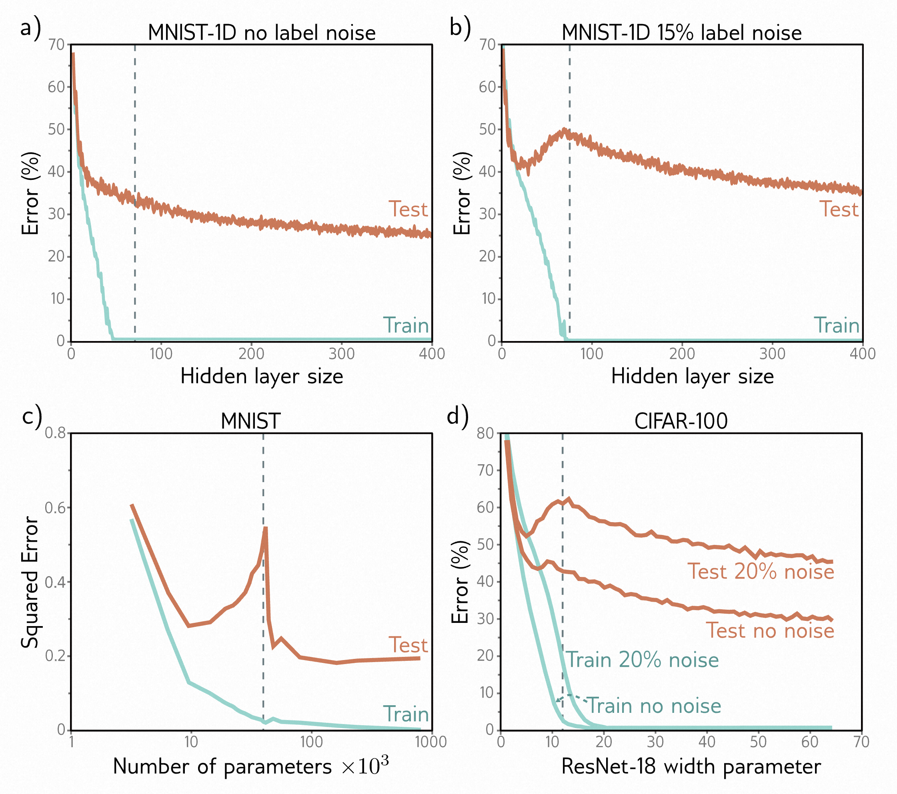

# 本章目录

- [本章目录](#本章目录)
- [第8章 测量性能 - Measuring performance](#第8章-测量性能---measuring-performance)
  - [8.1 训练一个简单的模型 - Training a simple model](#81-训练一个简单的模型---training-a-simple-model)
  - [8.2 误差的来源 - Sources of error](#82-误差的来源---sources-of-error)
    - [8.2.1 噪声、偏差和方差 - Noise, bias, and variance](#821-噪声偏差和方差---noise-bias-and-variance)
    - [8.2.2 测试误差的数学表达式 - Mathematical formulation of test error](#822-测试误差的数学表达式---mathematical-formulation-of-test-error)
  - [8.3 减少误差 - Reducing error](#83-减少误差---reducing-error)
    - [8.3.1 减少方差 - Reducing variance](#831-减少方差---reducing-variance)
    - [8.3.2 减少偏差 - Reducing bias](#832-减少偏差---reducing-bias)
    - [8.3.3 偏差-方差权衡 - Bias-variance trade-off](#833-偏差-方差权衡---bias-variance-trade-off)
  - [8.4 双下降 - Double descent](#84-双下降---double-descent)
    - [8.4.1 解释 - Explanation](#841-解释---explanation)
  - [8.5 选择超参数 - Choosing hyperparameters](#85-选择超参数---choosing-hyperparameters)
  - [8.6 总结 - Summary](#86-总结---summary)
  - [8.7 注意事项 - Notes](#87-注意事项---notes)
  - [8.8 问题 - Problems](#88-问题---problems)

# 第8章 测量性能 - Measuring performance

前几章介绍了神经网络模型、损失函数和训练算法。本章将讨论如何测量训练模型的性能。具有足够容量（即隐藏单元的数量）的神经网络模型通常在训练数据上表现完美。然而，这并不一定意味着它能够很好地泛化到新的测试数据上。

在本章，我们会了解测试误差有三个明显的原因，它们的相对贡献取决于（i）任务固有的不确定性，（ii）训练数据的数量，以及（iii）模型的选择。后者的依赖性引发了超参数搜索的问题。我们将讨论如何选择模型的超参数（例如隐藏层的数量和每个隐藏层的隐藏单元数量）以及学习算法的超参数（例如学习率和批量大小）。

## 8.1 训练一个简单的模型 - Training a simple model

我们使用 MNIST-1D 数据集（图[8.1]()）来探索模型的性能。该数据集包含十个类别 $ y \in \{0, 1, \ldots, 9\} $ ，表示数字0-9。数据是从每个数字的1D模板中派生而来的。每个数据示例 $ x $ 是通过随机变换其中一个模板并添加噪声来创建的。完整的训练数据集 $ \{x_i, y_i\} $ 包含 $ I = 4000 $ 个训练示例，每个示例由表示40个位置的水平偏移的40个维度 $ D_i $ 组成。十个类别在数据生成过程中均匀抽取，因此每个类别有400个示例。

我们使用一个具有 $ D_i = 40 $ 个输入和 $ D_o = 10 $ 个输出的网络，通过softmax函数传递以产生类别概率（参见第[5.5]()节）。网络有两个隐藏层，每个隐藏层有 $ D = 100 $ 个隐藏单元。使用批量大小为100和学习率为0.1的随机梯度下降进行训练，训练步骤为6000步（150个时期），使用多类交叉熵损失函数（方程[5.24]()）。图[8.2]()显示了随着训练的进行，训练误差逐渐减小。大约在4000步后，训练数据被完美分类。训练损失也逐渐减小，最终趋近于零。

然而，这并不意味着分类器是完美的；模型可能已经记住了训练集，但无法预测新的示例。为了估计真实的性能，我们需要一个单独的*测试集*，其中包含输入/输出对 $ \{x_i, y_i\} $ 。为此，我们使用相同的过程生成了1000个额外的示例。图[8.2a]()还显示了这些测试数据的错误率随训练步骤的变化情况。随着训练的进行，错误率逐渐减小，但仅降低到约40%。这比90%的随机错误率要好，但远远不及训练集的表现；模型在测试数据上的*泛化*能力不强。

> 图8.1 MNIST-1D。
>
> - a) 10个类别 $ y \in\{ 0, \ldots, 9\}$的模板，基于数字0-9。
> - b) 训练示例 $ x $ 通过随机变换模板和
> - c) 添加噪声来创建。
> - d) 转换后的模板的水平偏移然后在40个垂直位置上进行采样。改编自([Greydanus](), [2020]())

测试损失（图 [8.2b]()）在前 1500 个训练步骤中减小，但之后又开始增加。此时，测试错误率相对稳定；模型产生相同的错误，但置信度增加。这降低了正确答案的概率，从而增加了负对数似然。这种置信度增加是 softmax 函数的副作用；为了使训练数据的概率接近于 1（参见图 [5.10]()），预 softmax 激活被推向越来越极端的值。

> 图8.2 MNIST-1D结果。
>
> - a) 错误率作为训练步骤的函数。训练集的错误率降低到零，但测试集的错误率没有降低到40%以下。该模型在新的测试数据上的泛化能力不强。
> - b) 损失作为训练步骤的函数。训练损失稳步减小至零。测试损失起初减小，但随后增加，因为模型对其（错误）预测的置信度越来越高。

## 8.2 误差的来源 - Sources of error

我们现在来考虑模型无法泛化时出现的误差来源。为了更容易理解，我们回到一个一维线性最小二乘回归问题，我们确切地知道地面真实数据是如何生成的。图[8.3]()展示了一个准正弦函数；训练数据和测试数据都是通过在区间 $[0, 1]$ 中采样输入值，经过这个函数，并添加固定方差的高斯噪声来生成的。

> 图8.3 回归函数。实线表示真实函数。为了生成 $ I $ 个训练示例 $ \{x_i, y_i\} $ ，输入空间 $ x \in [0, 1] $ 被分成 $ I $ 个相等的段，并在每个段内从均匀分布中抽取一个样本 $ x_i $ 。相应的值 $ y_i $ 通过在 $ x_i $ 处评估函数并添加高斯噪声来创建（灰色区域显示2个标准差）。测试数据以相同的方式生成。

我们将一个简化的浅层神经网络拟合到这些数据上（图[8.4]()）。连接输入层和隐藏层的权重和偏置被选择得使得函数的“拐点”均匀分布在区间上。如果有 $  D  $ 个隐藏单元，那么这些拐点将在 $ 0, 1/D, 2/D, \ldots, (D - 1)/D $ 处。这个模型可以表示在区间 $ [0, 1] $ 中具有 $  D  $ 个等大小区域的分段线性函数。除了易于理解之外，这个模型还有一个优点，即可以通过闭式形式进行拟合，而不需要随机优化算法（参见问题[8.3]()）。因此，在训练过程中，我们可以保证找到损失函数的全局最小值。

> 图8.4 简化的神经网络，有三个隐藏单元。
>
> - a) 输入层和隐藏层之间的权重和偏置是固定的（虚线箭头）。
> - b-d) 它们被选择得使得隐藏单元的激活具有斜率为1，并且它们的拐点在区间上均匀分布，拐点分别为 $  x = 0, x = 1/3  $ 和 $  x = 2 / 3  $ 。修改剩余的参数 $  ϕ = \{β, ω_{1}, ω_{2}, ω_{3}\}  $ 可以创建任何在 $  x ∈ [0, 1]  $ 上具有拐点在 $ 1/3 $ 和 $ 2/3 $ 处的分段线性函数。
> - e-g) 三个示例函数，具有不同的参数 $  ϕ  $ 的值。

### 8.2.1 噪声、偏差和方差 - Noise, bias, and variance

存在三种可能的误差来源，分别称为*噪声、偏差和方差*（图[8.5]()）：

**噪声** 数据生成过程中包含噪声的添加，因此对于每个输入 $ x $ ，存在多个可能的有效输出 $ y $ （图[8.5a]()）。这种误差来源对于测试数据是无法克服的。需要注意的是，这并不一定限制训练性能；在训练过程中，我们很可能不会看到相同的输入 $ x $ 两次，因此仍然有可能完美地拟合训练数据。

噪声可能是由于数据生成过程中存在真正的随机元素，因为一些数据被错误标记，或者因为存在未观察到的进一步解释变量。在罕见的情况下，噪声可能不存在；例如，一个网络可能近似一个确定性函数，但需要大量计算才能评估。然而，噪声通常是可能的测试性能的根本限制。

**偏差** 第二个潜在的误差来源可能是因为模型不够灵活，无法完美地拟合真实函数。例如，三区域神经网络模型无法精确描述准正弦函数，即使参数选择最佳（图[8.5b]()）。这被称为*偏差*。

**方差** 我们有限的训练样本，无法区分基础函数中的系统变化和基础数据中的噪声。当我们拟合一个模型时，我们无法得到对真实基础函数的最接近的近似。实际上，对于不同的训练数据集，结果每次都会稍有不同。拟合函数中的这种额外的变异性被称为*方差*（图[8.5c]()）。在实践中，由于随机学习算法的存在，可能还会有额外的方差，这些算法不一定每次都收敛到相同的解。

> 图8.5 测试误差的来源。
>
> - a) 噪声。数据生成是有噪声的，所以即使模型完全复制了真实的基础函数（黑线），测试数据中的噪声（灰色点）意味着仍然会存在一些误差（灰色区域表示两个标准差）。
> - b) 偏差。即使具有最佳参数，三区域模型（青色线）也无法完全拟合真实函数（黑线）。这种偏差是另一种误差来源（灰色区域表示有符号误差）。
> - c) 方差。在实践中，我们只有有限的带噪声的训练数据（橙色点）。当我们拟合模型时，我们不能从面板(b)中恢复出最佳的函数，而是得到一个略有不同的函数（青色线），它反映了训练数据的特殊性。这提供了额外的误差来源（灰色区域表示两个标准差）。图[8.6]()展示了如何计算这个区域。
>

### 8.2.2 测试误差的数学表达式 - Mathematical formulation of test error

我们现在将噪声、偏差和方差的概念数学化。考虑一个一维回归问题，数据生成过程中存在方差为 $ σ^{2} $ 的加性噪声（例如，图[8.3]()）；我们可以观察到相同输入 $ x $ 的不同输出 $ y $ ，因此对于每个 $ x $ ，都存在一个分布 $ Pr(y|x) $ ，其期望值（均值）为 $ µ[x] $ 。

$$
\mu[x]=\mathbb{E}_y[y[x]]=\int y[x]Pr(y|x)dy.
 \tag{8.1}
$$

并且固定噪声 $ σ^{2}=\mathbb{E}_{y}[(µ[x]-y[x])^{2}] $ 。这里我们使用 $ y[x] $ 的符号来指定我们考虑的是给定输入位置 $ x $ 处的输出 $ y $ 。

现在考虑在位置 $ x $ 处的模型预测 $ f[x,ϕ] $ 与该位置观察到的值 $ y[x] $ 之间的最小二乘损失。

$$
\begin{align}L[x]
&=\quad\left(\mathrm{f}[x,\phi]-y[x]\right)^2\\
&=\quad\left(\left(\mathrm{f}[x,\phi]-\mu[x]\right)+\left(\mu[x]-y[x]\right)\right)^2\\
&=\quad\left(\mathrm{f}[x,\phi]-\mu[x]\right)^2+2\left(\mathrm{f}[x,\phi]-\mu[x]\right)\left(\mu[x]-y[x]\right)+\left(\mu[x]-y[x]\right)^2\end{align}
\tag{8.2}
$$

在第二行中，我们在平方项中添加和减去了基础函数的均值 $ µ[x] $ ，在第三行中，我们展开了平方项。

基础函数是随机的，因此这个损失取决于我们观察到的特定 $ y[x] $ 。期望损失是

$$
\begin{array}{rcl}\mathbb{E}_y\big[L[x]\big]&=&\mathbb{E}_y\big[\big(\mathrm{f}[x,\phi]-\mu[x]\big)^2+2\big(\mathrm{f}[x,\phi]-\mu[x]\big)\big(\mu[x]-y[x]\big)+\big(\mu[x]-y[x]\big)^2\bigg]\\&=&\big(\mathrm{f}[x,\phi]-\mu[x]\big)^2+2\big(\mathrm{f}[x,\phi]-\mu[x]\big)\big(\mu[x]-\mathbb{E}_y\left[y[x]\right]\big)+\mathbb{E}_y\big[(\mu[x]-y[x])^2\big]\\&=&\big(\mathrm{f}[x,\phi]-\mu[x]\big)^2+2\big(\mathrm{f}[x,\phi]-\mu[x]\big)\cdot0+\mathbb{E}_y\big[\big(\mu[x]-y[x]\big)^2\bigg]\\&=&\big(\mathrm{f}[x,\phi]-\mu[x]\big)^2+\sigma^2\end{array}
\tag{8.3}
$$

我们利用期望的运算法则。在第二行中，我们展开了期望算子，并将其中不依赖于 $ y [x] $ 的项移除；在第三行中，我们将 $ \mathbb{E}[y[x]]=µ[x] $代入，因此第二项为零。最后，在第四行中，我们代入了噪声 $ σ^{2} $ 的定义。我们可以看到，期望损失被分解为两个项：第一个项是模型与真实函数均值之间的平方偏差，第二个项是噪声。

第一项可以进一步分为偏差和方差。模型 $ f[x,ϕ] $ 的参数 $ ϕ $ 取决于训练数据集 $ \mathcal{D}=\{x_{i},y_{i}\} $ ，因此更准确地说，我们应该写成 $ f[x,ϕ[\mathcal{D}]] $ 。训练数据集是从数据生成过程中随机抽取的样本；使用不同的训练数据样本，我们将学习到不同的参数值。因此，对于所有可能的数据集D，期望模型输出 $ f_{µ}[x] $ 为

$$
\mathrm{f}_{\mu}[x]=\mathbb{E}_{\mathcal{D}}\left[\mathrm{f}[x,\boldsymbol{\phi}[\mathcal{D}]]\right]
 \tag{8.4}
$$

回到方程[8.3]()的第一项，我们添加和减去 $ f_{µ}[x] $ 并展开。

$$
\begin{aligned}\left(\mathrm{f}[x,\phi[\mathcal{D}]]-\mu[x]\right)^2\\&=\left(\left(\mathrm{f}[x,\phi[\mathcal{D}]]-\mathrm{f}_\mu[x]\right)+\left(\mathrm{f}_\mu[x]-\mu[x]\right)\right)^2\\&=\left(\mathrm{f}[x,\phi[\mathcal{D}]]-\mathrm{f}_\mu[x]\right)^2+2\left(\mathrm{f}[x,\phi[\mathcal{D}]]-\mathrm{f}_\mu[x]\right)\left(\mathrm{f}_\mu[x]-\mu[x]\right)+\left(\mathrm{f}_\mu[x]-\mu[x]\right)^2\end{aligned}
 \tag{8.5}
$$

然后，我们对训练数据集 $ \mathcal{D} $ 进行期望。

$$
\mathbb{E}_{\mathcal{D}}\Big[\left(\mathrm{f}[x,\phi[\mathcal{D}]]-\mu[x]\right)^2\Big]=\mathbb{E}_{\mathcal{D}}\Big[\left(\mathrm{f}[x,\phi[\mathcal{D}]]-\mathrm{f}_{\mu}[x]\right)^2\Big]+\left(\mathrm{f}_{\mu}[x]-\mu[x]\right)^2
\tag{8.6}
$$

在这里，我们使用了与方程[8.3]()类似的步骤进行简化。最后，我们将这个结果代入方程[8.3]()。

$$
\mathbb{E}_{\mathcal{D}}\Big[\mathbb{E}_{y}[L[x]]\Big]=\underbrace{\mathbb{E}_{\mathcal{D}}\Big[\big(\mathrm{f}[x,\phi[\mathcal{D}]]-\mathrm{f}_{\mu}[x]\big)^2\Big]}_{\mathrm{方差}}+\underbrace{\left(\mathrm{f}_{\mu}[x]-\mu[x]\right)^2}_{\mathrm{偏差}}+\underbrace{\sigma^2}_{\mathrm{噪声}}
\tag{8.7}
$$

## 8.3 减少误差 - Reducing error

在前一节中，我们看到测试误差由三个来源造成：噪声、偏差和方差。噪声部分是必然存在的，我们无法绕过它，它代表了模型性能的基本限制。然而，我们可以减少其他两个项。

### 8.3.1 减少方差 - Reducing variance

回想一下，方差是由有限的噪声训练数据引起的。将模型拟合到两个不同的训练集会得到略有不同的参数。因此，我们可以通过增加训练数据的数量来减少方差。这样可以平均掉固有的噪声，并确保输入空间得到充分采样。

图[8.6]()显示了使用6、10和100个样本进行训练的效果。对于每个数据集大小，我们展示了三个训练数据集的最佳拟合模型。只有六个样本时，每次拟合的函数都非常不同：方差很大。随着样本数量的增加，拟合模型变得非常相似，方差减小。通常情况下，增加训练数据几乎总是能提高测试性能。

> 图8.6 通过增加训练数据减少方差。
>
> - a-c) 将三区域模型拟合到三个不同的随机抽样的六个点的数据集上。每次拟合的模型都有很大的不同。
> - d) 我们重复这个实验多次，并绘制平均模型预测（青色线）和模型预测的方差（灰色区域显示两个标准差）。
> - e-h) 我们进行相同的实验，但这次使用大小为十的数据集。预测的方差减小了。
> - i-l) 我们使用大小为100的数据集重复这个实验。现在拟合的模型总是相似的，方差很小。

### 8.3.2 减少偏差 - Reducing bias

偏差项是由模型无法描述真实的基础函数引起的。这表明我们可以通过使模型更加灵活来减少这种误差。通常情况下，这是通过增加模型的*容量*来实现的。对于神经网络来说，这意味着增加更多的隐藏单元或隐藏层。

在简化模型中，增加容量相当于增加更多的隐藏单元，使区间 $[0, 1]$ 分成更多的线性区域。图[8.7a-c]()显示了这确实减少了偏差；当我们将线性区域的数量增加到十个时，模型变得足够灵活，能够紧密拟合真实函数。

> 图8.7 偏差和方差作为模型容量的函数。
>
> - a-c) 随着玩具模型的隐藏单元数量增加，线性区域的数量增加，模型能够紧密拟合真实函数；偏差（灰色区域）减小。
> - d-f) 不幸的是，增加模型容量会增加方差项（灰色区域）。这被称为偏差-方差权衡。
>

### 8.3.3 偏差-方差权衡 - Bias-variance trade-off

然而，图[8.7d-f]()显示了增加模型容量的一个意外副作用。对于一个固定大小的训练数据集，方差项随着模型容量的增加而增加。因此，增加模型容量并不一定能减少测试误差。这被称为*偏差-方差权衡*。

图[8.8]()探讨了这一现象。

- 在面板a-c)中，我们将简化的三区域模型拟合到三个不同的包含十五个点的数据集上。尽管数据集不同，最终的模型基本相同；数据集中的噪声在每个线性区域中大致平均。
- 在面板d-f)中，我们将一个具有十个区域的模型拟合到相同的三个数据集上。这个模型具有更大的灵活性，但这是不利的；模型确实更好地拟合了数据，训练误差会更低，但额外的描述能力大部分用于建模噪声。这种现象被称为*过拟合*。

> 图 8.8 过拟合。
>
> - a-c) 将一个具有三个区域的模型拟合到三个不同的包含十五个数据点的数据集上。在这三种情况下的结果都相似（即方差较低）。
> - d-f) 将一个具有十个区域的模型拟合到相同的数据集上。额外的灵活性并不一定会产生更好的预测结果。虽然这三个模型每个都能更好地描述训练数据，但它们并不一定更接近真实的基础函数（黑色曲线）。相反，它们过度拟合了数据，描述了噪声，并且方差（拟合曲线之间的差异）较大。

我们已经看到，对于一个固定大小的训练数据集，随着模型容量的增加，偏差会减小，但方差会增加。这表明存在一个最佳容量，其中偏差不会太大，方差仍然相对较小。

图[8.9]()显示了当我们增加容量时，这些项在玩具模型中的数值变化，使用了图[8.8]()中的数据。对于回归模型，总期望误差是偏差和方差的总和，当模型容量为四时（即四个隐藏单元和四个线性区域），这个总和最小。

> 图8.9 偏差-方差权衡。根据方程[8.7]()中的偏差和方差项，绘制了在简化模型中使用来自图[8.8]()的训练数据的模型容量（隐藏单元/线性区域数量）的函数。随着容量的增加，偏差（实线橙色线）减小，但方差（实线青色线）增加。当容量为四时，这两个项的和（虚线灰色线）最小化。

## 8.4 双下降 - Double descent

在前一节中，我们研究了模型容量增加时的偏差-方差权衡。现在让我们回到MNIST-1D数据集，看看这在实践中是否发生。我们使用10,000个训练样本，在另外5,000个样本上进行测试，并在模型中增加容量（参数数量）时检查训练和测试性能。我们使用Adam优化器和学习率为0.005，在4000个步骤中使用10,000个样本的完整批次进行训练。

图[8.10a]()显示了一个具有两个隐藏层的神经网络的训练和测试误差随隐藏单元数量增加的情况。随着容量的增加，训练误差减小并迅速接近零。垂直虚线表示模型具有与训练样本数量相同的参数数量的容量，但在此之前，模型已经记住了数据集。随着我们增加模型容量，测试误差减小，但并没有像偏差-方差权衡曲线预测的那样增加；它继续减小。

在图[8.10b]()中，我们重复了这个实验，但这次我们随机化了15%的训练标签。同样，训练误差减小到零。这次有更多的随机性，模型需要几乎与数据点数量相同的参数来记住数据。测试误差确实显示了典型的偏差-方差权衡，随着容量增加，直到模型完全拟合训练数据。然而，然后它做了一些意外的事情；它开始再次减小。事实上，如果我们增加足够的容量，测试损失会降低到低于曲线的第一部分达到的最小水平。

这种现象被称为*双下降*。对于一些数据集，如**MNIST**，使用原始数据就可以出现这种现象（图[8.10c]()）。对于其他数据集，如**MNIST-1D**和**CIFAR-100**（图[8.10d]()），当我们给标签添加噪声时，这种现象就会出现或变得更加突出。

曲线的第一部分被称为*经典*或*欠参数化区域*，第二部分被称为*现代*或*过参数化区域*。误差增加的中间部分被称为*临界*区域。

> 图8.10 双下降。
>
> - a) 在MNIST-1D上，对于一个具有两个隐藏层的网络，随着每层隐藏单元（因此参数）的数量增加，训练和测试损失。当参数的数量接近训练示例的数量（垂直虚线）时，训练损失减少到零。测试误差没有显示预期的偏差-方差权衡，而是在模型记住数据集之后继续减小。
> - b) 在训练数据更加嘈杂的情况下重复相同的实验。同样，训练误差减少到零，尽管现在需要几乎与训练点一样多的参数来记住数据集。测试误差显示了预测的偏差/方差权衡；随着容量的增加，它减小，但在接近训练数据完全记住的点附近再次增加。然而，它随后再次减小，并最终达到更好的性能水平。这被称为双下降。根据损失、模型和数据中的噪声量，双下降模式在许多数据集上可以以不同程度地观察到。
> - c) 来自[Belkin et al]()的浅层神经网络在MNIST上的结果。([2019]() )。
> - d) 来自[Nakkiran et al]()的ResNet18网络在CIFAR-100上的结果。详细信息请参见原始论文。

### 8.4.1 解释 - Explanation

双下降的发现是最近的、出乎意料的，也有些令人困惑。它是两个现象的相互作用的结果。

- 首先，当模型的容量刚好足够记住数据时，测试性能会暂时变差。
- 其次，即使训练性能完美，测试性能仍然随着容量的增加而继续提高。

第一个现象正如偏差-方差权衡所预测的那样。第二个现象却令人困惑，在过参数化的情况下，性能为什么应该更好，因为在这种情况下甚至没有足够的训练数据点来唯一约束模型参数。

为了理解为什么随着添加更多参数，性能会继续提高，需要注意一旦模型具有足够的容量将训练损失几乎降至零，模型几乎完美地拟合了训练数据。这意味着进一步增加的容量不能帮助模型更好地拟合训练数据；任何变化都必须发生在训练点之间。模型在数据点之间外推时优先选择一种解决方案而不是另一种解决方案的倾向被称为其**归纳偏差**。

模型在数据点之间的行为是关键的，因为在高维空间中，训练数据非常稀疏。MNIST-1D数据集有40个维度，我们使用了1万个示例进行训练。如果这看起来是足够的数据，考虑一下如果我们将每个输入维度量化为10个区间，会发生什么。总共将有 $  10^{40}  $ 个区间，仅由 $  10^{5}  $ 个示例约束。即使进行这种粗糙的量化，每 $  10^{35}  $ 个区间中只有一个数据点！高维空间的体积倾向于压倒训练点的数量，这被称为**维度灾难**。

这意味着在高维问题中，可能会更像图[8.11a]()中所示，输入空间的小区域之间存在着显著的间隔。对于“双下降”的假设解释是随着我们增加模型的容量，它在最近的数据点之间插值的平滑程度越来越高。在缺乏关于训练点之间发生的情况的信息时，假设平滑性是合理的，并且很可能对新数据进行合理的泛化。

> 图8.11 增加容量（隐藏单元）允许在稀疏数据点之间进行更平滑的插值。
>
> - a) 考虑这样一种情况，训练数据（橙色圆圈）是稀疏的；中心区域没有数据示例来约束模型模仿真实函数（黑色曲线）。
> - b) 如果我们使用足够的容量来拟合训练数据（青色曲线），那么模型必须扭曲自己以通过训练数据，输出的预测将不会是平滑的。
> - c-f) 然而，当我们增加隐藏单元时，模型有能力在数据点之间进行更平滑的插值（每种情况下绘制的最平滑曲线）。然而，与此图中不同，它并不是必须这样做。

这个论点是有道理的。显然，随着我们增加模型的容量，它将有能力创建更平滑的函数。图[8.11b-f]展示了随着隐藏单元数量的增加，仍然通过数据点的最平滑函数。当参数的数量非常接近训练数据示例的数量（图[8.11b]），模型被迫扭曲自己以完全拟合训练数据，导致预测结果不稳定。这解释了为什么双下降曲线中的峰值如此明显。随着我们增加隐藏单元，模型有能力构建更平滑的函数，这些函数很可能对新数据具有更好的泛化能力。

然而，这并不能解释为什么过参数化的模型应该产生平滑的函数。图[8.12]展示了由具有50个隐藏单元的简化模型创建的三个函数。在每种情况下，模型完全拟合数据，因此损失为零。如果过参数化双下降现象是由于增加平滑性而解释的，那么到底是什么促使了这种平滑性呢？

> 图8.12 正则化。
>
> - a-c) 这三条拟合曲线都恰好通过数据点，所以每条曲线的训练损失为零。然而，我们可以预期，面板(a)中的平滑曲线在泛化到新数据时比面板(b)和(c)中的不稳定曲线更好。任何使模型偏向具有类似训练损失子集的因素都被称为正则化器。人们认为，神经网络的初始化和/或拟合具有隐式的正则化效果。因此，在过参数化的情况下，会鼓励出现更合理的解，比如面板(a)中的解。

这个问题的答案尚不确定，但有两种可能性。首先，网络初始化可能会鼓励平滑性，并且模型在训练过程中从未偏离平滑函数的子域。其次，训练算法可能以某种方式“偏好”收敛到平滑函数。任何偏向于等效解集合的因素都被称为正则化器，因此一种可能性是训练算法作为隐式正则化器（见第[9.2]节）起作用。

## 8.5 选择超参数 - Choosing hyperparameters

在前一节中，我们讨论了模型容量对测试性能的影响。不幸的是，在欠参数化的情况下，我们既无法获得偏差（需要了解真实的基础函数），也无法获得方差（需要多次独立采样的数据集来估计）。在过参数化情况下，我们无法确定在测试误差停止改进之前应该添加多少容量。这引发了一个问题，即在实践中应该如何选择模型容量。

对于深度网络，模型容量取决于隐藏层的数量、每层的隐藏单元数量以及我们尚未介绍的架构的其他方面。此外，学习算法的选择和任何相关参数（学习率等）也会影响测试性能。这些元素统称为**超参数**。寻找最佳超参数的过程称为**超参数搜索**，或者（当专注于网络结构时）**神经架构搜索**。

通常情况下，超参数是通过经验选择的；我们在相同的训练集上使用不同的超参数训练多个模型，测量它们的性能，并保留最佳模型。然而，我们不会在测试集上测量它们的性能；这可能会导致这些超参数恰好适用于测试集，但不能泛化到其他数据。相反，我们引入一个称为*验证集*的第三个数据集。对于每个超参数的选择，我们使用训练集训练相应的模型，并在验证集上评估性能。最后，我们选择在验证集上表现最好的模型，并在测试集上测量其性能。原则上，这应该给出一个合理的真实性能估计。

超参数空间通常比参数空间小，但仍然太大，无法穷举尝试每种组合。不幸的是，许多超参数是离散的（例如，隐藏层的数量），而其他超参数可能是相互条件的（例如，只有在存在十个或更多层时，我们才需要指定第十个隐藏层中的隐藏单元数量）。因此，我们不能像学习模型参数那样依赖于梯度下降方法。超参数优化算法会智能地对超参数空间进行采样，取决于先前的结果。由于我们必须为每个超参数组合训练整个模型并测量验证性能，所以这个过程计算上是昂贵的。

## 8.6 总结 - Summary

为了衡量性能，我们使用一个单独的测试集。在这个测试集上保持性能的程度被称为泛化能力。测试误差可以通过三个因素来解释：噪声、偏差和方差。在最小二乘损失的回归问题中，它们以加法的方式组合。增加训练数据可以减少方差。当模型容量小于训练样本数量时，增加容量会减少偏差但增加方差。这被称为偏差-方差权衡，存在一个容量使得权衡最优。

然而，这与容量增加时性能改善的趋势相平衡，即使参数超过训练样本。这两个现象共同构成了双下降曲线。人们认为，在过参数化的“过参数化情况”下，模型在训练数据点之间的插值更加平滑，尽管目前尚不清楚是什么驱动了这一点。为了选择出较优的容量和其他模型和训练算法的超参数，我们可以拟合多个模型，并使用一个单独的验证集评估它们的性能。

## 8.7 注意事项 - Notes

**偏差-方差权衡：** 我们已经证明了使用最小二乘损失函数的回归问题的测试误差可以分解为噪声、偏差和方差三个项的和。这些因素在使用其他损失函数的模型中也存在，但它们的相互作用通常更加复杂（Friedman, 1997; Domingos, 2000）。对于分类问题，有一些反直觉的预测；例如，如果模型在输入空间的某个区域中偏向于选择错误的类别，增加方差可以提高分类率，因为这会将一些预测推到阈值以上以正确分类。

**交叉验证：** 我们看到，将数据分为三部分是常见的做法：训练数据（用于学习模型参数）、验证数据（用于选择超参数）和测试数据（用于估计最终性能）。这种方法被称为交叉验证。然而，这种划分可能会在数据示例总数有限的情况下引起问题；如果训练示例的数量与模型容量相当，那么方差将会很大。

缓解这个问题的一种方法是使用K折交叉验证。训练和验证数据被划分为K个不相交的子集。例如，我们可以将这些数据分为五个部分。我们对五个排列中的每一个使用四个进行训练，用第五个进行验证，并根据平均验证性能选择超参数。最终的测试性能是使用具有最佳超参数的五个模型的预测的平均值在完全不同的测试集上评估的。这个想法有很多变种，但它们有一个共同的目标，即使用更大比例的数据来训练模型，从而减少方差。

**容量：** 我们在非正式地使用术语“容量”来表示模型中的参数或隐藏单元的数量（因此间接地表示模型适应递增复杂性函数的能力）。当我们考虑到优化算法可能无法达到所有这些解时，剩下的是“有效容量”。

Vapnik-Chervonenkis（VC）维度是容量的一个更正式的度量。它是一个二元分类器可以任意标记的最大训练示例数。Bartlett等人（2019）根据层数和权重的数量推导出VC维度的上下界。容量的另一种度量是Rademacher复杂度，它是分类模型（具有最优参数）对具有随机标签的数据的期望经验性能。Neyshabur等人（2017）根据Rademacher复杂度推导出广义误差的下界。

**双下降：** “双下降”一词是由Belkin等人（2019）创造的，他们证明了对于两层神经网络和随机特征，测试误差在过参数化的情况下再次下降。他们还声称这种现象在决策树中也发生，尽管Buschjäger和Morik（2021）随后提供了相反的证据。Nakkiran等人（2021）表明双下降现象在各种过参数化数据集（CIFAR-10、CIFAR-100、IWSLT'14 de-en）、架构（CNNs、ResNets、transformers）和优化器（SGD、Adam）中都存在。当目标标签添加噪声（Nakkiran等人，2021）或使用一些正则化技术（Ishida等人，2020）时，这种现象更加明显。
[Nakkiran等人（2021）]()还提供了实证证据，测试性能取决于*有效模型容量（给定模型和训练方法可以实现零训练误差的最大样本数）*。在这一点上，模型开始致力于平滑插值。因此，测试性能不仅取决于模型，还取决于训练算法和训练时长。当他们研究具有固定容量并增加训练迭代次数的模型时，他们观察到了相同的模式。他们将这种现象称为*逐个epoch的双下降*。[Pezeshki等人（2022）]()以模型中不同特征以不同速度学习的方式对这一现象进行了建模。

双下降现象有一个相当奇怪的预测，即增加训练数据有时可能会导致测试性能变差。考虑一个在曲线的第二个下降部分的过参数化模型。如果我们增加训练数据以匹配模型容量，我们现在将处于新的测试误差曲线的临界区域，测试损失可能会增加。

[Bubeck和Sellke（2021）]()证明了过参数化对于在高维空间中平滑插值数据是必要的。他们展示了参数数量和模型的Lipschitz常数（输出对于小的输入变化的最快变化速度）之间的权衡。关于过参数化机器学习理论的综述可以在[Dar等人（2021）]()中找到。

**维度诅咒：** 随着维度的增加，空间的体积增长得非常快，以至于需要密集采样所需的数据量呈指数增长。这种现象被称为维度诅咒。高维空间具有许多意想不到的特性，因此在基于低维示例进行推理时应谨慎。本书在一维或二维空间中可视化了深度学习的许多方面，但对于这些可视化结果应该持有合理的怀疑态度。

高维空间的一些令人惊讶的特性包括：

- （i）从标准正态分布中随机抽取的两个数据点在原点相对于彼此非常接近（正交）的概率很高。
- （ii）从标准正态分布中抽取的样本到原点的距离大致是恒定的。
- （iii）高维球体（超球体）的大部分体积与其表面相邻（一个常见的比喻是高维橙子的大部分体积在皮中，而不在果肉中）。
- （iv）如果我们将一个单位直径的超球体放入边长为单位长度的超立方体中，那么随着维度的增加，超球体占据的立方体体积比例逐渐减小。由于立方体的体积固定为一，这意味着高维超球体的体积接近于零。
- （v）对于从高维超立方体中均匀分布的随机点，最近点和最远点之间的欧氏距离的比值接近于一。有关更多信息，请参阅[Beyer等人（1999）]()和[Aggarwal等人（2001）]()。

**现实世界的性能：** 在本章中，我们认为可以使用保留的测试集来评估模型性能。然而，如果测试集的统计数据与现实世界的数据不匹配，结果将无法反映出真实世界的性能。此外，现实世界数据的统计特性可能会随时间变化，导致模型变得越来越陈旧，性能下降。这被称为*数据漂移*，意味着部署的模型必须仔细监控。

真实世界性能与测试性能之间存在三个主要原因导致真实世界性能可能比测试性能表明的要差。

- 首先，输入数据 $ x $ 的统计特性可能会发生变化；在训练期间，我们可能没有对函数的某些部分进行充分采样或根本没有采样。这被称为**协变量偏移**。
- 其次，输出数据 $ y $ 的统计特性可能会发生变化；如果某些输出值在训练期间很少出现，那么模型可能会学习在模糊情况下不预测这些值，并且如果它们在真实世界中更常见，就会出现错误。这被称为**先验偏移**。
- 第三，输入和输出之间的关系可能会发生变化。这被称为**概念偏移**。这些问题在[Moreno-Torres et al]()（[2012]()）中进行了讨论。

**超参数搜索：** 寻找最佳超参数是一项具有挑战性的优化任务。测试单个超参数配置是昂贵的；我们必须训练整个模型并测量其性能。我们没有简单的方法来获取导数（即当我们对超参数进行微小改变时性能如何变化）。此外，许多超参数是离散的，因此我们无法使用梯度下降方法。存在多个局部最小值，无法确定我们是否接近全局最小值。噪声水平很高，因为每个训练/验证周期都使用随机训练算法；如果我们使用相同的超参数训练模型两次，我们预期会得到不同的结果。最后，某些变量是条件的，只有在设置其他变量时才存在。例如，第三个隐藏层中的隐藏单元数仅在至少有三个隐藏层时才相关。

一种简单的方法是随机采样空间（[Bergstra & Bengio]()，[2012]()）。然而，对于连续变量，最好建立一个性能模型，将其作为超参数和该函数的不确定性的函数。这可以用来测试不确定性很大的地方（探索空间）或者集中在性能看起来有希望的区域（利用先前的知识）。贝叶斯优化是一种基于高斯过程的框架，正是这样做的，其在超参数搜索中的应用在[Snoek et al]()（[2012]()）中有描述。Beta-Bernoulli赌博机（参见[Lattimore & Szepesvári]()，[2020]()）是描述由离散变量引起的结果不确定性的大致等效模型。

顺序模型配置（SMAC）算法（[Hutter et al]()，[2011]()）可以处理连续、离散和条件参数。基本方法是使用随机森林来建模目标函数，其中树预测的均值是关于目标函数的最佳猜测，它们的方差表示不确定性。另一种完全不同的方法，也可以处理连续、离散和条件参数的组合，是Tree-Parzen估计器（[Bergstra et al.]()，[2011]()）。前面的方法建模了给定超参数的模型性能的概率。相比之下，Tree-Parzen估计器建模了给定模型性能的超参数的概率。
超带(Hyperband)是一种用于超参数优化的多臂赌博策略。它假设存在计算成本较低但近似测量性能的方法（例如，不完全训练）并且可以将其与预算关联起来（例如，通过固定迭代次数进行训练）。首先，随机抽样一些配置并运行，直到预算用完。然后保留最好的一部分运行结果，并将预算乘以1/η。重复此过程直到达到最大预算。这种方法的优点是高效；对于糟糕的配置，它不需要将实验运行到最后。然而，每个样本只是随机选择的，这是低效的。BOHB算法(Falkner等人，2018)将超带的效率与来自树Parzen估计器的更明智的超参数选择相结合，构建了一种更好的方法。

Hyperband（Li [et al.]()，[2017b]()）是一种用于超参数优化的多臂赌博策略。它假设存在计算廉价但近似衡量性能的方法（例如，不完全训练）并且这些方法可以与预算相关联（例如，通过固定迭代次数进行训练）。首先，随机采样一些配置并运行直到预算用尽。然后保留最佳比例 $ η $ 的运行结果，并将预算乘以 1/η。重复此过程直到达到最大预算。这种方法具有高效性的优势；对于糟糕的配置，它不需要将实验运行到结束。然而，每个样本只是随机选择，这是低效的。BOHB 算法（Falkner et al., 2018）将 Hyperband 的高效性与来自 Tree Parzen 估计器的更明智的超参数选择相结合，构建了一种更好的方法。

## 8.8 问题 - Problems

**问题 8.1** 在图[8.2]()中，多类交叉熵训练损失是否会达到零？请解释你的理由。

**问题 8.2** 在图[8.4a]()中的模型的第一层中，我们应该选择哪些权重和偏置的值，以使隐藏单元的响应如图[8.4b-d]()所示？

**问题 8.3** 给定一个训练数据集，包含  $  I  $  个输入/输出对  $  \{x_{i}, y_{i}\}  $ ，请展示如何使用最小二乘损失函数在图[8.4a]()中找到模型的参数  $ \{β, ω_{1}, ω_{2}, ω_{3}\} $ 。

**问题 8.4** 考虑图[8.10b]()中的曲线，在训练一个具有200个隐藏单元的模型时，该模型将具有50,410个参数。如果我们将训练样本的数量从10,000增加到50,410，你预测训练和测试性能会发生什么变化？

**问题 8.5** 考虑模型容量超过训练数据点数量的情况，并且模型足够灵活以将训练损失减少到零。这对于拟合异方差模型有什么影响？请提出一种解决你所确定的任何问题的方法。

**问题 8.6** 证明从一个1000维标准高斯分布中随机抽取的两个点在原点处是正交的，概率很高。

**问题 8.7** 在  $  D  $  维空间中，半径为  $  r  $  的超球体的体积为：

$$
\mathrm{Vol}[r]=\frac{r^D\pi^{D/2}}{\Gamma[D/2+1]},
\tag{8.8}
$$

其中  $ \Gamma[•] $  是伽玛函数。使用斯特林公式证明，当维度增加时，直径为一（半径  $  r = 0.5 $  ）的超球体的体积变为零。

**问题 8.8**∗ 考虑一个半径为  $  r = 1  $  的超球体。找出总体积中位于距离中心最外层 1% 的比例的表达式（即厚度为 0.01 的最外层壳）。证明当维度增加时，这个比例将变为一。

**问题 8.9** 图[8.13c]()显示了随着维度的增加，标准正态分布样本的距离分布。通过从25、100和500维的标准正态分布中进行抽样，并绘制距离中心的直方图，来经验性地验证这一发现。哪种闭合形式的概率分布描述了这些距离？

> 图8.13 典型集合。
>
> - a) 二维标准正态分布。圆圈是从该分布中抽取的四个样本。随着距离中心的增加，概率减小，但在该半径处的空间体积（即相邻均匀圆之间的面积）增加。
> - b) 这些因素相互权衡，使得样本距离中心的直方图具有明显的峰值。
> - c) 在更高维度中，这种效应变得更加极端，观察到的样本接近均值的概率变得非常小。虽然最可能的点在分布的均值处，但*典型样本*位于一个相对较窄的壳中。
